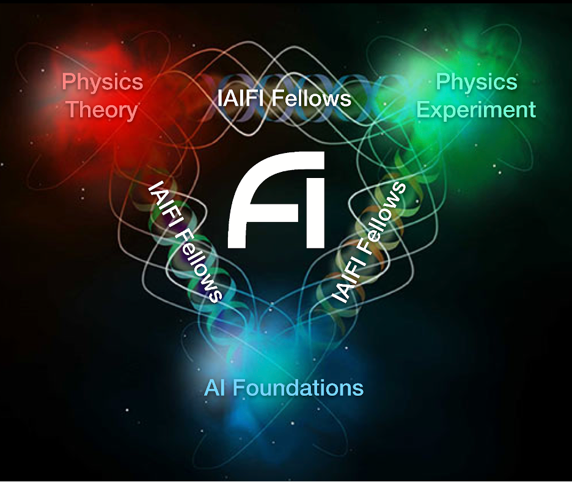

 

The NSF AI Institute for Artificial Intelligence and Fundamental Interactions (IAIFI, pronounced /aɪ-faɪ/) is one of the inaugural NSF AI research institutes. The IAIFI is enabling physics discoveries and advancing foundational AI through the development of novel AI approaches that incorporate first principles from fundamental physics. AI is transforming many aspects of society, including the ways that scientists are pursuing groundbreaking discoveries. For many years, physicists have been at the forefront of applying AI methods to investigate fundamental questions about the Universe. Further progress will require a revolutionary leap in AI, as both the complexity of physics problems and the size of physics datasets continue to grow.

  

The goal of the IAIFI is to develop and deploy the next generation of AI technologies, based on the transformative idea that artificial intelligence can directly incorporate physics intelligence. IAIFI researchers are using these new AI technologies to tackle some of the most challenging problems in physics, from precision calculations of the structure of matter, to gravitational wave detection of merging black holes, to the extraction of new physical laws from noisy data.

IAIFI researchers are also working to transfer these technologies to the broader AI community, since trustworthy AI is as important for physics discovery as it is for other applications of AI in society. To cultivate human intelligence, the IAIFI promotes training, education, and outreach at the intersection of physics and AI. In this way, the IAIFI is advancing physics knowledge – from the smallest building blocks of nature to the largest structures in the Universe – and galvanizing AI research innovation.

*The IAIFI is anchored in the [Laboratory for Nuclear Science](https://web.mit.edu/lns/) at MIT.*

<iframe src="https://docs.google.com/presentation/d/e/2PACX-1vTj25Pm0Ts4yq1Kz89JISu6hGx3D3wK84pcb4jmmiSKOkfExPsXYBPcnuGUX6cpJ7LMMHiq69Bf_DDU/embed?start=false&loop=false&delayms=3000" frameborder="0" width="864" height="512" allowfullscreen="true" mozallowfullscreen="true" webkitallowfullscreen="true"></iframe>

#### FAQ
 * **How can I get more involved with IAIFI?** If you are already a member of IAIFI and are looking to contribute more to IAIFI activities, visit our [Getting Involved page for current members](/get-involved-current.html). If you are not currently a member, visit our [Getting Involved page for prospective members/partners](/get-involved.html).
 * **Where can I view highlights of your research and/or activities?** You can view current research projects on our [Research page](/research.html) and updates on our activities on our [Synergies page](/activities.html). For an overview of highlights, download our [IAIFI Highlights presentation](images/iaifi-highlights.pdf) (last updated December 8, 2021).

#### Graphics

  * IAIFI Logo (Transparent Background):  [Black](images/iaifi-logo-black.pdf),  [White](images/iaifi-logo-white.pdf)
  * IAIFI Logo (Transparent Background, With NSF):  [Black](images/iaifi-nsf-logo-black.pdf),  [White](images/iaifi-nsf-logo-white.pdf)
  * IAIFI Logo (Transparent Background, No Border):  [Black](images/iaifi-logo-black-noborder.pdf),  [White](images/iaifi-logo-white-noborder.pdf)
  * IAIFI Logo (No Transparency, JPEG format): [Black](images/iaifi-logo-black-noborder-hires.jpg)
  * IAIFI Press Image: [Full Size](images/iaifi-pressimage.jpg), [Horizontal Crop](images/iaifi-pressimage-horizontalcrop.jpg)
  * IAIFI Zoom Background: [Download](images/iaifi-zoombackground.jpg)

####  Press Coverage 

  * IAIFI Launch (August 26, 2020):  [NSF](https://www.nsf.gov/news/special_reports/announcements/082620.jsp), [NSF blog](https://beta.nsf.gov/science-matters/new-nsf-ai-research-institutes-push-forward-frontiers-artificial-intelligence), [MIT](https://news.mit.edu/2020/nsf-announces-mit-led-institute-artificial-intelligence-fundamental-interactions-0826), [Harvard](https://www.news.harvard.edu/gazette/story/2020/08/harvard-a-partner-in-20-million-ai-institute/), [Northeastern](https://news.northeastern.edu/2020/08/26/why-you-need-a-computer-to-understand-strings-and-knots/)

#### Social Media
  * [Follow us on Twitter](https://twitter.com/iaifi_news)
  * [Follow us on LinkedIn](https://www.linkedin.com/company/iaifi)

####  Contact

  * Email [IAIFI Management](mailto:iaifi@mit.edu)
  * [GRID page](https://grid.ac/institutes/grid.510603.1) (Note: Page name is in the process of being corrected to "The NSF AI Institute for Artificial Intelligence and Fundamental Interactions")
