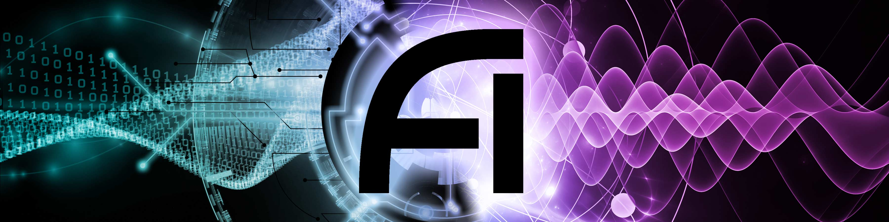

The NSF AI Institute for Artificial Intelligence and Fundamental Interactions (IAIFI, pronouced /aɪ-faɪ/) is one of the inaugural NSF AI research institutes. The IAIFI will enable physics discoveries and advance foundational AI through the development of novel AI approaches that incorporate first principles from fundamental physics. AI is transforming many aspects of society, including the ways that scientists are pursuing groundbreaking discoveries. For many years, physicists have been at the forefront of applying AI methods to investigate fundamental questions about the Universe. Further progress will require a revolutionary leap in AI, as both the complexity of physics problems and the size of physics datasets continue to grow.

The goal of the IAIFI is to develop and deploy the next generation of AI technologies, based on the transformative idea that artificial intelligence can directly incorporate physics intelligence.  IAIFI researchers will use these new AI technologies to tackle some of the most challenging problems in physics, from precision calculations of the structure of matter, to gravitational wave detection of merging black holes, to the extraction of new physical laws from noisy data. IAIFI researchers will also transfer these technologies to the broader AI community, since trustworthy AI is as important for physics discovery as it is for other applications of AI in society. To cultivate human intelligence, the IAIFI will promote training, education, and outreach at the intersection of physics and AI. In this way, the IAIFI will advance physics knowledge – from the smallest building blocks of nature to the largest structures in the Universe – and galvanize AI research innovation.

#### Graphics

  * IAIFI Logo (Transparent Background):  [Black](images/iaifi-logo-black.pdf),  [White](images/iaifi-logo-white.pdf)
  * IAIFI Logo (Transparent Background, No Border):  [Black](images/iaifi-logo-black-noborder.pdf),  [White](images/iaifi-logo-white-noborder.pdf)
  * IAIFI Press Image: [Full Size](images/iaifi-pressimage.jpg), [Horizontal Crop](images/iaifi-pressimage-horizontalcrop.jpg)

####  Press Coverage 

  * IAIFI Launch (August 26, 2020):  [NSF](https://www.nsf.gov/news/special_reports/announcements/082620.jsp), [NSF blog](https://beta.nsf.gov/science-matters/new-nsf-ai-research-institutes-push-forward-frontiers-artificial-intelligence), [MIT](https://news.mit.edu/2020/nsf-announces-mit-led-institute-artificial-intelligence-fundamental-interactions-0826), [Harvard](https://www.news.harvard.edu/gazette/story/2020/08/harvard-a-partner-in-20-million-ai-institute/), [Northeastern](https://news.northeastern.edu/2020/08/26/why-you-need-a-computer-to-understand-strings-and-knots/)
