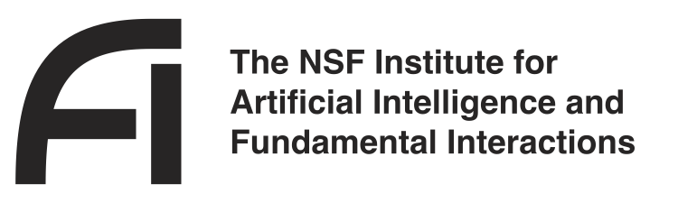

Deep Learning (AI) + Deep Thinking (Physics) = Deeper Understanding

The NSF AI Institute for Artificial Intelligence and Fundamental Interactions (IAIFI, pronounced /aɪ-faɪ/) is one of the inaugural NSF AI research institutes. The IAIFI is enabling physics discoveries and advancing foundational AI through the development of novel AI approaches that incorporate first principles from fundamental physics. The goal of the IAIFI is to advance physics knowledge and galvanize AI research innovation. 

By combining state-of-the-art research with early career talent and a growing AI + physics community in the Boston area and beyond, the IAIFI is enabling researchers to  develop AI technologies to tackle some of the most challenging problems in physics, and transfer these technologies to the broader AI community. Since trustworthy AI is as important for physics discovery as it is for other applications of AI in society, IAIFI researchers are applying physics principles to develop more robust AI tools and to illuminate existing AI technologies. To cultivate human intelligence, the IAIFI promotes training, education, and public engagement at the intersection of physics and AI. In these ways, the IAIFI is fusing deep learning with deep thinking to gain a deeper understanding of our universe and AI.

*The IAIFI is anchored in the [Laboratory for Nuclear Science](https://web.mit.edu/lns/) at MIT.*

## Research

  

    

      

        

          

          
          

            

            Pioneering interdisciplinary
              

              <h4>RESEARCH</h4>
            

          

        

      

    

    

      IAIFI researchers are producing state-of-the-art results through interdisciplinary projects across <a href="/physics-theory-research.html">theoretical physics</a>, <a href="/physics-experiment-research.html">experimental physics</a>, and <a href="/ai-research.html">foundational AI</a>. 
      <ul>
      <li><a href="/research.html">Research Overview and Highlights</a></li>
      <li><a href="/papers.html">Papers from IAIFI researchers</a></li>
      <li><a href="https://github.com/iaifi">Code from IAIFI products</a></li>
      <li><a href="/people.html">Current Researchers</a></li>
      <li><a href="/lightning-talks.html">IAIFI lightning talks</a></li>
    </ul>
    

  

## Talent

  

    

      

        

          

          
          

            

            Empowering the next generation of
              

              <h4>TALENT</h4>
            

          

        

      

    

    

      IAIFI is recruiting and training a talented, promising, and diverse group of students and postdocs, making them experts in AI + Physics.
      <ul>
      <li><a href="/fellows.html">IAIFI Fellowship Program</a></li>
      <li><a href="/current-fellows.html">Current IAIFI Fellows</a></li>
      <li><a href="/phd-summer-school.html">IAIFI Summer School</a></li>
      <li><a href="/ecec.html">Early Career, Equity, and Ethics</a></li>
      <li><a href="/journal-club.html">Journal Club</a></li>
      <li><a href="/education.html">Education</a></li>
      <li><a href="/career-support.html">Career Support</a></li>
      <li><a href="/job-board.html">Job Board</a></li>
      <li><a href="/funding-opportunities.html">Funding Opportunities</a></li>
    </ul>
    

  

## Community

  

    

      

        

          

          
          

            

            Building a dynamic
              

              <h4>COMMUNITY</h4>
            

          

        

      

    

    

    IAIFI is making Cambridge and the surrounding Boston area a 
nexus point for collaborative efforts aimed at advancing both physics and AI.
      <ul>
      <li><a href="/outreach.html">Public Engagement</a></li>
      <li><a href="/partnerships.html">Physics/AI Network</a></li>
      <li><a href="/summer-workshop">IAIFI Summer Workshop</a></li>
      <li><a href="/events.html">IAIFI Colloquia</a></li>
      <li><a href="/seminars.html">IAIFI Seminars</a></li>
      <li><a href="/lightning-talks.html">Lightning Talks</a></li>
      <li><a href="/hackathon.html">Hackathons</a></li>
      <li><a href="/generative-ai-workshop.html">Generative AI Symposium</a></li>
      <li><a href="/industry-partners.html">Industry Partners</a></li>
      <li><a href="/committees.html">Committees</a></li>
    </ul>
    

  

##  Press Coverage 

  * IAIFI Launch (August 26, 2020):  [NSF](https://www.nsf.gov/news/special_reports/announcements/082620.jsp), [NSF blog](https://beta.nsf.gov/science-matters/new-nsf-ai-research-institutes-push-forward-frontiers-artificial-intelligence), [MIT](https://news.mit.edu/2020/nsf-announces-mit-led-institute-artificial-intelligence-fundamental-interactions-0826), [Harvard](https://www.news.harvard.edu/gazette/story/2020/08/harvard-a-partner-in-20-million-ai-institute/), [Northeastern](https://news.northeastern.edu/2020/08/26/why-you-need-a-computer-to-understand-strings-and-knots/)

## Graphics

  * {:.image--sm} **IAIFI Logo**:  [Black PDF](images/iaifi-logo-black.pdf),  [White PDF](images/iaifi-logo-white.pdf), [Black JPEG](images/iaifi-logo-black-noborder-hires.jpg)

  * {:.image--sm}  **IAIFI Logo with NSF**:  [Black PDF](images/iaifi-nsf-logo-black.pdf),  [White PDF](images/iaifi-nsf-logo-white.pdf)

  * {:.image--sm}  **IAIFI Logo with Name**:  [Black PDF](images/iaifi-fullname-logo-black.pdf)
  
  * {:.image--sm}  **IAIFI Logo with NSF with Name**:  [JPEG](images/nsf-iaifi-black-fulltext.png)
  
  * {:.image--sm} **IAIFI Horizontal Fusion**: [JPEG](images/iaifi-pressimage-horizontalcrop.jpg)
  
  * {:.image--sm} **IAIFI Full Size Fusion**:  [JPEG](images/iaifi-pressimage.jpg)
  
  * {:.image--sm}  **IAIFI Zoom Background**:  [JPEG](images/iaifi-zoombackground.jpg)

*Contact [IAIFI Management](mailto:iaifi@mit.edu) if you need graphics in different formats, colors, or sizes.*

##  Contact

  * Email [IAIFI Management](mailto:iaifi@mit.edu)
  * Follow [@iaifi_news on Twitter/X](https://twitter.com/iaifi_news)
  * Connect with [IAIFI on LinkedIn](https://www.linkedin.com/company/iaifi/)
  * [GRID page](https://grid.ac/institutes/grid.510603.1)
