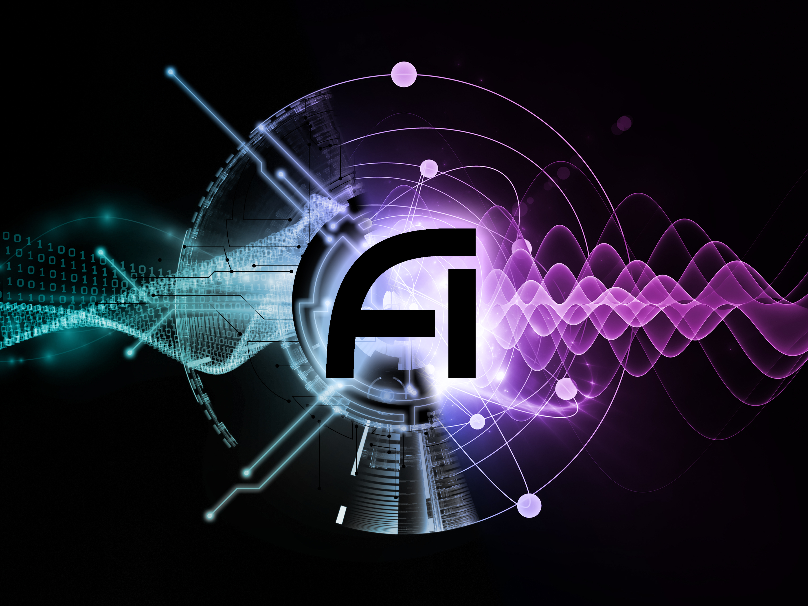

Deep Learning (AI) + Deep Thinking (Physics) = Deeper Understanding

The NSF AI Institute for Artificial Intelligence and Fundamental Interactions (IAIFI, pronounced /aɪ-faɪ/) is one of the inaugural NSF AI research institutes. The IAIFI is enabling physics discoveries and advancing foundational AI through the development of novel AI approaches that incorporate first principles from fundamental physics. The goal of the IAIFI is to advance physics knowledge and galvanize AI research innovation. 

By combining state-of-the-art research with early career talent and a growing AI + physics community in the Boston area and beyond, the IAIFI is enabling researchers to  develop AI technologies to tackle some of the most challenging problems in physics, and transfer these technologies to the broader AI community. Since trustworthy AI is as important for physics discovery as it is for other applications of AI in society, IAIFI researchers are applying physics principles to develop more robust AI tools and to illuminate existing AI technologies. To cultivate human intelligence, the IAIFI promotes training, education, and public engagement at the intersection of physics and AI. In these ways, the IAIFI is fusing deep learning with deep thinking to gain a deeper understanding of our universe and AI.

*The IAIFI is anchored in the [Laboratory for Nuclear Science](https://web.mit.edu/lns/) at MIT.*

## Research

  

    

      

        

          

          
          

            

            Pioneering interdisciplinary
              

              <h4>RESEARCH</h4>
            

          

        

      

    

    

      IAIFI researchers are producing state-of-the-art results through interdisciplinary projects across <b><a href="https://iaifi.org/domain-research.html#foundational-ai">foundational AI</a></b>, <b><a href="https://iaifi.org/domain-research.html#theoretical-physics">theoretical physics</a></b>, <b><a href="https://iaifi.org/domain-research.html#experimental-physics">experimental physics</a></b>, and <b><a href="https://iaifi.org/domain-research.html#astrophysics">astrophysics</a></b>. The projects in these domains are also categorized by cross-cutting themes, which help to utilize a common language and identify opportunities for collaboration: <b>Representation/Manifold Learning</b>; <b>Generative Models</b>; <b>Uncertainty Quantification/Robust AI</b>; <b>Physics-Motivated Optimization</b>; and <b>Reinforcement Learning</b>.
      <ul>
      <li><a href="/research.html">Overview:</a> Includes monthly research highlights</li>
      <li><a href="https://iaifi.org/domain-research.html#foundational-ai">Foundational AI:</a> Overview of projects primarily impacting the Foundational AI domain</li>
      <li><a href="https://iaifi.org/domain-research.html#theoretical-physics">Theoretical Physics:</a> Overview of projects primarily impacting the Theoretical Physics domain</li>
      <li><a href="https://iaifi.org/domain-research.html#experimental-physics">Experimental Physics:</a> Overview of projects primarily impacting the Experimental Physics domain</li>
      <li><a href="https://iaifi.org/domain-research.html#astrophysics">Astrophysics:</a> Overview of projects primarily impacting the Astrophysics domain</li>
      <li><a href="/papers.html">Papers and Code:</a> Links to papers by IAIFI researchers, including code where applicable</li>
      <li><a href="/lightning-talks.html">IAIFI Thematic Discussions:</a> IAIFI member-led discussions organized by cross-cutting theme to facilitate collaboration</li>
    </ul>
    

  

## Talent

  

    

      

        

          

          
          

            

            Empowering the next generation of
              

              <h4>TALENT</h4>
            

          

        

      

    

    

      IAIFI is recruiting and training a <b>talented, promising, and interdisciplinary group of students and postdocs</b>, making them experts in AI + Physics.
      <ul>
      <li><a href="/fellows.html">IAIFI Fellowship Program:</a> Details about the IAIFI Fellowship and opportunities to apply</li>
      <li><a href="/current-fellows.html">IAIFI Fellows:</a> Details about current and past IAIFI Fellows</li>
      <li><a href="/phd-summer-school.html">IAIFI Summer School:</a> Details about our annual Summer School for early career researchers at the intersection of AI and Physics</li>
      <li><a href="/ecec.html">Early Career and Ethics:</a> Details about our approaches to these important topics for the IAIFI community and beyond.</li>
      <li><a href="/journal-club.html">Journal Club:</a> Weekly talks given by early career researchers for early career researchers</li>
      <li><a href="/education.html">Education: Includes details of courses and other university-level education efforts</a></li>
      <li><a href="/career-support.html">Career Support:</a> Advice, resources, and events to help support early career researchers interested in AI+Physics</li>
      <li><a href="/job-board.html">Job Board:</a> Jobs of relevance to the AI+Physics community</li>
      <li><a href="/funding-opportunities.html">Funding Opportunities:</a> Grant, fellowship, and other funding opportunities of relevance to the AI+Physics community</li>
    </ul>
    

  

## Community

  

    

      

        

          

          
          

            

            Building a dynamic
              

              <h4>COMMUNITY</h4>
            

          

        

      

    

    

    IAIFI is making Cambridge and the surrounding Boston area a 
<b>nexus point for collaborative efforts</b> aimed at advancing both physics and AI.
      <ul>
      <li><a href="/outreach.html">Public Engagement:</a> Information about activities and events targeted toward K-12 students and the general public</li>
      <li><a href="/partnerships.html">Physics/AI Network:</a> Information about activities and events aiming to bring together the global AI+Physics community</li>
      <li><a href="/summer-workshop">IAIFI Summer Workshop:</a> Details about our annual Summer Workshop for researchers of all career stages working at the intersection of Physics and AI</li>
      <li><a href="/events.html">IAIFI Colloquia:</a> Twice-per-month talks from global experts in AI+Physics</li>
      <li><a href="/seminars.html">IAIFI Seminars:</a> No longer active, monthly talks from Boston-area experts in AI+Physics</li>
      <li><a href="/hackathon.html">Hackathons:</a> Occasional events for early career researchers to work together on problems in AI+Physics---sometimes in more specific domains</li>
      <li><a href="/industry-partners.html">Industry Partners:</a> Details of our partnerships with various companies in and beyond the Boston area supporting our interdisciplinary efforts</li>
      <li><a href="/committees.html">Committees:</a> Information about various committees that IAIFI members are invited to participate in to help advance IAIFI's strategic goals</li>
    </ul>
    

  

##  Press Coverage 

  * IAIFI Launch (August 26, 2020):  [NSF](https://www.nsf.gov/news/special_reports/announcements/082620.jsp), [NSF blog](https://beta.nsf.gov/science-matters/new-nsf-ai-research-institutes-push-forward-frontiers-artificial-intelligence), [MIT](https://news.mit.edu/2020/nsf-announces-mit-led-institute-artificial-intelligence-fundamental-interactions-0826), [Harvard](https://www.news.harvard.edu/gazette/story/2020/08/harvard-a-partner-in-20-million-ai-institute/), [Northeastern](https://news.northeastern.edu/2020/08/26/why-you-need-a-computer-to-understand-strings-and-knots/)
  
  For press inquiries, email [iaifi@mit.edu](mailto:iaifi@mit.edu)

## Graphics

  * {:.image--sm} **IAIFI Logo**:  [Black PDF](images/iaifi-logo-black.pdf),  [White PDF](images/iaifi-logo-white.pdf), [Black JPEG](images/iaifi-logo-black-noborder-hires.jpg)
  
    * {:.image--sm} **IAIFI Logo**:  [PDF](images/iaifi-logo-square-rainbow.pdf),  [JPEG](images/iaifi-logo-square-rainbow.png)

  * {:.image--sm}  **IAIFI Logo with NSF**:  [Black PDF](images/iaifi-nsf-logo-black.pdf),  [White PDF](images/iaifi-nsf-logo-white.pdf)

  * {:.image--sm}  **IAIFI Logo with Name**:  [Black PDF](images/iaifi-fullname-logo-black.pdf)
  
  * {:.image--sm}  **IAIFI Logo with NSF with Name**:  [Black PDF](images/nsf-iaifi-black-fulltext.pdf)
  
  * {:.image--sm} **IAIFI Horizontal Fusion**: [JPEG](images/iaifi-pressimage-horizontalcrop.jpg)
  
  * {:.image--sm} **IAIFI Full Size Fusion**:  [JPEG](images/iaifi-pressimage.jpg)
  
  * {:.image--sm}  **IAIFI Zoom Background**:  [JPEG](images/iaifi-zoombackground.jpg)

*Contact [IAIFI Management](mailto:iaifi@mit.edu) if you need graphics in different formats, colors, or sizes.*

##  Contact

  * Email [IAIFI Management](mailto:iaifi@mit.edu)
  * Follow [@iaifi_news on X](https://twitter.com/iaifi_news)
  * Connect with [IAIFI on LinkedIn](https://www.linkedin.com/company/iaifi/)
  * [GRID page](https://grid.ac/institutes/grid.510603.1)
