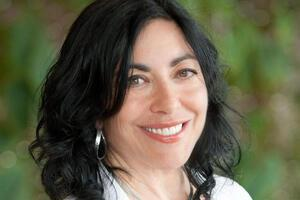
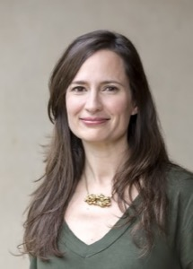

# External Advisory Board

IAIFI's External Advisory Board (EAB) provides project oversight and advice to help ensure that the goals and objectives of the IAIFI are met and also offers guidance toward realizing and honing its vision. The EAB represents a balance of representation in categories contributing to IAIFI’s strategic goals. The EAB includes experts in AI (both industry and academia), Physics Experiment, Physics Theory, and Astrophysics. It also includes experts with experience in Education and Workforce Development, Outreach, institute management, and industry.

## Current Advisors

### Paolo Calafiura, EAB 2023 Chair
**Senior Scientist and Group Lead, Physics and X-Ray Science Computing Group, Lawrence Berkeley National Laboratory**

[Paolo Calafiura](https://dst.lbl.gov/people.php?p=PaoloCalafiura) is a computational physicist in the LBNL Physics and X-Ray Science Computing Group which he also leads. He works on software frameworks, tools and methods for high-energy and nuclear physics experiments. Currently, he is the US Computing and Software operations manager for the ATLAS experiment at CERN, and the PI of the Exa.TrkX project. His research interests include portable data models, distributed workflows scheduling, and pattern recognition methods for noisy experimental data.

 

### Federica Bianco
**Associate Professor, University of Delaware**

[Federica Bianco](https://fbb.space) is an Associate Professor at the University of Delaware (UD) in the Departments of Physics and Astronomy and in the Biden School of Public Policy and Administration and a Resident Faculty in the UD Data Science Institute. Trained as an astrophysicist, she studies lightcurves, time series of light, in astronomy to understand stellar evolution and in the urban environment at the Urban Observatory, where the study of urban lightcurves enables sociological, ecologic, and economic inference. She loves working in interdisciplinary teams and her research extends to data-driven studies in health, geography, and prosecutorial justice. She is the Deputy Project Scientist for Rubin Observatory, a facility designed to conduct the 10-year Legacy Survey of Space and Time, a year synoptic survey that will produce the largest database of astrophysical objects and phenomena to date.

 

### Jennifer Chayes
**Associate Provost, Division of Computing, Data Science, & Society; Dean, School of Information; Professor of EECS, Information, Mathematics, and Statistics University of California, Berkeley**

[Jennifer Chayes](https://data.berkeley.edu/jennifer-chayes) is Associate Provost of the Division of Computing, Data Science, and Society, and Dean of the School of Information. She is Professor of EECS, Information, Mathematics, and Statistics. Before joining Berkeley, she was at Microsoft for over 20 years, where she was a Technical Fellow, and founder and managing director of 3 interdisciplinary labs. Chayes is one of the inventors of the field of graphons, which are widely used for the machine learning of large-scale networks.

 

### Shannon Swilley Greco
**Science Education Senior Program Leader, Princeton Plasma Physics Laboratory**

[Shannon Swilley Greco](https://www.shannonswilley.com/about) is the Science Education Senior Program Leader at the Princeton Plasma Physics Laboratory at Princeton University. Shannon is a leader in STEM education and outreach with 18 years of experience coordinating national networks of Education Outreach professionals and promoting diversity and inclusion in STEM fields. She was Education Coordinator for an NSF-funded Materials Research Science and Engineering Center (MRSEC) for 12 years, helping scientists meet the NSF's Broader Impact criteria.

 

### Ralf Herbrich
**Professor, Hasso Plattner Institute and University of Potsdam**

[Ralf Herbrich](https://herbrich.me) has led the group on Artificial Intelligence and Sustainability at the Hasso-Plattner Institute in Potsdam since May 2022. Previously, he served as Senior Vice President, Builder Platform & Artificial Intelligence at Zalando (2020 – 2022),  Managing Director of the Amazon Development Center in Germany with its locations in Berlin, Dresden, Aachen and Tübingen and was Director of Machine Learning at Amazon in Berlin from (2013 – 2020). Prior to these roles at Amazon, he led Facebook’s Unified Ranking and Allocation team in 2011. From 2000 to 2011, he served as Director of Microsoft's Future Social Experiences (FUSE) Lab UK and worked for nine years at Microsoft Research Lab in Cambridge, UK.

 

### Jared Kaplan
**Associate Professor, Physics & Astronomy, Johns Hopkins University and Co-Founder of Anthropic**
[Jared Kaplan](https://physics-astronomy.jhu.edu/directory/jared-kaplan/) is Associate Professor of Physics at Johns Hopkins University and co-founder of Anthropic, an AI safety and research company. He is a theoretical physicist with broad interests in effective field theory, particle physics, cosmology, scattering amplitudes, and the conformal field theory (CFT) bootstrap. In the last few years he has also been collaborating with both physicists and computer scientists on Machine Learning research, including on scaling laws for neural models and the GPT-3 language model.

 

### Lenka Zdeborová
**Associate Professor, École polytechnique fédérale de Lausanne (EPFL)**

[Lenka Zdeborová](http://artax.karlin.mff.cuni.cz/~zdebl9am/) is an Associate Professor at EPFL. She received her PhD in physics from University Paris-Sud and from Charles University in Prague in 2008. She spent two years in the Los Alamos National Laboratory as the Director's Postdoctoral Fellow. Lenka's expertise is in applications of methods developed in statistical physics, such as advanced mean field methods, replica method and related message passing algorithms, to problems in machine learning, signal processing, inference and optimization.

 
 

## Previous Advisors

### Max Welling, EAB 2022 Chair
**Research Chair in Machine Learning, University of Amsterdam; Distinguished Scientist and Director, Microsoft Research Amsterdam**

[Max Welling](https://staff.fnwi.uva.nl/m.welling/) is a research chair in Machine Learning at the University of Amsterdam and a Distinguished Scientist at Microsoft Research, where he is the head of the Microsoft Research Lab in Amsterdam. He is a fellow at the Canadian Institute for Advanced Research (CIFAR) and the European Lab for Learning and Intelligent Systems (ELLIS) where he also serves on the founding board.

 

### Brian Nord
**Research Scientist, Fermilab**

[Brian Nord](http://briandnord.com)'s work focuses on how to improve the ways in which we make scientific discoveries --- developing algorithms, designing experiments, and re-envisioning research communities. Brian started his career in large-scale structure simulations. Since then, he has studied galaxy clusters, strong gravitational lensing, and the cosmic microwave background. More recently, he has explored the potential of artificial intelligence (AI) algorithms to address critical challenges in cosmological data analysis. Currently, he is integrating AI with rigorous statistical methods and using this to aid in the precise design of scientific experiments. As a researcher in the Fermilab AI Project Office and Cosmic Physics Center, he provides strategic vision to the lab with respect to AI research investments. He has a joint appointment at the University Chicago, where he also conducts his AI research. Brian is a leader in the movement to address inequities and oppression in academic and research environments. He co-created the academic #Strike4BlackLives (strike4blacklives.com) in June 2020 and works to drive anti-racist efforts and develop justice-oriented communities. He co-founded the Deep Skies Community (deepskieslab.ai), which is dedicated to shared leadership and prioritizing the humanity of research colleagues over productivity --- one of the first of its kind. He is a co-author of ThisIsBlackLight.com, a curriculum for learning about Black experiences. He also co-founded the Change Now team, which produced a list of calls for action to make a more just laboratory environment at Fermi National Accelerator Laboratory.
