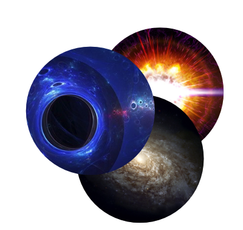

Using AI techniques to understand the universe on cosmological scales, including:
* dark matter searches,
* structure formation, and
* multi-messenger astrophysics.

The research in Astrophysics is contributing to a variety of subfields, including dark matter searches, large-scale structure of the universe, and galaxy formation. The use of AI is becoming increasingly pervasive in astrophysics, and IAIFI researchers are at the cutting edge of developing techniques for applications ranging from image classification to data interpretation to anomaly detection. 

[Astrophysics Papers](https://iaifi.org/papers-astro.html){:.button.button--outline-primary.button--pill.button--lg}

## Research Highlights

<iframe src="https://docs.google.com/presentation/d/e/2PACX-1vRYF59nkBxk9bdBfYgjsLbl5pXrZL9KwphARukIJyz_GxLvSsb8azcslpu7UlWyIEVQfDnqFEK2pwxA/embed?start=false&loop=false&delayms=3000" frameborder="0" width="864" height="512" allowfullscreen="true" mozallowfullscreen="true" webkitallowfullscreen="true"></iframe>

[View and download slide](https://docs.google.com/presentation/d/1qCkugEeZ2ugxYh3A24orNkpVyu17n5bbzP9GLTIDWzw/edit?usp=sharing)

<iframe src="https://docs.google.com/presentation/d/e/2PACX-1vRELgySPSeP4oF0Xvvzv4nTbfzxJgxo3cSTimV1GYtFRdeZ7ED2m0HKlAdtAEoco5LSz7ZF20Yq5vRB/embed?start=false&loop=false&delayms=3000" frameborder="0" width="960" height="569" allowfullscreen="true" mozallowfullscreen="true" webkitallowfullscreen="true"></iframe>

[View and download slide](https://docs.google.com/presentation/d/108X1fJim0IO67PRJNC8QVvvFnExS0HJ8XNgpQNtkDfE/edit?usp=sharing)

<iframe src="https://docs.google.com/presentation/d/e/2PACX-1vSGMxbXEzLq9Vo8wz_KlQ5l5n8v3vtmkJjEEpQTn8-OFcnpKgkQXZut0mEm7pW9oycSfhf1LppY0afE/embed?start=false&loop=false&delayms=3000" frameborder="0" width="960" height="569" allowfullscreen="true" mozallowfullscreen="true" webkitallowfullscreen="true"></iframe>

[View and download slide](https://docs.google.com/presentation/d/1d_7RrXMYQCPi3BoprwDY9UwO6CrUaC0T-_xd7em6-zg/edit?usp=sharing )

<iframe src="https://docs.google.com/presentation/d/e/2PACX-1vQnf3YteywM3CJGLXupp_WaNsZh8ruDsnSx09_25XO9GdavYCCLRpJeP8Os07KDbKm5qUrVlHvAzIMx/embed?start=false&loop=false&delayms=3000" frameborder="0" width="960" height="569" allowfullscreen="true" mozallowfullscreen="true" webkitallowfullscreen="true"></iframe>

[View and download slide](https://docs.google.com/presentation/d/1Km3Ic55dyNTUmFWZizCOATdMrD8dba9pmIlNdKuKNLM/edit?usp=sharing)

