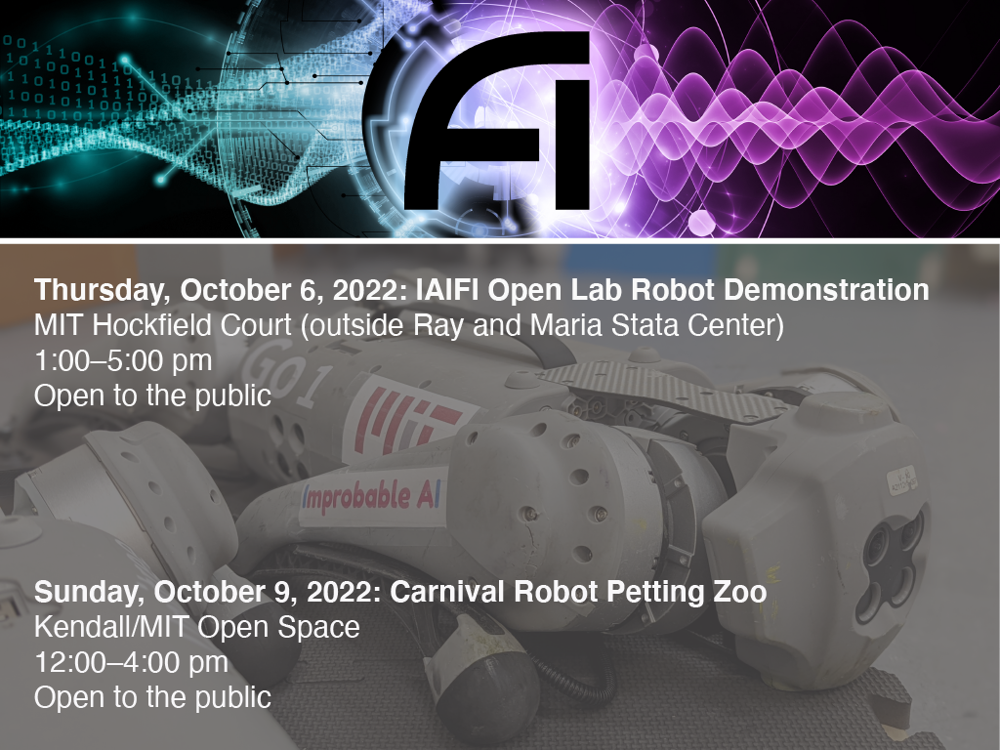

* [Galaxy Zoo](#galaxy-zoo) 
* [Robot Demo](#robot-demo)
* [Engage with IAIFI](#engage-with-iaifi)

IAIFI is excited to participate in the 2022 Cambridge Science Festival with both an Open Lab on October 6, 2022 and as part of the Carnival on October 9, 2022. Both events will include a galaxy zoo and a robot demonstration. All events are free and open to the public. 

# Galaxy Zoo

Stop by to see the NSF AI Institute for Artificial Intelligence and Fundamental Interactions (IAIFI)’s galaxy zoo demonstration, which uses labels created by citizen scientists to automate data analysis using machine learning to better understand complex data from our galaxy.

* Thursday, October 6, 2022, 1:00–5:00 pm: Open Lab at Ray and Maria Stata Center, outside Room 134
* Sunday, October 9, 2022, 12:00–4:00 pm: Carnival, Kendall/MIT Open Space

The galaxy zoo demonstration is an excellent opportunity for adults and children alike to better understand the ways that machine learning and AI can be used in conjunction with the physical sciences to better understand and interact with our world (and beyond!). And you could learn how to get involved as a citizen scientist with this exciting project!

[Explore Galaxy Zoo](https://www.zooniverse.org/projects/zookeeper/galaxy-zoo/)

# Robot Demo

Check out the NSF AI Institute for Artificial Intelligence and Fundamental Interactions (IAIFI)’s quadruped robot demonstration, illustrating the use of reinforcement learning, which trains machines to take action without explicit instructions or corrections. 

* Thursday, October 6, 2022, 1:00–5:00 pm: Open Lab at Hockfield Court, outside Ray and Maria Stata Center
* Sunday, October 9, 2022, 12:00–4:00 pm: Carnival Robot petting Zoo, Kendall/MIT Open Space

Recently, MIT and IAIFI researchers [made headlines with the success of this training](https://news.mit.edu/2022/3-questions-how-mit-mini-cheetah-learns-run-fast-0317) to get a mini cheetah robot to break speed records. This work also included the robot learning to adapt to variable conditions, making it more robust when deployed in the real world—a strategy expected to be relevant for making real-time adjustments in the operation of physics experiments to maximize their reach. 

The quadruped robot demonstration is an excellent opportunity for adults and children alike to better understand the ways that machine learning and AI can be used in conjunction with the physical sciences to better understand and interact with our world (and beyond!).

<iframe width="560" height="315" src="https://www.youtube.com/embed/adUNxy6TNw4?start=75" title="YouTube video player" frameborder="0" allow="accelerometer; autoplay; clipboard-write; encrypted-media; gyroscope; picture-in-picture" allowfullscreen></iframe>

# Engage with IAIFI

IAIFI is galvanizing AI innovation and advancing physics knowledge. Learn more [about IAIFI](about.html), [public events](events-calendar.html), and [research](research.html). 

Additionally, we are actively looking to engage with students of all ages through events like the Cambridge Science Festival, but also through classroom visits. If you are interested in setting up a visit for your class or school, [complete this form](https://forms.gle/MQh677rcxCwhzSJq7). 

[Sign up for our mailing list](http://mailman.mit.edu/mailman/listinfo/iaifi-news) and follow us [on Twitter](http://www.twitter.com/iaifi_news)!
