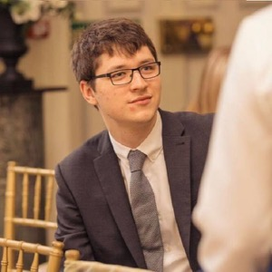
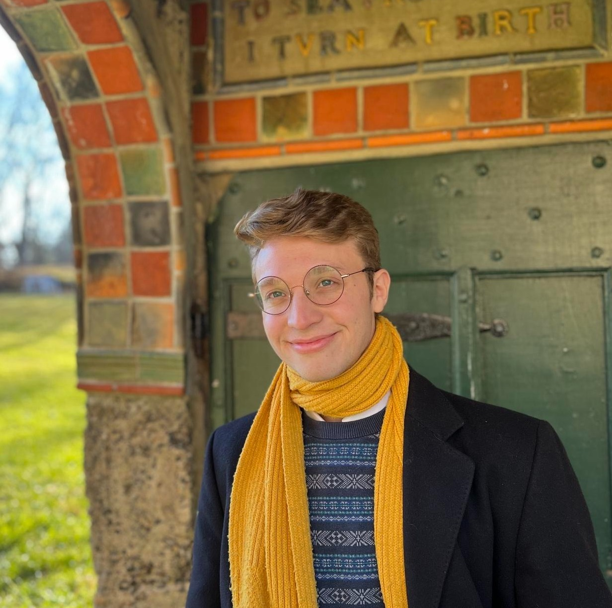

***Applications are now open for the 2025–2028 IAIFI Fellowship search.*** [Apply to be an IAIFI Fellow](https://iaifi.org/fellows) by October 9, 2024. 
{:.success}

## 2024-2027 IAIFI Fellows

### [Michael Albergo](mailto:michaelsalbergo@gmail.com)

**Research Interests**: Michael Albergo has broad interests at the intersection of generative modeling and statistical physics, with a focus on designing machine learning methods to advance scientific computing. To explore these topics, he relies on tools from machine learning, applied probability, and numerical analysis. Along the way, he is curious how these new methods can be applied to various topics across the sciences and beyond.

**Biographical Sketch**: Prior to coming to Boston, Michael received his PhD at New York University, where he had to the privilege to learn across disciplines from a wonderful set of physicists, mathematicians, and computer scientists. He received his MPhil at the University of Cambridge, and his AB at Harvard University. In addition to his participation in IAIFI, Michael is a Junior Fellow at the Society of Fellows at Harvard.

### [Samuel Bright-Thonney](mailto:skb93@cornell.edu)

**Research Interests**: Sam works on developing novel machine learning tools to maximize the discovery potential of collider experiments. He is particularly interested in physics- and symmetry-aware algorithms that are robust when trained on noisy or mis-modeled simulations. He hopes to apply this work towards building self-supervised foundation models for collider physics, which will greatly accelerate downstream classification and generative tasks. Sam’s doctoral work focused on dark matter searches and model-independent anomaly detection, and he looks forward to building deep learning-based reconstruction algorithms to power a new generation of low-mass dark photon searches.

**Biographical Sketch**: Sam received his PhD in Physics from Cornell University in 2024, where he worked on experimental particle physics in the CMS collaboration. Previously, he worked with his LHC colleagues in the ATLAS collaboration while pursuing undergraduate degrees in Physics and Applied Mathematics from UC Berkeley (2018). Sam grew up in England and Northern California, and enjoys playing music, hiking in the mountains, and browsing used bookstores.

### [Akshunna Dogra](mailto:adogra@nyu.edu)

**Research Interests**: Akshunna's interests are rooted in mathematical and computational physics, with principled model design serving as his most used research vehicle, and Dynamical Systems, Fundamental Physics, and Machine Learning (ML) serving as the most visited topics. The versatility of their applications has allowed him to build models for problems in fluid dynamics, ML optimization, and quantum information. His generic approach to scientific model building is rooted in biasing the optimization dynamics towards optimal or near optimal solution models by leveraging known constraints and results on the problems and embedding them appropriately into the models. His doctoral work has been focused on providing unifying perspectives on the convergence regimes of ML models. He hopes to characterize the search phase of optimization as part of his fellowship and leverage such results for the creation of solution models for complex problems in QFT and String Theory.

**Biographical Sketch**: Akshunna is currently finishing his PhD at the Dept. of Mathematics, Imperial College London, building a rigorous framework for Machine Learning (ML) based scientific modeling. He previously obtained a Bachelors of Arts in Mathematics and Physics from New York University. He was raised in a village nestled within the Indian Himalayan foothills. He is also the proud owner of a subsistence farming operation that produces the best ghee on the planet!

### [Thomas Harvey](mailto:thomas.harvey@balliol.ox.ac.uk)

**Research Interests**: Most of Thomas’ research comes under the umbrella term of String Phenomenology: The study of relating string theory to low energy particle physics and cosmology. In recent years machine learning methods have provided new tools in exploring the string landscape, and Thomas has been at the forefront of this work. In particular, genetic algorithms and reinforcement learning can be used for solving the large systems of Diophantine equations that arise in constructing string compactifications leading to the correct particle spectrum in 4D. At the same time, numerical metrics (represented by neural networks) of Calabi-Yau manifolds enable the calculation of more precise aspects of the resulting 4D theories, such as Yukawa couplings.

**Biographical Sketch**: Thomas completed his undergraduate studies in 2019, with an MSci in Physics, from Royal Holloway, University of London before completing part III of the mathematical tripos at the University of Cambridge the following year. Thomas then undertook his graduate studies in the Rudolf Peierls Centre for Theoretical Physics at the University of Oxford under the supervision of Prof Andre Lukas and joined IAIFI as a fellow in 2024.

## 2023-2026 IAIFI Fellows

### [Gaia Grosso](mailto:gaiag795@mit.edu)

**Research Interests**: Gaia has been working on research activity that tackles the problem exploring data from collider experiments in an inclusive way,reducing the prior assumptions on the signal hypothesis. For her PhD, she has been developing a statistical strategy empowered by machine learning to detect and quantify significant departures of the experimental data from the Standard Model predictions. She worked on including in the machine learning framework a way to quantify the systematic uncertainties affecting the data. In the years to come, She plans to further investigate ML based methods for offline model-independent new physics searches and to explore approaches of online anomaly detection and physics analysis.

**Biographical Sketch**: Gaia completed her PhD at the University of Padua in 2023, working in the field of particle physics. In the same years as her PhD, she was a member of the mPP ERC-funded group at CERN as doctoral student, developing machine learning applications for high-energy physics.  Research activity on statistical tools for data analysis at collider experiments, with focus on model agnostic searches for new phenomena at the LHC. Member of the CMS collaboration at CERN since 2019. BSc in Physics (2017) and MSc in Physics of fundamental interactions (2019) at the University of Padua.

### [Alex Gagliano](mailto:gaglian2@mit.edu)

**Research Interests**: Alex Gagliano builds scalable machine learning methods to decipher the physics of astrophysical transients in real-time. He is particularly interested in identifying rare and rapidly-evolving phenomena early enough to enable targeted spectroscopic analyses. To distinguish these high-priority events from among the millions discovered by synoptic surveys such as the Vera C. Rubin Observatory in 2025, Alex is investigating Bayesian inference techniques that are robust to noisy, irregular time-series data, and physics-informed reinforcement learning algorithms that can design adaptive decision-making policies with limited feedback.

**Biographical Sketch**: Alex Gagliano completed his Ph.D. in Astronomy at the University of Illinois at Urbana-Champaign, where he was an NSF Graduate Research Fellow. Previously, he worked as a pre-doctoral fellow at the Flatiron Institute's Center for Computational Astrophysics (2022) and as a post-baccalaureate fellow at Los Alamos National Laboratory (2018). Alex completed an undergraduate degree in Computational Modeling and Data Analytics at Virginia Tech in 2017. 

## 2022-2025 IAIFI Fellows

### [Denis Boyda](mailto:boyda@mit.edu)

**Research Interests**: Denis Boyda has been working on the application of the Machine Learning method to simulations of physical systems and bringing physical ideas to Machine Learning. His research is devoted to developing algorithms enabling simulations of nuclear and particle physics which are currently computationally intractable. Denis Boyda is interested in the Monte Carlo techniques and generation modeling. He develops equivariant models which respect the symmetry of a target problem and runs simulations at leading supercomputer machines.

**Biographical Sketch**: In his Ph.D. thesis, Denis Boyda studied strong-coupled systems such as graphene and quark-gluon/hadron matter. He received a Ph.D. degree in physics from Kurchatov Institute, Moscow in 2018. Denis Boyda joined MIT's Center for Theoretical Physics as a postdoctoral associate in 2019, where he worked on the enforcing of algorithms of Lattice Quantum Chromodynamics with Machine Learning. In 2020 he became a postdoctoral appointee in the Leadership Computer Facility at Argonne National Laboratory, where he scaled proof-of-principal ML models towards exascale. Denis Boyda grew up in the Russian Far East and loves sailing and hiking.

### [Carolina Cuesta](mailto:cuestalz@mit.edu)

**Research Interests**: Carolina Cuesta is interested in developing robust and interpretable Machine Learning models that can guide us towards future discoveries in physics. Her main research interests lie on the intersection of cosmology and AI. She develops Machine Learning techniques for cosmological inference to deepen our understanding of the accelerated expansion of the Universe. Outside of cosmology, she is interested in building multi-disciplinary collaborations in the areas of statistics and AI.

**Biographical Sketch**: Before joining IAIFI as a Fellow, Carolina received her Ph.D. in Physics and Data Science from the Institute of Computational Cosmology at Durham University, UK, in 2022. Alongside her PhD, she has been a research collaborator with the United Nations (UN) Global Pulse and the UK’s National Health Service (NHS), developing epidemiological simulations, and a research intern at Amazon’s Alexa team. Carolina received a MSc in theoretical physics and cosmology (2017) at Heidelberg University (Germany), and a BSc in Physics (2015) at Universidad Autonoma de Madrid (Spain). Carolina grew up in Cuenca, Spain.

### [Jessie Micallef](mailto:jessiem@mit.edu)

**Research Interests**: Jessie Micallef works on adapting and expanding machine learning solutions to apply to particle physics experiments. Her research focuses on neutrinos and studying neutrino oscillation, a unique phenomena that shows neutrinos deviate from their Standard Model prediction, with the IceCube Neutrino Observatory. To improve oscillation measurements, Jessie created and optimized new convolution neural network (CNN) reconstructions for GeV-scale IceCube neutrinos. Jessie’s machine learning interests focus on adapting the forefront of ML solutions to noisy, sparse neutrino data; she hopes to explore topics of robustness, systematics aware learning, fast inference methods, and advanced neural networks to adapt to neutrino experiments.

**Biographical Sketch**: Jessie received her dual PhD in Physics and Computational Mathematics, Science, & Engineering from Michigan State University (MSU) where she was a NSF Graduate Research Fellow and former ACM SIGHPC/Intel Computer Science Fellow. She did her undergrad at University of Michigan, where she worked on the particle physics experiment KOTO in Japan and tested neutrino detectors at Lawrence Berkeley National Lab. In tandem with her research, Jessie also works to empower women and minorities in STEM by leading outreach and diversity initiatives through the Conferences for Undergraduate Women in Physics, MSU’s Women & Minorities in the Physical Sciences, and the IceCube collaboration. Outside of academia, Jessie enjoys creative writing, practicing longsword and jiu jitsu, and traveling to exciting places and events.

## 2021-2024 IAIFI Fellows

### [Anna Golubeva](mailto:golubevanna@gmail.com)

**Research Interests**:  Anna Golubeva is working on developing a theoretical foundation of deep learning with methods from statistical physics. Her goal is to contribute to the understanding of AI by making the methods of deep learning more principled and interpretable. Her past projects include both the application of deep learning methods for solving quantum many-body problems, as well as a theory-based analysis of deep learning systems, exploiting approaches from information theory, statistical learning theory, and statistical physics. She is particularly interested in the questions of neural network efficiency, sparsity and training algorithms.

**Biographical Sketch**:  Anna Golubeva obtained her PhD in 2021 at the Perimeter Institute for Theoretical Physics and the University of Waterloo, where she was advised by Roger Melko. During her PhD, she was also a graduate affiliate at the Vector Institute for AI in Toronto. Previously, she completed the Perimeter Scholars International master's program (2017), a MSc in Theoretical Physics with focus on computational approaches to quantum many-body systems (2016), and a BSc in Biophysics (2014) at the Goethe University in Frankfurt, Germany.

### [Di Luo](mailto:diluo@mit.edu)

**Research Interests**:  Di Luo is working on research in the intersection of quantum many-body physics, quantum information science, and artificial intelligence. He has been developing quantum algorithms and machine learning approaches for condensed matter physics, high energy physics, and quantum information science. Di Luo is interested in understanding nature from the perspectives of information and computation as well as developing intelligence inspired by ideas from nature.

**Biographical Sketch**:  Di Luo received his undergraduate degree with majors in physics and mathematics from the University of Hong Kong in 2016. He graduated with master degree in mathematics and Ph.D. degree in physics at the University of Illinois, Urbana-Champaign in 2021. Di Luo is currently an IAIFI Fellow at the NSF AI Institute for Artificial Intelligence and Fundamental Interactions.

### [Siddharth Mishra-Sharma](mailto:smsharma@mit.edu)

**Research Interests**: Siddharth Mishra-Sharma is interested in developing novel statistical methods for accelerating the discovery of new physics in astrophysical and cosmological observations at all accessible scales. He is especially focused on developing analysis techniques based on machine learning that enable new ways of searching for signatures of physics beyond the Standard Model, in particular the nature of dark matter, using data from ongoing and upcoming cosmological surveys. Towards this end, Siddharth is interested in incorporating physical insights, symmetries, and laws into machine learning algorithms as well as extracting physical insights, symmetries, and laws using machine learning algorithms from noisy physics datasets.

**Biographical Sketch**: Prior to joining the NSF AI Institute for Artificial Intelligence and Fundamental Interactions as an IAIFI Fellow, Siddharth Mishra-Sharma was a postdoctoral associate at the Center for Cosmology and Particle Physics at New York University from 2018-2021. He received his Ph.D. in Physics from Princeton University in 2018. He read Natural Sciences and Mathematics at the University of Cambridge, where he was a member of Peterhouse, receiving his undergraduate degree in 2013.  Siddharth grew up in Moscow, Russia.

### [Ge Yang](mailto:ge.ike.yang@gmail.com)

**Research Interests**:  Ge Yang's research involves two sets of related problems. The first is to make distributed representation in a neural net generalizable by finding ways to automatically discover causal structures that are equivariant to symmetry transformations. The second is to solve key open problems in deep reinforcement learning, including exploration and ways to learn off-line from static datasets, using search and planning.

**Biographical Sketch**:  Ge Yang grew up on the north side of Beijing, graduated in 2010 with his undergraduate degree in Physics and Mathematics from Yale, and received his Ph.D. in Physics from the University of Chicago. He visited UC Berkeley to work with Pieter Abbeel in 2018, followed by a research internship at Facebook AI Research with Roberto Calandra, and one at Google DeepMind in London with Volodomyr Mnih. He is currently a postdoctoral fellow at the NSF AI Institute for Artificial Intelligence and Fundamental Interactions.

