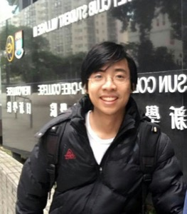

* [2022-2025 IAIFI Fellows](#2022-2025-iaifi-fellows)
* [2021-2024 IAIFI Fellows](#2021-2024-iaifi-fellows)

## 2022-2025 IAIFI Fellows

We are excited for [Denis](#denis-boyda), [Carolina](#carolina-cuesta), and [Jessie](#jessie-micallef) to join us as our second round of IAIFI Fellows to help spark vital interdisciplinary research at the intersection of Physics and AI!

### [Denis Boyda](mailto:boyda@mit.edu)

**Research Interests**: Denis Boyda has been working on the application of the Machine Learning method to simulations of physical systems and bringing physical ideas to Machine Learning. His research is devoted to developing algorithms enabling simulations of nuclear and particle physics which are currently computationally intractable. Denis Boyda is interested in the Monte Carlo techniques and generation modeling. He develops equivariant models which respect the symmetry of a target problem and runs simulations at leading supercomputer machines.

**Biographical Sketch**: In his Ph.D. thesis, Denis Boyda studied strong-coupled systems such as graphene and quark-gluon/hadron matter. He received a Ph.D. degree in physics from Kurchatov Institute, Moscow in 2018. Denis Boyda joined MIT's Center for Theoretical Physics as a postdoctoral associate in 2019, where he worked on the enforcing of algorithms of Lattice Quantum Chromodynamics with Machine Learning. In 2020 he became a postdoctoral appointee in the Leadership Computer Facility at Argonne National Laboratory, where he scaled proof-of-principal ML models towards exascale. Denis Boyda grew up in the Russian Far East and loves sailing and hiking.

### [Carolina Cuesta](mailto:carolina.cuesta-lazaro@durham.ac.uk)

**Research Interests**: Carolina Cuesta is interested in developing robust and interpretable Machine Learning models that can guide us towards future discoveries in physics. Her main research interests lie on the intersection of cosmology and AI. She develops Machine Learning techniques for cosmological inference to deepen our understanding of the accelerated expansion of the Universe. Outside of cosmology, she is interested in building multi-disciplinary collaborations in the areas of statistics and AI.

**Biographical Sketch**: Before joining IAIFI as a Fellow, Carolina will receive her Ph.D. in Physics and Data Science from the Institute of Computational Cosmology at Durham University, UK, in 2022. Alongside her PhD, she has been a research collaborator with the United Nations (UN) Global Pulse and the UK’s National Health Service (NHS), developing epidemiological simulations, and a research intern at Amazon’s Alexa team. Carolina received a MSc in theoretical physics and cosmology (2017) at Heidelberg University (Germany), and a BSc in Physics (2015) at Universidad Autonoma de Madrid (Spain). Carolina grew up in Cuenca, Spain.

### [Jessie Micallef](mailto:jessiemicallef19@gmail.com)

**Research Interests**: Jessie Micallef works on adapting and expanding machine learning solutions to apply to particle physics experiments. Her research focuses on neutrinos and studying neutrino oscillation, a unique phenomena that shows neutrinos deviate from their Standard Model prediction, with the IceCube Neutrino Observatory. To improve oscillation measurements, Jessie created and optimized new convolution neural network (CNN) reconstructions for GeV-scale IceCube neutrinos. Jessie’s machine learning interests focus on adapting the forefront of ML solutions to noisy, sparse neutrino data; she hopes to explore topics of robustness, systematics aware learning, fast inference methods, and advanced neural networks to adapt to neutrino experiments.

**Biographical Sketch**: Jessie is a graduate student at Michigan State University (MSU) where she is pursuing a dual PhD in Physics and Computational Mathematics, Science, & Engineering. She is both a NSF Graduate Research Fellow and former ACM SIGHPC/Intel Computer Science Fellow. She did her undergrad at University of Michigan, where she worked on the particle physics experiment KOTO in Japan and tested neutrino detectors at Lawrence Berkeley National Lab. In tandem with her research, Jessie also works to empower women and minorities in STEM by leading outreach and diversity initiatives through the Conferences for Undergraduate Women in Physics, MSU’s Women & Minorities in the Physical Sciences, and the IceCube collaboration. Outside of academia, Jessie enjoys creative writing, practicing longsword and jiu jitsu, and traveling to exciting places and events.

## 2021-2024 IAIFI Fellows

### [Anna Golubeva](mailto:golubeva@mit.edu)

**Research Interests**:  Anna Golubeva is working on developing a theoretical foundation of deep learning with methods from statistical physics. Her goal is to contribute to the understanding of AI by making the methods of deep learning more principled and interpretable. Her past projects include both the application of deep learning methods for solving quantum many-body problems, as well as a theory-based analysis of deep learning systems, exploiting approaches from information theory, statistical learning theory, and statistical physics. She is particularly interested in the questions of neural network efficiency, sparsity and training algorithms.

**Biographical Sketch**:  Anna Golubeva obtained her PhD in 2021 at the Perimeter Institute for Theoretical Physics and the University of Waterloo, where she was advised by Roger Melko. During her PhD, she was also a graduate affiliate at the Vector Institute for AI in Toronto. Previously, she completed the Perimeter Scholars International master's program (2017), a MSc in Theoretical Physics with focus on computational approaches to quantum many-body systems (2016), and a BSc in Biophysics (2014) at the Goethe University in Frankfurt, Germany.

### [Di Luo](mailto:diluo@mit.edu)

**Research Interests**:  Di Luo is working on research in the intersection of quantum many-body physics, quantum information science, and artificial intelligence. He has been developing quantum algorithms and machine learning approaches for condensed matter physics, high energy physics, and quantum information science. Di Luo is interested in understanding nature from the perspectives of information and computation as well as developing intelligence inspired by ideas from nature.

**Biographical Sketch**:  Di Luo received his undergraduate degree with majors in physics and mathematics from the University of Hong Kong in 2016. He graduated with master degree in mathematics and Ph.D. degree in physics at the University of Illinois, Urbana-Champaign in 2021. Di Luo is currently an IAIFI Fellow at the NSF AI Institute for Artificial Intelligence and Fundamental Interactions.

### [Siddharth Mishra-Sharma](mailto:smsharma@mit.edu)

**Research Interests**: Siddharth Mishra-Sharma is interested in developing novel statistical methods for accelerating the discovery of new physics in astrophysical and cosmological observations at all accessible scales. He is especially focused on developing analysis techniques based on machine learning that enable new ways of searching for signatures of physics beyond the Standard Model, in particular the nature of dark matter, using data from ongoing and upcoming cosmological surveys. Towards this end, Siddharth is interested in incorporating physical insights, symmetries, and laws into machine learning algorithms as well as extracting physical insights, symmetries, and laws using machine learning algorithms from noisy physics datasets.

**Biographical Sketch**: Prior to joining the NSF AI Institute for Artificial Intelligence and Fundamental Interactions as an IAIFI Fellow, Siddharth Mishra-Sharma was a postdoctoral associate at the Center for Cosmology and Particle Physics at New York University from 2018-2021. He received his Ph.D. in Physics from Princeton University in 2018. He read Natural Sciences and Mathematics at the University of Cambridge, where he was a member of Peterhouse, receiving his undergraduate degree in 2013.  Siddharth grew up in Moscow, Russia.

### [Ge Yang](mailto:ge.ike.yang@gmail.com)

**Research Interests**:  Ge Yang's research involves two sets of related problems. The first is to make distributed representation in a neural net generalizable by finding ways to automatically discover causal structures that are equivariant to symmetry transformations. The second is to solve key open problems in deep reinforcement learning, including exploration and ways to learn off-line from static datasets, using search and planning.

**Biographical Sketch**:  Ge Yang grew up on the north side of Beijing, graduated in 2010 with his undergraduate degree in Physics and Mathematics from Yale, and received his Ph.D. in Physics from the University of Chicago. He visited UC Berkeley to work with Pieter Abbeel in 2018, followed by a research internship at Facebook AI Research with Roberto Calandra, and one at Google DeepMind in London with Volodomyr Mnih. He is currently a postdoctoral fellow at the NSF AI Institute for Artificial Intelligence and Fundamental Interactions.

