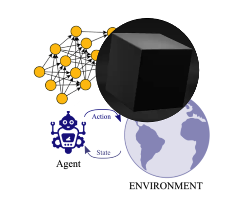
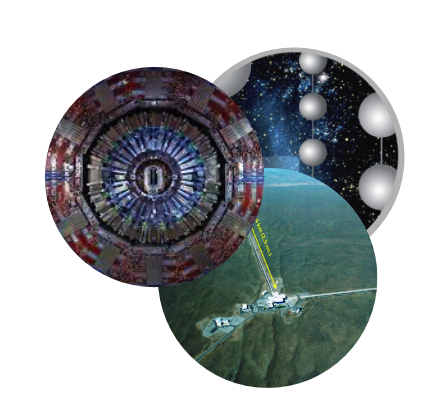

## Foundational AI 

Infusing physics principles into AI to create state-of-the-art AI innovations, including: 
* representation learning,
* robust and interpretable AI, and
 * reinforcement learning.
 
 Projects in Foundational AI are infusing physics principles into AI to create state-of-the-art AI innovations, particularly in terms of representation learning, robust/interpretable AI, and reinforcement learning. Overall, the goal for projects in this domain is to develop AI techniques that can be used across a variety of applications and that are influenced by physics principles and/or problems. Researchers are tackling AI questions dealing with robustness, interpretability, computer vision, equivariance, and segmentation, among others.

[Foundational AI Papers](https://iaifi.org/papers-ai.html){:.button.button--outline-primary.button--pill.button--lg}

### Research Highlights





#### {{highlight.title}}
*{{highlight.authors}}*

<iframe src="{{highlight.embed-link}}" frameborder="0" width="960" height="569" allowfullscreen="true" mozallowfullscreen="true" webkitallowfullscreen="true"></iframe>

[View and download slide]({{highlight.view-link}})



<!--
IAIFI AI Projects: *Embedding Quantum Field Theory Principles into AI*, *AI that Respects Algebraic and Geometric Invariance*, *Fast AI on Specialized Hardware*, *AI at the Speed of Light*, *Speeding up Simulations with Curiosity-Driven AI*, *From Sequential AI to Parallel AI*, *Statistical Physics for Sparse AI Learning*, *Combining Symmetries and Flexibility with AI*, *AI for Data/Simulation Differences*, and *Statistical Physics for AI Generalization*.  
{:.info}
-->

## Theoretical Physics

Research in Physics Theory is leveraging AI to understand the theoretical underpinning of fundamental physics, including: 
* nuclear/particle physics,
* quantum field theory and string theory, and
* quantum many-body physics.

Projects in AI for Theoretical Physics utilize AI tools and techniques to enable physics discovery through the acceleration of theoretical physics calculations. In turn, the advances made in this domain also contribute to advancing AI---researchers are not simply using existing AI tools and techniques as they are, but are building on  those tools and developing new tools, which can have applications beyond AI. Researchers working in this domain are developing AI to solve problems related to the detection of subhalos, quantum many-body physics, simulation-based inference, lattice quantum field theory, dark matter searches, and knot theory, to name a few. 

[Physics Theory Papers](https://iaifi.org/papers-theory.html){:.button.button--outline-primary.button--pill.button--lg}

<!--
The specific *ab initio* physics approaches that we are targeting include first-principles calculations within the Standard Model (SM) of nuclear and particle physics, work to understand physics beyond the SM in the framework of string theory, and theory calculations for astroparticle physics. Complementing these efforts is work towards approaches that do not use AI to study a known theory, but instead to determine what previously unknown theory underlies observations. While the target physics spans a wide range of frameworks and scales, success in these areas all rely intimately on our efforts to advance the field of AI itself with work in interpretability, speed, and incorporating physical symmetries into AI frameworks, *i.e.* to develop the field of *ab initio* AI.
-->

### Research Highlights




#### {{highlight.title}}
*{{highlight.authors}}*

<iframe src="{{highlight.embed-link}}" frameborder="0" width="960" height="569" allowfullscreen="true" mozallowfullscreen="true" webkitallowfullscreen="true"></iframe>

[View and download slide]({{highlight.view-link}})



<!---
## Active Projects: 
* *Generative Flow Models to Accelerate Lattice Quantum Field
Theory Calculations*; **Project Lead: Phiala Shanahan, Physics, MIT**
* *Efficient Variational Calculations for Nuclear Theory with AI*;
**Project Leads: Phiala Shanahan, Physics, MIT; William Detmold, Physics, MIT**
* *Point Cloud Learning with Energy Flow*;
**Project Leads: Jesse Thaler, Physics, MIT; Justin Solomon, EECS, MIT**
* *Infinite Networks for Self-Generative Learning*;
**Project Lead: Jim Halverson, Physics, Northeastern**
* *Machine Learning for Topology: Knot Theory*;
**Project Lead: Jim Halverson, Physics, Northeastern**
* *NN-QFT Correspondence*;
**Project Lead: Jim Halverson, Physics, Northeastern**
* *Discovering Sparse Interpretable Dynamics from Partial Observations*;
**Project Lead: Marin Soljacic, Physics, MIT**
* *Emulating Energy Injection Effects in the Early Universe*;
**Project Lead: Tracy Slatyer, Physics, MIT**
* *A Compound Poisson Generator Approach to Point-Source Inference in Astrophysics*;
**Project Lead: Kerstin Perez, Physics, MIT**
* *Path-Integral Contour Deformation for Estimation of Noisy Observables in Lattice Field Theory*;
**Project Lead: William Detmold, Physics, MIT**
* *Discerning Line-of-Sight Halos from Substructure with Machine Learning*;
**Project Lead: Cora Dvorkin, Physics, Harvard**
* *Jet Metrics and Autoencoders*;
**Project Lead: Matthew Schwartz, Physics, Harvard**
* *Exploring Dual Moduli Spaces via Topological Data Analysis*;
**Project Lead: Brent Nelson, Physics, Northeastern**
* *Machine-Learning Invariance & Invariants*;
**Project Lead: Max Tegmark, Physics, MIT**
* *ML and Calabi-Yau Geometry*;
**Project Lead: Washington Taylor, Physics, MIT**
* *AI Preconditioners for Dirac Matrix Inversion*;
**Project Lead: Phiala Shanahan, Physics, MIT**
* *Topological Obstructions to Autoencoding*;
**Project Lead: Dan Roberts, Physics, Salesforce**

IAIFI Physics Theory Projects: *Accelerating Lattice Field Theory with AI*, *Exploring the Multiverse with AI*, *Classifying Knots with AI*, *Astrophysical Simulations with AI*, *Toward an AI Physicist*, and *String Theory Conjectures via AI*.
{:.info}
--->

## Experimental Physics

Enhancing the operations and analysis of flagship NSF experiments through AI, including the: 
* Large Hadron Collider,
* IceCube Neutrino Observatory, and
* Laser Interferometer Gravitational Wave Observatory.

The impacts of IAIFI on many experiments aim to exploit AI developments to enhance the quality of physics that can be performed. Data from physics experiments can significantly benefit from the application of AI algorithms leading to better physics measurements and, ultimately, a deeper understanding of the universe. The use of experimental data additionally provides a real-world, often noisy, setting to verify AI methods. Our efforts in  AI for experiment are symbiotic with our work to advance the field of AI itself and allow for the rapid deployment of novel ideas to core physics measurements.  

[Physics Experiment Papers](https://iaifi.org/papers-experiment.html){:.button.button--outline-primary.button--pill.button--lg}

### Research Highlights





#### {{highlight.title}}
*{{highlight.authors}}*

<iframe src="{{highlight.embed-link}}" frameborder="0" width="960" height="569" allowfullscreen="true" mozallowfullscreen="true" webkitallowfullscreen="true"></iframe>

[View and download slide]({{highlight.view-link}})



<!--
IAIFI Physics Experiment Projects: *Interpretable AI for the LHC*, *Real-Time Processing with AI*, *Neutrinos Imaging with AI*, *LIGO Noise Reduction with AI*, *Accelerating Gravitational Waveform Computations with AI*, and *Identifying Electromagnetic Counterparts for Multi-Messenger Astrophysics with AI*.
{:.info}
-->

## Astrophysics

Using AI techniques to understand the universe on cosmological scales, including:
* dark matter searches,
* structure formation, and
* multi-messenger astrophysics.

The research in Astrophysics is contributing to a variety of subfields, including dark matter searches, large-scale structure of the universe, and galaxy formation. The use of AI is becoming increasingly pervasive in astrophysics, and IAIFI researchers are at the cutting edge of developing techniques for applications ranging from image classification to data interpretation to anomaly detection. 

[Astrophysics Papers](https://iaifi.org/papers-astro.html){:.button.button--outline-primary.button--pill.button--lg}

### Research Highlights





#### {{highlight.title}}
*{{highlight.authors}}*

<iframe src="{{highlight.embed-link}}" frameborder="0" width="960" height="569" allowfullscreen="true" mozallowfullscreen="true" webkitallowfullscreen="true"></iframe>

[View and download slide]({{highlight.view-link}})


