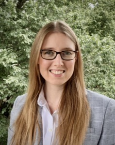
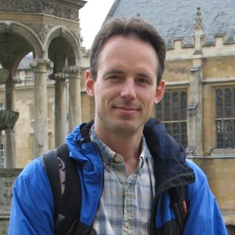

* [Upcoming Colloquia](#upcoming-colloquia)
* [Past Colloquia](#past-colloquia)

## Upcoming Colloquia 

Please [sign up for our mailing list](http://mailman.mit.edu/mailman/listinfo/iaifi-news) to receive updates on IAIFI events.

* **[Boris Hanin](https://boris-hanin.github.io), Assistant Professor, Princeton University** 
    * **Friday, February 10, 2023, 2:00-3:00pm**
    * *Bayesian Interpolation with Deep Linear Networks*
    * This talk is based on joint work (arXiv:2212.14457) with Alexander Zlokapa, which gives exact non-asymptotic formulas for Bayesian posteriors in deep linear networks. After providing some general motivation, I will focus on explaining results of two kinds. First, I will state a precise result showing that infinitely deep linear networks compute optimal posteriors starting from universal, data-agnostic priors. Second, I will explain how a novel scaling parameter -- given by  # data * depth / width -- controls the effective depth and complexity of the posterior. 

* **[Yonatan Kahn](https://physics.illinois.edu/people/directory/profile/yfkahn), Assistant Professor, UIUC** 
    * **Friday, March 10, 2023, 2:00-3:00pm**
    * *Dumb Machine Learning for Physics*
    * Machine learning is now a part of physics for the foreseeable future, but many deep learning 	tools, architectures, and algorithms are imported from industry to physics with minimal modifications. Does physics really need all of these fancy techniques, or does “dumb” machine learning with the simplest possible neural network suffice? The answer may depend on the extent to which the training data relevant to physics problems is truly analogous to problems from industry such as image classification, which in turn depends on the topology and statistical structures of physics data. This talk will not endeavor to answer this very broad and difficult question, but will rather provide a set of illustrative examples inspired by a novice’s exploration of this rapidly-developing field.

* **[Uros Seljak](https://physics.berkeley.edu/people/faculty/uros-seljak), Professor, UC Berkeley** 
    * **Friday, April 14, 2023, 2:00-3:00pm**
    * *Details to come*

## Past Colloquia
You can [watch our Past Colloquia recordings on YouTube](https://www.youtube.com/channel/UCueoFcGm_15kSB-wDd4CBZA). 

### Fall 2022

* **[Anima Anandkumar](http://tensorlab.cms.caltech.edu/users/anima/), Professor, Caltech; Director of ML, NVIDIA** 
    * **Tuesday, November 1, 2022, 11:00am-12:00pm**
    * *AI Accelerating Sciences: Neural operators for Learning Between Function Spaces*
    * [YouTube Recording](https://youtu.be/RR5-mYQOb7E)
    * [Talk Slides](talks/2022_11_01_IAIFI_Colloquium_Anandkumar.pdf)
    * Deep learning surrogate models have shown promise in modeling complex physical phenomena such as fluid flows, molecular dynamics, and material properties. However, standard neural networks assume finite-dimensional inputs and outputs, and hence, cannot withstand a change in resolution or discretization between training and testing. We introduce Fourier neural operators that can learn operators, which are mappings between infinite dimensional function spaces. They are discretization-invariant and can generalize beyond the discretization or resolution of training data. When applied to modeling weather forecasting, Carbon Capture and Storage (CCS), material plasticity and many other processes, neural operators capture fine-scale phenomena and have similar skill as the gold-standard numerical weather models, while being 4-5 orders of magnitude faster.

* **[Daniel Goldman](https://physics.gatech.edu/user/daniel-goldman), Professor, Georgia Tech** 
    * **Friday, October 14, 2022, 2:00-3:00pm** 
    * *Robophysics: robotics meets physics*
    * Robots will soon move from the factory floor and into our lives (e.g. autonomous cars, package delivery drones, and search-and-rescue devices). However, compared to living systems, robot capabilities in complex environments are limited. I believe the mindset and tools of physics can help facilitate the creation of robust self-propelled autonomous systems. This “robophysics” approach – the systematic search for novel dynamics and principles in robotic systems -- can aid the computer science and engineering approaches which have proven successful in less complex environments. The rapidly decreasing cost of constructing sophisticated robot models with easy access to significant computational power bodes well for such interactions. And such devices are valuable as models of living systems (complementing theoretical and computational modeling approaches) and can lead to development of engineered devices that begin to achieve life-like locomotor abilities on and within complex environments. They also provide excellent tools to study questions in active matter physics. In this talk, I will provide examples of the above using recent studies in which concepts from modern physics--geometric phase and mechanical “diffraction” – have led to new insights into biological and engineered locomotion across scales.

* **[Lucy Colwell](https://www.ch.cam.ac.uk/person/ljc37), Associate Professor, Cambridge University** 
    * **Friday, September 16, 2022, 2:00-3:00pm** 
    * *Data driven ML models that predict protein function from sequence*
    * [YouTube Recording](https://youtu.be/5r3LKWHKl-0)
    * Abstract: The ability to predict protein function directly from sequence is a central challenge that will enable the discovery of new proteins with specific functional properties. The evolutionary trajectory of a protein through sequence space is constrained by its functional requirements, and the explosive growth of evolutionary sequence data allows the natural variation present in homologous sequences to be used to infer these constraints and accurately predict protein function. However, state-of-the-art alignment-based techniques cannot predict function for one-third of microbial protein sequences, hampering our ability to exploit data from diverse organisms. I will present ML models that accurately predict the presence and location of functional domains within protein sequences. These models have recently added hundreds of millions of annotations to public databases that could not be made using existing approaches. A key advance is the ability for models to extrapolate and thus to be able to accurately predict functional annotations that were not seen during model training. To address this challenge we draw inspiration from recent advances in natural language processing to train models that translate between amino acid sequences and functional descriptions. Finally I will illustrate the potential of active learning to discover new sequences through the design and experimental validation of proteins and peptides for therapeutic applications.

&nbsp;
### Spring 2022

* **[Kyle Cranmer](https://www.cs.wisc.edu/staff/cranmer-kyle/), Professor of Physics and Data Science New York University; Visiting Scientist at Meta AI** 
    * **Friday, February 18, 2022, 2:00-3:00pm** 
    * *"Vignettes in physics-inspired AI research"*
    * [YouTube Recording](https://youtu.be/hGup1Yv7Ajk)
    * [Talk Slides](talks/2022_02_18_IAIFI_Colloquium_Cranmer.pdf)
    * Abstract: Distinct from pure basic research and pure applied research is the concept of use-inspired research. The claim is that foundational advances are often inspired by the context and particularities of a specific applied problem setting -- reality is stranger than fiction. I will give a few examples of advances in AI inspired by problems in physics, which have also been found to be useful in unexpected areas ranging from algorithmic fairness, genomics, and epidemiology.

&nbsp;

* **[Giuseppe Carleo](https://people.epfl.ch/giuseppe.carleo?lang=en), Assistant Professor, Computational Quantum Science Laboratory, École Polytechnique** 
    * **Friday, March 4, 2022, 2:00-3:00pm** 
    * *"Neural-Network Quantum States: new computational possibilities at the boundaries of the many-body problem"*
    * [YouTube Recording](https://youtu.be/d-DBXsT6D7M)
    * [Talk Slides](talks/2022_03_04_IAIFI_Colloquium_Carleo.pdf)
    * Abstract: Machine-learning-based approaches, routinely adopted in cutting-edge industrial
applications, are being increasingly adopted to study fundamental problems in
science. Many-body physics is very much at the forefront of these exciting developments, 
given its intrinsic "big-data" nature. In this talk, I will present selected applications to the quantum realm. First, I will discuss how a systematic and controlled machine learning of the
many-body wave-function can be realized. This goal is achieved by a variational
representation of quantum states based on artificial neural networks [1]. I will then
discuss recent applications in diverse domains, including prototypical open problems in
many-body quantum physics - interacting fermions [2,3,4] and frustrated spins [5,6] — where 
these approaches typically outperform existing state of the art methods. Finally, I will discuss applications in the context of quantum computing [7,8].

[1] Carleo and Troyer, Science 355, 602 (2017);
[2] Moreno et al., arXiv:2111.10420 (2021) [3] Hermann et al., Nat. Chemistry 12, 891 (2020);
[4] Adams et al., Phys. Rev. Lett. 127, 022502 (2021);
[5] Choo et al, Phys. Rev. B 100, 125124 (2019);
[6] Nomura and Imada, Phys. Rev. X 11, 031034 (2021);
[7] Jonsson et al, arXiv:1808.05232 (2018);
[8] Medvidovic and Carleo, npj Quantum Info 7, 101 (2021) 

&nbsp;

* **[Yann LeCun](http://yann.lecun.com/), VP and Chief AI Scientist, Meta** 
    * **Friday, April 1, 2022, 2:00-3:00pm** 
    * *"A path towards human-level intelligence"*
    * [YouTube recording](https://youtu.be/_K0h7oEe8BQ)
    * [Talk Slides](talks/2022_04_01_IAIFI_Colloquium_LeCun.pdf)
    * *Photo courtesy of Kimberly M. Wang, eardog.com*

&nbsp;

* **[Hiranya Peiris](https://www.ucl.ac.uk/cosmoparticle/hiranya-peiris), Professor of Astrophysics, University College London; Professor of Cosmoparticle Physics at the Oskar Klein Centre, Stockholm** 
    * **Friday, April 15, 2022, 2:00-3:00pm** 
    * *"Prospects for understanding the physics of the Universe"*
    * [YouTube recording](https://youtu.be/bBqvp4-gKzE)
    * [Talk Slides](talks/2022_04_15_IAIFI_Colloquium_Peiris.pdf)
    * Abstract: The remarkable progress in cosmology over the last decades has been driven by the close interplay between theory and observations. Observational discoveries have led to a standard model of cosmology with ingredients that are not present in the standard model of particle physics – dark matter, dark energy, and a primordial origin for cosmic structure. Their physical nature remains a mystery, motivating a new generation of ambitious sky surveys. However, it has become clear that formidable modelling and analysis challenges stand in the way of establishing how these ingredients fit into fundamental physics. I will discuss progress in harnessing advanced machine-learning techniques to address these challenges, giving some illustrative examples. I will highlight the particular relevance of interpretability and explainability in this field.

&nbsp;

* **[Laura Waller](https://www2.eecs.berkeley.edu/Faculty/Homepages/waller.html), Associate Professor, EECS, University of California, Berkeley** 
    * **Friday, April 29, 2022, 2:00-3:00pm** 
    * *Title: Computational Microscopy*
    * [YouTube Recording](https://youtu.be/SYrtlBNKOJc)
    * Abstract: Computational imaging involves the joint design of imaging system hardware and software, optimizing across the entire pipeline from acquisition to reconstruction. Computers can replace bulky and expensive optics by solving computational inverse problems, or images can be reconstructed from scattered light. This talk will describe new microscopes that use computational imaging to enable 3D, aberration and phase measurement using simple hardware that is easily adoptable and advanced image reconstruction algorithms based on large-scale optimization and learning.
&nbsp;

### Fall 2021
* **[Surya Ganguli](https://ganguli-gang.stanford.edu/surya.html), Associate Professor, Applied Physics, Stanford University** 
    * **Friday, September 17, 2:00-3:00pm** 
    * *"Understanding computation using physics and exploiting physics for computation"*
    * [YouTube Recording](https://www.youtube.com/watch?v=kD7-OBMCaf0)
    * [Talk Slides](talks/2021_09_17_IAIFI_Colloquium_Ganguli.pdf)
    * Abstract: We are witnessing an exciting interplay between physics, computation and neurobiology that spans in multiple directions.  In one direction we can use the power of complex systems analysis, developed in theoretical physics and applied mathematics, to elucidate design principles governing how neural networks, both biological and artificial, learn and function. In another direction, we can exploit novel physics to instantiate new kinds of quantum neuromorphic computers using spins and photons. We will give several vignettes in both directions, including:  (1) determining the best optimization problem to solve in order to perform regression in high dimensions;  (2) deriving the detailed structure of the primate retina by analyzing optimal convolutional auto-encoders of natural movies; (3) describing and analyzing a quantum associative memory instantiated in a multimode cavity QED system; (4) understanding the geometry and dynamics of high dimensional optimization in the classical limit of a dissipative many-body quantum optimizer comprised of interacting photons.
    * References: Y. Bahri, J. Kadmon, J. Pennington, S. Schoenholz, J. Sohl-Dickstein, and S. Ganguli, Statistical mechanics of deep learning, Annual Reviews of Condensed Matter Physics, 2020.; M. Advani and S. Ganguli, Statistical mechanics of optimal convex inference in high dimensions, Physical Review X, 2016.; M. Advani and S. Ganguli, An equivalence between high dimensional Bayes optimal inference and M-estimation, NeurIPS, 2016.; S. Deny, J. Lindsey, S. Ganguli, S. Ocko, The emergence of multiple retinal cell types through efficient coding of natural movies, Neural Information Processing Systems (NeurIPS) 2018.; Y. Yamamoto, T. Leleu, S. Ganguli and H. Mabuchi, Coherent Ising Machines: quantum optics and neural network perspectives, Applied Physics Letters 2020.; B.P. Marsh, Y, Guo, R.M. Kroeze, S. Gopalakrishnan, S. Ganguli, J. Keeling, B.L. Lev, Enhancing associative memory recall and storage capacity using confocal cavity QED, Physical Review X, 2020.  

* **[Ben Wandelt](http://ilp.upmc.fr/wandelt.php), Director, Lagrange Institute** 
    * **Friday, October 1, 2:00-3:00pm** 
    * *"Learning the Universe"*
    * [YouTube Recording](https://youtu.be/0UL6b5Sb9uo)
    * [Talk Slides](talks/2021_10_01_IAIFI_Colloquium_Wandelt.pdf)
    * Abstract: To realize the advances in cosmological knowledge we desire in the coming decade will require a new way for cosmological theory, simulation, and inference to interplay. As cosmologists we wish to learn about the origin, composition, evolution, and fate of the cosmos from all accessible sources of astronomical data, such as the cosmic microwave background, galaxy surveys, or electromagnetic and gravitational wave transients. Traditionally, the field has progressed by designing, modeling and measuring intuitive summaries of the data, such as 2-point correlations. This traditional approach has a number of risks and limitations: how do we know if we computed the most informative statistics? Did we omit any summaries that would have provided additional information or break parameter degeneracies? Are current approximations to the likelihood and physical modeling sufficient? I will discuss simulation-based, full-physics modeling approaches to cosmology that are powered by new ways of designing and running simulations of cosmological observables and of confronting models with data. Innovative machine-learning methods play an important role in making this possible. The goal is to use current and next-generation data to reconstruct the cosmological initial conditions; and constrain cosmological physics much more completely than has been feasible in the past. I will discuss the current status and challenges of this new approach.

* **[Rose Yu](https://roseyu.com), Assistant Professor, Computer Science and Engineering, UC San Diego** 
    * **Friday, October 15, 2:00-3:00pm** 
    * *"Physics-Guided AI for Learning Spatiotemporal Dynamics"*
    * [YouTube Recording](https://youtu.be/B0VxQXMB53o)
    * [Talk Slides](talks/2021_10_15_IAIFI_Colloquium_Yu.pdf)
    * Abstract:  Applications such as public health, transportation, and climate science often require learning complex dynamics from large-scale spatiotemporal data. While deep learning has shown tremendous success in these domains, it remains a grand challenge to incorporate physical principles in a systematic manner to the design, training, and inference of such models. In this talk, we will demonstrate how to principally integrate physics in AI models and algorithms to achieve both prediction accuracy and physical consistency. We will showcase the application of these methods to problems such as forecasting COVID-19, traffic modeling, and accelerating turbulence simulations.

* **[Sven Krippendorf](https://krippendorflab.github.io), Senior Researcher, Mathematical Physics and String Theory, Ludwig-Maximilians Universität** 
    * **Friday, October 29, 2:00-3:00pm** 
    * *"Theoretical Physicists’ Biases Meet Machine Learning"*
    * [YouTube Recording](https://youtu.be/3kGbKpVBfLw)
    * [Talk Slides](talks/2021_10_29_IAIFI_Colloquium_Krippendorf.pdf)
    * Abstract: Many recent successes in machine learning (ML) resemble the success story in theoretical particle physics of utilising symmetries as organising principle. I discuss an introductory example where this procedure applied in ML leads to new insights to PDEs in mathematical physics, more precisely for the study of Calabi-Yau metrics. Then I discuss methods on how to identify symmetries of a system without requiring knowledge about such symmetries, including also how to find a Lax pair/connection associated with integrable systems. If time permits, I discuss how latent representations in neural networks can offer a close resemblance of variables used in dual descriptions established analytically in physical systems.

* **[Yasaman Bahri](https://yasamanb.github.io), Research Scientist, Google Research, Brain Team** 
    * **Friday, November 12, 2:00-3:00pm** 
    * *"Understanding deep learning"*
    * [YouTube Recording](https://youtu.be/SmswXVP9YnQ)
    * [Talk Slides](talks/2021_11_12_IAIFI_Colloquium_Bahri.pdf)
    * Abstract: Deep neural networks are a rich class of function approximators that are now ubiquitous in many domains and enable new frontiers in physics and other sciences, but their function, limitations, and governing principles are not yet well-understood. I will overview a few results from a research program seeking to understand deep learning by proceeding scientifically. These investigations draw ideas, tools, and inspiration from theoretical physics, with close guidance from computational experiments, and integrate together perspectives from computer science and statistics. I will discuss some past highlights from the study of overparameterized neural networks — such as exact connections to Gaussian processes and linear models, as well as information propagation in deep networks — and then focus on emerging questions surrounding the role of scale (so-called “scaling laws”) and predictability.

* **[Kazuhiro Terao](https://www.codingkazu.com), Staff Scientist, SLAC National Accelerator Laboratory, Stanford University** 
    * **Friday, December 10, 2:00-3:00pm** 
    * *"Machines to find ghost particles in big data"*
    * [YouTube Recording](https://youtu.be/XvcBKS9HIes)
    * [Talk Slides](talks/2021_12_10_IAIFI_Colloquium_Terao.pdf)
    * Abstract: The neutrino is the most mysterious of the standard model particles. They only interact weakly and can pass through light years of matter without leaving a trace. Since the discovery of neutrino oscillations, experiments provided the first positive evidence for physics beyond the standard model. Yet, there are remaining questions which answers may reveal new physics and possible explanation of the asymmetry in the presence of matters and anti-matters in the current universe.  A new generation of neutrino experiments are coming online to address those questions in the era of high precision measurements. The detector is becoming larger and denser to gain high statistics of measurements, and detector technologies evolve toward particle imaging, essentially a hi-resolution "camera", in order to capture every single detail of particles produced in a neutrino interaction. The forefront of such detector technologies is a Liquid Argon Time Projection Chamber (LArTPC), which is capable of recording images of charged particle tracks with breathtaking resolution.  Such detailed information will allow LArTPCs to perform accurate particle identification and calorimetry, making it the detector of choice for many current and future neutrino experiments.  However, analyzing hi-resolution imaging data can be challenging, requiring the development of many algorithms to identify and assemble features of the events in order to reconstruct neutrino interactions.  In the recent years, we have developed new approach using deep neural networks (DNNs), a modern solution to a pattern recognition for image-like data in the field of Computer Vision. A modern DNNs can be applied for various types of problems such as data reconstruction tasks including interaction vertex identification, pixel clustering, particle type and flow reconstruction. In this talk I will discuss the challenges of data reconstruction for imaging detectors, recent work and future plans for deploying a full machine learning based data reconstruction chain for LArTPC experiments. 

### Spring 2021

In Spring 2021, our colloquium series featured IAIFI senior investigators, aiming to introduce you to some of the exciting research being carried out at our institute.

Please [sign up for our mailing list](http://mailman.mit.edu/mailman/listinfo/iaifi-news) to receive updates on future events.

You can also [watch our colloquia live on YouTube](https://www.youtube.com/channel/UCueoFcGm_15kSB-wDd4CBZA). 

  * **Phiala Shanahan** 
    * **Thursday, February 4, 11am-noon** 
    * *"Ab-initio AI for first-principles calculations of the structure of matter"*
    * [YouTube Recording](https://www.youtube.com/watch?v=KJQqj-WucWo)
    * [Talk Slides](talks/2021_02_04_IAIFI_Colloquium_Shanahan.pdf), [IAIFI Introduction Slides](talks/2021_02_04_IAIFI_Colloquium_Intro_Thaler.pdf)
    * Abstract:  The unifying theme of IAIFI is “ab-initio AI”: novel approaches to AI that that draw from, and are motivated by, aspects of fundamental physics. In this context, I will discuss opportunities for machine learning, in particular generative models, to accelerate first-principles lattice quantum field theory calculations in particle and nuclear physics. Particular challenges in this context include incorporating complex (gauge) symmetries into model architectures, and scaling models to the large number of degrees of freedom of state-of-the-art numerical studies. I will show the results of proof-of-principle studies that demonstrate that sampling from generative models can be orders of magnitude more efficient than traditional Hamiltonian/hybrid Monte Carlo approaches in this context.

  * **Pulkit Agrawal** 
    * **Thursday, February 18, 12:30pm-1:30pm** *Note special time!*
    * *"Challenges in Real World Reinforcement Learning"*
    * [YouTube Recording](https://www.youtube.com/watch?v=1OSaTZB3WVY)
    * [Talk Slides](talks/2021_02_18_IAIFI_Colloquium_Agrawal.pdf)
    * Abstract: In recent years, reinforcement learning (RL) algorithms have achieved impressive results on many tasks. However, for most systems, RL algorithms still remain impractical. In this talk, I will discuss some of the underlying challenges: (i) defining and measuring reward functions; (ii) data inefficiency; (iii) poor transfer across tasks. I will end by discussing some directions pursued in my lab to overcome these problems. 

  * **Max Tegmark** 
    * **Thursday, March 4, 11am-noon**
    * [YouTube Recording](https://www.youtube.com/watch?v=WgY947vg_aY)
    * [Talk Slides](talks/2021_03_04_IAIFI_Colloquium_Tegmark.pdf)
    * *"ML-discovery of equations, conservation laws and useful degrees of freedom"*
    * Abstract: A central goal of physics is to discover mathematical patterns in data. For example, after four years of analyzing data tables on planetary orbits, Johannes Kepler started a scientific revolution in 1605 by discovering that Mars' orbit was an ellipse. I describe how we can automate such tasks with machine learning and not only discover symbolic formulas accurately matching datasets (so-called symbolic regression), equations of motion and conserved quantities, but also auto-discover which degrees of freedom are most useful for predicting time evolution (for example, optimal generalized coordinates extracted from video data). The methods I present exploit numerous ideas from physics to recursively simplify neural networks, ranging from symmetries to differentiable manifolds, curvature and topological defects, and also take advantage of mathematical insights from knot theory and graph modularity.

  * **Phil Harris**  
    * **Thursday, March 18, 11am-noon**
    * [YouTube Recording](https://www.youtube.com/watch?v=9_vNh09qqmw&feature=youtu.be)
    * [Talk Slides](talks/2021_03_18_IAIFI_Colloquium_Harris.pdf)
    * *"Quick and Quirk with Quarks: Ultrafast AI with Real-Time systems and Anomaly detection For the LHC and beyond"*
    * Abstract: With data rates rivaling 1 petabit/s, the LHC detectors have some of the largest data rates in the world. If we were to save every collision to disk, we would exceed the world's storage by many orders of magnitude. As a consequence, we need to analyze the data in real-time. In this talk, we will discuss new technology that allows us to be able to deploy AI algorithms at ultra-low latencies to process information at the LHC at incredible speeds. Furthermore, we comment on how this can change the nature of real-time systems across many domains, including Gravitational Wave Astrophysics. In addition to real-time AI, we present new ideas on anomaly detection that builds on recent developments in the field of semi-supervised learning. We show that these ideas are quickly opening up possibilities for a new class of measurements at the LHC and beyond. 

  * **Doug Finkbeiner** 
    * **Thursday, April 1, 11am-noon**
    * *"Beyond the Gaussian: A Higher-Order Correlation Statistic for the Interstellar Medium"*
    * [Talk Slides](talks/2021_04_01_IAIFI_Colloquium_Finkbeiner.pdf)
    * [YouTube Recording](https://www.youtube.com/watch?v=t28zEQWWgFc)
    * Abstract: Our project to map Milky Way dust has produced 3-D maps of dust density and precise cloud distances, leading to the discovery of the structure known as the Radcliffe Wave.  However, these advances have not yet allowed us to do something the CMB community takes for granted: read physical model parameters off of the observed density patterns.  The CMB is (almost) a Gaussian random field, so the power spectrum contains the information needed to constrain cosmological parameters.  In contrast, dust clouds and filaments require higher-order correlation statistics to capture relevant information. I will present a statistic based on the wavelet scattering transform (WST) that captures essential features of ISM turbulence in MHD simulations, and maps them onto physical parameters.  This statistic is light-weight (easy to understand and fast to evaluate) and provides a framework for comparing ISM theory and observation in a rigorous way. 

  * **Demba Ba** 
    * **Thursday, April 15, 11am-noon**
    * *"Interpretable AI in Neuroscience: Sparse Coding, Artificial Neural Networks, and the Brain"*
    * [Talk Slides](talks/2021_04_15_IAIFI_Colloquium_Ba.pdf)
    * [YouTube Recording](https://www.youtube.com/watch?v=3sh2JfK0S40)
    * Abstract: Sparse signal processing relies on the assumption that we can express data of interest as the superposition of a small number of elements from a typically very large set or dictionary. As a guiding principle, sparsity plays an important role in the physical principles that govern many systems, the brain in particular. Neuroscientists have demonstrated, for instance, that sparse dictionary learning applied to natural images explains early visual processing in the brain of mammals. Other examples abound, in seismic exploration, biology, and astrophysics, to name a few. In the field of computer science, it has become apparent in the last few years that sparsity also plays an important role in artificial neural networks (ANNs). The ReLU activation function, for instance, arises from an assumption of sparsity on the hidden layers of a neural network. The current picture points to an intimate link between sparsity, ANNs and the principles behind systems in many scientific fields. In this talk, I will focus on neuroscience. In the first part, I will show how to use sparse dictionary learning to design, in a principled fashion, ANNs for solving unsupervised pattern discovery and source separation problems in neuroscience. This approach leads to interpretable architectures with orders of magnitude fewer parameters than black-box ANNs, that can leverage more efficiently the speed and parallelism offered by GPUs for scalability. In the second part, I will introduce a deep generalization of a sparse coding model that makes predictions as to the principles of hierarchical sensory processing in the brain. Using neuroscience as an example, I will make the case that sparse generative models of data, along with the deep ReLU networks associated with them, may provide a framework that utilizes deep learning, in conjunction with experiment, to guide scientific discovery.

  
  * **Jim Halverson** 
    * **Thursday, April 29, 11am-noon**
    * [Talk Slides](talks/2021_04_29_IAIFI_Colloquium_Halverson.pdf)
    * [YouTube Recording](https://youtu.be/aFBQ-ODkGuk)
    * Abstract: Most applications of ML are applied to experimental data collected on Earth, rather than theoretical or mathematical datasets that have ab initio definitions, such as groups, topological classes of manifolds, or chiral gauge theories. Such mathematical landscapes are characterized by a high degree of structure and truly big data, including continuous or discrete infinite sets or finite sets larger than the number of particles in the visible universe. After introducing ab initio data, we will focus on one such dataset: mathematical knots, which admit a treatment using techniques from natural language processing via their braid representatives. Elements of knot theory will be introduced, including the use of ML for various problems that arise in it. For instance, reinforcement learning can be utilized to unknot complicated representations of trivial knots, similar to untangling headphones, but we will also use transformers for the unknot decision problem, as well as treating the general topological problem.
    

