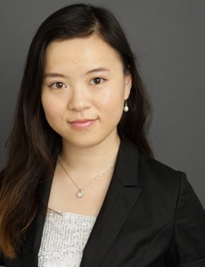

* [Fall 2021 Public Colloquia](#iaifi-public-colloquia)
* [Fall 2021 Internal Seminars](#iaifi-internal-seminars)
* [Related Workshops](#related-workshops)
* [Related Events](#related-public-events)

## IAIFI Public Colloquia 
### Fall 2021

We are pleased to announce the lineup for our Fall 2021 Colloquium series featuring leaders at the intersection of AI and Physics. 

All times are Boston time.  Please [sign up for our mailing list](http://mailman.mit.edu/mailman/listinfo/iaifi-news) to receive updates on future events.

You can also [watch our colloquia live on YouTube](https://www.youtube.com/channel/UCueoFcGm_15kSB-wDd4CBZA). 

* **[Surya Ganguli](https://ganguli-gang.stanford.edu/surya.html), Associate Professor, Applied Physics, Stanford University** 
    * **Friday, September 17, 2:00-3:00pm** 
    * *"Understanding computation using physics and exploiting physics for computation"*
    * Abstract: We are witnessing an exciting interplay between physics, computation and neurobiology that spans in multiple directions.  In one direction we can use the power of complex systems analysis, developed in theoretical physics and applied mathematics, to elucidate design principles governing how neural networks, both biological and artificial, learn and function. In another direction, we can exploit novel physics to instantiate new kinds of quantum neuromorphic computers using spins and photons. We will give several vignettes in both directions, including:  (1) determining the best optimization problem to solve in order to perform regression in high dimensions;  (2) deriving the detailed structure of the primate retina by analyzing optimal convolutional auto-encoders of natural movies; (3) describing and analyzing a quantum associative memory instantiated in a multimode cavity QED system; (4) understanding the geometry and dynamics of high dimensional optimization in the classical limit of a dissipative many-body quantum optimizer comprised of interacting photons.
    * References: Y. Bahri, J. Kadmon, J. Pennington, S. Schoenholz, J. Sohl-Dickstein, and S. Ganguli, Statistical mechanics of deep learning, Annual Reviews of Condensed Matter Physics, 2020.; M. Advani and S. Ganguli, Statistical mechanics of optimal convex inference in high dimensions, Physical Review X, 2016.; M. Advani and S. Ganguli, An equivalence between high dimensional Bayes optimal inference and M-estimation, NeurIPS, 2016.; S. Deny, J. Lindsey, S. Ganguli, S. Ocko, The emergence of multiple retinal cell types through efficient coding of natural movies, Neural Information Processing Systems (NeurIPS) 2018.; Y. Yamamoto, T. Leleu, S. Ganguli and H. Mabuchi, Coherent Ising Machines: quantum optics and neural network perspectives, Applied Physics Letters 2020.; B.P. Marsh, Y, Guo, R.M. Kroeze, S. Gopalakrishnan, S. Ganguli, J. Keeling, B.L. Lev, Enhancing associative memory recall and storage capacity using confocal cavity QED, Physical Review X, 2020.  

* **[Ben Wandelt](http://ilp.upmc.fr/wandelt.php), Director, Lagrange Institute**
    * **Friday, October 1, 2:00-3:00pm** 
    * *Details to come*

* **[Rose Yu](https://roseyu.com), Assistant Professor, Computer Science and Engineering, UC San Diego** 
    * **Friday, October 15, 2:00-3:00pm** 
    * *"Physics-Guided AI for Learning Spatiotemporal Dynamics"*
    * Abstract:  Applications such as public health, transportation, and climate science often require learning complex dynamics from large-scale spatiotemporal data. While deep learning has shown tremendous success in these domains, it remains a grand challenge to incorporate physical principles in a systematic manner to the design, training, and inference of such models. In this talk, we will demonstrate how to principally integrate physics in AI models and algorithms to achieve both prediction accuracy and physical consistency. We will showcase the application of these methods to problems such as forecasting COVID-19, traffic modeling, and accelerating turbulence simulations.

* **[Sven Krippendorf](https://krippendorflab.github.io), Senior Researcher, Mathematical Physics and String Theory, Ludwig-Maximilians Universität**
    * **Friday, October 29, 2:00-3:00pm** 
    * *Details to come*

* **[Yasaman Bahri](https://yasamanb.github.io), Research Scientist, Google Research, Brain Team**
    * **Friday, November 12, 2:00-3:00pm** 
    * *Details to come*

* **[Kazuhiro Terao](https://www.codingkazu.com), Staff Scientist, SLAC National Accelerator Laboratory, Stanford University**
    * **Friday, December 10, 2:00-3:00pm** 
    * *Details to come*

## IAIFI Internal Seminars 
### Fall 2021

These talks are only open to IAIFI members and affiliates.

  * **Year 2 State of the IAIFI Town Hall**
    * **Friday, September 10, 2:00-3:00pm** 

  * **Fabian Ruehle, Assistant Professor, Northeastern University**
    * **Friday, September 24, 2:00-3:00pm** 
    * *Learning metrics in extra dimensions*
    * Abstract: String theory is a very promising candidate for a fundamental theory of our universe. An interesting prediction of string theory is that spacetime is ten-dimensional. Since we only observe four spacetime dimensions, the extra six dimensions are small and compact, thus evading detection. These extra six-dimensional spaces, known as Calabi-Yau spaces, are very special and elusive. They are equipped with a special metric needed to make string theory consistent. This special property is given in terms of a (notoriously hard) type of partial differential equation. While we know, thanks to the heroic work of Calabi and Yau, that this PDE has a unique solution and hence that the metric exists, we neither know what it looks like nor how to construct it explicitly. However, the metric is an important quantity that enters in many physical observables, e.g. particle masses. Thinking of the metric as a function that satisfies three constraints that enter in the Calabi-Yau theorem, we can parameterize the metric as a neural network and formulate the problem as multiple continuous optimization tasks. The neural network is trained (akin to self-supervision) by sampling points from the Calabi-Yau space and imposing the constraints entering the theorem as customized loss functions.

  * **Di Luo, IAIFI Fellow**
    * **Friday, October 8, 2:00-3:00pm**
    * *Details to come*

  * **Cengiz Pehlevan, Assistant Professor, Applied Mathematics, Harvard University (SEAS)**
    * **Friday, October 22, 2:00-3:00pm**
    * *Details to come*
    
  * **Bryan Ostdiek, Postdoctoral Fellow, Theoretical Particle Physics, Harvard University**
    * **Friday, November 5, 2:00-3:00pm**
    * *Details to come*
    
  * **Tess Smidt, Assistant Professor, EECS, MIT**
    * **Friday, November 19, 2:00-3:00pm**
    * *Details to come*
        
  * **Harini Suresh**
    * **Friday, December 10, 2:00-3:00pm**
    * *"Ethics in AI"*

## Related Workshops

Upcoming workshops involving members of the IAIFI community:

  * [AI4EIC-Exp: Experimental Applications of Artificial Intelligence for the Electron Ion Collider, September 7-10, 2021 (online)](https://indico.bnl.gov/event/10699/)
  * [Machine Learning at GGI - Galileo Galilei Institute, August 22-September 30, 2022](https://www.ggi.infn.it/showevent.pl?id=414)

## Related Public Events

Other organizations that hold public events relevant to the IAIFI community:

  * [Physics Meets ML](http://www.physicsmeetsml.org/)
  * [CLARIPHY Topical Meetings](https://clariphy.org/topical.html)
  * [Understanding the Nature of Inference Colloquia](https://inferenceproject.yale.edu/colloquium-series)
  * [Stochastics and Statistics Seminars presented by the MIT Statistics and Data Science Center](https://stat.mit.edu/seminars/)