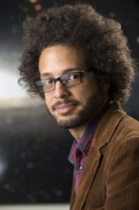

IAIFI's External Advisory Board (EAB) provides project oversight and advice to help ensure that the goals and objectives of the IAIFI are met and also offers guidance toward realizing and honing its vision. The EAB represents a balance of representation in several categories: research interests/expertise, expertise in areas contributing to IAIFI’s strategic goals, and diversity. The inaugural EAB includes experts in AI (both industry and academia), Physics Experiment, Physics Theory, and Astrophysics. It also includes experts with experience in Education and Workforce Development, Outreach, DEI, institute management, and industry.

### Max Welling, EAB Chair
**Research Chair in Machine Learning, University of Amsterdam; Distinguished Scientist and Director, Microsoft Research Amsterdam**

[Max Welling](https://staff.fnwi.uva.nl/m.welling/) is a research chair in Machine Learning at the University of Amsterdam and a Distinguished Scientist at Microsoft Research, where he is the head of the Microsoft Research Lab in Amsterdam. He is a fellow at the Canadian Institute for Advanced Research (CIFAR) and the European Lab for Learning and Intelligent Systems (ELLIS) where he also serves on the founding board.

### Paolo Calafiura
**Senior Scientist and Group Lead, Physics and X-Ray Science Computing Group, Lawrence Berkeley National Laboratory**

[Paolo Calafiura](https://dst.lbl.gov/people.php?p=PaoloCalafiura) is a computational physicist in the LBNL Physics and X-Ray Science Computing Group which he also leads. He works on software frameworks, tools and methods for high-energy and nuclear physics experiments. Currently, he is the US Computing and Software operations manager for the ATLAS experiment at CERN, and the PI of the Exa.TrkX project.

### Jennifer Chayes
**Associate Provost, Division of Computing, Data Science, & Society; Dean, School of Information; Professor of EECS, Information, Mathematics, and Statistics University of California, Berkeley**

[Jennifer Chayes](https://data.berkeley.edu/jennifer-chayes) is Associate Provost of the Division of Computing, Data Science, and Society, and Dean of the School of Information. She is Professor of EECS, Information, Mathematics, and Statistics. Before joining Berkeley, she was at Microsoft for over 20 years, where she was a Technical Fellow, and founder and managing director of 3 interdisciplinary labs. Chayes is one of the inventors of the field of graphons, which are widely used for the machine learning of large-scale networks.

### Shannon Swilley Greco
**Science Education Senior Program Leader, Princeton Plasma Physics Laboratory**

[Shannon Swilley Greco](https://www.shannonswilley.com/about) is the Science Education Senior Program Leader at the Princeton Plasma Physics Laboratory at Princeton University. Shannon is a leader in STEM education and outreach with 18 years of experience coordinating national networks of Education Outreach professionals and promoting diversity and inclusion in STEM fields. She was Education Coordinator for an NSF-funded Materials Research Science and Engineering Center (MRSEC) for 12 years, helping scientists meet the NSF's Broader Impact criteria.

### Jared Kaplan
**Associate Professor, Physics & Astronomy, Johns Hopkins University and Co-Founder of Anthropic**

[Jared Kaplan](https://physics-astronomy.jhu.edu/directory/jared-kaplan/) is Associate Professor of Physics at Johns Hopkins University and co-founder of Anthropic, an AI safety and research company. He is a theoretical physicist with broad interests in effective field theory, particle physics, cosmology, scattering amplitudes, and the conformal field theory (CFT) bootstrap. In the last few years he has also been collaborating with both physicists and computer scientists on Machine Learning research, including on scaling laws for neural models and the GPT-3 language model.

### Brian Nord
**Scientist, Cosmic Physics Center, Science Computing Division**

[Brian Nord](http://briandnord.com/bio) is a Scientist in Fermilab's Cosmic Physics Center and AI Project Office. At the University of Chicago, he is also a CASE Scientist in the Astronomy and Astrophysics Department and a Senior Member of the Kavli Institute for Cosmological Physics. Nord co-founded the Deep Skies Lab, which is an international community, dedicated to human-centered collaboration at the intersection of astrophysics and artificial intelligence. Nord also leads the KICP Space Explorers program for Chicago Public High School students.

### Lenka Zdeborová
**Associate Professor, École polytechnique fédérale de Lausanne (EPFL)**

[Lenka Zdeborová](http://artax.karlin.mff.cuni.cz/~zdebl9am/) is an Associate Professor at EPFL. She received her PhD in physics from University Paris-Sud and from Charles University in Prague in 2008. She spent two years in the Los Alamos National Laboratory as the Director's Postdoctoral Fellow. Lenka's expertise is in applications of methods developed in statistical physics, such as advanced mean field methods, replica method and related message passing algorithms, to problems in machine learning, signal processing, inference and optimization.
