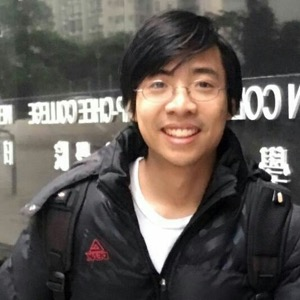

## Announcing the 2021-2024 IAIFI Fellows

We are pleased to announce our first round of IAIFI Fellows!  We are excited for [Anna](#anna-golubeva), [Di](#di-luo), [Siddharth](#siddharth-mishra-sharma), and [Ge](#ge-yang) to join us later this year and help spark vital interdisciplinary research at the intersection of Physics and AI!

### Anna Golubeva

**Research Interests**:  Anna Golubeva's main research focus is on developing a theory of deep learning using approaches from theoretical physics. Her goal is to contribute towards understanding the tools of AI and leveraging them to advance both AI and the physical sciences. Her projects include both the application of deep learning methods for quantum many-body problems, as well as a theory-based analysis of deep learning systems, exploiting approaches from information theory, statistical learning theory, and statistical physics. She is currently particularly interested in the subject of sparsity in neural networks.

**Biographical Sketch**:  Anna Golubeva obtained her PhD in 2021 at the Perimeter Institute for Theoretical Physics and the University of Waterloo, where she was advised by Roger Melko. During her PhD, she was also a graduate affiliate at the Vector Institute for AI in Toronto. Previously, she completed the Perimeter Scholars International master's program (2017), a MSc in Theoretical Physics with focus on computational approaches to quantum many-body systems (2016), and a BSc in Biophysics (2014) at the Goethe University in Frankfurt, Germany.

### Di Luo

**Research Interests**:  Di Luo is working on research in the intersection of quantum many-body physics, quantum information science, and artificial intelligence. He is interested in understanding nature from the perspectives of information and computation as well as developing intelligence inspired by ideas from physics. Di Luo has been developing machine learning algorithms and quantum algorithms for condensed matter physics, high energy physics, and quantum information science.

**Biographical Sketch**:  Di Luo received his undergraduate degree with majors in physics and mathematics from the University of Hong Kong in 2016 and pursued his Ph.D. in physics at the University of Illinois, Urbana-Champaign.  Di Luo will become an IAIFI Fellow at the NSF AI Institute for Artificial Intelligence and Fundamental Interactions in 2021.

### Siddharth Mishra-Sharma

**Research Interests**: Siddharth Mishra-Sharma is interested in developing novel statistical methods for accelerating the discovery of new physics in astrophysical and cosmological observations at all accessible scales. He is especially focused on developing analysis techniques based on machine learning that enable new ways of searching for signatures of physics beyond the Standard Model, in particular the nature of dark matter, using data from ongoing and upcoming cosmological surveys. Towards this end, Siddharth is interested in incorporating physical insights, symmetries, and laws into machine learning algorithms as well as extracting physical insights, symmetries, and laws using machine learning algorithms from noisy physics datasets.

**Biographical Sketch**: Prior to joining the NSF AI Institute for Artificial Intelligence and Fundamental Interactions as an IAIFI Fellow, Siddharth Mishra-Sharma was a postdoctoral associate at the Center for Cosmology and Particle Physics at New York University from 2018-2021. He received his Ph.D. in Physics from Princeton University in 2018. He read Natural Sciences and Mathematics at the University of Cambridge, where he was a member of Peterhouse, receiving his undergraduate degree in 2013.  Siddharth grew up in Moscow, Russia.

### Ge Yang

**Research Interests**:  Ge Yang's research involves two sets of related problems. The first is to make distributed representation in a neural net generalizable by finding ways to automatically discover causal structures that are equivariant to symmetry transformations. The second is to solve key open problems in deep reinforcement learning, including exploration and ways to learn off-line from static datasets, using search and planning.

**Biographical Sketch**:  Ge Yang grew up on the north side of Beijing, graduated in 2010 with his undergraduate degree in Physics and Mathematics from Yale, and received his Ph.D. in Physics from the University of Chicago. He visited UC Berkeley to work with Pieter Abbeel in 2018, followed by a research internship at Facebook AI Research with Roberto Calandra, and one at Google DeepMind in London with Volodomyr Mnih. He is currently a postdoctoral fellow at the NSF AI Institute for Artificial Intelligence and Fundamental Interactions.

## Call for Applications for 2022-2025 IAIFI Fellows

**We plan to launch a new call for IAIFI Fellows in Summer 2021.**  Please stay tuned and [sign up for our mailing list](http://mailman.mit.edu/mailman/listinfo/iaifi-news) to receive information about this fellowship.  Below is information adapted from the previous call, but subject to change.

Of critical importance to the IAIFI vision is our IAIFI Fellows program, which aims to recruit and train the most talented, promising, and diverse group of researchers at an early stage of their careers. These Fellows will spark vital interdisciplinary, multi-investigator, multi-subfield collaborations. Such collaborations have immense power to generate new ideas and approaches, to facilitate abstracting physics challenges beyond their native domains, and to instill a common language across disciplines.  Our program aims to appoint three new postdoctoral IAIFI Fellows each academic year, for a three-year fellowship term each.

Fellows will be selected through an annual application process.  Applicants should have, or be expected to receive by the start date of the Fellowship, a PhD in Physics, Statistics, Computer Science, or a related field.  Complete applications must include:

* Cover letter (no more than 1 page);
* CV (1-2 pages recommended, but longer accepted);
* Statement of research interests (no more than 2 pages);
* List of publications;
* Exactly three reference letters.
  
The deadline to receive all the materials (including all reference letters) will be announced in Summer 2021.

  The Fellows will have substantial freedom in choosing their research focus; each fellow will be assigned two mentors – one from Physics and one from AI – to guide their choice of research topic and evaluate their research progress.  The IAIFI is committed to building a culturally diverse intellectual community, and strongly encourages applications from women and minorities.  Any inquiries about the program should be directed to <iaifi-fellows@mit.edu>.

The IAIFI is a joint NSF-funded venture between MIT, Harvard, Northeastern, and Tufts.  Fellows are encouraged to collaborate with other IAIFI members and can have affiliations with any or all of the participating universities.

<!---
### Call for Applications

[2021-2024 IAIFI Fellowship Program on AcademicJobsOnline](https://academicjobsonline.org/ajo/jobs/16695)
{:.info}

Of critical importance to the IAIFI vision is our IAIFI Fellows program, which aims to recruit and train the most talented, promising, and diverse group of researchers at an early stage of their careers. These Fellows will spark vital interdisciplinary, multi-investigator, multi-subfield collaborations. Such collaborations have immense power to generate new ideas and approaches, to facilitate abstracting physics challenges beyond their native domains, and to instill a common language across disciplines.  Our program aims to appoint three new postdoctoral IAIFI Fellows each academic year, for a three-year fellowship term each.

Fellows will be selected through an [annual application process](https://academicjobsonline.org/ajo/jobs/16695).  Applicants should have, or be expected to receive by the 1st of September 2021, a PhD in Physics, Statistics, Computer Science, or a related field.  Complete applications must include:

* Cover letter (no more than 1 page);
* CV (1-2 pages recommended, but longer accepted);
* Statement of research interests (no more than 2 pages);
* List of publications;
* Exactly three reference letters.
  
**The deadline to receive all the materials (including all reference letters) is the 20th of October 2020.**

  The Fellows will have substantial freedom in choosing their research focus; each fellow will be assigned two mentors – one from Physics and one from AI – to guide their choice of research topic and evaluate their research progress.  The IAIFI is committed to building a culturally diverse intellectual community, and strongly encourages applications from women and minorities.  Any inquiries about the program should be directed to <iaifi-fellows@mit.edu>.

The IAIFI is a joint NSF-funded venture between MIT, Harvard, Northeastern, and Tufts.  Fellows are encouraged to collaborate with other IAIFI members and can have affiliations with any or all of the participating universities.

### FAQ

*  *What is the anticipated start date for the 2021-2024 IAIFI Fellowship?*  The expected start date is September 1, 2021, but we will consider alternative start dates on a case by case basis.
*  *Will you sponsor visas for international applicants?*  If selected for an IAIFI Fellowship, we will work with the MIT International Scholars Office (ISchO) to determine the [appropriate visa for your situation](http://web.mit.edu/scholars/administrators/sponsorshippolicy.html#visaspon).
*  *Am I still eligible for an IAIFI Fellowship if my research is only in Physics or only in AI?*  The aim of the IAIFI is to foster interdisciplinary research at the intersection of Physics and AI.  Even if your expertise is only in one area, your proposed research should aim to build bridges across disciplines.
*  *Can my application include four reference letters?*  No, in order to keep the selection criteria uniform, each candidate can only have three reference letters in their application.
--->
