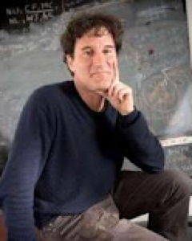

 

The IAIFI Symposium on the Impact of Generative AI in the Physical Sciences brings leading researchers in generative AI and physics together for plenary talks, panels, and discussion, to define the potential for this class of tools to impact physics research, and to understand what is needed for this potential to be realized. The organizers will be generating a whitepaper after the Symposium on the workshop topic, so themes from the talks and discussions may appear in the whitepaper. Credit will be given where appropriate.

* When: March 14–15, 2024
* Where: MIT College of Computing (Building 45), 8th floor (51 Vassar St, Cambridge, MA)

[Agenda](#agenda){:.button.button--outline-primary.button--pill.button--lg} [Speakers](#speakers){:.button.button--outline-primary.button--pill.button--lg} [Organizing Committee](#organizing-committee){:.button.button--outline-primary.button--pill.button--lg}

## About
The Institute for Artificial Intelligence and Fundamental Interactions (IAIFI) is enabling physics discoveries and advancing foundational AI through the development of novel AI approaches that incorporate first principles, best practices, and domain knowledge from fundamental physics.

This event is funded by MIT's Office of the Provost.

Additional support from [A3D3](https://a3d3.ai). 
 

## Agenda

### Thursday, March 14, 2024

**9:00 am–9:30 am ET**

Breakfast and Introduction (coffee and pastries will be provided)

**9:30–10:30 am ET**

*Foundation Models in Physics: Successes in Astrophysics*

Anna Scaife, University of Manchester

**10:30–11:00 am ET**

Break (coffee and pastries will be provided)

**11:00 am–12:00 pm ET**

*Physics-Motivated Approaches to Model Design: Deep Learning*

Simon Batzner, Google DeepMind

**12:00–1:30 pm ET**

Lunch Break (working meeting for speakers and organizers)

**1:30–2:30 pm ET**

*Foundation Models beyond Physics: Successes in Molecular Biology*

Kevin Yang, Microsoft Research

**2:30–3:00 pm ET**

Break (coffee and snacks will be provided)

**3:00–4:00 pm ET**

*Physics-Motivated Approaches to Model Design: Observations and Data Analysis*

David Hogg, NYU/Flatiron

**4:00–5:30 pm ET**

*Panel: Community Perspectives on what is needed for generative AI to fulfill its promise in physics*

Dan Huttenlocher (MIT), Vijay Reddi (Harvard), Jesse Thaler (MIT/IAIFI)

### Friday, March 15, 2024

**9:00 am–10:30 am ET**

*Panel: Potential impacts of generative AI in physics*

Pavel Izmailov (OpenAI), Michael Brenner (Google), David Hogg (NYU/Flatiron)

**10:30–11:00 am ET**

Break (coffee and pastries will be provided)

**11:00 am–12:00 pm ET**

*Big vs. Small Generative Models*

Song Han, MIT

**12:00–1:30 pm ET**

Lunch Break (working meeting for speakers and organizers)

**1:30–2:30 pm ET**

*Physics-Motivated Approaches to Hardware Design*

Thea Aarrestad, ETH Zurich

**2:30–3:00 pm ET**

Break (coffee and snacks will be provided)

**3:00–4:00 pm ET**

*Physics-Motivated Approaches to Model Design: Natural Science of Artificial Intelligence*

Hidenori Tanaka, Harvard 

**4:00–5:15 pm ET**

Fireside Chat: Jared Kaplan, Anthropic (Virtual)

**5:15–5:30 pm ET**

Closing

## Speakers

  <!--
-->

     

         
         

         

         <a href="https://thaarres.github.io">Thea Aarrestad</a>
         

         

         <em> Senior Research Fellow, ETH Zurich </em>  
         

         

       

     

         
         

         

         <a href="https://simonbatzner.github.io">Simon Batzner</a>
         

         

         <em> Research Scientist, Google DeepMind </em>  
         

         

       

     

         
         

         

         <a href="https://hanlab.mit.edu/songhan">Song Han</a>
         

         

         <em> Associate Professor, EECS, MIT </em>  
         

         

       

     

         
         

         

         <a href="https://cosmo.nyu.edu/hogg/">David Hogg</a>
         

         

         <em> Professor, Physics and Data Science, New York University </em>  
         

         

       

     

         
         

         

         <a href="https://research.manchester.ac.uk/en/persons/anna.scaife">Anna Scaife</a>
         

         

         <em> Professor, Radio Astronomy, University of Manchester </em>  
         

         

       

     

         
         

         

         <a href="https://sites.google.com/view/htanaka/home">Hidenori Tanaka</a>
         

         

         <em> Group Leader, NTT Research, Harvard </em>  
         

         

       

     

         
         

         

         <a href="https://www.microsoft.com/en-us/research/people/kevyan/">Kevin Yang</a>
         

         

         <em> Senior Researcher, Microsoft Research </em>  
         

         

       

  <!--
  

  -->

## Panelists

  <!--
-->

     

         
         

         

         <a href="https://research.google/people/michael-p-brenner/">Michael Brenner</a>
         

         

         <em> Professor/Researcher, Harvard/Google Research </em>  
         

         

       

     

         
         

         

         <a href="https://cosmo.nyu.edu/hogg/">David Hogg</a>
         

         

         <em> Professor, Physics and Data Science, New York University </em>  
         

         

       

     

         
         

         

         <a href="https://web.mit.edu/hutt/www/">Daniel Huttenlocher</a>
         

         

         <em> Dean, MIT Schwarzman College of Computing </em>  
         

         

       

     

         
         

         

         <a href="https://izmailovpavel.github.io">Pavel Izmailov</a>
         

         

         <em> Research Scientist, OpenAI </em>  
         

         

       

     

         
         

         

         <a href="https://scholar.harvard.edu/vijay-janapa-reddi/home">Vijay Reddi</a>
         

         

         <em> Associate Professor, SEAS, Harvard </em>  
         

         

       

     

         
         

         

         <a href="https://jthaler.net">Jesse Thaler</a>
         

         

         <em> Professor, Physics, MIT & IAIFI Director </em>  
         

         

       

  <!--
  

  -->

## Fireside Chat

  <!--
-->
     

         
         

         

         <a href="https://physics-astronomy.jhu.edu/directory/jared-kaplan/">Jared Kaplan</a>
         

         

         <em> Co-Founder, Anthropic </em>  
         

         

       

  <!--
  

  -->

## Organizing Committee 
* Phil Harris (MIT)
* Phiala Shanahan (MIT)
* Gaia Grosso (IAIFI Fellow)
* Siddharth Mishra-Sharma (IAIFI Fellow)
* Marisa LaFleur (IAIFI Project Manager)
