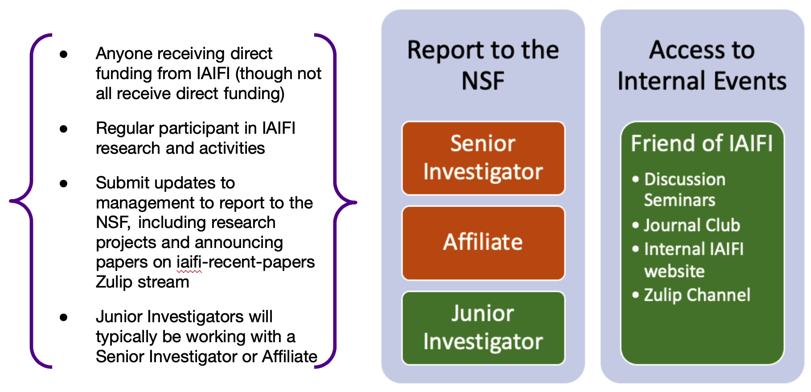

If you are currently an IAIFI member and would like to get more involved in IAIFI-related activities, browse this page for opportunities that interest you.

* [Understand Levels of Involvement](#understand-levels-of-involvement)
* [Join an IAIFI Committee](#join-an-iaifi-committee)
* [Access the IAIFI Internal Website](#access-the-iaifi-internal-website)
* [Lead an IAIFI Journal Club](#lead-an-iaifi-journal-club)
* [Attend IAIFI Discussion Seminars](#attend-iaifi-discussion-seminars)
* [Explore Career and PhD Opportunities](#explore-career-and-phd-opportunities)
* [Collaborate on IAIFI Research Projects](#collaborate-on-iaifi-research-projects)
* [Share Achievements with IAIFI Management](#share-achievements-with-iaifi-management)
* [Get Involved Beyond IAIFI](#get-involved-Beyond IAIFI)

## Understand Levels of Involvement
There are various levels at which you can be involved in IAIFI. Unless otherwise noted, the opportunities listed on this page are available to members at all levels of involvement in IAIFI. If you are not currently a Friend of IAIFI, Affiliate, Junior Investigator, or Senior Investigator, visit the [Get Involved page](get-involved.html).

    

## Join an IAIFI Committee
* **Speaker Selection Committee:** Identifies and invites speakers for our IAIFI Internal Discussion Seminar series and our IAIFI Public Colloquium series
    * This Committee is led by Cora Dvorkin (Colloquium organizer) and Demba Ba (Discussion Seminar organizer)
    * *We are currently looking for volunteers for this Committee;* [Email IAIFI Management](mailto:iaifi-management@mit.edu) if you are interested in volunteering
* **Community Building Committee:** Coordinates opportunities for making connections across IAIFI, including sharing research, networking, and facilitating random connections
    * This Committee is led by Max Tegmark (Community Building Coordinator), Demba Ba (Foundational AI Research Coordinator), Phil Harris (Physics Experiment Research Coordinator), and Phiala Shanahan (Physics Theory Research Coordinator)
    * *We are currently looking for volunteers for this Committee;* [Email IAIFI Management](mailto:iaifi-management@mit.edu) if you are interested in volunteering
* **Early Career and Equity Committee:** Serves as an advisory body to the IAIFI Management
on aspects related to early career researchers and diversity, equity, and inclusion, as well as to oversee the well-being and working environment of all IAIFI members.
    * Current Members: Tracy Slatyer (Chair), Edo Berger, Harold Erbin, Katie Fraser, Jasmine Gill, Anindita Maiti, Siddharth Mishra-Sharma, Marisa LaFleur (Project Manager)
    * The Committee will rotate membership in January 2022
    * [Email Tracy Slatyer](mailto:tslatyer@mit.edu) if you're interested in learning more
* **PhD Summer School Committee:** Organizes PhD Summer School and subsequent workshop, aimed at educating PhD students interested in the intersection of AI and Physics, as well as broadening our impact beyond IAIFI members
    * Current Members: Jim Halverson (Chair), Tess Smidt, Anna Golubeva, Jeffrey Lazar, Peter Lu, Dylan Rankin, Marisa LaFleur (Project Manager)
    * The Committee is currently planning the PhD Summer School for Summer 2022
    * [Email Jim Halverson](mailto:j.halverson@northeastern.edu) if you have ideas or would like to express interest in volunteering for events during the Summer School

## Access the IAIFI Internal Website
* Sign in to [internal.iaifi.org](https://internal.iaifi.org)
* If you do not have access, [email IAIFI Management](mailto:iaifi-management@mit.edu)
* Resources on the internal website include:
    * affiliation and acknowledgment details for IAIFI-related papers;
    * access to sign up for the IAIFI Zulip;
    * recordings of previous seminars;
    * information on available tools from industry partners.

## Lead an IAIFI Journal Club
* Any IAIFI member or partner can [sign up to lead an IAIFI Journal Club](https://forms.gle/zfpT4QQdXg8tu6VB7)
* Journal Club is led by Andrew Tan and John Martyn
* Previous Journal Club slides and resources can be found on the [IAIFI internal website](https://internal.iaifi.org/journal-club) (if you do not have access, [email IAIFI Management](mailto:iaifi-management@mit.edu))

## Attend IAIFI Discussion Seminars
* [View the full schedule for Discussion Seminars](events.html#iaifi-internal-seminars)
* [Watch recordings of past seminars](https://internal.iaifi.org/internal-events/) on the IAIFI internal website (if you do not have access,
[email IAIFI Management](mailto:iaifi-management@mit.edu))
* Make sure you are on the internal IAIFI mailing list to receive announcements and Zoom information  (if you are not receiving iaifi-all emails, [email IAIFI Management](mailto:iaifi-management@mit.edu))

## Explore Career and PhD Opportunities
* Apply to the [MIT Interdisciplinary PhD in Physics, Statistics, and Data Science](https://physics.mit.edu/academic-programs/graduate-students/psds-phd/)
    * Students currently enrolled in the Physics doctoral program at MIT or another participating MIT doctoral program
    * For access to the selection form to apply, [email the IDSS Academic Office](idss_academic_office@mit.edu)
* Apply to be an [IAIFI Fellow](fellows.html)
* Apply for [other postdoc positions with IAIFI involvement](get-involved.html#prospective-postdocs)
* Apply for [PhD programs at IAIFI institutions](https://iaifi.org/get-involved.html#prospective-graduate-students)
* Follow the IAIFI [#job opportunities Zulip stream](https://iaifi.zulipchat.com/#narrow/stream/283724-job-opportunities) (if you do not have access, [email IAIFI Management](mailto:iaifi-management@mit.edu))

## Collaborate on IAIFI Research Projects
* [View the People page](people.html) to identify other IAIFI researchers who you may be interested in collaborating with
* Share research questions and ideas on the [#general research IAIFI Zulip stream](https://iaifi.zulipchat.com/#narrow/stream/287317-general-research)

## Share Achievements with IAIFI Management
* *When a paper is posted to arXiv:* post to the [#recent-iaifi-papers stream on the IAIFI Zulip](https://iaifi.zulipchat.com/#narrow/stream/278668-recent-iaifi-papers) (if you do not have access,[email IAIFI Management](mailto:iaifi-management@mit.edu))
* *When a paper is published:* [Email Marisa LaFleur](mailto:mlafleur@mit.edu) (IAIFI Project Manager) with link to published article
* *When giving a talk, organizing a workshop, etc:* [Email IAIFI Management](mailto:iaifi-management@mit.edu) so that we can advertise on our [Events page](events.html), share on Zulip, and include in reports
* *When you're in the news:* [Email IAIFI Management](mailto:iaifi-management@mit.edu) so that we can share on the [home page](index.html) (news on the home page is eventually moved to the [News Archive](iaifi-news.html)), [tweet about it](https://twitter.com/iaifi_news), and include in reports

## Get Involved Beyond IAIFI
* We encourage IAIFI members to be involved in programs and initiatives not affiliated with IAIFI, but which can provide new insights and value to the IAIFI community, including sharing relevant events and best practices. For example:
    * Participate in [MIT's SERC](https://computing.mit.edu/cross-cutting/social-and-ethical-responsibilities-of-computing/) (Social and Ethical Responsibilities of Computing) by joining the [SERC Scholars Program](https://computing.mit.edu/cross-cutting/social-and-ethical-responsibilities-of-computing/serc-scholars-program/) or reading the [MIT Case Studies in Social and Ethical Responsibilities of Computing](https://mit-serc.pubpub.org)
    * Participate in your institution's affinity groups:
        * MIT (Grad Students): [Graduate Women at MIT](https://gsc.mit.edu/gwamit/); [LGBT Grad](https://stuff.mit.edu/afs/athena/activity/l/lgbtgrad/www/); [LGBT Grad QPoC](http://grad-qpoc-admin@mit.edu/); [Women's Initiative](http://web.mit.edu/wi/); [Graduate Women in Physics](http://web.mit.edu/physics/wphys/index.html); [SPXCE (Social Justice Programming & Cross Cultural Engagement)](https://studentlife.mit.edu/spxce)
        * MIT (Postdocs/Faculty): [Postdoc Diversity, Equity, and Inclusion Committee](https://pda.mit.edu/resources/diversity/); [qtPhDs](https://qtphds.mit.edu); [MIT Black Postdoctoral Group](https://bpg.mit.edu); [Postdoctoral Organization for Women Engaged in Research (POWER)](https://pda.mit.edu/events/power/); [Employee Resource Groups](https://hr.mit.edu/diversity-equity-inclusion/ergs)
        * Harvard (Grad Students): [AstroGrad Network](https://engage.gsas.harvard.edu/organization/agn); [GSAS Society of Underrepresented Students in STEM](https://engage.gsas.harvard.edu/organization/gsuss); [Harvard Graduate Women in Science and Engineering at Harvard University at GSAS (HGWISE)](https://engage.gsas.harvard.edu/organization/hgwise); [LGBTQ@GSAS Association](https://engage.gsas.harvard.edu/organization/lgtbq); [InTouch (SEAS)](https://engage.gsas.harvard.edu/organization/intouch); [Physics Graduate Student Council](https://engage.gsas.harvard.edu/organization/pgsc); [SEAS Graduate Council](https://engage.gsas.harvard.edu/organization/seas); [W.E.B. Du Bois Graduate Society of GSAS](https://engage.gsas.harvard.edu/organization/webdubois)
        * Harvard (Postdocs/Faculty): [FAS Postdoctoral Association](https://postdoc.fas.harvard.edu/PDA); [Association of Black Faculty, Administrators, and Fellows (ABFAF)](https://employeeresourcegroups.harvard.edu/abfaf); [Association of Harvard Asian and Asian American Faculty and Staff (AHAAAFS)](https://employeeresourcegroups.harvard.edu/ahaaafs); [Association of Harvard Latinx Faculty and Staff (AHLFS)](https://employeeresourcegroups.harvard.edu/ahlfs); [LGBTQ+ Faculty and Staff (QERG)](https://employeeresourcegroups.harvard.edu/qerg); [Committee on the Concerns of Women (CCW)](https://employeeresourcegroups.harvard.edu/ccw)
        * Northeastern (Grad Students): [Graduate Students of Color Collective](https://neu.campuslabs.com/engage/organization/graduate-students-of-color-collective); [Graduate Women in Science and Engineering (GWISE)](https://coe.northeastern.edu/orgs/gwise-graduate-women-in-science-and-engineering/); [Physics Graduate Student Association](https://giving.northeastern.edu/live/profiles/927-club-physics-graduate-student-association); [AI Skunkworks at Northeastern](https://neu-ai-skunkworks.github.io/about-us.html); [Alliance for Diversity in Science and Engineering](https://neu.campuslabs.com/engage/organization/alliance-for-diversity-in-science-and-engineering)
        * Northeastern (Postdocs/Faculty): [LGBTQA+ Faculty and Staff Affinity Group](https://provost.northeastern.edu/odei/affinity/lgbtqa/#_ga=2.239745219.1711678861.1634830744-36578417.1634830500); [Native and Indigenous Affinity Group](https://provost.northeastern.edu/odei/affinity/native/#_ga=2.202046673.1711678861.1634830744-36578417.1634830500); [NU Dream (Faculty and Staff of Color Affinity Group)](https://provost.northeastern.edu/odei/affinity/nudream/#_ga=2.266932302.1711678861.1634830744-36578417.1634830500); [Black Faculty and Staff Association (BFSA)](https://provost.northeastern.edu/odei/affinity/nu-bfs/); [Northeastern University Future Leaders (NUFL)](https://provost.northeastern.edu/odei/affinity/nufl/); [Asian Faculty and Staff Affinity Group](https://provost.northeastern.edu/odei/affinity/asian-faculty-staff/)
        * Tufts (Grad Students): [Physics and Astronomy Student Society](http://sites.tufts.edu/gpass/); [Black Students in Computer Science](https://hlbranch.wixsite.com/tuftsbscs); [Women in Computer Science](https://wicstufts.wixsite.com/wicstufts); [GLBT Grad Group](https://signup.e2ma.net/signup/1879669/1758137/); 
        * Tufts (Postdocs/faculty): [Employee Resource Groups](https://diversity.tufts.edu/resources/employee-resource-groups/)
* If you have other suggestions for ways the IAIFI community can be involved beyond IAIFI, [email IAIFI Management](mailto:iaifi-management@mit.edu)

<!--
In the future include opportunities for outreach, mentoring, community events, etc.
-->