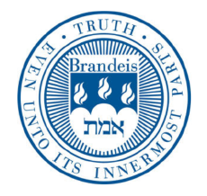
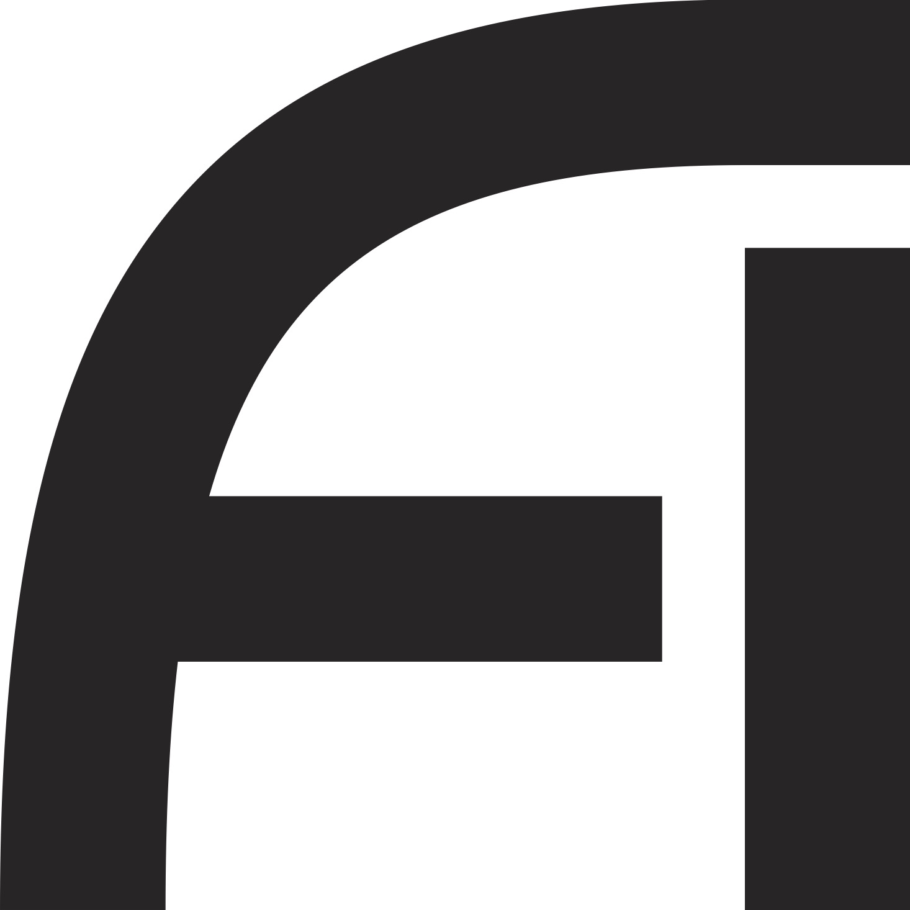

Thank you for your interest in getting involved with IAIFI! Navigate to the role that best describes you to learn more about opportunities to apply to jobs with connections to IAIFI depending on your career stage and location. 

* [Prospective Faculty](#prospective-faculty)
* [Prospective Postdocs](#prospective-postdocs)
* [Prospective Graduate Students](#prospective-graduate-students)
* [Prospective Undergraduate Students](#prospective-undergraduate-students)

## Prospective Faculty

IAIFI does not have dedicated faculty opportunities, but there are often open faculty positions in IAIFI-affiliated universities.

<!---

### MIT Center for Theoretical Physics

* [Junior faculty openings in the MIT CTP](http://academicjobsonline.org/ajo/mit/ctp/)
* Deadline: N/A
--->

### MIT Physics Division of Experimental Particle and Nuclear Physics

* [Junior faculty openings in MIT Physics NUPAX](https://academicjobsonline.org/ajo/jobs/23062)
* Deadline: December 1, 2022

### MIT Department of Electrical Engineering and Computer Science (EECS)

* [Junior faculty openings in MIT EECS](https://faculty-searches.mit.edu/eecs/)
* Deadline: December 1, 2022

### Harvard University Department of Physics
* [Tenure-track Professor in Physics](https://www.physics.harvard.edu/jobs)
* Deadline: November 15, 2022 or until position is filled

<!---
### Harvard University School of Engineering and Applied Sciences (SEAS)
* [Tenure-track faculty openings in Harvard School of Engineering and Applied Sciences](https://www.seas.harvard.edu/office-faculty-affairs/open-academic-positions?job_type%5Btenure%5D=tenure&sort_by=search_api_relevance)
* Deadline: Applications currently closed.
--->

<!---

### Tufts University Department of Computer Science
* [Assistant or Associate Professor in AI opening at Tufts University Department of Computer Science](https://apply.interfolio.com/92330)
* Deadline: Applications currently closed.
--->

### Northeastern University Khoury College of Computer Sciences
* [Teaching Professor openings in Computer Science](https://northeastern.wd1.myworkdayjobs.com/en-US/careers/details/Assistant-Teaching-Professor-Associate-Teaching-Professor-Full-Teaching-Professor---Boston_R108315)
* Deadline: December 1, 2022 (or until search is complete)

### Brandeis University Department of Mathematics
* [Tenure-Track Assistant Professor in Applied Mathematics](https://www.mathjobs.org/jobs/list/20758)
* Deadline: November 1, 2022 

## Prospective Postdocs

The flagship postdoctoral opportunity in IAIFI is the IAIFI Fellowship program, but there are other postdoctoral opportunities with IAIFI-affiliated researchers.

### IAIFI Fellowship 

* [Apply to be an IAIFI Fellow](fellows.html)
* Deadline:  October 11, 2022 to start September 2023
* Three-year appointment to spark interdisciplinary, multi-investigator, multi-subfield collaborations
* Applicants should have (or be expected to receive by September 1 of the starting year), a PhD in Physics, Statistics, Computer Science, or a related field

### Other Postdoc Positions with IAIFI Involvement

#### MIT

<!---
* [Postdoc openings in the MIT Kavli Institute for Astrophysics and Space Research](https://careers.peopleclick.com/careerscp/client_mit/external/jobDetails/jobDetail.html?jobPostId=22645&localeCode=en-us)
    * Deadline: Applications currently closed.
--->

* [MEnTorEd Opportunities in Research (METEOR) Fellowship in MIT CSAIL](https://www.csail.mit.edu/meteor)
    * Deadline: February 1, 2023 (applications open November 15, 2022

* [Postdoc openings in the MIT Center for Theoretical Physics](http://academicjobsonline.org/ajo/mit/ctp/)
    * Deadline: November 15, 2022

* [Postdoc opening in the Laboratory for Nuclear Science (CERN LHCb experiment)](https://inspirehep.net/jobs/2154541)
    * Deadline: October 30, 2022

* [Pappalardo Fellowship](https://physics.mit.edu/research/pappalardo-fellowships-in-physics/competition/)
    * Deadline: Nominations currently closed. 

#### Harvard University

<!---
* [High Energy Theory Physics Postdoc openings at Harvard](https://academicjobsonline.org/ajo/jobs/20235)
    * Deadline: Applications currently closed.
--->

* [Postdoc opportunities in ML Theory Group at Harvard](https://mltheory.org/#opportunities)
    * Deadlines vary

* [Institute for Theory and Computation (ITC) Postdoc openings at the Harvard-Smithsonian Center for Astrophysics](https://pweb.cfa.harvard.edu/opportunities/fellowships-visiting-scientist-positions/itc-fellowship)
    * Deadline: November 14, 2022

* [Postdoctoral Fellowship opportunities in Harvard Data Science Initiative](https://datascience.harvard.edu/data-science-postdoctoral-fellows)
    * Deadline: November 14, 2022

* [Center for Astrophysics Fellowship at Harvard](https://www.cfa.harvard.edu/opportunities/fellowships-visiting-scientist-positions/cfa-fellowship)
    * Deadline: October 28, 2022

* [Postdoc opportunities in Time-Domain Astrophysics, Center for Astrophysics at Harvard](https://jobregister.aas.org/ad/157a4609)
    * Deadline: December 1, 2022

### Brandeis University

* [Postdoctoral Research positions in Mathematics](https://www.mathjobs.org/jobs/list/20706)
* Deadline: December 1, 2022

<!---

#### Northeastern University

* [Theoretical Particle Physics openings at Northeastern](https://academicjobsonline.org/ajo/jobs/20224)
    * Deadline: Applications currently closed.

* [Khoury College of Computer Sciences Research Fellowship](https://www.khoury.northeastern.edu/research/fellowship/)
    * Deadline: Applications currently closed.
--->

#### NSF Mathematical Sciences Postdoctoral Research Fellowship

* [Apply for a Mathematical Sciences Postdoctoral Research Fellowship (MSPRF)](https://www.nsf.gov/pubs/2022/nsf22619/nsf22619.htm?WT.mc_ev=click&WT.mc_id=&utm_medium=email&utm_source=govdelivery)
* Awarded to an individual, not institution
* Candidates need a sponsoring scientist and host institution, so if you are interested in applying to work with IAIFI, ask an [IAIFI Senior Investigator](people.html#senior-investigators) to sponsor you or contact [IAIFI Management](mailto:iaifi-management@mit.edu) for help identifying a sponsor
* Deadline: October 19, 2022

<!---
### MPS-Ascend Fellowship
* [Apply for a Mathematical and Physical Sciences Ascending Postdoctoral Research Fellowship](https://www.nsf.gov/pubs/2022/nsf22501/nsf22501.pdf?WT.mc_id=USNSF_34&WT.mc_ev=click)
* Awarded to an individual, not institution
* Candidates need a sponsoring scientist and host institution, so if you are interested in applying to work with IAIFI, ask an [IAIFI Senior Investigator](people.html#senior-investigators) to sponsor you or contact [IAIFI Management](mailto:iaifi-management@mit.edu) for help identifying a sponsor
* Applications currently closed.
--->

## Prospective Graduate Students

IAIFI does not have a dedicated PhD program, but PhD students at any of the partner institutions may collaborate with IAIFI researchers to become a Junior Investigator.

### MIT Graduate Program in Physics

* [Apply to be an MIT Physics graduate student](https://gradapply.mit.edu/physics)
* Deadline: December 15 for the following academic year
* Learn about the [MIT Physics program](https://physics.mit.edu/academic-programs/graduate-students/)
* Learn about the [Interdisciplinary PhD in Physics, Statistics and Data Science](https://physics.mit.edu/academic-programs/graduate-students/psds-phd/)

### MIT Graduate Program in Electrical Engineering and Computer Science

* [Apply to be an MIT EECS graduate student](https://gradapply.mit.edu/eecs)
* Deadline: December 15 for the following academic year
* Learn more about the [MIT EECS program](https://www.eecs.mit.edu/academics-admissions/graduate-program)

### MIT Summer Research Program
* [Apply to the MIT Summer Research Program (MSRP)](https://mitodgediversity.slideroom.com/#/login/program/64398) to be hosted by an IAIFI Senior Investigator for summer research
* Deadline: January 10, 2022 for Summer 2022
* Learn more about [the MSRP program](https://oge.mit.edu/graddiversity/msrp/)
* [View interested faculty mentors](https://infogram.com/2022-msrp-interested-faculty-1hzj4o3lndy834p?live) 

### Harvard Graduate Program in Physics

* [Apply to be a Harvard Physics graduate student](https://gsas.harvard.edu/programs-of-study/all/physics)
* Deadline: December 15 for the following academic year
* Learn more about the [Harvard Physics program](https://www.physics.harvard.edu/academics/grad)

### Harvard Graduate Program in Engineering and Applied Sciences (SEAS)

* [Apply to be a Harvard SEAS graduate student](https://gsas.harvard.edu/programs-of-study/divisions/school-engineering-and-applied-sciences)
* Deadline: December 15 for the following academic year
* Learn more about the [Harvard SEAS program](https://www.seas.harvard.edu)

### Northeastern Graduate Program in Physics

* [Apply to be a Northeastern graduate student](https://app.applyyourself.com/AYApplicantLogin/fl_ApplicantConnectLogin.asp?id=neu-grad)
* Deadlines: 
    * Masters degree (domestic) for Spring semester: December 1
    * Masters degree (international) for Spring semester: October 1
    * PhD (Fall admissions only): Priority deadline December 1, rolling admissions until March 15 
* Learn more about the [Northeastern Physics program](https://www.northeastern.edu/graduate/program/master-of-science-in-physics-14258/)

### Tufts Graduate Program in Physics and Astronomy

* [Apply to be a Tufts Physics and Astronomy graduate student](https://gradase.admissions.tufts.edu/apply/)
* Deadline: January 15 for the following academic year
* Learn more about the [Tufts Physics and Astronomy program](https://asegrad.tufts.edu/academics/explore-graduate-programs/physics)

### Tufts Graduate Program in Computer Science 

* [Apply to be a Tufts Computer Science graduate student](https://gradase.admissions.tufts.edu/apply/)
* Deadline: December 15 for PhD applicants, January 15 for MS applicants
* Learn more about the [Tufts Computer Science program](https://engineering.tufts.edu/cs/)

## Prospective Undergraduate Students

IAIFI investigators often have opportunities for undergraduate students to get involved in research through volunteer projects or formal programs.

### MIT Summer Research Program

* [Apply to the MIT Summer Research Program](https://oge.mit.edu/graddiversity/msrp/)
* Applications open in November for Summer 2022 (June 5 through August 6)
* This program’s goal is to increase the number of underrepresented minorities and underserved (e.g. low socio-economic background, first generation) students in the research enterprise.

### MIT Undergraduate Research Opportunity Program

* Contact an [IAIFI Senior Investigator](https://iaifi.org/people.html#senior-investigators) at MIT to inquire about potential UROP funding
* Learn more about [becoming a UROP](https://urop.mit.edu/)
