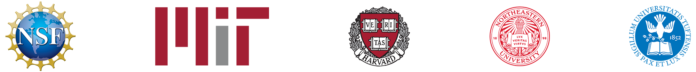
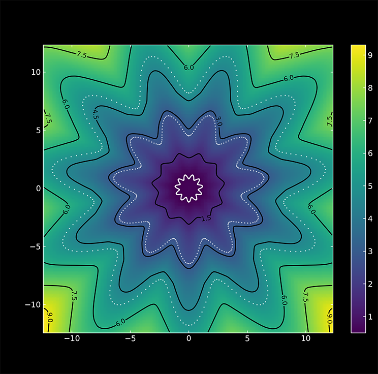
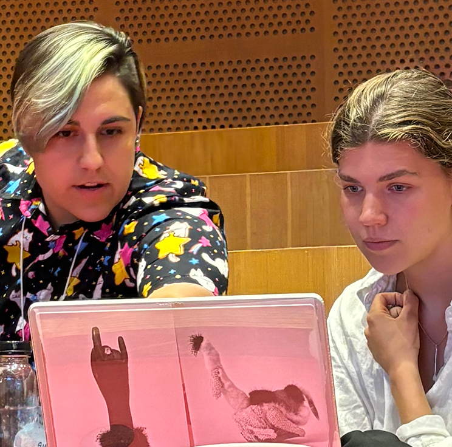
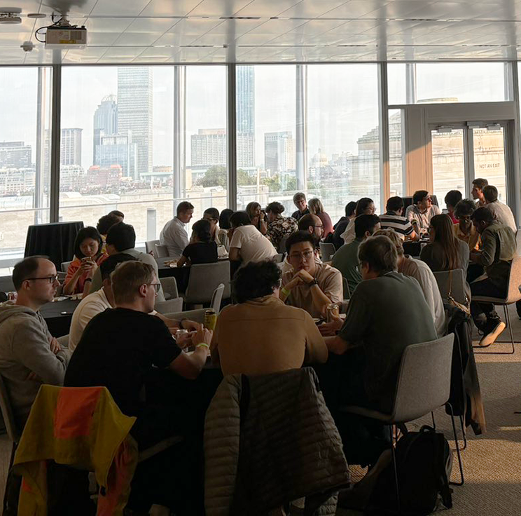

<h2>The NSF AI Institute for Artificial Intelligence and Fundamental Interactions (IAIFI)</h2>

Deep Learning (AI) + Deep Thinking (Physics) = Deeper Understanding

  

    

      

      <a href="/about.html#research">
        

          

          
          

            

              

              <h4>RESEARCH</h4>
            

          

        

      </a>
      

    

    

      

      <a href="/about.html#talent">
        

          

          
          

            

              

              <h4>TALENT</h4>
            

          

        

      </a>
      

    

    

      

      <a href="/about.html#community">
        

          

          
          

            

              

              <h4>COMMUNITY</h4>
            

          

        

      </a>
      

    

  

  <iframe 
    src="https://www.youtube.com/embed/odeUSHMmLGs?si=TYYaafoOJx0wefPJ?cc_load_policy=1" 
    title="YouTube video player" 
    frameborder="0" 
    allow="accelerometer; autoplay; clipboard-write; encrypted-media; gyroscope; picture-in-picture; web-share" 
    referrerpolicy="strict-origin-when-cross-origin" 
    allowfullscreen>
  </iframe>

The NSF AI Institute for Artificial Intelligence and Fundamental Interactions [(IAIFI, pronounced /aɪ-faɪ/)](/about.html) is one of the inaugural institutes of the U.S. National Science Foundation-led National Artificial Intelligence Research Institutes program. IAIFI is advancing physics knowledge -- from the smallest building blocks of nature to the largest structures in the Universe -- and galvanizing AI research innovation. A collaboration of [physics and AI researchers](/people.html) at MIT, Harvard, Northeastern, and Tufts, IAIFI's primary goals are to pioneer interdisciplinary AI+Physics **research**; empower the next generation of AI+Physics **talent**; and build a dynamic AI+Physics **community**.

  <a href="/join.html" class="button button--outline-primary button--pill button--lg">Join</a>
  <a href="/partnerships.html" class="button button--outline-primary button--pill button--lg">Partner</a>
  <a href="http://mailman.mit.edu/mailman/listinfo/iaifi-news" class="button button--outline-primary button--pill button--lg">Follow</a>
  <a href="/member-resources.html" class="button button--outline-primary button--pill button--lg">For Members</a>

### IAIFI Jobs

***Applications are now open for the 2026–2029 IAIFI Fellowship search.*** [Apply to be an IAIFI Fellow](https://iaifi.org/fellows) by October 8, 2025. 
{:.success}

### IAIFI Events

[View our full events calendar](events-calendar.html) for all upcoming events.

***Registration is now open for the 2025 IAIFI Summer Workshop.*** [Register by July 31, 2025](https://iaifi.org/summer-workshop). 
{:.success}

***Lina Necib Presentation at Museum of Science Planetarium.*** Join IAIFI and the Museum of Science for [Beyond the Telescope: Unveiling the Invisible Milky Way with AI](https://www.mos.org/events/beyond-telescope/unveiling-invisible-milky-way-ai) on Wednesday, August 13, 2025 at 7:00 pm. Open to the public; free with pre-registration. 
{:.success}

***Our [IAIFI Colloquium series](events.html) will continue in Fall 2025.*** Recordings of our previous colloquium talks are available to view on our [YouTube channel](https://www.youtube.com/@iaifiinstituteforaifundame3333).
{:.success}

<iframe src="https://calendar.google.com/calendar/embed?height=600&wkst=1&bgcolor=%23ffffff&ctz=America%2FNew_York&showTitle=1&showPrint=0&showCalendars=0&title=IAIFI%20Group%20Calendar&mode=WEEK&src=cDcxb2tybHAxZWJvazFpMjdtc2gzZm9kdThAZ3JvdXAuY2FsZW5kYXIuZ29vZ2xlLmNvbQ&src=YzZwNzIwMGRwbjE0c201M2owMWExZXZwODhAZ3JvdXAuY2FsZW5kYXIuZ29vZ2xlLmNvbQ&src=Zjh2NnI1dWV1bDN1anBpbzFhN2IzdDB1MjhAZ3JvdXAuY2FsZW5kYXIuZ29vZ2xlLmNvbQ&color=%238E24AA&color=%23039BE5&color=%23F09300" style="border:solid 1px #777" width="800" height="600" frameborder="0" scrolling="no"></iframe>

### IAIFI News

For an archive of IAIFI news, see our [news page](/iaifi-news.html). To receive periodic announcements about IAIFI-related activities, [sign up for our mailing list](http://mailman.mit.edu/mailman/listinfo/iaifi-news) and follow us [on Twitter](http://www.twitter.com/iaifi_news) and [LinkedIn](https://www.linkedin.com/company/iaifi).

<!---
<a class="twitter-timeline" href="https://twitter.com/iaifi_news?ref_src=twsrc%5Etfw">Tweets by iaifi_news</a> 
--->
  ***IAIFI Deputy Director Mike Williams participates on panel at AI+Science Summit***. The panel, "[Powering Innovation at the Intersection of AI & Science: NSF’s AI Institutes](https://youtu.be/RlzN7UhuHL0?si=3C6cqb4SbP_IfX1B)" was hosted by the Special Competitive Studies Project at their AI+Science Summit. *July 23, 2025*
{:.info}
  
  ***IAIFI Fellow Jessie Micallef receives Impact Award from MicroBooNE expirement***. Jessie received the award for contributions to the experiment. *July 20, 2025*
{:.info}
    
  ***Marisa LaFleur promoted from IAIFI Project Manager to IAIFI Managing Director***. As IAIFI Managing Director, Marisa will continue to oversee the implementation of IAIFI activities and to expand her responsibilities related to IAIFI’s long-term strategy and funding. *July 9, 2025*
  {:.info}
     
  ***IAIFI Fellow Michael Albergo and Affiliate Tommi Jaakkola awarded the Best Paper Award at the [Frontiers of Probabilistic Inference](https://sites.google.com/view/fpiworkshop/) workshop, ICLR 2025***. Read the paper on [Openreview](https://openreview.net/forum?id=LBFyCSqwt2). *April 28, 2025*
  {:.info}
  
   ***IAIFI Fellow Jessie Micallef featured by the MIT School of Science***. Read about Jessie's' work in ["New perspectives on old questions: AI meets particle physics"](https://science.mit.edu/new-perspectives-on-old-questions-ai-meets-particle-physics/). *December 19, 2024*
  {:.info}
 
  ***IAIFI Director Jesse Thaler featured in Physics Today***. Read about his discussion with other leaders in industry, government, and academia regarding the potential impact of AI on phsyics, and of physics on AI, in ["Physics, AI, and the future of discovery"](https://pubs.aip.org/physicstoday/article/77/11/30/3318195/Physics-AI-and-the-future-of-discoveryLeaders-from). *November 1, 2024*
  {:.info}
  
  ***IAIFI Fellow Carol Cuesta-Lazaro was selected for the 2024 Rising Stars in Physics Workshop***. [The workshop](https://www.physics.columbia.edu/content/2024-rising-stars-physics-workshop) invites top early career scientists in physics and astronomy to address issues relevant to women looking to successfully transition to their first faculty position. *September 24-26, 2024*
  {:.info}
  
  ***MIT releases impact paper by IAIFI Senior Investigators Phil Harris and Phiala Shanahan and IAIFI Fellows Gaia Grosso and Siddharth Mishra-Sharma on generative AI in the physical sciences***. Read ["A Virtuous Cycle: Generative AI and Discovery in the Physical Sciences"](https://mit-genai.pubpub.org/pub/ewp5ckmf/release/2?readingCollection=6d8d7700). *September 18, 2024*
  {:.info}
  
  ***IAIFI Junior Investigator Ziming Liu and Senior Investigator Max Tegmark featured in Quanta Magazine***. Read about their work on KANs in ["Novel Architecture Makes Neural Networks More Understandable"](https://www.quantamagazine.org/novel-architecture-makes-neural-networks-more-understandable-20240911/). *September 11, 2024*
  {:.info}
  
   ***IAIFI Investigator Isaac Chuang and IAIFI Alumnus Curtis Northcutt awarded the 2024 IJCAI-JAIR best paper prize.*** Read ["Confident Learning: Estimating Uncertainty in Dataset Labels"](https://www.jair.org/index.php/jair/IJCAIJAIR). *August 2024*
{:.info}

  ***DUNE scientists, including IAIFI Fellow Jessie Micallef, observe first neutrinos with prototype detector at Fermilab***. [Learn more.](https://news.fnal.gov/2024/08/dune-scientists-observe-first-neutrinos-with-prototype-detector-at-fermilab/) *August 12, 2024*
{:.info}

  ***IAIFI Investigator Tracy Slatyer honored as "Committed to Caring" by MIT***. Read ["Paying it Forward"](https://physics.mit.edu/news/paying-it-forward/) to learn about their approach to prioritizing students’ educational journeys. *June 6, 2024*
{:.info}

  ***IAIFI Junior Investigator Owen Dugan awarded 2024 Hertz Foundation Fellowship***. Read ["Ten with MIT connections win 2024 Hertz Foundation Fellowships"](https://physics.mit.edu/news/ten-with-mit-connections-win-2024-hertz-foundation-fellowships/). *June 3, 2024*
{:.info}

  ***IAIFI Investigator Carlos Argüelles-Delgado named a CIFAR Azrieli Global Scholar***. [Learn more about the 2024–2026 cohort.](https://cifar.ca/cifar-azrieli-global-scholars/). *May 29, 2024*
{:.info}
 
 ***IAIFI Director Jesse Thaler featured on NSF CISE Newsletter***. Read ["NSF CISE Newsletter"](https://content.govdelivery.com/accounts/USNSF/bulletins/39e647f). *May 23, 2024*
{:.info}

 ***IAIFI Director Jesse Thaler and IAIFI Investigators Phiala Shanahan and Jim Halverson featured in Symmetry Magazine***. Read ["Machine learning and theory"](https://www.symmetrymagazine.org/article/machine-learning-and-theory). *April 30, 2024*
{:.info}
 
 ***IAIFI Director Jesse Thaler provides insight on the importance of critical thinking as a panelist at MIT's Festival of Learning 2024***. Read ["MIT faculty, instructors, students experiment with generative AI in teaching and learning"](https://news.mit.edu/2024/mit-faculty-instructors-students-experiment-generative-ai-teaching-learning-0429). *April 29, 2024*
{:.info}

 ***IAIFI Investigator Tracy Slatyer awarded 2024 Guggenheim Fellowship***. Read ["Three from MIT awarded 2024 Guggenheim Fellowships"](https://physics.mit.edu/news/tracy-slatyer-awarded-2024-guggenheim-fellowship-2/). *April 26, 2024*
{:.info}

***IAIFI Fellow Jessie Micallef featured in Symmetry Magazine***. Read about their work on ["Machine Learning and Experiment"](https://www.symmetrymagazine.org/article/machine-learning-and-experiment). *April 25, 2024*
{:.info}

***IAIFI Senior Investigator Fabian Ruehle and incoming Fellow Thomas Harvey featured in Quanta Magazine***. Read about their work on how ["AI Starts to Sift Through String Theory’s Near-Endless Possibilities"](https://www.quantamagazine.org/ai-starts-to-sift-through-string-theorys-near-endless-possibilities-20240423/). *April 23, 2024*
{:.info}

***IAIFI Investigator William Freeman co-authored a textbook on Computer Vision published by MIT Press, with Antonio Torralba and Philip Isola***. Learn More ["Foundations of Computer Vision"](https://mitpress.mit.edu/9780262048972/foundations-of-computer-vision/). *April 16, 2024*
{:.info}

***IAIFI Affiliate Dan Roberts named to AI-MO prize advisory committee***. Learn about the [Artificial Intelligence Mathematical Olympiad\[https://aimoprize.com], which will be held in July 2024. *February 7, 2024*
{:.info}

<!---
***More IAIFI News:*** For an archive of IAIFI news, see our [news page](/iaifi-news.html).
--->
