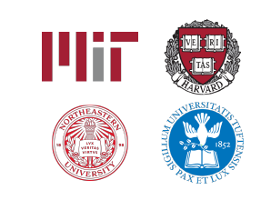
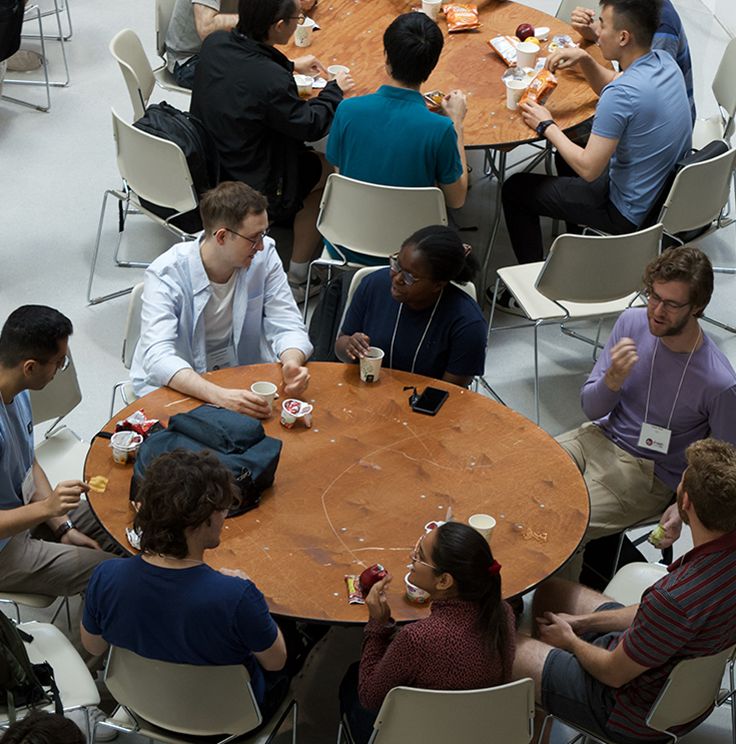

<h2>The NSF AI Institute for Artificial Intelligence and Fundamental Interactions (IAIFI)</h2>

Deep Learning (AI) + Deep Thinking (Physics) = Deeper Understanding

 

The NSF AI Institute for Artificial Intelligence and Fundamental Interactions [(IAIFI, pronounced /aɪ-faɪ/)](/about.html) is one of the inaugural NSF AI research institutes. The IAIFI is advancing physics knowledge -- from the smallest building blocks of nature to the largest structures in the Universe -- and galvanizing AI research innovation. The IAIFI is a collaboration of both [physics and AI researchers](/people.html) at MIT, Harvard, Northeastern, and Tufts.  Learn more about our [research](/research.html) at the Physics/AI intersection and about our [IAIFI Fellows](/fellows.html) program.

  

    

      

      <a href="/about.html#research">
        

          

          
          

            

              

              <h4>RESEARCH</h4>
            

          

        

      </a>
      

    

    

      

      <a href="/about.html#talent">
        

          

          
          

            

              

              <h4>TALENT</h4>
            

          

        

      </a>
      

    

    

      

      <a href="/about.html#community">
        

          

          
          

            

              

              <h4>COMMUNITY</h4>
            

          

        

      </a>
      

    

  

### IAIFI Jobs

<!---
***Applications are now open for the 2025–2028 IAIFI Fellowship search.*** [Apply to be an IAIFI Fellow](https://iaifi.org/fellows) by October 9, 2024. 
{:.success}
--->

### IAIFI Events

[View our full events calendar](events-calendar.html) for all upcoming events.

***Our [IAIFI Colloquium series](events.html) will continue in February 2025.*** Recordings of our previous [colloquium talks](events.html) are available to view on our [YouTube channel](https://www.youtube.com/@iaifiinstituteforaifundame3333).
{:.success}

<iframe src="https://calendar.google.com/calendar/embed?height=600&wkst=1&bgcolor=%23ffffff&ctz=America%2FNew_York&showTitle=1&showPrint=0&showCalendars=0&title=IAIFI%20Group%20Calendar&mode=WEEK&src=cDcxb2tybHAxZWJvazFpMjdtc2gzZm9kdThAZ3JvdXAuY2FsZW5kYXIuZ29vZ2xlLmNvbQ&src=YzZwNzIwMGRwbjE0c201M2owMWExZXZwODhAZ3JvdXAuY2FsZW5kYXIuZ29vZ2xlLmNvbQ&src=Zjh2NnI1dWV1bDN1anBpbzFhN2IzdDB1MjhAZ3JvdXAuY2FsZW5kYXIuZ29vZ2xlLmNvbQ&color=%238E24AA&color=%23039BE5&color=%23F09300" style="border:solid 1px #777" width="800" height="600" frameborder="0" scrolling="no"></iframe>

### IAIFI News

For an archive of IAIFI news, see our [news page](/iaifi-news.html). To receive periodic announcements about IAIFI-related activities, [sign up for our mailing list](http://mailman.mit.edu/mailman/listinfo/iaifi-news) and follow us [on Twitter](http://www.twitter.com/iaifi_news) and [LinkedIn](https://www.linkedin.com/company/iaifi).

<!---
<a class="twitter-timeline" href="https://twitter.com/iaifi_news?ref_src=twsrc%5Etfw">Tweets by iaifi_news</a> 
--->
  
  ***IAIFI Director Jesse Thaler featured in Physics Today***. Read about his discussion with other leaders in industry, government, and academia regarding the potential impact of AI on phsyics, and of physics on AI, in ["Physics, AI, and the future of discovery"](https://pubs.aip.org/physicstoday/article/77/11/30/3318195/Physics-AI-and-the-future-of-discoveryLeaders-from). *November 1, 2024*
  {:.info}
  
  ***IAIFI Junior Investigator Ziming Liu and Senior Investigator Max Tegmark featured in Quanta Magazine***. Read about their work on KANs in ["Novel Architecture Makes Neural Networks More Understandable"](https://www.quantamagazine.org/novel-architecture-makes-neural-networks-more-understandable-20240911/). *September 11, 2024*
  {:.info}
  
   ***IAIFI Investigator Isaac Chuang and IAIFI Alumnus Curtis Northcutt awarded the 2024 IJCAI-JAIR best paper prize.*** Read ["Confident Learning: Estimating Uncertainty in Dataset Labels"](https://www.jair.org/index.php/jair/IJCAIJAIR). *August 2024*
{:.info}

  ***DUNE scientists, including IAIFI Fellow Jessie Micallef, observe first neutrinos with prototype detector at Fermilab***. [Learn more.](https://news.fnal.gov/2024/08/dune-scientists-observe-first-neutrinos-with-prototype-detector-at-fermilab/) *August 12, 2024*
{:.info}

  ***IAIFI Investigator Tracy Slatyer honored as "Committed to Caring" by MIT***. Read ["Paying it Forward"](https://physics.mit.edu/news/paying-it-forward/) to learn about their approach to prioritizing students’ educational journeys. *June 6, 2024*
{:.info}

  ***IAIFI Junior Investigator Owen Dugan awarded 2024 Hertz Foundation Fellowship***. Read ["Ten with MIT connections win 2024 Hertz Foundation Fellowships"](https://physics.mit.edu/news/ten-with-mit-connections-win-2024-hertz-foundation-fellowships/). *June 3, 2024*
{:.info}

  ***IAIFI Investigator Carlos Argüelles-Delgado named a CIFAR Azrieli Global Scholar***. [Learn more about the 2024–2026 cohort.](https://cifar.ca/cifar-azrieli-global-scholars/). *May 29, 2024*
{:.info}
 
 ***IAIFI Director Jesse Thaler featured on NSF CISE Newsletter***. Read ["NSF CISE Newsletter"](https://content.govdelivery.com/accounts/USNSF/bulletins/39e647f). *May 23, 2024*
{:.info}

 ***IAIFI Director Jesse Thaler and IAIFI Investigators Phiala Shanahan and Jim Halverson featured in Symmetry Magazine***. Read ["Machine learning and theory"](https://www.symmetrymagazine.org/article/machine-learning-and-theory). *April 30, 2024*
{:.info}
 
 ***IAIFI Director Jesse Thaler provides insight on the importance of critical thinking as a panelist at MIT's Festival of Learning 2024***. Read ["MIT faculty, instructors, students experiment with generative AI in teaching and learning"](https://news.mit.edu/2024/mit-faculty-instructors-students-experiment-generative-ai-teaching-learning-0429). *April 29, 2024*
{:.info}

 ***IAIFI Investigator Tracy Slatyer awarded 2024 Guggenheim Fellowship***. Read ["Three from MIT awarded 2024 Guggenheim Fellowships"](https://physics.mit.edu/news/tracy-slatyer-awarded-2024-guggenheim-fellowship-2/). *April 26, 2024*
{:.info}

***IAIFI Fellow Jessie Micallef featured in Symmetry Magazine***. Read about their work on ["Machine Learning and Experiment"](https://www.symmetrymagazine.org/article/machine-learning-and-experiment). *April 25, 2024*
{:.info}

***IAIFI Senior Investigator Fabian Ruehle and incoming Fellow Thomas Harvey featured in Quanta Magazine***. Read about their work on how ["AI Starts to Sift Through String Theory’s Near-Endless Possibilities"](https://www.quantamagazine.org/ai-starts-to-sift-through-string-theorys-near-endless-possibilities-20240423/). *April 23, 2024*
{:.info}

***IAIFI Investigator William Freeman co-authored a textbook on Computer Vision published by MIT Press, with Antonio Torralba and Philip Isola***. Learn More ["Foundations of Computer Vision"](https://mitpress.mit.edu/9780262048972/foundations-of-computer-vision/). *April 16, 2024*
{:.info}

***IAIFI Affiliate Dan Roberts named to AI-MO prize advisory committee***. Learn about the [Artificial Intelligence Mathematical Olympiad\[https://aimoprize.com], which will be held in July 2024. *February 7, 2024*
{:.info}

 ***IAIFI Affiliate Dan Roberts writes about about using physics to understand AI risk***. Read ["Black Holes and the Intelligence Explosion"](https://www.sequoiacap.com/article/black-holes-perspective/). *December 12, 2023*
{:.info}

***IAIFI Fellow Siddharth Mishra-Sharma named one of the 2023 Rising Stars in Data Science by the University of Chicago***. Read [more about Siddharth's recognition](https://datascience.uchicago.edu/research/postdoctoral-programs/rising-stars-in-data-science-2/2023-rising-stars/). *November 30, 2023*
{:.info}

  ***IAIFI Fellow Ge Yang and collaborators receive Best Paper Award at the Conference on Robot Learning (CoRL) 2023***. Read ["Distilled Feature Fields Enable Few-Shot Manipulation"](https://openreview.net/forum?id=Rb0nGIt_kh5). *November 14, 2023*
{:.info}

***IAIFI Investigators Max Tegmark and Ziming Liu featured with collaborators in Quanta Magazine***. Read about their work on ["The Physical Process That Powers a New Type of Generative AI"](https://www.quantamagazine.org/new-physics-inspired-generative-ai-exceeds-expectations-20230919/). *November 14, 2023*
{:.info}

***Carlos Arguelles-Delgado, Harvard Assistant Professor of Physics and IAIFI Senior Investigator, named 2023 Packard Fellow***. Read [more about Carlos' research and the award](https://news.harvard.edu/gazette/story/newsplus/neutrino-physicist-carlos-arguelles-delgado-named-packard-fellow/). *October 20, 2023*
{:.info}

***On September 18-19, 2023, Jesse Thaler, Mike Williams, and Marisa LaFleur visited the NSF and Congress, along with other NSF AI Institutes, as part of the [NSF AI Hill Day](https://nsf-gov-resources.nsf.gov/2023-09/AI_Institutes_Hill_Day_Booklet.pdf),*** where Jesse and Mike met congressional staffers to share the work of IAIFI and discuss the importance of AI for Science. *October 5, 2023*
{:.info}

***On July 21, 2023, many IAIFI Senior Investigators, Fellows, postdocs, and students presented at [The Impact of ChatGPT and other Large Language Models on Physics Research and Education](https://indico.mit.edu/event/759/).*** Watch [Workshop recordings](https://www.youtube.com/playlist?list=PLKemzYMx2_Ot1MZ_er2vFiINdJEgDO8Hg). *September 19, 2023*
{:.info}

***Max Tegmark, MIT Professor of Physics and IAIFI Senior Investigator, featured on the TIME100 Most Influential People in AI***. Read [Max's feature](https://time.com/collection/time100-ai/6310651/max-tegmark/). *September 7, 2023*
{:.info}

***Nabil Laoudji writes about his experience at the [2023 IAIFI Summer Worskhop](https://iaifi.org/summer-workshop.html).*** Read Nabil's [post on LinkedIn](https://www.linkedin.com/pulse/where-ai-physics-meet-reflections-from-iaifis-2023-summer-laoudji/), where he shares his experience attending the 2023 IAIFI Summer Workshop. *August 29, 2023*
{:.info}

***Philip Harris, MIT Assistant Professor and IAIFI Senior Investigator, earns MIT Teaching With Digital Technology Award***: The student-nominated award recognizes Phil for effectively using digital technology to improve teaching and learning at MIT. Read [about the 2023 winners](https://openlearning.mit.edu/news/2023-mit-teaching-digital-technology-awards). *June 21, 2023*
{:.info}

***Marisa LaFleur, IAIFI Project Manager, awarded MIT Infinite Mile Award***: The award recognizes Marisa's dedication and contribution to the School of Science and to IAIFI. Read [about the 2023 winners](https://news.mit.edu/2023/school-science-infinite-mile-awards-0515). *May 15, 2023*
{:.info}

***Justin Solomon, MIT Associate Professor and IAIFI Affiliate, named Edgerton Award winner***: The award recognizes Justin's exceptional distinction in teaching, research, and service at MIT. Read [MIT Newsletter profile on Justin Solomon](https://news.mit.edu/2023/ellen-roche-justin-solomon-edgerton-award-winners-0419). *April 19, 2023*
{:.info}

***Brian Nord, MLK Scholar and IAIFI Visitor, featured in MIT News***: Read ["Understanding our place in the universe"](https://news.mit.edu/2023/understanding-our-place-universe-brian-nord-0412). *April, 12, 2023*
{:.info}

***Pulkit Agrawal featured in MIT News:*** IAIFI Senior Investigator Pulkit Agrawal, and collaborators Gabriel Margolis and Yandong Ji have [developed a legged robotic system that can dribble a soccer ball under the same conditions as humans](https://news.mit.edu/2023/legged-robotic-system-playing-soccer-various-terrains-0403). "Our goal in developing algorithms for legged robots is to provide autonomy in challenging and complex terrains that are currently beyond the reach of robotic systems." *April 3, 2023*
{:.info}

***Brian Nord, MLK Scholar, interviewed for MIT's Institute Community & Equity Office***: Watch [Brian discuss Artificial Intelligence and social advocacy](https://www.youtube.com/watch?v=xVhl6POHo6Y&list=PLKHPCGvTwsmHKCNO-xCHw0PF-Gza0DWoU&index=4). *February, 8, 2023*
{:.info}

***Lina Necib recognized as a rising star in astronomy by Astronomy magazine***: Read [Astronomy magazine's profile on Lina Necib](https://astronomy.com/magazine/news/2023/01/rising-star-in-astronomy-lina-necib) as part of their rising stars in astronomy issue. *January, 3, 2023*
{:.info}

***IAIFI sponsors the Machine Learning and the Physical Sciences workshop***: IAIFI was pleased to sponsor the [Machine Learning and the Physical Sciences workshop](https://ml4physicalsciences.github.io/2022/) at NeurIPS 2022 and to see many IAIFI researchers present papers. [View papers from IAIFI researchers at the workshop](https://t.co/GMPiqTcI2J). *December 3, 2022*
{:.info}

***Jesse Thaler provides insight on the potential of AI for physics discovery***: Read ["Will artificial intelligence ever discover new laws of physics?"](https://www.newscientist.com/article/mg25634141-200-will-artificial-intelligence-ever-discover-new-laws-of-physics/) *November 21, 2022*
{:.info}

<!---
***More IAIFI News:*** For an archive of IAIFI news, see our [news page](/iaifi-news.html).
--->
