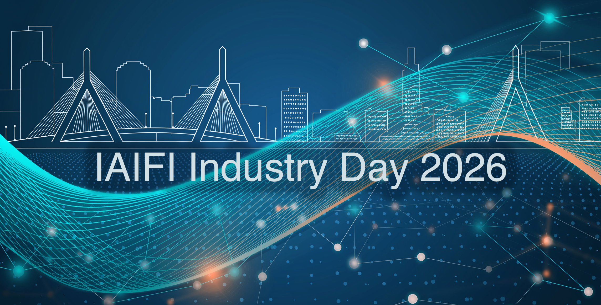

**IAIFI is pleased to host our first "IAIFI Industry Day" on Friday, August 14, 2026 at MIT.** 

The goal of this event is to foster collaboration, awareness, and networking between IAIFI industry partners and IAIFI researchers working at the intersection of AI and Physics.

*The event will be co-located with the IAIFI Summer Workshop, which will also allow both IAIFI and partners to share their work more broadly with interested attendees.*

[Agenda](#tentative-agenda){:.button.button--outline-primary.button--pill.button--lg} [Speakers](#speakers){:.button.button--outline-primary.button--pill.button--lg} [RSVP](https://app.smartsheet.com/b/form/e26a8e9f4e0a48bfb1d00bbfa81ca23c){:.button.button--outline-primary.button--pill.button--lg} [IAIFI Summer Workshop](https://iaifi.org/summer-workshop){:.button.button--outline-primary.button--pill.button--lg}

## Tentative Agenda 

### Friday, August 14, 2026

#### 11:00am-12:30 pm ET

Lightning Talks from IAIFI and industry partners

#### 12:30-1:30 pm ET

Networking Lunch

#### 1:30–3:00 pm ET

Industry Partner Expo and Reception

## Speakers

Speakers will be announced later in Spring 2026.

