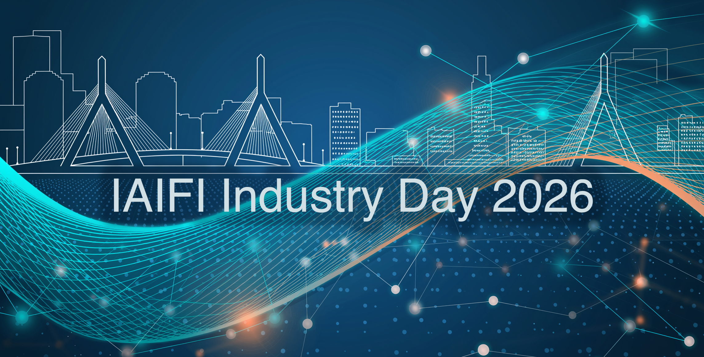

**IAIFI is pleased to host our first "IAIFI Industry Day" on Friday, August 14, 2026 at the MIT Samberg Conference Center.** The goal of this event is to foster collaboration, awareness, and networking between IAIFI industry partners, IAIFI researchers, and attendees of the IAIFI Summer Workshop.

[Agenda](#agenda){:.button.button--outline-primary.button--pill.button--lg} [Industry Partners](#industry-partners){:.button.button--outline-primary.button--pill.button--lg} [RSVP](#RSVP){:.button.button--outline-primary.button--pill.button--lg} [IAIFI Summer Workshop](https://iaifi.org/summer-workshop){:.button.button--outline-primary.button--pill.button--lg}

## RSVP
IAIFI Members [RSVP Here.](https://app.smartsheet.com/b/form/019f860306cc7383a9fe0299f408e0a9)

Summer Workshop Attendees: You will receive an RSVP link from the organizing committee.

## Agenda 

### Friday, August 14, 2026

#### 11:00am-11:50am: Flash talks from industry partners

These will be brief, 5-minute self-introductions where industry partners will share about themselves and their work. This will directly lead into the networking portions of the day.

#### 11:50am-12:10pm: Coffee Break

#### 12:10pm-1:00pm: Flash talks from industry partners, cont'd

#### 1:00pm-2:15pm: Networking Lunch

#### 2:15pm–3:45pm: Industry Partner Expo and Reception

Participating industry partners will host tables at the expo.

## Industry Partners

| Organization | Flash Talk Presenter | Expo Participation | 
|------------------|------------------|:------------------:|
|Agentoid   |Praneeth Vepakomma   |✓| 
|Amazon   |Rahul Gupta   ||
|Draper   |Loyd Waites   ||
|Engine Ventures|Alaina Hartnett   ||
|Extropic   |Nahuel Freitas|✓| 
|Fine Structure Ventures| Tobias Egle||
|First Principles |*To be confirmed*|✓|
|Glasswing Ventures   |*To be confirmed*|✓|
|IBM Research   |Dongsung Huh   ||
|Mitsubishi Electric Research Laboratories (MERL)|Petros Boufounos|✓|
|MathWorks|Ari Biswas||
|Physical Superintelligence   |*To be confirmed*|✓|
|QuEra Computing|Alan Bidart and Tommaso Macrì|✓|
|Stripe |Shankar Krishnan| |
