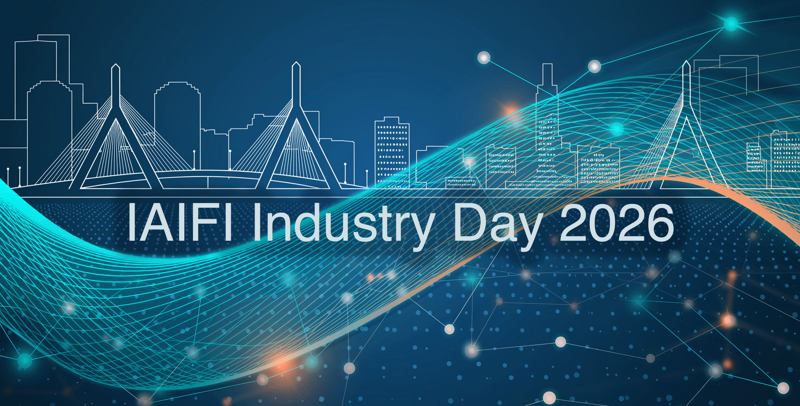

**IAIFI is pleased to host our first "IAIFI Industry Day" on Friday, August 14, 2026 at the MIT Samberg Conference Center [50 Memorial Dr, Cambridge, MA; Dining Rooms 3&4 (on the 6th floor)].** The goal of this event is to foster collaboration, awareness, and networking between IAIFI industry partners, IAIFI researchers, and attendees of the IAIFI Summer Workshop.

[Agenda](#agenda){:.button.button--outline-primary.button--pill.button--lg} [Slides](#slides){:.button.button--outline-primary.button--pill.button--lg} [Industry Partners](#industry-partners){:.button.button--outline-primary.button--pill.button--lg} [RSVP](#RSVP){:.button.button--outline-primary.button--pill.button--lg} [IAIFI Summer Workshop](https://iaifi.org/summer-workshop){:.button.button--outline-primary.button--pill.button--lg}

## Slides
[IAIFI Welcome Slides](https://docs.google.com/presentation/d/1trnOsrD48OOwqjESSLE-DXSsqpF4PrxF/edit?usp=sharing&ouid=113795742869595335302&rtpof=true&sd=true){:.button.button--outline-primary.button--pill.button--lg} [Industry Speaker Slides](https://drive.google.com/drive/folders/1MJht1SF6cPbGOIXcypqwSegfL3SOJhTn?usp=sharing){:.button.button--outline-primary.button--pill.button--lg} 

## RSVP

RSVP is closed.

## Agenda 

### Friday, August 14, 2026

*Doors open 10:30am*

#### 11:00am-11:50am: Flash talks from industry partners

These will be brief, 5-minute self-introductions where industry partners will share about themselves and their work. This will directly lead into the networking portions of the day.

- Welcome from IAIFI
- Physical Superintelligence
- Amazon AGI
- Agentoid
- Stripe
- Mitsubishi Electric Research Laboratories (MERL)
- Draper

#### 11:50am-12:10pm: Coffee Break

#### 12:10pm-1:00pm: Flash talks from industry partners, cont'd
- Centaur AI Institute
- QuEra Computing
- Extropic
- Glasswing Ventures
- Engine Ventures
- FirstPrinciples
- Fine Structure Ventures

#### 1:00pm-2:15pm: Networking Lunch

#### 2:15pm–3:45pm: Industry Partner Expo and Reception

Participating industry partners will host tables at the expo.

## Industry Partners

| Organization | Flash Talk Presenter | Expo Participation | 
|------------------|------------------|:------------------:|
|Agentoid   |Praneeth Vepakomma   |✓| 
|Amazon AGI   |Rahul Gupta   ||
|Centaur AI Institute   |Dongsung Huh   ||
|Draper   |Loyd Waites   ||
|Engine Ventures|Alaina Hartnett   ||
|Extropic   |Nahuel Freitas|✓| 
|Fine Structure Ventures| Tobias Egle||
|FirstPrinciples | Melissa Valdez|✓|
|Glasswing Ventures   | Kleida Martiro|✓|
|Mitsubishi Electric Research Laboratories (MERL)|Petros Boufounos|✓|
|Physical Superintelligence   | Alex Wissner-Gross|✓|
|QuEra Computing|Alan Bidart and Tommaso Macrì|✓|
|Stripe |Shankar Krishnan| |
