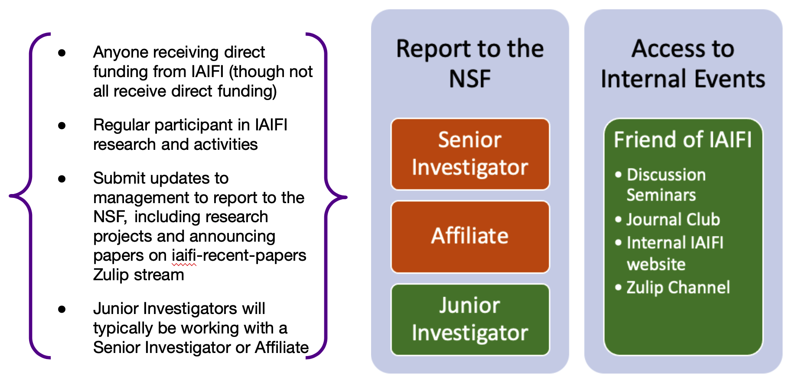

IAIFI thrives on the energy and enthusiasm of its members! This page includes information and links to resources for [IAIFI members](https://docs.google.com/document/d/1RjddJR6ER4mlXq438C5RkAIv-ZisUPwibTm52-2o_Yw/edit?usp=sharing). 

<!---
* [Understand Levels of Involvement](#understand-levels-of-involvement)
* [Join an IAIFI Committee](#join-an-iaifi-committee)
* [Become an IAIFI Junior Investigator](#become-an-iaifi-junior-investigator)
* [Lead an IAIFI Journal Club](#lead-an-iaifi-journal-club)
* [Attend IAIFI Discussion Seminars and Public Colloquia](#attend-iaifi-discussion-seminars-and-public-colloquia)
* [Collaborate on IAIFI Research Projects](#collaborate-on-iaifi-research-projects)
* [Utilize IAIFI Computing Resources](#utilize-iaifi-computing-resources)
* [Share Achievements with IAIFI Management](#share-achievements-with-iaifi-management)
* [Advertise and Acknowledge IAIFI](#advertise-and-acknowledge-iaifi)
* [Be a Guest in the IAIFI Penthouse](#be-a-guest-in-the-iaifi-penthouse)
* [Access the IAIFI Google Drive](#access-the-iaifi-google-drive)
* [Explore Career and PhD Opportunities](#explore-career-and-phd-opportunities)
* [Get Involved Beyond IAIFI](#get-involved-beyond-iaifi) 
--->

Unless otherwise noted, the opportunities listed on this page are available to all IAIFI members, including Senior Investigators, Junior Investigators, IAIFI Affiliates, and Friends of IAIFI. **Members can also find resources in the [IAIFI README](https://docs.google.com/document/d/1RjddJR6ER4mlXq438C5RkAIv-ZisUPwibTm52-2o_Yw/edit?usp=sharing) document.**

<!---

## Understand Levels of Involvement

Unless otherwise noted, the opportunities listed on this page are available to members at all levels of involvement in IAIFI.  

Unless otherwise noted, these opportunities are available to all IAIFI members, including those who report their IAIFI-related activities to the NSF (Senior Investigators, Junior Investigator, and IAIFI Affiliate) and those who do not (Friends of IAIFI).

There are various levels at which you can be involved in IAIFI.  

**Senior Investigators, Junior Investigators, IAIFI Affiliates**:  Members in these categories must report their IAIFI-related activities to the NSF.
{:.info}

**Friend of IAIFI**:  Friends of IAIFI cannot receive NSF funding and have no reporting requirements, but are welcome to participate in internal IAIFI activities.
{:.info}

Unless otherwise noted, the opportunities listed on this page are available to members at *all* levels of involvement in IAIFI.

 

    

--->

[Submit a suggestion for the website](https://app.smartsheet.com/b/form/cb1e1ec990d34a318122451fcc11d9b2){:.button.button--outline-primary.button--pill.button--lg} [IAIFI README](https://docs.google.com/document/d/1RjddJR6ER4mlXq438C5RkAIv-ZisUPwibTm52-2o_Yw/edit?usp=sharing){:.button.button--outline-primary.button--pill.button--lg}

## Research

[Become a Junior Investigator](https://app.smartsheet.com/b/form/3351b081785743ceac66a7294546b558){:.button.button--outline-primary.button--pill.button--lg} [Collaborate](/people.html){:.button.button--outline-primary.button--pill.button--lg} [Discuss research](https://app.slack.com/client/T014QUZ5ANQ/C051K41NCLT){:.button.button--outline-primary.button--pill.button--lg} [Report research highlights](https://app.smartsheet.com/b/form/fa6d56eb2dec4b5993cd23ac99d910a7){:.button.button--outline-primary.button--pill.button--lg}

## Talks

[Lead a Journal Club](https://forms.gle/zfpT4QQdXg8tu6VB7){:.button.button--outline-primary.button--pill.button--lg} [Attend events](events-calendar.html){:.button.button--outline-primary.button--pill.button--lg} [Watch past colloquia](https://youtube.com/playlist?list=PLBY0ED2StbGZtEAbnyZz9p3pK31qHLXmq){:.button.button--outline-primary.button--pill.button--lg} [Suggest a speaker](https://docs.google.com/forms/d/1SeaGUpoMZOGRJgcW3Utx_VZh9GTtXVOsYH1AAvrvxTY/edit){:.button.button--outline-primary.button--pill.button--lg} [Report IAIFI-related talks](https://app.smartsheet.com/b/form/fa6d56eb2dec4b5993cd23ac99d910a7){:.button.button--outline-primary.button--pill.button--lg} [Advertise IAIFI in talk](#advertise-and-acknowledge-iaifi){:.button.button--outline-primary.button--pill.button--lg}

## Papers

**It is required that Junior and Senior Investigators acknowledge IAIFI in IAIFI-related papers.** For particle physics papers: [check that your paper is appearing under IAIFI on INSPIRE](https://inspirehep.net/institutions/1862936?ui-citation-summary=true)

[Report IAIFI-related papers](https://app.smartsheet.com/b/form/fa6d56eb2dec4b5993cd23ac99d910a7){:.button.button--outline-primary.button--pill.button--lg} [Share a paper](https://app.slack.com/client/T014QUZ5ANQ/C051XS52ZFT){:.button.button--outline-primary.button--pill.button--lg} [Acknowledge IAIFI in paper](#advertise-and-acknowledge-iaifi){:.button.button--outline-primary.button--pill.button--lg}

## Computing Resources
IAIFI Senior Investigators, Junior Investigators, and Affiliates have access to dedicated IAIFI computing resources hosted by Harvard Cannon.

[Sign up for access](https://docs.google.com/document/d/1LiON6txM3wKGF7mJFKwDrwa6MREsuZV_UdclD0bvvr4/edit?usp=share_link){:.button.button--outline-primary.button--pill.button--lg} [Contact Computing Committee](mailto:iaifi-compute@mit.edu){:.button.button--outline-primary.button--pill.button--lg}

## Community

[Join a committee](/committees.html){:.button.button--outline-primary.button--pill.button--lg} [Visit Penthouse](https://app.smartsheet.com/b/form/49c21bb886164fc1a51f1ef6e9e130a8){:.button.button--outline-primary.button--pill.button--lg} [View Penthouse seating chart](https://docs.google.com/presentation/d/16aVEtwVf0Ull6qo_UC7bR20YQYIO9KHS/edit?usp=sharing&ouid=100405968312486369078&rtpof=true&sd=true){:.button.button--outline-primary.button--pill.button--lg} [Propose a community-building event](https://iaifi.org/social-activities){:.button.button--outline-primary.button--pill.button--lg}[Join Slack](mailto:iaifi-pm@mit.edu){:.button.button--outline-primary.button--pill.button--lg}

## Career Support

[Apply to MIT's Interdisciplinary PhD](https://physics.mit.edu/academic-programs/graduate-students/psds-phd/){:.button.button--outline-primary.button--pill.button--lg} [Apply to be an IAIFI Fellow](fellows.html){:.button.button--outline-primary.button--pill.button--lg} [View IAIFI-related jobs](https://iaifi.org/job-board.html#iaifi-jobs){:.button.button--outline-primary.button--pill.button--lg} [View AI + physics jobs](https://iaifi.org/job-board.html){:.button.button--outline-primary.button--pill.button--lg} [See career advice](https://iaifi.org/career-support.html){:.button.button--outline-primary.button--pill.button--lg}

## Additional Resources

[Access IAIFI Google Drive](https://drive.google.com/drive/folders/1KCCp9BpUL_GsvPGiWoJt976X0YkSEVDC?usp=sharing){:.button.button--outline-primary.button--pill.button--lg} [Join University affinity group](#affinity-groups){:.button.button--outline-primary.button--pill.button--lg} [Find other AI + physics groups](#related-groups-and-events){:.button.button--outline-primary.button--pill.button--lg}

## Advertise and acknowledge IAIFI
  * **Acknowledgement:** Include IAIFI acknowledgment, **including IAIFI's grant number,** in IAIFI-related papers. This is required if you are a Junior or Senior Investigator, **especially if you are using IAIFI computing resources**.
    * Example acknowledgement language: "This work is supported by the National Science Foundation under Cooperative Agreement PHY-2019786 (The NSF AI Institute for Artificial Intelligence and Fundamental Interactions, http://iaifi.org/)."
  * **Affiliation:** Include IAIFI affiliation in papers: The NSF AI Institute for Artificial Intelligence and Fundamental Interactions (Note: There is no address.)
  * **If using compute or other resources, regardless of role:** Anyone who benefits from IAIFI activities, etc, is welcome to use the above acknowledgment wording if you think it’s appropriate. Alternatively, if you aren't directly funded, you could choose to use something like this: This work [benefited from/was inspired by/was initiated as a result of] interactions with the NSF AI Institute for Artificial Intelligence and Fundamental Interactions, http://iaifi.org/, which is supported by the National Science Foundation under Cooperative Agreement PHY-2019786.
  * **IAIFI Logo:** Use the IAIFI (with NSF) logo in talks related to IAIFI: [Black](images/iaifi-nsf-logo-black.pdf);  [White](images/iaifi-nsf-logo-white.pdf);
      [Rainbow](images/iaifi-logo-square-rainbow.pdf)
  * **Standard IAIFI Slides:** Share slides advertising public IAIFI opportunities when appropriate: [Overview Slide](images/iaifi-oneslide-overview.pdf); [Resources and Activities Slide](images/iaifi-oneslide-resources.pdf)
  * **News:** When you're in the news, [email IAIFI Management](mailto:iaifi@mit.edu) so that we can share on the [home page](index.html) (news on the home page is eventually moved to the [News Archive](iaifi-news.html)), [tweet about it](https://twitter.com/iaifi_news), and include in reports
  
<!--
* Get Involved Beyond IAIFI: We encourage IAIFI members to be involved in programs and initiatives not affiliated with IAIFI, but which can provide new insights and value to the IAIFI community, including sharing relevant events and best practices.  If you have other suggestions for ways the IAIFI community can be involved beyond IAIFI, [email IAIFI Management](mailto:iaifi@mit.edu).
*  IAIFI utilizes [Zulip](https://zulip.com) for informal communication among members. Zulip is an open-source modern team chat app designed to keep both live and asynchronous conversations organized. [Follow these instructions](https://docs.google.com/document/d/1RjddJR6ER4mlXq438C5RkAIv-ZisUPwibTm52-2o_Yw/edit?usp=sharing) to sign up for the IAIFI Zulip if you are an IAIFI member. 
-->

## Affinity Groups

* Ethics and AI: Participate in [MIT's SERC](https://computing.mit.edu/cross-cutting/social-and-ethical-responsibilities-of-computing/) (Social and Ethical Responsibilities of Computing) by joining the [SERC Scholars Program](https://computing.mit.edu/cross-cutting/social-and-ethical-responsibilities-of-computing/serc-scholars-program/) or reading the [MIT Case Studies in Social and Ethical Responsibilities of Computing](https://mit-serc.pubpub.org)
* Explore university affinity groups
   * MIT (Grad Students): [Graduate Women at MIT](https://gsc.mit.edu/gwamit/); [LGBT Grad](https://stuff.mit.edu/afs/athena/activity/l/lgbtgrad/www/); [LGBT Grad QPoC](http://grad-qpoc-admin@mit.edu/); [Women's Initiative](http://web.mit.edu/wi/); [Graduate Women in Physics](http://web.mit.edu/physics/wphys/index.html); [SPXCE (Social Justice Programming & Cross Cultural Engagement)](https://studentlife.mit.edu/spxce)
   * MIT (Postdocs/Faculty): [Postdoc Diversity, Equity, and Inclusion Committee](https://pda.mit.edu/resources/diversity/); [qtPhDs](https://qtphds.mit.edu); [MIT Black Postdoctoral Group](https://bpg.mit.edu); [Postdoctoral Organization for Women Engaged in Research (POWER)](https://pda.mit.edu/events/power/); [Employee Resource Groups](https://hr.mit.edu/diversity-equity-inclusion/ergs)
   * Harvard (Grad Students): [AstroGrad Network](https://engage.gsas.harvard.edu/organization/agn); [GSAS Society of Underrepresented Students in STEM](https://engage.gsas.harvard.edu/organization/gsuss); [Harvard Graduate Women in Science and Engineering at Harvard University at GSAS (HGWISE)](https://engage.gsas.harvard.edu/organization/hgwise); [LGBTQ@GSAS Association](https://engage.gsas.harvard.edu/organization/lgtbq); [InTouch (SEAS)](https://engage.gsas.harvard.edu/organization/intouch); [Physics Graduate Student Council](https://engage.gsas.harvard.edu/organization/pgsc); [SEAS Graduate Council](https://engage.gsas.harvard.edu/organization/seas); [W.E.B. Du Bois Graduate Society of GSAS](https://engage.gsas.harvard.edu/organization/webdubois); [Women in Physics](https://women.physics.harvard.edu)
   * Harvard (Postdocs/Faculty): [FAS Postdoctoral Association](https://postdoc.fas.harvard.edu/PDA); [Association of Black Faculty, Administrators, and Fellows (ABFAF)](https://employeeresourcegroups.harvard.edu/abfaf); [Association of Harvard Asian and Asian American Faculty and Staff (AHAAAFS)](https://employeeresourcegroups.harvard.edu/ahaaafs); [Association of Harvard Latinx Faculty and Staff (AHLFS)](https://employeeresourcegroups.harvard.edu/ahlfs); [LGBTQ+ Faculty and Staff (QERG)](https://employeeresourcegroups.harvard.edu/qerg); [Committee on the Concerns of Women (CCW)](https://employeeresourcegroups.harvard.edu/ccw); [Women in Physics](https://women.physics.harvard.edu)
   * Northeastern (Grad Students): [Graduate Students of Color Collective](https://neu.campuslabs.com/engage/organization/graduate-students-of-color-collective); [Graduate Women in Science and Engineering (GWISE)](https://coe.northeastern.edu/orgs/gwise-graduate-women-in-science-and-engineering/); [Physics Graduate Student Association](https://giving.northeastern.edu/live/profiles/927-club-physics-graduate-student-association); [AI Skunkworks at Northeastern](https://neu-ai-skunkworks.github.io/about-us.html); [Alliance for Diversity in Science and Engineering](https://neu.campuslabs.com/engage/organization/alliance-for-diversity-in-science-and-engineering)
   * Northeastern (Postdocs/Faculty): [LGBTQA+ Faculty and Staff Affinity Group](https://provost.northeastern.edu/odei/affinity/lgbtqa/#_ga=2.239745219.1711678861.1634830744-36578417.1634830500); [Native and Indigenous Affinity Group](https://provost.northeastern.edu/odei/affinity/native/#_ga=2.202046673.1711678861.1634830744-36578417.1634830500); [NU Dream (Faculty and Staff of Color Affinity Group)](https://provost.northeastern.edu/odei/affinity/nudream/#_ga=2.266932302.1711678861.1634830744-36578417.1634830500); [Black Faculty and Staff Association (BFSA)](https://provost.northeastern.edu/odei/affinity/nu-bfs/); [Northeastern University Future Leaders (NUFL)](https://provost.northeastern.edu/odei/affinity/nufl/); [Asian Faculty and Staff Affinity Group](https://provost.northeastern.edu/odei/affinity/asian-faculty-staff/)
   * Tufts (Grad Students): [Physics and Astronomy Student Society](http://sites.tufts.edu/gpass/); [Black Students in Computer Science](https://hlbranch.wixsite.com/tuftsbscs); [Women in Computer Science](https://wicstufts.wixsite.com/wicstufts); [GLBT Grad Group](https://signup.e2ma.net/signup/1879669/1758137/); 
   * Tufts (Postdocs/Faculty): [Employee Resource Groups](https://diversity.tufts.edu/resources/employee-resource-groups/)

## Related Groups and Events
  * [Physics meets ML](http://www.physicsmeetsml.org)---a virtual hub at the interface of theoretical physics and deep learning
    * [Sign up for the mailing list](https://docs.google.com/forms/d/e/1FAIpQLSf1j2NdpOFerq0CjtbzXqyTI8m8gm136g0AwrFsXy9PnfVAAg/viewform)
    * [View past talks on YouTube](https://www.youtube.com/channel/UCEugr9SHEXmvG8bg6e3y_bw?view_as=subscriber)
  * [NSF AI Planning Institute for Data-Driven Discovery at Carnegie Mellon University](https://www.cmu.edu/ai-physics-institute/)---bringing cutting edge methods from AI into a broad range of physics areas, to rapidly propagate successful methods from one field of Physics to another thereby avoiding replication of effort, and to facilitate back-transfer from the data-rich sub-fields of physics to AI development
    * [Sign up for the mailing list](https://lists.andrew.cmu.edu/mailman/listinfo/physics-ai)
    * [View event calendar](https://www.cmu.edu/ai-physics-institute/events/index.html)
  * [MIT Statistics and Data Science Center](https://stat.mit.edu/about/)---an MIT-wide focal point for advancing research and education programs related to statistics and data science (part of MIT's Institute for Data, Systems, and Society)
    * [View calendar of events](https://stat.mit.edu/calendar/)
  * [CLARIPHY Topical Meetings](https://clariphy.org/topical.html)---allows researchers in related areas to present their work at all stages (early, in progress, post-publication) of their efforts, with a special focus on areas at the intersection of Physics and Data Science, Machine Learning and Artificial Intelligence
    * [View event recordings on YouTube](https://www.youtube.com/channel/UCcInpW4QuVE4NMeRf-FEV9Q)
  * [Understanding the Nature of Inference: Correlation and Causation: A Multi-disciplinary Exploration](https://inferenceproject.yale.edu)---aims to examine deeply the process of inference of cause and effect across disciplines with a view to understanding the utility of conceptual modeling and simulations as proxies for controlled experiments
    * [View Colloquium Series schedule](https://inferenceproject.yale.edu/colloquium-series)

<!---
Information on available tools from industry partners.
--->

<!--
In the future include opportunities for outreach, mentoring, community events, etc.
-->
