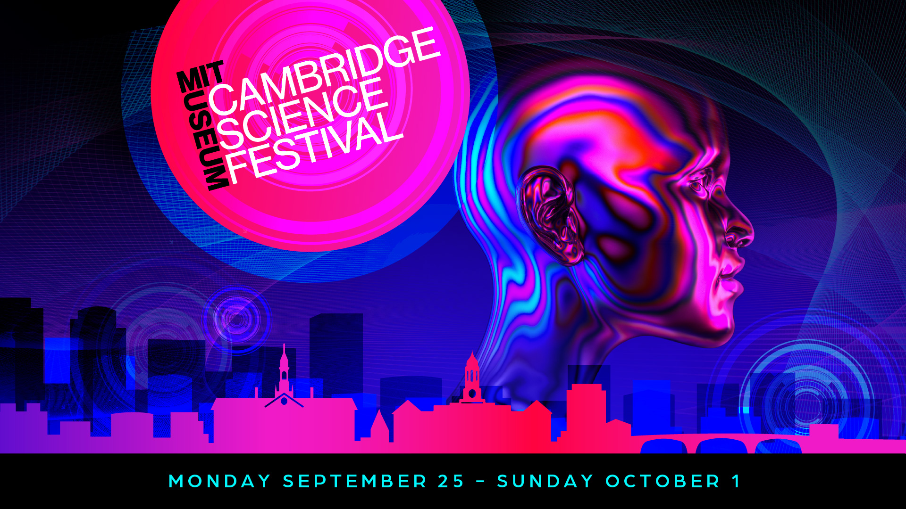
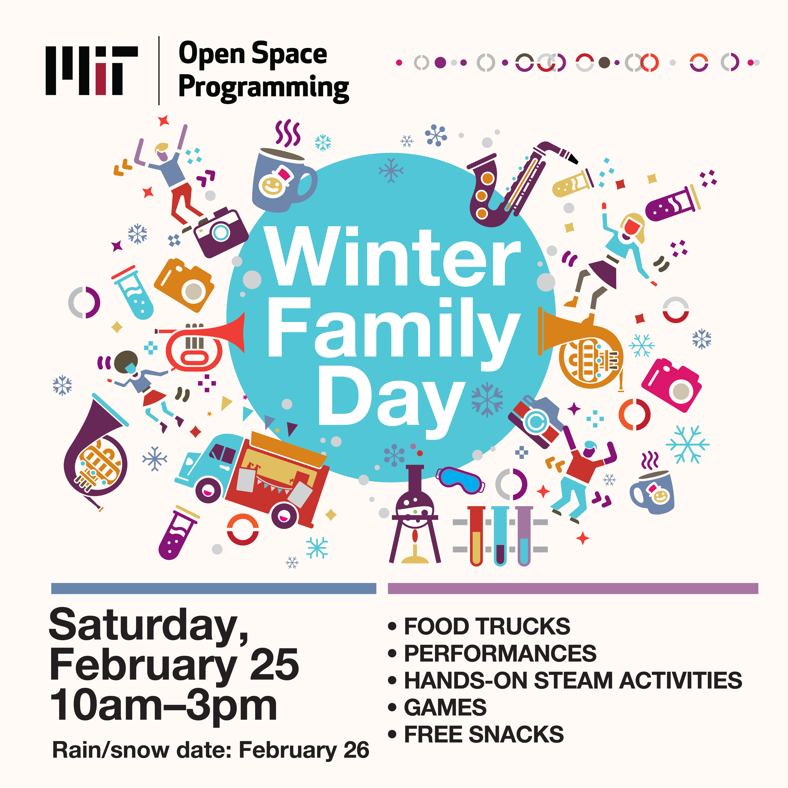

# Cambridge Science Festival

<!---
Did you see us at the Festival? [Complete our survey](https://forms.gle/eGoK4qdBKRfR2oCR7) to tell us what you thought!
{:.success}
--->
IAIFI is excited to participate in the 2023 Cambridge Science Festival with a Lunch and Learn on Wednesday, September 27, 2023, and as part of the Carnival on Sunday, October 1, 2023. Both events are free and open to the public but the Lunch and Learn requires registration.

## IAIFI Lunch & Learn: Ethics in AI and Art
In recent years there has been a surge in tools that facilitate creative works using AI (such as DALL-E and Chat-GPT) and with that has come both creative uses for those tools and ethical questions around artist ownership and copyright. The NSF Institute for Artificial Intelligence and Fundamental Interactions (IAIFI) will host a workshop to share how these tools work and what ethical concerns arise in relation to them. Attendees will then be invited to submit AI-generated poetry and prose to be read and displayed at a reception. Anyone who submits will be entered to win a gift card. Refreshments will be provided.

**Workshop Leaders**

Carolina Cuesta-Lazaro is an IAIFI Fellow interested in developing robust and interpretable Machine Learning models that can guide us towards future discoveries in physics. Her main research interests lie on the intersection of cosmology and AI.

Hope Schroeder is a PhD student at the MIT Media Lab and the MIT Center for Constructive Communication. She is interested in the spread and impact of ideas through information and media networks.

**Lunch will be provided.**

[Register for this event](https://www.eventbrite.com/e/iaifi-lunch-learn-ethics-in-ai-and-art-tickets-714151264657?aff=oddtdtcreator){:.button.button--outline-primary.button--pill.button--lg}

## Carnival:  Spot the Difference: AI vs Reality in Physics
With the rising popularity of generative AI tools such as Chat-GPT and DALL-E, it can be increasingly difficult to tell the difference between AI-generated content and human-generated content. Join the Institute for Artificial Intelligence and Fundamental Interactions (IAIFI) to learn about how generative AI works and see if you can spot the difference. Ask the same question to a virtual physicist and a real live physicist and see what answers you get! Then test your skills by comparing galaxy images from the James Webb Space Telescope with Dall-E generated galaxy images—can you tell which ones are real?

# K–12 Education

The IAIFI has partnered with Northeastern’s [Theorynet program](http://www.physicstheorynet.org) to coordinate visits to high school classes in the Boston area. 

[Sign up for a classroom visit](https://forms.gle/MQh677rcxCwhzSJq7){:.button.button--outline-primary.button--pill.button--lg}.

This activity is coordinated by the [IAIFI Public Engagement Committee](\committees.html#public-engagement-committee).

# Winter Family Day

IAIFI was pleased to [participate in MIT's Winter Family Day on Saturday, February 25, 2023](https://news.mit.edu/2023/scene-mit-lively-winter-family-day-0314). We presented three demonstrations of a robot dog that has been trained using reinforcement learning, which trains machines to take action without explicit instructions or corrections. IAIFI Fellow Ge Yang and MIT undergrads delighted adults and children alike with their robot dog running, spinning, and hopping!

<blockquote class="twitter-tweet">
Such a fun day sharing our robot “dog” &amp; how it was trained using reinforcement learning at the <a href="https://twitter.com/mitopenspace?ref_src=twsrc%5Etfw">@mitopenspace</a> <a href="https://twitter.com/hashtag/winterfamilyday?src=hash&amp;ref_src=twsrc%5Etfw">#winterfamilyday</a>! Thank you for having us and for all the great questions from the audience! <a href="https://t.co/4Rqk01yUND">pic.twitter.com/4Rqk01yUND</a>
&mdash; IAIFI (@iaifi_news) <a href="https://twitter.com/iaifi_news/status/1629568551676772353?ref_src=twsrc%5Etfw">February 25, 2023</a></blockquote> 

<blockquote class="twitter-tweet">
Thank you to <a href="https://twitter.com/EpisodeYang?ref_src=twsrc%5Etfw">@EpisodeYang</a> and his team of undergrad students (pictured here), Sophie, Evan, and Prince, for leading our <a href="https://twitter.com/mitopenspace?ref_src=twsrc%5Etfw">@mitopenspace</a> <a href="https://twitter.com/hashtag/winterfamilyday?src=hash&amp;ref_src=twsrc%5Etfw">#winterfamilyday</a> demos! <a href="https://twitter.com/AIVOInfo?ref_src=twsrc%5Etfw">@AIVOInfo</a> <a href="https://t.co/ytjPIZWWFP">pic.twitter.com/ytjPIZWWFP</a>
&mdash; IAIFI (@iaifi_news) <a href="https://twitter.com/iaifi_news/status/1629569089092874240?ref_src=twsrc%5Etfw">February 25, 2023</a></blockquote> 

[View Winter Family Day schedule](https://www.dropbox.com/s/jw4olkqk44k3ky7/2023%20Winter%20Family%20Day%20Schedule.pdf?dl=0){:.button.button--outline-primary.button--pill.button--lg}

 

 

 

# Engage with IAIFI

IAIFI is galvanizing AI innovation and advancing physics knowledge. Learn more [about IAIFI](about.html), [public events](events-calendar.html), and [research](research.html). 

[Sign up for our mailing list](http://mailman.mit.edu/mailman/listinfo/iaifi-news) and follow us [on Twitter](http://www.twitter.com/iaifi_news)!

