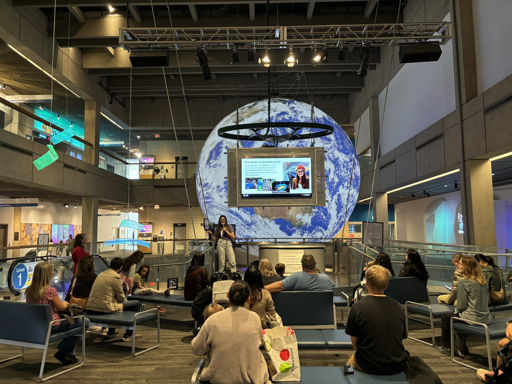

# Museum of Science Planetarium Event: *Beyond the Telescope: Unveiling the Invisible Milky Way with AI*

 
What if we could see what lies beyond the limits of our telescopes?

On **Wednesday, August 13, 2025**, join MIT professor and astroparticle physicist Dr. Lina Necib, an IAIFI Senior Investigator, on a journey through our Milky Way featuring real data from the revolutionary Gaia Space Observatory, artificial intelligence techniques, and the cutting-edge technology and immersive data visualization systems of the Planetarium.  

Explore all that lies within our home galaxy — from the observable and expected, to the mysterious and invisible, and discover how astronomers apply novel machine learning techniques to the most massive cosmic smash-ups, galactic collisions, and mergers to understand one of the most enigmatic substances in the universe: dark matter! Whether you're a space enthusiast, science lover, or simply curious about the unknown, this groundbreaking program blends science, technology, and creativity to illuminate our place in the cosmos.

See what AI can reveal — beyond the telescope.

[Learn More and Register](https://www.mos.org/events/beyond-telescope/unveiling-invisible-milky-way-ai){:.button.button--outline-primary.button--pill.button--lg}

# USA AI Olympiad 2025

 
On April 27, the [USA Artificial Intelligence Olympiad (USAAIO)](http://www.usaaio.org/) held the second round of its USA-North America competition at MIT Schwarzman College of Computing, bringing together nearly 80 of the brightest high school students from the United States and Canada. The event rigorously assessed participants' comprehensive skills in artificial intelligence, encompassing mathematical reasoning, practical coding abilities, and interdisciplinary understanding of AI applications. Twelve top scorers from Round 2 were invited to participate in the intensive, week-long USAAIO training camp. IAIFI helped to host the event, including coordinating a career panel of postdocs working at the intersection of AI and Science to discuss their experience using AI in their research, as well as offer career advice. 

# Cambridge Science Festival 2024

IAIFI is excited to participate for the third year in a row at the 2024 Cambridge Science Festival!

## In the Neighborhood: Understanding the Universe with AI+Physics: An Interactive Introduction to IAIFI

 

*Wednesday, September 25, 2024, 1:00–2:30 pm*

*Location: Boston Museum of Science*

The NSF Institute for Artificial Intelligence and Fundamental Interactions (IAIFI) teamed up with the Museum of Science to give a kid-friendly introduction to what we can do when we combine scientific knowledge with the power of AI! Featuring an overview presentation followed by interactive demonstrations of concepts, this event gave learners of all ages a glimpse into the future of science…AI+Science!

## Carnival: Science Showdown: Combining AI Tools with Science Expertise

 

*Sunday, September 29, 2024, 12:00–4:00 pm*

*Location: Kendall/MIT Open Space*

The NSF Institute for Artificial Intelligence and Fundamental Interactions (IAIFI) demonstrated the power of AI tools like ChatGPT and DALL-E in science–and also challenged those tools! Attendees had the opportunity to ask our virtual Marie Curie a science question and then ask an IAIFI scientist the same question and compare their answers! They also tested their skills at spotting the difference between photos taken by the James Webb Space Telescope and simulated images of the same objects generated by Dall-E! This was a family-friendly opportunity to see how AI can support science and also how it doesn’t always get things right.

[Learn More](https://cambridgesciencefestival.org/the-science-carnival/?_sfm_organizer=Institute%20for%20Artificial%20Intelligence%20and%20Fundamental%20Interactions%20(IAIFI)){:.button.button--outline-primary.button--pill.button--lg}

<!---
Did you see us at the Festival? [Complete our survey](https://forms.gle/eGoK4qdBKRfR2oCR7) to tell us what you thought!
{:.success}
--->

# Cambridge Science Festival 2023 

IAIFI was pleased to participate in the 2023 Cambridge Science Festival with a Lunch and Learn on Wednesday, September 27, 2023, and as part of the Carnival on Sunday, October 1, 2023. Both events were free and open to the public.

## IAIFI Lunch & Learn: Ethics in AI and Art

*Wednesday, September 27, 2023, 12:00–1:30 pm*

*Location: MIT Media Lab, 6th Floor (75 Amherst St, Cambridge, MA 02139)*

In recent years there has been a surge in tools that facilitate creative works using AI (such as DALL-E and Chat-GPT) and with that has come both creative uses for those tools and ethical questions around artist ownership and copyright. The NSF Institute for Artificial Intelligence and Fundamental Interactions (IAIFI) will host a workshop to share how these tools work and what ethical concerns arise in relation to them. Attendees will then be invited to submit AI-generated poetry and prose to be read and displayed at a reception. Anyone who submits will be entered to win a gift card. 

  

     
     
 

[Generative AI Overview from Carol Cuesta-Lazaro](https://slides.com/carolcuesta/palette)

[Ethics Overview from Hope Schroeder](talks/CSF2023_Lunch_Slides_Hope.pdf)

**Workshop Leaders**

Carolina Cuesta-Lazaro is an IAIFI Fellow interested in developing robust and interpretable Machine Learning models that can guide us towards future discoveries in physics. Her main research interests lie on the intersection of cosmology and AI.

Hope Schroeder is a PhD student at the MIT Media Lab and the MIT Center for Constructive Communication. She is interested in the spread and impact of ideas through information and media networks.

**Lunch provided.**

This event was co-sponsored by the MIT Media Lab and made possible with funds from the MIT School of Science Quality of Life program.

## Carnival:  Spot the Difference: AI vs Reality in Physics

*Sunday, October 1, 2023, 12:00–4:00 pm*

*Location: Kendall/MIT Open Space*

With the rising popularity of generative AI tools such as Chat-GPT and DALL-E, it can be increasingly difficult to tell the difference between AI-generated content and human-generated content. Join the Institute for Artificial Intelligence and Fundamental Interactions (IAIFI) to learn about how generative AI works and see if you can spot the difference. Ask the same question to a virtual physicist and a real live physicist and see what answers you get! Then test your skills by comparing galaxy images from the James Webb Space Telescope with Dall-E generated galaxy images—can you tell which ones are real?

     
     
     
     
  

# K–12 Education

The IAIFI has partnered with Northeastern’s [Theorynet program](http://www.physicstheorynet.org) to coordinate visits to high school classes in the Boston area. 

[Sign up for a classroom visit](https://forms.gle/MQh677rcxCwhzSJq7){:.button.button--outline-primary.button--pill.button--lg}.

This activity is coordinated by the [IAIFI Public Engagement Committee](/committees.html#public-engagement).

## Summer Programs for High Schoolers

Depending on the program you're interested in, you may have the opportunity to indicate interest in working with someone from the IAIFI community. Take a look on [IAIFI's People Page](https://iaifi.org/people.html) to see current members!

### MIT
* [Research Science Institute](https://www.cee.org/programs/research-science-institute)
* [MITES Summer](https://mites.mit.edu/discover-mites/mites-summer/)

### Harvard
* [Pre-College Program](https://summer.harvard.edu/high-school-programs/pre-college-program/)
* [Secondary School Program](https://summer.harvard.edu/high-school-programs/secondary-school-program/)

### Northeastern
* [Young Scholars Program (YSP)](https://stem.northeastern.edu/summer/ysp/)

### Tufts
* [RISE Internship / Practicum](https://www.bu.edu/summer/high-school-programs/rise-internship-practicum/)

# Winter Family Day

IAIFI was pleased to [participate in MIT's Winter Family Day on Saturday, February 25, 2023](https://news.mit.edu/2023/scene-mit-lively-winter-family-day-0314). We presented three demonstrations of a robot dog that has been trained using reinforcement learning, which trains machines to take action without explicit instructions or corrections. IAIFI Fellow Ge Yang and MIT undergrads delighted adults and children alike with their robot dog running, spinning, and hopping!

<blockquote class="twitter-tweet">
Such a fun day sharing our robot “dog” &amp; how it was trained using reinforcement learning at the <a href="https://twitter.com/mitopenspace?ref_src=twsrc%5Etfw">@mitopenspace</a> <a href="https://twitter.com/hashtag/winterfamilyday?src=hash&amp;ref_src=twsrc%5Etfw">#winterfamilyday</a>! Thank you for having us and for all the great questions from the audience! <a href="https://t.co/4Rqk01yUND">pic.twitter.com/4Rqk01yUND</a>
&mdash; IAIFI (@iaifi_news) <a href="https://twitter.com/iaifi_news/status/1629568551676772353?ref_src=twsrc%5Etfw">February 25, 2023</a></blockquote> 

<blockquote class="twitter-tweet">
Thank you to <a href="https://twitter.com/EpisodeYang?ref_src=twsrc%5Etfw">@EpisodeYang</a> and his team of undergrad students (pictured here), Sophie, Evan, and Prince, for leading our <a href="https://twitter.com/mitopenspace?ref_src=twsrc%5Etfw">@mitopenspace</a> <a href="https://twitter.com/hashtag/winterfamilyday?src=hash&amp;ref_src=twsrc%5Etfw">#winterfamilyday</a> demos! <a href="https://twitter.com/AIVOInfo?ref_src=twsrc%5Etfw">@AIVOInfo</a> <a href="https://t.co/ytjPIZWWFP">pic.twitter.com/ytjPIZWWFP</a>
&mdash; IAIFI (@iaifi_news) <a href="https://twitter.com/iaifi_news/status/1629569089092874240?ref_src=twsrc%5Etfw">February 25, 2023</a></blockquote> 

[View Winter Family Day schedule](https://www.dropbox.com/s/jw4olkqk44k3ky7/2023%20Winter%20Family%20Day%20Schedule.pdf?dl=0){:.button.button--outline-primary.button--pill.button--lg}

 

 

 

# Engage with IAIFI

IAIFI is galvanizing AI innovation and advancing physics knowledge. Learn more [about IAIFI](about.html), [public events](events-calendar.html), and [research](research.html). 

[Sign up for our mailing list](http://mailman.mit.edu/mailman/listinfo/iaifi-news) and follow us [on Twitter](http://www.twitter.com/iaifi_news)!

