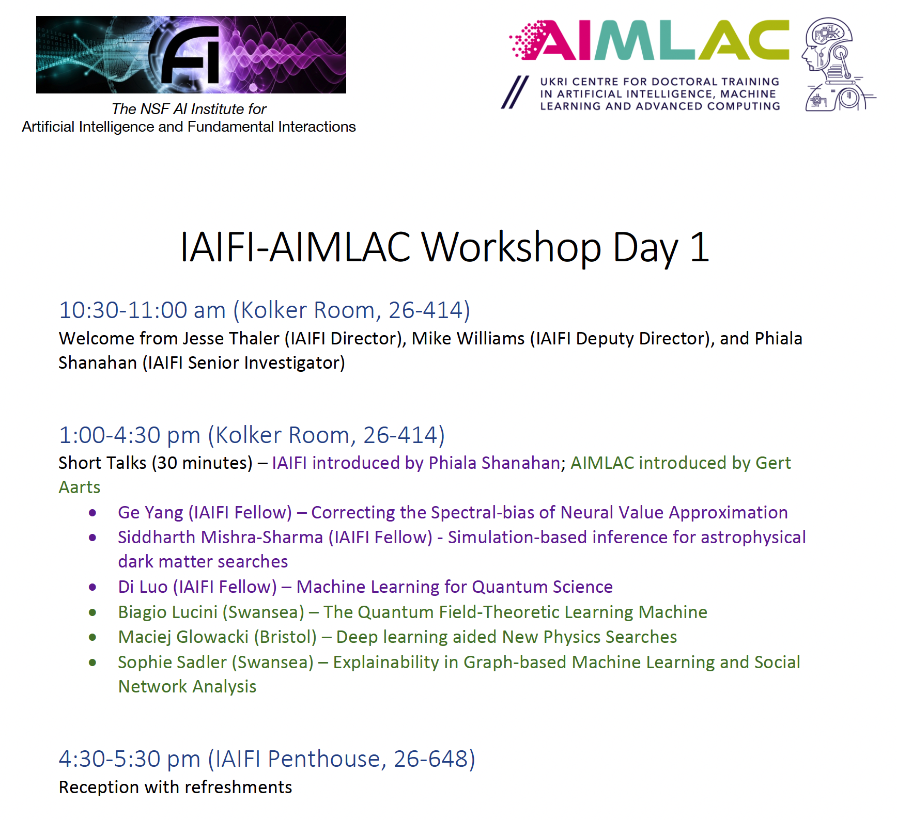
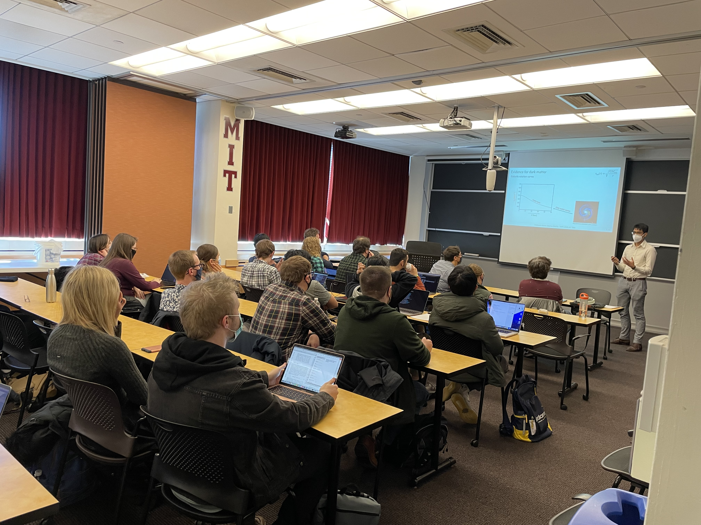
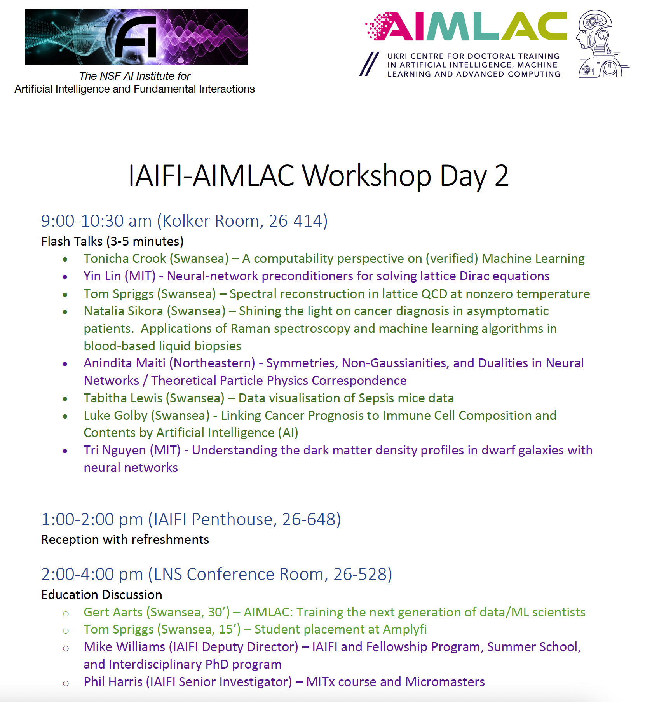
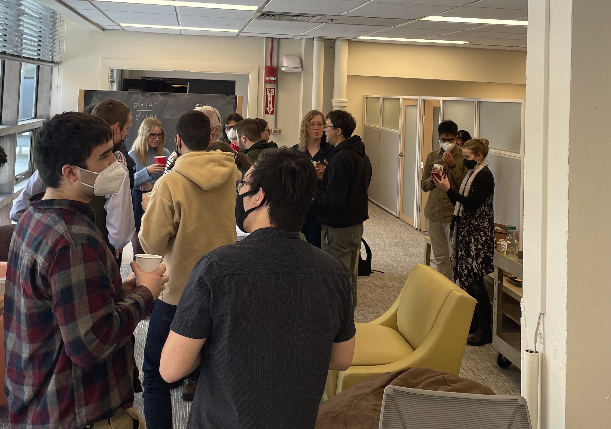
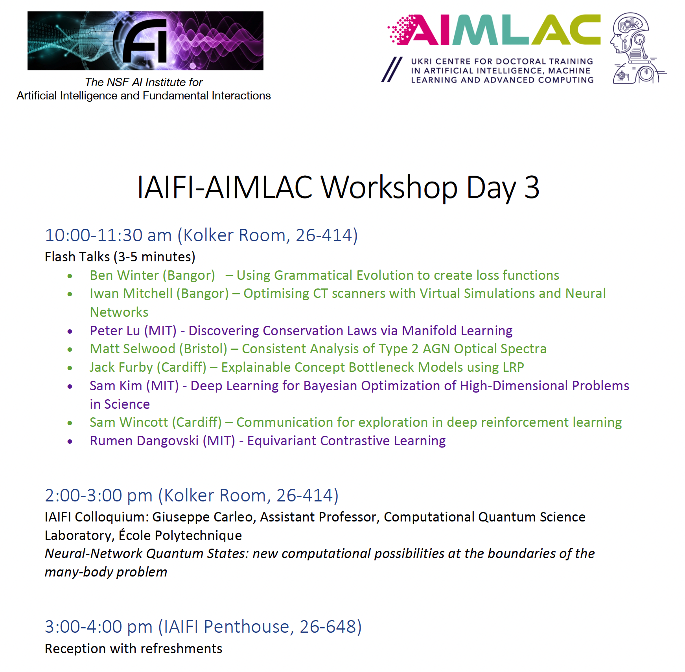
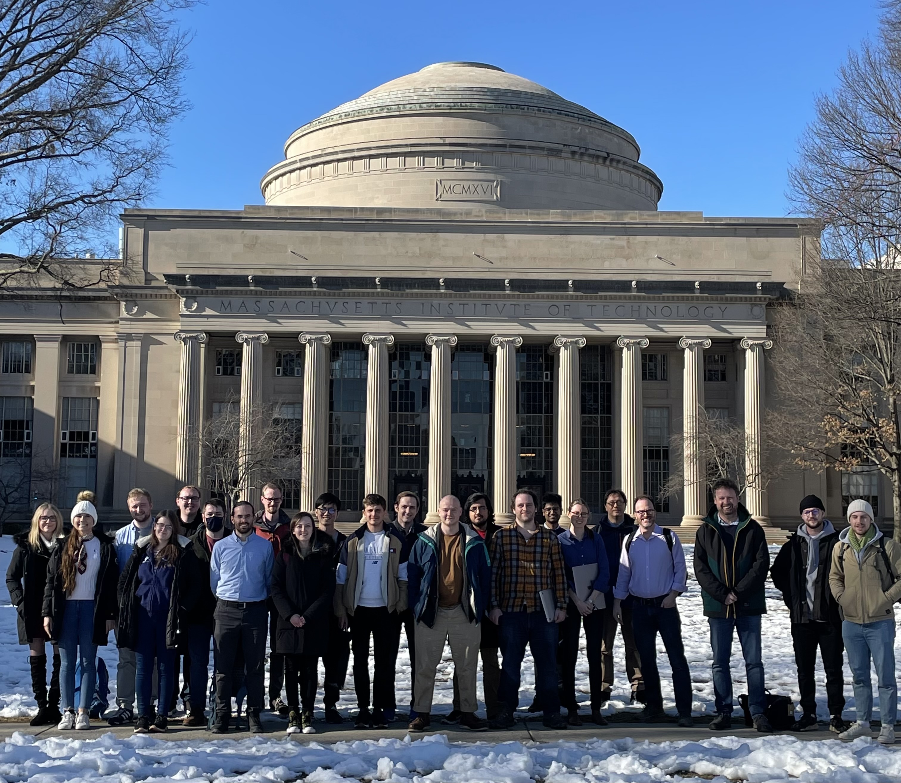

* [Partnership Hub](#partnership-hub)
* [IAIFI-AIMLAC Workshop 2022](#iaifi-aimlac-workshop-2022)
* [Other Physics and AI Collaborations](#other-physics-and-ai-collaborations)
* [Other NSF AI Institutes](#other-nsf-ai-institutes)

## Partnership Hub
We are in the process of developing partnerships across both industry and academia. If you are interested in discussing partnership opportunities with IAIFI, [contact Todd Zickler](mailto:zickler@seas.harvard.edu), IAIFI Knowledge Transfer Coordinator. 

IAIFI members can access the internal Partnership Hub, including links to resources and opportunities for collaboration (if you do not have access, [email IAIFI Management](mailto:iaifi@mit.edu).

## IAIFI-AIMLAC Workshop 2022
IAIFI welcomed 15 students and faculty from the [UKRI Centre for Doctoral Training in Artificial Intelligence, Machine Learning & Advanced Computing (AIMLAC)](http://cdt-aimlac.org) for an informal workshop March 2 through March 4, 2022. The two groups shared research and education strategies, and had opportunities for networking.

The program is shared below. [The slides are available](https://internal.iaifi.org/internal-events/#past-events) to IAIFI members by logging in to the IAIFI internal website.

    
    

    
    

    
    

## Other Physics and AI Collaborations
* [NSF AI Planning Institute for Data-Driven Discovery in Physics](https://www.cmu.edu/ai-physics-institute/index.html)
* [Community Laboratory for AI Research at the Intersection with Physics (CLARIPHY)](https://clariphy.org)
* [View our calendar of related events](/related-events.html)

## Other NSF AI Institutes
* [NSF AI Institute for Research on Trustworthy AI in Weather, Climate, and Coastal Oceanography (AI2ES)](https://www.ai2es.org), University of Oklahoma with University at Albany, Colorado State University, North Carolina State University, Texas A&M University - Corpus Christi, University of Washington, Del Mar College, National Center for Atmospheric Research, Google Research, The Weather Company
* [USDA-NIFA AI Institute for Next Generation Food Systems (AIFS)](https://aifs.ucdavis.edu), University of California - Davis with University of California - Berkeley, Cornell University, University of Illinois at Urbana-Champaign, USDA, University of California - Agriculture and Natural Resources
* [NSF AI Institute for Foundations of Machine Learning (IFML)](https://ml.utexas.edu/ifml), University of Texas at Austin with University of Washington, Wichita State University, Microsoft Research
* [NSF AI Institute for Student-AI Teaming (iSAT)](https://www.colorado.edu/research/ai-institute/), University of Colorado - Boulder with Colorado State University, University of California - Santa Cruz, University of California - Berkeley, Brandeis University, Worcester Polytechnic Institute, Georgia Tech, University of Illinois at Urbana-Champaign, University of Wisconsin - Madison
* [USDA-NIFA AI Institute for Future Agricultural Resilience, Management, and Sustainability (AIFARMS)](https://digitalag.illinois.edu/research/aifarms/), University of Illinois at Urbana-Champaign with The University of Chicago, Michigan State University, Tuskegee University, Argonne National Laboratory, Illinois Center for Digital Agriculture, Donald Danforth Plant Science Center, USDA-ARS
* [Molecule Maker Lab Institute: NSF AI Institute for Molecular Discovery, Synthetic Strategy, and Manufacturing (MMLI)](https://moleculemaker.org), University of Illinois at Urbana-Champaign with Penn State, Rochester Institute of Technology
* [NSF AI Institute for Intelligent Cyberinfrastructure with Computational Learning in the Environment (ICICLE)](https://live-icicle-program.pantheonsite.io), The Ohio State University with Case Western Reserve University, IC Foods, Iowa State University, Ohio Supercomputer Center, RPI, San Diego Supercomputer Center, Texas Advanced Computing Center, University of California - Davis, University of California - San Diego, University of Delaware, Indiana University, University of Utah, University of Wisconsin
* [NSF AI Institute for Collaborative Assistance and Responsive Interaction for Networked Groups (AI-CARING)](http://ai-caring.org), Georgia Tech with Carnegie Mellon University, Oregon State University, UMass Lowell, and Oregon Health & Science University
* [NSF AI Institute for Advances in Optimization (ai4opt)](https://www.ai4opt.org), Georgia Tech with UC Berkeley, Clark Atlanta University, Spelman College, USC, University of Texas - Arlington
* [NSF AI Institute for Learning-enabled Optimization at Scale (TILOS)](https://tilos.ai/index.html), University of California - San Diego with MIT, National University, University of Pennsylvania, University of Texas - Austin, Yale University
* [NSF AI Institute for Future Edge Networks and Distributed Intelligence (AI-EDGE)](https://aiedge.osu.edu), The Ohio State University with Northeastern University, UMass Amherst, Carnegie Mellon University, University of Texas - Austin, Purdue University, University of Illinois at Urbana-Champaign, UIC, University of Washington, University of Wisconsin - Madison, University of Michigan
* [NSF AI Institute for Edge Computing Leveraging Next-Generation Networks (Athena)](https://athena.duke.edu), Duke University with MIT, North Carolina Agricultural and Technical State University, Princeton University, University of Michigan, University of Wisconsin - Madison, Yale University
* [NSF AI Institute for Dynamic Systems](http://dynamicsai.org), University of Washington with Columbia University, Harvard University, University of Hawai'i, Montana State University, University of Nevada - Reno, University of Alaska - Anchorage, Boise State University, Portland State University
* [NSF AI Institute for Engaged Learning (Engage AI)](https://www.aiengage.org), North Carolina State University with The University of North Carolina at Chapel Hill, Vanderbilt University, Indiana University, Digital Promise
* [The USDA-NIFA Institute for Agricultural AI for Transforming Workforce and Decision Support (AgAID)](https://agaid.wsu.edu), Washington State University with Oregon State University, University of California - Merced, University of Virginia, Carnegie Mellon University, Heritage University, Wenatchee Valley College, Kansas State University, Innov8.ag, IBM Research
* [The AI Institute for Resilient Agriculture (AIIRA)](https://aiira.iastate.edu), Iowa State University with Carnegie Mellon University, The University of Arizona, University of Missouri - Mizzou, George Mason University, University of Nebraska - Lincoln, NYU, Iowa Soybean Association

