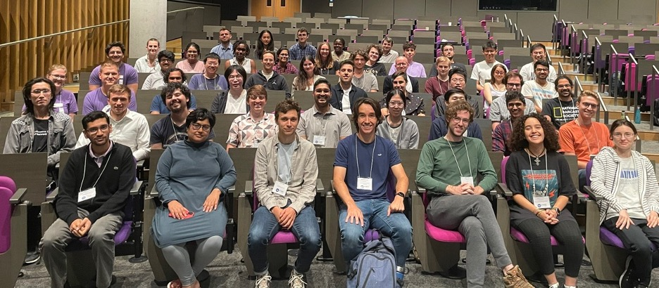
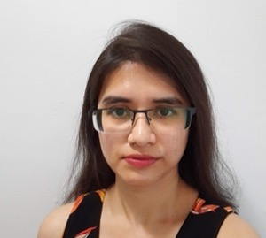
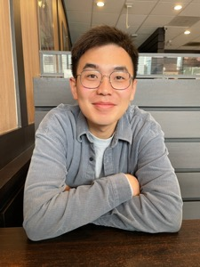
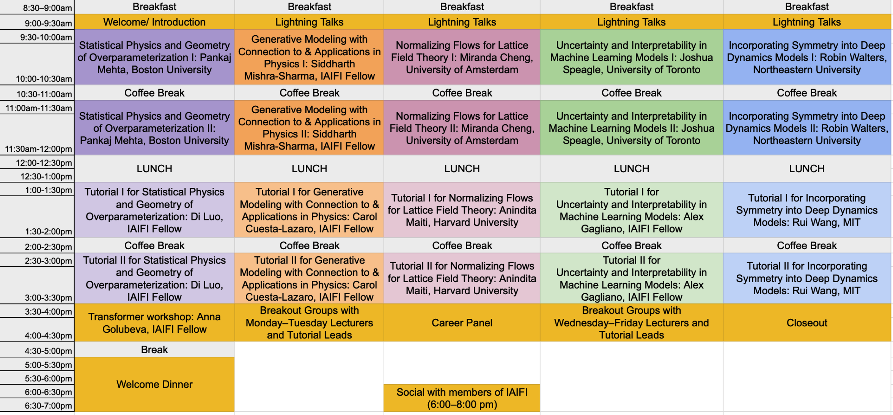

* [Summer School 2023](#summer-school-2023)
* [Summer School 2022](#summer-school-2022)
* [FAQ](#faq)

## Summer School 2023

The mission of the IAIFI PhD Summer School is to leverage the expertise of IAIFI researchers, affiliates, and partners toward promoting education and workforce development.  

* **August 7–11, 2023**
* **Northeastern University, Interdisciplinary Science and Engineering Complex**
* **Applications for the 2023 Summer School are now closed** 

 

[Agenda](#agenda){:.button.button--outline-primary.button--pill.button--lg} [Lecturers](#lecturers){:.button.button--outline-primary.button--pill.button--lg} [Tutorial Leads](#tutorial-leads){:.button.button--outline-primary.button--pill.button--lg}[Accommodations](#accommodations){:.button.button--outline-primary.button--pill.button--lg} [Costs](#costs){:.button.button--outline-primary.button--pill.button--lg} [Sponsors](#financial-supporters){:.button.button--outline-primary.button--pill.button--lg} [FAQ](#faq){:.button.button--outline-primary.button--pill.button--lg} [Past Schools](/past-summer-schools.html){:.button.button--outline-primary.button--pill.button--lg}

### About 
The Institute for Artificial Intelligence and Fundamental Interactions (IAIFI) is enabling physics discoveries and advancing foundational AI through the development of novel AI approaches that incorporate first principles, best practices, and domain knowledge from fundamental physics. The Summer School included lectures and events that exemplify ab initio AI, illustrate interdisciplinary research at the intersection AI and Physics, and encourage diverse global networking. Hands-on code-based tutorials that build on foundational lecture materials helped students put theory into practice.

### Accommodations
Students for the Summer School had the option to reserve dorm rooms (expenses paid by IAIFI thanks to generous financial support from partners) at Boston University. 

[Boston University Housing](https://www.bu.edu/housing/undergrad-housing/stuvi/10buick/), 10 Buick St, Boston, MA 02215

### Costs
* There was no registration fee for the Summer School. Students for the Summer School were expected to cover the cost of travel. 
* Lunch each day, as well as coffee and snacks at breaks, were provided during the Summer School, along with a dinner during the Summer School. 
* Students who wished to stay for the [IAIFI Summer Workshop](/summer-workshop.html) were able to book the same rooms through the weekend and the Workshop if they chose (at their own expense). 

## Lecturers

  <!--
-->

     

         
         

         

         <a href="https://www.uva.nl/en/profile/c/h/c.n.cheng/c.n.cheng.html">Miranda Cheng</a>
         

         

    <small>
         <small>
         <em> Associate Professor, University of Amsterdam; Research Scientist, Academia Sinica, Taiwan </em> 
         </small>
         </small>
         

	

         <em> Normalizing Flows for Lattice Field Theory </em>  
         

         

       

     

         
         

         

         <a href="http://physics.bu.edu/~pankajm/">Pankaj Mehta</a>
         

         

         <small>
   <small>
         <em> Professor of Physics, Boston University </em>
         </small>
         </small>
         

	

         <em> Statistical Physics and Geometry of Overparameterization </em>  
         

         

       

     

         
         

         

         <a href="https://smsharma.io/">Siddharth Mishra-Sharma</a>
         

         

         <small>
   <small>
         <em> IAIFI Fellow </em> 
         </small>
         </small>
         

	

         <em> Generative Modeling with Connection to & Applications in Physics </em>  
         

         

       

     

         
         

         

         <a href="https://joshspeagle.com/">Joshua Speagle</a>
         

         

         <small>
   <small>
         <em> Assistant Professor of Astrostatistics, University of Toronto </em>  
         </small>
         </small>
         

	

         <em> Uncertainty and Interpretability in Machine Learning Models </em>
         

         

       

     

         
         

         

         <a href="https://www.khoury.northeastern.edu/people/robin-walters/">Robin Walters</a>
         

         

         <small>
   <small>
         <em> Assistant Professor, Khoury College of Computer Sciences, Northeastern University </em> 
         </small>
         </small>  
         

	

         <em> Incorporating Symmetry into Deep Dynamics Models </em> 
         

         

       

  <!--
  

  -->

 

### Tutorial Leads

  <!--
-->

     

         
         

         

         <a href="https://iaifi.org/current-fellows.html#carolina-cuesta">Carolina Cuesta-Lazaro</a>
         

         

         <small>
   <small>
         <em> IAIFI Fellow </em>  
         </small>
         </small>
         

	

         <em> Tutorial lead for Siddharth Mishra-Sharma </em>  
         

         

       

     

         
         

         

         <a href="https://alexandergagliano.github.io">Alexander Gagliano</a>
         

         

         <small>
   <small>
         <em> IAIFI Fellow </em>  
         </small>
         </small>
         

	

         <em> Tutorial lead for Joshua Speagle </em>  
         

       

       

     

         
         

         

         <a href="https://iaifi.org/current-fellows.html#di-luo">Di Luo</a>
         

         

         <small>
   <small>
         <em> IAIFI Fellow </em>  
         </small>
         </small>
         

	

         <em> Tutorial lead for Pankaj Mehta </em>  
         

         

       

     

         
         

         

         <a href="https://aninditamaiti.github.io">Anindita Maiti</a>
         

         

         <small>
   <small>
         <em> Postdoctoral Fellow, Harvard </em>  
         </small>
         </small>
         

	

         <em> Tutorial lead for Miranda Cheng </em>  
         

         

       

     

         
         

         

         <a href="https://rui1521.github.io/online-cv/">Rui (Ray) Wang</a>
         

         

         <small>
   <small>
         <em> Postdoctoral Researcher, MIT </em>  
         </small>
         </small>
         

	

         <em> Tutorial lead for Robin Walters </em>  
         

         

       

 
  <!--
  

  -->

### Agenda

 

### Monday, August 7, 2023

**9:00–9:30 am ET**

Welcome/Introduction

**9:30 am–12:00 pm ET**

Lecture 1: Statistical Physics and Geometry of Overparameterization, Pankaj Mehta 

Abstract

<em>Modern machine learning often employs overparameterized statistical models with many more parameters than training data points. In this talk, I will review recent work from our group on such models, emphasizing intuitions centered on the bias-variance tradeoff and a new geoemetric picture for overparameterized regression.</em>

**12:00–1:00 pm ET**

Lunch 

**1:00–3:30 pm ET**

Tutorial 1: Statistical Physics and Geometry of Overparameterization, Di Luo

**3:30–4:30 pm ET**

Transformer Workshop, Anna Golubeva (Optional)

**5:00–7:00 pm ET**

Welcome Dinner

### Tuesday, August 8, 2023

**9:00–9:30 am ET**

Lightning Talks

**9:30 am–12:00 pm ET**

Lecture 2: Generative modeling, with connection to and applications in physics, Siddharth Mishra-Sharma

Abstract

<em>I will give a pedagogical tour of several popular generative modeling algorithms including variational autoencoders, normalizing flows, and diffusion models, emphasizing connections to physics where appropriate. The approach will be a conceptual and unifying one, highlighting relationships between different methods and formulations, as well as connections to neighboring concepts like neural compression and latent-variable modeling.</em>

 

**12:00–1:00 pm ET**

Lunch 

**1:00–3:30 pm ET**

Tutorial 2: Generative modeling, with connection to and applications in physics, Carolina Cuesta-Lazaro

**3:30–4:30 pm ET**

Breakout Sessions with Days 1 and 2 Lecturers and Tutorial Leads (Optional)

### Wednesday, August 9, 2023

**9:00–9:30 am ET**

Lightning Talks

**9:30 am–12:00 pm ET**

Lecture 3: Normalizing Flows for Lattice Field Theory, Miranda Cheng

Abstract

<em>Normalizing flows are powerful generative models in machine learning. Lattice field theories are indispensable as a computation framework for non-perturbative quantum field theories. In lattice field theory one needs to generative sample field configurations in order to compute physical observables. In this lecture I will survey the different normalizing flow architectures and discuss how they can be exploited in lattice field theory computations.</em>

**12:00–1:00 pm ET**

Lunch 

**1:00–3:30 pm ET**

Tutorial 3: Normalizing Flows for Lattice Field Theory, Anindita Maiti

**3:30–4:30 pm ET**

Career Panel, Panelists TBA (Optional)

**6:00–8:00 pm ET**

Social Event with IAIFI members

### Thursday, August 10, 2023

**9:00–9:30 am ET**

Lightning Talks

**9:30 am–12:00 pm ET**

Lecture 4: Uncertainty and Interpretability in Machine Learning Models, Joshua Speagle

Abstract

<em>In science, we are often concerned with not just whether our ML model performs well, but on understanding how robust our results are, how to interpret them, and what we might be learning, especially in the presence of observational uncertainties. I will provide an overview of various approaches to help address these challenges in both specific and general settings.</em>

 

**12:00–1:00 pm ET**

Lunch 

**1:00–3:30 pm ET**

Tutorial 4: Uncertainty and Interpretability in Machine Learning Models, Alex Gagliano

**3:30–4:30 pm ET**

Breakout Sessions with Days 3, 4, and 5 Lecturers and Tutorial Leads (Optional)

### Friday, August 11, 2023

**9:00–9:30 am ET**

Lightning Talks

**9:30 am–12:00 pm ET**

Lecture 5: Incorporating Symmetry into Deep Dynamics Models, Robin Walters

Abstract
    
<em>Given a mathematical model of a dynamical system, we can extract the relevant symmetries and use them to build equivariant neural networks constrained by these symmetries. This results in better generalization and physical fidelity.  In these lectures, we will learn how to follow this procedure for different types of systems such as fluid mechanics, radar modeling, and robotic manipulation and across different data modalities such as point clouds, images, and meshes.</em>

**12:00–1:00 pm ET**

Lunch 

**1:00–3:30 pm ET**

Tutorial 5: Incorporating Symmetry into Deep Dynamics Models, Rui Wang

**3:30–4:00 pm ET**

Closing

### Financial Supporters

We extend a sincere thank you to the following financial supporters of the 2023 IAIFI Summer School:

 

Northeastern University sponsors include: Office of the Provost, College of Science, department of Physics, and Khoury College of Computer Sciences.

 

 

 
 
 

### 2023 Organizing Committee 
* Jim Halverson, Chair (Northeastern University)
* Shuchin Aeron (Tufts)
* Denis Boyda (IAIFI Fellow)
* Anna Golubeva (IAIFI Fellow)
* Ouail Kitouni (MIT)
* Nayantara Mudur (Harvard)
* Sneh Pandya (Northeastern)

## Summer School 2022

 

The first annual IAIFI PhD Summer School was held at Tufts University **August 1—August 5, 2022**, followed by the IAIFI Summer Workshop **August 8—August 9, 2022**. 

Our first annual Summer School was held hybrid over 5 days, with ~85 attendees in person from over 9 different countries. 

### Summer School Agenda

[Download PDF of snapshot](images/2022-summer-school-agenda.pdf)

[View the detailed agenda for the IAIFI Summer School](https://iaifi.org/summer-school-agenda)

[View the complete Summer School program](talks/Summer-School_Program_2022.pdf)

### Lecturers

  <!--
-->
     

         
         

         

         <a href="https://yasamanb.github.io">Yasaman Bahri</a>
         

         

         <em> Research Scientist, Google Research (Brain Team) </em>  
         

         

       

     

         
         

         

         <a href="https://tacocohen.wordpress.com">Taco Cohen</a>
         

         

         <em> Research Scientist, Qualcomm Research Netherlands </em>  
         

         

       

     

         
         

         

         <a href="https://krippendorflab.github.io/">Sven Krippendorf</a>
         

         

         <em> Senior Researcher, Mathematical Physics and String Theory, Ludwig-Maximilians Universität </em>  
         

         

       

    

         
         

         

         <a href="https://vectorinstitute.ai/team/juan-felipe-carrasquilla/">Juan Carrasquilla</a>
         

         

         <em> Faculty Member, Vector Institute; Adjunct Assistant Professor, University of Waterloo </em>  
         

         

       

    

         
         

         

         <a href="https://www-physics.ucsd.edu/Directory/Person/552">Javier Duarte</a>
         

         

         <em> Assistant Professor, University of California, San Diego </em>  
         

         

       

  <!--
  

  -->

 

### Financial Supporters 
We extend a sincere thank you to the following financial supporters of the first IAIFI Summer School:

  

### 2022 Organizing Committee
* Jim Halverson, Chair (Northeastern University)
* Tess Smidt (MIT)
* Taritree Wongjirad (Tufts)
* Anna Golubeva (IAIFI Fellow)
* Dylan Rankin (MIT)
* Jeffrey Lazar (Harvard)
* Peter Lu (MIT)

## FAQ 
* *Who can apply to the Summer School?* Any PhD students or early career researchers working at the intersection of physics and AI may apply to the summer school. 
* *What is the cost to attend the Summer School?* There is no registration fee for the Summer School. Students for the Summer School are expected to cover the cost of travel and boarding.
* *Is there funding available to support my attendance at the Summer School?* IAIFI is covering the cost of the Summer School other than travel and lodging. 
* *If I come to the Summer School, can I also attend the Workshop?* Yes! We encourage you to stay for the Workshop and will cover the cost of your registration if you attend both the Summer School and Workshop in person. 
* *Will the recordings of the lectures be available?* We expect to share recordings of the lectures after the Summer School.
* *Will there be an option for virtual attendance?* We will determine whether virtual options will be provided based on interest.

[Submit a question or comment](https://app.smartsheet.com/b/form/76c1d070d19d4688b65962c4ed190478){:.button.button--outline-primary.button--pill.button--sm}
