# 2024 Summer Workshop 

 

The IAIFI Summer Workshop brings together researchers from across Physics and AI for plenary talks, poster sessions, and networking to promote research at the intersection of Physics and AI.

**Many of the videos from the 2024 IAIFI Summer Workshop are now [posted on the IAIFI YouTube channel](https://youtube.com/playlist?list=PLBY0ED2StbGZ-XaBaBu4IFgkRNyj54Ba9&feature=shared).**
{:.info} 

**Many of the speakers' slides from the 2024 IAIFI Summer Workshop are now [available online](https://drive.google.com/drive/folders/1oc50D5LE6BvAzHozT98VyLn1KoU1aN9d?usp=sharing).** 
{:.info} 

* **The 2024 Summer Workshop was held August 12–16, 2024**
* **Location: Bartos Theater, MIT List Visual Arts Center, Lower Level (20 Ames Street, Cambridge)**
* **Registration deadline: July 31, 2024** 

Here's what attendees at previous IAIFI Summer Workshops had to say about the experience: 

<iframe width="560" height="315" src="https://www.youtube.com/embed/QRfdc-3o01g?si=oHLv6eRpGUnpe__2" title="YouTube video player" frameborder="0" allow="accelerometer; autoplay; clipboard-write; encrypted-media; gyroscope; picture-in-picture; web-share" allowfullscreen></iframe>

<!--
We have extended the deadline to [submit a poster](https://t.co/AmNkXRoWeg).  Submit by July 17, 2023 for full consideration!
{:.success}
-->

[Agenda](#agenda){:.button.button--outline-primary.button--pill.button--lg} [Speakers](#speakers){:.button.button--outline-primary.button--pill.button--lg}

## About
The Institute for Artificial Intelligence and Fundamental Interactions (IAIFI) is enabling physics discoveries and advancing foundational AI through the development of novel AI approaches that incorporate first principles, best practices, and domain knowledge from fundamental physics. The goal of the Workshop is to serve as a meeting place to facilitate advances and connections across this growing interdisciplinary field.

[View recommendations for meals and activities around MIT](https://docs.google.com/document/d/1Z2qX9Owxi7IV3D2q3xBIXns5y4r3rAps/edit#heading=h.gjdgxs)

## Agenda

### Monday, August 12, 2024
**9:15-9:30 am ET**

Welcome

**9:30–10:15 am ET**

*10,000 Einsteins: AI and the future of theoretical physics*

Matt Schwartz, Harvard/IAIFI

Abstract

<em>AI has already proved revolutionary in many areas of physics, particularly those focused on data analysis. However, machines are also advancing rapidly in symbolic tasks. As much of what is done in theoretical physics is symbolic, there is tremendous potential for machines to transition from data analysis to formal theoretical work. This talk will discuss some initial progress in this direction and a vision for how machines and humans might collaborate in the future to solve some of the most challenging problems in fundamental physics.</em>

**10:15–11:00 am ET**

*Dynamic Models from Data*

Nathan Kutz, University of Washington

Abstract

<em>Physics based models and governing equations dominate science and engineering practice.  The advent of scientific computing has transformed every discipline as complex, high-dimensional and nonlinear systems could be easily simulated using numerical integration schemes whose accuracy and stability could be controlled.  With the advent of machine learning, a new paradigm has emerged in computing whereby we can build models directly from data.  In this work, integration strategies for leveraging the advantages of both traditional scientific computing and emerging machine learning techniques are discussed.  Using domain knowledge and physics-informed principles, new paradigms are available to aid in engineering understanding, design and control.</em>

**11:00-11:30 am ET**

Break

**11:30 am–12:15 pm ET**

*Accurate, efficient, and reliable learning of deep neural operators for multiphysics and multiscale problems*

Lu Lu, Yale University

Abstract

<em>It is widely known that neural networks (NNs) are universal approximators of functions. However, a less known but powerful result is that a NN can accurately approximate any nonlinear operator. This universal approximation theorem of operators is suggestive of the potential of deep neural networks (DNNs) in learning operators of complex systems. In this talk, I will present the deep operator network (DeepONet) to learn various operators that represent deterministic and stochastic differential equations. I will also present several extensions of DeepONet, such as DeepM&Mnet for multiphysics problems, DeepONet with proper orthogonal decomposition or Fourier decoder layers, MIONet for multiple-input operators, and multifidelity DeepONet. I will demonstrate the effectiveness of DeepONet and its extensions to diverse multiphysics and multiscale problems, such as bubble growth dynamics, high-speed boundary layers, electroconvection, hypersonics, geological carbon sequestration, and full waveform inversion. Deep learning models are usually limited to interpolation scenarios, and I will quantify the extrapolation complexity and develop a complete workflow to address the challenge of extrapolation for deep neural operators.</em>

**12:15–1:30 pm ET**

Lunch

**1:30–3:00 pm ET**

**Contributed Talks Session A - Representation/Manifold Learning**

Bartos Theater

Symmetries and neural tangent kernels: using physical principles to understand deep learning, Jan Gerken (Chalmers University of Technology)

<em>Despite its extraordinary success in applications, a thorough theoretical understanding of deep learning is still lacking, making progress depend largely on costly trial-and-error procedures. At the same time, theoretical physics has a long history of developing deep mathematical understanding of complex systems. In this talk, I will present some recent work on how techniques from theoretical physics can be used to deepen our understanding of deep learning and lead to practically relevant insights. In particular, symmetries, which are an established cornerstone of theoretical physics, have reached widespread popularity as a guiding principle in deep learning as well. In machine learning, symmetries feature most importantly in the form of data augmentation and equivariant neural networks. At the same time, neural tangent kernels, which are closely related to statistical field theory, have emerged as a powerful tool to understand neural networks both at initialization and during training. Combining these paradigms leads to practically relevant statements in deep learning. Furthermore, it opens the door towards further deepening the connecting between theoretical physics and our understanding of neural networks.</em>

 Approximately-symmetric neural networks for quantum spin liquids, Dominik Kufel (Harvard University)

<em>We propose and analyze a family of approximately-symmetric neural networks for quantum spin liquid problems. These tailored architectures are parameter-efficient, scalable, and significantly out-perform existing symmetry-unaware neural network architectures. Utilizing the mixed-field toric code model, we demonstrate that our approach is competitive with the state-of-the-art tensor network and quantum Monte Carlo methods. Moreover, at the largest system sizes (N=480), our method allows us to explore Hamiltonians with sign problems beyond the reach of both quantum Monte Carlo and finite-size matrix-product states. The network comprises an exactly symmetric block following a non-symmetric block, which we argue learns a transformation of the ground state analogous to quasiadiabatic continuation. Our work paves the way toward investigating quantum spin liquid problems within interpretable neural network architectures.</em>

Title to come, Simonetta Liuti (The University of Virginia)

<em>Abstract to come</em>

 A Neural Net Model for Distillation with Weights Explained, Berfin Simsek (NYU/Flatiron Institute)

<em>It is important to understand how large models represent knowledge to make them efficient and safe. We study a toy model of neural nets that exhibits non-linear dynamics and phase transition. Although the model is complex, it allows finding a family of the so-called "copy-average" critical points of the loss. The gradient flow initialized with random weights consistently converges to one such critical point for networks up to a certain width, which we proved to be optimal among all copy-average points. Moreover, we can explain every neuron of a trained neural network of any width. As the width grows, the network changes the compression strategy and exhibits a phase transition. We close by listing open questions calling for further mathematical analysis and extensions of the model considered here.</em>

**Physics-Motivated Optimization**

Beyond Closure Models: Estimating Long-term Statistics of Chaotic-Systems via Physics-Informed Neural Operators, Chuwei Wang (Caltech)

<em>Accurately predicting the long-term behavior of chaotic systems is important in many applications. This requires iterative computations on a dense spatiotemporal grid to account for the unstable nature of chaotic systems, which is expensive and impractical in many real-world scenarios. The alternative approach to such a full-resolved simulation is using a coarse grid and then correcting its errors through a 'closure model', which approximates the overall information from fine scales not captured in the coarse-grid simulation. Recently, ML approaches have been used for closure modeling, but they typically require a large number of training samples from expensive fully-resolved simulations (FRS). In this work, through the lens of Liouville flow in function spaces, we prove an even more fundamental limitation, viz., the standard approach to learning closure models suffers from a large approximation error for generic problems, no matter how large the model is, and it stems from the non-uniqueness of the mapping. We propose an alternative end-to-end learning approach using a physics-informed neural operator (PINO) that overcomes this limitation by not using a closure model or a coarse-grid solver.   We first train the PINO model on data from a coarse-grid solver and then fine-tune it with (a small amount of) FRS and physics-based losses on a fine grid. The discretization-free nature of neural operators means that they do not suffer from the restriction of a coarse grid that closure models face, and they can provably approximate the long-term statistics of chaotic systems. In our experiments on fluid dynamics, our PINO model achieves a 120x speedup compared to FRS with a relative error ~5%. In contrast, the closure model coupled with a coarse-grid solver is 58x slower than PINO while having a much higher error 205% when the closure model is trained on the same FRS dataset.</em>

Determining Heterogeneous Elastic Properties of Soft Materials using Physics-Informed Neural Networks, Wensi Wu (Children's Hospital of Philadelphia)

<em>The heterogeneous mechanical properties found in biological materials have profound implications for both engineering and medical applications. Within the engineering community, these properties are frequently studied to guide the design of mechanical devices such as artificial organs and soft robots. Concurrently, in the medical field, the mechanical properties of tissues play a crucial role in providing diagnostic information about various diseases and conditions. The significance of material mechanical properties across these diverse domains has driven a need to better understand the underlying mechanisms governing the microscopic properties of biological tissues and their associated functions, whether for improving material designs or disease diagnosis. In traditional engineering, identifying unknown material parameters requires iterative inverse finite element analyses and optimization of the constitutive parameters until the finite element model achieves an acceptable level of mechanical response, aligning with experimental data. While this method is efficient with homogeneous materials, optimizing the elasticity map of heterogeneous materials is challenging. In this work, we propose using physics-informed neural networks (PINNs) to identify the full-field elastic properties of highly nonlinear, hyperelastic materials. We applied our improved PINNs to six structurally complex materials and three constitutive material models (Neo-Hookean, Mooney-Rivlin, and Gent) to evaluate the accuracy of full-field elasticity maps estimated by PINNs. Our PINN model consistently produced highly accurate estimates of the full-field elastic properties, even when there was up to 10% noise present in the training data.</em>

**Contributed Talks Session B - Generative Models**

MIT Media Lab, Room 633

Machine learning phase transitions: A probabilistic perspective, Julian Arnold (University of Basel)

<em>The identification of phase transitions and the classification of different phases of matter from data are among the most popular applications of machine learning in physics. Neural network (NN)-based approaches have proven to be particularly powerful due to the ability of NNs to learn arbitrary functions. Many such approaches work by computing indicators of phase transitions from the output of NNs trained to solve specific classification problems. In this talk, I will derive the optimal solutions to these classification problems given by Bayes classifiers that take into account the probability distributions underlying the physical system under consideration [1]. This probabilistic viewpoint allows us to gain a deeper understanding of previous NN-based studies, highlighting the strengths and weaknesses of individual methods [1], enables us to root the methods in information theory [2], yields more efficient numerical routines based on the incorporation of readily available generative models [3], and widens the application domain of these methods to systems outside physics (such as diffusion models or transformers) [4,5]. 
[1] J. Arnold and F. Schäfer, PRX 12, 031044 (2022) [2] J. Arnold et al., arXiv:2311.10710 (2023) [3] J. Arnold et al., PRL 132, 207301 (2024) [4] J. Arnold et al., arXiv:2311.09128 (2023) [5] J. Arnold et al., arXiv:2405.17088 (2024)</em>

Accelerating Molecular Discovery with Machine Learning, Yuanqi Du (Cornell University)

<em>Recent advancements in machine learning have paved the way for groundbreaking opportunities in the realm of molecular discovery. At the forefront of this evolution are improved computational tools with proper inductive biases and efficient optimization. In this talk, I will delve into our efforts around these themes from a geometry, sampling and optimization perspective. I will first introduce how to encode symmetries in the design of neural networks and the balance of expressiveness and computational efficiency. Next, I will discuss how generative models enable a wide range of design and optimization tasks in molecular discovery. In the third part, I will talk about how the advancements in stochastic optimal control, sampling and optimal transport can be applied to find transition states in chemical reactions.</em>

Understanding Diffusion Models by Feynman's Path Integral, Yuji Hirono (Osaka University)

<em>Score-based diffusion models have proven effective in image generation and have gained widespread usage. We introduce a novel formulation of diffusion models using Feynman's path integral [1]. We find this formulation providing comprehensive descriptions of score-based generative models, and demonstrate the derivation of backward stochastic differential equations and loss functions.The formulation accommodates an interpolating parameter connecting stochastic and deterministic sampling schemes, and we identify this parameter as a counterpart of Planck's constant in quantum physics. This analogy enables us to apply the Wentzel-Kramers-Brillouin (WKB) expansion, a well-established technique in quantum physics, for evaluating the negative log-likelihood to assess the performance disparity between stochastic and deterministic sampling schemes.
Reference: [1] Yuji Hirono, Akinori Tanaka, Kenji Fukushima, accepted in ICML2024 [arXiv:2403.11262].</em>

Neural Entropy, Akhil Premkumar (University of Chicago)

<em>What is the smallest neural network that can do a particular task? To answer this question we need to understand the capacity of neural networks to encode and store information. In the context of generative diffusion models, we show that it is possible to identify the entropy of the network, which characterizes precisely its storage capacity.</em>

Predicting Missing Regions in Charged Particle Tracks Using a Sparse 3D Convolutional Neural Network, Hilary Utaegbulam (University of Rochester)

<em>The 2x2 Demonstrator is a prototype of ND-LAr, the liquid argon time-projection chamber of the Deep Underground Neutrino Experiment’s Near Detector complex. Both the 2x2 Demonstrator and ND-LAr are modular detectors that will have pixelated charge readouts and inactive regions wherein there is no sensitivity to charge deposition and light signals that arise from charged particle interactions with liquid argon. In the 2x2, these inactive regions are located in between the active detector modules, which introduces the challenge of inferring what charge signals ought to look like in these regions. This study explores the use of a Sparse 3D Convolutional Neural Network (ConvNet) to infer missing regions in charged particle tracks. Hits corresponding to energy depositions are voxelized into a three-dimensional grid for each track. Voxels that fall into predefined inactive regions are removed to simulate the lack of detector output. The model is trained to infer the topology of the missing track voxels, with the ultimate goal of inferring the missing charge or energy values in these voxels as well. Results indicate that this approach shows promise in prediction of missing track regions with some accuracy.</em>

**3:00–3:30 pm ET**

Break

**3:30–4:15 pm ET**

*What Do Language Models Have To Say About Fundamental Physics?* 

Mariel Pettee, LBNL/Flatiron

Abstract

<em>The launch of ChatGPT in November 2022 ignited an ongoing worldwide conversation about the possible impacts of Large Language Models (LLMs) on the way we work. As scientists, however, the changes in our workflows since the advent of this technology have been relatively minor. Will this still be the case in 10 years? Could an analogous paradigm shift arise from a foundation model trained on a large amount of scientific data, transforming the way we conduct our research? If so, what can we learn from the development of other foundation models, particularly LLMs, in their evolution from specialists to (quasi-)generalists? In this talk, I will present some recent work exploring how language models could help form a foundation model of fundamental physics. I'll also share my perspective on how we should strive to shape such models to reflect our highest priorities as scientists.</em>

**4:15-5:00 pm ET**

*Solving the nuclear many-body problem with neural quantum state*

Alessandro Lovato, Argonne National Laboratory

Abstract

<em>Artificial neural networks can be employed to accurately and compactly represent quantum many-body states relevant to many applications, including nuclear physics, quantum chemistry, and condensed matter problems. I will argue that a variational Monte Carlo algorithm based on neural-network quantum states provides a systematically improvable solution to the nuclear Schrödinger equation with a polynomial cost in the number of nucleons. After presenting recent progress in describing atomic nuclei, neutron-star matter, and hypernuclei, I will illustrate an application to condensed-matter systems, specifically ultra-cold Fermi gases near the unitary limit. Detailed benchmarks with continuum Quantum Monte Carlo methods will be presented.</em>

**5:00–7:00 pm ET**

Poster Session

MIT Media Lab, 6th Floor

Details

<ul> <li> Data Compression and Inference in Cosmology with Self-Supervised Machine Learning, Aizhan Akhmetzhanova (Harvard University) </li>
<li> CNN and Transformer architecture for jets events classification, Juvenal Bassa (University of Puerto Rico - Mayaguez) </li> 
<li>Data-Driven Discovery of X-ray Transients with Machine Learning, Steven Dillmann (University of Cambridge)</li>
<li>Sampling Transition Dynamics with Machine Learning Approaches, Yuanqi Du (Cornell University)</li>
<li>Multi-Modal Generalized Class Discovery for Scalable Autonomous All-Sky Surveys, Sriram Elango (Harvard University)</li>
<li>Inverse Design of Complex Fluids with Fully-Differentiable Lagrangian Particle Dynamics, Kaylie Hausknecht (Harvard University and MIT)</li>
<li>Perfect Jet Classification Through Equivariant Regression, Timothy Hoffman (University of Chicago)</li>
<li>Flow-Based Generative Emulation of Grids of Stellar Evolutionary Models, Marc Hon (MIT Kavli Institute for Astrophysics and Space Research)</li>
<li>Enhancing Cosmological Simulations with Efficient and Interpretable Machine Learning in the Wavelet Basis, Cooper Jacobus (UC Berkeley: Dept. Astrophysics, Lawrence Berkeley National Lab: Computational Cosmology Center)</li>
<li>Training neural operators to preserve invariant measures of chaotic attractors, Ruoxi Jiang (University of Chicago)</li>
<li>Hidden Giants: Redefining QSO Classification and Outlier Detection with Redshift Invariant Autoencoders, Thaddaeus Kiker (Columbia University)</li>
<li>KAN: Kolmogorov-Arnold Networks, Ziming Liu (MIT, IAIFI)</li>
<li>Phase Transitions in the Output Distribution of Large Language Models, Niels Loerch (University of Basel)</li>
<li>Tackling reasoning problems with AI, Rishabh Mallik (Forschungszentrum Jülich)</li>
<li>Recurrent Features of Amplitudes in Planar N = 4 Super Yang-Mills Theory, Garrett Merz (University of Wisconsin-Madison)</li>
<li>Ultrafast Jet Classification using Geometric Learning, Patrick Odagiu (ETH Zurich)</li>
<li>Deep Stochastic Mechanics, Elena Orlova (The University of Chicago)</li>
<li>Differentiable and Distributional Cosmological Stasis, Sneh Pandya (Northeastern / IAIFI)</li>
<li>Exploring Astronomical Catalog Crossmatching with Machine Learning, Victor Samuel Perez Diaz (Center for Astrophysics | Harvard & Smithsonian, IAIFI)</li>
<li>Towards an AI-enabled astronomy system: natural language processing of Chandra data archive, Shivam Raval (Harvard University)</li>
<li>Auto-decoding Poisson Processes for Unsupervised X-ray Sources Learning, Yanke Song (Harvard University, Department of Statistics)</li>
<li>Development of photothermal techniques for the detection of cancer biomarkers, Ilhem Soyah (Higher school of sciences and technology of Hammam Sousse)</li>
<li>Multi-Modal Contrastive Training for Robust VQA, Mitra Tajrobehkar (Vertical Oceans)</li>
<li>Zero-Shot Classification of Astronomical Images with Large Multimodal Models, Dimitrios Tanoglidis (University of Pennsylvania)</li>
<li>Vertex finding and jet class classification using Wasserstein Neural Network, Diego F. Vasquez Plaza (Univesity Puerto rico Mayagüez)</li>
<li>Learning Group Invariant CY Metrics by Fundamental Domain Projections, Moritz Walden (Uppsala University)</li>
<li>Accelerating Energy Computation in Many-electron Systems with Forward Laplacian, Chuwei Wang (Caltech)</li>
<li>Emulating the Effects of Pile-Up on X-ray Spectra, Justina Yang (Harvard University)</li>
<li>A Variational Continuation Method for Periodic Orbits Using Autograd and Hessian Eigendecompositions, Leo Yao (MIT)</li>
<li>HyperTagging: Reconstruction of Full Decays using Transformers and Hyperbolic Embedding, Boyang Yu (LMU Munich, Germany)</li>
<li>Neural scaling laws from large-N field theory, Zhengkang Zhang (University of Utah)</li>
<li>Revealing the 3D Cosmic Web with Physics Constrained Neural Fields, Brandon Zhao (Caltech)</li> </ul>

**6:00–8:00 pm ET**

Welcome Reception

MIT Media Lab, 6th Floor

### Tuesday, August 13, 2024

**9:30–10:15 am ET**

*Trends in AI for particle accelerators*

Verena Kain, CERN

Abstract

<em>AI is without doubt radically transforming science with many successful applications in molecular biology, astrophysics, nuclear physics and particle physics. It has enabled significant technological advances for robotics that can particularly enhance a system’s perception, navigational and manipulation abilities and interaction. For control, it enables novel and faster learning/teaching of tasks, replacing or augmenting classical control techniques for hard problems such as real-time control of the non-linear dynamics of the plasma in a tokamak of a fusion reactor, or navigating drones with super-human performance. Given the success and types of use cases that can be solved with AI algorithms, accelerator physics and associated technologies have also picked up on AI in the last 5 to 10 years with the number of ML applications steadily rising  - and subsequently the number of ML related papers at the big particle accelerator conferences. This contribution will give a brief overview of the typical use cases for AI for particle accelerators, show recent trends and describe the potential and vision of AI for particle accelerators with the emphasis on control and optimisation of particle accelerators.</em>

**10:15–11:00 am ET**

*An introduction to neural ODEs in scientific machine learning*

Patrick Kidger, Cradle.bio

Abstract

<em>This is an introduction to neural ODEs for scientific applications. The goal is to (a) provide a modelling tool that enhances the expressivity of existing theory-driven approaches, (b) demonstrate that neural ODEs are easy to use via modern autodifferentiable software, and (c) give enough of the tips-and-tricks needed to make neural ODEs work in practice!</em>

**11:00-11:30 am ET**

Break

**11:30 am–12:15 pm ET**

*Automatic Symmetry Discovery from Data*

Rose Yu, UCSD

Abstract

<em>Despite the success of equivariant neural networks in scientific applications, they require knowing the symmetry group a priori. However, it may be difficult to know which symmetry to use as an inductive bias in practice. Enforcing the wrong symmetry could even hurt the performance. In this talk, I will discuss our effort in developing a deep learning framework that can automatically discover symmetry from data.  Our framework, LieGAN, represents symmetry as interpretable Lie algebra basis and uses a paradigm akin to generative adversarial training. We further generalized it LaLieGAN to discover non-linear symmetries from high-dimensional data.  Empirically, the learned symmetry can also be readily used in  existing equivariant neural networks to improve accuracy and generalization in prediction. It can also improve equation discovery and long-term forecasting for various dynamical systems.</em>

**12:15–1:30 pm ET**

Lunch

**1:30–3:00 pm ET**

**Contributed Talks - Session A - Foundational ML**

Bartos Theater

Diversity with Similarity as a Measure of Dataset Quality, Josiah Couch (Beth Israel Deaconess Medical Center)

<em>Dataset size and class balance are important measures in deep learning. Maximizing them is seen as a way to ensure that datasets contain diverse images, which models are thought to need in order to generalize well. Yet neither size nor class balance measure image diversity directly, raising the possibility that better measures of dataset quality might exist. To test this hypothesis, we turned to a comprehensive framework of diversity measures that generalizes familiar quantities like Shannon entropy by accounting for the similarities and differences among images. (Size and class balance emerge from this framework as special cases.) We created several thousand diverse datasets by subsampling a variety of large medical-image datasets representing a range of imaging modalities, trained classifiers on these subsets, and calculated the correlation between subset diversity and model accuracy using diversity measures from the framework.</em>

RG flow of the NTK dynamics at finite-width from Feynman diagrams, Max Guillen (Chalmers University of Technology)

<em>Deep Learning is nowadays a well-stablished method for different applications in science and technology. However, it has been unclear for a long time how the "learning process" actually occurs in different architectures, and how this knowledge could be used to optimize performance and efficiency. Recently, high-energy-physics-based ideas have been applied to the modelling of Deep Learning, thus translating the learning problem to an RG flow analysis in Quantum Field Theory (QFT). In this talk, I will explain how these quite complicated formulae describing such RG flows for different observables in neural networks at initialization, can be easily obtained from a few rules resembling Feynman rules in QFT. I will also comment on some work in progress which implements such rules for computing higher-order corrections to the frozen (infinite-width) NTK for particular activation functions, and how they evolve after a few steps of SGD.</em>

Supervised learning of infinitely-overparameterized DNNs through the lens of Wilsonian RG, Anindita Maiti (Perimeter Institute)

<em>The key to the performance of ML algorithms is an ability to segregate relevant features in input datasets from the irrelevant ones. In a setup where data features play the role of an energy scale, we develop a Wilsonian RG framework to integrate out unlearnable modes associated with the Neural Network Gaussian Process (NNGP) kernel, in the regression context. Such a framework in the case of Gaussian features leads to a universal flow of the ridge parameter, whereas, non-Gaussianities in data features result in rich input-dependent RG flows. This framework goes beyond the usual analogies between RG flows and learning dynamics, and offers potential improvements to our understanding of feature learning and universality classes of models.</em>

Input Space Mode Connectivity in Deep Neural Networks, Jakub Vrabel (CEITEC, Brno University of Technology)

<em>We extend the concept of loss landscape mode connectivity to the input space of deep neural networks. Mode connectivity was originally studied within parameter space, where it describes the existence of low-loss paths between different solutions (loss minimizers) obtained through gradient descent. We present theoretical and empirical evidence of its presence in the input space of deep networks, thereby highlighting the broader nature of the phenomenon. We observe that different input images with similar predictions are generally connected, and for trained models, the path tends to be simple, with only a small deviation from being a linear path. Our methodology utilizes real, interpolated, and synthetic inputs created using the input optimization technique for feature visualization. To prove the existence of general mode connectivity in high-dimensional input spaces, we employ percolation theory. We argue that the approximate linear mode connectivity post-training is a manifestation of some implicit bias. We exploit mode connectivity to obtain new insights about adversarial examples and demonstrate its potential for adversarial detection. Additionally, we discuss applications for the interpretability of deep networks.</em>

Neural scaling laws from large-N field theory, Zhengkang Zhang (University of Utah)

<em>Many machine learning models based on neural networks exhibit scaling laws: their performance scales as power laws with respect to the sizes of the model and training data set. We use large-N field theory methods to solve a model recently proposed by Maloney, Roberts and Sully which provides a simplified setting to study neural scaling laws. Our solution extends the result in this latter paper to general nonzero values of the ridge parameter, which are essential to regularize the behavior of the model. In addition to obtaining new and more precise scaling laws, we also uncover a duality transformation at the diagrams level which explains the symmetry between model and training data set sizes. The same duality underlies recent efforts to design neural networks to simulate quantum field theories.</em>

Fourier-enhanced deep operator network for geophysics with improved accuracy, efficiency, and generalizability, Min Zhu (Yale University)

<em>Full waveform inversion (FWI) and geologic carbon sequestration (GCS) are two significant topics in geophysics. FWI infers subsurface structure information from seismic waveform data by solving a non-convex optimization problem. On the other hand, solving multiphase flow in porous media is essential for CO2 migration and pressure fields in the subsurface associated with GCS. However, numerical simulations for both FWI and GCS are computationally challenging and expensive due to the highly nonlinear governing partial differential equations (PDEs). Here, we develop a Fourier-enhanced deep operator network (Fourier-DeepONet) to address this issue. For FWI, compared with existing data-driven FWI methods, Fourier-DeepONet achieves more accurate predictions of subsurface structures across a wide range of source parameters. Additionally, Fourier-DeepONet demonstrates superior robustness when handling data with Gaussian noise or missing traces. For GCS, compared to the state-of-the-art Fourier neural operator (FNO), Fourier-DeepONet offers superior computational efficiency, with 90% fewer unknown parameters, significantly reduced training time (approximately 3.5 times faster), and much lower GPU memory requirements (less than 35%). Furthermore, Fourier-DeepONet maintains good accuracy when predicting out-of-distribution (OOD) data. This excellent generalizability is enabled by its adherence to the physical principle that the solution to a PDE is continuous over time.</em>

**Contributed Talks Session B - Physics-Motivated Optimization**

MIT Media Lab, Room 633

Search for new physics using Event-based anomaly detection at the ATLAS detector of CERN and development of ADFilter tool, Wasikul Islam (University of Wisconsin-Madison)

<em>Searches for new resonances in two-body invariant mass distributions are performed using an unsupervised anomaly detection technique in events produced in proton-proton collisions at a center of mass energy of 13 TeV recorded by the ATLAS detector at the LHC. Studies are conducted in data containing at least one isolated lepton. An autoencoder network is trained with 1% randomly selected collision events and anomalous regions are then defined which contain events with high reconstruction losses from the decoder. Nine invariant mass distributions are inspected which contain pairs of one light jet (or one b-jet) and one lepton, photon, or a second light jet (b-jet). The 95% confidence level upper limits on contributions from generic Gaussian signals are reported for the studied invariant mass distributions. The obtained model-independent limits show strong potential to exclude generic heavy states with complex decays.</em>

Marginalize, Don't Subtract:  Spectral Component Separation for Faint Objects in DESI, Ana Sofia Uzsoy (Harvard University)

<em>Component separation is a critical step in disentangling multiple signals and in extracting useful information from spectra. In this talk, I present MADGICS (Marginalized Analytic Dataspace Gaussian Inference for Component Separation), a data-driven Bayesian component separation technique that can separate a spectrum into any number of Gaussian-distributed components. I then discuss the application of this technique for automatically determining redshifts for Lyman Alpha Emitter (LAE) galaxies observed with DESI while marginalizing over sky residuals to separate sky from target emission lines. We create a covariance matrix from visually inspected DESI LAE targets to provide physically motivated priors, and determine redshift by jointly inferring sky, LAE, and residual components for each individual spectrum. This component separation technique will allow us to create a high-quality catalog of LAE spectra and redshifts from DESI data and is also broadly generalizable to other spectral features of interest.</em>

A Variational Continuation Method for Periodic Orbits Using Autograd and Hessian Eigendecompositions, Leo Yao (MIT)

<em>We present a Hessian-based approach to numerically continue periodic orbits. Our method offers precise initializations of oscillations around unstable fixed points, an integrator-free variational continuation method, and efficient detection of orbit family intersections and subharmonic bifurcations. Leveraging autograd for computations, we present full continuations of periodic double pendulum oscillations from fixed points and examples of detected bifurcations along these orbit families.</em>

Revealing the 3D Cosmic Web with Physics Constrained Neural Fields, Brandon Zhao (Caltech)

<em>Weak gravitational lensing is the slight distortion of galaxy shapes by the gravitational effect of the large-scale structure. In our work, we seek to invert the weak lensing signal found in 2D telescope images to obtain a 3D reconstruction of the universe’s dark matter field. While typically this inversion is done in 2D to obtain a projection of the dark matter field, accurate 3D maps of the dark matter distribution are particularly useful as they allow us to detect and localize structures of interest such as galaxy clusters, as well as disambiguate them from intervening matter along the line of sight. This inversion is ill-posed for several reasons. First, images are only observed from a single viewing angle, which must be inverted into a 3D mass distribution. Second, the exact locations and shapes of unlensed galaxies is in general unknown, and can only be estimated with a degree of uncertainty. This introduces a large amount of noise to our measurement of the lensing signal.  We propose a novel methodology using a physics-constrained, coordinate-based neural field to model the underlying continuous matter distribution. We take an analysis-by-synthesis approach, optimizing the weights of the neural network through a fully differentiable physical forward model to reproduce the lensing signal present in image measurements. We showcase reconstruction results on simulated measurements of dark matter distributions from a low resolution N-Body particle simulation, and compare our approach with earlier 3D inversion methods.</em>

**3:00–3:30 pm ET**

Break

**3:30–4:15 pm ET**

*KAN: Kolmogorov-Arnold Networks*

Ziming Liu, MIT/IAIFI

Abstract

<em>Inspired by the Kolmogorov-Arnold representation theorem, we propose Kolmogorov-Arnold Networks (KANs) as promising alternatives to Multi-Layer Perceptrons (MLPs). While MLPs have fixed activation functions on nodes ("neurons"), KANs have learnable activation functions on edges ("weights"). KANs have no linear weights at all -- every weight parameter is replaced by a univariate function parametrized as a spline. We show that this seemingly simple change makes KANs outperform MLPs in terms of accuracy and interpretability. For accuracy, much smaller KANs can achieve comparable or better accuracy than much larger MLPs in data fitting and PDE solving. Theoretically and empirically, KANs possess faster neural scaling laws than MLPs. For interpretability, KANs can be intuitively visualized and can easily interact with human users. Through two examples in mathematics and physics, KANs are shown to be useful collaborators helping scientists (re)discover mathematical and physical laws. In summary, KANs are promising alternatives for MLPs, opening opportunities for further improving today's deep learning models which rely heavily on MLPs.</em>

**4:15-5:00 pm ET**

*A Pathway to Robotic Intelligence*

Pulkit Agrawal, MIT/IAIFI

Abstract

<em>Details to come</em>

### Wednesday, August 14, 2024

**9:30–10:15 am ET**

*Navigating Complex Models: Neural Networks for High-Dimensional Statistical Inference*

Christoph Weniger, University of Amsterdam

Abstract

<em>Details to come</em>

**10:15–11:00 am ET**

*Data-Driven High-Dimensional Inverse Problems: A Journey Through Strong Lensing Data Analysis*

Laurence Levasseur, University of Montreal

Abstract

<em>Details to come</em>

**11:00-11:30 am ET**

Break

**11:30 am–12:15 pm ET**

*Machine Learning and Physics: The Alliance of the Titans*

Ayan Paul, Northeastern

Abstract

<em>Leaps in our understanding of Physics have been concomitant with the adoption of new and increasingly powerful mathematical structures that shift our perspective of how we probe the dynamics of the universe and allow us to unravel complex concepts that were hitherto inaccessible to us. In the realm of data-driven science, where physics is firmly planted, machine learning is proving to be a long-awaited and much-needed mathematical structure that has showcased its worth in aiding landmark discoveries, understanding the underlying symmetries of theories that we propose, and connecting signals to kinematics interpretably, to mention a few. In this parable on the charm of machine learning in physics, we will discuss the nuances of some of these achievements and lay out what we can expect from the future.</em>

**12:15–1:30 pm ET**

Lunch

**1:30–2:15 pm ET**

*Geometric Machine Learning*

Melanie Weber, Harvard University

Abstract

<em>A recent surge of interest in exploiting geometric structure in data and models in machine learning has motivated the design of a range of geometric algorithms and architectures. This lecture will give an overview of this emerging research area and its mathematical foundation. We will cover topics at the intersection of Geometry and Machine Learning, including relevant tools from differential geometry and group theory, geometric representation learning, graph machine learning, and geometric deep learning.</em>

**2:15–3:00 pm ET**

*Machine Learning for LHC Theory*

Tilman Plehn, Heidelberg

Abstract

<em>Details to come</em>

**3:00–3:30 pm ET**

Break

**3:30–4:15 pm ET**

*Asteroseismic probes of far-ranging astrophysics with big data and machine learning*

Earl Bellinger, Yale University

Abstract

<em>Space telescopes like the NASA Kepler and TESS missions as well as the forthcoming PLATO mission are driving a data revolution in stellar astrophysics. The ultra-precise observations provided by these missions are challenging our best models of how stars evolve, and are in turn granting insights into the formation and evolution of planetary systems and the Galaxy as a whole. They furthermore present novel opportunities to probe far-ranging physics, such as dark matter and theories of gravity beyond general relativity. In this talk, I will give an overview of the data, models, challenges, and opportunities in asteroseismology, and highlight the role that machine learning is playing in advancing our knowledge across astrophysics.</em>

**4:15-5:00 pm ET**

*Big data cosmology meets AI*

Carol Cuesta-Lazaro, IAIFI Fellow

Abstract

<em>The upcoming era of cosmological surveys promises an unprecedented wealth of observational data that will transform our understanding of the universe. Surveys such as DESI, Euclid, and the Vera C. Rubin Observatory will provide extremely detailed maps of billions of galaxies out to high redshifts. Analyzing these massive datasets poses exciting challenges that machine learning is uniquely poised to help overcome. In this talk, I will highlight recent examples from my work on probabilistic machine learning for cosmology. First, I will explain how a point cloud diffusion model can be used both as a generative model for 3D maps of galaxy clustering and as a likelihood model for such datasets. Moreover, I will present a generative model developed to reconstruct the initial conditions of the Universe from spectroscopic survey observations. When combined with the wealth of data from upcoming surveys, these machine learning techniques have the potential to provide new insights into fundamental questions about the nature of the universe.</em>

**5:30-6:30 pm ET**

*Panel on Industry–Academia Collaboration*

* Moderator: Carol Cuesta-Lazaro, IAIFI Fellow

* Bill Freeman, Professor of EECS, MIT

* Marin Soljacic, Professor of Physics, MIT

* Partha Saha, Distinguished Engineer, Data and AI Platform, Visa

* Nima Dehmamy, Research Assistant Professor, IBM Research MIT-IBM Lab

### Thursday, August 15, 2024

**9:30–10:15 am ET**

*Uncertainty Quantification from Neural Network Correlation Functions*

Yonatan Kahn, University of Illinois Urbana-Champaign

Abstract

<em>Details to come</em>

**10:15–11:00 am ET**

*Transformers to transform Scattering Amplitudes Calculation*

Tianji Cai, SLAC

Abstract

<em>AI for fundamental physics is now a burgeoning field, with numerous efforts pushing the boundaries of experimental and theoretical physics. In this talk, I will introduce a recent innovative application of Natural Language Processing to state-of-the-art calculations for scattering amplitudes. Specifically, we use Transformers to predict the symbols at high loop orders of the three-gluon form factors in planar N=4 Super Yang-Mills theory. Our results have demonstrated great promises of Transformers for amplitude calculations, opening the door for an exciting new scientific paradigm where discoveries and human insights are inspired and aided by AI.</em>

**11:00-11:30 am ET**

Break

**11:30 am–12:15 pm ET**

*Neural ansatze for physics and physics of neural networks*

Nima Dehmamy, IBM Research MIT-IBM Lab 

Abstract

<em>I will discuss some of our recent works on using ML to solve physics problems and using physics to understand ML. For the former, I will talk about using a "neural ansatz" for physics simulations and our work on gauge equivariant networks. For the latter, I will discuss our work on parameter space symmetries and conservation laws, as well as some work in progress on transformers. </em>

**12:15–1:30 pm ET**

Lunch

**1:30–3:00 pm ET**

**Contributed Talks: Session A - Uncertainty Quantification/Robust AI**

Bartos Theater

Jolideco: A Hybrid ML-Statistical Approach for Robust Image Deconvolution in Sparse Poisson Regimes, Axel Donath (Center for Astrophysics | Harvard & Smithsonian)

<em>Machine learning for sparse image data reconstruction remains challenging, particularly in Astronomy where ground truth is often unavailable. While simulations and transfer learning offer partial solutions, high-dimensional parameter spaces can render these approaches computationally expensive or infeasible. Moreover, in low-count Poisson domains, quantifying uncertainties is crucial. We present Jolideco, a novel hybrid method for joint likelihood image deconvolution that synergizes machine learning with classical statistical modeling. This approach leverages a hand-crafted forward model for the imaging process, incorporating prior information such as telescope characteristics and noise distributions. Simultaneously, it employs an high-dimensional, patch-based image prior trained via ML on astronomical images from other wavelengths to regularize image structure. Jolideco demonstrates significantly improved reconstruction quality across diverse source scenarios and signal-to-noise regimes. Its closed statistical framework facilitates multi-telescope data integration and robust uncertainty quantification. We showcase Jolideco's effectiveness using example data from the Chandra X-ray Observatory and the Fermi-LAT Gamma-ray Space Telescope, illustrating its potential to advance astronomical image analysis in the Poisson regime.</em>

Towards Quantitatively Trustworthy AI, Nicholas Kersting (Visa, Inc.)

<em>Safe and effective application of AI to Science and Industry can only proceed through  measuring trustworthiness quantitatively such that we may track and report progress.  Traditional statistical metrics such as Precision, Recall, AUC, etc., no longer sufficient on their own, are supplemented with measures of reliability such as Explainable AI (XAI), most recently in Large Language Model Groundedness and Hallucination --- we report especially on progress in this latter in recent research and applications at Visa.</em>

Evidence-based Inverse Problem Solvers for QCD: Demystifying Uncertainty in Inverse Problem Solutions of Parton Distribution Functions, Brandon Kriesten (Argonne National Laboratory)

<em>Representing parton distribution functions (PDFs) of hadrons through robust, high-fidelity parameterizations has been a long-standing goal of particle physics phenomenology. Additionally, quantitatively connecting the underlying theory assumptions and chosen fitted datasets to the properties of the PDF’s flavor and x-dependence is a long-standing challenge. We use a variational autoencoder-based inverse mapper to find solutions to the inverse problem of decoding PDFs from experimental measurements / lattice QCD data while simultaneously dissecting patterns of learned correlations between the encoded data and reconstructed PDFs. Finally using evidence-based techniques, we seek to quantify the uncertainty of these models and separate data (aleatoric) and knowledge (epistemic) uncertainty while identifying out of distribution samples. I will show progress towards implementing these evidence-based inverse problem solvers for PDFs in an implementation that mirrors a phenomenological fit.</em>

Simulation Based Inference for FCC-ee, Lingfeng Li (Brown University)

<em>We apply machine-learning techniques to the effective-field-theory analysis of the e+e−→W+W− processes at future lepton colliders, and demonstrate their advantages in comparison with conventional methods, such as optimal observables. In particular, we show that machine-learning methods are more robust to detector effects and backgrounds, and could in principle produce unbiased results with sufficient Monte Carlo simulation samples that accurately describe experiments. This is crucial for the analyses at future lepton colliders given the outstanding precision of the e+e−→W+W− measurement (∼O(10−4) in terms of anomalous triple gauge couplings or even better) that can be reached. Our framework can be generalized to other effective-field-theory analyses, such as the one of e+e−→tt¯ or similar processes at muon colliders.</em>

Embed and Emulate: Contrastive representations for simulation-based inference, Peter Lu (University of Chicago)

<em>Scientific modeling and engineering applications rely heavily on parameter estimation methods to fit physical models and calibrate numerical simulations using real-world data. In the absence of an analytic statistical model, modern simulation-based inference (SBI) approaches first use a numerical simulator to generate a dataset consisting of parameters and corresponding model outputs, such as trajectories from a dynamical system. Then, given real experimental data, the system parameters can be inferred using a variety of SBI methods, some of which use machine learning emulators to accelerate data generation and inference. However, parameter estimation for dynamical systems, such as weather and climate, is still often difficult due to the high-dimensional nature of the data as well as the complexity of the physical models and simulations. We introduce Embed and Emulate (E&E): a new likelihood-free inference method for estimating arbitrary parameter posteriors based on contrastive learning. E&E learns a low-dimensional embedding for the data (i.e. a summary statistic) and a corresponding fast emulator in the embedding space, bypassing the need for running an expensive simulation or a high-dimensional emulator during inference. We validate our theoretical results on an synthetic toy experiment, which illustrates properties of the learned embedding as a contrastive representation, and then benchmark E&E on a realistic multimodal parameter estimation task using the high-dimensional, chaotic Lorenz 96 system.</em>

Going beyond the jet tagging frontier using knowledge distillation, Yuanchen Zhou (Brown University)

<em>Classifying jets for proton-proton collisions is a challenging problem, and several Artificial Intelligence / Machine Learning classifiers have been introduced to help handle the task. Different classifiers have tradeoffs in terms of their accuracy, model dependency, processing time, etc. We study these tradeoffs for different model architectures, and explore techniques to improve their overall performance. In particular, we study the technique of Knowledge Distillation, which distills knowledge from a complex model with high accuracy to a simpler model with faster processing time and potentially less model-dependence to see if it is possible to increase the accuracy of the simpler model while maintaining its other advantages.</em>

**Contributed Talks Session B - Representation/Manifold Learning**

MIT Media Lab, Room 633

Multi-modal generalized class discovery for scalable autonomous all-sky surveys, Laura Domine (Center for Astrophysics, Harvard University)

<em>The Galileo Project is a systematic scientific research program focused on understanding the origins and nature of Unidentified Aerial Phenomena (UAP). To date there is very little data on UAP whose properties and kinematics purportedly reside outside the performance envelope of known phenomena. We are in the process of designing, building and commissioning a multi-modal, multi-spectral detector to continuously monitor the sky and collect UAP data through a rigorous aerial census of natural and human-made phenomena. This open-world setting is a major challenge for artificial intelligence (AI) techniques which need to both (i) accurately detect and classify objects from known classes and (ii) cluster unknown, out-of-distribution objects. Using a commissioning dataset, which includes several months of videos from an all-sky array of eight long wave-infrared cameras and audible recordings, I will discuss our work developing a multi-modal generalized class discovery method to automatically identify new classes of objects in unlabeled data in addition to known classes. It opens the door to an autonomous aerial census where categorization relies less on our prior expectations.</em>

SPECTER: Efficient Evaluation of the Spectral EMD, Rikab Gambhir (MIT)

<em>The Energy Mover’s Distance (EMD) has seen use in collider physics as a metric between events and as a geometric method of defining infrared and collinear safe observables. Recently, the spectral Energy Mover’s Distance (SEMD) has been proposed as a more analytically tractable alternative to the EMD. In this work, we obtain a closed-form expression for the Riemannian-like p = 2 SEMD metric between events, eliminating the need to numerically solve an optimal transport problem. Additionally, we show how the SEMD can be used to define event and jet shape observables by minimizing the metric between event and parameterized energy flows (similar to the EMD), and we obtain closed-form expressions for several of these observables. We also present the SPECTER framework, an efficient and highly parallelized implementation of the SEMD metric and SEMD-derived shape observables. We demonstrate that the SEMD and SPECTER provide nearly thousand-fold compute time improvements over evaluation of the EMD.</em>

Hybrid Physics-AI for efficient bias-aware state estimation, Stiven Briand God Massala Moussounda (NTU Singapore,  ENS Paris-Saclay)

<em>We consider the problem of optimal recovery of an element $u$ of a Hilbert space \mathcal{H} from noisy measurements $\ell_i(u)$. Specifically, $u$ is solution of a biased parametric partial differential equation \(\mathcal{P}( u, \mu) \) and measurements $\ell_i(u)$ are linear functionals on \mathcal{H}. We propose a bias-aware Hybrid-AI approach to solve the optimal recovery by combining the Parameterized Background Data-Weak(PBDW) with the deep neural operator (Deeponet) \cite{lulu}. PBDW combines the model \(\mathcal{P}\) and the measurement in a weak form and estimate the state and the model's bias as a  combination of anticipated(Knowledge) and unanticipated(Ignorance) uncertainty. The anticipated uncertainty belongs to a background space $\mathcal{Z}_N$ built from a reduced model of a best-knowledge manifold \(\mathcal{M}^{\mathrm{bk}} =\{u(\mu), \for \mu \in \mathcal{D} \}\), while the unanticipated uncertainty modeled by a Deeponet belongs to $\mathcal{Z}_{N}^{\perp}$. By integrating Deeponet in the PBDW sate estimate, Deeponet lies inside the kernel of the anticipated physics thus strictly accommodates the deficient physics by locally learning the model bias. The local information comes from an optimal sensor selection strategy. To showcase its potential for solving complex physical systems, we apply this method on a 2D Helmoltz equation defined on the physical domain $\Omega$ with various model's bias from the source, boundary conditions or both.
</em>

Parameter Symmetry and Formation of Latent Representations, Liu Ziyin (MIT, NTT Research)

<em>Symmetries exist abundantly in the loss function of neural networks. We characterize the learning dynamics of stochastic gradient descent (SGD) when exponential symmetries, a broad subclass of continuous symmetries, exist in the loss function. We establish that when gradient noises do not balance, SGD has the tendency to move the model parameters toward a point where noises from different directions are balanced. Here, a special type of fixed point in the constant directions of the loss function emerges as a candidate for solutions for SGD. As the main theoretical result, we prove that every parameter connects without loss function barrier to a unique noise-balanced fixed point. Lastly, we discuss how the theory can be leveraged to understand common phenomena in deep learning, such as progressive sharpening and flattening and the formation of latent representations.</em>

**3:00–3:30 pm ET**

Break

**3:30–4:15 pm ET**

*Applications of Neural Networks to Mitigate Unique Challenges in Neutrino Experiments*

Jessie Micallef, IAIFI Fellow

Abstract

<em>Details to come</em>

**4:15-5:00 pm ET**

*Equivariant Convolutional Networks & Group Steerable Kernels*

Maurice Weiler, MIT

Abstract

<em>Equivariance imposes symmetry constraints on the connectivity of neural networks. This talk investigates the case of equivariant networks for feature vector fields or point clouds, which generally requires 1) spatial (convolutional) weight sharing, and 2) G-steerability constraints on the shared weights themselves. It gives an intuition for steerable convolution kernels, discusses how they can be implemented directly via harmonic bases or implicitly via equivariant MLPs, and clarifies the relation to typical message passing operations in equivariant MPNNs. A gauge theoretic formulation of equivariant CNNs and MPNNs shows that these models are not only equivariant under global transformations, but under more general local gauge transformations as well.</em>

**5:00-5:30 pm ET**

Break

**5:30-7:30 pm ET**

Workshop Dinner, MIT Schwarzman College of Computing (51 Vassar St, Cambridge), 8th Floor

### Friday, August 16, 2024

**9:30–10:15 am ET**

*Neural Networks and Conformal Field Theory*

Jim Halverson, Northeastern/IAIFI

Abstract

<em>I'll present an essential result in ML theory, explain how it motivates a new approach to field theory, and present some key findings. Next, I'll discuss new work, explaining a result of Dirac on the relationship between Lorentz invariance and conformal invariance, and how this can be applied in neural networks for constructing new conformal field theories.</em>

**10:15–11:00 am ET**

*How good is your model — Goodness-of-fit by Neyman-Pearson testing*

Gaia Grosso, IAIFI Fellow

Abstract

<em>The Neyman-Pearson strategy for hypothesis testing can be employed for goodness-of-fit if the alternative hypothesis is selected from data by exploring a rich parametrised family of models. The New Physics Learning Machine (NPLM) methodology has been developed as a concrete implementation of this idea, to target the detection of new physical effects in multidimensional and unbinned collider data. The applications of the Neyman-Pearson test as a goodness-of-fit method extend beyond new physics discovery, to problems of data quality monitoring and, crucially, generative models validation. In this talk I will discuss the main challenges behind the practical use of the Neyman-Pearson strategy in real setups, such as model selection, uncertainty quantification and scalability, and I will present recent solutions and future prospect to tackle them.</em>

**11:00-11:30 am ET**

Break

**11:30 am–12:15 pm ET**

*Generative AI and the natural sciences: Governance strategies and historical perspectives*

David Kaiser, MIT

Abstract

<em>Generative AI techniques offer many exciting opportunities for researchers across the natural sciences and beyond. Like any new technologies, however, these tools can also lead to unanticipated problems. Therefore it is imperative to identify — and work to avoid or ameliorate — potential harms. Doing so requires coordination among the research community as well as with individuals and groups who are not themselves scientists. Recent history provides several examples of how once-new technologies have been managed by wide-ranging constituencies to advance the greater good. This talk will conclude by describing guidance for protecting scientific integrity in an age of generative AI, which was recently developed by a working group of the US National Academy of Sciences.</em>

**12:15–1:30 pm ET**

Lunch

**1:30–2:15 pm ET**

*Compiling Learning onto Physical Systems*

Dirk Englund, MIT

Abstract

<em>The hardware limitations of conventional electronics in deep learning applications have spurred exploration into physical architectures fundamentally different from today’s computers. This talk covers the scalability and performance metrics—such as throughput, energy consumption, and latency—of emerging optical and opto-electronic architectures, with a focus on recently developed hardware error correction techniques, in-situ training methods and initial field trials, as well as methods leveraging quantum information science to perform learning and inference in ways not currently possible. 
</em>

**2:15–3:00 pm ET**

*ML-based modeling and control to enable new capabilities in beam customization and control at particle accelerator scientific user facilities*

Auralee Edelen, SLAC

Abstract

<em>Particle accelerators are incredibly complicated machines that are used for numerous applications in science, industry, and medicine. At scientific user facilities driven by particle accelerators, it is often the case that custom particle beams must be generated on demand. Simultaneously, increasingly tight tolerances and difficult-to-achieve beam characteristics are needed to meet the needs of future applications of accelerators and unlock new experimental capabilities. This is a highly complicated, nonlinear control problem that involves precise shaping of the beam in 6D position-momentum phase space. In this talk I will discuss how ML based modeling and control is beginning to transform how beam control is conducted at accelerator facilities that require highly flexible beam customization. This includes the development of digital twins for accelerator systems, improving accelerator system models using differentiable simulations and other hybrid ML and physics approaches, physics-informed Bayesian optimization, reinforcement learning, and ML enhanced beam diagnostics. The talk will focus on examples from LCLS, LCLS-II, FACET-II, and MeV-UED at SLAC, and the APS and AWA at Argonne National Lab, all major scientific user facilities.
</em>

**3:00–3:30 pm ET**

Closing

## Speakers
 

  <!--
-->
    
    

         
         

         

         <a href="https://people.csail.mit.edu/pulkitag/">Pulkit Agrawal</a>
         

         

         <em> Assistant Professor, EECS, MIT </em>  
         

         

       

    

         
         

         

         <a href="https://earlbellinger.com/">Earl Bellinger</a>
         

         

         <em> Assistant Professor, Department of Astronomy, Yale University </em>  
         

         

       

    

         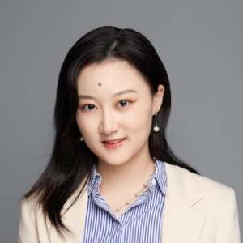
         

         

         <a href="https://profiles.stanford.edu/tianji-cai">Tianji Cai</a>
         

         

         <em> Research Associate, SLAC National Accelerator Laboratory </em>  
         

         

       

       
    

         
         

         

         <a href="https://iaifi.org/current-fellows.html#carolina-cuesta">Carolina Cuesta-Lazaro</a>
         

         

         <em> IAIFI Fellow, IAIFI </em>  
         

         

       

    

         
         

         

         <a href="http://nimadehmamy.com/">Nima Dehmamy</a>
         

         

         <em> Research Staff Member, IBM Research </em>  
         

         

       

   
    

         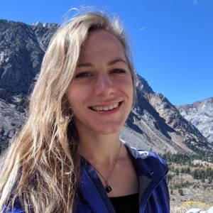
         

         

         <a href="https://scholar.google.com/citations?user=dFg7SC0AAAAJ&hl=en">Auralee Edelen</a>
         

         

         <em> Associate Scientist, SLAC National Accelerator Laboratory </em>  
         

         

       

    

         
         

         

         <a href="https://www.eecs.mit.edu/people/dirk-r-englund/">Dirk Englund</a>
         

         

         <em> Associate Professor, MIT </em>  
         

         

       

    

         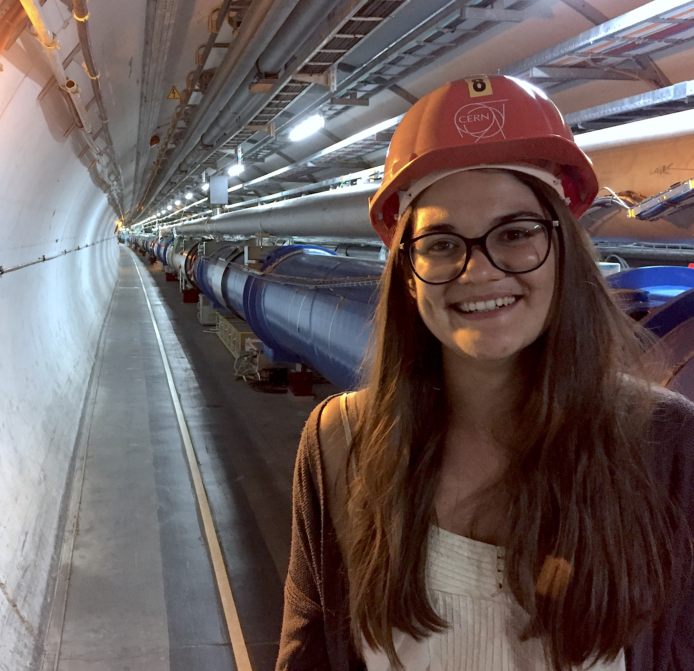
         

         

         <a href="https://iaifi.org/current-fellows.html#gaia-grosso">Gaia Grosso</a>
         

         

         <em> IAIFI Fellow </em>  
         

         

       

       
    

         
         

         

         <a href="http://www.jimhalverson.com/">Jim Halverson</a>
         

         

         <em> Associate Professor, Physics, Northeastern </em>  
         

         

       

        

         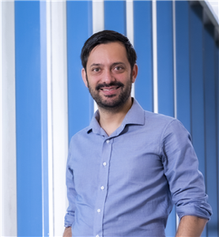
         

         

         <a href="https://yfkahn.web.illinois.edu/">Yonatan Kahn</a>
         

         

         <em> Assistant Professor, Theoretical Physicist, UIUC </em>  
         

         

       

    
    

         
         

         

         <a href="https://sparks.cern/index.php/kain-verena/">Verena Kain</a>
         

         

         <em> Scientist, CERN </em>  
         

         

       

       
    

         
         

         

         <a href="https://web.mit.edu/dikaiser/www/">David Kaiser</a>
         

         

         <em> Professor, History of Science/Physics, MIT </em>  
         

         

       

       
    

         
         

         

         <a href="https://kidger.site/">Patrick Kidger</a>
         

         

         <em> Mathematician and Machine Learning Researcher, Cradle.bio </em>  
         

         

       

    

         
         

         

         <a href="https://amath.washington.edu/people/j-nathan-kutz">J. Nathan Kutz</a>
         

         

         <em> Professor, University of Washington </em>  
         

         

       

    

         
         

         

         <a href="https://mila.quebec/en/person/laurence-perreault-levasseur/">Laurence Levasseur</a>
         

         

         <em> Assistant Professor, University of Montreal </em>  
         

         

       

       
    

         
         

         

         <a href="https://kindxiaoming.github.io/">Ziming Liu</a>
         

         

         <em> Grad Student, MIT </em>  
         

         

       

    

         
         

         

         <a href="https://www.anl.gov/profile/alessandro-lovato">Alessandro Lovato</a>
         

         

         <em> Physicist, Argonne National Laboratory </em>  
         

         

       

    

         
         

         

         <a href="https://lugroup.yale.edu/">Lu Lu</a>
         

         

         <em> Assistant Professor, Yale University </em>  
         

         

       

    

         
         

         

         <a href="https://github.com/jessimic">Jessie Micallef</a>
         

         

         <em> IAIFI Fellow, IAIFI </em>  
         

         

       

        
    

         
         

         

         <a href="https://ai.northeastern.edu/our-people/ayan-paul">Ayan Paul</a>
         

         

         <em> Research Scientist, The Institute for Experiential AI - Northeastern University </em>  
         

         

       

       
    

         
         

         

         <a href="https://marielpettee.com//">Mariel Pettee</a>
         

         

         <em> Chamberlain Postdoctoral Research Fellow, Lawrence Berkeley National Lab </em>  
         

         

       

       
    

         
         

         

         <a href="https://www.thphys.uni-heidelberg.de/~plehn/">Tilman Plehn</a>
         

         

         <em> Professor, ITP - Heidelberg University </em>  
         

         

       

    

         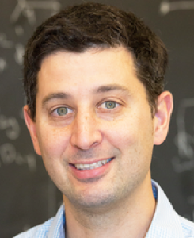
         

         

         <a href="https://scholar.harvard.edu/schwartz">Matt Schwartz</a>
         

         

         <em> Professor, Harvard </em>  
         

         

       

       
    

         
         

         

         <a href="http://melanie-weber.com/">Melanie Weber</a>
         

         

         <em> Assistant Professor of Applied Mathematics and of Computer Science, Harvard </em>  
         

         

       

       
    

         
         

         

         <a href="https://maurice-weiler.gitlab.io/">Maurice Weiler</a>
         

         

         <em> Deep Learning Researcher, University of Amsterdam </em>  
         

         

       

    

         
         

         

         <a href="https://www.christophweniger.com">Christoph Weniger</a>
         

         

         <em> Associate Professor, University of Amsterdam </em>  
         

         

       

       
    

         
         

         

         <a href="https://roseyu.com//">Rose Yu</a>
         

         

         <em> Assistant Professor, UC San Diego department of Computer Science and Engineering. </em>  
         

         

       

       
    <!--
    

  -->

 

## 2024 Organizing Committee 
* Fabian Ruehle, Chair (Northeastern University)
* Demba Ba (Harvard)
* Alex Gagliano (IAIFI Fellow)
* Di Luo (IAIFI Fellow)
* Polina Abratenko (Tufts)
* Owen Dugan (MIT)
* Sneh Pandya (Northeastern)
* Yidi Qi (Northeastern)
* Manos Theodosis (Harvard)
* Sokratis Trifinopoulos (MIT)

# 2023 Summer Workshop 

 

The 2023 IAIFI Summer Workshop brought together researchers from across Physics and AI for two days (August 14–18, 2023) of plenary talks, poster sessions, and networking to promote research at the intersection of Physics and AI. The Workshop followed the [IAIFI Summer School](/past-summer-schools.html).

* The 2023 Summer Workshop was held **August 14–18, 2023**
* **Northeastern University, Interdisciplinary Science and Engineering Complex**

Here's what attendees at the 2023 Summer Workshop had to say about the experience: 

<iframe width="560" height="315" src="https://www.youtube.com/embed/QRfdc-3o01g?si=oHLv6eRpGUnpe__2" title="YouTube video player" frameborder="0" allow="accelerometer; autoplay; clipboard-write; encrypted-media; gyroscope; picture-in-picture; web-share" allowfullscreen></iframe>

Videos of the plenary talks from the 2023 IAIFI Summer Workshop are [now available on YouTube](https://www.youtube.com/playlist?list=PLBY0ED2StbGalYxIbUNEK6ADuEv35W6ig).
{:.success}

## Agenda

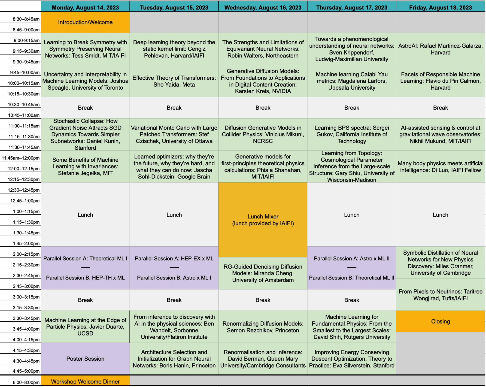 

### Monday, August 14, 2023
**8:30–9:00 am ET**

Welcome/Introduction

**9:00 am–9:45 am ET**

Intuition for the Data Types and Interactions in Euclidean Neural Networks, Tess Smidt (MIT/IAIFI)

Abstract

<em>3D Euclidean symmetry-equivariant neural networks (E(3)NNs) are emerging as an effective machine learning paradigm in molecular modeling, protein design, computer graphics, and beyond. In this talk, I'll discuss the fundamental building blocks of E(3)NNs and how these pieces are combined to create the growing zoo of E(3)NNs available today.</em>

**9:45–10:30 am ET**

Uncertainty and Interpretability in Machine Learning Models, Joshua Speagle (University of Toronto)

Abstract

<em>In science, we are often concerned with not just whether our ML model performs well, but on understanding how robust our results are, how to interpret them, and what we might be learning in the presence of observational uncertainties. I will provide an overview of various approaches to help address these challenges in both specific and general settings.</em>

**10:30–11:00 am ET**

Break

**11:00–11:45 am ET**

Stochastic Collapse: How Gradient Noise Attracts SGD Dynamics Towards Simpler Subnetworks, Daniel Kunin (Stanford University)

Abstract

<em>In this work, we reveal a strong implicit bias of stochastic gradient descent (SGD) that drives overly expressive networks to much simpler subnetworks, thereby dramatically reducing the number of independent parameters, and improving generalization. To reveal this bias, we identify invariant sets, or subsets of parameter space that remain unmodified by SGD. We focus on two classes of invariant sets that correspond to simpler subnetworks and commonly appear in modern architectures. Our analysis uncovers that SGD exhibits a property of stochastic attractivity towards these simpler invariant sets. We establish a sufficient condition for stochastic attractivity based on a competition between the loss landscape's curvature around the invariant set and the noise introduced by stochastic gradients. Remarkably, we find that an increased level of noise strengthens attractivity, leading to the emergence of attractive invariant sets associated with saddle-points or local maxima of the train loss. We observe empirically the existence of attractive invariant sets in trained deep neural networks, implying that SGD dynamics often collapses to simple subnetworks with either vanishing or redundant neurons. We further demonstrate how this simplifying process of stochastic collapse benefits generalization in a linear teacher-student framework. Finally, through this analysis, we mechanistically explain why early training with large learning rates for extended periods benefits subsequent generalization.</em>

**11:45 am–12:30 pm ET**

Some Benefits of Machine Learning with Invariances, Stefanie Jegelka (MIT)

Abstract

<em>In many applications, especially in the sciences, data and tasks have known invariances. Encoding such invariances directly into a machine learning model can improve learning outcomes, while it also poses challenges on efficient model design.
In the first part of the talk, we will focus on the invariances relevant to eigenvectors and eigenspaces being inputs to a neural network. Such inputs are important, for instance, for graph representation learning. We will discuss targeted architectures that can universally express functions with the relevant invariances - sign flips and changes of basis - and their theoretical and empirical benefits. Second, we will take a broader, theoretical perspective. Empirically, it is known that encoding invariances into the machine learning model can reduce sample complexity. For the simplified setting of kernel ridge regression or random features, we will discuss new bounds that illustrate two ways in which invariances can reduce sample complexity. Our results hold for learning on manifolds and for invariances to (almost) any group action.</em>

**12:30–2:00 pm ET**

Lunch

**2:00–3:00 pm ET**

**Parallel Session A: Theoretical ML I (Auditorium)**

Nu Tangent Kernels, Akshunna S. Dogra (Imperial College London)

<em>The approximation and generalization capacity of deep learning models has been profitably leveraged across a staggeringly wide variety of tasks. In particular, appropriately initialized Neural Networks sampled from suitable functional spaces invariably find stages of exponential (or near-exponential) learning. We introduce $\nu$ - Tangent Kernels ($\nu$TKs), functional analytic objects partly inspired from the Neural Tangent Kernel (NTK), to build a generic theory for Neural Network optimization and generalization. Specifically, we prove that for a large category of well-posed and semi-well-posed problems, Neural Network based models are capable of exponentially learning the tasks at hand. Notably, these results are showcased for a much wider class of loss functions/architectures than the standard mean squared error/large width regime that is usually the focus of conventional NTK analysis, and apply to diverse practical problems solved using real networks such as differential equation solvers, shape recognition, classification, feature extraction, etc. We end by exemplifying the power of the $\nu$TK perspective by comparing expected vs empirically observed optimization profiles across different regimes.</em>

A Solvable Model of Neural Scaling Laws, Alexander Maloney (McGill University)

<em>Large language models with a huge number of parameters, when trained on near internet-sized number of tokens, have been empirically shown to obey neural scaling laws: specifically, their performance behaves predictably as a power law in either parameters or dataset size until bottlenecked by the other resource. To understand this better, we first identify the necessary properties allowing such scaling laws to arise and then propose a statistical model -- a joint generative data model and random feature model -- that captures this neural scaling phenomenology. By solving this model in the dual limit of large training set size and large number of parameters, we gain insight into (i) the statistical structure of datasets and tasks that lead to scaling laws, (ii) the way nonlinear feature maps, such as those provided by neural networks, enable scaling laws when trained on these datasets, (iii) the optimality of the equiparameterization scaling of training sets and parameters, and (iv) whether such scaling laws can break down and how they behave when they do. Key findings are the manner in which the power laws that occur in the statistics of natural datasets are extended by nonlinear random feature maps and then translated into power-law scalings of the test loss and how the finite extent of the data's spectral power law causes the model's performance to plateau.</em>

Grokking: a playground for feature learning, Darshil Doshi (University of Maryland)

<em>Grokking in machine learning is the phenomenon of delayed generalization; wherein the network memorizes the training data quickly, but takes a much longer training time to learn useful features and generalize. Grokking offers a unique playground to gain insight into feature learning and generalization. In my talk, I will present a minimal framework that recreates Grokking: training a 2-layer Fully-Connected Network on Modular Arithmetic data. In this setup, it is possible to write down an analytical solution that generalizes to a 100% accuracy. More excitingly, a network trained with gradient descent finds the same solution! I will discuss these special solutions and the corresponding features. Furthermore, I will describe grokking "transitions" with training time, training dataset size and model size. I will end the talk with some interesting open questions on the topic and our ongoing work.</em>

**Parallel Session B: HEP-TH x ML (Room 138)**

$λφ^4$ Scalar Neural Network Field Theory, Anindita Maiti (Harvard University)

<em>Neural Network (NN) architectures at initialization define field theories. Certain large width limits of architectures result in free field theories due to Central Limit Theorem (CLT); deviations from CLT via finite width, and correlated, dissimilar NN parameters turn on field interactions. Edgeworth method provides a way to construct NN field theory actions using connected Feynman diagrams, where internal vertices correspond to connected correlators of NN field theories. Further, specific interacting field theories can be engineered via the NN parameter framework, where non-Gaussianities due to statistical independence breaking of NN parameters tune the action deformations. As an example, I will present the construction of $λφ^4$ scalar field theory in infinite width NNs.</em>

Applying the Variational Principle to Quantum Field Theory with Neural-Networks, John Martyn (MIT)

<em>Physicists dating back to Feynman have lamented the difficulties of applying the variational principle to quantum field theories. In non-relativistic quantum field theories, the challenge is to parameterize and optimize over the infinitely many n-particle wave functions comprising the state's Fock space representation. Here we approach this problem by introducing neural-network quantum field states, a deep learning ansatz that enables application of the variational principle to non-relativistic quantum field theories in the continuum. Our ansatz uses the Deep Sets neural network architecture to simultaneously parameterize all of the n-particle wave functions comprising a quantum field state. We employ our ansatz to approximate ground states of various field theories, including an inhomogeneous system and a system with long-range interactions, thus demonstrating a powerful new tool for probing quantum field theories.</em>

Structures of Neural Network Effective Theories, Zhengkang Zhang (University of Utah)

<em>We develop a diagrammatic approach to effective field theories (EFTs) corresponding to deep neural networks at initialization, which dramatically simplifies computations of finite-width corrections to neuron statistics. The structures of EFT calculations make it transparent that a single condition governs criticality of all connected correlators of neuron preactivations. Understanding of such EFTs may facilitate progress in both deep learning and field theory simulations.</em>

Normalizing Flows for Effective String Theory, Elia Cellini (University of Turin / INFN Turin)

<em>Effective String Theory (EST) is a non-perturbative framework used to describe confinement in Yang-Mills theory through the modeling of the interquark potential in terms of vibrating strings. An efficient numerical method to simulate such theories where analytical studies are not possible is still lacking. However, in recent years a new class of deep generative models called Normalizing Flows (NFs) has been proposed to sample lattice field theories more efficiently than traditional Monte Carlo methods. In this talk, we show a proof of concept of the application of NFs to EST regularized on the lattice. Namely, we use as case study the Nambu-Goto string in order to use the well-known analytical results of this theory as a benchmark for our methods.</em>

**3:00–3:30 pm ET**

Break

**3:30–4:15 pm ET**

Machine Learning at the Edge of Particle Physics, Javier Duarte (UCSD)

Abstract

<em>Ten years ago, the discovery of the Higgs boson confirmed the existence of a new kind of field, the Higgs field, which fills the universe. Measuring the interactions of the Higgs boson is necessary to confirm the standard model of particle physics, and any deviations from our expectations may give a critical hint for new laws of physics. At the CERN LHC, we collide protons at nearly the speed of light and analyze the debris from the collisions to learn about elementary particles like the Higgs boson. In this presentation, I will explain how we are developing machine learning methods to confront two major, and related, challenges at the LHC: (1) searching for the elusive Higgs boson self-interaction and (2) quickly filtering millions of collisions per second on field-programmable gate arrays (FPGAs) in pursuit of new physics.</em>

**4:15–5:30 pm ET**

Poster Session

Details

<em>Details to come.</em>

**6:00–8:00 pm ET**
Welcome Dinner

### Tuesday, August 15, 2023

**9:00 am–9:45 am ET**

Deep learning theory beyond the static kernel limit, Cengiz Pehlevan (Harvard/IAIFI)

Abstract

<em>Learning dynamics of deep neural networks is complex. While previous approaches made advances in mathematical analysis of the dynamics of two-layer neural networks, addressing deeper networks have been challenging. In this talk, I will present a mean field theory of the learning dynamics of deep networks and discuss its implications.</em>

**9:45–10:30 am ET**

Effective Theory of Transformers, Sho Yaida (Meta)

Abstract

<em>Large neural networks perform extremely well in practice, providing the backbone of modern machine learning. Theoretical analyses of these large models suggest particular scaling strategies, specifically for initialization and training hyperparameters. This talk walks through these suggestions for the concrete case of Transformers and mentions some of its practical implications.</em>

**10:30–11:00 am ET**

Break

**11:00–11:45 am ET**

Variational Monte Carlo with Large Patched Transformers, Stef Czischek (University of Ottawa)

Abstract

<em>Large language models, like transformers, have recently demonstrated immense powers in text and image generation. This success is driven by the ability to capture long-range correlations between elements in a sequence. The same feature makes the transformer a powerful wavefunction ansatz that addresses the challenge of describing correlations in simulations of qubit systems. In this talk I consider two-dimensional Rydberg atom arrays to demonstrate that transformers reach higher accuracies than conventional recurrent neural networks for variational ground state searches. I further introduce large, patched transformer models, which consider a sequence of large atom patches, and show that this architecture significantly accelerates the simulations.</em>

**11:45 am–12:30 pm ET**

Learned optimizers: why they're the future, why they’re hard, and what they can do now, Jascha Sohl-Dickstein (Google Brain)

Abstract

<em>The success of deep learning has hinged on learned functions dramatically outperforming hand-designed functions for many tasks. However, we still train models using hand designed optimizers acting on hand designed loss functions. I will argue that these hand designed components are typically mismatched to the desired behavior, and that we can expect meta-learned optimizers to perform much better. I will discuss the challenges and pathologies that make meta-training learned optimizers difficult. These include: chaotic and high variance meta-loss landscapes; extreme computational costs for meta-training; lack of comprehensive meta-training datasets; challenges designing learned optimizers with the right inductive biases; challenges interpreting the method of action of learned optimizers. I will share solutions to some of these challenges. I will show experimental results where learned optimizers outperform hand-designed optimizers in many contexts, and I will discuss novel capabilities that are enabled by meta-training learned optimizers.</em>

**12:30–2:00 pm ET**

Lunch

**2:00–3:00 pm ET**

**Parallel Session A: HEP-EX x ML (Room 136)**

Is infrared-collinear safe information all you need for jet classification?, Dimitrios Athanasakos (YITP, Stony Brook)

<em>Machine learning-based jet classifiers are able to achieve impressive tagging performance in a variety of applications in high energy and nuclear physics. However, it remains unclear in many cases which aspects of jets give rise to this discriminating power, and whether jet observables that are tractable in perturbative QCD such as those obeying infrared-collinear (IRC) safety serve as sufficient inputs. In this article, we introduce a new classifier, Jet Flow Networks (JFNs), in an effort to address the question of whether IRC unsafe information provides additional discriminating power in jet classification. JFNs are permutation-invariant neural networks (deep sets) that take as input the kinematic information of reconstructed subjets. The subjet radius serves as a tunable hyperparameter, enabling the sensitivity to soft emissions and nonperturbative effects to be gradually increased as the subjet radius is decreased. We demonstrate the performance of JFNs for quark vs. gluon and QCD vs.  � Z jet tagging. For small subjet radii, the performance of JFNs is equivalent to the IRC-unsafe Particle Flow Networks (PFNs), demonstrating that infrared-collinear unsafe information is not necessary to achieve strong discrimination for both cases. As the subjet radius is increased, the performance of the JFNs remains essentially unchanged until physical thresholds that we identify are crossed. For relatively large subjet radii, we show that the JFNs may offer an increased model independence with a modest tradeoff in performance compared to classifiers that use the full particle information of the jet. These results shed new light onto how machines learn patterns in high-energy physics data.</em>

Machine Learning the Top Mass, Katherine Fraser (Harvard University)

<em>Measurements in particle colliders are often done by fitting data to simulation, which depends on many parameters. For the top quark mass in particular, these physical and unphysical parameters generate a source of error that must be profiled when fitting. In this talk, we discuss several methods for reducing this source of error, including the machine-learning method DCTR and a dense linearly-activated neural network. We also compare to histogram fits commonly used in experiment.</em>

Data-Driven Light Model for the MicroBooNE Experiment, Polina Abratenko (Tufts University)

<em>MicroBooNE is a short baseline neutrino oscillation experiment that employs Liquid Argon Time Projection Chamber (LArTPC) technology together with an array of Photomultiplier Tubes (PMTs), which detect scintillation light. This light detection is necessary for providing a means to reject cosmic ray background and trigger on beam-related interactions. Thus, accurate modeling of the expected optical detector signal is critical. Previous light models used on MicroBooNE have been simulation-based, which limits accuracy related to certain regions of the detector as well as different data conditions during runs. We present the status of a data-driven light model that uses a neural network to map the light yield in the MicroBooNE detector, allowing for specific conditioning based on MicroBooNE data.</em>

Using Machine Learning to Consolidate Input for DUNE’s 2x2 Prototype Near Detector, Jessie Micallef (IAIFI Fellow)

<em>The Deep Underground Neutrino Experiment (DUNE) aims to measure neutrino properties by detecting neutrinos as they travel 1300 km from Fermilab to Sanford Underground Research Facility (SURF). Understanding the composition of the neutrino beam at Fermilab is vital to make precision measurements at SURF, and thus a prototype of the near detector will soon begin testing. The state-of-the-art near detector prototype has some challenges for reconstructing particles, such as gaps between submodules inside the prototype detector and inputs from differently designed endcap detectors. This talk will discuss work to use machine learning methods that could generate the missing signatures between submodules and detectors, along with leveraging information from the endcap detectors’ despite their different geometry and structure.</em>

**Parallel Session B: Astro x ML I (Room 140)**

LenSiam: Self-Supervised Learning on Strong Gravitational Lens Images, Joshua Yao-Yu Lin (Prescient Design/Genentech)

<em>Self-supervised learning has been known for learning good representations from data without annotated labels. We explore the simple siamese (SimSiam) architecture for representation learn- ing on strong gravitational lens images. Com- monly used image augmentations tend to change lens properties; for example, zoom-in would af- fect the Einstein radius. To create image pairs representing the same underlying lens model, we introduce a lens augmentation method to preserve lens properties by fixing the lens model while varying the source galaxies. Our research demon- strates this lens augmentation works well with SimSiam for learning the lens image representa- tion without labels, so we name it LenSiam. We also show that a pre-trained LenSiam model can benefit downstream tasks. We plan to open-source our code and datasets.</em>

Leveraging Machine Learning for Retrieving Exoplanet Atmosphere Parameters from Low-Resolution Spectra, Cecilia Garraffo (AstroAI - CfA Harvard & Smithsonian)

<em>The study of exoplanet atmospheres plays a vital role in understanding their composition. However, extracting accurate atmospheric parameters from transmission spectra poses significant challenges. Bayesian sampling algorithms, although effective, can be time-consuming and laborious. As an alternative, machine learning techniques offer promising avenues to expedite and enhance this process.  At the AstroAI group, Center for Astrophysics | Harvard & Smithsonian, we focus on developing AI-based solutions to address astrophysics challenges.  In this presentation I will discuss a new model to retrieve the atmospheric parameters of Earth-sized rocky exoplanets observed with the JWST NIRSpec instrument using machine learning techniques. To tackle this task, we put together an interdisciplinary team of experts in Machine Learning, Astronomy, Molecular Spectroscopy, and Exoplanetary Research. In addition, I will discuss our results in the ARIEL data challenge organized by the European Space Agency (ESA), which paves the way for analyzing data from the upcoming ARIEL space telescope.  I will show the results of two different AI techniques: semi-supervised autoencoders and normalising flows. With the first we retrieve credible atmospheric parameters while simultaneously providing a fast estimator of radiative transfer. The second allows us to generate probability distributions of the parameters for each observed spectrum, and thus gain valuable insights into the plausible compositions for each specific spectrum.   Through this interdisciplinary approach that merges astrophysics and machine learning, we aim to advance our understanding of exoplanet atmospheres. Our research showcases the capabilities of AI tools to revolutionize the analysis of exoplanetary data, preparing the ground for more efficient and accurate characterization of exoplanets in the future.</em>

Generating images of the M87* black hole using GANs, Arya Mohan (AstroAI - Univ.AI)

<em>Recently, AstroAI has been developing imaging computer vision algorithms to accomplish a series of tasks, including direct inference on the physical parameters of Black Holes, in collaboration with the Event Horizon Telescope (EHT).  In this talk I will present a novel data augmentation methodology based on Conditional Progressive Generative Adversarial Networks (CPGAN) to generate diverse black hole (BH) images, accounting for variations in spin and electron temperature prescriptions. These generated images are valuable resources for training deep learning algorithms to accurately estimate black hole parameters from observational data. Our model can generate BH images for any spin value within the range of [-1, 1], given an electron temperature distribution. To validate the effectiveness of our approach, we employ a convolutional neural network to predict the BH spin using both the GRMHD images and the images generated by our proposed model. Our results demonstrate a significant performance improvement when training is conducted with the augmented dataset while testing is performed using GRMHD simulated data, as indicated by the high $R^2$ score. In this talk, I will discuss how employing GANs as cost-effective models for black hole image generation can reliably augment training datasets for other parameterization algorithms.</em>

Applications of Autoencoders to Spectral and Timing Data for Black-Hole X-ray Binary Systems, Thaddeus Kiker(AstroAI - Columbia University)

<em>Astronomy is undergoing significant advancements in the application of machine learning techniques to analyze varied datasets. I will discuss our pioneering work utilizing machine learning techniques to predict the presence and characteristics of transient quasi-periodic oscillations (QPOs) in the time domain (manifest in the power-density spectra of X-ray binary systems) using data and features derived solely from the energy spectrum.   We have employed an abundance of data from the NICER and RXTE archives and applied our approach to low-frequency QPOs in black hole low-mass X-ray binary systems GRS 1915+105 and MAXI J1535-571.  This work establishes a non-traditional foundation for using machine learning to reveal hidden patterns between energy and time domains and offers unique insight contributing to the ongoing challenge of discerning  the nature and origin of QPOs.</em>

**3:00–3:30 pm ET**

Break

**3:30–4:15 pm ET**

From inference to discovery with AI in the physical sciences, Ben Wandelt (Sorbonne University/Flatiron Institute)

Abstract

<em>I will discuss machine learning approaches to Bayesian Inference and model comparison that are transforming the way we study the universe and its initial conditions with computational models.</em>

**4:15–5:00 pm ET**

Architecture Selection and Initialization for Graph Neural Networks, Boris Hanin (Princeton)

Abstract

<em>Graph neural networks (GNNs) are an important class of machine learning models designed for learning from graph-structured datasets, such as those from high energy physics, chemistry, genomics/genetics, and so on. In this talk, I will discuss recent work, joint with Gage DeZoort, in which we theoretically derive and empirically validate principles for architecture selection and initialization schemes in GNNs that provably avoid a range of common failure modes early in training.</em>

### Wednesday, August 16, 2023

**9:00 am–9:45 am ET**

The Strengths and Limitations of Equivariant Neural Networks, Robin Walters (Northeastern)

Abstract

<em>Despite the success of deep learning, there remain challenges to progress including dataset size, generalization, and lack of guarantees.  Incorporating symmetry into neural networks gives equivariant neural networks (ENN) which have helped address these challenges. I will discuss several dynamics applications, such as trajectory prediction, ocean currents, and robotics. However, there are also limits to the effectiveness of ENNs. In many applications where symmetry is only approximate or does apply across the entire input distribution, equivariance may hurt model performance.  I will discuss recent work characterizing errors resulting from mismatched symmetry biases which can be used for model selection.</em>

**9:45–10:30 am ET**

Generative Diffusion Models: From Foundations to Applications in Digital Content Creation, Karsten Kreis (NVIDIA)

Abstract

<em>Denoising diffusion-based generative models, rooted in physics, have led to multiple breakthroughs in deep generative learning. In this talk, I will provide an overview over recent works by NVIDIA on diffusion models and their applications for image, video, and 3D content creation. I will start with a short introduction to diffusion models and discuss large-scale text-to-image generation. I will also highlight different efforts on 3D generative modeling as well as high-resolution video generation with video latent diffusion models. Moreover, I will discuss techniques for smoother and faster diffusion, inspired by ideas in physics, for accelerated and high-performance generation.</em>

**10:30–11:00 am ET**

Break

**11:00–11:45 am ET**

Diffusion Generative Models in Collider Physics, Vinicius Mikuni (NERSC)

Abstract

<em>Generative models are are used in collider physics for a multitude of different tasks, including fast surrogate models for detector simulation, anomaly detection of new physics processes, and full event interpretation. In particular, diffusion models are becoming popular for different physics tasks due to high fidelity generation and flexible architecture design. In this talk, I will introduce different applications of diffusion models in collider physics and how physics knowledge is incorporated to create more performant models.</em>

**11:45 am–12:30 pm ET**

Generative models for first-principles theoretical physics calculations, Phiala Shanahan(MIT/IAIFI)

Abstract

<em>In the context of lattice quantum field theory calculations in particle and nuclear physics, I will describe avenues to accelerate sampling from known probability distributions using machine learning. I will focus in particular on flow-based generative models, and describe how guarantees of exactness and the incorporation of complex symmetries into model architectures can be achieved. I will show the results of proof-of-principle studies that demonstrate that sampling from generative models can be orders of magnitude more efficient than traditional sampling approaches such as Hamiltonian/hybrid Monte Carlo in this context, and discuss the potential impacts of these approaches in nuclear and particle physics.</em>

**12:30–2:15 pm ET**

Mixer Lunch
*Lunch provided by IAIFI on site*

**2:15–3:00 pm ET**

RG-Guided Denoising Diffusion Models, Miranda Cheng (University of Amsterdam)

Abstract

<em>In machine learning, score-based generative models have seen successes in recent years. In physics, the theory of renormalization group flows has been the backbone of the basic tools in the study of a wide range of physical phenomena. I will first point out their similarities, and discuss how the analogy inspires a systematica analysis of and explicit guideline for the design choices in denoising diffusion models.</em>

**3:00–3:30 pm ET**

Break

**3:30–4:15 pm ET**

Renormalizing Diffusion Models, Semon Rezchikov (Princeton)

Abstract

<em>We present a method for learning the renormalization group flow of lattice field theories in the context of flow-based approaches to sampling. The exact renormalization group is associated to a stochastic differential equation on the space of fields. Using this observation, one can design ML models of conventional form as those used in generative modeling for images, but for the learned flow, and in some cases the learned network parameters themselves, have a physical interpretation. We will discuss theory and numerical experiments, as well as potential applications. Based on joint work with Jordan Cotler.</em>

**4:15–5:00 pm ET**

Renormalisation and Inference, David Berman (Queen Mary University/Cambridge Consultants)

Abstract

<em>This talk will describe the link between exact renormalisation group flow and statistical inference. The basic idea being that inference incorporates data into a model while renormalisation throws information away.</em>

**6:00 pm ET**

Informal Meetup for IAIFI Summer Workshop Attendees at Owl's Nest (Night Shift) on the Esplanade

*Cost of food and drink not covered*

### Thursday, August 17, 2023

**9:00 am–9:45 am ET**

Towards a phenomenological understanding of neural networks, Sven Krippendorf (Ludwig-Maximillian University)

Abstract

<em>A comprehensive, yet simple framework to describe neural network dynamics holds the key to transform the way we design and train neural networks. In this talk I describe our vision for such a framework where neural network dynamics are described by effective field theories.
By reducing the neural network dynamics to few emergent, collective variables this approach promises a simple and interpretable framework to understand their non-linear dynamics.
I demonstrate that these dynamics are comparable to those of known EFTs in physics, in particular to those arising in cosmology. I show that these collective variables can be used for improved data selection with improved generalization behaviour. Further, I discuss that this framework naturally offers a way on how to optimize gradient descent, connecting with existing modifications such as natural gradient descent. </em>

**9:45–10:30 am ET**

Machine learning Calabi Yau metrics, Magdalena Larfors (Uppsala University)

Abstract

<em>Calabi Yau (CY) manifolds are used ubiquitously in research on string theory. Since decades, these spaces have provided the main avenue to connect string theory with observable physics. A stumbling block in these constructions is the lack of an analytical expression for the CY metrics. In this talk I will review recent work on obtaining numerical approximations of CY metrics using machine learning, and the prospects such metrics may have in furthering string theory research.</em>

**10:30–11:00 am ET**

Break

**11:00–11:45 am ET**

Learning BPS spectra, Sergei Gukov (California Institute of Technology)

Abstract

<em>Spectra of states and operators are the key data of quantum field theories in any dimension and with any amount of supersymmetry. In this talk, we will consider an infinite family of strongly coupled 3d supersymmetric theories labeled by graphs that at present time do not admit a UV Lagrangian description. Spectra of supersymmetric (BPS) states in such theories relate to equally mysterious modular properties of the corresponding generating functions. We shall see how machine learning can help us unveil some of these mysteries. Based on joint work with Rak-Kyeong Seong.</em>

**11:45 am–12:30 pm ET**

Learning from Topology: Cosmological Parameter Inference from the Large-scale Structure, Gary Shiu (University of Wisconsin-Madison)

Abstract

<em>A challenge common to different scientific areas is to effectively infer from big, complex, higher-dimensional datasets the underlying theory. Persistent homology is a tool in computational topology developed for recognizing the ``shape” of data. Such topological measures have the advantages that 1) they are stable against experimental noise, 2) they probe multiscale, non-local characteristics of a dataset, 3) they provide interpretable statistics that encode information of all higher-point correlations. In this talk, I will focus on the applications of persistent homology (with and without machine learning) to inference of cosmological parameters and primordial non-Gaussianity.</em>

**12:30–2:00 pm ET**

Lunch

**2:00–3:00 pm ET**

**Parallel Session A: Astro x ML II (Room 136)**

Using Neural Networks to detect Dark Star Candidates in the Early Universe, Sayed Shafaat Mahmud (Colgate University)

<em>Dark Stars, hypothesized to have formed during the cosmic dawn era,  are unique stellar objects that utilize dark matter annihilation as their primary source of energy against gravitational collapse. These stars can reach immense sizes, growing to millions of times the mass of our Sun, and possess luminosities on the order of trillion times that of the Sun. Dark Stars, powered by dark matter, have limited lifespans and may ultimately evolve into supermassive black holes. As such, Supermassive Dark Stars can be the precursors to the many observed supermassive black holes at high redshift, which remains an open question, many years after their discovery.  With the advent of the James Webb Space Telescope (JWST), we are now observing photometric data of too many, too massive, galaxy candidates too early in the universe. Motivated by recent findings by Ilie, Paulin, and Freese 2023 (PNAS submitted), who identified the first three Supermassive Dark Star candidates, our study aims to identify many more such candidates in the JWST data. To accomplish this, we will use a ‘two-step’ Neural network approach that trains using ~100,000 TLUSTY simulated spectra and identifies dark star candidates based on publicly available photometric data of high redshift objects found with JWST. As a validation of our method, we independently re-identified JADES-GS-z13-0, JADES-GS-z12-0, and JADES-GS-z11-0 as Dark Star candidates, as those found via a different approach in Ilie, Paulin, and Freese 2023.    Our study presents a novel application of neural networks in the detection of Dark Star candidates. The results from our analysis demonstrate the potential of neural networks in accurately predicting the crucial parameters associated with Dark Stars. This study contributes to our understanding of early universe astrophysics and aids in the identification of elusive Dark Star objects, shedding light on the complex interplay between dark matter and stellar evolution.</em>

Mapping Dark Matter in the Milky Way using Normalizing Flows and Gaia DR3, Sung Has Lim (Rutgers University)

<em>We present a novel, data-driven analysis of Galactic dynamics, using unsupervised machine learning -- in the form of density estimation with normalizing flows -- to learn the underlying phase space distribution of 6 million nearby stars from the Gaia DR3 catalog. Solving the collisionless Boltzmann equation with the assumption of approximate equilibrium, we calculate -- for the first time ever -- a model-free, unbinned, fully 3D map of the local acceleration and mass density fields within a 3 kpc sphere around the Sun. As our approach makes no assumptions about symmetries, we can test for signs of disequilibrium in our results. We find our results are consistent with equilibrium at the 10% level, limited by the current precision of the normalizing flows. After subtracting the known contribution of stars and gas from the calculated mass density, we find clear evidence for dark matter throughout the analyzed volume. Assuming spherical symmetry and averaging mass density measurements, we find a local dark matter density of 0.47±0.05GeV/cm3. We fit our results to a generalized NFW, and find a profile broadly consistent with other recent analyses.</em>

GHDNet: A Physics-Informed Neural Network for solving hydrodynamical systems in the presence of Self-gravity, Ramit Dey (Western University, Perimeter Institute)

<em>We propose GHDNet, a PINN-based architecture to model/solve a 3D self-gravitating hydrodynamical system. In computational astrophysics, cosmology and planetary science, such systems are of fundamental importance and the non-linear interaction of fluid dynamics with gravity makes them complicated. Compared to traditional approaches such as Finite Difference (FD), we show that PINNs being mesh-free, is a promising alternative, circumventing various limitations of the FD method. We present case studies where PINNs can trace the exponential growth of density due to gravitational instability in an efficient way while providing a more flexible, adaptable and scalable framework. We observe that for the 3D hydrodynamic simulations the runtime is ~10 times less compared to FD. Interestingly, GHDNet can predict accurate solutions well beyond the training domain.  Further, the accuracy of the model, both in terms of training loss as well as the deviation from the FD solution is analysed for a wide range of model parameters and a possible scaling law for PINNs is speculated.</em>

**Parallel Session B: Theoretical ML II (Room 140)**

Noisy dynamical systems evolve error correcting codes and modularity, Trevor McCourt (MIT/IAIFI)

<em>Noise is a ubiquitous feature of the physical world. As a result, the first prerequisite of life is fault tolerance: maintaining integrity of state despite external bombardment. Recent experimental advances have revealed that biological systems achieve fault tolerance by implementing mathematically intricate error-correcting codes and by organizing in a modular fashion that physically separates functionally distinct subsystems. These elaborate structures represent a vanishing volume in the massive genetic configuration space. How is it possible that the primitive process of evolution, by which all biological systems evolved, achieved such unusual results? In this work, through experiments in Boolean networks, we show that the simultaneous presence of error correction and modularity in biological systems is no coincidence. Rather, it is a typical co-occurrence in noisy dynamic systems undergoing evolution. From this, we deduce the principle of error correction enhanced evolvability: systems possessing error-correcting codes are more effectively improved by evolution than those without.</em>

Multi-modal Contrastive Learning for Robust Text Representation Classification, Mitra Tajrobehkar (vertical oceans pte ltd)

<em>Contrastive representation learning has emerged as a powerful technique in both Computer Vision (CV) and Natural Language Processing (NLP) domains, enabling the acquisition of practical and meaningful representations from text data. This talk will explore the captivating realm of contrastive representation learning in NLP, investigating its underlying principles and applications in tasks such as question answering. We will delve into the remarkable success of contrastive learning in enhancing language understanding, transfer learning, and domain adaptation in NLP tasks. Additionally, we will address the challenges associated with training language models, including limitations arising from data scarcity and bias. Join us to discover the potential of contrastive representation learning in advancing the capabilities of pre-trained language models.</em>

High-Dimensional Asymptotics of Feature Learning in the Early Phase of Neural Network Training, Zhichao Wang (UC San Diego)

<em>In this talk, I will present a recent application of random matrix theory in deep learning theory. We aim to show the benefit of feature learning due to gradient descent training of the first-layer parameters in a two-layer neural network where all the weight matrices are randomly initialized, and the training objective is the empirical MSE loss. We consider the ``early phase'' of learning in the proportional asymptotic limit, where all the dimensions go to infinity proportionally, and the number of gradient steps remains finite. In an idealized student-teacher setting, we show that gradient updates in the early phase result in a spiked random matrix model, which leads to an alignment between the first-layer weights and the teacher model. To quantify the impact of this alignment, we compute the asymptotic prediction risk of ridge regression on the trained features, which is determined by the Stieltjes transform of the limiting spectrum of the certain kernel random matrix. For a small learning rate, we establish a Gaussian equivalence property for the trained feature map and prove that the trained feature improves upon the initial random features model, but cannot defeat the best linear model on the input after finitely many gradient steps. Whereas for a sufficiently large learning rate, I will show that even after one gradient step, the same ridge estimator on trained features can go beyond this ``linear regime''. The talk is based on joint work with Jimmy Ba, Murat A. Erdogdu, Taiji Suzuki, Denny Wu,  and Greg Yang (arXiv:2205.01445).</em>

Adaptive active Brownian particles searching for targets of unknown positions, Harpreet Kaur (University of Innsbruck)

<em>Developing behavioral policies designed to efficiently solve target-search problems is a crucial issue both in nature and in the nanotechnology of the 21st century. Here, we characterize the target-search strategies of simple microswimmers in a homogeneous environment containing sparse targets of unknown positions. The microswimmers are capable of controlling their dynamics by switching between Brownian motion and an active Brownian particle and by selecting the time duration of each of the two phases. The specific conduct of a single microswimmer depends on an internal decision-making process determined by a simple neural network associated with the agent itself. Starting from a population of individuals with random behavior, we exploit the genetic algorithm NeuroEvolution of Augmenting Topologies to show how an evolutionary pressure based on the target-search performances of single individuals helps to find the optimal duration of the two different phases. Our findings reveal that the optimal policy strongly depends on the magnitude of the particle’s self-propulsion during the active phase and that a broad spectrum of network topology solutions exists, differing in the number of connections and hidden nodes.</em>

**3:00–3:30 pm ET**

Break

**3:30–4:15 pm ET**

Machine Learning for Fundamental Physics: From the Smallest to the Largest Scales, David Shih (Rutgers University)

Abstract

<em>What new particles and interactions exist beyond the Standard Model? What is the nature of dark matter? What is the origin of the universe? Essential questions of fundamental physics such as these are being confronted with an unprecedented amount of high quality data from the LHC and astronomical surveys. Powerful and cross-cutting machine learning techniques such as generative modeling, density estimation and anomaly detection are increasingly being applied to these datasets, vastly enhancing their discovery potential. In my talk, I will showcase some highlights from this ongoing machine learning revolution that span the range from the smallest scales (LHC data) to the largest scales (astronomical data). I will describe how new techniques developed for model-independent new physics searches and fast simulation at the LHC can also be applied to data from the Gaia space telescope to map out the Milky Way dark matter density, discover new stellar streams, and upsample galaxy simulations.</em>

**4:15–5:00 pm ET**

Improving Energy Conserving Descent Optimization: Theory to Practice, Eva Silverstein (Stanford)

Abstract

<em>Standard gradient-based optimization and sampling methods employ frictional and/or thermal dynamics on the loss landscape. We develop a novel framework based on energy-conserving chaotic Hamiltonian dynamics.  Using the formulas derived from energy conservation for phase space measure and speed, we engineer separable Hamiltonians whose measure on the target (parameter) space reproduces the desired sampling or optimization objective.    This predicts nontrivial functional relations among hyper-parameters, greatly reducing their tuning.  Empirically, the sampler MCHMC/MCLMC outperforms HMC on various benchmarks (and recent CMB analyses by others).  ECD optimization matches or improves upon the better of Adam(W) and SGD on varied benchmarks, with new theoretical calculations driving stronger systematic improvements.</em>

### Friday, August 18, 2023

**9:00 am–9:45 am ET**

AstroAI: A New Initiative for Artificial Intelligence in Astrophysics, Rafael Martinez-Galarza (Harvard & Smithsonian Center for Astrophysics)

Abstract

<em>AstroAI is a new initiative dedicated to the design and development of machine learning (ML) and artificial intelligence (AI) algorithms that advance the field of Astrophysics. AstroAI was launched at the Center for Astrophysics | Harvard & Smithsonian (CfA) in November 2022,  after an imperative need was recognized both within and outside of the CfA for reliable and interpretable models in scientific research, especially in Astrophysics. AstroAI is committed to designing AI-based models targeted to drive new scientific discovery in Astrophysics, using a model that prioritizes a multi-disciplinary approach and a diverse group of researchers. In this talk I will discuss AstroAI's journey and remarkable growth since its inception, along with a selection of the projects our team has undertaken. Further exploration of our projects and their transformative potential in astrophysical research will be showcased across various posters.</em>

**9:45–10:30 am ET**

Facets of Responsible Machine Learning, Flavio du Pin Calmon (Harvard)

Abstract

<em>This talk overviews recent results in two aspects of fair machine learning. First, we introduce a post-processing technique, "FairProjection," designed to ensure group fairness in prediction and classification. This method applies to any classifier without requiring retraining and attains state-of-the-art performance in both accuracy and group fairness assurance in probabilistic classification. We also present converse results based on Blackwell's "comparison of experiments" theorem that capture the limits of group-fairness assurance in classification. Second, we overview the concept of predictive multiplicity in machine learning. Predictive multiplicity arises when different classifiers achieve similar average performance for a specific learning task, yet produce conflicting predictions for individual samples.</em>

**10:30–11:00 am ET**

Break

**11:00–11:45 am ET**

AI-assisted sensing & control at gravitational wave observatories, Nikhil Mukund (MIT/IAIFI)

Abstract

<em>Gravitational waves (GWs) from astrophysical events merging black holes and neutron stars cause tiny perturbations in our spacetime fabric and can be detected using sensitive detectors like Advanced LIGO. Our ability to detect these elusive signals, especially the fainter ones from the earlier universe, depends on optimal sensing and control of GW interferometers. These observatories strive to find the proper equilibrium between maintaining a stable operating point for optimal sensitivity and continuously innovating to expand their astrophysical reach. The cross-coupled nature of the sub-systems involved in such optomechanical experiments, combined with the non-stationary nature of the ambient environment, often makes the task daunting. In this talk, I will discuss the potential of using deep neural systems for improved sensing and control at these observatories. I will highlight our recent successes in deploying deep reinforcement learning-based decision-making systems and discuss embedded machine learning for high bandwidth MIMO control. I will mention the challenges we encounter in deploying neural systems for temporarily varying complex systems and why tackling these issues would be crucial for next-generation GW detectors like Cosmic Explorer and Einstein Telescope.
</em>

**11:45 am–12:30 pm ET**

Many body physics meets artificial intelligence, Di Luo (IAIFI Fellow)

Abstract

<em>In this talk, we will discuss the interaction between many-body physics and artificial intelligence. The advancement of artificial intelligence provides powerful tools for simulating many-body physics systems, ranging from high energy physics, condensed matter physics to quantum chemistry. Meanwhile, the many-body physics principles also inspire the development of AI and robotics, including generative models and robot planning.</em>

**12:30–2:00 pm ET**

Lunch

**2:00–2:45 pm ET**

Symbolic Distillation of Neural Networks for New Physics Discovery, Miles Cranmer (University of Cambridge)

Abstract

<em>Would Kepler have discovered his laws if machine learning had been around in 1609? Or would he have been satisfied with the accuracy of some black box regression model, leaving Newton without the inspiration to find the law of gravitation? In this talk we will consider the incompatibility between physical interpretation and black box machine learning. I will present a technique termed "symbolic distillation" that promises to bridge the divide, using symbolic regression as a tool for "translating" concepts to a mathematical language. I will also review various applications of this technique, from cosmology, to turbulence, to even economics.</em>

**2:45–3:30 pm ET**

From Pixels to Neutrinos, Taritree Wongjirad (Tufts/IAIFI)

Abstract

<em>Abstract to come</em>

**3:30–4:00 pm ET**

Closing

## Speakers

e following speakers have accepted invitations to give plenary talks at this year's workshop. We will continue to add to the list as speakers accept. 

  <!--
-->

     

         
         

         

         <a href="https://www.qmul.ac.uk/spcs/staff/academics/profiles/dsberman.html">David Berman</a>
         

         

         <em> Professor, Queen Mary University; Head of AI, Cambridge Consultants </em>  
         

         

       

     

         
         

         

         <a href="https://www.uva.nl/en/profile/c/h/c.n.cheng/c.n.cheng.html">Miranda Cheng</a>
         

         

         <em> Associate Professor, University of Amsterdam; Research Scientist, Academia Sinica, Taiwan </em>  
         

         

       

     

         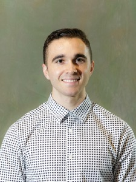
         

         

         <a href="https://astroautomata.com">Miles Cranmer</a>
         

         

         <em> Assistant Professor of Data Intensive Science, University of Cambridge </em>  
         

         

       

     

         
         

         

         <a href="https://www.uottawa.ca/faculty-science/professors/stefanie-czischek">Stefanie Czischek</a>
         

         

         <em> Assistant Professor, University of Ottawa </em>  
         

         

       

     

         
         

         

         <a href="https://people.seas.harvard.edu/~flavio/">Flavio du Pin Calmon</a>
         

         

         <em> Assistant Professor, Harvard </em>  
         

         

       

     

         
         

         

         <a href="https://www-physics.ucsd.edu/Directory/Person/552">Javier Duarte</a>
         

         

         <em> Assistant Professor, University of California, San Diego </em>  
         

         

       

     

         
         

         

         <a href="http://theory.caltech.edu/~gukov/">Sergei Gukov</a>
         

         

         <em> Professor, California Institute of Technology </em>  
         

         

       

     

         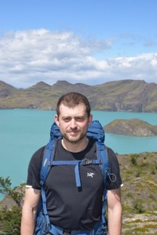
         

         

         <a href="https://boris-hanin.github.io">Boris Hanin</a>
         

         

         <em> Assistant Professor, Princeton </em>  
         

         

       

     

         
         

         

         <a href="http://people.csail.mit.edu/stefje/">Stefanie Jegelka</a>
         

         

         <em> Associate Professor, MIT </em>  
         

         

       

     

         
         

         

         <a href="https://karstenkreis.github.io">Karsten Kreis</a>
         

         

         <em> Senior Research Scientist, NVIDIA </em>  
         

         

       

     

         
         

         

         <a href="https://krippendorflab.github.io">Sven Krippendorf</a>
         

         

         <em> Senior Researcher, Ludwig-Maximilian University </em>  
         

         

       

     

         
         

         

         <a href="https://daniel-kunin.com">Daniel Kunin</a>
         

         

         <em> PhD Student, Stanford University </em>  
         

         

       

     

         
         

         

         <a href="https://www.katalog.uu.se/profile/?id=N3-1163">Magdalena Larfors</a>
         

         

         <em> Senior Lecturer/Associate Professor, Uppsala University </em>  
         

         

       

     

         
         

         

         <a href="https://scholar.google.com/citations?user=OxZytTQAAAAJ">Di Luo</a>
         

         

         <em> IAIFI Fellow </em>  
         

         

       

     

         
         

         

         <a href="https://lweb.cfa.harvard.edu/~jmartine/Welcome.html">Rafael Martinez-Galarza</a>
         

         

         <em> Astrophysicist, Harvard & Smithsonian Center for Astrophysics </em>  
         

         

       

     

         
         

         

         <a href="https://www.nersc.gov/about/nersc-staff/nesap-postdocs/vinicius-mikuni/">Vinicius Mikuni</a>
         

         

         <em> Postdoctoral Fellow, NERSC </em>  
         

         

       

     

         
         

         

         <a href="https://space.mit.edu/people/mukund-nikhil/">Nikhil Mukund</a>
         

         

         <em> Postdoctoral Scholar, MIT Kavli Institute </em>  
         

         

       

     

         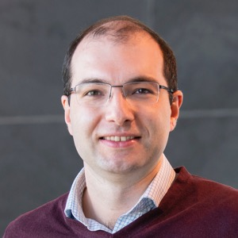
         

         

         <a href="https://pehlevan.seas.harvard.edu/">Cengiz Pehlevan</a>
         

         

         <em> Assistant Professor, Harvard </em>  
         

         

       

     

         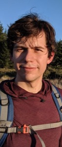
         

         

         <a href="https://www.rezchikov.me">Semon Rezchikov</a>
         

         

         <em> Research Instructor and NSF Postdoctoral Fellow, Princeton University </em>  
         

         

       

     

         
         

         

         <a href="https://physics.mit.edu/faculty/phiala-shanahan/">Phiala Shanahan</a>
         

         

         <em> Associate Professor, MIT </em>  
         

         

       

     

         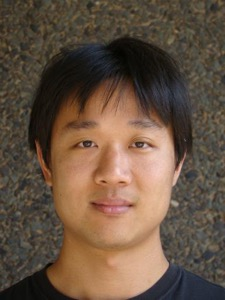
         

         

         <a href="https://physics.rutgers.edu/people/faculty-list/faculty-profile/shih-david">David Shih</a>
         

         

         <em> Professor, Rutgers University </em>  
         

         

       

     

         
         

         

         <a href="https://www.physics.wisc.edu/directory/shiu-gary/">Gary Shiu</a>
         

         

         <em> Professor, University of Wisconsin-Madison </em>  
         

         

       

     

         
         

         

         <a href="https://sitp.stanford.edu/people/eva-silverstein">Eva Silverstein</a>
         

         

         <em> Professor, Stanford University </em>  
         

         

       

     

         
         

         

         <a href="https://www.eecs.mit.edu/people/tess-smidt/">Tess Smidt</a>
         

         

         <em> Assistant Professor, MIT </em>  
         

         

       

     

         
         

         

         <a href="http://www.sohldickstein.com">Jascha Sohl-Dickstein</a>
         

         

         <em> Senior Staff Research Scientist, Google Brain </em>  
         

         

       

     

         
         

         

         <a href="https://joshspeagle.com/">Joshua Speagle</a>
         

         

         <em> Assistant Professor of Astrostatistics, University of Toronto </em>  
         

         

       

     

         
         

         

         <a href="https://www.khoury.northeastern.edu/people/robin-walters/">Robin Walters</a>
         

         

         <em> Assistant Professor, Khoury College of Computer Sciences, Northeastern University </em>  
         

         

       

     

         
         

         

         <a href="https://benwandelt.org">Ben Wandelt</a>
         

         

         <em> Professor, Sorbonne University and Senior Research Scientist, Flatiron Institute </em>  
         

         

       

     

         
         

         

         <a href="https://as.tufts.edu/physics/people/faculty/taritree-wongjirad">Taritree Wongjirad</a>
         

         

         <em> Assistant Professor, Tufts </em>  
         

         

       

     

         
         

         

         <a href="https://www.shoyaida.com">Sho Yaida</a>
         

         

         <em> Research Scientist, Meta </em>  
         

         

       

  <!--
  

  -->

 

## 2023 Organizing Committee 
* Jim Halverson, Chair (Northeastern University)
* Shuchin Aeron (Tufts)
* Denis Boyda (IAIFI Fellow)
* Anna Golubeva (IAIFI Fellow)
* Ouail Kitouni (MIT)
* Nayantara Mudur (Harvard)
* Marisa LaFleur (IAIFI Project Manger)

# 2022 Summer Workshop

 

The 2022 IAIFI Summer Workshop brought together researchers from across Physics and AI for two days (August 8–9, 2022) of plenary talks, poster sessions, and networking to promote research at the intersection of Physics and AI. The Workshop followed the [IAIFI Summer School](/past-summer-schools.html).

The first annual Summer Workshop was held hybrid with ~110 in-person attendees from 10 different countries. The Workshop included 82% of the Summer School students who stayed to partake in the Workshop activities. 

### Workshop Agenda

[Download PDF of agenda](images/2022-workshop-agenda.pdf)

### Plenary Speakers 2022
**IAIFI Investigators/Affiliates in bold**

* [Siamak Ravanbakhsh](https://www.siamak.page), Assistant Professor, School of Computer Science, McGill University
* [Greg Yang](https://www.microsoft.com/en-us/research/people/gregyang/), Senior Researcher, Microsoft Research
* **[Phil Harris](https://physics.mit.edu/faculty/philip-harris/)**, Assistant Professor of Physics, MIT
* [Kazuhiro Terao](https://www.codingkazu.com), Staff Scientist, Stanford University
* [Claudius Krause](https://claudius-krause.gitlab.io), Postdoctoral Associate, Rutgers University
* **[Fabian Ruehle](https://cos.northeastern.edu/people/fabian-ruehle/)**, Assistant Professor, Northeastern University
* [Yi-Zhuang You](https://physics.ucsd.edu/Directory/Person/536), Assistant Professor, University of California, San Diego
* [Jennifer Ngadiuba](https://inspirehep.net/authors/1244433), Wilson Fellow, Fermilab
* **[Shuchin Aeron](http://www.ece.tufts.edu/~shuchin/)**, Associate Professor, Tufts University
* **[Cora Dvorkin](https://dvorkin.physics.harvard.edu)**, Associate Professor, Harvard University
* [Sébastien Racanière](https://scholar.google.com/citations?user=o-h0vrQAAAAJ&hl=en), Staff Research Engineer, DeepMind
* **[Anna Golubeva](https://annagolubeva.github.io)**, IAIFI Fellow

### 2022 Organizing Committee
* Jim Halverson, Chair (Northeastern University)
* Tess Smidt (MIT)
* Taritree Wongjirad (Tufts)
* Anna Golubeva (IAIFI Fellow)
* Dylan Rankin (MIT)
* Jeffrey Lazar (Harvard)
* Peter Lu (MIT)
