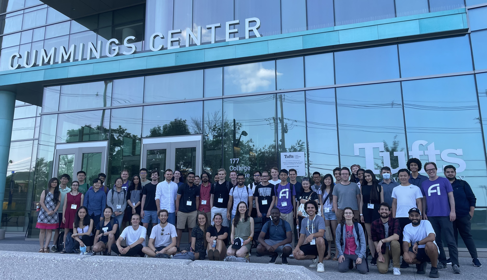
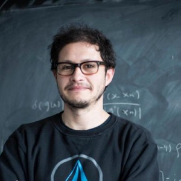

 
* [Summer School 2023](#summer-school-2023)
  * [Registration](#registration)
  * [Accomodations](#accommodations)
  * [Costs](#costs)
  * [Lecturers](#lecturers)
  * [2023 Organizing Committee](#2023-organizing-committee)
* [FAQ](#faq)
* [Summer School 2022](#summer-school-2022) 

## Summer School 2023
The mission of the IAIFI PhD Summer School is to leverage the expertise of IAIFI researchers, affiliates, and partners toward promoting education and workforce development. The Summer School will include lectures and events that exemplify ab initio AI, illustrate interdisciplinary research at the intersection AI and Physics, and encourage diverse global networking. Hands-on code-based tutorials that build on foundational lecture materials help students put theory into practice.

**This year's Summer School will be held at Northeastern University, August 7–11, 2023.**

### Registration
**Registration for the 2023 Summer School is now open**. Space is limited, so we require a brief application. **Applications are due April 9, 2023.** You you will be notified of your registration status by April 17, 2023.

[Apply to IAIFI Summer School](https://app.smartsheet.com/b/form/7d51a61adcc046eb9a59ac5496b34c2c){:.button.button--outline-primary.button--pill.button--sm}

### Accommodations
Students for the Summer School will have the option to reserve dorm rooms (at their own expense) at Boston University. Instructions for this will be provided to students upon acceptance.

### Costs
* There is no registration fee for the Summer School. Students for the Summer School are expected to cover the cost of travel and boarding. Boston University dorm rooms will be available to reserve at 96.50USD per night.
* Lunch each day, as well as coffee and snacks at breaks, will be provided daily during the Summer School, along with at least one dinner during the Summer School. 
* Students who wish to stay for the [IAIFI Summer Workshop](/summer-workshop.html) will be able to book the same rooms through the weekend and the Workshop if they choose and the Workshop registration fee will be waived for students participating in the Summer School. 

### Lecturers
Lecturers will be announced in late February 2023.

### 2023 Organizing Committee 
* Jim Halverson, Chair (Northeastern University)
* Shuchin Aeron (Tufts)
* Denis Boyda (IAIFI Fellow)
* Anna Golubeva (IAIFI Fellow)
* Ouail Kitouni (MIT)
* Nayantara Mudur (Harvard)
* Sneh Pandya (Northeastern)

## FAQ 
* *Who can apply to the Summer School?* Any PhD students or early career researchers working at the intersection of physics and AI may apply to the summer school. 
* *What is the cost to attend the Summer School?* There is no registration fee for the Summer School. Students for the Summer School are expected to cover the cost of travel and boarding.
* *Is there funding available to support my attendance at the Summer School?* IAIFI is covering the cost of the Summer School other than travel and lodging. 
* *If I come to the Summer School, can I also attend the Workshop?* Yes! We encourage you to stay for the Workshop and will cover the cost of your registration if you attend both the Summer School and Workshop in person. 
* *Will the recordings of the lectures be available?* We expect to share recordings of the lectures after the Summer School.
* *Will there be an option for virtual attendance?* We will determine whether virtual options will be provided based on interest.

[Submit a question or comment](https://app.smartsheet.com/b/form/76c1d070d19d4688b65962c4ed190478){:.button.button--outline-primary.button--pill.button--sm}

## Summer School 2022
The first annual IAIFI PhD Summer School was held at Tufts University **August 1—August 5, 2022**, followed by the IAIFI Summer Workshop **August 8—August 9, 2022**. 

Our first annual Summer School was held hybrid over 5 days, with ~85 attendees in person from over 9 different countries. 

### Summer School Agenda

[Download PDF of snapshot](images/2022-summer-school-agenda.pdf)

[View the detailed agenda for the IAIFI Summer School](https://iaifi.org/summer-school-agenda)

[View the complete Summer School program](talks/Summer-School_Program_2022.pdf)

### Lecturers

  <!--
-->
     

         
         

         

         <a href="https://yasamanb.github.io">Yasaman Bahri</a>
         

         

         <em> Research Scientist, Google Research (Brain Team) </em>  
         

         

       

     

         
         

         

         <a href="https://tacocohen.wordpress.com">Taco Cohen</a>
         

         

         <em> Research Scientist, Qualcomm Research Netherlands </em>  
         

         

       

     

         
         

         

         <a href="https://krippendorflab.github.io/">Sven Krippendorf</a>
         

         

         <em> Senior Researcher, Mathematical Physics and String Theory, Ludwig-Maximilians Universität </em>  
         

         

       

    

         
         

         

         <a href="https://vectorinstitute.ai/team/juan-felipe-carrasquilla/">Juan Carrasquilla</a>
         

         

         <em> Faculty Member, Vector Institute; Adjunct Assistant Professor, University of Waterloo </em>  
         

         

       

    

         
         

         

         <a href="https://www-physics.ucsd.edu/Directory/Person/552">Javier Duarte</a>
         

         

         <em> Assistant Professor, University of California, San Diego </em>  
         

         

       

  <!--
  

  -->

 

### Financial Supporters 
We extend a sincere thank you to the following financial supporters of the first IAIFI Summer School:

  

### 2022 Organizing Committee
* Jim Halverson, Chair (Northeastern University)
* Tess Smidt (MIT)
* Taritree Wongjirad (Tufts)
* Anna Golubeva (IAIFI Fellow)
* Dylan Rankin (MIT)
* Jeffrey Lazar (Harvard)
* Peter Lu (MIT)

Contact [iaifi@mit.edu](mailto:iaifi@mit.edu) with questions.
