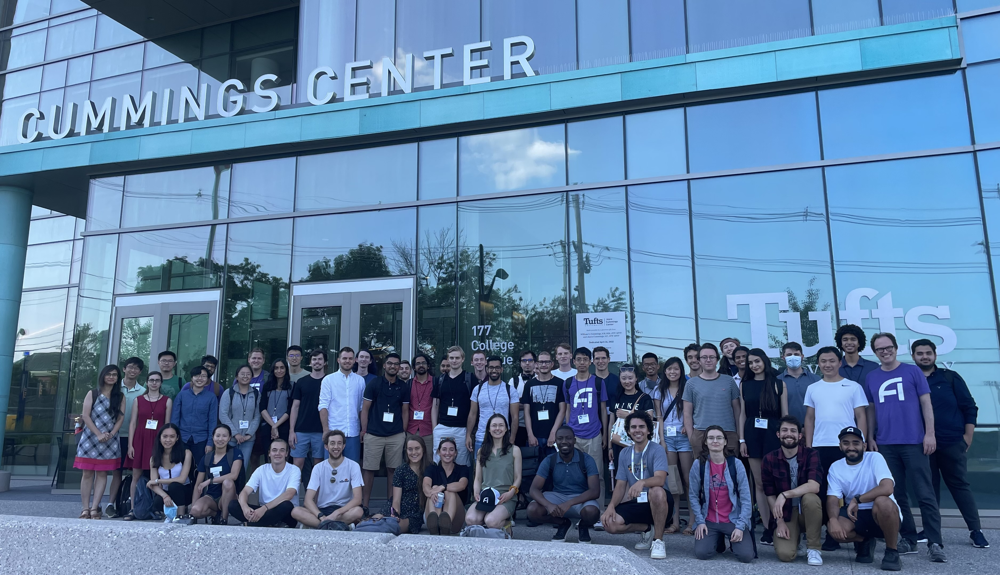
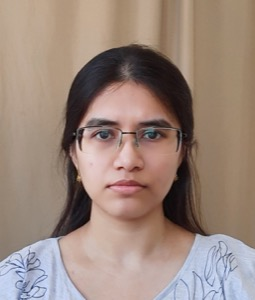
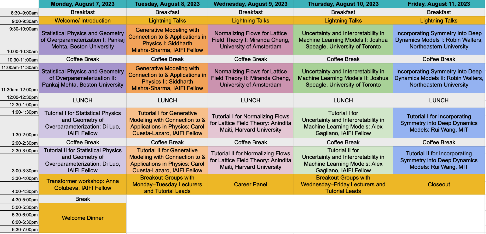

 

# Summer School 2023

 

The mission of the IAIFI PhD Summer School is to leverage the expertise of IAIFI researchers, affiliates, and partners toward promoting education and workforce development. 

* **August 7–11, 2023**
* **Northeastern University, Interdisciplinary Science and Engineering Complex**
* **Applications for the 2023 Summer School are now closed** 

 

[Agenda](#agenda){:.button.button--outline-primary.button--pill.button--lg} [Lecturers](#lecturers){:.button.button--outline-primary.button--pill.button--lg} [Tutorial Leads](#tutorial-leads){:.button.button--outline-primary.button--pill.button--lg}[Accommodations](#accommodations){:.button.button--outline-primary.button--pill.button--lg} [Costs](#costs){:.button.button--outline-primary.button--pill.button--lg} [FAQ](#faq){:.button.button--outline-primary.button--pill.button--lg} [Past Schools](/past-summer-schools.html){:.button.button--outline-primary.button--pill.button--lg}

## About 
The Institute for Artificial Intelligence and Fundamental Interactions (IAIFI) is enabling physics discoveries and advancing foundational AI through the development of novel AI approaches that incorporate first principles, best practices, and domain knowledge from fundamental physics. The Summer School will include lectures and events that exemplify ab initio AI, illustrate interdisciplinary research at the intersection AI and Physics, and encourage diverse global networking. Hands-on code-based tutorials that build on foundational lecture materials help students put theory into practice.

## Apply
**Registration for the 2023 Summer School is now closed**. 

<!--
**Applications are due April 9, 2023.** You you will be notified of your registration status by April 17, 2023.
-->

<!--
[Apply to IAIFI Summer School](https://app.smartsheet.com/b/form/7d51a61adcc046eb9a59ac5496b34c2c){:.button.button--outline-primary.button--pill.button--sm}
-->

## Accommodations
Students for the Summer School will have the option to reserve dorm rooms (expenses paid by IAIFI) at Boston University. Instructions for this will be provided to students upon acceptance.

[Boston University Housing](https://www.bu.edu/housing/undergrad-housing/stuvi/10buick/), 10 Buick St, Boston, MA 02215

### Costs
* There is no registration fee for the Summer School. Students for the Summer School are expected to cover the cost of travel and boarding. Boston University dorm rooms will be available for 5 nights at no cost for Summer School students who need them.
* Lunch each day, as well as coffee and snacks at breaks, will be provided daily during the Summer School, along with at least one dinner during the Summer School. 
* Students who wish to stay for the [IAIFI Summer Workshop](/summer-workshop.html) will be able to book the same rooms through the weekend and the Workshop if they choose (at their own expense). 

## Lecturers

  <!--
-->

     

         
         

         

         <a href="https://www.uva.nl/en/profile/c/h/c.n.cheng/c.n.cheng.html">Miranda Cheng</a>
         

         

    <small>
         <small>
         <em> Faculty of Science, University of Amsterdam </em> 
         </small>
         </small>
         

	

         <em> Differential Equations and Generative Models </em>  
         

         

       

     

         
         

         

         <a href="http://physics.bu.edu/~pankajm/">Pankaj Mehta</a>
         

         

         <small>
   <small>
         <em> Professor of Physics, Boston University </em>
         </small>
         </small>
         

	

         <em> Statistical Physics and Geometry of Overparameterization </em>  
         

         

       

     

         
         

         

         <a href="https://smsharma.io/">Siddharth Mishra-Sharma</a>
         

         

         <small>
   <small>
         <em> IAIFI Fellow </em> 
         </small>
         </small>
         

	

         <em> Generative Modeling with Connection to & Applications in Physics </em>  
         

         

       

     

         
         

         

         <a href="https://joshspeagle.com/">Joshua Speagle</a>
         

         

         <small>
   <small>
         <em> Assistant Professor of Astrostatistics, University of Toronto </em>  
         </small>
         </small>
         

	

         <em> Uncertainty and Interpretability in Machine Learning Models </em>
         

         

       

     

         
         

         

         <a href="https://www.khoury.northeastern.edu/people/robin-walters/">Robin Walters</a>
         

         

         <small>
   <small>
         <em> Assistant Professor, Khoury College of Computer Sciences, Northeastern University </em> 
         </small>
         </small>  
         

	

         <em> Incorporating Symmetry into Deep Dynamics Models </em> 
         

         

       

  <!--
  

  -->

 

## Tutorial Leads

  <!--
-->

     

         
         

         

         <a href="https://iaifi.org/current-fellows.html#carolina-cuesta">Carolina Cuesta-Lazaro</a>
         

         

         <small>
   <small>
         <em> IAIFI Fellow </em>  
         </small>
         </small>
         

	

         <em> Tutorial lead for Siddharth Mishra-Sharma </em>  
         

         

       

     

         
         

         

         <a href="https://alexandergagliano.github.io">Alexander Gagliano</a>
         

         

         <small>
   <small>
         <em> IAIFI Fellow </em>  
         </small>
         </small>
         

	

         <em> Tutorial lead for Joshua Speagle </em>  
         

       

       

     

         
         

         

         <a href="https://iaifi.org/current-fellows.html#di-luo">Di Luo</a>
         

         

         <small>
   <small>
         <em> IAIFI Fellow </em>  
         </small>
         </small>
         

	

         <em> Tutorial lead for Pankaj Mehta </em>  
         

         

       

     

         
         

         

         <a href="https://aninditamaiti.github.io">Anindita Maiti</a>
         

         

         <small>
   <small>
         <em> Postdoctoral Fellow, Harvard </em>  
         </small>
         </small>
         

	

         <em> Tutorial lead for Miranda Cheng </em>  
         

         

       

     

         
         

         

         <a href="https://rui1521.github.io/online-cv/">Rui (Ray) Wang</a>
         

         

         <small>
   <small>
         <em> Postdoctoral Researcher, MIT </em>  
         </small>
         </small>
         

	

         <em> Tutorial lead for Robin Walters </em>  
         

         

       

 
  <!--
  

  -->

## Agenda

 

### Monday, August 7, 2023

**9:00–9:30 am ET**

Welcome/Introduction

**9:30 am–12:00 pm ET**

Lecture 1: Statistical Physics and Geometry of Overparameterization, Pankaj Mehta 

Abstract

<em>Modern machine learning often employs overparameterized statistical models with many more parameters than training data points. In this talk, I will review recent work from our group on such models, emphasizing intuitions centered on the bias-variance tradeoff and a new geoemetric picture for overparameterized regression.</em>

**12:00–1:00 pm ET**

Lunch 

**1:00–3:30 pm ET**

Tutorial 1: Statistical Physics and Geometry of Overparameterization, Di Luo

**3:30–4:30 pm ET**

Transformer Workshop, Anna Golubeva (Optional)

**5:00–7:00 pm ET**

Welcome Dinner

### Tuesday, August 8, 2023

**9:00–9:30 am ET**

Lightning Talks

**9:30 am–12:00 pm ET**

Lecture 2: Generative modeling, with connection to and applications in physics, Siddharth Mishra-Sharma

Abstract

<em>I will give a pedagogical tour of several popular generative modeling algorithms including variational autoencoders, normalizing flows, and diffusion models, emphasizing connections to physics where appropriate. The approach will be a conceptual and unifying one, highlighting relationships between different methods and formulations, as well as connections to neighboring concepts like neural compression and latent-variable modeling.</em>

 

**12:00–1:00 pm ET**

Lunch 

**1:00–3:30 pm ET**

Tutorial 2: Generative modeling, with connection to and applications in physics, Carolina Cuesta-Lazaro

**3:30–4:30 pm ET**

Breakout Sessions with Days 1 and 2 Lecturers and Tutorial Leads (Optional)

### Wednesday, August 9, 2023

**9:00–9:30 am ET**

Lightning Talks

**9:30 am–12:00 pm ET**

Lecture 3: Differential Equations and Generative Models, Miranda Cheng

Abstract

<em>In these lectures I will discuss the ways in which different types of differential equations are employed in generative modeling. In particular, I will review how neural ODEs provide a method to implement normalizing flows. If time permits, I will also discuss how stochastic differential equations dictate the generation process in score-based diffusion models.</em>

**12:00–1:00 pm ET**

Lunch 

**1:00–3:30 pm ET**

Tutorial 3: Differential Equations and Generative Models, Anindita Maiti

**3:30–4:30 pm ET**

Career Panel, Panelists TBA (Optional)

### Thursday, August 10, 2023

**9:00–9:30 am ET**

Lightning Talks

**9:30 am–12:00 pm ET**

Lecture 4: Uncertainty and Interpretability in Machine Learning Models, Joshua Speagle

Abstract

<em>In science, we are often concerned with not just whether our ML model performs well, but on understanding how robust our results are, how to interpret them, and what we might be learning, especially in the presence of observational uncertainties. I will provide an overview of various approaches to help address these challenges in both specific and general settings.</em>

 

**12:00–1:00 pm ET**

Lunch 

**1:00–3:30 pm ET**

Tutorial 4: Uncertainty and Interpretability in Machine Learning Models, Alex Gagliano

**3:30–4:30 pm ET**

Breakout Sessions with Days 3, 4, and 5 Lecturers and Tutorial Leads (Optional)

### Friday, August 11, 2023

**9:00–9:30 am ET**

Lightning Talks

**9:30 am–12:00 pm ET**

Lecture 5: Incorporating Symmetry into Deep Dynamics Models, Robin Walters

Abstract
    
<em>Given a mathematical model of a dynamical system, we can extract the relevant symmetries and use them to build equivariant neural networks constrained by these symmetries. This results in better generalization and physical fidelity.  In these lectures, we will learn how to follow this procedure for different types of systems such as fluid mechanics, radar modeling, and robotic manipulation and across different data modalities such as point clouds, images, and meshes.</em>

**12:00–1:00 pm ET**

Lunch 

**1:00–3:30 pm ET**

Tutorial 5: Incorporating Symmetry into Deep Dynamics Models, Rui Wang

**3:30–4:00 pm ET**

Closing

## 2023 Organizing Committee 
* Jim Halverson, Chair (Northeastern University)
* Shuchin Aeron (Tufts)
* Denis Boyda (IAIFI Fellow)
* Anna Golubeva (IAIFI Fellow)
* Ouail Kitouni (MIT)
* Nayantara Mudur (Harvard)
* Sneh Pandya (Northeastern)

## FAQ 
* *Who can apply to the Summer School?* Any PhD students or early career researchers working at the intersection of physics and AI may apply to the summer school. 
* *What is the cost to attend the Summer School?* There is no registration fee for the Summer School. Students for the Summer School are expected to cover the cost of travel and boarding.
* *Is there funding available to support my attendance at the Summer School?* IAIFI is covering the cost of the Summer School, including lunches and lodging for 5 nights. There is no support available for travel costs.
* *If I come to the Summer School, can I also attend the Workshop?* Yes! We encourage you to stay for the Workshop and you can stay in the dorms for both events if you choose. There is a 250 USD registration fee for the Workshop.
* *Will the recordings of the lectures be available?* We expect to share recordings of the lectures after the Summer School.
* *Will there be an option for virtual attendance?* Yes, there is an option for virtual attendance.

[Submit a question or comment](https://app.smartsheet.com/b/form/76c1d070d19d4688b65962c4ed190478){:.button.button--outline-primary.button--pill.button--sm}

Contact [iaifi@mit.edu](mailto:iaifi@mit.edu) with questions.
