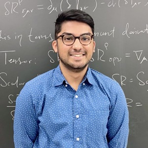
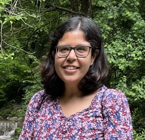
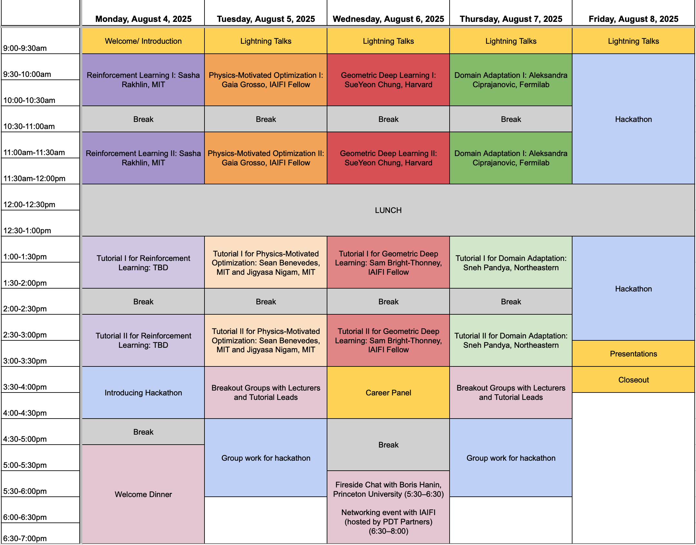
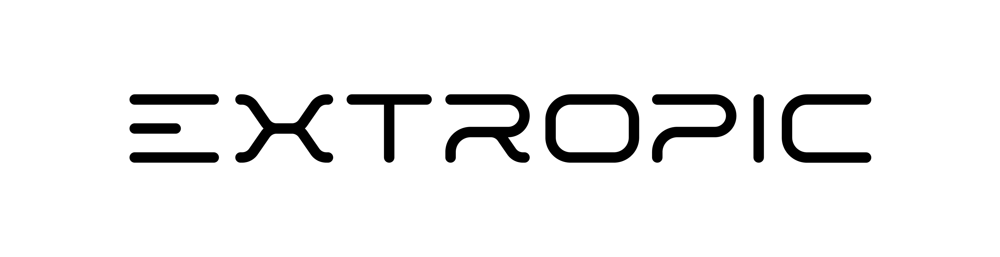

 

# Summer School 2025

 

The mission of the IAIFI PhD Summer School is to leverage the expertise of IAIFI researchers, affiliates, and partners toward promoting education and workforce development. 

* **August 4–8, 2025**
* **Harvard, Cambridge, MA**

The Summer School will be followed by the [IAIFI Summer Workshop](/summer-workshop), which is open to researchers of all career stages. 

   

<!--[Apply](https://app.smartsheet.com/b/form/e8dcb6c8564a45d5a61cb0ecafec2bd4){:.button.button--outline-primary.button--pill.button--lg}-->[Agenda](#agenda){:.button.button--outline-primary.button--pill.button--lg} [Lecturers](#lecturers){:.button.button--outline-primary.button--pill.button--lg} [Tutorial Leads](#tutorial-leads){:.button.button--outline-primary.button--pill.button--lg} [Accommodations](#accommodations){:.button.button--outline-primary.button--pill.button--lg} [Costs](#costs){:.button.button--outline-primary.button--pill.button--lg} [Sponsors](#financial-supporters){:.button.button--outline-primary.button--pill.button--lg} [FAQ](#faq){:.button.button--outline-primary.button--pill.button--lg} [Past Schools](/past-summer-schools.html){:.button.button--outline-primary.button--pill.button--lg}

## About 
The Institute for Artificial Intelligence and Fundamental Interactions (IAIFI) is enabling physics discoveries and advancing foundational AI through the development of novel AI approaches that incorporate first principles, best practices, and domain knowledge from fundamental physics. The Summer School will include lectures and events that illustrate interdisciplinary research at the intersection AI and Physics, and encourage global networking. Hands-on code-based tutorials that build on foundational lecture materials help students put theory into practice, and a hackathon project provides an opportunity for students to collaborate and apply what they've learned.

## Apply

**Applications are now closed for the 2025 IAIFI Summer School. [Subscribe to our mailing list](http://mailman.mit.edu/mailman/listinfo/iaifi-news) to receive updates on future opportunities.**

## Accommodations
Students for the Summer School have the option to reserve dorm rooms at Harvard University. IAIFI will reimburse the cost of 5 nights in the dorms after the Summer School, contingent upon attendance. Instructions for this will be provided to students upon acceptance.

## Costs
* There is no registration fee for the Summer School. Costs of dorm accommodations will be reimbursed by IAIFI, contingent upon attendance. Students for the Summer School are expected to cover the cost of travel. 
* Lunch each day, as well as coffee and snacks at breaks, will be provided during the Summer School, along with at least one dinner during the Summer School. 
* Students who wish to stay for the [IAIFI Summer Workshop](/summer-workshop.html) will be able to book the same rooms through the weekend and the Workshop if they choose (at their own expense). 

## Lecturers

### Topic: Reinforcement Learning

Lecturer: [Sasha Rakhlin](https://www.mit.edu/~rakhlin/), Professor, MIT

### Topic: Domain Shift Problem: Building Robust AI Models with Domain Adaptation

Lecturer: [Aleksandra Ćiprajanović](https://aleksandraciprijanovic.wordpress.com), Wilson Fellow Associate Scientist, Fermilab

### Topic: Physics-Motivated Optimization

Lecturer: [Gaia Grosso](https://iaifi.org/current-fellows.html#gaia-grosso), IAIFI Fellow

### Topic: Representation/Manifold Learning: Geometric Deep Learning

Lecturer: [SueYeon Chung](https://as.nyu.edu/faculty/sueyeon-chung.html), Assistant Professor of Neural Science, NYU

## Tutorial Leads

### Topic: Reinforcement Learning

Tutorial Lead: Margalit Glasgow, Postdoc, MIT

### Topic: Robust/Interpretable AI: Domain Adaptation

Tutorial Lead: Sneh Pandya, PhD Student, Northeastern/IAIFI

  
### Topic: Physics-Motivated Optimization: Simulation Intelligence

Tutorial Lead: Sean Benevedes, PhD Student, MIT and Jigyasa Nigam, Postdoc, MIT

### Topic: Representation/Manifold Learning: Geometric Deep Learning

Tutorial Lead: Sam Bright-Thonney, IAIFI Fellow

## Agenda

*Agenda is subject to change.*

### Monday, August 4, 2025

**9:00–9:30 am ET**

Welcome/Introduction

**9:30 am–12:00 pm ET**

Lecture 1: Elements of Interactive Decision Making (Sasha Rakhlin, MIT)

*Machine learning methods are increasingly deployed in interactive
environments, ranging from dynamic treatment strategies in medicine to
fine-tuning of LLMs using reinforcement learning. In these settings,
the learning agent interacts with the environment to collect data and
necessarily faces an exploration-exploitation dilemma.\\
\\
In this lecture, we’ll begin with multi-armed bandits, progressing
through structured and contextual bandits. We’ll then move on to
reinforcement learning and broader decision-making frameworks,
outlining the key algorithmic approaches and statistical principles
that underpin each setting. Our goal is to develop both a rigorous
understanding of the learning guarantees and a toolbox of fundamental
algorithms.*

Resources: 
* [Foundations of Reinforcement Learning and Interactive Decision Making](https://arxiv.org/abs/2312.16730)

**12:00–1:00 pm ET**

Lunch 

**1:00–3:30 pm ET**

Tutorial 1: Elements of Interactive Decision Making (Margalit Glasgow)

**3:30–4:30 pm ET**

Hackathon Introduction

**5:00–5:30 pm ET**

Break

**5:30–7:30 pm ET**

Welcome Dinner

### Tuesday, August 4, 2025

**9:00–9:30 am ET**

Lightning Talks

**9:30 am–12:00 pm ET**

Lecture 2: Physics-Guided Optimizations: Inform and Inspire AI Models with Physics Principles (Gaia Grosso, IAIFI Fellow)

*This lecture presents key concepts and techniques for designing machine learning models both informed by and inspired by physics principles. In the first part, we explore ways to inform AI models about physics constraints and data properties. We examine the highly structured nature of data in the physical sciences—such as images, point clouds, and time series—and discuss how their geometric and physical properties shape effective machine learning approaches. We then cover practical strategies for incorporating physical constraints through loss functions, regularization, and inductive biases. In the second part, we highlight how physical principles can inspire the design of optimization methods and AI architectures, introducing concepts like annealing, diffusion, entropy, and energy-based models, and showing examples of their growing role in modern machine learning.*

Resources: 
* [An Introduction to Physics-Guided Deep Learning](https://www.pnas.org/doi/10.1073/pnas.2311808121)
* [Energy Based Models](https://www.researchgate.net/profile/Marcaurelio-Ranzato/publication/216792742_A_Tutorial_on_Energy-Based_Learning/links/0912f50c6862425435000000/A-Tutorial-on-Energy-Based-Learning.pdf)
* [The Role of Momentum in ML Optimization](https://distill.pub/2017/momentum/)
* [Entropy Regularization](https://www.researchgate.net/profile/Y-Bengio/publication/237619703_9_Entropy_Regularization/links/0f3175320aaecbde17000000/9-Entropy-Regularization.pdf)
* [Hamiltonian Neural Networks](https://proceedings.neurips.cc/paper/2019/file/26cd8ecadce0d4efd6cc8a8725cbd1f8-Paper.pdf)
* [Physics Informed Neural Networks](https://arxiv.org/pdf/2105.09506)
* [New Frontiers for Hopfield Networks](https://www.nature.com/articles/s42254-023-00595-y)
* [Diffusion Models](https://arxiv.org/pdf/2209.00796)

**12:00–1:00 pm ET**

Lunch 

**1:00–3:30 pm ET**

Tutorial 2: Physics-guided Optimizations: Inform and Inspire AI Models with Physics Principles (Sean Benevedes, MIT and Jigyasa Nigam, MIT)

**3:30–4:30 pm ET**

Breakout Sessions with Lecturers and Tutorial Leads 

**4:30–6:00 pm ET**

Group work for hackathon

### Wednesday, August 6, 2025

**9:00–9:30 am ET**

Lightning Talks

**9:30 am–12:00 pm ET**

Lecture 3: Computing with Neural Manifolds: 
A Multi-Scale Framework for Understanding Biological and Artificial Neural Networks (SueYeon Chung, Harvard)

*Recent breakthroughs in experimental neuroscience and machine learning have opened new frontiers in understanding the computational principles governing neural circuits and artificial neural networks (ANNs). Both biological and artificial systems exhibit an astonishing degree of orchestrated information processing capabilities across multiple scales - from the microscopic responses of individual neurons to the emergent macroscopic phenomena of cognition and task functions. At the mesoscopic scale, the structures of neuron population activities manifest themselves as neural representations. Neural computation can be viewed as a series of transformations of these representations through various processing stages of the brain. The primary focus of my lab's research is to develop theories of neural representations that describe the principles of neural coding and, importantly, capture the complex structure of real data from both biological and artificial systems.\\
\\
In this lecture, I will present three related approaches that leverage techniques from statistical physics, machine learning, and geometry to study the multi-scale nature of neural computation. First, I will introduce new statistical mechanical theories that connect geometric structures that arise from neural responses (i.e., neural manifolds) to the efficiency of neural representations in implementing a task. Second, I will employ these theories to analyze how these representations evolve across scales, shaped by the properties of single neurons and the transformations across distinct brain regions. Finally, I will show how these insights extend efficient coding principles beyond early sensory stages, linking representational geometry to efficient task implementations. This framework not only help interpret and compare models of brain data but also offers a principled approach to designing ANN models for higher-level vision. This perspective opens new opportunities for using neuroscience-inspired principles to guide the development of intelligent systems.*

Resources: 
* [Chung, S., Lee, D.D. and Sompolinsky, H., 2018. Classification and geometry of general perceptual manifolds. Physical Review X, 8(3), p.031003.](https://arxiv.org/abs/1710.06487)
* [Cohen, U., Chung, S., Lee, D.D. and Sompolinsky, H., 2020. Separability and geometry of object manifolds in deep neural networks. Nature communications, 11(1), p.746.](https://www.nature.com/articles/s41467-020-14578-5)
* [Chung, S. and Abbott, L.F., 2021. Neural population geometry: An approach for understanding biological and artificial neural networks. Current opinion in neurobiology, 70, pp.137-144.](https://arxiv.org/abs/2104.07059)
* [Yerxa, T., Kuang, Y., Simoncelli, E. and Chung, S., 2023. Learning efficient coding of natural images with maximum manifold capacity representations. Advances in Neural Information Processing Systems, 36, pp.24103-24128.](https://arxiv.org/abs/2303.03307)

**12:00–1:00 pm ET**

Lunch 

**1:00–3:30 pm ET**

Tutorial 3: Computing with Neural Manifolds: 
A Multi-Scale Framework for Understanding Biological and Artificial Neural Networks (Sam Bright-Thonney, IAIFI Fellow)

**3:30–4:30 pm ET**

Career Panel
* Aleksandra Ciprijanovic, Wilson Fellow Associate Scientist, Fermilab
* Gaia Grosso, IAIFI Fellow
* Trevor McCourt, CTO, Extropic
* Matthew Rispoli, Quantitative Researcher, PDT Partners
* Nashwan Sabti, Senior Research Engineer, Soroco

**4:30–5:30 pm ET**

Break

**5:30–6:30 pm ET**

Presentation by Boris Hanin (Princeton University) sponsored by PDT Partners

**6:30–8:00 pm ET**

Networking event with IAIFI sponsored by PDT Partners

### Thursday, August 7, 2025

**9:00–9:30 am ET**

Lightning Talks

**9:30 am–12:00 pm ET**

Lecture 4: Domain Shift Problem: Building Robust AI Models with Domain Adaptation (Aleksandra Ciprajanovic, Fermilab)

*Artificial Intelligence (AI) is revolutionizing physics research—from probing the large-scale structure of the Universe to modeling subatomic interactions and fundamental forces. Yet, a major challenge persists: AI models trained on simulations or old experiment / astronomical survey often perform poorly when applied to new data—exposing issues of dataset (domain) shift, model robustness, and uncertainty in predictions. This summer school session will introduce students to common challenges in applying AI across domains and present solutions based on domain adaptation—a set of techniques designed to improve model generalization under domain shift. We will cover foundational ideas, practical strategies, and current research frontiers in this area. Through examples in astrophysics, we'll explore how domain adaptation can help bridge the gap between synthetic and real-world data, improve trust in model outputs, and advance scientific discovery. The concepts discussed are broadly applicable across physics and other scientific disciplines, making this a valuable topic for anyone interested in building robust, transferable AI models for science.*

Resources: 
* [A Brief Review of Domain Adaptation](https://arxiv.org/pdf/2010.03978v1)
* [Deep Visual Domain Adaptation: A Survey](https://arxiv.org/pdf/1802.03601)

**12:00–1:00 pm ET**

Lunch 

**1:00–3:30 pm ET**

Tutorial 4: Domain Shift Problem: Building Robust AI Models with Domain Adaptation (Sneh Pandya, Northeastern)

**3:30–4:30 pm ET**

Breakout Sessions with Lecturers and Tutorial Leads

**4:30–5:30 pm ET**

Group work for hackathon

### Friday, August 9, 2024

**9:00–9:30 am ET**

Lightning Talks

**9:30 am–12:00 pm ET**

Hackathon

Projects
    
<em>Project details to come.</em>

**12:00–1:00 pm ET**

Lunch 

**1:00–3:00 pm ET**

Hackathon

Projects
    
<em>Project details to come.</em>

**3:00–3:45 pm ET**

Hackathon presentations

**3:45–4:00 pm ET**

Closing

## Financial Supporters
The Summer School is funded primarily by support from the National Science Foundation under Cooperative Agreement PHY-2019786. Computing resources are provided by the NSF ACCESS program.

We extend a sincere thank you to the following financial supporters of this year's IAIFI Summer School:

    

If you are interested in supporting the 2025 IAIFI Summer School, email [iaifi-summer@mit.edu](mailto:iaifi-summer@mit.edu)

## 2025 Organizing Committee 
* Fabian Ruehle, Chair (Northeastern University)
* Bill Freeman (MIT) 
* Cora Dvorkin (Harvard)
* Thomas Harvey (IAIFI Fellow)
* Sam Bright-Thonney (IAIFI Fellow)
* Sneh Pandya (Northeastern)
* Yidi Qi (Northeastern)
* Manos Theodosis (Harvard)
* Marshall Taylor (MIT)
* Marisa LaFleur (IAIFI Project Manager)
* Thomas Bradford (IAIFI Project Coordinator)

## FAQ 
* *Who can apply to the Summer School?* Any PhD students or early career researchers working at the intersection of physics and AI may apply to the summer school. 
* *What is the cost to attend the Summer School?* There is no registration fee for the Summer School. Students for the Summer School are expected to cover the cost of travel.
* *Is there funding available to support my attendance at the Summer School?* IAIFI is covering the cost of the Summer School, including lunch each day. There is no support available for travel costs.
* *If I come to the Summer School, can I also attend the Workshop?* Yes! We encourage you to stay for the [IAIFI Summer Workshop](/summer-workshop) and you can stay in the dorms for both events if you choose (at your own expense). Information about the Summer Workshop will be provided in early 2025. 
* *Will the recordings of the lectures be available?* We expect to share recordings of the lectures after the Summer School.
* *Will there be an option for virtual attendance?* Yes, there is an option for virtual attendance.
* *How can I book a dorm for the IAIFI Summer School?* Information will be shared with accepted students about booking the dorms. 
* *What if I need childcare in order to attend the Summer School?* We are prepared to work with attendees to help coordinate child care as needed. Please contact [iaifi-summer@mit.edu](mailto:iaifi-summer@mit.edu) and/or indicate it in your application if you would like to discuss.

[Submit a question or comment](https://app.smartsheet.com/b/form/76c1d070d19d4688b65962c4ed190478){:.button.button--outline-primary.button--pill.button--sm}
