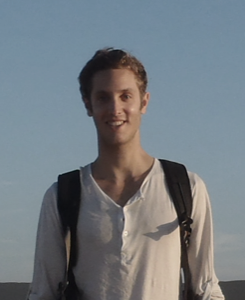
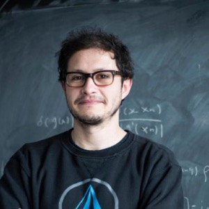

 
* [Summer School](#summer-school) 
  * [Summer School Agenda](#summer-school-agenda)
  * [Lecturers](#lecturers)
  * [Summer School Registration](#summer-school-registration)
  * [Student Accommodations](#student-accommodations)
  * [Costs](#costs)
  * [Financial Supporters](#financial-supporters)
* [Workshop](#workshop)
  * [Workshop Agenda](#workshop-agenda)
  * [Plenary Speakers](#plenary-speakers)
  * [Workshop Registration](#workshop-registration)
  * [Accommodations](#accommodations)
* [FAQ](#faq)
* [Organizing Committee](#organizing-committee)

The first annual IAIFI PhD Summer School will be held at Tufts University **August 1—August 5, 2022**, followed by the IAIFI Summer Workshop **August 8—August 9, 2022**. 

Registration for the Summer School and Summer Workshop is now closed. Email [iaifi@mit.edu](mailto:iaifi@mit.edu) with any questions. 

## Summer School
The mission of the IAIFI PhD Summer School is to leverage the expertise of IAIFI researchers, affiliates, and partners toward promoting education and workforce development. The Summer School will include lectures and events that exemplify ab initio AI, illustrate interdisciplinary research at the intersection AI and Physics, and encourage diverse global networking. Hands-on code-based tutorials that build on foundational lecture materials will help students put theory into practice.

### Summer School Agenda
 

[View the detailed agenda for the IAIFI Summer School](https://iaifi.org/summer-school-agenda)

### Lecturers

  <!--
-->
     

         
         

         

         <a href="https://yasamanb.github.io">Yasaman Bahri</a>
         

         

         <em> Research Scientist, Google Research (Brain Team) </em>  
         

         

       

     

         
         

         

         <a href="https://tacocohen.wordpress.com">Taco Cohen</a>
         

         

         <em> Research Scientist, Qualcomm Research Netherlands </em>  
         

         

       

     

         
         

         

         <a href="https://krippendorflab.github.io/">Sven Krippendorf</a>
         

         

         <em> Senior Researcher, Mathematical Physics and String Theory, Ludwig-Maximilians Universität </em>  
         

         

       

    

         
         

         

         <a href="https://vectorinstitute.ai/team/juan-felipe-carrasquilla/">Juan Carrasquilla</a>
         

         

         <em> Faculty Member, Vector Institute; Adjunct Assistant Professor, University of Waterloo </em>  
         

         

       

    

         
         

         

         <a href="https://www-physics.ucsd.edu/Directory/Person/552">Javier Duarte</a>
         

         

         <em> Assistant Professor, University of California, San Diego </em>  
         

         

       

  <!--
  

  -->

 

### Summer School Registration
**Registration for the Summer School is now closed**. You you will be notified of your registration status by May 2, 2022.

### Student Accommodations
Students for the Summer School may reserve dorm rooms at Tufts University (with the option of single or double room). [Reserve a dorm room](https://web.cvent.com/event/eb856c65-5512-4468-9482-d101b7e13843/summary)

Alternative suggestions for accommodations are listed in the [Workshop Accommodations](#accommodations) section below.

### Costs
* There is no registration fee for the Summer School. Students for the Summer School are expected to cover the cost of travel and boarding in Tufts dorm rooms, which range from 78 USD to 109 USD per night depending on the accommodations. 
* Breakfast and lunch (through the Tufts dining hall), as well as coffee at breaks, will be provided daily during the Summer School and Workshop (except over the weekend), along with at least one dinner during the Summer School and a Workshop dinner. 
* Students who wish to stay for the Workshop will be able to book the same rooms through the weekend and the Workshop if they choose and the Workshop registration fee will be waived for students participating in the Summer School. 

### Financial Supporters 
We extend a sincere thank you to the following financial supporters of the first IAIFI Summer School:

  

## Workshop 
The IAIFI Summer Workshop will bring together researchers from across Physics and AI for two days of plenary talks, poster sessions, and networking to promote research at the intersection of Physics and AI. The Workshop will be hybrid with both in-person and virtual attendance options. The full workshop program will be released in May 2022.

### Workshop Agenda

 

[View the detailed agenda for the IAIFI Summer Workshop](https://iaifi.org/workshop-agenda)

### Plenary Speakers
**IAIFI Senior Investigators/Affiliates in bold**

* [Siamak Ravanbakhsh](https://www.siamak.page), Assistant Professor, School of Computer Science, McGill University
* [Greg Yang](https://www.microsoft.com/en-us/research/people/gregyang/), Senior Researcher, Microsoft Research
* **[Phil Harris](https://physics.mit.edu/faculty/philip-harris/)**, Assistant Professor of Physics, MIT
* [Kazuhiro Terao](https://www.codingkazu.com), Staff Scientist, Stanford University
* [Claudius Krause](https://claudius-krause.gitlab.io), Postdoctoral Associate, Rutgers University
* **[Fabian Ruehle](https://cos.northeastern.edu/people/fabian-ruehle/)**, Assistant Professor, Northeastern University
* [Yi-Zhuang You](https://physics.ucsd.edu/Directory/Person/536), Assistant Professor, University of California, San Diego
* [Jennifer Ngadiuba](https://inspirehep.net/authors/1244433), Wilson Fellow, Fermilab
* **[Shuchin Aeron](http://www.ece.tufts.edu/~shuchin/)**, Associate Professor, Tufts University
* **[Cora Dvorkin](https://dvorkin.physics.harvard.edu)**, Associate Professor, Harvard University
* [Sébastien Racanière](https://scholar.google.com/citations?user=o-h0vrQAAAAJ&hl=en), Staff Research Engineer, DeepMind
* [Marco Cavaglià](https://physics.mst.edu/facultystaffandfacilities/faculty/marcocavaglia/), Professor, Missouri S&T

### Workshop Registration
Registration for the Summer Workshop is now open. The registration fee for in-person attendance is 200 USD and includes breakfast, lunch, and coffee breaks for both days, as well as a dinner on the first night. 
* [Register for in-person attendance](https://iaifi-workshop-reg-fee.mit.edu/registration)
* [Register for virtual attendance](https://forms.gle/XWDgpKP6GyNn7sNh7)

**Note: If you are an IAIFI Senior Investigator and would like to use your IAIFI funds to cover registration for you or your group, [contact iaifi@mit.edu](mailto:iaifi@mit.edu). If you are an IAIFI Junior Investigator, speak to the IAIFI Senior Investigator you work with to ask about funding.**

### Accommodations
The following accommodation options are available for workshop attendees:
* Guaranteed rates have been secured at the following hotels using the code AIPHYS **(must call to book)**
    * [Porter Square Hotel](https://www.theportersquarehotel.com) - Petite Double Twin: 195 USD/night; Deluxe Double Twin: 209 USD/night; Deluxe Queen: 219 USD/night; Queen Suite: 235 USD/night; Call 617-499-3399
    * [Hotel 1868](https://www.hotel1868.com) - 199 USD/night; Call 617-499-2998
* Tufts dorm rooms may be booked at rates ranging from 78 USD to 109 USD per night: [Reserve a dorm room](https://web.cvent.com/event/eb856c65-5512-4468-9482-d101b7e13843/summary)
* Additional area hotels: 
    * [Fairfield Inn and Suites Medford](https://www.marriott.com/en-us/hotels/bosfo-fairfield-boston-medford/overview/)
    * [Fairfield Inn and Suites Cambridge](https://www.marriott.com/en-us/hotels/bosbg-fairfield-inn-and-suites-boston-cambridge/overview/)
    * [AC Hotel Boston North (Medford)](https://www.marriott.com/en-us/hotels/bosac-ac-hotel-boston-north/overview/)
    * [Hyatt Place Boston/Medford](https://www.hyatt.com/en-US/hotel/massachusetts/hyatt-place-boston-medford/boszm?src=adm_sem_crp_chico_crp_ppc_NAM-UnitedStates-MA-Medford-HP-BOSZM_google_Evergreen2022_e_hyatt%20place%20medford&gclid=CjwKCAjw14uVBhBEEiwAaufYx3w1Ux20K2-qc4tJs7sByDBFsvUL9w5jZu5cEXFa7JRttLPb6QDbYxoCnSIQAvD_BwE)

## FAQ 
* *Who can apply to the Summer School?* Any PhD students or early career researchers working at the intersection of physics and AI may apply to the summer school. 
* *What is the cost to attend the Summer School?* There is no registration fee for the Summer School. Students for the Summer School are expected to cover the cost of travel and boarding in Tufts dorm rooms, which range from 78 USD to 109 USD per night depending on the accommodations. Breakfast and lunch will be provided through Tufts dining hall.
* *Is there funding available to support my attendance at the Summer School?* IAIFI is covering the cost of the Summer School other than travel and lodging. Limited, need-based support may be available for attendees who are unable to cover the costs of travel and lodging and will be addressed on a case-by-case basis. 
* *If I come to the Summer School, can I also attend the Workshop?* Yes! We encourage you to stay for the Workshop and will cover the cost of your registration if you attend both the Summer School and Workshop in person. 

## Organizing Committee
* Jim Halverson, Chair (Northeastern University)
* Tess Smidt (MIT)
* Anna Golubeva (IAIFI Fellow)
* Dylan Rankin (MIT)
* Jeffrey Lazar (Harvard)
* Peter Lu (MIT)

Contact [iaifi@mit.edu](mailto:iaifi@mit.edu) with questions.
