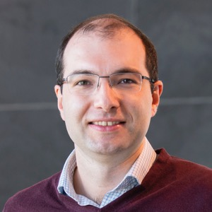
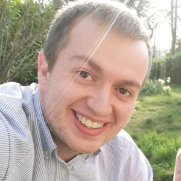
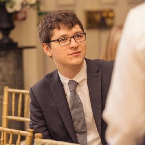
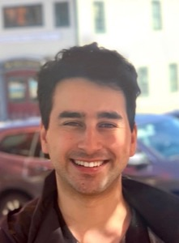
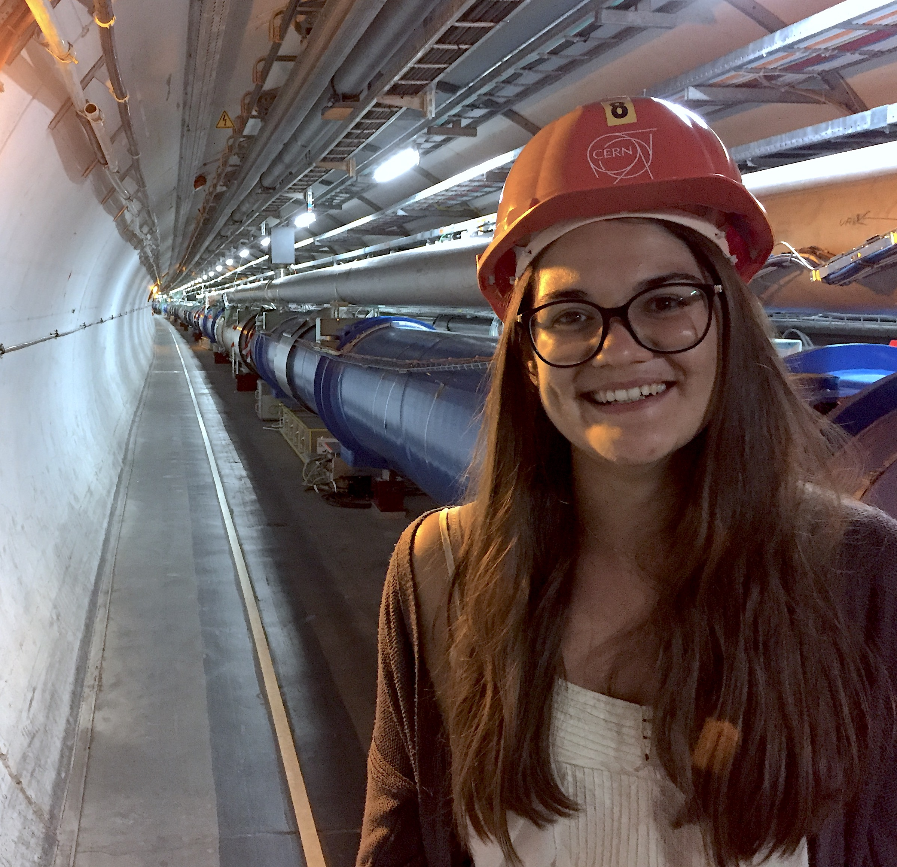
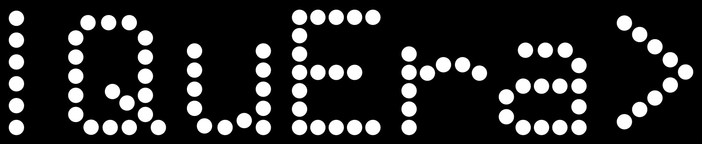

 

# Summer School 2024

 

The mission of the IAIFI PhD Summer School is to leverage the expertise of IAIFI researchers, affiliates, and partners toward promoting education and workforce development. 

* **August 5–9, 2024**
* **MIT**

[Apply](https://app.smartsheet.com/b/form/4d72caf22cd74ce7b771a91ef25dde22){:.button.button--outline-primary.button--pill.button--lg}[Agenda](#agenda){:.button.button--outline-primary.button--pill.button--lg} [Lecturers](#lecturers){:.button.button--outline-primary.button--pill.button--lg} [Tutorial Leads](#tutorial-leads){:.button.button--outline-primary.button--pill.button--lg}[Accommodations](#accommodations){:.button.button--outline-primary.button--pill.button--lg} [Costs](#costs){:.button.button--outline-primary.button--pill.button--lg} [Sponsors](#financial-supporters){:.button.button--outline-primary.button--pill.button--lg} [FAQ](#faq){:.button.button--outline-primary.button--pill.button--lg} [Past Schools](/past-summer-schools.html){:.button.button--outline-primary.button--pill.button--lg}

## About 
The Institute for Artificial Intelligence and Fundamental Interactions (IAIFI) is enabling physics discoveries and advancing foundational AI through the development of novel AI approaches that incorporate first principles, best practices, and domain knowledge from fundamental physics. The Summer School will include lectures and events that AI + Physics, illustrate interdisciplinary research at the intersection AI and Physics, and encourage diverse global networking. Hands-on code-based tutorials that build on foundational lecture materials help students put theory into practice.

## Apply

**Applications are closed for the 2024 IAIFI Summer School.**

## Accommodations
Students for the Summer School have the option to reserve dorm rooms (at their own expense) at Boston University. Instructions for this will be provided to students upon acceptance.

### Costs
* There is no registration fee for the Summer School. Students for the Summer School are expected to cover the cost of travel and boarding. 
* Lunch each day, as well as coffee and snacks at breaks, will be provided during the Summer School, along with at least one dinner during the Summer School. 
* Students who wish to stay for the [IAIFI Summer Workshop](/summer-workshop.html) will be able to book the same rooms through the weekend and the Workshop if they choose (at their own expense). 

## Lecturers

### Topic: Representation/Manifold Learning

Lecturer: [Melanie Weber](http://melanie-weber.com), Assistant Professor of Applied Mathematics and of Computer Science, Harvard

### Topic: Uncertainty Quantification/Simulation-Based Inference

Lecturer: [Carol Cuesta-Lazaro](https://iaifi.org/current-fellows.html#carolina-cuesta), IAIFI Fellow

### Topic: Physics-Motivated Optimization

Lecturer: [Cengiz Pehlevan](https://pehlevan.seas.harvard.edu/people/cengiz-pehlevan), Assistant Professor of Applied Mathematics & Kempner Institute Associate Faculty, Harvard

### Topic: Generative Models

Lecturer: [Gilles Louppe](https://glouppe.github.io), Professor, University of Liège 

## Tutorial Leads

### Topic: Representation/Manifold Learning

Tutorial Lead: [Thomas Harvey](https://inspirehep.net/authors/1851078?ui-citation-summary=true), Incoming IAIFI Fellow

### Topic: Uncertainty Quantification/Simulation-Based Inference

Tutorial Lead: [Jessie Micallef](https://github.com/jessimic), IAIFI Fellow

### Topic: Physics-Motivated Optimization

Tutorial Lead: [Alex Atanasov](https://abatanasov.com), PhD Student, Harvard

### Topic: Generative Modeling

Tutorial Lead: [Gaia Grosso](https://iaifi.org/current-fellows.html#gaia-grosso), IAIFI Fellow

## Agenda
This agenda is subject to change. 

 

### Monday, August 5, 2024

**9:00–9:30 am ET**

Welcome/Introduction

**9:30 am–12:00 pm ET**

Lecture 1: Deep generative models: A latent variable model perspective, Gilles Louppe 

Abstract

<em>Abstract to come</em>

**12:00–1:00 pm ET**

Lunch 

**1:00–3:30 pm ET**

Tutorial 1: Deep generative models: A latent variable model perspective, Gaia Grosso

**3:30–4:30 pm ET**

Large-scale quantum reservoir learning with QuEra, Pedro Lopes and Milan Kornjača

Abstract

<em>Quantum machine learning has gained considerable attention as quantum technology advances, presenting a promising approach for efficiently learning complex data patterns. Despite this promise, most contemporary quantum methods require significant resources for variational parameter optimization and face issues with vanishing gradients, leading to experiments that are either limited in scale or lack potential for quantum advantage. To address this, we develop a general-purpose, gradient-free, and scalable quantum reservoir learning algorithm that harnesses the quantum dynamics of QuEra's Aquila to process data. Quantum reservoir learning on Aquila, achieves competitive performance across various categories of machine learning tasks, including binary and multi-class classification, as well as time series prediction. The QuEra team performed successful quantum machine leaning demonstration on up to 108 qubits, demonstrating the largest quantum machine learning experiment to date. We also observe comparative quantum kernel advantage in learning tasks by constructing synthetic datasets based on the geometric differences between generated quantum and classical data kernels. In this workshop we will cover the general methods utilized to run quantum reservoir computing in QuEra's neutral-atom analog hardware, providing an introduction for users to pursue new research directions.</em>

**5:00–7:00 pm ET**

Welcome Dinner

### Tuesday, August 6, 2024

**9:00–9:30 am ET**

Lightning Talks

**9:30 am–12:00 pm ET**

Lecture 2: Geometric Machine Learning, Melanie Weber

Abstract

<em>Abstract to come</em>

 

**12:00–1:00 pm ET**

Lunch 

**1:00–3:30 pm ET**

Tutorial 2: Geometric Machine Learning, Thomas Harvey

**3:30–4:30 pm ET**

Breakout Sessions with Days 1 and 2 Lecturers and Tutorial Leads 

**4:30–6:00 pm ET**

Group work for hackathon

### Wednesday, August 7, 2024

**9:00–9:30 am ET**

Lightning Talks

**9:30 am–12:00 pm ET**

Lecture 3: Scaling and renormalization in high-dimensional regression, Cengiz Pehlevan

Abstract

<em>Abstract to come.</em>

**12:00–1:00 pm ET**

Lunch 

**1:00–3:30 pm ET**

Tutorial 3: Physics-motivated optimization: Scaling and renormalization in high-dimensional regression, Alex Atanasov

**3:30–4:30 pm ET**

Career Panel

* Moderator: Alex Gagliano, IAIFI Fellow

* Carol Cuesta-Lazaro, IAIFI Fellow

* Pedro Lopes, Quantum Advocate, QuEra Computing

* Gilles Louppe, Professor, University of Liège

* Cengiz Pehlevan, Assistant Professor of Applied Mathematics & Kempner Institute Associate Faculty, Harvard

* Partha Saha, Distinguished Engineer, Data and AI Platform, Visa

* Melanie Weber, Assistant Professor of Applied Mathematics and of Computer Science, Harvard

### Thursday, August 8, 2024

**4:30–5:00 pm ET**

Group work for hackathon

**5:00–7:00 pm ET**

Industry Seminar and Reception hosted by PDT Partners

Details

<em>Details to come.</em>

**9:00–9:30 am ET**

Lightning Talks

**9:30 am–12:00 pm ET**

Lecture 4: Uncertainty Quantification, Carol Cuesta-Lazaro

Abstract

<em>Abstract to come.</em>

 

**12:00–1:00 pm ET**

Lunch 

**1:00–3:30 pm ET**

Tutorial 4: Uncertainty Quantification, Jessie Micallef

**3:30–4:30 pm ET**

Breakout Sessions with Days 3, 4, and 5 Lecturers and Tutorial Leads (Optional)

**4:30–5:30 pm ET**

Group work for hackathon

**5:30–10:00 pm ET**

Social Event with IAIFI members

Details

<em>5:30–7:00 pm ET: Picnic with IAIFI members</em>  

<em>7:00–10:00 pm ET: Movie Night with MIT OpenSpace, The Imitation Game</em>

 

### Friday, August 9, 2024

**9:00–9:30 am ET**

Lightning Talks

**9:30 am–12:00 pm ET**

Hackathon

Projects
    
<em>Project details to come.</em>

**12:00–1:00 pm ET**

Lunch 

**1:00–2:30 pm ET**

Hackathon

Projects
    
<em>Project details to come.</em>

**2:30–3:30 pm ET**

Hackathon presentations

**3:30–4:00 pm ET**

Closing

## Financial Supporters
We extend a sincere thank you to the following financial supporters of this year's IAIFI Summer School:

  

## 2024 Organizing Committee 
* Fabian Ruehle, Chair (Northeastern University)
* Demba Ba (Harvard)
* Alex Gagliano (IAIFI Fellow)
* Di Luo (IAIFI Fellow)
* Polina Abratenko (Tufts)
* Owen Dugan (MIT)
* Sneh Pandya (Northeastern)
* Yidi Qi (Northeastern)
* Manos Theodosis (Harvard)
* Sokratis Trifinopoulos (MIT)

## FAQ 
* *Who can apply to the Summer School?* Any PhD students or early career researchers working at the intersection of physics and AI may apply to the summer school. 
* *What is the cost to attend the Summer School?* There is no registration fee for the Summer School. Students for the Summer School are expected to cover the cost of travel and boarding.
* *Is there funding available to support my attendance at the Summer School?* IAIFI is covering the cost of the Summer School, including lunch each day. There is no support available for travel costs.
* *If I come to the Summer School, can I also attend the Workshop?* Yes! We encourage you to stay for the [IAIFI Summer Workshop](/summer-workshop) and you can stay in the dorms for both events if you choose (at your own expense). Information about the Summer Workshop will be provided in early 2024. 
* *Will the recordings of the lectures be available?* We expect to share recordings of the lectures after the Summer School.
* *Will there be an option for virtual attendance?* Yes, there is an option for virtual attendance.
* *How can I book a dorm for the IAIFI Summer SchooL?* Please email [mailto:iaifi-summer@mit.edu](iaifi-summer@mit.edu) to get the link for booking dorms at Boston University. 

[Submit a question or comment](https://app.smartsheet.com/b/form/76c1d070d19d4688b65962c4ed190478){:.button.button--outline-primary.button--pill.button--sm}

Contact [iaifi@mit.edu](mailto:iaifi@mit.edu) with questions.
