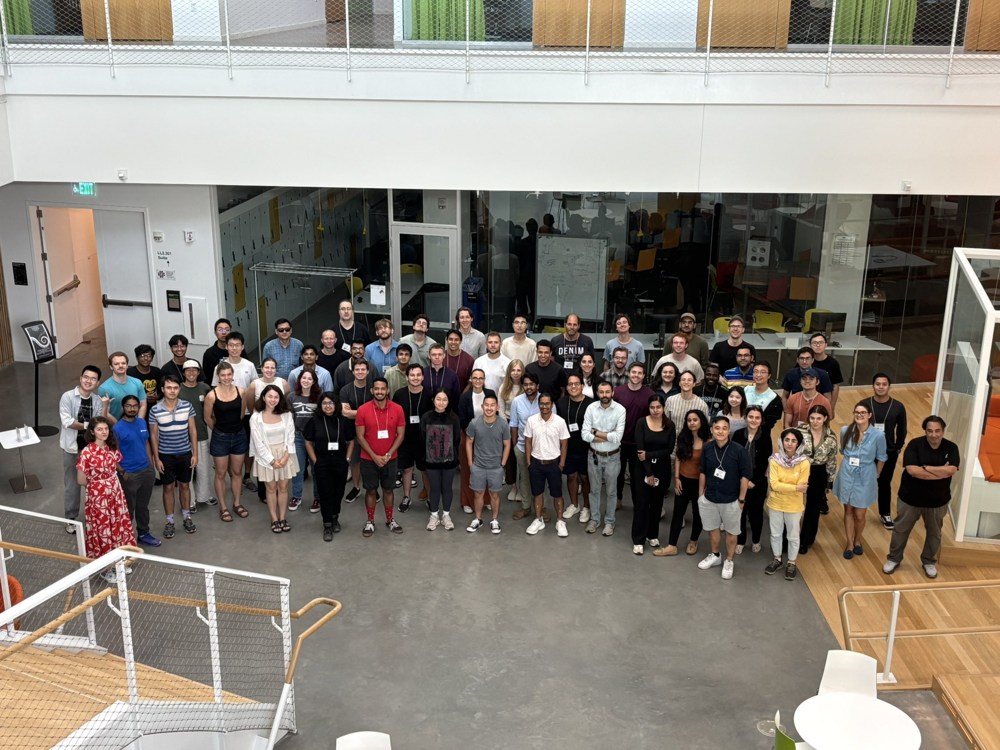
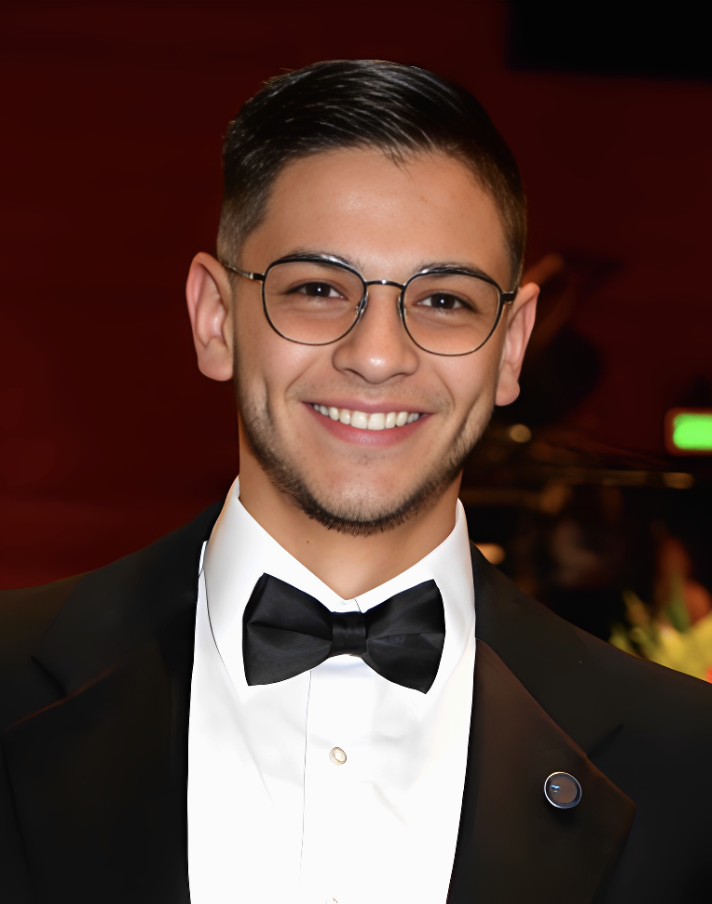
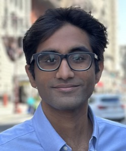
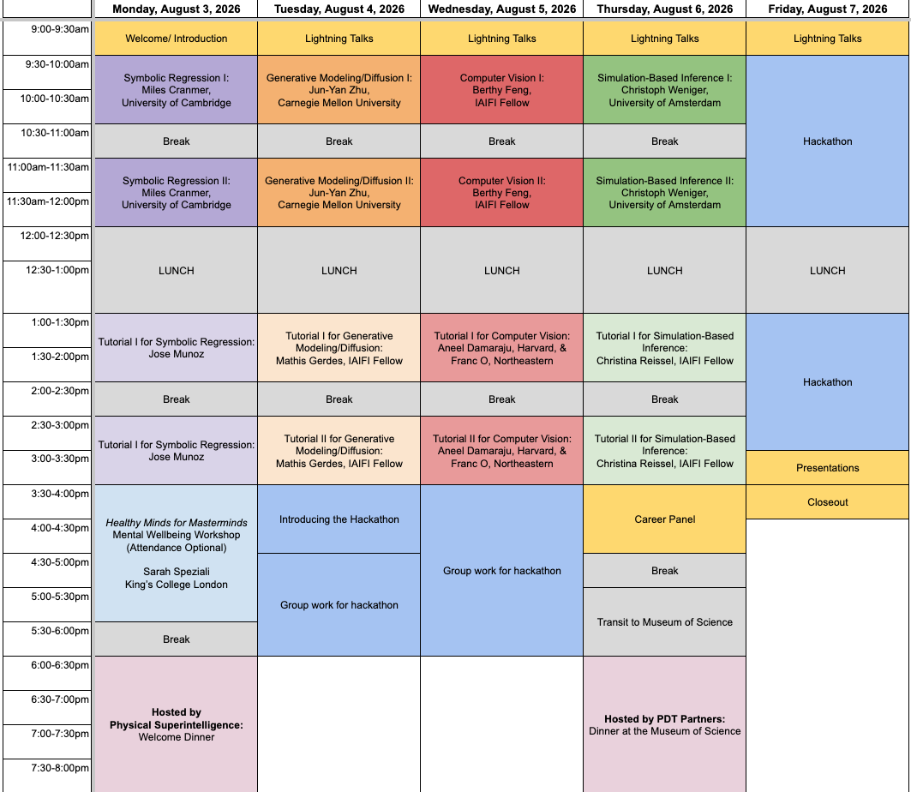

<!--
***Stay tuned for updates about the 2026 IAIFI Summer School.*** [Join our mailing list](http://mailman.mit.edu/mailman/listinfo/iaifi-news) to receive announcements regarding the 2026 IAIFI Summer School, which will be held August 3–7, 2026.
{:.success}
-->

 

# Summer School 2026

 

The mission of the IAIFI Summer School is to leverage the expertise of IAIFI researchers, affiliates, and partners toward promoting education and workforce development. 

* **August 3–7, 2026**
* **University of Massachusetts, Boston**

The Summer School is followed by the [IAIFI Summer Workshop](/summer-workshop), which is open to researchers of all career stages. 

   

[Agenda](#agenda){:.button.button--outline-primary.button--pill.button--lg} [Lecturers](#lecturers){:.button.button--outline-primary.button--pill.button--lg} [Tutorial Leads](#tutorial-leads){:.button.button--outline-primary.button--pill.button--lg} [Costs](#costs){:.button.button--outline-primary.button--pill.button--lg} [Sponsors](#financial-supporters){:.button.button--outline-primary.button--pill.button--lg} [FAQ](#faq){:.button.button--outline-primary.button--pill.button--lg} [Past Schools](/past-summer-schools.html){:.button.button--outline-primary.button--pill.button--lg}

<!--

[Accommodations](#accommodations){:.button.button--outline-primary.button--pill.button--lg}

--> 

## About 
The Institute for Artificial Intelligence and Fundamental Interactions (IAIFI) is enabling physics discoveries and advancing foundational AI through the development of novel AI approaches that incorporate first principles, best practices, and domain knowledge from fundamental physics. The Summer School will include lectures and events that illustrate interdisciplinary research at the intersection AI and Physics, and encourage global networking. Hands-on code-based tutorials that build on foundational lecture materials help students put theory into practice, and a hackathon project provides an opportunity for students to collaborate and apply what they've learned.

## Apply

**Applications are now closed for the 2026 IAIFI Summer School.** Please email [iaifi-summer@mit.edu](mailto:iaifi-summer@mit.edu) if you would like the opportunity to attend virtually

[Apply](https://app.smartsheet.com/b/form/019a9d12ef3e7cb4b5a3855a4c092845){:.button.button--outline-primary.button--pill.button--lg}

<!--

## Accommodations
Students for the Summer School have the option to reserve dorm rooms. IAIFI will reimburse the cost of 5 nights in the dorms after the Summer School, contingent upon attendance. Instructions for this will be provided to attendees in April.

-->

## Costs
* There is no registration fee for the Summer School. Costs of dorm accommodations will be reimbursed by IAIFI, contingent upon attendance. Students for the Summer School are expected to cover the cost of travel. 
* Lunch each day, as well as coffee and snacks at breaks, will be provided during the Summer School, along with at least one dinner during the Summer School. 
* Students who wish to stay for the [IAIFI Summer Workshop](/summer-workshop.html) will be able to book the same rooms through the weekend and the Workshop if they choose (at their own expense). 

## Lecturers

### Topic: Symbolic Regression

Lecturer: [Miles Cranmer](https://www.maths.cam.ac.uk/person/mc2473), Assistant Professor, University of Cambridge

### Topic: Generative Modeling/Diffusion

Lecturer: [Jun-Yan Zhu](https://www.cs.cmu.edu/~junyanz/), Assistant Professor, Carnegie Mellon University

### Topic: Computer Vision

Lecturer: [Berthy Feng](https://www.berthyfeng.com), IAIFI/Tayebati Fellow

### Topic: Simulation-Based Inference

Lecturer: [Christoph Weniger](https://www.christophweniger.com), Associate Professor, University of Amsterdam

## Tutorial Leads

### Topic: Symbolic Regression

Tutorial Lead: [Jose Munoz](https://munozariasjm.github.io/), PhD Student, MIT

### Topic: Generative Modeling/Diffusion

Tutorial Lead: [Mathis Gerdes](https://www.mathisgerdes.com/), IAIFI Fellow

### Topic: Computer Vision

Tutorial Leads: Aneel Damaraju, PhD Student, Harvard, and Franc O, PhD Student, Northeastern

### Topic: Simulation-Based Inference

Tutorial Lead: [Christina Reissel](https://www.linkedin.com/in/christina-reissel-06bab818a/), IAIFI Fellow

## Agenda

*Agenda is subject to change. Further detail to be added in the coming weeks.*

### Lecture Information

#### Monday, August 3, 2026
Lecture 1: Automatic Equation Discovery (Miles Cranmer, University of Cambridge)

*Would Kepler have discovered his laws if machine learning had been around in 1609? Or would he have settled for the accuracy of a black box regression model, leaving Newton without the inspiration to find the law of gravitation? In this lecture I will introduce symbolic regression: a machine learning task with the objective of finding human-interpretable symbolic models. I will do a deep dive into PySR (github.com/astroautomata/PySR) and its Julia backend SymbolicRegression.jl, covering the internal multi-population evolutionary search, and various new features supporting scientific equation discovery. I will then discuss how to embed domain knowledge in the search, through operator constraints, custom loss functions, and template expressions, which enable learning within a specific functional form. Finally, I will cover symbolic regression as an interpretability tool for deep learning. The afternoon tutorial will provide hands-on practice with the full pipeline.*

Resources:
- [PySR docs](https://ai.damtp.cam.ac.uk/pysr/)
    - [code](https://github.com/astroautomata/PySR) **Recommended to install ahead of time and run an example.**
- [SymbolicRegression.jl docs, for Julia users](https://ai.damtp.cam.ac.uk/symbolicregression/)
    - [code](https://github.com/astroautomata/SymbolicRegression.jl)
- [PySR/SymbolicRegression.jl paper](https://arxiv.org/abs/2305.01582)
- [Discovering Symbolic Models from Deep Learning with Inductive Biases](https://arxiv.org/abs/2006.11287)
- [SymTorch](https://arxiv.org/abs/2602.21307)
    - [code](https://github.com/astroautomata/SymTorch)
- [The Next Great Scientific Theory is Hiding Inside a Neural Network (Simons Foundation Presidential Lecture)](https://www.youtube.com/watch?v=fk2r8y5TfNY)

#### Tuesday, August 4, 2026
Lecture 2: Efficient Diffusion Models (Jun-Yan Zhu, Carnegie Mellon University)

*Diffusion models enable a wide range of applications, from images and video to scientific data, yet their inference remains slow, with computational costs scaling steeply with model size and resolution, posing a prohibitive memory and latency bottleneck for real-world deployment. In this lecture, we will introduce three complementary techniques for closing that gap: (1) few-step distillation, which distills a slow multi-step teacher into a one-step or few-step student using regression losses, adversarial training, or distribution matching; (2) quantization, which lowers weight and activation precision to reduce memory footprint and speed up inference; and (3) caching, a training-free technique that reuses previously computed outputs across denoising timesteps.*

Resources:
- [The Principles of Diffusion Models](https://arxiv.org/abs/2510.21890)
- [Flow Matching Guide and Code](https://arxiv.org/abs/2412.06264)
- [TinyML and Efficient Deep Learning Computing](https://hanlab.mit.edu/courses/2024-fall-65940)

#### Wednesday, August 5, 2026
Lecture 3: Computer Vision & Physics (Berthy Feng, IAIFI/Tayebati Fellow)

*Interpreting visual data is an essential part of scientific research. Computer vision enables computers to extract information about the world from visual data, typically images and videos. In this lecture, we will explore the connections between computer vision and science. We will focus on three case studies of how computer vision can be used to advance physics research. Through the three sections, we will learn about core computer vision tools, including phase-based motion processing, diffusion models, and coordinate-based neural networks.*

1. *In Part 1, we look at a method for estimating interior material properties of objects from videos. Combining classical phase-based motion processing with solid mechanics, we apply a physics-based optimization approach to extract physical information that is hidden in plain sight.*
2. *In Part 2, we learn how to use deep learning to solve image reconstruction problems. We explore how diffusion models can be used as sophisticated image priors for inferring images from sparse/noisy sensor measurements.*
3. *In Part 3, we see an example of how computer vision can advance fundamental physics research. We highlight the problem of reconstructing the dynamic 3D gas near a black hole from Event Horizon Telescope (EHT) data, learning how to combine coordinate-based neural networks and physics assumptions to solve this highly ill-posed problem in astrophysics.*

Resources:
- It is recommended to set up a Google account if you don't already have one, for the purpose of running Colab notebooks.

#### Thursday, August 6, 2026
Lecture 4: Dynamic Simulation-Based Inference: Extracting Physics from Complex Data and Simulations (Christoph Weniger,  University of Amsterdam)

*Our physical knowledge often lives inside simulators: forward models that encode our physical knowns and unknowns, but whose likelihoods may be intractable, from gravitational waveforms to cosmological surveys. Simulation-based inference (SBI) turns these simulators into inference engines, training neural networks to estimate posteriors directly from simulated data. We begin with the foundations of modern SBI and amortization, then turn to dynamic SBI: an active learning scheme that continuously focuses costly simulations on the parameter regions that matter. Examples are drawn from gravitational-wave astronomy. We discuss the FALCON framework for distributed dynamic SBI, which enables simultaneous inference of a multitude of parameters in complex forward models. We close with validation strategies, including coverage tests, rank-based diagnostics, and calibration.*

Resources:
- [Dynamic SBI: Round-free Sequential Simulation-Based Inference with Adaptive Datasets](https://arxiv.org/abs/2510.13997)
- [Simulation-Based Inference: A Practical Guide](https://arxiv.org/abs/2508.12939)
- [Awesome Neural SBI](https://github.com/smsharma/awesome-neural-sbi)
- [Machine Learning for Astroparticle Physics](https://cweniger.github.io/teaching-2606-ICTP-SAIFR/)

<!--

### Monday, August 3, 2026

**9:00–9:30 am ET**

Welcome/Introduction

**9:30 am–12:00 pm ET**

Lecture 1: TBA

**12:00–1:00 pm ET**

Lunch 

**1:00–3:30 pm ET**

Tutorial 1: TBA

**3:30–4:30 pm ET**

Hackathon Introduction

**5:00–5:30 pm ET**

Break

**5:30–7:30 pm ET**

Welcome Dinner

### Tuesday, August 4, 2026

**9:00–9:30 am ET**

Lightning Talks

**9:30 am–12:00 pm ET**

Lecture 2: TBA

**12:00–1:00 pm ET**

Lunch 

**1:00–3:30 pm ET**

Tutorial 2: TBA

**3:30–4:30 pm ET**

Breakout Sessions with Lecturers and Tutorial Leads 

**4:30–6:00 pm ET**

Group work for hackathon

### Wednesday, August 5, 2026

**9:00–9:30 am ET**

Lightning Talks

**9:30 am–12:00 pm ET**

Lecture 3:TBA

**12:00–1:00 pm ET**

Lunch 

**1:00–3:30 pm ET**

Tutorial 3: TBA

**3:30–4:30 pm ET**

Career Panel

**4:30–6:30 pm ET**

Break

**6:30–8:00 pm ET**

Networking event with IAIFI

### Thursday, August 7, 2025

**9:00–9:30 am ET**

Lightning Talks

**9:30 am–12:00 pm ET**

Lecture 4: TBA

**12:00–1:00 pm ET**

Lunch 

**1:00–3:30 pm ET**

Tutorial 4: TBa

**3:30–4:30 pm ET**

Breakout Sessions with Lecturers and Tutorial Leads

**4:30–5:30 pm ET**

Group work for hackathon

### Friday, August 9, 2024

**9:00–9:30 am ET**

Lightning Talks

**9:30 am–12:00 pm ET**

Hackathon

Projects
    
<em>Project details to come.</em>

**12:00–1:00 pm ET**

Lunch 

**1:00–3:00 pm ET**

Hackathon

Projects
    
<em>Project details to come.</em>

**3:00–3:45 pm ET**

Hackathon presentations

**3:45–4:00 pm ET**

Closing

-->

## Financial Supporters
The Summer School is funded primarily by support from the National Science Foundation under Cooperative Agreement PHY-2019786. Computing resources are provided by the NSF ACCESS program.

If you are interested in providing financial support for the Summer School, please email [iaifi-summer@mit.edu](mailto:iaifi-summer@mit.edu).

## 2026 Organizing Committee 
* Will Detmold, Co-Chair (MIT)
* Bill Freeman, Co-Chair (MIT) 
* Akshunna Dogra (IAIFI Fellow)
* Berthy Feng (IAIFI Fellow)
* Mathis Gerdes (IAIFI Fellow)
* Juvenal Bassa (UPRM)
* Yize Dong (Harvard)
* Franc O (Northeastern)
* Sneh Pandya (Northeastern)
* Shelley Tong (MIT)
* Lana Xu (MIT)
* Xiaoyuan Zhang (MIT)
* Marisa LaFleur (IAIFI Managing Director)
* Thomas Bradford (IAIFI Project Coordinator)

## FAQ 
* *Who can apply to the Summer School?* Any PhD students or early career researchers working at the intersection of physics and AI may apply to the summer school. 
* *What is the cost to attend the Summer School?* There is no registration fee for the Summer School. Students for the Summer School are expected to cover the cost of travel.
* *Is there funding available to support my attendance at the Summer School?* IAIFI is covering the cost of the Summer School, including lunch each day. There is no support available for travel costs.
* *If I come to the Summer School, can I also attend the Workshop?* Yes! We encourage you to stay for the [IAIFI Summer Workshop](/summer-workshop) and you can stay in the dorms for both events if you choose (at your own expense). Information about the Summer Workshop will be provided in early 2026. 
* *Will the recordings of the lectures be available?* We expect to share recordings of the lectures after the Summer School.
* *Will there be an option for virtual attendance?* Yes, there is an option for virtual attendance.
* *How can I book a dorm for the IAIFI Summer School?* Information will be shared with accepted students about booking the dorms. 
* *What if I need childcare in order to attend the Summer School?* We are prepared to work with attendees to help coordinate child care as needed. Please contact [iaifi-summer@mit.edu](mailto:iaifi-summer@mit.edu) and/or indicate it in your application if you would like to discuss.

[Submit a question or comment](https://app.smartsheet.com/b/form/76c1d070d19d4688b65962c4ed190478){:.button.button--outline-primary.button--pill.button--sm}
