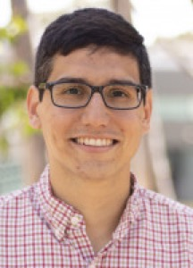

 
* [Summer School](summer-school) 
  * [Lecturers](#summer-school-lecturers)
  * [Summer School Registration](#summer-school-registration)
  * [Schedule](#summer-school-schedule)
  * [Student Accommodations](#student-accommodations)
  * [Costs](#costs)
* [Workshop](#workshop)
  * [Plenary Speakers](#plenary-speakers)
  * [Workshop Registration](#workshop-registration)
  * [Accommodations](#accommodations)
* [FAQ](#faq)
* [Organizing Committee](#organizing-committee)

The first annual IAIFI PhD Summer School will be held at Tufts University **August 1—August 5, 2022**, followed by the IAIFI Summer Workshop **August 8—August 9, 2022**. 

Registration for the Summer Workshop is now open for both in-person and virtual attendance. In-person attendance requires a 200 USD registration fee, which includes breakfast, lunch, and coffee breaks for both days, as well as a dinner on the first night. Virtual attendance is free. 

<a href="https://iaifi-workshop-reg-fee.mit.edu/registration">Register for In-Person Workshop Attendance</a>

{:.success}

<a href="https://forms.gle/XWDgpKP6GyNn7sNh7">Register for Virtual Workshop Attendance</a>

{:.success}

## Summer School
The mission of the IAIFI PhD Summer School is to leverage the expertise of IAIFI researchers, affiliates, and partners toward promoting education and workforce development. The Summer School will include lectures and events that exemplify ab initio AI, illustrate interdisciplinary research at the intersection AI and Physics, and encourage diverse global networking. Hands-on code-based tutorials that build on foundational lecture materials will help students put theory into practice.

### Lecturers

  <!--
-->
     

         
         

         

         <a href="https://yasamanb.github.io">Yasaman Bahri</a>
         

         

         <em> Research Scientist, Google Research (Brain Team) </em>  
         

         

       

     

         
         

         

         <a href="https://tacocohen.wordpress.com">Taco Cohen</a>
         

         

         <em> Research Scientist, Qualcomm Research Netherlands </em>  
         

         

       

     

         
         

         

         <a href="https://krippendorflab.github.io/">Sven Krippendorf</a>
         

         

         <em> Senior Researcher, Mathematical Physics and String Theory, Ludwig-Maximilians Universität </em>  
         

         

       

    

         
         

         

         <a href="https://vectorinstitute.ai/team/juan-felipe-carrasquilla/">Juan Carrasquilla</a>
         

         

         <em> Faculty Member, Vector Institute; Adjunct Assistant Professor, University of Waterloo </em>  
         

         

       

    

         
         

         

         <a href="https://www-physics.ucsd.edu/Directory/Person/552">Javier Duarte</a>
         

         

         <em> Assistant Professor, University of California, San Diego </em>  
         

         

       

  <!--
  

  -->

 

### Summer School Registration
**Registration for the Summer School is now closed**. You you will be notified of your registration status by May 2, 2022.

### Schedule
Details of the schedule for the Summer School will be released in Spring 2022. The schedule will include lectures, tutorials, poster sessions, a hackathon, and networking events.

### Student Accommodations
Students for the Summer School will have the opportunity to reserve dorm rooms at Tufts University (with the option of single or double room) through an online reservation system. The link to reserve a room will be sent directly to students as they are accepted to the school.

### Costs
* There is no registration fee for the Summer School. Students for the Summer School are expected to cover the cost of travel and boarding in Tufts dorm rooms, which range from 78 USD to 109 USD per night depending on the accommodations. 
* Breakfast and lunch (through the Tufts dining hall), as well as coffee at breaks, will be provided daily during the Summer School and Workshop (except over the weekend), along with at least one dinner during the Summer School and a Workshop dinner. 
* Students who wish to stay for the Workshop will be able to book the same rooms through the weekend and the Workshop if they choose and the Workshop registration fee will be waived for students participating in the Summer School. 

## Workshop 
The IAIFI Summer Workshop will bring together researchers from across Physics and AI for two days of plenary talks, poster sessions, and networking to promote research at the intersection of Physics and AI. The Workshop will be hybrid with both in-person and virtual attendance options. The full workshop program will be released in May 2022.

### Plenary Speakers
**IAIFI Senior Investigators/Affiliates in bold**

* [Siamak Ravanbakhsh](https://www.siamak.page), Assistant Professor, School of Computer Science, McGill University
* [Greg Yang](https://www.microsoft.com/en-us/research/people/gregyang/), Senior Researcher, Microsoft Research
* **[Phil Harris](https://physics.mit.edu/faculty/philip-harris/)**, Assistant Professor of Physics, MIT
* [Kazuhiro Terao](https://www.codingkazu.com), Staff Scientist, Stanford University
* [Anja Butter](https://www.thphys.uni-heidelberg.de/~butter/), Postdoc, ITP Heidelburg
* **[Fabian Ruehle](https://cos.northeastern.edu/people/fabian-ruehle/)**, Assistant Professor, Northeastern University
* [Yi-Zhuang You](https://physics.ucsd.edu/Directory/Person/536), Assistant Professor, University of California, San Diego
* [Jennifer Ngadiuba](https://inspirehep.net/authors/1244433), Wilson Fellow, Fermilab
* **[Shuchin Aeron](http://www.ece.tufts.edu/~shuchin/)**, Associate Professor, Tufts University
* **[Cora Dvorkin](https://dvorkin.physics.harvard.edu)**, Associate Professor, Harvard University
* More to come!

### Workshop Registration
Registration for the Summer Workshop is now open. The registration fee for in-person attendance is 200 USD and includes breakfast, lunch, and coffee breaks for both days, as well as a dinner on the first night. 
* [Register for in-person attendance](https://iaifi-workshop-reg-fee.mit.edu/registration)
* [Register for virtual attendance](https://forms.gle/XWDgpKP6GyNn7sNh7)

### Accommodations
Workshop attendees will be able to book rooms in a block at a hotel near Tufts or to book a Tufts dorm room. Accommodation options will be announced soon. 

## FAQ 
* *Who can apply to the Summer School?* Any PhD students or early career researchers working at the intersection of physics and AI may apply to the summer school. 
* *What is the cost to attend the Summer School?* There is no registration fee for the Summer School. Students for the Summer School are expected to cover the cost of travel and boarding in Tufts dorm rooms, which range from 78 USD to 109 USD per night depending on the accommodations. Breakfast and lunch will be provided through Tufts dining hall.
* *Is there funding available to support my attendance at the Summer School?* IAIFI is covering the cost of the Summer School other than travel and lodging. Limited, need-based support may be available for attendees who are unable to cover the costs of travel and lodging and will be addressed on a case-by-case basis. 
* *If I come to the Summer School, can I also attend the Workshop?* Yes! We encourage you to stay for the Workshop and will cover the cost of your registration if you attend both the Summer School and Workshop in person. 

## Organizing Committee
* Jim Halverson, Chair (Northeastern University)
* Tess Smidt (MIT)
* Anna Golubeva (IAIFI Fellow)
* Dylan Rankin (MIT)
* Jeffrey Lazar (Harvard)
* Peter Lu (MIT)

Contact [iaifi@mit.edu](mailto:iaifi@mit.edu) with questions.
