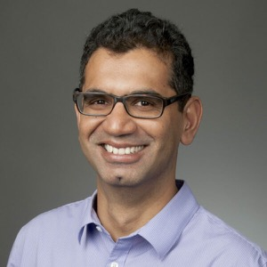

 

# Summer School 2023

 

The mission of the IAIFI PhD Summer School is to leverage the expertise of IAIFI researchers, affiliates, and partners toward promoting education and workforce development. 

* **August 7–11, 2023**
* **Northeastern University, Interdisciplinary Science and Engineering Complex**
* **Application deadline: April 9, 2023** 

 

[About](#about){:.button.button--outline-primary.button--pill.button--lg}  [Apply](https://app.smartsheet.com/b/form/7d51a61adcc046eb9a59ac5496b34c2c){:.button.button--outline-primary.button--pill.button--lg} [Lecturers](#lecturers){:.button.button--outline-primary.button--pill.button--lg} [Accommodations](#accommodations){:.button.button--outline-primary.button--pill.button--lg} [Costs](#costs){:.button.button--outline-primary.button--pill.button--lg} [FAQ](#faq){:.button.button--outline-primary.button--pill.button--lg} [Past Schools](/past-summer-schools.html){:.button.button--outline-primary.button--pill.button--lg}

## About 
The Institute for Artificial Intelligence and Fundamental Interactions (IAIFI) is enabling physics discoveries and advancing foundational AI through the development of novel AI approaches that incorporate first principles, best practices, and domain knowledge from fundamental physics. The Summer School will include lectures and events that exemplify ab initio AI, illustrate interdisciplinary research at the intersection AI and Physics, and encourage diverse global networking. Hands-on code-based tutorials that build on foundational lecture materials help students put theory into practice.

## Apply
**Registration for the 2023 Summer School is now open**. Space is limited, so we require a brief application. **Applications are due April 9, 2023.** You you will be notified of your registration status by April 17, 2023.

[Apply to IAIFI Summer School](https://app.smartsheet.com/b/form/7d51a61adcc046eb9a59ac5496b34c2c){:.button.button--outline-primary.button--pill.button--sm}

## Accommodations
Students for the Summer School will have the option to reserve dorm rooms (at their own expense) at Boston University for 96.50 USD per night. Instructions for this will be provided to students upon acceptance.

### Costs
* There is no registration fee for the Summer School. Students for the Summer School are expected to cover the cost of travel and boarding. Boston University dorm rooms will be available for 5 nights at no cost for Summer School students who need them.
* Lunch each day, as well as coffee and snacks at breaks, will be provided daily during the Summer School, along with at least one dinner during the Summer School. 
* Students who wish to stay for the [IAIFI Summer Workshop](/summer-workshop.html) will be able to book the same rooms through the weekend and the Workshop if they choose (at their own expense). 

## Lecturers
Additional lecturers and tutorial leads will be announced soon.

  <!--
-->

     

         
         

         

         <a href="https://www.uva.nl/en/profile/c/h/c.n.cheng/c.n.cheng.html">Miranda Cheng</a>
         

         

         <em> Faculty of Science, University of Amsterdam </em>  
         

         

       

     

         
         

         

         <a href="http://physics.bu.edu/~pankajm/">Pankaj Mehta</a>
         

         

         <em> Professor of Physics, Boston University </em>  
         

         

       

     

         
         

         

         <a href="https://smsharma.io">Siddharth Mishra-Sharma</a>
         

         

         <em> IAIFI Fellow </em>  
         

         

       

     

         
         

         

         <a href="https://joshspeagle.com">Joshua Speagle</a>
         

         

         <em> Assistant Professor of Astrostatistics, University of Toronto </em>  
         

         

       

  <!--
  

  -->

 

## 2023 Organizing Committee 
* Jim Halverson, Chair (Northeastern University)
* Shuchin Aeron (Tufts)
* Denis Boyda (IAIFI Fellow)
* Anna Golubeva (IAIFI Fellow)
* Ouail Kitouni (MIT)
* Nayantara Mudur (Harvard)
* Sneh Pandya (Northeastern)

## FAQ 
* *Who can apply to the Summer School?* Any PhD students or early career researchers working at the intersection of physics and AI may apply to the summer school. 
* *What is the cost to attend the Summer School?* There is no registration fee for the Summer School. Students for the Summer School are expected to cover the cost of travel and boarding.
* *Is there funding available to support my attendance at the Summer School?* IAIFI is covering the cost of the Summer School, including lunches and lodging for 5 nights. There is no support available for travel costs.
* *If I come to the Summer School, can I also attend the Workshop?* Yes! We encourage you to stay for the Workshop and you can stay in the dorms for both events if you choose. There is a 250 USD registration fee for the Workshop.
* *Will the recordings of the lectures be available?* We expect to share recordings of the lectures after the Summer School.
* *Will there be an option for virtual attendance?* We will determine whether virtual options will be provided based on interest.

[Submit a question or comment](https://app.smartsheet.com/b/form/76c1d070d19d4688b65962c4ed190478){:.button.button--outline-primary.button--pill.button--sm}

Contact [iaifi@mit.edu](mailto:iaifi@mit.edu) with questions.
