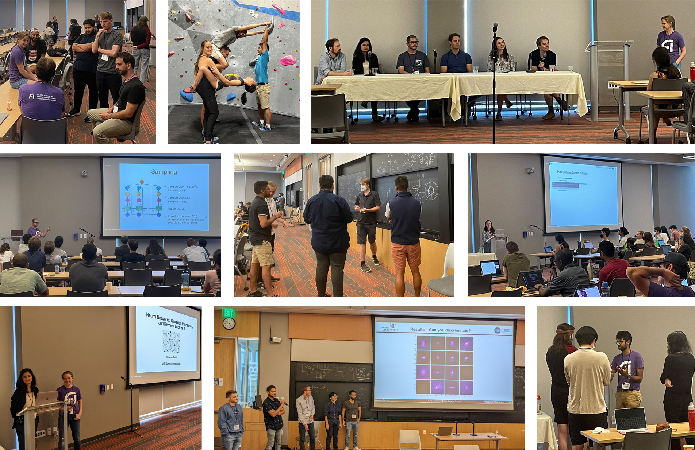

 

* [Summer School 2022](#summer-school-2022)
* [Summer Workshop 2022](#summer-workshop-2022)
* [2022 Organizing Committee](#2022-organizing-committee) 
* [FAQ](#faq)

## Summer School 2022
The first annual IAIFI PhD Summer School was held at Tufts University **August 1—August 5, 2022**, followed by the IAIFI Summer Workshop **August 8—August 9, 2022**. 

Our first annual Summer School was held hybrid over 5 days, with ~85 attendees in person from over 9 different countries. 

### Summer School Agenda

[Download PDF of snapshot](images/2022-summer-school-agenda.pdf)

[View the detailed agenda for the IAIFI Summer School](https://iaifi.org/summer-school-agenda)

[View the complete Summer School program](talks/Summer-School_Program_2022.pdf)

### Lecturers

  <!--
-->
     

         
         

         

         <a href="https://yasamanb.github.io">Yasaman Bahri</a>
         

         

         <em> Research Scientist, Google Research (Brain Team) </em>  
         

         

       

     

         
         

         

         <a href="https://tacocohen.wordpress.com">Taco Cohen</a>
         

         

         <em> Research Scientist, Qualcomm Research Netherlands </em>  
         

         

       

     

         
         

         

         <a href="https://krippendorflab.github.io/">Sven Krippendorf</a>
         

         

         <em> Senior Researcher, Mathematical Physics and String Theory, Ludwig-Maximilians Universität </em>  
         

         

       

    

         
         

         

         <a href="https://vectorinstitute.ai/team/juan-felipe-carrasquilla/">Juan Carrasquilla</a>
         

         

         <em> Faculty Member, Vector Institute; Adjunct Assistant Professor, University of Waterloo </em>  
         

         

       

    

         
         

         

         <a href="https://www-physics.ucsd.edu/Directory/Person/552">Javier Duarte</a>
         

         

         <em> Assistant Professor, University of California, San Diego </em>  
         

         

       

  <!--
  

  -->

 

### Financial Supporters 
We extend a sincere thank you to the following financial supporters of the first IAIFI Summer School:

  

## Summer Workshop 2022

The first annual Summer Workshop was held hybrid with ~110 in-person attendees from 10 different countries. The Workshop included 82% of the Summer School students who stayed to partake. 

### Workshop Agenda

[Download PDF of agenda](images/2022-workshop-agenda.pdf)

[View the detailed agenda for the IAIFI Summer Workshop](https://iaifi.org/workshop-agenda)

### Plenary Speakers 2022
**IAIFI Investigators/Affiliates in bold**

* [Siamak Ravanbakhsh](https://www.siamak.page), Assistant Professor, School of Computer Science, McGill University
* [Greg Yang](https://www.microsoft.com/en-us/research/people/gregyang/), Senior Researcher, Microsoft Research
* **[Phil Harris](https://physics.mit.edu/faculty/philip-harris/)**, Assistant Professor of Physics, MIT
* [Kazuhiro Terao](https://www.codingkazu.com), Staff Scientist, Stanford University
* [Claudius Krause](https://claudius-krause.gitlab.io), Postdoctoral Associate, Rutgers University
* **[Fabian Ruehle](https://cos.northeastern.edu/people/fabian-ruehle/)**, Assistant Professor, Northeastern University
* [Yi-Zhuang You](https://physics.ucsd.edu/Directory/Person/536), Assistant Professor, University of California, San Diego
* [Jennifer Ngadiuba](https://inspirehep.net/authors/1244433), Wilson Fellow, Fermilab
* **[Shuchin Aeron](http://www.ece.tufts.edu/~shuchin/)**, Associate Professor, Tufts University
* **[Cora Dvorkin](https://dvorkin.physics.harvard.edu)**, Associate Professor, Harvard University
* [Sébastien Racanière](https://scholar.google.com/citations?user=o-h0vrQAAAAJ&hl=en), Staff Research Engineer, DeepMind
* **[Anna Golubeva](https://annagolubeva.github.io)**, IAIFI Fellow

## 2022 Organizing Committee
* Jim Halverson, Chair (Northeastern University)
* Tess Smidt (MIT)
* Taritree Wongjirad (Tufts)
* Anna Golubeva (IAIFI Fellow)
* Dylan Rankin (MIT)
* Jeffrey Lazar (Harvard)
* Peter Lu (MIT)

## FAQ 
* *Who can apply to the Summer School?* Any PhD students or early career researchers working at the intersection of physics and AI may apply to the summer school. 
* *What is the cost to attend the Summer School?* There is no registration fee for the Summer School. Students for the Summer School are expected to cover the cost of travel and boarding.
* *Is there funding available to support my attendance at the Summer School?* IAIFI is covering the cost of the Summer School other than travel and lodging. 
* *If I come to the Summer School, can I also attend the Workshop?* Yes! We encourage you to stay for the Workshop and will cover the cost of your registration if you attend both the Summer School and Workshop in person. 
* *Will the recordings of the lectures be available?* We expect to share recordings of the lectures after the Summer School.
* *Will there be an option for virtual attendance?* We will determine whether virtual options will be provided based on interest.

[Submit a question or comment](https://app.smartsheet.com/b/form/76c1d070d19d4688b65962c4ed190478){:.button.button--outline-primary.button--pill.button--sm}
