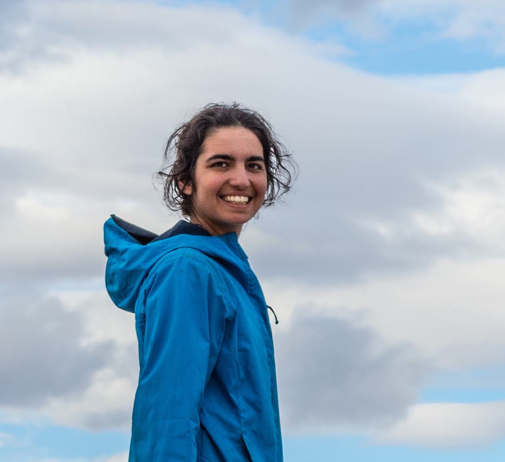
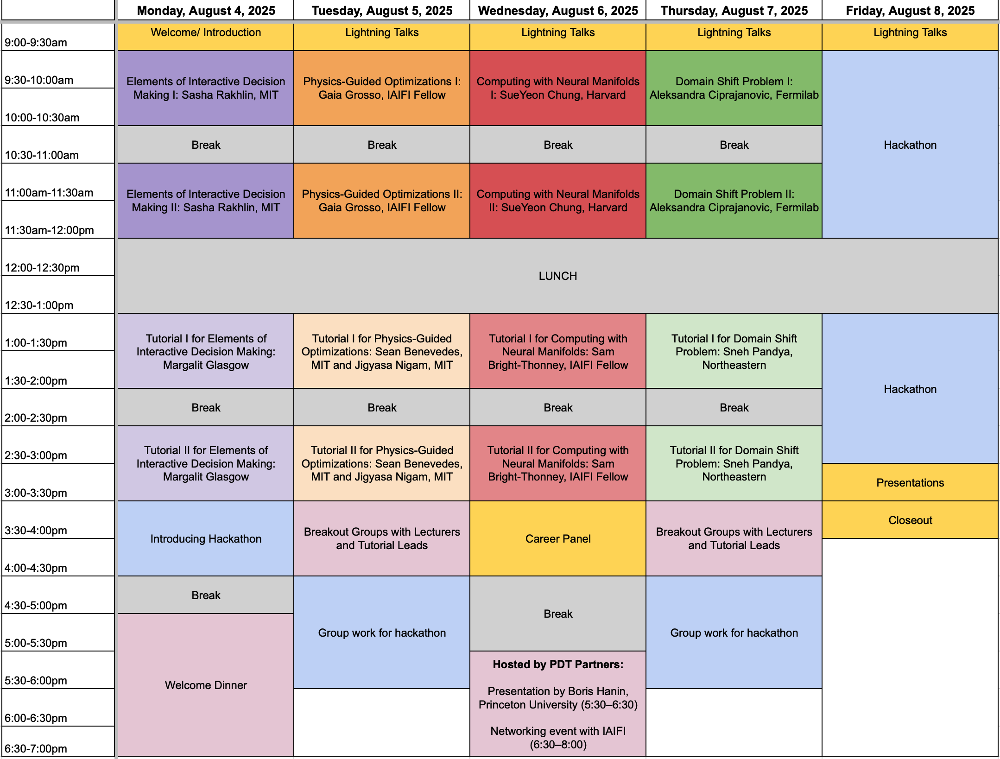

 

# Summer School 2025

 

The mission of the IAIFI PhD Summer School is to leverage the expertise of IAIFI researchers, affiliates, and partners toward promoting education and workforce development. 

* **August 4–8, 2025**
* **Harvard, Cambridge, MA**

The Summer School will be followed by the [IAIFI Summer Workshop](/summer-workshop), which is open to researchers of all career stages. 

   

<!--[Apply](https://app.smartsheet.com/b/form/e8dcb6c8564a45d5a61cb0ecafec2bd4){:.button.button--outline-primary.button--pill.button--lg}-->[Agenda](#agenda){:.button.button--outline-primary.button--pill.button--lg} [Lecturers](#lecturers){:.button.button--outline-primary.button--pill.button--lg} [Tutorial Leads](#tutorial-leads){:.button.button--outline-primary.button--pill.button--lg} [Accommodations](#accommodations){:.button.button--outline-primary.button--pill.button--lg} [Costs](#costs){:.button.button--outline-primary.button--pill.button--lg} [Sponsors](#financial-supporters){:.button.button--outline-primary.button--pill.button--lg} [FAQ](#faq){:.button.button--outline-primary.button--pill.button--lg} [Past Schools](/past-summer-schools.html){:.button.button--outline-primary.button--pill.button--lg}

## About 
The Institute for Artificial Intelligence and Fundamental Interactions (IAIFI) is enabling physics discoveries and advancing foundational AI through the development of novel AI approaches that incorporate first principles, best practices, and domain knowledge from fundamental physics. The Summer School will include lectures and events that illustrate interdisciplinary research at the intersection AI and Physics, and encourage global networking. Hands-on code-based tutorials that build on foundational lecture materials help students put theory into practice, and a hackathon project provides an opportunity for students to collaborate and apply what they've learned.

## Apply

**Applications are now closed for the 2025 IAIFI Summer School. [Subscribe to our mailing list](http://mailman.mit.edu/mailman/listinfo/iaifi-news) to receive updates on future opportunities.**

## Accommodations
Students for the Summer School have the option to reserve dorm rooms at Harvard University. IAIFI will reimburse the cost of 5 nights in the dorms after the Summer School, contingent upon attendance. Instructions for this will be provided to students upon acceptance.

## Costs
* There is no registration fee for the Summer School. Costs of dorm accommodations will be reimbursed by IAIFI, contingent upon attendance. Students for the Summer School are expected to cover the cost of travel. 
* Lunch each day, as well as coffee and snacks at breaks, will be provided during the Summer School, along with at least one dinner during the Summer School. 
* Students who wish to stay for the [IAIFI Summer Workshop](/summer-workshop.html) will be able to book the same rooms through the weekend and the Workshop if they choose (at their own expense). 

## Lecturers

### Topic: Reinforcement Learning

Lecturer: [Sasha Rakhlin](https://www.mit.edu/~rakhlin/), Professor, MIT

### Topic: Robust/Interpretable AI: Domain Adaptation

Lecturer: [Aleksandra Ćiprajanović](https://aleksandraciprijanovic.wordpress.com), Wilson Fellow Associate Scientist, Fermilab

### Topic: Physics-Motivated Optimization

Lecturer: [Gaia Grosso](https://iaifi.org/current-fellows.html#gaia-grosso), IAIFI Fellow

### Topic: Representation/Manifold Learning: Geometric Deep Learning

Lecturer: [SueYeon Chung](https://as.nyu.edu/faculty/sueyeon-chung.html), Assistant Professor of Neural Science, NYU

## Tutorial Leads

### Topic: Reinforcement Learning

Tutorial Lead: Margalit Glasgow, Postdoc, MIT

### Topic: Robust/Interpretable AI: Domain Adaptation

Tutorial Lead: Sneh Pandya, PhD Student, Northeastern/IAIFI

  
### Topic: Physics-Motivated Optimization: Simulation Intelligence

Tutorial Lead: Sean Benevedes, PhD Student, MIT and Jigyasa Nigam, Postdoc, MIT

### Topic: Representation/Manifold Learning: Geometric Deep Learning

Tutorial Lead: Sam Bright-Thonney, IAIFI Fellow

## Agenda

*Agenda is subject to change.*

### Monday, August 4, 2025

**9:00–9:30 am ET**

Welcome/Introduction

**9:30 am–12:00 pm ET**

Lecture 1: Reinforcement Learning (Sasha Rakhlin, MIT)

**12:00–1:00 pm ET**

Lunch 

**1:00–3:30 pm ET**

Tutorial 1: Reinforcement Learning (TBA)

**3:30–4:30 pm ET**

Hackathon Introduction

**5:00–5:30 pm ET**

Break

**5:30–7:30 pm ET**

Welcome Dinner

### Tuesday, August 4, 2025

**9:00–9:30 am ET**

Lightning Talks

**9:30 am–12:00 pm ET**

Lecture 2: Physics-Motivated Optimization (Gaia Grosso, IAIFI Fellow)

**12:00–1:00 pm ET**

Lunch 

**1:00–3:30 pm ET**

Tutorial 2: Physics-Motivated Optimization (Sean Benevedes, MIT and Jigyasa Nigam, MIT)

**3:30–4:30 pm ET**

Breakout Sessions with Lecturers and Tutorial Leads 

**4:30–6:00 pm ET**

Group work for hackathon

### Wednesday, August 6, 2025

**9:00–9:30 am ET**

Lightning Talks

**9:30 am–12:00 pm ET**

Lecture 3: Geometric Deep Learning (SueYeon Chung, Harvard)

**12:00–1:00 pm ET**

Lunch 

**1:00–3:30 pm ET**

Tutorial 3: Geometric Deep Learning (Sam Bright-Thonney, IAIFI Fellow)

**3:30–4:30 pm ET**

Career Panel

**4:30–5:30 pm ET**

Break

**5:30–6:30 pm ET**

Fireside Chat with Boris Hanin (Princeton University) sponsored by PDT Partners

**6:30–8:00 pm ET**

Networking event with IAIFI sponsored by PDT Partners

### Thursday, August 7, 2025

**9:00–9:30 am ET**

Lightning Talks

**9:30 am–12:00 pm ET**

Lecture 4: Domain Adaptation (Aleksandra Ciprajanovic, Fermilab)

**12:00–1:00 pm ET**

Lunch 

**1:00–3:30 pm ET**

Tutorial 4: Domain Adaptation (Sneh Pandya, Northeastern)

**3:30–4:30 pm ET**

Breakout Sessions with Lecturers and Tutorial Leads

**4:30–5:30 pm ET**

Group work for hackathon

### Friday, August 9, 2024

**9:00–9:30 am ET**

Lightning Talks

**9:30 am–12:00 pm ET**

Hackathon

Projects
    
<em>Project details to come.</em>

**12:00–1:00 pm ET**

Lunch 

**1:00–3:00 pm ET**

Hackathon

Projects
    
<em>Project details to come.</em>

**3:00–3:45 pm ET**

Hackathon presentations

**3:45–4:00 pm ET**

Closing

## Financial Supporters
The Summer School is funded primarily by support from the National Science Foundation under Cooperative Agreement PHY-2019786. Computing resources are provided by the NSF ACCESS program.

We extend a sincere thank you to the following financial supporters of this year's IAIFI Summer School:

   

If you are interested in supporting the 2025 IAIFI Summer School, email [iaifi-summer@mit.edu](mailto:iaifi-summer@mit.edu)

## 2025 Organizing Committee 
* Fabian Ruehle, Chair (Northeastern University)
* Bill Freeman (MIT) 
* Cora Dvorkin (Harvard)
* Thomas Harvey (IAIFI Fellow)
* Sam Bright-Thonney (IAIFI Fellow)
* Sneh Pandya (Northeastern)
* Yidi Qi (Northeastern)
* Manos Theodosis (Harvard)
* Marshall Taylor (MIT)
* Marisa LaFleur (IAIFI Project Manager)
* Thomas Bradford (IAIFI Project Coordinator)

## FAQ 
* *Who can apply to the Summer School?* Any PhD students or early career researchers working at the intersection of physics and AI may apply to the summer school. 
* *What is the cost to attend the Summer School?* There is no registration fee for the Summer School. Students for the Summer School are expected to cover the cost of travel.
* *Is there funding available to support my attendance at the Summer School?* IAIFI is covering the cost of the Summer School, including lunch each day. There is no support available for travel costs.
* *If I come to the Summer School, can I also attend the Workshop?* Yes! We encourage you to stay for the [IAIFI Summer Workshop](/summer-workshop) and you can stay in the dorms for both events if you choose (at your own expense). Information about the Summer Workshop will be provided in early 2025. 
* *Will the recordings of the lectures be available?* We expect to share recordings of the lectures after the Summer School.
* *Will there be an option for virtual attendance?* Yes, there is an option for virtual attendance.
* *How can I book a dorm for the IAIFI Summer School?* Information will be shared with accepted students about booking the dorms. 
* *What if I need childcare in order to attend the Summer School?* We are prepared to work with attendees to help coordinate child care as needed. Please contact [iaifi-summer@mit.edu](mailto:iaifi-summer@mit.edu) and/or indicate it in your application if you would like to discuss.

[Submit a question or comment](https://app.smartsheet.com/b/form/76c1d070d19d4688b65962c4ed190478){:.button.button--outline-primary.button--pill.button--sm}
