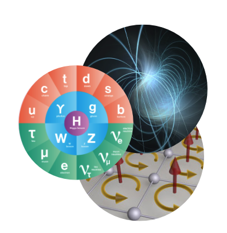

Research in Physics Theory is leveraging AI to understand the theoretical underpinning of fundamental physics, including: 
* nuclear/particle physics,
* quantum field theory and string theory, and
* quantum many-body physics.

Projects in AI for Theoretical Physics utilize AI tools and techniques to enable physics discovery through the acceleration of theoretical physics calculations. In turn, the advances made in this domain also contribute to advancing AI---researchers are not simply using existing AI tools and techniques as they are, but are building on  those tools and developing new tools, which can have applications beyond AI. Researchers working in this domain are developing AI to solve problems related to the detection of subhalos, quantum many-body physics, simulation-based inference, lattice quantum field theory, dark matter searches, and knot theory, to name a few. 

[Physics Theory Papers](https://iaifi.org/papers-theory.html){:.button.button--outline-primary.button--pill.button--lg}

<!--
The specific *ab initio* physics approaches that we are targeting include first-principles calculations within the Standard Model (SM) of nuclear and particle physics, work to understand physics beyond the SM in the framework of string theory, and theory calculations for astroparticle physics. Complementing these efforts is work towards approaches that do not use AI to study a known theory, but instead to determine what previously unknown theory underlies observations. While the target physics spans a wide range of frameworks and scales, success in these areas all rely intimately on our efforts to advance the field of AI itself with work in interpretability, speed, and incorporating physical symmetries into AI frameworks, *i.e.* to develop the field of *ab initio* AI.
-->

## Research Highlights

<iframe src="https://docs.google.com/presentation/d/e/2PACX-1vTxqm4eag2o96if1Zo1Zm6ltYWGXYv67BEiUbHrezxbaJ8zxmUaPSMYnHTf7V-VLsAVgRcNFbQCWepA/embed?start=false&loop=false&delayms=3000" frameborder="0" width="864" height="512" allowfullscreen="true" mozallowfullscreen="true" webkitallowfullscreen="true"></iframe>

[View and download slide](https://docs.google.com/presentation/d/1cf6JP5k2YNUEHrQ87vB3t0krALNOAhrd-xlNgnpw4IU/edit?usp=share_link)

<iframe src="https://docs.google.com/presentation/d/e/2PACX-1vQ4lgfNM9jYhuuaksfPhkaUq-tX-dM_uuMh8xcpcDSguAGdyl9n4pqnOnBcYFCK9_5FCiHnbyDywcWe/embed?start=false&loop=false&delayms=3000" frameborder="0" width="960" height="569" allowfullscreen="true" mozallowfullscreen="true" webkitallowfullscreen="true"></iframe>

[View and download slide](https://docs.google.com/presentation/d/1NaUaC-4T9RJmdJbQ3KJ3eecwuC29iXuKjF8_SpHLZVk/edit?usp=sharing)

<iframe src="https://docs.google.com/presentation/d/e/2PACX-1vTHv-3Y4OFNTH_3K-gRWkju9JVbRM3MJD6TwxU89rIWla47gkfAybKFj3r9A6NTWcLQ75iT4HkcZU8v/embed?start=false&loop=false&delayms=3000" frameborder="0" width="960" height="569" allowfullscreen="true" mozallowfullscreen="true" webkitallowfullscreen="true"></iframe>

[View and download slide](https://docs.google.com/presentation/d/1WxfS6vSuZUIm50LLOilWtXVJo_LkPiiC0_c0S2miySA/edit?usp=sharing)

<iframe src="https://docs.google.com/presentation/d/1HzJW3YjcGMTSWssn3YOp1qj_NUHVXFV2vOoLjI4AdpA/embed?start=false&loop=false&delayms=3000" frameborder="0" width="960" height="569" allowfullscreen="true" mozallowfullscreen="true" webkitallowfullscreen="true"></iframe>

[View and download slide](https://docs.google.com/presentation/d/1HzJW3YjcGMTSWssn3YOp1qj_NUHVXFV2vOoLjI4AdpA/edit?usp=sharing)

<!--

<iframe src="https://docs.google.com/presentation/d/e/2PACX-1vQ7zx7T9Znc-hJogGIvdoFrMztQ43omuuB7c3hHlGv9wcjx3I5cjaiRze72NMxwsZNgJQsku2I4C9eq/embed?start=false&loop=false&delayms=3000" frameborder="0" width="864" height="512" allowfullscreen="true" mozallowfullscreen="true" webkitallowfullscreen="true"></iframe>

<iframe src="https://docs.google.com/presentation/d/e/2PACX-1vQFrfSqNbC0JcOkyhVR1ekmQwADNoLc8p_9OHZW95zx4cEQE_D117dNw2-19HklBy_LgQ5ZiUNp83mw/embed?start=false&loop=false&delayms=3000" frameborder="0" width="864" height="512" allowfullscreen="true" mozallowfullscreen="true" webkitallowfullscreen="true"></iframe>

<iframe src="https://docs.google.com/presentation/d/e/2PACX-1vQphqBH605LLUH8rCssvjRGhTbC5LCC3XeCyL6LMmaQXU26b-p3lppjJbLnCAIlL69ajau7QKwm-gWL/embed?start=false&loop=false&delayms=3000" frameborder="0" width="864" height="512" allowfullscreen="true" mozallowfullscreen="true" webkitallowfullscreen="true"></iframe>

-->

<!---
## Active Projects: 
* *Generative Flow Models to Accelerate Lattice Quantum Field
Theory Calculations*; **Project Lead: Phiala Shanahan, Physics, MIT**
* *Efficient Variational Calculations for Nuclear Theory with AI*;
**Project Leads: Phiala Shanahan, Physics, MIT; William Detmold, Physics, MIT**
* *Point Cloud Learning with Energy Flow*;
**Project Leads: Jesse Thaler, Physics, MIT; Justin Solomon, EECS, MIT**
* *Infinite Networks for Self-Generative Learning*;
**Project Lead: Jim Halverson, Physics, Northeastern**
* *Machine Learning for Topology: Knot Theory*;
**Project Lead: Jim Halverson, Physics, Northeastern**
* *NN-QFT Correspondence*;
**Project Lead: Jim Halverson, Physics, Northeastern**
* *Discovering Sparse Interpretable Dynamics from Partial Observations*;
**Project Lead: Marin Soljacic, Physics, MIT**
* *Emulating Energy Injection Effects in the Early Universe*;
**Project Lead: Tracy Slatyer, Physics, MIT**
* *A Compound Poisson Generator Approach to Point-Source Inference in Astrophysics*;
**Project Lead: Kerstin Perez, Physics, MIT**
* *Path-Integral Contour Deformation for Estimation of Noisy Observables in Lattice Field Theory*;
**Project Lead: William Detmold, Physics, MIT**
* *Discerning Line-of-Sight Halos from Substructure with Machine Learning*;
**Project Lead: Cora Dvorkin, Physics, Harvard**
* *Jet Metrics and Autoencoders*;
**Project Lead: Matthew Schwartz, Physics, Harvard**
* *Exploring Dual Moduli Spaces via Topological Data Analysis*;
**Project Lead: Brent Nelson, Physics, Northeastern**
* *Machine-Learning Invariance & Invariants*;
**Project Lead: Max Tegmark, Physics, MIT**
* *ML and Calabi-Yau Geometry*;
**Project Lead: Washington Taylor, Physics, MIT**
* *AI Preconditioners for Dirac Matrix Inversion*;
**Project Lead: Phiala Shanahan, Physics, MIT**
* *Topological Obstructions to Autoencoding*;
**Project Lead: Dan Roberts, Physics, Salesforce**

IAIFI Physics Theory Projects: *Accelerating Lattice Field Theory with AI*, *Exploring the Multiverse with AI*, *Classifying Knots with AI*, *Astrophysical Simulations with AI*, *Toward an AI Physicist*, and *String Theory Conjectures via AI*.
{:.info}
--->
