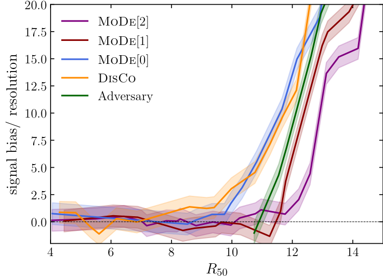

 

The sensor arrays of the LHC experiments produce over 100 TB/s of data, which is over a zettabyte per year. After drastic data-reduction performed by custom-built read-out electronics, the data volumes are still O(100) exabytes per year, which cannot be stored indefinitely. Therefore, each experiment processes the data in real-time and decides whether each event should remain persistent or be discarded permanently, referred to as *triggering* in particle physics.

IAIFI Deputy Director Mike Williams is one of the main architects of the LHCb trigger. He developed the main LHCb trigger algorithm, which uses a custom [algorithm](https://arxiv.org/abs/1210.6861) he invented to minimize the impact of effects like experimental instabilities that often occur during data taking. Williams also co-led the expanded use of AI-based algorithms in the LHCb Run 2 trigger.

This project seeks to use interpretable *ab initio* AI strategies to further improve LHC triggers by making them more robust and easily verifiable, two key operational challenges. Specifically, we are building on the work that led to the successful use of AI in the first two LHC runs, but going beyond that by providing algorithms that are simultaneously more powerful yet also more robust, while also giving the analysts / users more control over the behavior.

### Accomplishments

- Developed a new set of tools using a novel moment loss function (Moment Decomposition or MoDe) which allows classifiers to be highly flexible while at the same time preventing them from creating unwanted structures in the background; thus solving a key challenge in searches for resonant new physics. See publication below and our contribution to the NeurIPS 2020 Physical Sciences workshop: [paper](https://ml4physicalsciences.github.io/2020/files/NeurIPS_ML4PS_2020_45.pdf) and Ouail Kitouni's [poster](https://ml4physicalsciences.github.io/2020/files/NeurIPS_ML4PS_2020_45_poster.pdf) and [talk video](https://www.youtube.com/watch?v=ASqP0tcU6Ag).
- Developed a new class of neural networks that guarantee robustness to any desired level of the network response against changes in the input features. In addition, our approach allows the user to guarantee montonicity in any subset of the input features as well.
- Developed a prototype applying our new type of neural network for the Run-3 LHCb high-level trigger application. (This is currently being considered for use as the primary trigger selection algorithm in the first stage in Run 3.)

### Applications

The application that inspired this work is the LHCb trigger system. Our approach is being considered for use in the next LHC run, which starts in 2022. The motivations that drove us to develop this algorithm for LHCb are shared by all other physics experiments; therefore, we expect our approach could be used across all of physics. Since the need for robustness and more control over the behavior of classifiers is becoming more appreciated in other domains, it is possible our approach could be useful in many other areas.

<!-- Do not edit the line below this!!! -->

