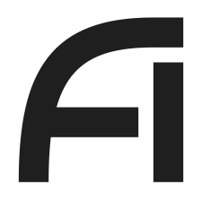
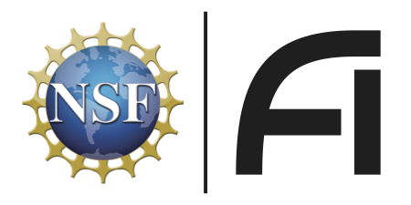
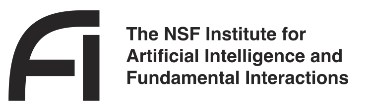

* [Contact](#contact)
* [Social Media](#social-media)
* [Graphics](#graphics)
* [FAQ](#FAQ)
* [Visit IAIFI](#visit-iaifi)
* [Receive Updates on IAIFI Events and Opportunities](#receive-updates-on-iaifi-events-and-opportunities)
* [Request Letter of Collaboration](#request-letter-of-collaboration)

## Contact
  * [Email IAIFI Management](mailto:iaifi@mit.edu)
  
## Social Media
  * [Follow us on Twitter](https://twitter.com/iaifi_news)
  * [Follow us on LinkedIn](https://www.linkedin.com/company/iaifi)

## Graphics

  * {:.image--sm} **IAIFI Logo**:  [Black PDF](images/iaifi-logo-black.pdf),  [White PDF](images/iaifi-logo-white.pdf), [Black JPEG](images/iaifi-logo-black-noborder-hires.jpg)

  * {:.image--sm}  **IAIFI Logo with NSF**:  [Black PDF](images/iaifi-nsf-logo-black.pdf),  [White PDF](images/iaifi-nsf-logo-white.pdf)

  * {:.image--sm}  **IAIFI Logo with Name**:  [Black PDF](images/iaifi-fullname-logo-black.pdf)
  
  * {:.image--sm} **IAIFI Horizontal Fusion**: [JPEG](images/iaifi-pressimage-horizontalcrop.jpg)
  
  * {:.image--sm} **IAIFI Full Size Fusion**:  [JPEG](images/iaifi-pressimage.jpg)
  
  * {:.image--sm}  **IAIFI Zoom Background**:  [JPEG](images/iaifi-zoombackground.jpg)

*Contact [IAIFI Management](mailto:iaifi@mit.edu) if you need graphics in different formats, colors, or sizes.*

## FAQ

* **How can I get more involved with IAIFI?** 
  * If you are already a member of IAIFI: Visit our [Committees](/committees.html) page for ways to help IAIFI achieve both its research and broader impacts objectives
  * If you are a senior researcher/faculty in the Boston area: Visit our [Senior Researchers page](/senior-researchers.html).
  * If you are a junior researcher in the Boston area: Visit our [Junior Researchers page](/junior-researchers.html).
  * If you are a potential industry partner: Visit our [Industry Partners page](/industry-partners.html)
 * **Where can I view highlights of your research and/or activities?** You can view current research projects on our [Research page](/research.html) and updates on our activities on the Events and Engagement tabs of the website. For an overview of highlights, download our [IAIFI Highlights presentation](images/iaifi-highlights.pdf) (last updated December 8, 2021).

## Visit IAIFI

Though the IAIFI is located in the Boston area, we encourage researchers at the intersection of physics and AI to visit us and spend time with IAIFI researchers. If you are interested in organizing a visit (as an individual or group), complete the [IAIFI Visitor form](/visitors.html).

## Receive Updates on IAIFI Events and Opportunities

* [Subscribe to IAIFI News](http://mailman.mit.edu/mailman/listinfo/iaifi-news)

## Request Letter of Collaboration
* If you would like to discuss a letter of collaboration from IAIFI for your own proposal, [email IAIFI Management](mailto:iaifi-management@mit.edu), including information about your proposal, how you'd like to partner with IAIFI, and the deadline for your request.

