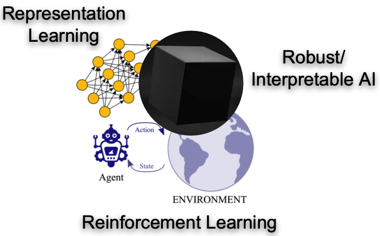
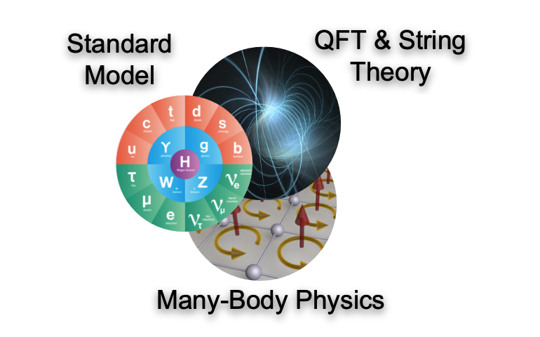
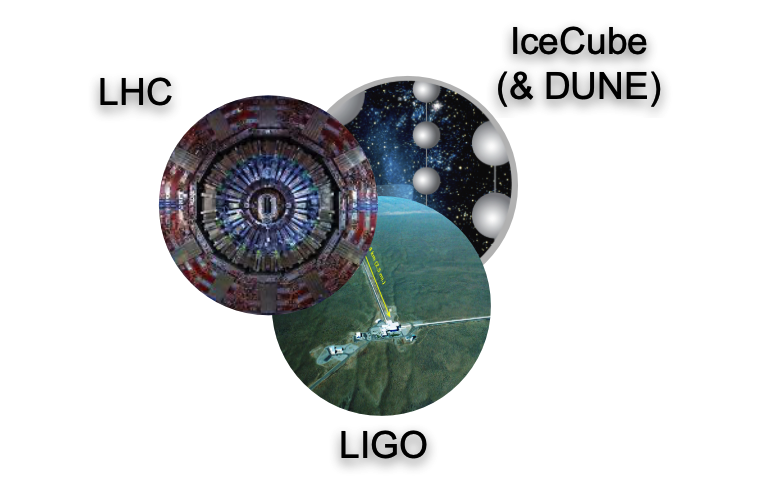
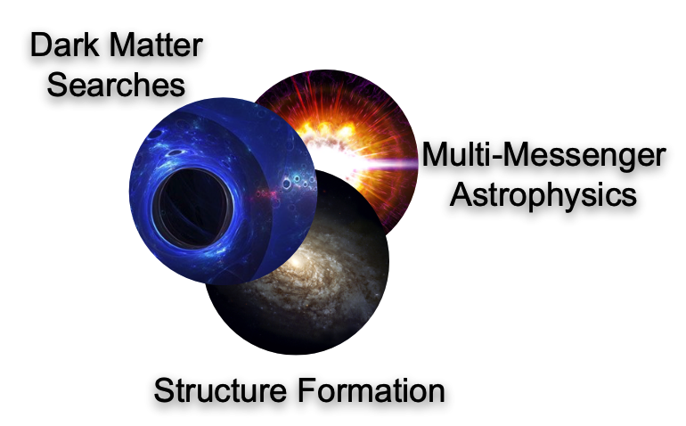

By combining revolutionary advances in deep learning from AI with the time-tested strategies of deep thinking from physics, IAIFI researchers are gaining a deeper understanding of our universe and of intelligence itself. IAIFI's efforts have helped to establish the interdisciplinary field of AI+Physics, combining AI innovation with inductive biases from physics to advance both fields in a virtuous cycle. IAIFI is facilitating collaborations across the domains of **Foundational AI**, **Theoretical Physics**, **Experimental Physics**, and **Astrophysics** by using cross-cutting themes of *Representation/Manifold Learning*, *Generative Models*, *Uncertainty Quantification/Robust AI*, *Physics-Motivated Optimization*, and *Reinforcement Learning* to develop a common language. 

## [Domain Impact](/domain-research.html)

  

    

      

      <a href="/domain-research.html#foundational-ai">
        

          

          
          

              

              <h3>FOUNDATIONAL AI</h3>
              

              Infusing physics principles into AI to create state-of-the-art AI innovations
            

          

        

      </a>
      

    

    
    

      

      <a href="/domain-research.html#theoretical-physics">
        

          

          
          

              

              <h3>AI + THEORETICAL PHYSICS</h3>
              

              Leveraging AI to understand the theoretical underpinning of fundamental physics
            

          

        

      </a>
      

    

    

      

      <a href="/domain-research.html#experimental-physics">
        

          

          
          

              

              <h3>AI + EXPERIMENTAL PHYSICS</h3>
              

              Enhancing the operations and analysis of flagship NSF experiments through AI
            

          

        

      </a>
      

    

    
    

      

      <a href="/domain-research.html#astrophysics">
        

          

          
          

              

              <h3>AI + ASTROPHYSICS</h3>
              

              Using AI techniques to understand the universe on cosmological scales
            

          

        

      </a>
      

    

    
  

<!---
## [Cross-Cutting Themes](/cross-cutting-research.html)

  

    

<a href="/ai-research.html">

    

        <h4 style="font-size: 14px; line-height: 1.2; margin: 0; style="word-wrap: break-word; overflow-wrap: break-word;">REPRESENTATION/ MANIFOLD LEARNING</h4>
    

    

        Developing algorithms that categorize and label data and improve the features and knowledge extracted. Often deep physics insight can found in the structure of learned representations. Conversely, inductive biases from physics and understanding of a problem’s underlying manifold structure can inform the structure of AI architectures.
    

</a>

[Representation/Manifold Learning](/cross-cutting-research.html#representation/manifold-learning){:.button.button--outline-primary.button--pill.button--md}
[Generative Models](/cross-cutting-research.html#generative-models){:.button.button--outline-primary.button--pill.button--md}
[Uncertainty Quantification/Robust AI](/cross-cutting-research.html#uncertainty-quantification/robust-ai){:.button.button--outline-primary.button--pill.button--md}
[Physics-Motivated Optimization](/cross-cutting-research.html#physics-motivated-optimization){:.button.button--outline-primary.button--pill.button--md}
[Reinforcement Learning](/cross-cutting-research.html#reinforcement-learning){:.button.button--outline-primary.button--pill.button--md}
--->

## Highlights

*Updated May 7, 2025*

<iframe src="https://docs.google.com/presentation/d/e/2PACX-1vQv-_4MepKdep-b-w9JrKZT_4Ge6bzmZs-S537LBpX9kT5HlDJTAHhoJs9FOUG42EsXPDckMUwfE2Rd/pubembed?start=false&loop=false&delayms=3000" frameborder="0" width="960" height="569" allowfullscreen="true" mozallowfullscreen="true" webkitallowfullscreen="true"></iframe>

[View and download slide](https://docs.google.com/presentation/d/17xmYOKPeo7VsaEw7w4sHRFsYb20kg8lMO-OTkjB_LWE/edit?usp=sharing)

<iframe src="https://docs.google.com/presentation/d/e/2PACX-1vRj5WkhMaQxfjjrrbO6xgqD2Cex12uvTd0wOL0fG9CnnDNa6oBQkyYmMS957qFSOOOGH5YmlaeOH3gF/pubembed?start=false&loop=false&delayms=3000" frameborder="0" width="960" height="569" allowfullscreen="true" mozallowfullscreen="true" webkitallowfullscreen="true"></iframe>

[View and download slide](https://docs.google.com/presentation/d/1EOuF2HliJ8yQm3XB4dZj_MgXCsCnUQh0N7RuPWuXIe4/edit?usp=sharing)

<iframe src="https://docs.google.com/presentation/d/e/2PACX-1vS618fsm7m_UW_SOojMTwvuRRN-2Wh51tIU-laX-nWjXJBPYrffLjbqwbEd9stLxYv8lf5MXShrFUay/embed?start=false&loop=false&delayms=3000" frameborder="0" width="960" height="569" allowfullscreen="true" mozallowfullscreen="true" webkitallowfullscreen="true"></iframe>

[View and download slide](https://docs.google.com/presentation/d/1N4Jc7InxxWfCH2-tbY0TC_BXp4lBkrnIryTNQQxIG8s/edit?usp=sharing)

<iframe src="https://docs.google.com/presentation/d/e/2PACX-1vSDN-Tih_taAeyC7nn-7eoQZI4kvig5kDM7sMJFz2ghZwTedCyUNlc2sj2bUCsSUNdDVjDO0deC_uJX/embed?start=false&loop=false&delayms=3000" frameborder="0" width="960" height="569" allowfullscreen="true" mozallowfullscreen="true" webkitallowfullscreen="true"></iframe>

[View and download slide](https://docs.google.com/presentation/d/16LjKJW5sLvFnj6uahS83Cac0CzuM_9BGVz2uErvh-4o/edit?usp=sharing)

<iframe src="https://docs.google.com/presentation/d/e/2PACX-1vRmppnE3U_DC392TEWVLqEmWIB4r8n7WiNOo2oNx_3iuNJ8Z2Jo5-PZai3iwRf2wT-XbuLja-5Kjn6j/embed?start=false&loop=false&delayms=3000" frameborder="0" width="960" height="569" allowfullscreen="true" mozallowfullscreen="true" webkitallowfullscreen="true"></iframe>

[View and download slide](https://docs.google.com/presentation/d/1JNqQHWITAG26WIbASoHUC6Pwhk454zosvbsijM7DYFg/edit?usp=sharing)

<iframe src="https://docs.google.com/presentation/d/e/2PACX-1vQvHpf3080nSATOrUHmqQF-kASPOANjIqvOOHQMI9CERIBpMOMnGztJEkOjE3YOxSvs4-Lhh-RiVgee/embed?start=false&loop=false&delayms=3000" frameborder="0" width="960" height="569" allowfullscreen="true" mozallowfullscreen="true" webkitallowfullscreen="true"></iframe>

[View and download slide](https://docs.google.com/presentation/d/10Qszevq11vkz9eCr3awbffv4MZVYKL-b_E5m3N0wY-s/edit?usp=sharing)

<iframe src="https://docs.google.com/presentation/d/e/2PACX-1vTXi6FxdyhDs2LEIPYALjqvFya2Xzj8QNIMkh-iz7LgMzBdoUMGytnAlCjyDpuLLtJ7wlxNCmrm6CIg/embed?start=false&loop=false&delayms=3000" frameborder="0" width="960" height="569" allowfullscreen="true" mozallowfullscreen="true" webkitallowfullscreen="true"></iframe>

[View and download slide](https://docs.google.com/presentation/d/1UhCsEbvN7rpbKo7xJUfsO4wg8hmqIyXrZ2huSCfcpIs/edit?usp=sharing)

<iframe src="https://docs.google.com/presentation/d/1HzJW3YjcGMTSWssn3YOp1qj_NUHVXFV2vOoLjI4AdpA/embed?start=false&loop=false&delayms=3000" frameborder="0" width="960" height="569" allowfullscreen="true" mozallowfullscreen="true" webkitallowfullscreen="true"></iframe>

[View and download slide](https://docs.google.com/presentation/d/1HzJW3YjcGMTSWssn3YOp1qj_NUHVXFV2vOoLjI4AdpA/edit?usp=sharing)

<iframe src="https://docs.google.com/presentation/d/19NsX_FbtP_Bh7oY_FLruWollaspqPGMFzwElKCocdro/embed?start=false&loop=false&delayms=3000" frameborder="0" width="960" height="569" allowfullscreen="true" mozallowfullscreen="true" webkitallowfullscreen="true"></iframe>

[View and download slide](https://docs.google.com/presentation/d/19NsX_FbtP_Bh7oY_FLruWollaspqPGMFzwElKCocdro/edit?usp=sharing)

<iframe src="https://docs.google.com/presentation/d/e/2PACX-1vSHZkGUU9zOLPR9fWDG86Vw-ueRzgmmdR2p58hRrTqMNwvIrz27Ie_dx9vLopB4X_iVNnPm6YMKdqBR/embed?start=false&loop=false&delayms=3000" frameborder="0" width="960" height="569" allowfullscreen="true" mozallowfullscreen="true" webkitallowfullscreen="true"></iframe>

[View and download slide](https://docs.google.com/presentation/d/1j2ZYx3jHuqkGgbWBmEGmO5uzTJy_ogzT0D3wF4iiXSE/edit?usp=sharing)

<iframe src="https://docs.google.com/presentation/d/e/2PACX-1vTc-ASWDhdnJ4958CjLS3udWHEPH_BM6dvN5WU8zowcHpORLfo3YiGcNx_FcXu82vNFelLLyJetEtYg/embed?start=false&loop=false&delayms=3000" frameborder="0" width="960" height="569" allowfullscreen="true" mozallowfullscreen="true" webkitallowfullscreen="true"></iframe>

[View and download slide](https://docs.google.com/presentation/d/1jy7N2RXcILYUMh3T1ATube_BFo56v-G5paRKb3cts9k/edit?usp=sharing)

<iframe src="https://docs.google.com/presentation/d/e/2PACX-1vSUTg5BAFokUnWC9mK5LyNrlMalnq_S98GYU04PIyMT6i-ushfyRBywzjCQilC2Dio8mQBkWNP_Zh1X/embed?start=false&loop=false&delayms=3000" frameborder="0" width="960" height="569" allowfullscreen="true" mozallowfullscreen="true" webkitallowfullscreen="true"></iframe>

[View and download slide](https://docs.google.com/presentation/d/1wCAzNUqIh-w3cpje7Gj0F4qCr_YsNU-pqGB2pn1Ciwg/edit?usp=sharing)

<iframe src="https://docs.google.com/presentation/d/e/2PACX-1vTJXc7xzGEJaVNt94JVo4T0jo41GWDPespyOFtWsUDVyeH-D-QG61JE3X2wyAYjDa3pyOTGeP7IMTXk/embed?start=false&loop=false&delayms=3000" frameborder="0" width="960" height="569" allowfullscreen="true" mozallowfullscreen="true" webkitallowfullscreen="true"></iframe>

[View and download slide](https://docs.google.com/presentation/d/1tZnsYElcJYbJLZiKTCqFQWPq7vqVw6P9fQDC_V2ArhI/edit?usp=sharing)

<iframe src="https://docs.google.com/presentation/d/e/2PACX-1vRdsHC8a9e14Uv8D5M6Hqi8lyWMPl64q0u2cApgK7arT5dCJm04vArlQ7BSyhxoxyxDw63rcNYMC4jj/embed?start=false&loop=false&delayms=3000" frameborder="0" width="960" height="569" allowfullscreen="true" mozallowfullscreen="true" webkitallowfullscreen="true"></iframe>

[View and download slide](https://docs.google.com/presentation/d/1vFLI5lF0-ICeQiaBITqi5O9S-VZqh6qXjwPU-x4SBlY/edit#slide=id.g15b28fee7cb_0_0 )

<iframe src="https://docs.google.com/presentation/d/e/2PACX-1vQnf3YteywM3CJGLXupp_WaNsZh8ruDsnSx09_25XO9GdavYCCLRpJeP8Os07KDbKm5qUrVlHvAzIMx/embed?start=false&loop=false&delayms=3000" frameborder="0" width="960" height="569" allowfullscreen="true" mozallowfullscreen="true" webkitallowfullscreen="true"></iframe>

[View and download slide](https://docs.google.com/presentation/d/1Km3Ic55dyNTUmFWZizCOATdMrD8dba9pmIlNdKuKNLM/edit?usp=sharing)

<iframe src="https://docs.google.com/presentation/d/e/2PACX-1vRXz5ZuKzn3czf3gbKh-8fnoTgUSSA8lO7P2DExHKeFrdbgYFlYKYs-OkQHjsFDxB4EkkTKsMFYaTOK/embed?start=false&loop=false&delayms=3000" frameborder="0" width="960" height="569" allowfullscreen="true" mozallowfullscreen="true" webkitallowfullscreen="true"></iframe>

[View and download slide](https://docs.google.com/presentation/d/1lLmYYyTJYvRA4fzhOYW9uBC6hh2RPoWVTNjD3F87h1k/edit?usp=sharing)

<iframe src="https://docs.google.com/presentation/d/e/2PACX-1vSGMxbXEzLq9Vo8wz_KlQ5l5n8v3vtmkJjEEpQTn8-OFcnpKgkQXZut0mEm7pW9oycSfhf1LppY0afE/embed?start=false&loop=false&delayms=3000" frameborder="0" width="960" height="569" allowfullscreen="true" mozallowfullscreen="true" webkitallowfullscreen="true"></iframe>

[View and download slide](https://docs.google.com/presentation/d/1d_7RrXMYQCPi3BoprwDY9UwO6CrUaC0T-_xd7em6-zg/edit?usp=sharing )

<iframe src="https://docs.google.com/presentation/d/e/2PACX-1vTJuG5mD6pDfc1jANKL-1567w2-hKYGJDBeyYzg2c-sgFh_j_RkjOIPswcjFVPezqddHaURt8dbb9vv/embed?start=false&loop=false&delayms=3000" frameborder="0" width="960" height="569" allowfullscreen="true" mozallowfullscreen="true" webkitallowfullscreen="true"></iframe>

[View and download slide](https://docs.google.com/presentation/d/1ULoYYvNkbvqI6rpqL2uY6cBTP1ZR8axwzpLZAK8NgCg/edit?usp=sharing)

<<iframe src="https://docs.google.com/presentation/d/e/2PACX-1vRtbWPP9mUzHokrpYpkhk64tmiM2U7YzMlR2wBZo2_vN8AiEf4aFr9efxqziIZC4pg-SM1J-iFkU3SN/embed?start=false&loop=false&delayms=3000" frameborder="0" width="960" height="569" allowfullscreen="true" mozallowfullscreen="true" webkitallowfullscreen="true"></iframe>

[View and download slide](https://docs.google.com/presentation/d/1tny53eo1EMby9YGaN6DjL1UhLd6blLWlvp6jNvRKJEQ/edit?usp=sharing)

<<iframe src="https://docs.google.com/presentation/d/e/2PACX-1vSfceZ5dS-_Jxh0VXb1uAVVEbM9ePz9YosKOqIWcLeDwljIwX8ohdGt2qHy8sW9MnIsyg6zQHwN2Prm/embed?start=false&loop=false&delayms=3000" frameborder="0" width="960" height="569" allowfullscreen="true" mozallowfullscreen="true" webkitallowfullscreen="true"></iframe>

[View and download slide](https://docs.google.com/presentation/d/1olTA3ArgVfq_Mhb1Pktt2EmvarpaYSk3RMvdAgHmqtA/edit?usp=sharing)

<iframe src="https://docs.google.com/presentation/d/e/2PACX-1vRELgySPSeP4oF0Xvvzv4nTbfzxJgxo3cSTimV1GYtFRdeZ7ED2m0HKlAdtAEoco5LSz7ZF20Yq5vRB/embed?start=false&loop=false&delayms=3000" frameborder="0" width="960" height="569" allowfullscreen="true" mozallowfullscreen="true" webkitallowfullscreen="true"></iframe>

[View and download slide](https://docs.google.com/presentation/d/108X1fJim0IO67PRJNC8QVvvFnExS0HJ8XNgpQNtkDfE/edit?usp=sharing)

<iframe src="https://docs.google.com/presentation/d/e/2PACX-1vTHv-3Y4OFNTH_3K-gRWkju9JVbRM3MJD6TwxU89rIWla47gkfAybKFj3r9A6NTWcLQ75iT4HkcZU8v/embed?start=false&loop=false&delayms=3000" frameborder="0" width="960" height="569" allowfullscreen="true" mozallowfullscreen="true" webkitallowfullscreen="true"></iframe>

[View and download slide](https://docs.google.com/presentation/d/1WxfS6vSuZUIm50LLOilWtXVJo_LkPiiC0_c0S2miySA/edit?usp=sharing)

<iframe src="https://docs.google.com/presentation/d/e/2PACX-1vQ4lgfNM9jYhuuaksfPhkaUq-tX-dM_uuMh8xcpcDSguAGdyl9n4pqnOnBcYFCK9_5FCiHnbyDywcWe/embed?start=false&loop=false&delayms=3000" frameborder="0" width="960" height="569" allowfullscreen="true" mozallowfullscreen="true" webkitallowfullscreen="true"></iframe>

[View and download slide](https://docs.google.com/presentation/d/1NaUaC-4T9RJmdJbQ3KJ3eecwuC29iXuKjF8_SpHLZVk/edit?usp=sharing)

<iframe src="https://docs.google.com/presentation/d/e/2PACX-1vQye1Ef8ZzrrbMQrOlRLjSltK2p3vEsfxG3dt0wn301w5m4k4flwI62pA5kC2eeESsvt1d1wn8aL7oq/embed?start=false&loop=false&delayms=3000" frameborder="0" width="864" height="512" allowfullscreen="true" mozallowfullscreen="true" webkitallowfullscreen="true"></iframe>

[View and download slide](https://docs.google.com/presentation/d/1H_y1WXnKN6-9brryTqro5GIUZyHlIpJRWU-Rob63QLA/edit?usp=sharing)

<iframe src="https://docs.google.com/presentation/d/e/2PACX-1vTxqm4eag2o96if1Zo1Zm6ltYWGXYv67BEiUbHrezxbaJ8zxmUaPSMYnHTf7V-VLsAVgRcNFbQCWepA/embed?start=false&loop=false&delayms=3000" frameborder="0" width="864" height="512" allowfullscreen="true" mozallowfullscreen="true" webkitallowfullscreen="true"></iframe>

[View and download slide](https://docs.google.com/presentation/d/1cf6JP5k2YNUEHrQ87vB3t0krALNOAhrd-xlNgnpw4IU/edit?usp=share_link)

<iframe src="https://docs.google.com/presentation/d/e/2PACX-1vRYF59nkBxk9bdBfYgjsLbl5pXrZL9KwphARukIJyz_GxLvSsb8azcslpu7UlWyIEVQfDnqFEK2pwxA/embed?start=false&loop=false&delayms=3000" frameborder="0" width="864" height="512" allowfullscreen="true" mozallowfullscreen="true" webkitallowfullscreen="true"></iframe>

[View and download slide](https://docs.google.com/presentation/d/1qCkugEeZ2ugxYh3A24orNkpVyu17n5bbzP9GLTIDWzw/edit?usp=sharing)

<iframe src="https://docs.google.com/presentation/d/e/2PACX-1vTSO7AOFVDltVLrFmNVL1nnqVETeVKtI3bo_c2vmKZELuehNIXel-BrrOIIl5qn02nW0xdrvvb1ltj4/embed?start=false&loop=false&delayms=3000" frameborder="0" width="864" height="512" allowfullscreen="true" mozallowfullscreen="true" webkitallowfullscreen="true"></iframe>

[View and download slide](https://docs.google.com/presentation/d/1511jbQVJr96-eyXuhk32I4ahg3rxdK2jtp0SY1W-Iq8/edit?usp=sharing)
