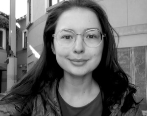
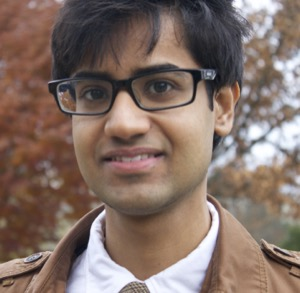

All sessions will take place at the Joyce Cummings Center, Tufts University unless otherwise noted.

* [Monday, August 1, 2022](#monday-august-1-2022)
* [Tuesday, August 2, 2022](#tuesday-august-2-2022)
* [Wednesday, August 3, 2022](#wednesday-august-3-2022)
* [Thursday, August 4, 2022](#thursday-august-4-2022)
* [Friday, August 5, 2022](#friday-august-5-2022)

## Monday, August 1, 2022

### 8:30–9:00am
Breakfast is served 

### 9:00–9:30am 
**Welcome and Introduction from Jesse Thaler, IAIFI Director**

### 9:30–10:30am

**Foundations of Geometric Deep Learning I**

The success of deep learning applied to images, speech, and text has spurred research into the application of similar techniques to other kinds of data, such as graphs, points clouds, data on homogeneous spaces and other manifolds. This field has come to be known as geometric deep learning. In this talk I will discuss the foundations of GDL, focusing on the basic concepts of symmetry groups, representations, and equivariant maps, as well as group & gauge equivariant convolutions for fields over homogeneous spaces and general manifolds.

*Taco Cohen, Research Scientist, Qualcomm Research Netherlands*

### 10:30–11:00am
Coffee break

### 11:00am–12:00pm

**Representations, networks, and symmetries for learning from particle physics data**

In experimental high energy physics (HEP), we collide high energy particle beams millions of times per second and observe the remnants of the collisions with hundreds of millions of detector channels. There is a growing interest in exploiting machine learning methods to extract physics from this raw detector data. In order to benefit from modern deep learning algorithms initially designed for computer vision or natural language processing tasks, it is common practice to transform HEP data into tabular data, images, or sequences. In this lecture, I will review these machine learning methods, as well as emerging methods like graph neural networks and symmetry-equivariant networks, which provide alternative ways of incorporating specialized domain knowledge.

*Javier Duarte, Assistant Professor, University of California, San Diego*

*As part of the CMS experiment at the CERN Large Hadron Collider, Javier Duarte's group performs measurements of high-momentum Higgs bosons and searches for exotic new physics. They are also interested in hardware-accelerated machine learning for trigger and computing as well as geometric deep learning for particle physics.*

### 12:00pm–1:00pm
Lunch

### 1:00–2:00pm

**Tutorial I for Foundations of Geometric Deep Learning**

*Denis Boyda, Incoming IAIFI Fellow*

*Denis Boyda has been working on the application of the Machine Learning method to simulations of physical systems and bringing physical ideas to Machine Learning. His research is devoted to developing algorithms enabling simulations of nuclear and particle physics which are currently computationally intractable. Denis Boyda is interested in the Monte Carlo techniques and generation modeling. He develops equivariant models which respect the symmetry of a target problem and runs simulations at leading supercomputer machines.*

### 2:00–3:00pm

**Tutorial I for Representations, networks, and symmetries for learning from particle physics data**

*Dylan Rankin, Postdoc, MIT/IAIFI* 

### 3:00–4:00pm
Break

### 4:00–6:00pm 
Welcome Dinner

## Tuesday, August 2, 2022

### 8:30–9:00am
Breakfast is served 

### 9:00–9:30am 
**Lightning Talks**

### 9:30–10:30am

**Foundations of Geometric Deep Learning II**

The success of deep learning applied to images, speech, and text has spurred research into the application of similar techniques to other kinds of data, such as graphs, points clouds, data on homogeneous spaces and other manifolds. This field has come to be known as geometric deep learning. In this talk I will discuss the foundations of GDL, focusing on the basic concepts of symmetry groups, representations, and equivariant maps, as well as group & gauge equivariant convolutions for fields over homogeneous spaces and general manifolds.

*Taco Cohen, Research Scientist, Qualcomm Research Netherlands*

### 10:30–11:00am
Coffee break

### 11:00am–12:00pm

**Model compression and fast machine learning in particle physics**

Efficient machine learning implementations optimized for inference in hardware have wide-ranging benefits, from lower inference latency to higher data throughput and reduced energy consumption. In this lecture, I will give an overview of effective techniques for reducing computation in neural networks, including pruning, or removing insignificant synapses, quantization, or reducing the precision of the calculations, and knowledge distillation, or transferring the knowledge from a large model to a smaller model. I will also review the connections to the lottery ticket hypothesis, interpretability, neural efficiency, robustness, and generalizability.

*Javier Duarte, Assistant Professor, University of California, San Diego*

*As part of the CMS experiment at the CERN Large Hadron Collider, Javier Duarte's group performs measurements of high-momentum Higgs bosons and searches for exotic new physics. They are also interested in hardware-accelerated machine learning for trigger and computing as well as geometric deep learning for particle physics.*

### 12:00pm–1:00pm
Lunch

### 1:00–2:00pm

**Tutorial II for Foundations of Geometric Deep Learning**

*Denis Boyda, Incoming IAIFI Fellow*

*Denis Boyda has been working on the application of the Machine Learning method to simulations of physical systems and bringing physical ideas to Machine Learning. His research is devoted to developing algorithms enabling simulations of nuclear and particle physics which are currently computationally intractable. Denis Boyda is interested in the Monte Carlo techniques and generation modeling. He develops equivariant models which respect the symmetry of a target problem and runs simulations at leading supercomputer machines.*

### 2:00–3:00pm

**Tutorial II for Model compression and fast machine learning in particle physics**

*Dylan Rankin, Postdoc, MIT/IAIFI* 

### 3:00–3:30pm
Coffee break

### 3:30–4:30pm 

**Deep learning in the large-width regime I**

We will review some of the foundational connections that arise between deep neural networks and other classic machine learning methods, albeit modified with new ingredients, in the limit where the neural network hidden layers have many nodes. These connections have been used across different research areas, including in the development of deep learning theory; in building new connections between machine learning and statistical physics; as well as in machine learning practice, including applications to physics. In the tutorials, we will gain experience with neural network libraries built to enable the recursive computations that form the core of these connections.

*Yasaman Bahri, Research Scientist, Google Research (Brain Team)*

*Yasaman Bahri is a Research Scientist at Google Brain working at the interface of machine learning and physical science, with a recent focus on the foundations of deep learning. She obtained her PhD (2017) at UC Berkeley in theoretical condensed matter physics. Her work is multidisciplinary in nature, and she has received recognition & given invited lectures in both physics and computer science. Most recently, she was a recipient of the Rising Stars Award in EECS (2020).*

## Wednesday, August 3, 2022

### 8:30–9:00am
Breakfast is served 

### 9:00–9:30am 
Lightning Talks

### 9:30–10:30am

**Deep learning in the large-width regime II**

We will review some of the foundational connections that arise between deep neural networks and other classic machine learning methods, albeit modified with new ingredients, in the limit where the neural network hidden layers have many nodes. These connections have been used across different research areas, including in the development of deep learning theory; in building new connections between machine learning and statistical physics; as well as in machine learning practice, including applications to physics. In the tutorials, we will gain experience with neural network libraries built to enable the recursive computations that form the core of these connections.

*Yasaman Bahri, Research Scientist, Google Research (Brain Team)*

*Yasaman Bahri is a Research Scientist at Google Brain working at the interface of machine learning and physical science, with a recent focus on the foundations of deep learning. She obtained her PhD (2017) at UC Berkeley in theoretical condensed matter physics. Her work is multidisciplinary in nature, and she has received recognition & given invited lectures in both physics and computer science. Most recently, she was a recipient of the Rising Stars Award in EECS (2020).*

### 10:30–11:00am
Coffee break

### 11:00am–12:00pm

**Machine Learning for Beyond-the-Standard-Model Physics I**

These lectures aim to give an overview on how we can tackle questions in Beyond-The-Standard-Model (BSM) physics using Machine Learning (ML). I will discuss a few types of questions to showcase how ML approaches can be adapted to fit into standard physics pipelines:
    1. How can we understand the pattern of experimentally viable BSM theories? Such models feature on the one hand consistency conditions from their respective UV-completion selecting a subset of theories at low-energies. On the other hand, the requirement of matching observations at low-energies poses apriori unknown constraints on the UV parameters, a classic inverse problem. I discuss how ML can help in addressing this inverse problem. A short preview can be obtained at 2111.11466.
    2. How can we phrase the search for mathematical structures as optimisation problems? This is to discuss how we can identify the symmetries associated to a dynamical system using ML and how we can accelerate the search for solutions of PDEs using ML. References of interest for this part are: 1906.01563, 2104.14444, 2003.13679, 2012.04656
    3. How can we use ML to accelerate the physics inference pipeline? Depending on time, this part will feature heavily in the tutorials.

*Sven Krippendorf, Senior Researcher, Mathematical Physics and String Theory, Ludwig-Maximilians Universität*

*Dr Sven Krippendorf is a senior researcher at LMU Munich. His research interests are at the interface of physics and machine learning, using machine learning to gain insights into fundamental physics and to use the theoretical physicist’s toolbox to understand the dynamics of neural networks. In teaching, he is currently working towards the realisation of a new Master’s degree in physics with a specialisation in artificial intelligence at LMU Munich.*

### 12:00pm–1:00pm
Lunch

### 1:00–3:00pm

**Tutorial for Deep learning in the large-width regime**

*Anna Golubeva, IAIFI Fellow*

*Anna is currently a postdoctoral fellow at IAIFI, working on developing a theoretical foundation of deep learning with methods from statistical physics. She obtained her PhD in 2021 at the Perimeter Institute for Theoretical Physics and the University of Waterloo, where she was advised by Roger Melko. During her PhD, she was also a graduate affiliate at the Vector Institute for AI in Toronto. Previously, she completed the Perimeter Scholars International master’s program (2017), a MSc in Theoretical Physics with focus on computational approaches to quantum many-body systems (2016), and a BSc in Biophysics (2014) at the Goethe University in Frankfurt, Germany.*

### 3:00–3:30pm
Coffee break

### 3:30–4:30pm 
**Career Panel**

## Thursday, August 4, 2022

### 8:30–9:00am
Breakfast is served 

### 9:00–9:30am 
Lightning Talks

### 9:30–10:30am

**Machine Learning for Beyond-the-Standard-Model Physics II**

These lectures aim to give an overview on how we can tackle questions in Beyond-The-Standard-Model (BSM) physics using Machine Learning (ML). I will discuss a few types of questions to showcase how ML approaches can be adapted to fit into standard physics pipelines:
    1. How can we understand the pattern of experimentally viable BSM theories? Such models feature on the one hand consistency conditions from their respective UV-completion selecting a subset of theories at low-energies. On the other hand, the requirement of matching observations at low-energies poses apriori unknown constraints on the UV parameters, a classic inverse problem. I discuss how ML can help in addressing this inverse problem. A short preview can be obtained at 2111.11466.
    2. How can we phrase the search for mathematical structures as optimisation problems? This is to discuss how we can identify the symmetries associated to a dynamical system using ML and how we can accelerate the search for solutions of PDEs using ML. References of interest for this part are: 1906.01563, 2104.14444, 2003.13679, 2012.04656
    3. How can we use ML to accelerate the physics inference pipeline? Depending on time, this part will feature heavily in the tutorials.

*Sven Krippendorf, Senior Researcher, Mathematical Physics and String Theory, Ludwig-Maximilians Universität*

*Dr Sven Krippendorf is a senior researcher at LMU Munich. His research interests are at the interface of physics and machine learning, using machine learning to gain insights into fundamental physics and to use the theoretical physicist’s toolbox to understand the dynamics of neural networks. In teaching, he is currently working towards the realisation of a new Master’s degree in physics with a specialisation in artificial intelligence at LMU Munich.*

### 10:30–11:00am
Coffee break

### 11:00am–12:00pm

**Machine learning for many-body physics I**

Over the past few years, machine learning (ML) has emerged as a powerful computational tool to tackle complex problems in various scientific disciplines. In particular, ML has been successfully used to mitigate the exponential complexity often encountered in many-body physics, the study of properties of quantum and classical systems built from a large number of interacting particles. In these lectures, we review some applications of ML in statistical mechanics, condensed matter physics, and quantum information. We will discuss select examples drawing from ML areas including supervised machine learning of phase transitions, unsupervised learning of quantum states, and the variational Monte Carlo method for approximating the ground state of a many-body Hamiltonian. For each algorithm, we briefly review the key ingredients and their corresponding implementation and show numerical experiments for a system of interacting Rydberg atoms in two dimensions among other systems. 

*Juan Carrasquilla, Research Scientist, Vector Institute; Adjunct Assistant Professor, University of Waterloo*

*Juan Felipe Carrasquilla Álvarez is a research scientist at the Vector Institute and a Canada CIFAR artificial intelligence chair. Juan’s research interests are at the intersection of condensed matter physics, quantum computing, and machine learning. He completed his Ph.D. in Physics at SISSA and held postdoctoral positions at Georgetown University and the Perimeter Institute, as well as a research scientist position at D-Wave Systems Inc.*

### 12:00pm–1:00pm
Lunch

### 1:00–3:00pm

**Tutorial for Machine Learning for Beyond-the-Standard-Model Physics: Modeling and inference: connecting theory and data**

Principled comparison of theory with observations is a bedrock of the scientific method, underlying in particular how information about fundamental physics can be extracted from data. Using contemporary physics examples, these hands-on tutorials will introduce strategies for defining statistical models, implementing them as (differentiable) probabilistic programs, and performing inference on them. Various inference methods will be discussed, including sampling-based (e.g., Markov Chain Monte Carlo), variational inference and, time permitting, simulation-based ("likelihood-free") inference.

*Siddharth Mishra-Sharma, IAIFI Fellow*

*Siddharth is an IAIFI Fellow at MIT interested in developing novel statistical methods for accelerating the discovery of new physics in astrophysical and cosmological observations at all accessible scales.  He is especially focused on developing analysis techniques based on machine learning that enable new ways of searching for signatures of physics beyond the Standard Model, in particular the nature of dark matter, using data from ongoing and upcoming cosmological surveys.*

### 3:00–3:30pm
Coffee break

### 3:30–4:30pm 

**Tutorial I for Machine learning for many-body physics**

*Di Luo, IAIFI Fellow*

*Di Luo received his undergraduate degree with majors in physics and mathematics from the University of Hong Kong in 2016. He graduated with master degree in mathematics and Ph.D. degree in physics at the University of Illinois, Urbana-Champaign in 2021. Di Luo is currently an IAIFI Fellow at the NSF AI Institute for Artificial Intelligence and Fundamental Interactions.*

### 4:30–6:00
Break

### 6:00–8:00
Pizza social with IAIFI at Harvard University

## Friday, August 5, 2022

### 8:30–9:00am
Breakfast is served 

### 9:00–9:30am 
Lightning Talks

### 9:30–10:30am

**Machine learning for many-body physics II**

Over the past few years, machine learning (ML) has emerged as a powerful computational tool to tackle complex problems in various scientific disciplines. In particular, ML has been successfully used to mitigate the exponential complexity often encountered in many-body physics, the study of properties of quantum and classical systems built from a large number of interacting particles. In these lectures, we review some applications of ML in statistical mechanics, condensed matter physics, and quantum information. We will discuss select examples drawing from ML areas including supervised machine learning of phase transitions, unsupervised learning of quantum states, and the variational Monte Carlo method for approximating the ground state of a many-body Hamiltonian. For each algorithm, we briefly review the key ingredients and their corresponding implementation and show numerical experiments for a system of interacting Rydberg atoms in two dimensions among other systems. 

*Juan Carrasquilla, Research Scientist, Vector Institute; Adjunct Assistant Professor, University of Waterloo*

*Juan Felipe Carrasquilla Álvarez is a research scientist at the Vector Institute and a Canada CIFAR artificial intelligence chair. Juan’s research interests are at the intersection of condensed matter physics, quantum computing, and machine learning. He completed his Ph.D. in Physics at SISSA and held postdoctoral positions at Georgetown University and the Perimeter Institute, as well as a research scientist position at D-Wave Systems Inc.*

### 10:30–11:00am
Coffee break

### 11:00am–12:00pm

*Tutorial II for Machine learning for many-body physics**

*Di Luo, IAIFI Fellow*

*Di Luo received his undergraduate degree with majors in physics and mathematics from the University of Hong Kong in 2016. He graduated with master degree in mathematics and Ph.D. degree in physics at the University of Illinois, Urbana-Champaign in 2021. Di Luo is currently an IAIFI Fellow at the NSF AI Institute for Artificial Intelligence and Fundamental Interactions.*

### 12:00pm–1:00pm
Lunch

### 1:00–5:00pm
Mini-hackathon (details to come)
