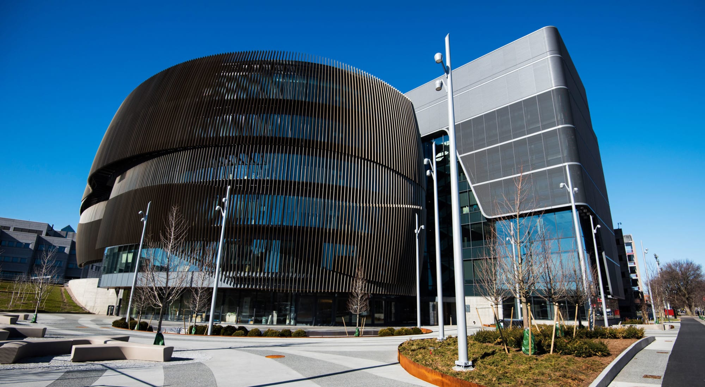
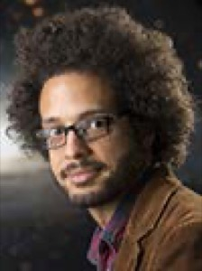

 

# IAIFI Summer Workshop 2023

 
The IAIFI Summer Workshop brings together researchers from across Physics and AI for five days of plenary talks, poster sessions, and networking to promote research at the intersection of Physics and AI. 
* **August 14–18, 2023**
* **Northeastern University, Interdisciplinary Science and Engineering Complex**
* **Registration deadline: July 10, 2023** 

We have extended the deadline to [submit a poster](https://t.co/AmNkXRoWeg).  Submit by July 17, 2023 for full consideration!
{:.success}

[Registration](https://iaifi-workshop-reg-fee.mit.edu/registration){:.button.button--outline-primary.button--pill.button--lg} [Agenda](#agenda){:.button.button--outline-primary.button--pill.button--lg} [Speakers](#speakers){:.button.button--outline-primary.button--pill.button--lg} [Accommodations](#accommodations){:.button.button--outline-primary.button--pill.button--lg}  [FAQ](#faq){:.button.button--outline-primary.button--pill.button--lg}  [Past Workshops](\past-workshops.html){:.button.button--outline-primary.button--pill.button--lg}

## About
The Institute for Artificial Intelligence and Fundamental Interactions (IAIFI) is enabling physics discoveries and advancing foundational AI through the development of novel AI approaches that incorporate first principles, best practices, and domain knowledge from fundamental physics. The goal of the Workshop is to serve as a meeting place to facilitate advances and connections across this growing interdisciplinary field.

  <!--
-->

  

    
    

      
Research

    

  

  

    
    

      
Networking

    

  

  

    
    

      
Community

    

  

  <!--
  

  -->

## Agenda
*This agenda is subject to change.*

 

### Monday, August 14, 2023
**8:30–9:00 am ET**

Welcome/Introduction

**9:00 am–9:45 am ET**

Learning to Break Symmetry with Symmetry Preserving Neural Networks, Tess Smidt (MIT/IAIFI)

Abstract

<em>Abstract to come</em>

**9:45–10:30 am ET**

Uncertainty and Interpretability in Machine Learning Models, Joshua Speagle (University of Toronto)

Abstract

<em>In science, we are often concerned with not just whether our ML model performs well, but on understanding how robust our results are, how to interpret them, and what we might be learning in the presence of observational uncertainties. I will provide an overview of various approaches to help address these challenges in both specific and general settings.</em>

**10:30–11:00 am ET**

Break

**11:00–11:45 am ET**

Variational Monte Carlo with Large Patched Transformers, Stef Czischek (University of Ottawa)

Abstract

<em>Large language models, like transformers, have recently demonstrated immense powers in text and image generation. This success is driven by the ability to capture long-range correlations between elements in a sequence. The same feature makes the transformer a powerful wavefunction ansatz that addresses the challenge of describing correlations in simulations of qubit systems. In this talk I consider two-dimensional Rydberg atom arrays to demonstrate that transformers reach higher accuracies than conventional recurrent neural networks for variational ground state searches. I further introduce large, patched transformer models, which consider a sequence of large atom patches, and show that this architecture significantly accelerates the simulations.</em>

**11:45 am–12:30 pm ET**

TBA

**12:30–2:00 pm ET**

Lunch

**2:00–3:00 pm ET**

Contributed Talks Session I

Details

<em>Details to come</em>

**3:00–3:30 pm ET**

Break

**3:30–4:15 pm ET**

Machine Learning at the Edge of Particle Physics, Javier Duarte (UCSD)

Abstract

<em>Ten years ago, the discovery of the Higgs boson confirmed the existence of a new kind of field, the Higgs field, which fills the universe. Measuring the interactions of the Higgs boson is necessary to confirm the standard model of particle physics, and any deviations from our expectations may give a critical hint for new laws of physics. At the CERN LHC, we collide protons at nearly the speed of light and analyze the debris from the collisions to learn about elementary particles like the Higgs boson. In this presentation, I will explain how we are developing machine learning methods to confront two major, and related, challenges at the LHC: (1) searching for the elusive Higgs boson self-interaction and (2) quickly filtering millions of collisions per second on field-programmable gate arrays (FPGAs) in pursuit of new physics.</em>

**4:15–5:30 pm ET**

Poster Session

Details

<em>Details to come.</em>

**6:00–8:00 pm ET**
Welcome Dinner

### Tuesday, August 8, 2023

**9:00 am–9:45 am ET**

Deep learning theory beyond the static kernel limit, Cengiz Pehlevan (Harvard/IAIFI)

Abstract

<em>Abstract to come</em>

**9:45–10:30 am ET**

Effective Theory of Transformers, Sho Yaida (Meta)

Abstract

<em>Large neural networks perform extremely well in practice, providing the backbone of modern machine learning. Theoretical analyses of these large models suggest particular scaling strategies, specifically for initialization and training hyperparameters. This talk walks through these suggestions for the concrete case of Transformers and mentions some of its practical implications.</em>

**10:30–11:00 am ET**

Break

**11:00–11:45 am ET**

Title TBA, Yasaman Bahri (Google Brain)

Abstract

<em>Abstract to come</em>

**11:45 am–12:30 pm ET**

Title TBA, Jascha Sohl-Dickstein (Google Brain)

Abstract

<em>Abstract to come</em>

**12:30–2:00 pm ET**

Lunch

**2:00–3:00 pm ET**

Contributed Talks Session II

Details

<em>Details to come</em>

**3:00–3:30 pm ET**

Break

**3:30–4:15 pm ET**

From inference to discovery with AI in the physical sciences, Ben Wandelt (Sorbonne University/Flatiron Institute)

Abstract

<em>Abstract to come</em>

**4:15–5:00 pm ET**

Architecture Selection and Initialization for Graph Neural Networks, Boris Hanin (Princeton)

Abstract

<em>Graph neural networks (GNNs) are an important class of machine learning models designed for learning from graph-structured datasets, such as those from high energy physics, chemistry, genomics/genetics, and so on. In this talk, I will discuss recent work, joint with Gage DeZoort, in which we theoretically derive and empirically validate principles for architecture selection and initialization schemes in GNNs that provably avoid a range of common failure modes early in training.</em>

### Wednesday, August 9, 2023

**9:00 am–9:45 am ET**

The Strengths and Limitations of Equivariant Neural Networks, Robin Walters (Northeastern)

Abstract

<em>Abstract to come</em>

**9:45–10:30 am ET**

Generative Diffusion Models: From Foundations to Applications in Digital Content Creation, Karsten Kreis (NVIDIA)

Abstract

<em>Denoising diffusion-based generative models, rooted in physics, have led to multiple breakthroughs in deep generative learning. In this talk, I will provide an overview over recent works by NVIDIA on diffusion models and their applications for image, video, and 3D content creation. I will start with a short introduction to diffusion models and discuss large-scale text-to-image generation. I will also highlight different efforts on 3D generative modeling as well as high-resolution video generation with video latent diffusion models. Moreover, I will discuss techniques for smoother and faster diffusion, inspired by ideas in physics, for accelerated and high-performance generation.</em>

**10:30–11:00 am ET**

Break

**11:00–11:45 am ET**

Diffusion Generative Models in Collider Physics, Vinicius Mikuni (NERSC)

Abstract

<em>Abstract to come</em>

**11:45 am–12:30 pm ET**

Generative models for first-principles theoretical physics calculations, Phiala Shanahan(MIT/IAIFI)

Abstract

<em>In the context of lattice quantum field theory calculations in particle and nuclear physics, I will describe avenues to accelerate sampling from known probability distributions using machine learning. I will focus in particular on flow-based generative models, and describe how guarantees of exactness and the incorporation of complex symmetries into model architectures can be achieved. I will show the results of proof-of-principle studies that demonstrate that sampling from generative models can be orders of magnitude more efficient than traditional sampling approaches such as Hamiltonian/hybrid Monte Carlo in this context, and discuss the potential impacts of these approaches in nuclear and particle physics.</em>

**12:30–2:00 pm ET**

Lunch

**2:00–2:45 pm ET**

Title TBA, Miranda Cheng (University of Amsterdam)

Abstract

<em>Abstract to come</em>

**2:45–3:30 pm ET**

Break

**3:30–4:15 pm ET**

Renormalizing Diffusion Models, Semon Rezchikov (Princeton)

Abstract

<em>Abstract to come</em>

**4:15–5:00 pm ET**

Renormalisation and Inference, David Berman (Queen Mary University/Cambridge Consultants

Abstract

<em>This talk will describe the link between exact renormalisation group flow and statistical inference. The basic idea being that inference incorporates data into a model while renormalisation throws information away.</em>

### Thursday, August 10, 2023

**9:00 am–9:45 am ET**

Towards a phenomenological understanding of neural networks, Sven Krippendorf (Ludwig-Maximillian University)

Abstract

<em>Abstract to come</em>

**9:45–10:30 am ET**

Machine learning Calabi Yau metrics, Magdalena Larfors (Uppsala University)

Abstract

<em>Abstract to come.</em>

**10:30–11:00 am ET**

Break

**11:00–11:45 am ET**

Learning BPS spectra, Sergei Gukov (California Institute of Technology)

Abstract

<em>Abstract to come</em>

**11:45 am–12:30 pm ET**

Learning from Topology: Cosmological Parameter Inference from the Large-scale Structure, Gary Shiu (University of Wisconsin-Madison)

Abstract

<em>Abstract to come.</em>

**12:30–2:00 pm ET**

Lunch

**2:00–3:00 pm ET**

Contributed Talks Session III

Details

<em>Details to come</em>

**3:00–3:30 pm ET**

Break

**3:30–4:15 pm ET**

Machine Learning for Fundamental Physics: From the Smallest to the Largest Scales, David Shih (Rutgers University)

Abstract

<em>Abstract to come</em>

**4:15–5:00 pm ET**

Improving Energy Conserving Descent Optimization: Theory to Practice, Eva Silverstein (Stanford)

Abstract

<em>Abstract to come</em>

### Friday, August 11, 2023

**9:00 am–9:45 am ET**

Title TBA, Brian Nord (Fermilab)

Abstract

<em>Abstract to come</em>

**9:45–10:30 am ET**

Facets of Responsible Machine Learning, Flavio du Pin Calmon (Harvard)

Abstract

<em>This talk overviews recent results in two aspects of fair machine learning. First, we introduce a post-processing technique, "FairProjection," designed to ensure group fairness in prediction and classification. This method applies to any classifier without requiring retraining and attains state-of-the-art performance in both accuracy and group fairness assurance in probabilistic classification. We also present converse results based on Blackwell's "comparison of experiments" theorem that capture the limits of group-fairness assurance in classification. Second, we overview the concept of predictive multiplicity in machine learning. Predictive multiplicity arises when different classifiers achieve similar average performance for a specific learning task, yet produce conflicting predictions for individual samples.</em>

**10:30–11:00 am ET**

Break

**11:00–11:45 am ET**

AI-assisted sensing & control at gravitational wave observatories, Nikhil Mukund (MIT/IAIFI)

Abstract

<em>Abstract to come</em>

**11:45 am–12:30 pm ET**

TBA

Abstract

<em>Abstract to come.</em>

**12:30–2:00 pm ET**

Lunch

**2:00–2:45 pm ET**

Symbolic Distillation of Neural Networks for New Physics Discovery, Miles Cranmer (University of Cambridge)

Abstract

<em>Abstract to come</em>

**2:45–3:30 pm ET**

From Pixels to Neutrinos, Taritree Wongjirad (Tufts/IAIFI)

Abstract

<em>Abstract to come</em>

**3:30–4:00 pm ET**

Closing

## Speakers
The following speakers have accepted invitations to give plenary talks at this year's workshop. We will continue to add to the list as speakers accept. 

  <!--
-->

     

         
         

         

         <a href="https://research.google/people/YasamanBahri/">Yasaman Bahri</a>
         

         

         <em> Research Scientist, Google Brain </em>  
         

         

       

     

         
         

         

         <a href="https://www.qmul.ac.uk/spcs/staff/academics/profiles/dsberman.html">David Berman</a>
         

         

         <em> Professor, Queen Mary University; Head of AI, Cambridge Consultants </em>  
         

         

       

     

         
         

         

         <a href="https://www.uva.nl/en/profile/c/h/c.n.cheng/c.n.cheng.html">Miranda Cheng</a>
         

         

         <em> Faculty of Science, University of Amsterdam </em>  
         

         

       

     

         
         

         

         <a href="https://astroautomata.com">Miles Cranmer</a>
         

         

         <em> Assistant Professor of Data Intensive Science, University of Cambridge </em>  
         

         

       

     

         
         

         

         <a href="https://www.uottawa.ca/faculty-science/professors/stefanie-czischek">Stefanie Czischek</a>
         

         

         <em> Assistant Professor, University of Ottawa </em>  
         

         

       

     

         
         

         

         <a href="https://people.seas.harvard.edu/~flavio/">Flavio du Pin Calmon</a>
         

         

         <em> Assistant Professor, Harvard </em>  
         

         

       

     

         
         

         

         <a href="https://www-physics.ucsd.edu/Directory/Person/552">Javier Duarte</a>
         

         

         <em> Assistant Professor, University of California, San Diego </em>  
         

         

       

     

         
         

         

         <a href="http://theory.caltech.edu/~gukov/">Sergei Gukov</a>
         

         

         <em> Professor, California Institute of Technology </em>  
         

         

       

     

         
         

         

         <a href="https://boris-hanin.github.io">Boris Hanin</a>
         

         

         <em> Assistant Professor, Princeton </em>  
         

         

       

     

         
         

         

         <a href="http://people.csail.mit.edu/stefje/">Stefanie Jegelka</a>
         

         

         <em> Associate Professor, MIT </em>  
         

         

       

     

         
         

         

         <a href="https://karstenkreis.github.io">Karsten Kreis</a>
         

         

         <em> Senior Research Scientist, NVIDIA </em>  
         

         

       

     

         
         

         

         <a href="https://krippendorflab.github.io">Sven Krippendorf</a>
         

         

         <em> Senior Researcher, Ludwig-Maximilian University </em>  
         

         

       

     

         
         

         

         <a href="https://www.katalog.uu.se/profile/?id=N3-1163">Magdalena Larfors</a>
         

         

         <em> Senior Lecturer/Associate Professor, Uppsala University </em>  
         

         

       

     

         
         

         

         <a href="https://www.nersc.gov/about/nersc-staff/nesap-postdocs/vinicius-mikuni/">Vinicius Mikuni</a>
         

         

         <em> Postdoctoral Fellow, NERSC </em>  
         

         

       

     

         
         

         

         <a href="https://space.mit.edu/people/mukund-nikhil/">Nikhil Mukund</a>
         

         

         <em> Postdoctoral Scholar, MIT Kavli Institute </em>  
         

         

       

     

         
         

         

         <a href="https://briandnord.com/">Brian Nord</a>
         

         

         <em> Research Scientist, Fermilab </em>  
         

         

       

     

         
         

         

         <a href="https://pehlevan.seas.harvard.edu/">Cengiz Pehlevan</a>
         

         

         <em> Assistant Professor, Harvard </em>  
         

         

       

     

         
         

         

         <a href="https://www.rezchikov.me">Semon Rezchikov</a>
         

         

         <em> Research Instructor and NSF Postdoctoral Fellow, Princeton University </em>  
         

         

       

     

         
         

         

         <a href="https://physics.mit.edu/faculty/phiala-shanahan/">Phiala Shanahan</a>
         

         

         <em> Associate Professor, MIT </em>  
         

         

       

     

         
         

         

         <a href="https://physics.rutgers.edu/people/faculty-list/faculty-profile/shih-david">David Shih</a>
         

         

         <em> Professor, Rutgers University </em>  
         

         

       

     

         
         

         

         <a href="https://www.physics.wisc.edu/directory/shiu-gary/">Gary Shiu</a>
         

         

         <em> Professor, University of Wisconsin-Madison </em>  
         

         

       

     

         
         

         

         <a href="https://sitp.stanford.edu/people/eva-silverstein">Eva Silverstein</a>
         

         

         <em> Professor, Stanford University </em>  
         

         

       

     

         
         

         

         <a href="https://www.eecs.mit.edu/people/tess-smidt/">Tess Smidt</a>
         

         

         <em> Assistant Professor, MIT </em>  
         

         

       

     

         
         

         

         <a href="http://www.sohldickstein.com">Jascha Sohl-Dickstein</a>
         

         

         <em> Senior Staff Research Scientist, Google Brain </em>  
         

         

       

     

         
         

         

         <a href="https://joshspeagle.com/">Joshua Speagle</a>
         

         

         <em> Assistant Professor of Astrostatistics, University of Toronto </em>  
         

         

       

     

         
         

         

         <a href="https://www.khoury.northeastern.edu/people/robin-walters/">Robin Walters</a>
         

         

         <em> Assistant Professor, Khoury College of Computer Sciences, Northeastern University </em>  
         

         

       

     

         
         

         

         <a href="https://benwandelt.org">Ben Wandelt</a>
         

         

         <em> Professor, Sorbonne University and Senior Research Scientist, Flatiron Institute </em>  
         

         

       

     

         
         

         

         <a href="https://as.tufts.edu/physics/people/faculty/taritree-wongjirad">Taritree Wongjirad</a>
         

         

         <em> Assistant Professor, Tufts </em>  
         

         

       

     

         
         

         

         <a href="https://www.shoyaida.com">Sho Yaida</a>
         

         

         <em> Research Scientist, Meta </em>  
         

         

       

  <!--
  

  -->

 

## Accommodations
We have made arrangements for discounted accommodations at the following locations: 
* [Boston University Housing](https://www.bu.edu/housing/undergrad-housing/stuvi/10buick/), 10 Buick St, Boston, MA 02215
  * 96.00 USD per night
  * [Book a room](https://iaifi-stayatbu.eventbrite.com)
* [The Inn at Longwood Medical](https://www.innatlongwood.com), 342 Longwood Ave, Boston, MA 02115
  * 249.00 USD per night
  * [Book a room](https://be.synxis.com/?Hotel=58219&Chain=65&arrive=2023-08-12&depart=2023-08-19&adult=1&child=0&group=IAIF0823)

## FAQ 
* *Who can attend the Summer Workshop?* Any researcher working at or interested in the intersection of physics and AI is encouraged to attend the Summer Workshop. 
* *What is the cost to attend the Summer Worskhop?* The registration fee for the Summer Workshop is 250 USD and includes a welcome dinner, as well as coffee breaks.
* *If I come to the Summer School, can I also attend the Workshop?* Yes! We encourage you to stay for the Workshop and you can stay in the dorms for both events if you choose. 
* *Will the recordings of the talks be available?* We plan to share the talks on our [YouTube channel](https://www.youtube.com/channel/UCueoFcGm_15kSB-wDd4CBZA).

[Submit a question or comment](https://app.smartsheet.com/b/form/76c1d070d19d4688b65962c4ed190478){:.button.button--outline-primary.button--pill.button--sm}

## 2023 Organizing Committee 
* Jim Halverson, Chair (Northeastern University)
* Shuchin Aeron (Tufts)
* Denis Boyda (IAIFI Fellow)
* Anna Golubeva (IAIFI Fellow)
* Ouail Kitouni (MIT)
* Nayantara Mudur (Harvard)
* Sneh Pandya (Northeastern)
* Marisa LaFleur (IAIFI Project Manager)
