 

The 2024 IAIFI Summer Workshop will be held August 12–16, 2024 in Boston (exact location TBD). [Join our mailing list](http://mailman.mit.edu/mailman/listinfo/iaifi-news) to receive updates about the 2024 Summer Workshop!
{:.info}

# IAIFI Summer Workshop 2023

The IAIFI Summer Workshop brings together researchers from across Physics and AI for plenary talks, poster sessions, and networking to promote research at the intersection of Physics and AI. 

* The 2023 Summer Workshop was held **August 14–18, 2023**
* **Northeastern University, Interdisciplinary Science and Engineering Complex**
* **Registration deadline: July 31, 2023** 

Here's what attendees at the 2023 Summer Workshop had to say about the experience: 

<iframe width="560" height="315" src="https://www.youtube.com/embed/QRfdc-3o01g?si=oHLv6eRpGUnpe__2" title="YouTube video player" frameborder="0" allow="accelerometer; autoplay; clipboard-write; encrypted-media; gyroscope; picture-in-picture; web-share" allowfullscreen></iframe>

Videos of the plenary talks from the 2023 IAIFI Summer Workshop are [now available on YouTube](https://www.youtube.com/playlist?list=PLBY0ED2StbGalYxIbUNEK6ADuEv35W6ig).
{:.success}

<!--
We have extended the deadline to [submit a poster](https://t.co/AmNkXRoWeg).  Submit by July 17, 2023 for full consideration!
{:.success}
-->

[Agenda](#agenda){:.button.button--outline-primary.button--pill.button--lg} [Speakers](#speakers){:.button.button--outline-primary.button--pill.button--lg} [FAQ](#faq){:.button.button--outline-primary.button--pill.button--lg}  [Past Workshops](/past-workshops.html){:.button.button--outline-primary.button--pill.button--lg}

## About
The Institute for Artificial Intelligence and Fundamental Interactions (IAIFI) is enabling physics discoveries and advancing foundational AI through the development of novel AI approaches that incorporate first principles, best practices, and domain knowledge from fundamental physics. The goal of the Workshop is to serve as a meeting place to facilitate advances and connections across this growing interdisciplinary field.

<!--

-->
<!--

  

    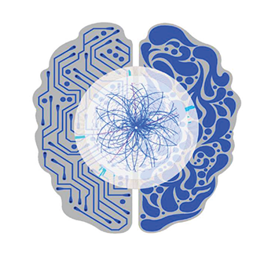
    

      
Research

    

  

-->

<!--

  

    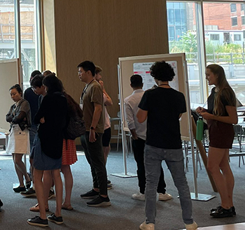
    

      
Networking

    

  

-->

<!--

  

    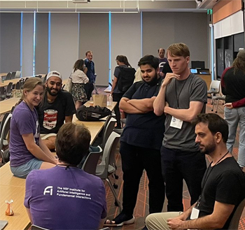
    

      
Community

    

  

-->

## Agenda
*This agenda is subject to change.*

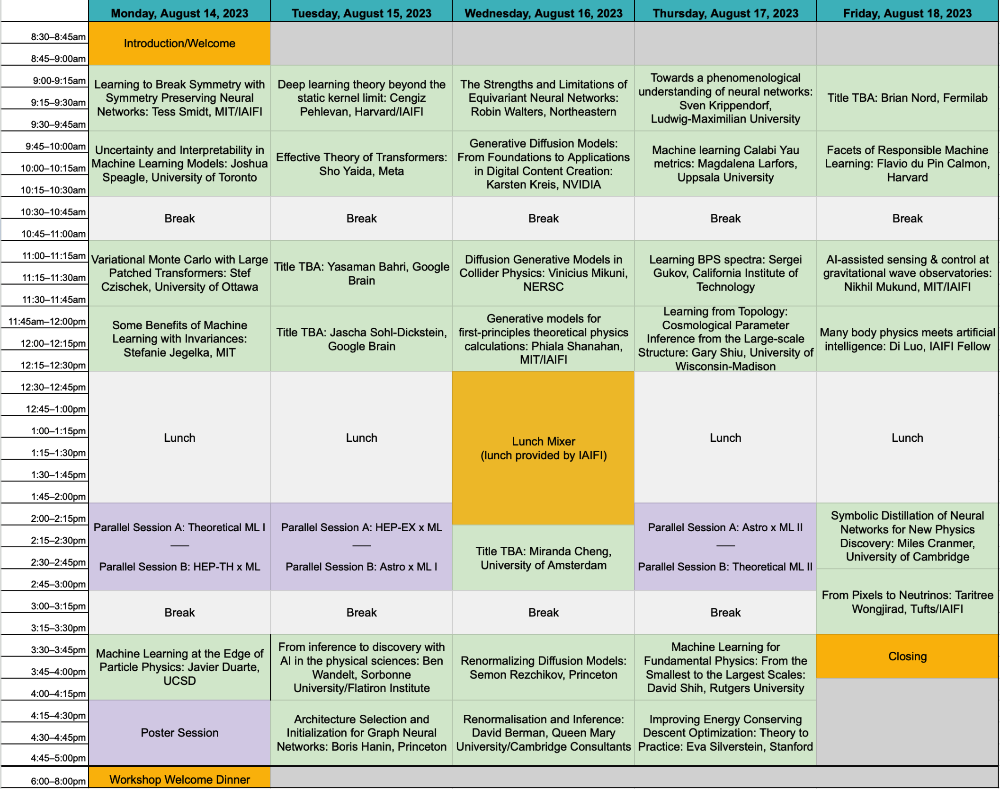 

### Monday, August 14, 2023
**8:30–9:00 am ET**

Welcome/Introduction

**9:00 am–9:45 am ET**

Intuition for the Data Types and Interactions in Euclidean Neural Networks, Tess Smidt (MIT/IAIFI)

Abstract

<em>3D Euclidean symmetry-equivariant neural networks (E(3)NNs) are emerging as an effective machine learning paradigm in molecular modeling, protein design, computer graphics, and beyond. In this talk, I'll discuss the fundamental building blocks of E(3)NNs and how these pieces are combined to create the growing zoo of E(3)NNs available today.</em>

**9:45–10:30 am ET**

Uncertainty and Interpretability in Machine Learning Models, Joshua Speagle (University of Toronto)

Abstract

<em>In science, we are often concerned with not just whether our ML model performs well, but on understanding how robust our results are, how to interpret them, and what we might be learning in the presence of observational uncertainties. I will provide an overview of various approaches to help address these challenges in both specific and general settings.</em>

**10:30–11:00 am ET**

Break

**11:00–11:45 am ET**

Stochastic Collapse: How Gradient Noise Attracts SGD Dynamics Towards Simpler Subnetworks, Daniel Kunin (Stanford University)

Abstract

<em>In this work, we reveal a strong implicit bias of stochastic gradient descent (SGD) that drives overly expressive networks to much simpler subnetworks, thereby dramatically reducing the number of independent parameters, and improving generalization. To reveal this bias, we identify invariant sets, or subsets of parameter space that remain unmodified by SGD. We focus on two classes of invariant sets that correspond to simpler subnetworks and commonly appear in modern architectures. Our analysis uncovers that SGD exhibits a property of stochastic attractivity towards these simpler invariant sets. We establish a sufficient condition for stochastic attractivity based on a competition between the loss landscape's curvature around the invariant set and the noise introduced by stochastic gradients. Remarkably, we find that an increased level of noise strengthens attractivity, leading to the emergence of attractive invariant sets associated with saddle-points or local maxima of the train loss. We observe empirically the existence of attractive invariant sets in trained deep neural networks, implying that SGD dynamics often collapses to simple subnetworks with either vanishing or redundant neurons. We further demonstrate how this simplifying process of stochastic collapse benefits generalization in a linear teacher-student framework. Finally, through this analysis, we mechanistically explain why early training with large learning rates for extended periods benefits subsequent generalization.</em>

**11:45 am–12:30 pm ET**

Some Benefits of Machine Learning with Invariances, Stefanie Jegelka (MIT)

Abstract

<em>In many applications, especially in the sciences, data and tasks have known invariances. Encoding such invariances directly into a machine learning model can improve learning outcomes, while it also poses challenges on efficient model design.
In the first part of the talk, we will focus on the invariances relevant to eigenvectors and eigenspaces being inputs to a neural network. Such inputs are important, for instance, for graph representation learning. We will discuss targeted architectures that can universally express functions with the relevant invariances - sign flips and changes of basis - and their theoretical and empirical benefits. Second, we will take a broader, theoretical perspective. Empirically, it is known that encoding invariances into the machine learning model can reduce sample complexity. For the simplified setting of kernel ridge regression or random features, we will discuss new bounds that illustrate two ways in which invariances can reduce sample complexity. Our results hold for learning on manifolds and for invariances to (almost) any group action.</em>

**12:30–2:00 pm ET**

Lunch

**2:00–3:00 pm ET**

**Parallel Session A: Theoretical ML I (Auditorium)**

Nu Tangent Kernels, Akshunna S. Dogra (Imperial College London)

<em>The approximation and generalization capacity of deep learning models has been profitably leveraged across a staggeringly wide variety of tasks. In particular, appropriately initialized Neural Networks sampled from suitable functional spaces invariably find stages of exponential (or near-exponential) learning. We introduce $\nu$ - Tangent Kernels ($\nu$TKs), functional analytic objects partly inspired from the Neural Tangent Kernel (NTK), to build a generic theory for Neural Network optimization and generalization. Specifically, we prove that for a large category of well-posed and semi-well-posed problems, Neural Network based models are capable of exponentially learning the tasks at hand. Notably, these results are showcased for a much wider class of loss functions/architectures than the standard mean squared error/large width regime that is usually the focus of conventional NTK analysis, and apply to diverse practical problems solved using real networks such as differential equation solvers, shape recognition, classification, feature extraction, etc. We end by exemplifying the power of the $\nu$TK perspective by comparing expected vs empirically observed optimization profiles across different regimes.</em>

A Solvable Model of Neural Scaling Laws, Alexander Maloney (McGill University)

<em>Large language models with a huge number of parameters, when trained on near internet-sized number of tokens, have been empirically shown to obey neural scaling laws: specifically, their performance behaves predictably as a power law in either parameters or dataset size until bottlenecked by the other resource. To understand this better, we first identify the necessary properties allowing such scaling laws to arise and then propose a statistical model -- a joint generative data model and random feature model -- that captures this neural scaling phenomenology. By solving this model in the dual limit of large training set size and large number of parameters, we gain insight into (i) the statistical structure of datasets and tasks that lead to scaling laws, (ii) the way nonlinear feature maps, such as those provided by neural networks, enable scaling laws when trained on these datasets, (iii) the optimality of the equiparameterization scaling of training sets and parameters, and (iv) whether such scaling laws can break down and how they behave when they do. Key findings are the manner in which the power laws that occur in the statistics of natural datasets are extended by nonlinear random feature maps and then translated into power-law scalings of the test loss and how the finite extent of the data's spectral power law causes the model's performance to plateau.</em>

Grokking: a playground for feature learning, Darshil Doshi (University of Maryland)

<em>Grokking in machine learning is the phenomenon of delayed generalization; wherein the network memorizes the training data quickly, but takes a much longer training time to learn useful features and generalize. Grokking offers a unique playground to gain insight into feature learning and generalization. In my talk, I will present a minimal framework that recreates Grokking: training a 2-layer Fully-Connected Network on Modular Arithmetic data. In this setup, it is possible to write down an analytical solution that generalizes to a 100% accuracy. More excitingly, a network trained with gradient descent finds the same solution! I will discuss these special solutions and the corresponding features. Furthermore, I will describe grokking "transitions" with training time, training dataset size and model size. I will end the talk with some interesting open questions on the topic and our ongoing work.</em>

**Parallel Session B: HEP-TH x ML (Room 138)**

$λφ^4$ Scalar Neural Network Field Theory, Anindita Maiti (Harvard University)

<em>Neural Network (NN) architectures at initialization define field theories. Certain large width limits of architectures result in free field theories due to Central Limit Theorem (CLT); deviations from CLT via finite width, and correlated, dissimilar NN parameters turn on field interactions. Edgeworth method provides a way to construct NN field theory actions using connected Feynman diagrams, where internal vertices correspond to connected correlators of NN field theories. Further, specific interacting field theories can be engineered via the NN parameter framework, where non-Gaussianities due to statistical independence breaking of NN parameters tune the action deformations. As an example, I will present the construction of $λφ^4$ scalar field theory in infinite width NNs.</em>

Applying the Variational Principle to Quantum Field Theory with Neural-Networks, John Martyn (MIT)

<em>Physicists dating back to Feynman have lamented the difficulties of applying the variational principle to quantum field theories. In non-relativistic quantum field theories, the challenge is to parameterize and optimize over the infinitely many n-particle wave functions comprising the state's Fock space representation. Here we approach this problem by introducing neural-network quantum field states, a deep learning ansatz that enables application of the variational principle to non-relativistic quantum field theories in the continuum. Our ansatz uses the Deep Sets neural network architecture to simultaneously parameterize all of the n-particle wave functions comprising a quantum field state. We employ our ansatz to approximate ground states of various field theories, including an inhomogeneous system and a system with long-range interactions, thus demonstrating a powerful new tool for probing quantum field theories.</em>

Structures of Neural Network Effective Theories, Zhengkang Zhang (University of Utah)

<em>We develop a diagrammatic approach to effective field theories (EFTs) corresponding to deep neural networks at initialization, which dramatically simplifies computations of finite-width corrections to neuron statistics. The structures of EFT calculations make it transparent that a single condition governs criticality of all connected correlators of neuron preactivations. Understanding of such EFTs may facilitate progress in both deep learning and field theory simulations.</em>

Normalizing Flows for Effective String Theory, Elia Cellini (University of Turin / INFN Turin)

<em>Effective String Theory (EST) is a non-perturbative framework used to describe confinement in Yang-Mills theory through the modeling of the interquark potential in terms of vibrating strings. An efficient numerical method to simulate such theories where analytical studies are not possible is still lacking. However, in recent years a new class of deep generative models called Normalizing Flows (NFs) has been proposed to sample lattice field theories more efficiently than traditional Monte Carlo methods. In this talk, we show a proof of concept of the application of NFs to EST regularized on the lattice. Namely, we use as case study the Nambu-Goto string in order to use the well-known analytical results of this theory as a benchmark for our methods.</em>

**3:00–3:30 pm ET**

Break

**3:30–4:15 pm ET**

Machine Learning at the Edge of Particle Physics, Javier Duarte (UCSD)

Abstract

<em>Ten years ago, the discovery of the Higgs boson confirmed the existence of a new kind of field, the Higgs field, which fills the universe. Measuring the interactions of the Higgs boson is necessary to confirm the standard model of particle physics, and any deviations from our expectations may give a critical hint for new laws of physics. At the CERN LHC, we collide protons at nearly the speed of light and analyze the debris from the collisions to learn about elementary particles like the Higgs boson. In this presentation, I will explain how we are developing machine learning methods to confront two major, and related, challenges at the LHC: (1) searching for the elusive Higgs boson self-interaction and (2) quickly filtering millions of collisions per second on field-programmable gate arrays (FPGAs) in pursuit of new physics.</em>

**4:15–5:30 pm ET**

Poster Session

Details

<em>Details to come.</em>

**6:00–8:00 pm ET**
Welcome Dinner

### Tuesday, August 15, 2023

**9:00 am–9:45 am ET**

Deep learning theory beyond the static kernel limit, Cengiz Pehlevan (Harvard/IAIFI)

Abstract

<em>Learning dynamics of deep neural networks is complex. While previous approaches made advances in mathematical analysis of the dynamics of two-layer neural networks, addressing deeper networks have been challenging. In this talk, I will present a mean field theory of the learning dynamics of deep networks and discuss its implications.</em>

**9:45–10:30 am ET**

Effective Theory of Transformers, Sho Yaida (Meta)

Abstract

<em>Large neural networks perform extremely well in practice, providing the backbone of modern machine learning. Theoretical analyses of these large models suggest particular scaling strategies, specifically for initialization and training hyperparameters. This talk walks through these suggestions for the concrete case of Transformers and mentions some of its practical implications.</em>

**10:30–11:00 am ET**

Break

**11:00–11:45 am ET**

Variational Monte Carlo with Large Patched Transformers, Stef Czischek (University of Ottawa)

Abstract

<em>Large language models, like transformers, have recently demonstrated immense powers in text and image generation. This success is driven by the ability to capture long-range correlations between elements in a sequence. The same feature makes the transformer a powerful wavefunction ansatz that addresses the challenge of describing correlations in simulations of qubit systems. In this talk I consider two-dimensional Rydberg atom arrays to demonstrate that transformers reach higher accuracies than conventional recurrent neural networks for variational ground state searches. I further introduce large, patched transformer models, which consider a sequence of large atom patches, and show that this architecture significantly accelerates the simulations.</em>

**11:45 am–12:30 pm ET**

Learned optimizers: why they're the future, why they’re hard, and what they can do now, Jascha Sohl-Dickstein (Google Brain)

Abstract

<em>The success of deep learning has hinged on learned functions dramatically outperforming hand-designed functions for many tasks. However, we still train models using hand designed optimizers acting on hand designed loss functions. I will argue that these hand designed components are typically mismatched to the desired behavior, and that we can expect meta-learned optimizers to perform much better. I will discuss the challenges and pathologies that make meta-training learned optimizers difficult. These include: chaotic and high variance meta-loss landscapes; extreme computational costs for meta-training; lack of comprehensive meta-training datasets; challenges designing learned optimizers with the right inductive biases; challenges interpreting the method of action of learned optimizers. I will share solutions to some of these challenges. I will show experimental results where learned optimizers outperform hand-designed optimizers in many contexts, and I will discuss novel capabilities that are enabled by meta-training learned optimizers.</em>

**12:30–2:00 pm ET**

Lunch

**2:00–3:00 pm ET**

**Parallel Session A: HEP-EX x ML (Room 136)**

Is infrared-collinear safe information all you need for jet classification?, Dimitrios Athanasakos (YITP, Stony Brook)

<em>Machine learning-based jet classifiers are able to achieve impressive tagging performance in a variety of applications in high energy and nuclear physics. However, it remains unclear in many cases which aspects of jets give rise to this discriminating power, and whether jet observables that are tractable in perturbative QCD such as those obeying infrared-collinear (IRC) safety serve as sufficient inputs. In this article, we introduce a new classifier, Jet Flow Networks (JFNs), in an effort to address the question of whether IRC unsafe information provides additional discriminating power in jet classification. JFNs are permutation-invariant neural networks (deep sets) that take as input the kinematic information of reconstructed subjets. The subjet radius serves as a tunable hyperparameter, enabling the sensitivity to soft emissions and nonperturbative effects to be gradually increased as the subjet radius is decreased. We demonstrate the performance of JFNs for quark vs. gluon and QCD vs.  � Z jet tagging. For small subjet radii, the performance of JFNs is equivalent to the IRC-unsafe Particle Flow Networks (PFNs), demonstrating that infrared-collinear unsafe information is not necessary to achieve strong discrimination for both cases. As the subjet radius is increased, the performance of the JFNs remains essentially unchanged until physical thresholds that we identify are crossed. For relatively large subjet radii, we show that the JFNs may offer an increased model independence with a modest tradeoff in performance compared to classifiers that use the full particle information of the jet. These results shed new light onto how machines learn patterns in high-energy physics data.</em>

Machine Learning the Top Mass, Katherine Fraser (Harvard University)

<em>Measurements in particle colliders are often done by fitting data to simulation, which depends on many parameters. For the top quark mass in particular, these physical and unphysical parameters generate a source of error that must be profiled when fitting. In this talk, we discuss several methods for reducing this source of error, including the machine-learning method DCTR and a dense linearly-activated neural network. We also compare to histogram fits commonly used in experiment.</em>

Data-Driven Light Model for the MicroBooNE Experiment, Polina Abratenko (Tufts University)

<em>MicroBooNE is a short baseline neutrino oscillation experiment that employs Liquid Argon Time Projection Chamber (LArTPC) technology together with an array of Photomultiplier Tubes (PMTs), which detect scintillation light. This light detection is necessary for providing a means to reject cosmic ray background and trigger on beam-related interactions. Thus, accurate modeling of the expected optical detector signal is critical. Previous light models used on MicroBooNE have been simulation-based, which limits accuracy related to certain regions of the detector as well as different data conditions during runs. We present the status of a data-driven light model that uses a neural network to map the light yield in the MicroBooNE detector, allowing for specific conditioning based on MicroBooNE data.</em>

Using Machine Learning to Consolidate Input for DUNE’s 2x2 Prototype Near Detector, Jessie Micallef (IAIFI Fellow)

<em>The Deep Underground Neutrino Experiment (DUNE) aims to measure neutrino properties by detecting neutrinos as they travel 1300 km from Fermilab to Sanford Underground Research Facility (SURF). Understanding the composition of the neutrino beam at Fermilab is vital to make precision measurements at SURF, and thus a prototype of the near detector will soon begin testing. The state-of-the-art near detector prototype has some challenges for reconstructing particles, such as gaps between submodules inside the prototype detector and inputs from differently designed endcap detectors. This talk will discuss work to use machine learning methods that could generate the missing signatures between submodules and detectors, along with leveraging information from the endcap detectors’ despite their different geometry and structure.</em>

**Parallel Session B: Astro x ML I (Room 140)**

LenSiam: Self-Supervised Learning on Strong Gravitational Lens Images, Joshua Yao-Yu Lin (Prescient Design/Genentech)

<em>Self-supervised learning has been known for learning good representations from data without annotated labels. We explore the simple siamese (SimSiam) architecture for representation learn- ing on strong gravitational lens images. Com- monly used image augmentations tend to change lens properties; for example, zoom-in would af- fect the Einstein radius. To create image pairs representing the same underlying lens model, we introduce a lens augmentation method to preserve lens properties by fixing the lens model while varying the source galaxies. Our research demon- strates this lens augmentation works well with SimSiam for learning the lens image representa- tion without labels, so we name it LenSiam. We also show that a pre-trained LenSiam model can benefit downstream tasks. We plan to open-source our code and datasets.</em>

Leveraging Machine Learning for Retrieving Exoplanet Atmosphere Parameters from Low-Resolution Spectra, Cecilia Garraffo (AstroAI - CfA Harvard & Smithsonian)

<em>The study of exoplanet atmospheres plays a vital role in understanding their composition. However, extracting accurate atmospheric parameters from transmission spectra poses significant challenges. Bayesian sampling algorithms, although effective, can be time-consuming and laborious. As an alternative, machine learning techniques offer promising avenues to expedite and enhance this process.  At the AstroAI group, Center for Astrophysics | Harvard & Smithsonian, we focus on developing AI-based solutions to address astrophysics challenges.  In this presentation I will discuss a new model to retrieve the atmospheric parameters of Earth-sized rocky exoplanets observed with the JWST NIRSpec instrument using machine learning techniques. To tackle this task, we put together an interdisciplinary team of experts in Machine Learning, Astronomy, Molecular Spectroscopy, and Exoplanetary Research. In addition, I will discuss our results in the ARIEL data challenge organized by the European Space Agency (ESA), which paves the way for analyzing data from the upcoming ARIEL space telescope.  I will show the results of two different AI techniques: semi-supervised autoencoders and normalising flows. With the first we retrieve credible atmospheric parameters while simultaneously providing a fast estimator of radiative transfer. The second allows us to generate probability distributions of the parameters for each observed spectrum, and thus gain valuable insights into the plausible compositions for each specific spectrum.   Through this interdisciplinary approach that merges astrophysics and machine learning, we aim to advance our understanding of exoplanet atmospheres. Our research showcases the capabilities of AI tools to revolutionize the analysis of exoplanetary data, preparing the ground for more efficient and accurate characterization of exoplanets in the future.</em>

Generating images of the M87* black hole using GANs, Arya Mohan (AstroAI - Univ.AI)

<em>Recently, AstroAI has been developing imaging computer vision algorithms to accomplish a series of tasks, including direct inference on the physical parameters of Black Holes, in collaboration with the Event Horizon Telescope (EHT).  In this talk I will present a novel data augmentation methodology based on Conditional Progressive Generative Adversarial Networks (CPGAN) to generate diverse black hole (BH) images, accounting for variations in spin and electron temperature prescriptions. These generated images are valuable resources for training deep learning algorithms to accurately estimate black hole parameters from observational data. Our model can generate BH images for any spin value within the range of [-1, 1], given an electron temperature distribution. To validate the effectiveness of our approach, we employ a convolutional neural network to predict the BH spin using both the GRMHD images and the images generated by our proposed model. Our results demonstrate a significant performance improvement when training is conducted with the augmented dataset while testing is performed using GRMHD simulated data, as indicated by the high $R^2$ score. In this talk, I will discuss how employing GANs as cost-effective models for black hole image generation can reliably augment training datasets for other parameterization algorithms.</em>

Applications of Autoencoders to Spectral and Timing Data for Black-Hole X-ray Binary Systems, Thaddeus Kiker(AstroAI - Columbia University)

<em>Astronomy is undergoing significant advancements in the application of machine learning techniques to analyze varied datasets. I will discuss our pioneering work utilizing machine learning techniques to predict the presence and characteristics of transient quasi-periodic oscillations (QPOs) in the time domain (manifest in the power-density spectra of X-ray binary systems) using data and features derived solely from the energy spectrum.   We have employed an abundance of data from the NICER and RXTE archives and applied our approach to low-frequency QPOs in black hole low-mass X-ray binary systems GRS 1915+105 and MAXI J1535-571.  This work establishes a non-traditional foundation for using machine learning to reveal hidden patterns between energy and time domains and offers unique insight contributing to the ongoing challenge of discerning  the nature and origin of QPOs.</em>

**3:00–3:30 pm ET**

Break

**3:30–4:15 pm ET**

From inference to discovery with AI in the physical sciences, Ben Wandelt (Sorbonne University/Flatiron Institute)

Abstract

<em>I will discuss machine learning approaches to Bayesian Inference and model comparison that are transforming the way we study the universe and its initial conditions with computational models.</em>

**4:15–5:00 pm ET**

Architecture Selection and Initialization for Graph Neural Networks, Boris Hanin (Princeton)

Abstract

<em>Graph neural networks (GNNs) are an important class of machine learning models designed for learning from graph-structured datasets, such as those from high energy physics, chemistry, genomics/genetics, and so on. In this talk, I will discuss recent work, joint with Gage DeZoort, in which we theoretically derive and empirically validate principles for architecture selection and initialization schemes in GNNs that provably avoid a range of common failure modes early in training.</em>

### Wednesday, August 16, 2023

**9:00 am–9:45 am ET**

The Strengths and Limitations of Equivariant Neural Networks, Robin Walters (Northeastern)

Abstract

<em>Despite the success of deep learning, there remain challenges to progress including dataset size, generalization, and lack of guarantees.  Incorporating symmetry into neural networks gives equivariant neural networks (ENN) which have helped address these challenges. I will discuss several dynamics applications, such as trajectory prediction, ocean currents, and robotics. However, there are also limits to the effectiveness of ENNs. In many applications where symmetry is only approximate or does apply across the entire input distribution, equivariance may hurt model performance.  I will discuss recent work characterizing errors resulting from mismatched symmetry biases which can be used for model selection.</em>

**9:45–10:30 am ET**

Generative Diffusion Models: From Foundations to Applications in Digital Content Creation, Karsten Kreis (NVIDIA)

Abstract

<em>Denoising diffusion-based generative models, rooted in physics, have led to multiple breakthroughs in deep generative learning. In this talk, I will provide an overview over recent works by NVIDIA on diffusion models and their applications for image, video, and 3D content creation. I will start with a short introduction to diffusion models and discuss large-scale text-to-image generation. I will also highlight different efforts on 3D generative modeling as well as high-resolution video generation with video latent diffusion models. Moreover, I will discuss techniques for smoother and faster diffusion, inspired by ideas in physics, for accelerated and high-performance generation.</em>

**10:30–11:00 am ET**

Break

**11:00–11:45 am ET**

Diffusion Generative Models in Collider Physics, Vinicius Mikuni (NERSC)

Abstract

<em>Generative models are are used in collider physics for a multitude of different tasks, including fast surrogate models for detector simulation, anomaly detection of new physics processes, and full event interpretation. In particular, diffusion models are becoming popular for different physics tasks due to high fidelity generation and flexible architecture design. In this talk, I will introduce different applications of diffusion models in collider physics and how physics knowledge is incorporated to create more performant models.</em>

**11:45 am–12:30 pm ET**

Generative models for first-principles theoretical physics calculations, Phiala Shanahan(MIT/IAIFI)

Abstract

<em>In the context of lattice quantum field theory calculations in particle and nuclear physics, I will describe avenues to accelerate sampling from known probability distributions using machine learning. I will focus in particular on flow-based generative models, and describe how guarantees of exactness and the incorporation of complex symmetries into model architectures can be achieved. I will show the results of proof-of-principle studies that demonstrate that sampling from generative models can be orders of magnitude more efficient than traditional sampling approaches such as Hamiltonian/hybrid Monte Carlo in this context, and discuss the potential impacts of these approaches in nuclear and particle physics.</em>

**12:30–2:15 pm ET**

Mixer Lunch
*Lunch provided by IAIFI on site*

**2:15–3:00 pm ET**

RG-Guided Denoising Diffusion Models, Miranda Cheng (University of Amsterdam)

Abstract

<em>In machine learning, score-based generative models have seen successes in recent years. In physics, the theory of renormalization group flows has been the backbone of the basic tools in the study of a wide range of physical phenomena. I will first point out their similarities, and discuss how the analogy inspires a systematica analysis of and explicit guideline for the design choices in denoising diffusion models.</em>

**3:00–3:30 pm ET**

Break

**3:30–4:15 pm ET**

Renormalizing Diffusion Models, Semon Rezchikov (Princeton)

Abstract

<em>We present a method for learning the renormalization group flow of lattice field theories in the context of flow-based approaches to sampling. The exact renormalization group is associated to a stochastic differential equation on the space of fields. Using this observation, one can design ML models of conventional form as those used in generative modeling for images, but for the learned flow, and in some cases the learned network parameters themselves, have a physical interpretation. We will discuss theory and numerical experiments, as well as potential applications. Based on joint work with Jordan Cotler.</em>

**4:15–5:00 pm ET**

Renormalisation and Inference, David Berman (Queen Mary University/Cambridge Consultants)

Abstract

<em>This talk will describe the link between exact renormalisation group flow and statistical inference. The basic idea being that inference incorporates data into a model while renormalisation throws information away.</em>

**6:00 pm ET**

Informal Meetup for IAIFI Summer Workshop Attendees at Owl's Nest (Night Shift) on the Esplanade

*Cost of food and drink not covered*

### Thursday, August 17, 2023

**9:00 am–9:45 am ET**

Towards a phenomenological understanding of neural networks, Sven Krippendorf (Ludwig-Maximillian University)

Abstract

<em>A comprehensive, yet simple framework to describe neural network dynamics holds the key to transform the way we design and train neural networks. In this talk I describe our vision for such a framework where neural network dynamics are described by effective field theories.
By reducing the neural network dynamics to few emergent, collective variables this approach promises a simple and interpretable framework to understand their non-linear dynamics.
I demonstrate that these dynamics are comparable to those of known EFTs in physics, in particular to those arising in cosmology. I show that these collective variables can be used for improved data selection with improved generalization behaviour. Further, I discuss that this framework naturally offers a way on how to optimize gradient descent, connecting with existing modifications such as natural gradient descent. </em>

**9:45–10:30 am ET**

Machine learning Calabi Yau metrics, Magdalena Larfors (Uppsala University)

Abstract

<em>Calabi Yau (CY) manifolds are used ubiquitously in research on string theory. Since decades, these spaces have provided the main avenue to connect string theory with observable physics. A stumbling block in these constructions is the lack of an analytical expression for the CY metrics. In this talk I will review recent work on obtaining numerical approximations of CY metrics using machine learning, and the prospects such metrics may have in furthering string theory research.</em>

**10:30–11:00 am ET**

Break

**11:00–11:45 am ET**

Learning BPS spectra, Sergei Gukov (California Institute of Technology)

Abstract

<em>Spectra of states and operators are the key data of quantum field theories in any dimension and with any amount of supersymmetry. In this talk, we will consider an infinite family of strongly coupled 3d supersymmetric theories labeled by graphs that at present time do not admit a UV Lagrangian description. Spectra of supersymmetric (BPS) states in such theories relate to equally mysterious modular properties of the corresponding generating functions. We shall see how machine learning can help us unveil some of these mysteries. Based on joint work with Rak-Kyeong Seong.</em>

**11:45 am–12:30 pm ET**

Learning from Topology: Cosmological Parameter Inference from the Large-scale Structure, Gary Shiu (University of Wisconsin-Madison)

Abstract

<em>A challenge common to different scientific areas is to effectively infer from big, complex, higher-dimensional datasets the underlying theory. Persistent homology is a tool in computational topology developed for recognizing the ``shape” of data. Such topological measures have the advantages that 1) they are stable against experimental noise, 2) they probe multiscale, non-local characteristics of a dataset, 3) they provide interpretable statistics that encode information of all higher-point correlations. In this talk, I will focus on the applications of persistent homology (with and without machine learning) to inference of cosmological parameters and primordial non-Gaussianity.</em>

**12:30–2:00 pm ET**

Lunch

**2:00–3:00 pm ET**

**Parallel Session A: Astro x ML II (Room 136)**

Using Neural Networks to detect Dark Star Candidates in the Early Universe, Sayed Shafaat Mahmud (Colgate University)

<em>Dark Stars, hypothesized to have formed during the cosmic dawn era,  are unique stellar objects that utilize dark matter annihilation as their primary source of energy against gravitational collapse. These stars can reach immense sizes, growing to millions of times the mass of our Sun, and possess luminosities on the order of trillion times that of the Sun. Dark Stars, powered by dark matter, have limited lifespans and may ultimately evolve into supermassive black holes. As such, Supermassive Dark Stars can be the precursors to the many observed supermassive black holes at high redshift, which remains an open question, many years after their discovery.  With the advent of the James Webb Space Telescope (JWST), we are now observing photometric data of too many, too massive, galaxy candidates too early in the universe. Motivated by recent findings by Ilie, Paulin, and Freese 2023 (PNAS submitted), who identified the first three Supermassive Dark Star candidates, our study aims to identify many more such candidates in the JWST data. To accomplish this, we will use a ‘two-step’ Neural network approach that trains using ~100,000 TLUSTY simulated spectra and identifies dark star candidates based on publicly available photometric data of high redshift objects found with JWST. As a validation of our method, we independently re-identified JADES-GS-z13-0, JADES-GS-z12-0, and JADES-GS-z11-0 as Dark Star candidates, as those found via a different approach in Ilie, Paulin, and Freese 2023.    Our study presents a novel application of neural networks in the detection of Dark Star candidates. The results from our analysis demonstrate the potential of neural networks in accurately predicting the crucial parameters associated with Dark Stars. This study contributes to our understanding of early universe astrophysics and aids in the identification of elusive Dark Star objects, shedding light on the complex interplay between dark matter and stellar evolution.</em>

Mapping Dark Matter in the Milky Way using Normalizing Flows and Gaia DR3, Sung Has Lim (Rutgers University)

<em>We present a novel, data-driven analysis of Galactic dynamics, using unsupervised machine learning -- in the form of density estimation with normalizing flows -- to learn the underlying phase space distribution of 6 million nearby stars from the Gaia DR3 catalog. Solving the collisionless Boltzmann equation with the assumption of approximate equilibrium, we calculate -- for the first time ever -- a model-free, unbinned, fully 3D map of the local acceleration and mass density fields within a 3 kpc sphere around the Sun. As our approach makes no assumptions about symmetries, we can test for signs of disequilibrium in our results. We find our results are consistent with equilibrium at the 10% level, limited by the current precision of the normalizing flows. After subtracting the known contribution of stars and gas from the calculated mass density, we find clear evidence for dark matter throughout the analyzed volume. Assuming spherical symmetry and averaging mass density measurements, we find a local dark matter density of 0.47±0.05GeV/cm3. We fit our results to a generalized NFW, and find a profile broadly consistent with other recent analyses.</em>

GHDNet: A Physics-Informed Neural Network for solving hydrodynamical systems in the presence of Self-gravity, Ramit Dey (Western University, Perimeter Institute)

<em>We propose GHDNet, a PINN-based architecture to model/solve a 3D self-gravitating hydrodynamical system. In computational astrophysics, cosmology and planetary science, such systems are of fundamental importance and the non-linear interaction of fluid dynamics with gravity makes them complicated. Compared to traditional approaches such as Finite Difference (FD), we show that PINNs being mesh-free, is a promising alternative, circumventing various limitations of the FD method. We present case studies where PINNs can trace the exponential growth of density due to gravitational instability in an efficient way while providing a more flexible, adaptable and scalable framework. We observe that for the 3D hydrodynamic simulations the runtime is ~10 times less compared to FD. Interestingly, GHDNet can predict accurate solutions well beyond the training domain.  Further, the accuracy of the model, both in terms of training loss as well as the deviation from the FD solution is analysed for a wide range of model parameters and a possible scaling law for PINNs is speculated.</em>

**Parallel Session B: Theoretical ML II (Room 140)**

Noisy dynamical systems evolve error correcting codes and modularity, Trevor McCourt (MIT/IAIFI)

<em>Noise is a ubiquitous feature of the physical world. As a result, the first prerequisite of life is fault tolerance: maintaining integrity of state despite external bombardment. Recent experimental advances have revealed that biological systems achieve fault tolerance by implementing mathematically intricate error-correcting codes and by organizing in a modular fashion that physically separates functionally distinct subsystems. These elaborate structures represent a vanishing volume in the massive genetic configuration space. How is it possible that the primitive process of evolution, by which all biological systems evolved, achieved such unusual results? In this work, through experiments in Boolean networks, we show that the simultaneous presence of error correction and modularity in biological systems is no coincidence. Rather, it is a typical co-occurrence in noisy dynamic systems undergoing evolution. From this, we deduce the principle of error correction enhanced evolvability: systems possessing error-correcting codes are more effectively improved by evolution than those without.</em>

Multi-modal Contrastive Learning for Robust Text Representation Classification, Mitra Tajrobehkar (vertical oceans pte ltd)

<em>Contrastive representation learning has emerged as a powerful technique in both Computer Vision (CV) and Natural Language Processing (NLP) domains, enabling the acquisition of practical and meaningful representations from text data. This talk will explore the captivating realm of contrastive representation learning in NLP, investigating its underlying principles and applications in tasks such as question answering. We will delve into the remarkable success of contrastive learning in enhancing language understanding, transfer learning, and domain adaptation in NLP tasks. Additionally, we will address the challenges associated with training language models, including limitations arising from data scarcity and bias. Join us to discover the potential of contrastive representation learning in advancing the capabilities of pre-trained language models.</em>

High-Dimensional Asymptotics of Feature Learning in the Early Phase of Neural Network Training, Zhichao Wang (UC San Diego)

<em>In this talk, I will present a recent application of random matrix theory in deep learning theory. We aim to show the benefit of feature learning due to gradient descent training of the first-layer parameters in a two-layer neural network where all the weight matrices are randomly initialized, and the training objective is the empirical MSE loss. We consider the ``early phase'' of learning in the proportional asymptotic limit, where all the dimensions go to infinity proportionally, and the number of gradient steps remains finite. In an idealized student-teacher setting, we show that gradient updates in the early phase result in a spiked random matrix model, which leads to an alignment between the first-layer weights and the teacher model. To quantify the impact of this alignment, we compute the asymptotic prediction risk of ridge regression on the trained features, which is determined by the Stieltjes transform of the limiting spectrum of the certain kernel random matrix. For a small learning rate, we establish a Gaussian equivalence property for the trained feature map and prove that the trained feature improves upon the initial random features model, but cannot defeat the best linear model on the input after finitely many gradient steps. Whereas for a sufficiently large learning rate, I will show that even after one gradient step, the same ridge estimator on trained features can go beyond this ``linear regime''. The talk is based on joint work with Jimmy Ba, Murat A. Erdogdu, Taiji Suzuki, Denny Wu,  and Greg Yang (arXiv:2205.01445).</em>

Adaptive active Brownian particles searching for targets of unknown positions, Harpreet Kaur (University of Innsbruck)

<em>Developing behavioral policies designed to efficiently solve target-search problems is a crucial issue both in nature and in the nanotechnology of the 21st century. Here, we characterize the target-search strategies of simple microswimmers in a homogeneous environment containing sparse targets of unknown positions. The microswimmers are capable of controlling their dynamics by switching between Brownian motion and an active Brownian particle and by selecting the time duration of each of the two phases. The specific conduct of a single microswimmer depends on an internal decision-making process determined by a simple neural network associated with the agent itself. Starting from a population of individuals with random behavior, we exploit the genetic algorithm NeuroEvolution of Augmenting Topologies to show how an evolutionary pressure based on the target-search performances of single individuals helps to find the optimal duration of the two different phases. Our findings reveal that the optimal policy strongly depends on the magnitude of the particle’s self-propulsion during the active phase and that a broad spectrum of network topology solutions exists, differing in the number of connections and hidden nodes.</em>

**3:00–3:30 pm ET**

Break

**3:30–4:15 pm ET**

Machine Learning for Fundamental Physics: From the Smallest to the Largest Scales, David Shih (Rutgers University)

Abstract

<em>What new particles and interactions exist beyond the Standard Model? What is the nature of dark matter? What is the origin of the universe? Essential questions of fundamental physics such as these are being confronted with an unprecedented amount of high quality data from the LHC and astronomical surveys. Powerful and cross-cutting machine learning techniques such as generative modeling, density estimation and anomaly detection are increasingly being applied to these datasets, vastly enhancing their discovery potential. In my talk, I will showcase some highlights from this ongoing machine learning revolution that span the range from the smallest scales (LHC data) to the largest scales (astronomical data). I will describe how new techniques developed for model-independent new physics searches and fast simulation at the LHC can also be applied to data from the Gaia space telescope to map out the Milky Way dark matter density, discover new stellar streams, and upsample galaxy simulations.</em>

**4:15–5:00 pm ET**

Improving Energy Conserving Descent Optimization: Theory to Practice, Eva Silverstein (Stanford)

Abstract

<em>Standard gradient-based optimization and sampling methods employ frictional and/or thermal dynamics on the loss landscape. We develop a novel framework based on energy-conserving chaotic Hamiltonian dynamics.  Using the formulas derived from energy conservation for phase space measure and speed, we engineer separable Hamiltonians whose measure on the target (parameter) space reproduces the desired sampling or optimization objective.    This predicts nontrivial functional relations among hyper-parameters, greatly reducing their tuning.  Empirically, the sampler MCHMC/MCLMC outperforms HMC on various benchmarks (and recent CMB analyses by others).  ECD optimization matches or improves upon the better of Adam(W) and SGD on varied benchmarks, with new theoretical calculations driving stronger systematic improvements.</em>

### Friday, August 18, 2023

**9:00 am–9:45 am ET**

AstroAI: A New Initiative for Artificial Intelligence in Astrophysics, Rafael Martinez-Galarza (Harvard & Smithsonian Center for Astrophysics)

Abstract

<em>AstroAI is a new initiative dedicated to the design and development of machine learning (ML) and artificial intelligence (AI) algorithms that advance the field of Astrophysics. AstroAI was launched at the Center for Astrophysics | Harvard & Smithsonian (CfA) in November 2022,  after an imperative need was recognized both within and outside of the CfA for reliable and interpretable models in scientific research, especially in Astrophysics. AstroAI is committed to designing AI-based models targeted to drive new scientific discovery in Astrophysics, using a model that prioritizes a multi-disciplinary approach and a diverse group of researchers. In this talk I will discuss AstroAI's journey and remarkable growth since its inception, along with a selection of the projects our team has undertaken. Further exploration of our projects and their transformative potential in astrophysical research will be showcased across various posters.</em>

**9:45–10:30 am ET**

Facets of Responsible Machine Learning, Flavio du Pin Calmon (Harvard)

Abstract

<em>This talk overviews recent results in two aspects of fair machine learning. First, we introduce a post-processing technique, "FairProjection," designed to ensure group fairness in prediction and classification. This method applies to any classifier without requiring retraining and attains state-of-the-art performance in both accuracy and group fairness assurance in probabilistic classification. We also present converse results based on Blackwell's "comparison of experiments" theorem that capture the limits of group-fairness assurance in classification. Second, we overview the concept of predictive multiplicity in machine learning. Predictive multiplicity arises when different classifiers achieve similar average performance for a specific learning task, yet produce conflicting predictions for individual samples.</em>

**10:30–11:00 am ET**

Break

**11:00–11:45 am ET**

AI-assisted sensing & control at gravitational wave observatories, Nikhil Mukund (MIT/IAIFI)

Abstract

<em>Gravitational waves (GWs) from astrophysical events merging black holes and neutron stars cause tiny perturbations in our spacetime fabric and can be detected using sensitive detectors like Advanced LIGO. Our ability to detect these elusive signals, especially the fainter ones from the earlier universe, depends on optimal sensing and control of GW interferometers. These observatories strive to find the proper equilibrium between maintaining a stable operating point for optimal sensitivity and continuously innovating to expand their astrophysical reach. The cross-coupled nature of the sub-systems involved in such optomechanical experiments, combined with the non-stationary nature of the ambient environment, often makes the task daunting. In this talk, I will discuss the potential of using deep neural systems for improved sensing and control at these observatories. I will highlight our recent successes in deploying deep reinforcement learning-based decision-making systems and discuss embedded machine learning for high bandwidth MIMO control. I will mention the challenges we encounter in deploying neural systems for temporarily varying complex systems and why tackling these issues would be crucial for next-generation GW detectors like Cosmic Explorer and Einstein Telescope.
</em>

**11:45 am–12:30 pm ET**

Many body physics meets artificial intelligence, Di Luo (IAIFI Fellow)

Abstract

<em>In this talk, we will discuss the interaction between many-body physics and artificial intelligence. The advancement of artificial intelligence provides powerful tools for simulating many-body physics systems, ranging from high energy physics, condensed matter physics to quantum chemistry. Meanwhile, the many-body physics principles also inspire the development of AI and robotics, including generative models and robot planning.</em>

**12:30–2:00 pm ET**

Lunch

**2:00–2:45 pm ET**

Symbolic Distillation of Neural Networks for New Physics Discovery, Miles Cranmer (University of Cambridge)

Abstract

<em>Would Kepler have discovered his laws if machine learning had been around in 1609? Or would he have been satisfied with the accuracy of some black box regression model, leaving Newton without the inspiration to find the law of gravitation? In this talk we will consider the incompatibility between physical interpretation and black box machine learning. I will present a technique termed "symbolic distillation" that promises to bridge the divide, using symbolic regression as a tool for "translating" concepts to a mathematical language. I will also review various applications of this technique, from cosmology, to turbulence, to even economics.</em>

**2:45–3:30 pm ET**

From Pixels to Neutrinos, Taritree Wongjirad (Tufts/IAIFI)

Abstract

<em>Abstract to come</em>

**3:30–4:00 pm ET**

Closing

## Speakers
The following speakers have accepted invitations to give plenary talks at this year's workshop. We will continue to add to the list as speakers accept. 

  <!--
-->

     

         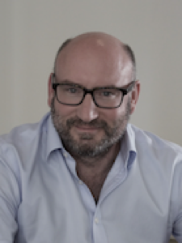
         

         

         <a href="https://www.qmul.ac.uk/spcs/staff/academics/profiles/dsberman.html">David Berman</a>
         

         

         <em> Professor, Queen Mary University; Head of AI, Cambridge Consultants </em>  
         

         

       

     

         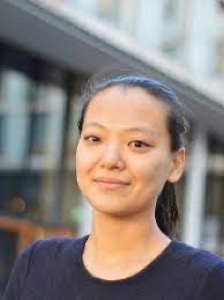
         

         

         <a href="https://www.uva.nl/en/profile/c/h/c.n.cheng/c.n.cheng.html">Miranda Cheng</a>
         

         

         <em> Associate Professor, University of Amsterdam; Research Scientist, Academia Sinica, Taiwan </em>  
         

         

       

     

         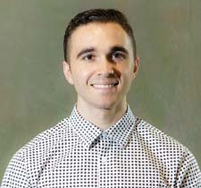
         

         

         <a href="https://astroautomata.com">Miles Cranmer</a>
         

         

         <em> Assistant Professor of Data Intensive Science, University of Cambridge </em>  
         

         

       

     

         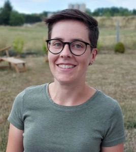
         

         

         <a href="https://www.uottawa.ca/faculty-science/professors/stefanie-czischek">Stefanie Czischek</a>
         

         

         <em> Assistant Professor, University of Ottawa </em>  
         

         

       

     

         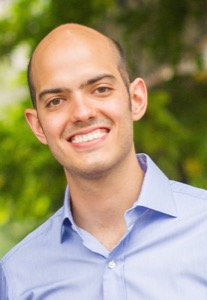
         

         

         <a href="https://people.seas.harvard.edu/~flavio/">Flavio du Pin Calmon</a>
         

         

         <em> Assistant Professor, Harvard </em>  
         

         

       

     

         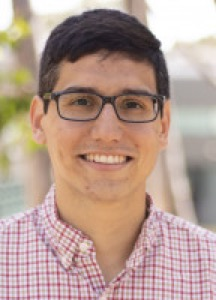
         

         

         <a href="https://www-physics.ucsd.edu/Directory/Person/552">Javier Duarte</a>
         

         

         <em> Assistant Professor, University of California, San Diego </em>  
         

         

       

     

         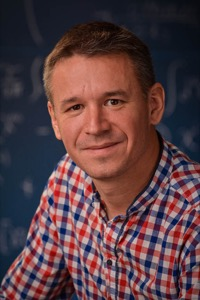
         

         

         <a href="http://theory.caltech.edu/~gukov/">Sergei Gukov</a>
         

         

         <em> Professor, California Institute of Technology </em>  
         

         

       

     

         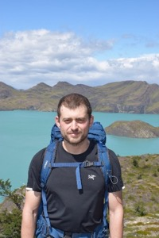
         

         

         <a href="https://boris-hanin.github.io">Boris Hanin</a>
         

         

         <em> Assistant Professor, Princeton </em>  
         

         

       

     

         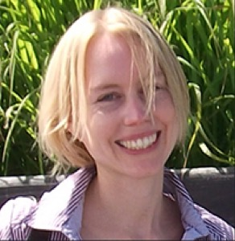
         

         

         <a href="http://people.csail.mit.edu/stefje/">Stefanie Jegelka</a>
         

         

         <em> Associate Professor, MIT </em>  
         

         

       

     

         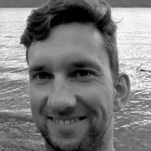
         

         

         <a href="https://karstenkreis.github.io">Karsten Kreis</a>
         

         

         <em> Senior Research Scientist, NVIDIA </em>  
         

         

       

     

         
         

         

         <a href="https://krippendorflab.github.io">Sven Krippendorf</a>
         

         

         <em> Senior Researcher, Ludwig-Maximilian University </em>  
         

         

       

     

         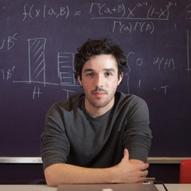
         

         

         <a href="https://daniel-kunin.com">Daniel Kunin</a>
         

         

         <em> PhD Student, Stanford University </em>  
         

         

       

     

         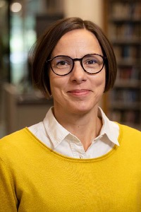
         

         

         <a href="https://www.katalog.uu.se/profile/?id=N3-1163">Magdalena Larfors</a>
         

         

         <em> Senior Lecturer/Associate Professor, Uppsala University </em>  
         

         

       

     

         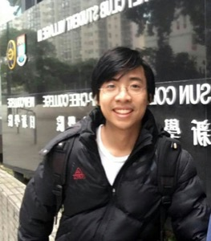
         

         

         <a href="https://scholar.google.com/citations?user=OxZytTQAAAAJ">Di Luo</a>
         

         

         <em> IAIFI Fellow </em>  
         

         

       

     

         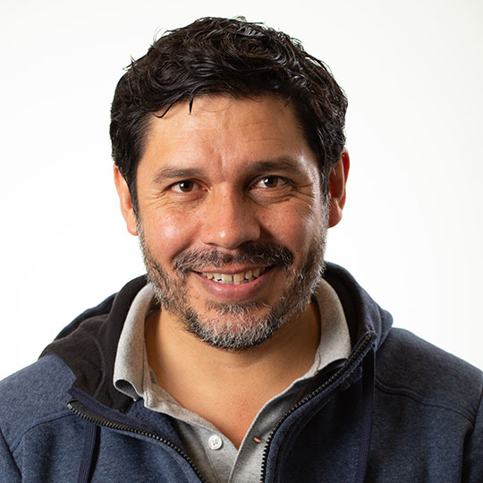
         

         

         <a href="https://lweb.cfa.harvard.edu/~jmartine/Welcome.html">Rafael Martinez-Galarza</a>
         

         

         <em> Astrophysicist, Harvard & Smithsonian Center for Astrophysics </em>  
         

         

       

     

         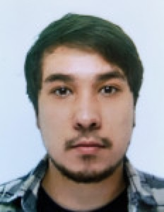
         

         

         <a href="https://www.nersc.gov/about/nersc-staff/nesap-postdocs/vinicius-mikuni/">Vinicius Mikuni</a>
         

         

         <em> Postdoctoral Fellow, NERSC </em>  
         

         

       

     

         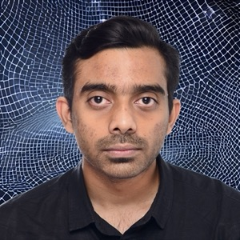
         

         

         <a href="https://space.mit.edu/people/mukund-nikhil/">Nikhil Mukund</a>
         

         

         <em> Postdoctoral Scholar, MIT Kavli Institute </em>  
         

         

       

     

         
         

         

         <a href="https://pehlevan.seas.harvard.edu/">Cengiz Pehlevan</a>
         

         

         <em> Assistant Professor, Harvard </em>  
         

         

       

     

         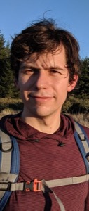
         

         

         <a href="https://www.rezchikov.me">Semon Rezchikov</a>
         

         

         <em> Research Instructor and NSF Postdoctoral Fellow, Princeton University </em>  
         

         

       

     

         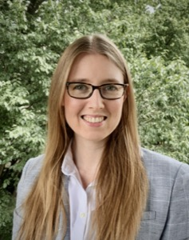
         

         

         <a href="https://physics.mit.edu/faculty/phiala-shanahan/">Phiala Shanahan</a>
         

         

         <em> Associate Professor, MIT </em>  
         

         

       

     

         
         

         

         <a href="https://physics.rutgers.edu/people/faculty-list/faculty-profile/shih-david">David Shih</a>
         

         

         <em> Professor, Rutgers University </em>  
         

         

       

     

         
         

         

         <a href="https://www.physics.wisc.edu/directory/shiu-gary/">Gary Shiu</a>
         

         

         <em> Professor, University of Wisconsin-Madison </em>  
         

         

       

     

         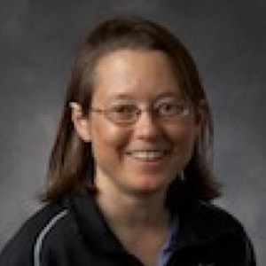
         

         

         <a href="https://sitp.stanford.edu/people/eva-silverstein">Eva Silverstein</a>
         

         

         <em> Professor, Stanford University </em>  
         

         

       

     

         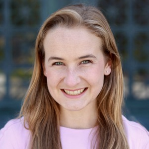
         

         

         <a href="https://www.eecs.mit.edu/people/tess-smidt/">Tess Smidt</a>
         

         

         <em> Assistant Professor, MIT </em>  
         

         

       

     

         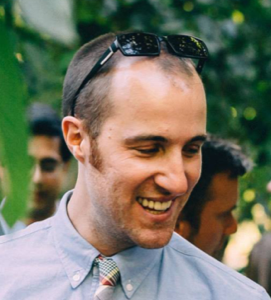
         

         

         <a href="http://www.sohldickstein.com">Jascha Sohl-Dickstein</a>
         

         

         <em> Senior Staff Research Scientist, Google Brain </em>  
         

         

       

     

         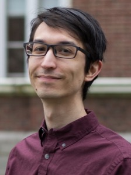
         

         

         <a href="https://joshspeagle.com/">Joshua Speagle</a>
         

         

         <em> Assistant Professor of Astrostatistics, University of Toronto </em>  
         

         

       

     

         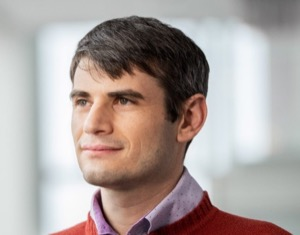
         

         

         <a href="https://www.khoury.northeastern.edu/people/robin-walters/">Robin Walters</a>
         

         

         <em> Assistant Professor, Khoury College of Computer Sciences, Northeastern University </em>  
         

         

       

     

         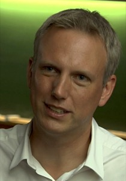
         

         

         <a href="https://benwandelt.org">Ben Wandelt</a>
         

         

         <em> Professor, Sorbonne University and Senior Research Scientist, Flatiron Institute </em>  
         

         

       

     

         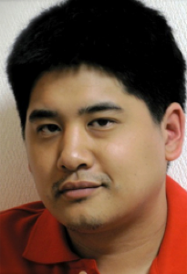
         

         

         <a href="https://as.tufts.edu/physics/people/faculty/taritree-wongjirad">Taritree Wongjirad</a>
         

         

         <em> Assistant Professor, Tufts </em>  
         

         

       

     

         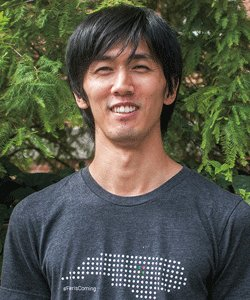
         

         

         <a href="https://www.shoyaida.com">Sho Yaida</a>
         

         

         <em> Research Scientist, Meta </em>  
         

         

       

  <!--
  

  -->

 

## Accommodations
We have made arrangements for discounted accommodations at the following locations: 
* **Reservations closed** [Boston University Housing](https://www.bu.edu/housing/undergrad-housing/stuvi/10buick/), 10 Buick St, Boston, MA 02215
  * 96.00 USD per night
  * [Book a room](https://iaifi-stayatbu.eventbrite.com)
* [The Inn at Longwood Medical](https://www.innatlongwood.com), 342 Longwood Ave, Boston, MA 02115
  * 249.00 USD per night
  * [Book a room](https://be.synxis.com/?Hotel=58219&Chain=65&arrive=2023-08-12&depart=2023-08-19&adult=1&child=0&group=IAIF0823)

## FAQ 
* *Who can attend the Summer Workshop?* Any researcher working at or interested in the intersection of physics and AI is encouraged to attend the Summer Workshop. 
* *What is the cost to attend the Summer Worskhop?* The registration fee for the Summer Workshop is 250 USD and includes a welcome dinner, as well as coffee breaks.
* *If I come to the Summer School, can I also attend the Workshop?* Yes! We encourage you to stay for the Workshop and you can stay in the dorms for both events if you choose. 
* *Will the recordings of the talks be available?* We plan to share the talks on our [YouTube channel](https://www.youtube.com/channel/UCueoFcGm_15kSB-wDd4CBZA).

[Submit a question or comment](https://app.smartsheet.com/b/form/76c1d070d19d4688b65962c4ed190478){:.button.button--outline-primary.button--pill.button--sm}

## 2023 Organizing Committee 
* Jim Halverson, Chair (Northeastern University)
* Shuchin Aeron (Tufts)
* Denis Boyda (IAIFI Fellow)
* Anna Golubeva (IAIFI Fellow)
* Ouail Kitouni (MIT)
* Nayantara Mudur (Harvard)
* Sneh Pandya (Northeastern)
* Marisa LaFleur (IAIFI Project Manager)
