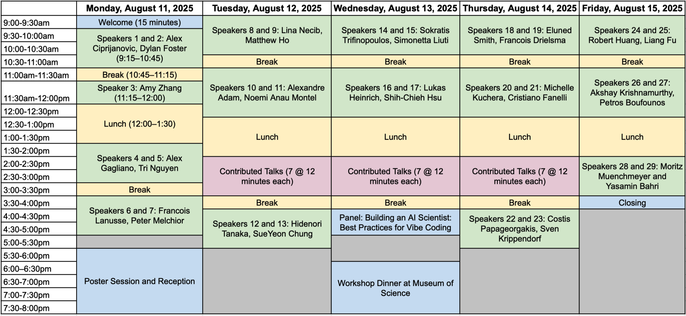

 

The IAIFI Summer Workshop brings together researchers from across Physics and AI for plenary talks, poster sessions, and networking to promote research at the intersection of Physics and AI. We will also accept submissions for contributed talks and/or posters.

**Registration and abstract submissions are now open for the 2026 IAIFI Summer Workshop.** [Register here](https://buy.stripe.com/bJebJ15xqfTu4H87ax7Vm0r) and [submit a talk or poster here](https://app.smartsheet.com/b/form/019cf72596b5790ca38a933e4d7b226a). 
{:.success}

* **The 2026 Summer Workshop will be held August 10–14, 2026**
* **Location: MIT, Cambridge, MA**

[Register](https://buy.stripe.com/bJebJ15xqfTu4H87ax7Vm0r){:.button.button--outline-primary.button--pill.button--lg}[Submit a talk/poster](https://app.smartsheet.com/b/form/019cf72596b5790ca38a933e4d7b226a){:.button.button--outline-primary.button--pill.button--lg}[Agenda](#agenda){:.button.button--outline-primary.button--pill.button--lg}  [Speakers](#speakers){:.button.button--outline-primary.button--pill.button--lg}   [Accommodations](#accommodations){:.button.button--outline-primary.button--pill.button--lg}[FAQ](#faq){:.button.button--outline-primary.button--pill.button--lg}  [Past Workshops](/past-workshops.html){:.button.button--outline-primary.button--pill.button--lg}

## About
The Institute for Artificial Intelligence and Fundamental Interactions (IAIFI) is enabling physics discoveries and advancing foundational AI through the development of novel AI approaches that incorporate first principles, best practices, and domain knowledge from fundamental physics. The goal of the Workshop is to serve as a meeting place to facilitate advances and connections across this growing interdisciplinary field.

## Agenda

More details to come later in Spring 2026. The below schedule is tentative and subject to change.

<!--

-->

### Monday, August 10, 2026
**9:00-9:15 am ET**

Welcome

**9:15–10:00 am ET**

*Plenary Talk*

**10:00–10:45 am ET**

*Plenary Talk*

**10:45-11:15 am ET**

Break

**11:15 am–12:00 pm ET**

*Plenary Talk*

**12:00–1:30 pm ET**

Lunch Break

**1:30–2:15 pm ET**

*Plenary Talk*

**2:15–3:00 pm ET**

*Plenary Talk*

**3:00–3:30 pm ET**

Break

**3:30–4:15 pm ET**

*Plenary Talk*

**4:15-5:00 pm ET**

*Plenary Talk*

**5:30–8:00 pm ET**

Poster Session and Reception

### Tuesday, August 11, 2026

**9:00–9:45 am ET**

*Plenary Talk*

**9:45–10:30 am ET**

*Plenary Talk*

**10:30-11:00 am ET**

Break

**11:00–11:45 am ET**

*Plenary Talk*

**11:45 am–12:30 pm ET**

*Plenary Talk*

**12:30–2:00 pm ET**

Lunch Break

**2:00–3:30 pm ET**

*Parallel Session for Contributed Talks*

**3:30–4:00 pm ET**

Break

**4:00–4:45 pm ET**

*Plenary Talk*

**4:45-5:30 pm ET**

*Plenary Talk*

### Wednesday, August 12, 2026

**9:00–9:45 am ET**

*Plenary Talk*

**9:45–10:30 am ET**

*Plenary Talk*

**10:30-11:00 am ET**

Break

**11:00–11:45 am ET**

*Plenary Talk*

**11:45 am–12:30 pm ET**

*Plenary Talk*

**12:30–2:00 pm ET**

Lunch Break

**2:00–3:30 pm ET**

*Parallel Session for Contributed Talks*

**3:30–4:00 pm ET**

Break

**4:00–5:00 pm ET**

*Panel: Details to come*

**6:00–8:00 pm ET**

*Workshop Dinner*

### Thursday, August 13, 2026

**9:00–9:45 am ET**

*Plenary Talk*

**9:45–10:30 am ET**

*Plenary Talk*

**10:30-11:00 am ET**

Break

**11:00–11:45 am ET**

*Plenary Talk*

**11:45 am–12:30 pm ET**

*Plenary Talk*

**12:30–2:00 pm ET**

Lunch Break

**2:00–3:30 pm ET**

*Parallel Session for Contributed Talks*

**3:30–4:00 pm ET**

Break

**4:00–4:45 pm ET**

*Plenary Talk*

**4:45–5:30 pm ET**

*Plenary Talk*

### Friday, August 14, 2026

#### [IAIFI Industry Day](https://iaifi.org/industry-day)

**9:00–9:30 am ET**

*Concluding Workshop Remarks and Industry Day Introduction*

**9:00–9:30 am ET**

*Keynote Speaker*

**10:30–11:00 am ET**

Break

**11:00 am–12:30 pm ET**

*Lightning Talks from IAIFI researchers and industry partners*

**12:30 pm–1:30 pm ET**

Networking Lunch (food provided)

**2:00–3:00 pm ET**

Industry Partner Expo and Reception

## Speakers
Additional speakers will be added as they are confirmed. 

  <!--
-->

    

         
         

         

         <a href="https://sites.google.com/view/yasamanbahri/home/">Yasaman Bahri</a>
         

         

         <em> Google DeepMind </em>  
         

         

       

       
    

         
         

         

         <a href="https://www.maths.cam.ac.uk/person/mc2473">Miles Cranmer</a>
         

         

         <em> University of Cambridge </em>  
         

         

       

    

         
         

         

         <a href="https://yilundu.github.io">Yilun Du</a>
         

         

         <em> Harvard Kempner Institute </em>  
         

         

       

    

         
         

         

         <a href="https://www.berthyfeng.com">Berthy Feng</a>
         

         

         <em> IAIFI Fellow </em>  
         

         

       

    

         
         

         

         <a href="https://www.umb.edu/directory/rahulkulkarni/">Rahul Kulkarni</a>
         

         

         <em> UMass Boston </em>  
         

         

       

       
    

         
         

         

         <a href="https://zongyi-li.github.io">Zongyi Li</a>
         

         

         <em> MIT </em>  
         

         

       

       

 

## Accommodations

We have established discounted rates for August 9–August 15, 2026 at the following hotels:

* <b>Le Meridien</b>, 20 Sydney St, Cambridge, MA 02139. 
    
    $199 nightly rate
    
    Deadline to book: July 9, 2026

    [Book online](https://app.marriott.com/reslink?id=1773329890905&key=GRP&app=resvlink)

* *More to be added*

## FAQ 
* *Who can attend the Summer Workshop?* Any researcher working at or interested in the intersection of physics and AI is encouraged to attend the Summer Workshop. 
* *What is the cost to attend the Summer Worskhop?* The registration fee for the Summer Workshop is 200 USD and includes a welcome dinner, as well as coffee breaks and snacks.
* *If I come to the Summer School, can I also attend the Workshop?* Yes! We encourage you to stay for the Workshop and you can stay in the dorms for both events if you choose (at your expense). 
* *Will the recordings of the talks be available?* We plan to share the talks on our [YouTube channel](https://www.youtube.com/channel/UCueoFcGm_15kSB-wDd4CBZA).

[Submit a question or comment](https://app.smartsheet.com/b/form/76c1d070d19d4688b65962c4ed190478){:.button.button--outline-primary.button--pill.button--sm}

## 2026 Organizing Committee 
* Will Detmold, Co-Chair (MIT)
* Bill Freeman, Co-Chair (MIT) 
* Sam Bright-Thonney (IAIFI Fellow)
* Akshunna Dogra (Incoming IAIFI Fellow)
* Berthy Feng (IAIFI Fellow)
* Mathis Gerdes (Incoming IAIFI Fellow)
* Juvenal Bassa (UPRM)
* Yize Dong (Harvard)
* Franc O (Northeastern)
* Sneh Pandya (Northeastern)
* Shelley Tong (MIT)
* Lana Xu (MIT)
* Xiaoyuan Zhang (MIT)
* Marisa LaFleur (IAIFI Managing Director)
* Thomas Bradford (IAIFI Project Coordinator)
