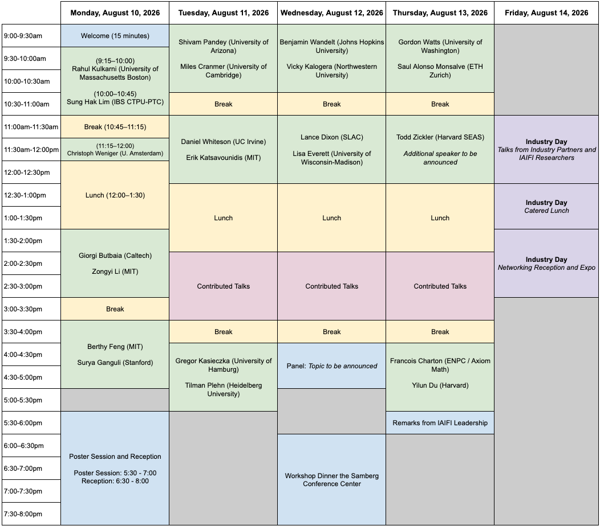
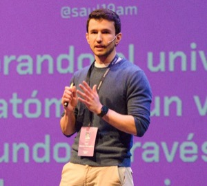
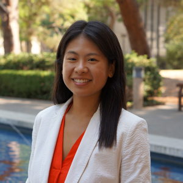
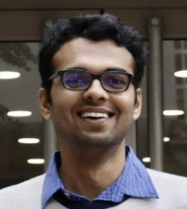

 

The IAIFI Summer Workshop brings together researchers from across Physics and AI for plenary talks, poster sessions, and networking to promote research at the intersection of Physics and AI. We will also accept submissions for contributed talks and/or posters.

**Registration and abstract submissions are now open for the 2026 IAIFI Summer Workshop.** [Register here](https://buy.stripe.com/bJebJ15xqfTu4H87ax7Vm0r) by July 31, 2026 and [submit a talk or poster here](https://app.smartsheet.com/b/form/019cf72596b5790ca38a933e4d7b226a) by noon Boston time on June 8, 2026. 
{:.success}

* **The 2026 Summer Workshop will be held August 10–14, 2026**
* **Location: MIT, Cambridge, MA**

[Register](https://buy.stripe.com/bJebJ15xqfTu4H87ax7Vm0r){:.button.button--outline-primary.button--pill.button--lg}[Submit a talk/poster](https://app.smartsheet.com/b/form/019cf72596b5790ca38a933e4d7b226a){:.button.button--outline-primary.button--pill.button--lg}[Agenda](#agenda){:.button.button--outline-primary.button--pill.button--lg}  [Speakers](#plenary-speakers){:.button.button--outline-primary.button--pill.button--lg}   [Accommodations](#accommodations){:.button.button--outline-primary.button--pill.button--lg}[FAQ](#faq){:.button.button--outline-primary.button--pill.button--lg}  [Past Workshops](/past-workshops.html){:.button.button--outline-primary.button--pill.button--lg}

## About
The Institute for Artificial Intelligence and Fundamental Interactions (IAIFI) is enabling physics discoveries and advancing foundational AI through the development of novel AI approaches that incorporate first principles, best practices, and domain knowledge from fundamental physics. The goal of the Workshop is to serve as a meeting place to facilitate advances and connections across this growing interdisciplinary field.

## Agenda

*The schedule is subject to change. More details to be provided later in July.*

Regarding IAIFI Industry Day Day on Friday, August 14: This will be an excellent networking opportunity between Workshop attendees, IAIFI members, and industry partners. Industry participants will include employees of Glasswing Ventures, QuEra Computing, Stripe, Draper, Extropic, Amazon, MathWorks, Mitsubishi Electric Research Laboratories (MERL), Physical Superintelligence PBC, Agentoid, Fine Structure Ventures, Engine Ventures, Extropic, and First Principles.

<!--

### Monday, August 10, 2026
**9:00-9:15 am ET**

Welcome

**9:15–10:00 am ET**

*Plenary Talk*

**10:00–10:45 am ET**

*Plenary Talk*

**10:45-11:15 am ET**

Break

**11:15 am–12:00 pm ET**

*Plenary Talk*

**12:00–1:30 pm ET**

Lunch Break

**1:30–2:15 pm ET**

*Plenary Talk*

**2:15–3:00 pm ET**

*Plenary Talk*

**3:00–3:30 pm ET**

Break

**3:30–4:15 pm ET**

*Plenary Talk*

**4:15-5:00 pm ET**

*Plenary Talk*

**5:30–8:00 pm ET**

Poster Session and Reception

### Tuesday, August 11, 2026

**9:00–9:45 am ET**

*Plenary Talk*

**9:45–10:30 am ET**

*Plenary Talk*

**10:30-11:00 am ET**

Break

**11:00–11:45 am ET**

*Plenary Talk*

**11:45 am–12:30 pm ET**

*Plenary Talk*

**12:30–2:00 pm ET**

Lunch Break

**2:00–3:30 pm ET**

*Parallel Session for Contributed Talks*

**3:30–4:00 pm ET**

Break

**4:00–4:45 pm ET**

*Plenary Talk*

**4:45-5:30 pm ET**

*Plenary Talk*

### Wednesday, August 12, 2026

**9:00–9:45 am ET**

*Plenary Talk*

**9:45–10:30 am ET**

*Plenary Talk*

**10:30-11:00 am ET**

Break

**11:00–11:45 am ET**

*Plenary Talk*

**11:45 am–12:30 pm ET**

*Plenary Talk*

**12:30–2:00 pm ET**

Lunch Break

**2:00–3:30 pm ET**

*Parallel Session for Contributed Talks*

**3:30–4:00 pm ET**

Break

**4:00–5:00 pm ET**

*Panel: Details to come*

**6:00–8:00 pm ET**

*Workshop Dinner*

### Thursday, August 13, 2026

**9:00–9:45 am ET**

*Plenary Talk*

**9:45–10:30 am ET**

*Plenary Talk*

**10:30-11:00 am ET**

Break

**11:00–11:45 am ET**

*Plenary Talk*

**11:45 am–12:30 pm ET**

*Plenary Talk*

**12:30–2:00 pm ET**

Lunch Break

**2:00–3:30 pm ET**

*Parallel Session for Contributed Talks*

**3:30–4:00 pm ET**

Break

**4:00–4:45 pm ET**

*Plenary Talk*

**4:45–5:30 pm ET**

*Plenary Talk*

**4:45–5:30 pm ET**

*Concluding Workshop Remarks*

### Friday, August 14, 2026

#### IAIFI Industry Day

**10:00–10:15 am ET**

*Industry Day Introduction*

**10:15–11:00 am ET**

*Keynote Speaker*

**11:00 am–12:30 pm ET**

*Lightning Talks from IAIFI researchers and industry partners*

**12:30 pm–1:30 pm ET**

Networking Lunch (food provided)

**2:00–3:00 pm ET**

Industry Partner Expo and Reception
-->

## Plenary Speakers
Additional speakers will be added as they are confirmed. 

  <!--
-->

    

         
         

         

         <a href="https://samprd.ethz.ch">Saúl Alonso-Monsalve</a>
         

         

         <em> ETH Zurich </em>  
         

         

       

    

         
         

         

         <a href="https://scholar.google.com/citations?user=FNLypywAAAAJ&hl=en">Giorgi Butbaia</a>
         

         

         <em> Caltech </em>  
         

         

       

    

         
         

         

         <a href="https://f-charton.github.io/about/">Francois Charton</a>
         

         

         <em> Axiom Math </em>  
         

         

       

       
    

         
         

         

         <a href="https://www.maths.cam.ac.uk/person/mc2473">Miles Cranmer</a>
         

         

         <em> University of Cambridge </em>  
         

         

       

       
    

         
         

         

         <a href="https://faculty.slac.stanford.edu/person/lance-dixon">Lance Dixon</a>
         

         

         <em> SLAC </em>  
         

         

       

    

         
         

         

         <a href="https://yilundu.github.io">Yilun Du</a>
         

         

         <em> Harvard Kempner Institute </em>  
         

         

       

       
    

         
         

         

         <a href="https://www.physics.wisc.edu/directory/everett-lisa-l/">Lisa Everett</a>
         

         

         <em> University of Wisconsin-Madison </em>  
         

         

       

    

         
         

         

         <a href="https://www.berthyfeng.com">Berthy Feng</a>
         

         

         <em> IAIFI Fellow </em>  
         

         

       

     

         
         

         

         <a href="https://ganguli-gang.stanford.edu/surya.html">Surya Ganguli</a>
         

         

         <em> Standford University </em>  
         

         

       

        

         
         

         

         <a href="https://physics.northwestern.edu/people/faculty/core-faculty/vicky-kalogera.html">Vicky Kalogera</a>
         

         

         <em> Northwestern University</em>  
         

         

       

       
       

         
         

         

         <a href="https://www.physik.uni-hamburg.de/en/iexp/gruppe-kasieczka/personen/kasieczka-gregor.html">Gregor Kasieczka</a>
         

         

         <em> Universitat Hamburg </em>  
         

         

       

      

         
         

         

         <a href="https://www.mit.edu/~kats/">Erik Katsavounidis</a>
         

         

         <em> MIT </em>  
         

         

       

       
      

         
         

         

         <a href="https://blogs.umb.edu/rahulkulkarni/">Rahul Kulkarni</a>
         

         

         <em> UMass Boston </em>  
         

         

       

       
       

         
         

         

         <a href="https://zongyi-li.github.io">Zongyi Li</a>
         

         

         <em> MIT </em>  
         

         

       

      

         
         

         

         <a href="https://inspirehep.net/authors/1309390">Sung Hak Lim</a>
         

         

         <em> IBS, Daejeon, CTPU. hep-ex and hep-ph and astro-ph </em>  
         

         

       

       

         
         

         

         <a href="https://astro.arizona.edu/person/shivam-pandey">Shivam Pandey</a>
         

         

         <em> The University of Arizona </em>  
         

         

       

    

         
         

         

         <a href="https://inspirehep.net/authors/993181">Tilman Plehn</a>
         

         

         <em> Heidelberg University </em>  
         

         

       

<!--

    

         
         

         

         <a href="https://sitp.stanford.edu/people/eva-silverstein">Eva Silverstein</a>
         

         

         <em> Stanford University </em>  
         

         

       

       
-->

    

     
     

     

     <a href="https://benwandelt.org/">Ben Wandelt</a>
     

     

     <em> Johns Hopkins University </em>  
     

     

   

    

     
     

     

     <a href="https://phys.washington.edu/people/gordon-watts">Gordon Watts</a>
     

     

     <em> University of Washington </em>  
     

     

   

   
   

        
        

        

        <a href="https://www.christophweniger.com/">Christoph Weniger</a>
        

        

        <em> University of Amsterdam </em>  
        

        

     

     
     

        
        

        

        <a href="https://sites.uci.edu/daniel/">Daniel Whiteson</a>
        

        

        <em> UC Irvine </em>  
        

        

     

     
        

         
         

         

         <a href="https://seas.harvard.edu/person/todd-zickler">Todd Zickler</a>
         

         

         <em> Harvard University </em>  
         

         

       

       

 

## Accommodations

We have established discounted rates for August 9–August 15, 2026 at the following hotels:

* <b>Le Meridien</b>, 20 Sydney St, Cambridge, MA 02139. 
    
    $199 nightly rate
    
    Deadline to book: July 9, 2026

    [Book online](https://app.marriott.com/reslink?id=1773329890905&key=GRP&app=resvlink)

* <b>Boston Marriott Cambridge<b>, 50 Broadway, Cambridge, MA 02142.
  
    $219 nightly rate

    Deadline to book; Friday, July 10, 2026

    [Book online](https://www.marriott.com/event-reservations/reservation-link.mi?id=1774637159492&key=GRP&app=resvlink&_branch_match_id=1559583832159949376&_branch_referrer=H4sIAAAAAAAAA8soKSkottLXTywo0MtNLCrKzC8p0UvOz9UvSi3OyczLtgdK2ALZZSCOWmaKraG5uYmZsbmhqaWJpZFadmqlrXtQgFpdUWpaKlB3Xnp8UlF%2BeXFqka1zRlF%2BbioA1OpqWGAAAAA%3D)

* <b>Residence Inn by Marriott<b>, 120 Broadway, Cambridge, MA 02142.
    
    $219 nightly rate
    
    Deadline to book; Friday, July 10, 2026

  [Book online]([https://www.marriott.com/event-reservations/reservation-link.mi?id=1775327335150&key=GRP&app=resvlink&_branch_match_id=1559583832159949376&_branch_referrer=H4sIAAAAAAAAA8soKSkottLXTywo0MtNLCrKzC8p0UvOz9UvSi3OyczLtgdK2ALZZSCOWmaKraG5uamxkbmxsamhqYFadmqlrXtQgFpdUWpaKlB3Xnp8UlF%2BeXFqka1zRlF%2BbioAY%2BYmpGAAAAA%3D](https://www.marriott.com/event-reservations/reservation-link.mi?id=1775327335150&key=GRP&app=resvlink&_branch_match_id=1559583832159949376&_branch_referrer=H4sIAAAAAAAAA8soKSkottLXTywo0MtNLCrKzC8p0UvOz9UvSi0uy0wtN7IHytiCODmZedlqmSm2hubmpsZG5sbGpoamBmrZqZW27kEBanVFqWmpQO156fFJRfnlxalFts4ZRfm5qQAceJyzYQAAAA%3D%3D))

<!--
* <b>Hyatt Regency<b>, 575 Memorial Drrive, Cambridge, Massachusetts, 02139-4896.
    
    $219 nightly rate
    
    Deadline to book; Friday, July 10, 2026

  [Book online](https://www.hyatt.com/events/en-US/group-booking/BOSRC/G-IAIF)

-->

## FAQ 
* *Who can attend the Summer Workshop?* Any researcher working at or interested in the intersection of physics and AI is encouraged to attend the Summer Workshop. 
* *What is the cost to attend the Summer Worskhop?* The registration fee for the Summer Workshop is 200 USD and includes a welcome dinner, as well as coffee breaks and snacks.
* *If I come to the Summer School, can I also attend the Workshop?* Yes! We encourage you to stay for the Workshop and you can stay in the dorms for both events if you choose (at your expense). 
* *Will the recordings of the talks be available?* We plan to share the talks on our [YouTube channel](https://www.youtube.com/channel/UCueoFcGm_15kSB-wDd4CBZA).

[Submit a question or comment](https://app.smartsheet.com/b/form/76c1d070d19d4688b65962c4ed190478){:.button.button--outline-primary.button--pill.button--sm}

## 2026 Organizing Committee 
* Will Detmold, Co-Chair (MIT)
* Bill Freeman, Co-Chair (MIT) 
* Sam Bright-Thonney (IAIFI Fellow)
* Akshunna Dogra (IAIFI Fellow)
* Berthy Feng (IAIFI Fellow)
* Mathis Gerdes (IAIFI Fellow)
* Juvenal Bassa (UPRM)
* Yize Dong (Harvard)
* Franc O (Northeastern)
* Sneh Pandya (Northeastern)
* Shelley Tong (MIT)
* Lana Xu (MIT)
* Xiaoyuan Zhang (MIT)
* Marisa LaFleur (IAIFI Managing Director)
* Thomas Bradford (IAIFI Project Coordinator)
