 

The IAIFI Summer Workshop brings together researchers from across Physics and AI for plenary talks, poster sessions, and networking to promote research at the intersection of Physics and AI. We will also accept submissions for contributed talks and/or posters.

**Registration is open for the 2026 IAIFI Summer Workshop.** [Register here](https://buy.stripe.com/bJebJ15xqfTu4H87ax7Vm0r) by July 31, 2026. 
{:.success}

* **The 2026 Summer Workshop will be held August 10–14, 2026**
* **Location, August 10-13: MIT Schwarzman College of Computing (Building 45), 51 Vassar Street, Cambridge, MA; Room 45-230**
* **Location, August 14: MIT Samberg Conference Center, 50 Memorial Dr, Cambridge, MA; Dining Rooms 3&4 (on the 6th floor)**

[Register](https://buy.stripe.com/bJebJ15xqfTu4H87ax7Vm0r){:.button.button--outline-primary.button--pill.button--lg} [Agenda](#agenda){:.button.button--outline-primary.button--pill.button--lg}  [Speakers](#plenary-speakers){:.button.button--outline-primary.button--pill.button--lg}   [Accommodations](#accommodations){:.button.button--outline-primary.button--pill.button--lg}[FAQ](#faq){:.button.button--outline-primary.button--pill.button--lg}  [Past Workshops](/past-workshops.html){:.button.button--outline-primary.button--pill.button--lg}

## About
The Institute for Artificial Intelligence and Fundamental Interactions (IAIFI) is enabling physics discoveries and advancing foundational AI through the development of novel AI approaches that incorporate first principles, best practices, and domain knowledge from fundamental physics. The goal of the Workshop is to serve as a meeting place to facilitate advances and connections across this growing interdisciplinary field.

## Agenda

*The schedule is subject to change.*

Regarding **IAIFI Industry Day Day on Friday, August 14**: This will be an excellent networking opportunity between Workshop attendees, IAIFI members, and industry partners. [See more about Industry Day here](https://iaifi.org/industry-day), including participating industry partners.

### Monday, August 10, 2026
**9:00-9:15 am ET**

Welcome

**9:15–10:00 am ET**

*Statistical Mechanics approaches for Reinforcement learning and Generative Flow networks*

Rahul Kulkarni, University of Massachusetts Boston

Abstract

<em>Reinforcement learning (RL) is a key field of research in AI that is increasingly being applied to complex optimization problems in science. In parallel, concepts from physics have contributed to important advances in RL with developments such as entropy-regularized RL. While the connections of AI to equilibrium statistical mechanics are well established, the interface with non-equilibrium statistical mechanics (NESM) is less explored. In recent work, we have established a mapping between entropy-regularized RL and research in non-equilibrium statistical mechanics focusing on Markovian processes conditioned on rare events. Using approaches from large deviation theory, we obtain analytical results for the optimal policy in Markov Decision Process (MDP) models of RL. The results obtained lead to a novel analytical and computational framework for entropy-regularized RL which is validated by simulations. This framework had led to new results for reward shaping and bounds in RL and the development of new algorithms for average-rewards RL with entropy regularization. The framework developed also leads to a unifying view of Generative Flow networks (Gflownets) from the perspective of nonequilibrium steady states. The mapping established thus connects current research in reinforcement learning and generative modeling to non-equilibrium statistical mechanics, thereby opening new avenues for the application of analytical and computational approaches from one field to cutting-edge problems in the other.</em>

**10:00–10:45 am ET**

*Physics-Informed Machine Learning: from colliders to galaxies*

Sung Hak Lim, IBS CTPU-PTC

Abstract

<em>Details to come.</em>

**10:45-11:15 am ET**

Break

**11:15 am–12:00 pm ET**

*Dynamic Simulation-Based Inference: Extracting Insights from Complex Data and Simulations*

Christoph Weniger, University of Amsterdam

Abstract

<em>Much of our physical knowledge lives inside simulators: forward models that encode both established physics and the parameters we wish to infer, but whose likelihoods are often intractable — from gravitational waveforms to cosmological surveys. Simulation-based inference (SBI) turns these simulators into inference engines, training neural networks to estimate posteriors directly from simulated data. After introducing the foundations of modern SBI and amortization, we discuss dynamic SBI: an active learning scheme that continuously focuses costly simulations on the parameter regions that matter. We then present the FALCON framework for distributed dynamic SBI, which enables the simultaneous inference of a multitude of parameters in complex forward models. We demonstrate the approach on benchmark problems, ongoing LISA parameter estimation for massive black hole binaries, and discuss extensions towards field-level cosmological inference.</em>

**12:00-12:45 pm ET**

*Simple yet predictive theories for how generative AI learns and imagines*

Surya Ganguli, Stanford

Abstract

<em>Details to come.</em>

**12:45–2:15 pm ET**

Lunch Break

**2:15–3:00 pm ET**

*Hierarchical Reinforcement Learning for Sparse-Reward Search in Commutative Algebra*

Giorgi Butbaia, Caltech

Abstract

<em>Applying machine learning techniques to solving long-standing mathematical conjectures can be particularly challenging due to their extreme reward sparsity. As an illustrative example, we consider Kalai's algebraic Hirsch conjecture and recast the construction of its counterexamples as a sparse-reward reinforcement learning problem on graphs. In this talk, we propose a constrained options-based HRL framework with an equivariant graph neural network policy, which allows us to learn useful temporal abstractions for this task. We evaluate our approach over a wide range of degrees and demonstrate that it consistently outperforms classical RL algorithms as well as greedy search. By exploiting the hierarchical structure of the problem, we effectively provide a first-of-its-kind application of HRL to a problem in commutative algebra.</em>

**3:00–3:45 pm ET**

*Generative Pretrained Neural Operators as Foundation Models for PDEs*

Zongyi Li, MIT

Abstract

<em>We present a generative neural operator for various partial differential equations. A single flow-matching transformer is trained jointly on 24 two-dimensional spatiotemporal systems spanning simulations, laboratory measurements, and global weather reanalysis. A canonical field representation with type-specific patchification maps different variables and resolutions into a shared token space, enabling one model and one compiled program across all systems. Through variable-length conditioning and masked generation, the same model supports forecasting, long rollouts, inverse prediction, missing-channel completion, super-resolution, and probabilistic ensembles without task-specific architectures. Joint training performs competitively with specialist models, improves transfer in data-limited settings, and continues to benefit from scaling up to 3.3 billion parameters. These results position generative modeling as a scalable and task-general foundation for learning PDE dynamics.</em>

**3:45–5:30 pm ET**

Break

**5:30–8:00 pm ET**

Poster Session and Reception (Lobby / Community Space)

[View Poster Abstracts](https://docs.google.com/document/d/1jOBYoZtxkqmkeRlExGCeFTFftii1wzW9XKtzznRfP7Y/edit?usp=sharing){:.button.button--outline-primary.button--pill.button--lg}

### Tuesday, August 11, 2026

**9:00–9:45 am ET**

*Accelerated forward modeling for cosmological simulations*

Shivam Pandey, University of Arizona

Abstract

<em>Developing fast and efficient methods for simulating our observable Universe is a key challenge in maximizing information extraction from cosmological datasets. The current simulations are too slow to scale to the volume necessary to analyze even decade-old observations. I will discuss different machine-learning-based approaches (e.g., using a multi-modal, transformer-based architecture) to learn the mapping from approximate and cheap dark matter-only simulations to galaxies in high-resolution and expensive simulations, achieving an orders-of-magnitude acceleration and the ability to cheaply scale to a large volume. I will discuss how these approaches enable the first analysis of large-volume observations of approximately a million galaxies using simulation-based inference techniques to place precise constraints on cosmological models. Finally, I will discuss the potential of these approaches in the context of ongoing and next-generation large-scale cosmological surveys.</em>

**9:45–10:30 am ET**

*The Era of Scientific Foundation Models*

Miles Cranmer, University of Cambridge

Abstract

<em>Why can't machine learning models generalize? Physical theories certainly can! General relativity predicted black holes and gravitational waves decades before any observational evidence. How can physics extrapolate so far beyond its data?

  I think the answer is induction. The physicist assumes a new model ought to accommodate old models. Yet the machine learner does not do this; instead, they ask their models to exist in isolation, and to bootstrap all knowledge from scratch. However, the past five years have seen this machine learning practice shift with the notion of generalist "foundation models" coming into vogue: models pretrained on massive diverse datasets which learn general representations (such as large language models).

  In this talk I will present new evidence that this strategy is starting to pay off for physics. Walrus, our 1.3B-parameter physics foundation model pretrained on 19 different PDEs in 2D and 3D, after finetuning on just three idealized simulations of the Rayleigh-Taylor instability, predicts real laboratory experiments zero-shot: it leaves the simulation regime and lands on the experimentally-measured mixing rate, without ever seeing a single experimental sample. This gives new data-driven evidence on a century-old discrepancy between simulation and experiment. I will use this result to introduce PolymathicAI, our research collaboration building large-scale multi-disciplinary scientific foundation models, and share some tricks we have found useful for building and adapting these models, such as tokeniser pretraining and probabilistic retrofitting. Finally, I will discuss what these models are actually learning, and how symbolic distillation via PySR and SymTorch can convert pieces of a neural network into interpretable, closed-form equations.</em>

**10:30-11:00 am ET**

Break

**11:00–11:45 am ET**

*These aren't the anomalies you're looking for*

Daniel Whiteson, UC Irvine

Abstract

<em>AI has sharpened our analysis and optimizes our pipelines. But it's also capable of creating entirely new pathways to discovery. I'll present examples of how AI allows us to search for objects which were once completely inaccessible, such as non-helical tracks, and describe how we can use it to search unexplored dimensions in our data, such as time-varying phenomena.</em>

**11:45 am–12:30 pm ET**

*ML-Enhanced LHC Simulations*

Tilman Plehn, Heidelberg University

Abstract

<em>Simulations are crucial for the precision-LHC program, and modern machine learning is transforming them rapidly. I will show how surrogates and generative models enhance LHC simulations and allow us to simulate LHC events with unprecedented speed and precision. To this end, we drive the development of uncertainty-aware precision networks for applications like ML-MadGraph, MLhad, and enhanced higher-order predictions.</em>

**12:30–2:00 pm ET**

Lunch Break

**2:00–3:30 pm ET**

*Contributed Talks Session A (Talk order subject to change)* (Room 45-230)

Reinforcement Learning for Adaptive Quantum Sensing and Control in Open Quantum Systems, Temitope Adeniyi (Cleveland State University/Africa Quantum Consortium)

<em>Quantum sensing has emerged as one of the most promising near-term applications of quantum technologies, with the potential to achieve measurement sensitivities beyond classical limits. However, realistic quantum sensors operate in open-system environments where decoherence, stochastic noise, and imperfect measurements significantly degrade performance. Designing adaptive sensing protocols that remain robust under such conditions remains a major challenge, particularly as system complexity increases beyond analytically tractable regimes.

In this work, we investigate reinforcement learning (RL) as a framework for discovering adaptive quantum sensing and control policies in noisy open quantum systems. We formulate quantum sensing as a partially observable sequential decision-making problem in which an RL agent interacts with a quantum environment governed by Lindblad dynamics. The agent learns control strategies through operations including local rotations, entangling gates, projective measurements, feedback actions, and ancilla resets. Quantum Fisher Information (QFI) is used as the primary optimization objective, enabling the agent to directly optimize metrological sensitivity while accounting for realistic noise processes.

We further explore belief-state representations that allow the agent to make adaptive decisions under incomplete information. Across multiple decoherence regimes, including dephasing and amplitude damping, the learned policies consistently outperform passive evolution and static control protocols. Interestingly, the resulting policies exhibit interpretable structures, revealing emergent adaptive behaviors that preserve parameter sensitivity despite environmental disturbances.

More broadly, this work positions adaptive quantum sensing as a physically grounded AI-for-science problem, where machine learning is not merely used for post-processing experimental data, but instead becomes an active component of quantum control and metrological decision-making. Our results suggest that physics-informed reinforcement learning may provide a scalable pathway toward robust quantum-enhanced sensing in experimentally realistic settings.</em>

Collider-Bench: Benchmarking AI Agents with Particle Physics Analysis Reproduction, Darius Faroughy (Rutgers University)

<em>Autonomous language-model agents are increasingly evaluated on long-horizon tool-use tasks, but existing benchmarks rarely capture the complexity and nuance of real scientific work. To address this gap, we introduce Collider-Bench, a benchmark for evaluating whether LLM agents can reproduce experimental analyses from the Large Hadron Collider (LHC) using only public papers and open scientific software. Such analyses are often difficult to reproduce because the public toolchain only approximates the software used internally by the experimental collaborations, while the published papers inevitably omit implementation details needed for a faithful reconstruction. Agents must therefore rely on physical reasoning, domain knowledge, and trial-and-error to fill these gaps. Each task requires the agent to turn a published analysis into an executable simulation-and-selection pipeline and submit predicted collision event yields in specified signal regions. These predictions are evaluated with standard histogram metrics that provide continuous fidelity scores without a hand-written rubric. Finally, we evaluate the codebase and full session trace using an LLM judge to catch qualitative failure modes such as fabrications, hallucinations and duplications. We release an initial set of tasks drawn from LHC searches, together with a containerized sandbox and event simulation tools. We evaluate across a capability ladder of general purpose coding agents. Our results show that on average no agent reliably beats the physicist-in-the-loop solution.</em>

Neural network variational ground states for QFT, Mathis Gerdes (MIT)

<em>Computing ground states of quantum field theories is a data-free variational problem, where any wavefunction ansatz must also supply a way to estimate its own energy. I represent the ground state of lattice φ⁴ theory as a normalizing flow which gives at once an explicitly normalized wavefunction and a sampler for the Born density, making the energy minimization tractable and reparameterizable. The learned states match perturbation theory at weak coupling and extend into the critical regime, recovering the phase transition and spontaneous symmetry breaking.</em>

Are Classical and Quantum Machine Learning Frameworks Effective for 3D Exoplanet Climate Modeling?, Amit Reza (Space Research Institute (IWF), Austrian Academy of Sciences, Graz, Austria)

<em>With the development of ever-improving telescopes capable of observing exoplanet atmospheres in greater detail and in greater numbers, there is a growing demand for enhanced 3D climate models to support and interpret observational data from space missions such as CHEOPS, TESS, JWST, PLATO, and Ariel. However, the computational intensity of general circulation models (GCMs) poses significant challenges for simulating a wide range of exoplanetary atmospheres. Building on the successful implementation of classical machine learning (ML) models (Plaschzug et al., A&A, 706 (2026) A157), this work critically evaluates the viability of advanced neural network models, including a standard autoencoder, conditional variational autoencoder, and transformer model, for modeling high-dimensional 3D exoplanet atmospheres. Our results indicate that all advanced NN models can predict pressure-temperature profiles with high accuracy. 

Furthermore, we extend our investigation into the feasibility of developing a quantum ML algorithm for the same task. We develop a quantum-enhanced latent-space regression framework and benchmark its performance against established classical latent-space regressor baselines. Our results indicate that while the hybrid framework successfully encodes 3D atmospheric data, it is currently outperformed by fully classical standard autoencoder architectures in terms of reconstruction accuracy and computational efficiency. These findings provide a necessary baseline for understanding the current limitations of quantum integration in complex Climate Modeling that must be overcome in the near future to achieve true quantum advantage in Exoplanet weather and climate science.</em>

From Thousands of CPU-Hours to Seconds: Fast Generative Models for Gravitational-Wave Populations, Rhea Senthil Kumar (University of California, San Diego)

<em>Gravitational-wave (GW) observations provide a unique probe of the underlying massive-star population, but extracting this information requires modeling how massive stars evolve into merging compact binaries across cosmic time. Forward population-synthesis frameworks that couple binary evolution to cosmic star-formation and metallicity histories are therefore needed to connect observed merger catalogs to the astrophysical parameters governing stellar populations. However, these simulations are prohibitively computationally expensive: exploring even modest grids of formation channels and astrophysical parameters can require the generation of hundreds of millions of simulated mergers and consume tens of thousands of CPU-hours.
We present PLANT (Population synthesis with Learned Astrophysical geNerative models for gravitaTional-wave populations), a conditional generative modeling framework that replaces repeated population-synthesis sampling with fast neural emulators of GW merger populations. We first generate a large training dataset by running population-synthesis simulations across a broad grid of astrophysical hyperparameters, producing merger catalogs that span the Synthetic-Stellar-Pop-Convolve (SSPC) parameter space. SSPC combines binary population-synthesis predictions with models of cosmic star-formation and metallicity evolution to predict the observable distribution of compact-binary mergers across cosmic time. The model learns to generate merger populations conditioned on these parameters, enabling amortized simulation without rerunning expensive forward models. We train on approximately 3.75×10^8 simulated mergers and investigate two complementary generative approaches: (i) conditional flow matching (CFM), which learns deterministic probability-flow trajectories using optimal-transport-inspired paths, and (ii) score-based diffusion models, which learn stochastic denoising dynamics for population generation. Both approaches model the conditional distribution of chirp mass, mass ratio, and redshift given the population-synthesis parameters.
We benchmark against a Naive Bayes grid emulator baseline and evaluate distributional fidelity and posterior recovery on LIGO-VIRGO-KAGRA observed gravitational-wave data. The learned emulator accurately reproduces marginal and joint distributions across astrophysical regimes while achieving orders-of-magnitude speedups over direct population synthesis. This work establishes conditional generative modeling via flow matching and diffusion as a scalable surrogate for gravitational-wave population synthesis, enabling rapid generation of physically consistent merger populations for large-scale astrophysical analysis.</em>

Scalable Inference-Time Steering in Molecular Design with Multimodal Meta Flow Maps, Franklin Shiyi Wang (Kempner Institute, Harvard University)

<em>Physical design problems naturally have continuous (e.g. molecular structures), discrete (e.g. DNA residue types) and often both modalities (e.g. protein structure-sequence co-design). Diffusion and CTMC-based methods have been developed for multimodal generation, and, for cross-modal tasks, the two are typically combined. However, it remains challenging to adapt these methods at inference-time to fulfill design constraints. Recent developments of one-shot samplers such as Meta Flow Maps (MFM) have demonstrated high controllability for image generation, showcasing the power of inference-time steering with accurately estimated reward gradients. Here, we adapt Meta Flow Maps to physical domains, developing an MFM framework for both continuous (molMFM) and discrete modalities (dMFM). In latent continuous molecular generation, molMFM-SS achieves the state-of-the-art performance across six quantum property-targeting tasks among benchmark methods, and molMFM improves over prior inference-time steering methods on overlapping molecular benchmarks. In the discrete domain, we develop the discrete analogue to MFM, enabling us to generalize it to the multimodal domain (multiMFM). We demonstrate dMFM by designing DNA sequences with a target mechanical property. In both cases, our steering algorithms achieve high accuracy with a single trained backbone, outperforming fine-tuning methods adapted for task-specific ends, and even training time methods.</em>

Simulation-to-Real Learning for VLBI Jet Morphology Classification, Dmitrii Zagorulia (Moscow Institute of Physics and Technology)

<em>We investigate simulation-to-real learning for morphological classification of parsec-scale active galactic nucleus (AGNs) jets observed with Very Long Baseline Interferometry (VLBI) across frequencies from 1 to 90 GHz. To overcome the scarcity of labelled VLBI data, we combine real observations with physically motivated synthetic images generated from the Blandford–Königl jet model via relativistic ray tracing and realistic interferometric reconstruction. We compare supervised learning, self-supervised pretraining, and domain adaptation strategies based on a ResNet-18 backbone, and show that explicit domain adaptation substantially improves transfer to real VLBI observations, achieving an F1-score of 0.86 on manually labelled Astrogeo sources. The trained model is subsequently applied to more than 130 000 unlabelled AGN images, enabling one of the largest parsec-scale morphology studies to date. The inferred populations reveal statistically significant differences in radio brightness between compact and extended sources, suggesting a connection between parsec-scale jet structure and observed radio emission properties.</em>

*Contributed Talks Session B (Talk order subject to change)* (Room 45-432)

Simplex Demixing: Disentangling Multiple Light-Flavor Jets at Colliders, Gregorio de la Fuente Simarro (MIT)

<em>Providing a practical and hadron-level definition of multiple jet flavors has been a long-standing challenge in collider physics. Previous work has introduced a data-driven, operational definition of quark and gluon jets, but no robust generalization beyond two jet categories presently exists. To address this, we introduce a machine-learning framework called "simplex demixing'' to extract T jet flavors (or topics in the statistics literature) from M data samples (or mixtures) with minimal constraints. Intuitively, our procedure identifies the maximally separable categories in the data, translating a multi-category classifier on the M mixtures into a bounded geometric object with T vertices. We first demonstrate our procedure on a toy problem to infer the truth-level fractions of up-quark, down-quark, and gluon jets from synthetic mixtures of the three pure samples. We then propose a tag-and-probe strategy to extract multiple light flavor categories in a more realistic collider setting involving dijet production. As expected, the identifiability of jet flavors depends on their relative abundance in the samples and the hadron-level information available to the classifier architecture. Our work opens the door to data-driven extractions of multiple jet flavor properties at the Large Hadron Collider.</em>

Foundation model for stellar astronomy, Ilay Kamai (Technion)

<em>Foundation models for science increasingly deliver transfer across fields and new ways to probe physics. Yet not all modalities are equally successful: astrophysical time-series observations, in particular, have so far seen little success inside foundation models, suggesting these challenging modalities need a different approach. Understanding why some modalities succeed while others fail calls for a general framework to characterize multimodal models for science.
In this talk, I will review recent progress and the missing pieces in foundation models for astrophysics through the lens of a theoretical framework of signal and noise features in multimodal learning. The framework sheds light on when modalities should be cross-aligned, cross-predicted, or neither. I will also show that challenging time-series modalities, such as TESS light curves, fall into the third category, making naive alignment worse than unimodal models. This directly motivates our architecture.
I will then present the first large-scale model to bring a time-series modality into a general, omnimodal setting for stellar astronomy, combining six surveys: TESS, Kepler, LAMOST, APOGEE, GALAH, and Gaia. A novel alignment module disentangles the latent space into a shared subspace, compressed through a Perceiver-like bottleneck, and modality-specific subspaces supervised with physical labels to preserve information that alignment would otherwise wash out. The result is a single general predictor for hard stellar parameters such as stellar age, magnetic activity, and binarity, at a scale and survey coverage not previously achieved.</em>

PDE Foundation Models: Scaling Beyond Single-Modality & Utility in Out-of-Distribution Downstream Tasks, Mahindra Rautela (Los Alamos National Laboratory)

<em>Recent progress in PDE foundation models has shown strong performance on forward prediction benchmarks, but their use in heterogeneous multimodal settings and challenging downstream physics tasks remains relatively unexplored. In this talk, I will present a line of work on scaling PDE foundation models beyond single-modality learning and adapting them to out-of-distribution downstream tasks in scientific machine learning. We first study a modality-agnostic foundation model pretrained across diverse PDE datasets to learn reusable representations for scientific fields spanning different dimensions, resolutions, and physical variables. This pretraining stage enables efficient adaptation to new tasks through fine-tuning and parameter-efficient transfer. We then investigate out-of-distribution transfer in extreme material dynamics, including shock-driven multi-material interface evolution and dynamic fracture, where the goal is long-horizon prediction of terminal states from initial conditions. These problems differ substantially from standard fluid benchmarks and provide a stringent test of transferability under severe distribution shift. We also consider an inverse problem in inertial confinement fusion, where latent physical parameters are inferred from multimodal observations such as hyperspectral X-ray images and scalar diagnostics. Across these studies, the results show that PDE foundation models can support both forward prediction and inverse inference in regimes that are multimodal, partially observed, and data-limited. More broadly, this work highlights the potential of transferable PDE foundation models as a unifying framework for scientific prediction and inference across complex physical systems.</em>

Extracting Spectroscopic Information from Imaging and Photometry using Probabilistic Machine Learning, Adiba Amira Siddiqa (Bryn Mawr College)

<em>The growing number of galaxies discovered in modern surveys has produced an unprecedented volume of imaging and photometric data. Extracting their physical properties usually relies on spectroscopy, which is computationally expensive and limits applications to very large datasets. In this work, we explore how much spectroscopic information is already contained in imaging and photometry, and how we can extract it using probabilistic machine learning models. We use a Variational Autoencoder (VAE) combined with Normalizing Flows to predict a range of galaxy properties at z≲0.3 from SDSS ugriz imaging and photometry. Our model predicts stellar mass, star formation rate (SFR), specific SFR, dust parameters, age, star formation timescale (τ), redshift, and velocity dispersion. We also predict key emission line fluxes (Hα, Hβ, [N II], and [O III]), which we use to construct BPT diagrams and classify galaxies into star-forming and AGN populations without spectroscopy. We further test the effect of adding infrared photometry (WISE bands), which shows promising improvements for certain subclasses of galaxies, especially in constraining the age–dust degeneracy. We also examine the learned latent space to see if it captures meaningful structure that could provide insights into galaxy evolutionary pathways. Our results show that imaging and photometry already contain a significant amount of information about galaxy properties, and that probabilistic ML models can be used to extract it in a scalable way for upcoming surveys like Roman and Rubin LSST.</em>

Achieving Approximate Symmetry Is Exponentially Easier than Exact Symmetry, Behrooz Tahmasebi (Harvard University)

<em>Enforcing exact symmetry in machine learning models often yields significant gains in scientific applications, serving as a powerful inductive bias. However, recent work suggests that relying on approximate symmetry can offer greater flexibility and robustness. Despite promising empirical evidence, there has been little theoretical understanding, and in particular, a direct comparison between exact and approximate symmetry is missing from the literature. In this paper, we initiate this study by asking: What is the cost of enforcing exact versus approximate symmetry? To address this question, we introduce averaging complexity, a framework for quantifying the cost of enforcing symmetry via averaging. Our main result is an exponential separation: under standard conditions, achieving exact symmetry requires linear averaging complexity, whereas approximate symmetry can be attained with only logarithmic averaging complexity. To the best of our knowledge, this provides the first theoretical separation of these two cases, formally justifying why approximate symmetry may be preferable in practice. Beyond this, our tools and techniques may be of independent interest for the broader study of symmetries in machine learning.</em>

Manifold learning for cosmic structures, Ana Sofia Uzsoy (Harvard)

<em>We present a scalable manifold learning approach to represent galaxies in a low-dimensional embedding space based on the geometry of their surrounding structure. Our method is a variation on Isomap that calculates similarities between galaxy neighborhood structures and uses multidimensional scaling to preserve them in latent space. We validate this method on a toy dataset consisting of points in balls and lines in space, and demonstrate its utility for astrophysics research on the realistic TNG100 galaxy simulations. For both datasets, our method effectively captures the local structure around each galaxy. For the TNG100 simulations, we show that our first embedding dimension correlates with halo mass and star-formation rate, which aligns with known physical relationships. We also show that we can encode simulation snapshots at different redshifts and align them in latent space, allowing for insight into the evolution of galaxies’ local geometry at different ages of the Universe. Overall, this novel method provides a continuous, scalable, and nuanced way to characterize cosmic structures and is well-suited for applications to large datasets of galaxy positions such as those from DESI and LSST.</em>

Data-driven subtraction of JWST scattered light artifacts using non-negative matrix factorization, Zihao Wu (Harvard University)

<em>Scattered light artifacts introduces structured background contamination in JWST imaging, limiting the accuracy of faint-source photometry and low-surface-brightness measurements. We present a data-driven subtraction method based on non-negative matrix factorization (NMF), which learns a small set of non-negative components from a large number of images. The scatter light in each image is modeled as a non-negative combination of these components, enabling reconstruction and removal of the scattered-light field. Applied to JWST data, the method captures the dominant morphological structure of the contamination, reduces large-scale residuals, and improves background uniformity and photometric stability. Compared to existing approaches, the NMF method is flexible, interpretable, and adapts naturally to varying scattered-light patterns. These results demonstrate that low-rank, data-driven representations provide an effective approach to mitigating instrumental systematics in precision astronomical imaging.</em>

**3:30–4:00 pm ET**

Break

**4:00–4:45 pm ET**

*Rethinking Discovery: Foundation Models for Particle Physics*

Gregor Kasieczka, University of Hamburg

Abstract

<em>Rethinking Discovery: Foundation Models for Particle Physics

Three distinctive strands of development are set to revolutionize the way data intensive sciences such as particle physics are carried out: i) anomaly detection and end-to-end tuning greatly increases the scope and sensitivity of individual searches; ii) foundation models unify the training of state-of-the-art models; and iii) agentic systems carry out increasingly complex data analysis chains. We will discuss the status, progress, and current limitations of these technologies in the context of discovering new physics at the LHC and future collider experiments.</em>

**4:45-5:30 pm ET**

*Machine Learning for Gravitational-Wave Searches*

Erik Katsavounidis, MIT

Abstract

<em>The continuing growth of the gravitational-wave detector network with their increased sensitivity and the resulting increased volume and complexity of their data present a significant computational challenge for the present and future running of the instruments. At the same time, real-time identification and characterization of sources is inextricably linked to discovery not only for gravitational-wave sources but for the wealth of multi-messenger prospects they may bring. We will review the role machine learning is posed to play in addressing these challenges for both real-time gravitational-wave searches but also in analyses of archival data. This includes end-to-end analysis pipelines and their deployment “in production”, ranging from noise regression, detector characterization, transient source detection and gravitational-wave source characterization.</em>

### Wednesday, August 12, 2026

**9:00-9:45am ET**

*Imaging at the Edge of Science: Integrating Scientific Knowledge and AI to Recover Hidden Structure*

Berthy Feng, MIT

Abstract

<em>Images play a central role in scientific discovery. Whether it’s astronomical, biological, or materials systems, bringing complex phenomena into view enables scientists to probe, model, and fundamentally understand them. However, many of the most important scientific questions lie at the edge of what can be directly observed.

  We can accomplish extreme imaging through computational methods, bringing the invisible into view by supplementing limited observable data with human-imposed assumptions, or priors. When imaging for science, the challenge is imposing just enough known assumptions to infer the unknown.

  I create principled methods for bringing advanced priors, such as scientific knowledge and AI, into computational imaging. Using astrophysics as a running example, this talk presents my vision for a framework in which scientists systematically explore different priors, understand their effects on imaging, and extract scientific insights.

  The talk is organized in three parts.
 1. First, we understand the importance of priors in extreme scientific imaging. I present my work on leveraging generative AI to flexibly tune a knob between different priors and understand their effects on imaging. Applied to black-hole imaging, my approach lets us infer physical features of a real black hole by identifying image features that are robust to prior assumptions.
 2. Second, we carefully balance scientific assumptions to solve an extreme imaging problem in astrophysics. I present Physics-informed Dynamic Emission Fields (PI-DEF), a method for imaging the dynamic 3D gas near a black hole. PI-DEF strikes a balance between known/unknown physics, imposing known physics as hard constraints on the solution while leaving room for learning unknown physics, such as the velocity field near the black hole.
 3. Third, we open an efficient route for bringing in known physics across imaging problems. I present Neural Approximate Mirror Maps (NAMMs), which learn to automatically impose any desired physics constraint onto any image. With NAMMs, we can easily incorporate known constraints (e.g., conservation laws) into generated and reconstructed images.

  The ideas of my talk naturally extend to many scientific domains, including biology, chemistry, and materials science.</em>

**9:45–10:30 am ET**

*AI for the Sky: SkAI Research and Physics-Informed Deep Learning for Stars*

Vicky Kalogera, Northwestern University

Abstract

<em>The coming decade of sky surveys will reveal the changing universe at a depth and scale we have never had. Meeting that opportunity takes more than better analysis — it reaches into how we choose what to observe, how we draw inference from what we collect, and how we model the physics underneath. I will introduce the NSF-Simons AI Institute for the Sky (SkAI), where astrophysicists, computer scientists, and statisticians are building AI that is shaped by physics from the start. I will then turn to one thread of that effort: stars. Interpreting stellar populations  requires simulating them by the millions, yet each detailed simulation takes hours or days. Advanced model emulators and embedding the equations of stellar structure directly into neural models offers a way through and I will discuss our recent results.</em>

**10:30-11:00 am ET**

Break

**11:00–11:45 am ET**

*AI for Scattering Amplitudes*

Lance Dixon, SLAC

Abstract

<em>Scattering amplitudes at high loop orders are remarkably difficult for humans to compute.  Can machines do any better?  Many scattering amplitudes can be mapped into a language-like representation using the symbol associated with multiple polylogarithms. For some special cases we know the symbol to eight loops, where it contains over a billion words (sequences of letters), each with an integer coefficient.  We trained a custom transformer-based model to predict the coefficients at lower loop orders, using many of the terms in the symbol.  Such models can also learn correlations between coefficients at different loop orders.  However, it is difficult to learn the next loop order from scratch in this way.  So we have used large-language models, as well as genetic algorithm models, in order to learn (more) patterns in the symbol that should hold to all loop orders.</em>

**11:45 am–12:30 pm ET**

*Graph reinforcement learning for exploring model spaces beyond the Standard Model*

Lisa Everett, University of Wisconsin-Madison

Abstract

<em>We describe a methodology for exploring beyond Standard Model (BSM) parameter spaces with reinforcement learning. This method allows for the exploration of new physics model spaces without the user specifying a fixed particle content, which can be applied to nearly any model space with a pre-specified gauge group. The procedure is based on the construction of a suitable graph grammar that represents a given BSM framework. The graph grammar is then used to create a reinforcement learning environment tasked with creating models that are consistent with given experimental constraints. As a proof of concept of this methodology, we carry out this procedure for a class of new physics theories with vector-like leptons that may or may not be charged under a dark U (1) group, inspired by portal matter extensions of the sub-GeV vector portal/kinetic mixing simplified dark matter model framework.</em>

**12:30–2:00 pm ET**

Lunch Break

**2:00–3:30 pm ET**

*Contributed Talks Session A (Talk order subject to change)* (Room 45-230)

Bridging Non-equilibrium Simulation and Probabilistic Machine Learning, Yuanqi Du (Microsoft Research New England)

<em>Recent advances in probabilistic machine learning have brought renewed attention to fundamental concepts in non-equilibrium thermodynamics. This bridge extends both ways: inspire new methods to accelerate sampling and estimation in non-equilibrium simulation, as well as improve sampling, controlling, regularizing and estimation in diffusion models. In this talk, I will illustrate how concepts from non-equilibrium thermodynamics and statistical inference can be translated to each other. Building on new computational advancements, I will first introduce a non-equilibrium free-energy estimator based on adaptive transport, then show how the same idea extends naturally to improve density estimation, energy regularization, and inference-time control in diffusion models.</em>

Dropout Universality: Scaling Laws and Optimal Scheduling at the Edge-of-Chaos, Lucas Fernandez Sarmiento (Carnegie Mellon University)

<em>Mean-field theory provides a natural language for studying how information propagates through deep neural networks. In this framework, standard statistical-mechanics quantities such as correlation lengths, order parameters, and critical exponents can be computed directly, giving insight into the physics underlying trainable models. We apply this perspective to multilayer perceptrons with dropout and show that dropout admits a full Landau-style treatment near the edge-of-chaos. In particular, dropout acts as a relevant perturbation of the critical signal-propagation fixed point, generating an equation of state for the decorrelation order parameter and distinct critical behavior for smooth and ReLU-like activations. This analysis yields a set of scaling laws and a practical prescription for depth-dependent dropout schedules. At fixed regularization budget, these schedules reduce test loss by up to 35% relative to standard constant-dropout baselines in MLPs and Vision Transformers. The result illustrates how field-theoretic and statistical-mechanics tools can both clarify the structure of deep learning models and guide improvements to their training. As a bonus, I will talk about how this ideology can be extended to other hyperparameters better suited for modern architectures.</em>

Exploring 2D CFTs with ML Motivated Optimization, Kevin Langhoff (MIT)

<em>We treat the search for two-dimensional conformal field theories as a machine-learning problem, using modular invariance to define a differentiable loss. We minimize it with Sven, an optimizer extending the standard Gauss-Newton method, and convert our uncertainty in the truncated partition function into a "5-sigma" reading of the loss that yields upper bounds on the spectral gap of the theory. We cross-check these bounds against an independent dual bootstrap, which casts the same constraint as a semidefinite program to produce rigorous exclusions, finding the two approaches in agreement.</em>

Disentangling Signal and Measurement Artifacts Using Multi-Sensor Data in Astrophysics, Pablo Mercader Perez (MIT)

<em>Data collected from the physical world is always a combination of multiple sources: an underlying signal from the physical process of interest and a signal from measurement-dependent artifacts from the sensor or instrument. This secondary signal acts as a confounding factor, limiting our ability to extract information about the physics underlying the phenomena we observe. Furthermore, it limits our ability to combine observations in heterogeneous or multi-instrument settings. We propose a deep learning framework that leverages overlapping observations, a dual-encoder architecture, and a counterfactual generation objective to disentangle these factors of variation. The resulting representations explicitly separate intrinsic signals from sensor-specific distortions and noise, and can be used for counterfactual view generation, parameter inference, and instrument-independent similarity search. We demonstrate the effectiveness of our approach on astrophysical galaxy images from the DESI Legacy Imaging Survey (Legacy) and the Hyper Suprime-Cam (HSC) Survey as a representative multi-instrument setting.</em>

Discrete Autoregressive Surrogates for Radiation-Matter Interaction Simulation, Thierry Meyer (Data Science in Physics Lab, Technical University of Munich)

<em>Radiation-matter interaction simulations are essential to experimental particle physics. This talk presents ongoing work focused on the development of a neural simulation surrogate for radiation-matter interactions. The goal of the project is to address limitations of traditional simulators such as Geant4, including non-differentiability, intractable likelihoods, and high computational cost. The motivation and overall framework are related to our recent work using Riemannian Flow Matching for surrogate modeling (arXiv:2605.06591). The presentation introduces ongoing advancements based on an RQ-VAE tokenizer to enable the use of discrete autoregressive kernels as an alternative to Riemannian Flow Matching in order to further improve simulation efficiency and performance.</em>

Learning Gaia: A Flows-based Model Trained on the Gaia Data Release 3 Source Catalog, John Soltis (Space Telescope Science Institute)

<em>I will discuss a flows-based model trained on spatial, velocity, and photometric information from the Gaia Data Release 3 source catalog. The model aims to impute missing observables, simulate subpopulations given conditional information, and generate realistic mock Gaia source catalogs from scatch. I will describe the model architecture, how it was trained, its current capabilities and limitations, and its future applications.</em>

A Differentiable Neural Surrogate for the Photon Green's Function in Complex Natural Media, Felix Yu (Harvard University)

<em>Neutrino telescopes detect Cherenkov light within cubic-kilometer volumes of natural media such as deep glacial ice or seawater to identify neutrino interactions. Their scientific reach spans the origin of high-energy cosmic rays, dark matter searches, and fundamental neutrino properties. Extracting this science requires accurate reconstruction of individual neutrino events, including their direction, energy, and interaction vertex, from sparse photon arrival patterns recorded by arrays of photosensors spaced tens of meters apart. Central to event reconstruction in these detectors is accurate forward modeling of photon transport in highly scattering, absorbing, and anisotropic media. The photon Green's function $G(\mathbf{x}, t)$ is traditionally precomputed via Monte Carlo and stored as large lookup tables that are prohibitive at the resolution modern medium models demand and non-differentiable, blocking gradient-based inference. We present a compact SIREN-based neural surrogate for $\log G$ as a function of source-receiver geometry, developed and benchmarked on the IceCube neutrino telescope. The architecture embeds physical constraints by design, ensuring consistency between the predicted photon yield and arrival-time distribution without sacrificing differentiability. The surrogate composes by segment summation into a full track/cascade forward model, serving as a fast, drop-in replacement for table-based photon propagation and a foundation for end-to-end gradient-based event reconstruction.</em>

*Contributed Talks Session B (Talk order subject to change)* (Room 45-432)

Posterior Homotopy: Stress-Testing Gravitational-Wave Inference, Giada Badaracco (ETH Zurich)

<em>We present a framework for probing the full geometry of Bayesian posteriors in inverse problems through a noise-conditioned homotopy. We construct a continuous deformation connecting a Laplace approximation at the truth to the full posterior at the true noise level, and traverse this path to reveal how posterior structure evolves with the signal-to-noise ratio: when multi-modality emerges, where Gaussian approximations break down, and how parameter degeneracies develop. We argue this constitutes a more integrated alternative to Fisher-information analyses, which becomes beneficial especially in highly structured, non-Gaussian geometries. Additionally, departures of the learned homotopy from its expected trajectory provide direct diagnostics of inference pipelines, allowing identification of spurious correlations, mode-collapse artefacts, and approximation breakdowns. The framework serves as a general validation and benchmarking tool for SBI methods, including neural posterior estimators and flow-based approaches widely used in gravitational-wave analysis. We also discuss applications to LISA, where such methods are expected to become far more prevalent than in current efforts, making tools like ours particularly valuable for probing SNR-dependent posterior geometry.</em>

Stochastic Eigenvector-Based Exploration, Adam Kamoski (UMass Boston)

<em>We study maximum-entropy exploration in the average-reward setting, where the goal is a policy whose stationary state-action occupancy is as close to uniform as the dynamics allow. Building on the deterministic eigenvector-based exploration (EVE) algorithm~\citep{EVE} and on the Bayesian dynamics-biasing construction for entropy-regularized control with stochastic dynamics~\citep{UAI}, we develop stochastic EVE. First, the dynamics bias and its compensating reward correction---previously requiring a separate iterative bias-learning loop---are absorbed analytically into a single self-consistent, nonnegative, support-preserving kernel, leaving the EVE reward tilt unchanged. Second, we supply the convergence theory the biasing construction lacked: for a fixed prior the self-consistent solution is the unique maximizer of a strictly concave occupancy program, and exact posterior policy iteration (PPI) is a Bregman proximal iteration converging globally and geometrically, at fixed finite inverse temperature, to the unregularized maximum-entropy occupancy---strengthening the deterministic-EVE monotonic-improvement guarantee to global linear convergence. The fixed-prior inner target is also solvable unconditionally as a convex program, which the algorithm uses as a fallback; contraction conditions for the fast multiplicative solver are given in the appendix.</em>

DeepDISC Photometric Redshifts in LSST Data Preview 1: An Image-Based Photo-z Estimator Using Normalizing Flows, Achintya Krishnan (University of Illinois Urbana-Champaign)

<em>We present the first image-based deep learning photometric redshift (photo-z) estimator deployed on real LSST data: Data Preview 1 (DP1) 6-band coadd images of the Extended Chandra Deep Field-South (ECDF-S). We construct two models within the DeepDISC framework, both using a Cascade Mask R-CNN architecture with a frozen Swin-B backbone. One performs redshift estimation with a mixture density network (MDN) photo-z region of interest (ROI) head, while the other utilizes a normalizing flow (NF) photo-z ROI head for the same task. Both models are trained and evaluated on the same dataset---roughly 10,000 ECDF-S sources with known spectroscopic, grism, or multiband photo-z redshift labels. We forecast that our image-based methods should outperform RAIL catalog-based alternatives most strongly at high blending fractions, where catalog-level photometry inherits upstream deblending failures, and faint magnitudes, where the upstream Rubin Science Pipeline's refExtendedness-based source classification becomes unreliable. For low-redshift ground truth sources (z < 1.2), the mode point estimates are competitive with the RAIL catalog-based methods. At higher redshifts, model performance degrades, consistent with the training-set sparsity observed for ECDF-S in this regime. Additionally, the NF head outperforms the MDN head in terms of PDF-level calibration for the same mode point-estimate accuracy. Finally, we look forward to a self-supervised + semi-supervised extension to our photo-z estimator in order to tackle the glaring asymmetry between the labeled and unlabeled budgets.</em>

Temporal Crosscoders, Dmitry Manning-Coe (UIUC/MATS/Simplex)

<em>Dictionary learning methods - such as Sparse Autoencoders (SAEs) and crosscoders - decompose model activations into human-interpretable building blocks. I will introduce temporal crosscoders (TXCs), a simple and flexible framework for feature discovery in Large Language Models (LLMs). TXC differ from existing models by having explicit channels to capture structure across different length scales in a model's rollout. To properly evaluate temporal crosscoders we developed TempBench: a panel of synthetic and real-world tasks for evaluating temporal structures. Temporal crosscoders outperform both conventional and temporal architectures in both of our synthetic settings and on two out of four of the real world settings - ahead of other candidate architectures. Temporal Crosscoders raise interesting theoretical and practical questions about optimal decoding protocols for temporal structure in LLMs. Particularly interesting are extensions of this protocol to the tensor network setting. Addressing these questions could meaningfully improve feature extraction in frontier models, and hence, our ability to understand state of the art artificial intelligence.</em>

Learning to Trace Seiberg Dualities, Shani Nadir Meynet (University of Pennsylvania)

<em>Dualities play an important role in establishing both microscopic and emergent phenomena in a wide range of physical systems. However, in practice, it can often be computationally challenging to establish when two systems are dual. A well-understood class of theories in which this issue is manifest is that of quiver gauge theories, related by Seiberg dualities. Mathematically, the dualization rule is simple to implement; however, given two theories, deciding whether or not they are dual is a problem similar to the "unknotting" problem in knot theory.

In this talk, I will present machine learning methods to efficiently determine if two quiver theories are related by Seiberg dualities. The architecture I will present integrates Graph Neural Networks with pathfinding algorithms based on two models: a Distance Graph Neural Network serves as a distance predictor to heuristically estimate the number of necessary dualities, while an Action Graph Neural Network to predict the most probable node to mutate. By embedding these models into a hybrid bidirectional A* pathfinder, we effectively prune the action space and optimize the search trajectory. The resulting hybrid model achieves 100% pathfinding accuracy across both in-distribution and out-of-distribution tasks, demonstrating exceptional generalization, outperforming random search and Lowest Common Ancestor algorithms.</em>

Physics Driven Global Emulation of Nuclear Ab-initio Calculations, Jose Munoz (MIT)

<em>Predicting the properties of atomic nuclei from the underlying nuclear force is a long-standing challenge in nuclear physics: as the nuclear force is not fully understood, the first-principles calculations that map parameters to observables cost thousands of CPU-hours per nucleus, and rigorously quantifying how parameter uncertainty propagates to predictions would require millions of such runs. This has made it effectively impossible to estimate which features of the nuclear force control which measurable quantities. We will present FRAME, a physics-constrained surrogate that reproduces these calculations across multiple nuclei at negligible cost while preserving the structure of the underlying physics. FRAME allows for the calculation of nuclear observables with quantified uncertainty and a physics-driven estimation of the sensitivity of these observables to the underlying nuclear force. We will show how FRAME can be used to identify which features of the nuclear force control the electromagnetic moments of nuclei, and how this can be used to constrain the nuclear force itself, as a first step towards a nuclear foundation model and experimental guidance.</em>

Twist Science: Informing Device Resiliency Through Cyclogenesis, Erick Oduniyi (MIT)

<em>The extreme rotational dynamics observed in nature, such as cyclogenesis over large bodies of water, challenge the limits of structural resilience. The physical principles that govern the formation and breakdown of cyclones also dictate the stability of engineered systems under extreme rotational stress, from wind turbines to unmanned aerial vehicles (UAVs). However, traditional warning systems and modern neural architectures, including Physics-Informed Neural Networks (PINNs), often rely on mathematically incomplete scalar representations. This leads to systemic failures, such as alarm fatigue, when noise induces temporary phenomenological bifurcations. We propose a Geometric Deep Learning framework grounded in Clifford Algebra that replaces standard neural modules with the geometric product, natively encoding the topological rotational information that physicists track in cyclonic systems. Drawing on Wilson's characterization of soft inductive biases, we demonstrate how this algebraically complete representation provides a principled inductive bias for modeling complex rotational dynamics. By bridging these continuous-time topological dynamics to hardware via Wave Digital Filters and Liquid Resistance-Capacitance networks, and defining safe operating states on Kähler-Einstein manifolds, we present a complete pipeline for resilient device operation. We demonstrate analytic error correction, nonlinear reinforcement learning feedback, and real-time acoustic sonification of topological health, alongside a hardware-accelerated JAX reference implementation of the Clifford Neural Layer.</em>

**3:30–4:00 pm ET**

Break

**4:00–5:00 pm ET**

Panel: AI's Impact on Career Paths in Industry and Academia

*Details to come*

**6:00–8:00 pm ET**

*Workshop Dinner*

MIT Samberg Conference Center

### Thursday, August 13, 2026

**9:00–9:45 am ET**

*Running Headlong the Vortex: The Intersection of Experimental Particle Physics, LLMs, Agentic Workflows, and Collaborations*

Gordon Watts, University of Washington

Abstract

<em>Large language models and agentic workflows are changing how software is written, analyses are developed, and expertise is accessed. For experimental particle physics, these technologies raise important questions about productivity, knowledge transfer, collaboration, and governance.  This talk will focus on three questions: Why should we care? Where are we today? And where might we be going? I will discuss AI-assisted analysis, workflow automation, and the implications for large scientific collaborations. I will discuss both current capabilities and limitations, as well as emerging challenges involving validation, reproducibility, training, authorship, and responsibility.  Rather than predicting the future, the goal is to explore how AI and automation may reshape the way particle physics is done and how collaborations operate—and how we can adapt while preserving the principles that underpin scientific discovery.</em>

**9:45–10:30 am ET**

*From pixels to particles: deep learning in accelerator neutrino experiments*

Saul Alonso Monsalve, ETH Zurich

Abstract

<em>Neutrino detectors do not see particles directly. They record sparse patterns of charge, light, or pixel hits, from which the underlying interaction must be reconstructed. This talk will follow that path from raw detector readout to particle-level information, using examples from accelerator neutrino experiments. I will discuss how deep learning can help identify and separate particle activity, reconstruct vertices and kinematics, and learn useful representations from large samples of unlabeled data. Particular attention will be given to the practical challenges that determine whether these methods work in real experiments: detector geometry, limited labels, simulation mismodelling, and transfer across detector technologies. I will close with recent ideas in which machine learning and detector design are developed together, rather than treated as separate problems.</em>

**10:30-11:00 am ET**

Break

**11:00–11:45 am ET**

*Generative Perception: Probabilistic Inference for 3D Vision and Autonomy*

Todd Zickler, Harvard SEAS

Abstract

<em>Recovering 3D shape and materials from 2D images is fundamentally ambiguous. While humans handle this with remarkable success, many computer vision systems produce a single "best-fit" reconstruction, which fails to capture the true underlying uncertainty. In this talk, I describe our group’s efforts to treat perception as a generative inference task. I begin by mathematically characterizing some of the 3D explanation spaces of visual data, illustrating why single-outcome systems are inherently fragile for downstream tasks like motion planning and manipulation. I then present Generative Perception, a framework that leverages generative models to produce diverse, physics-grounded samples of 3D geometry and material properties. I demonstrate how these models represent uncertainty in the face of ambiguity, and how they naturally collapse toward veridical explanations as temporal cues become available. Finally, I discuss implications for embodied AI, arguing that robust, uncertainty-aware perception is a prerequisite for safe and effective autonomous systems in unconstrained environments.</em>

**11:45 am–12:30 pm ET**

*Symmetry breaking in transformers and interpretable alignment*

Eva Silverstein, Stanford University

Abstract

<em>The attention head carries a large group of rotational symmetries: a joint rotation of the query and key matrices, and separately of the value and output, leaves every activation and output unchanged, while shaping the learning dynamics through conserved angular momenta.  We break this symmetry with fixed, unlearned, batchwise query and value biases $\bQ,\bV$, providing the model with utility for the otherwise-extraneous direction.  With a nonzero mean $\mean{\bQ}$, the query bias enters attention as a multiplicative factor $e^{\,\bQ\cdot k}$, so by aligning a token class's key vectors $k=\WK x$ with $\mean{\bQ}$ the model amplifies that class's attention, and by anti-aligning them it suppresses it. That wandeltamplification is interpretable, and we explore how it can be used as a diagnostic and steering tool with an eye toward AI safety.</em>

**12:30–2:00 pm ET**

Lunch Break

**2:00–3:30 pm ET**

*Contributed Talks Session A (Talk order subject to change)* (Room 45-230)

Scalable Neural Decoders for Practical Fault-Tolerant Quantum Computation, Juan Pablo Bonilla Ataides (Harvard University)

<em>Quantum error correction (QEC) requires classical decoders that are fast and accurate enough to keep pace with quantum hardware. While quantum low-density parity-check (qLDPC) codes have recently emerged as a promising route to efficient fault tolerance, existing decoders fall far short of their capabilities. Here we introduce Cascade, a convolutional neural-network decoder that exploits the geometric structure of QEC codes, and use it to probe a "waterfall" regime of error suppression. On the $[[ 144, 12, 12 ]]$ Gross code, Cascade achieves logical error rates up to $\sim 17\times$ below existing decoders—reaching $\sim 10^{-10}$ at physical error $p = 0.1%$—with 3–5 orders of magnitude higher throughput. These results reveal that the dominant failure modes lie well above the minimum distance, so the logical error rate drops much faster than conventional resource estimates predict. On surface codes, Cascade achieves an error suppression factor $\Lambda \approx 8.4$ at $p = 0.2$%, reducing the physical qubit count required for a target logical error rate of $\sim 10^{-9}$ by $40$% relative to minimum-weight perfect matching. Cascade also produces well-calibrated confidence estimates that reduce the time overhead of repeat-until-success protocols by ${\sim}20\times$. Together, these results suggest that the space-time costs of fault-tolerant quantum computation may be significantly lower than previously anticipated.</em>

Physics-Informed Machine Learning for precise and accurate shear estimation, Shurui Lin (University of Illinois Urbana Champaign)

<em>Weak gravitational lensing shear estimation for Stage-IV surveys requires both sub-percent calibration accuracy and high statistical precision, yet traditional estimators struggle with realistic galaxy complexity while machine-learning methods often introduce biases.
Here, I present a physics-informed approach that combines a fully D₄-equivariant convolutional neural network (D₄CNN) with a score-matching technique for optimal shear estimation. The D₄CNN enforces symmetry under rotations and reflections, eliminating even-order shear biases by construction, while Analytical Calibration (AnaCal) provides precise, gradient-based self-calibration.
Together, our method achieves multiplicative biases consistent with zero at the ∼10⁻⁴ level, well within the requirement of Stage IV surveys like LSST.
Furthermore,  by integrating physical shear response information into modern renoised-score-matching framework, I successfully approach an optimal shear estimator, which reduces shape noise by ∼20% relative to the classical baseline, corresponding to a substantial gain in effective galaxy number density. These results demonstrate that combining physical symmetry with modern machine learning framework can provide a principled and practical pathway toward optimal shear estimation.</em>

SEAL-- A Symmetry Encouraging Loss for High Energy Physics, Inbar Savoray (UC Berkeley)

<em>Physical symmetries provide a powerful inductive bias for machine learning models in science, improving robustness, data efficiency, and interpretability. However, building models that explicitly enforce symmetries requires specialized architectures, and real-world experiments often break these symmetries through finite detector granularity and energy thresholds. We introduce SEAL (Symmetry Encouraging Loss), a family of soft-constraint loss terms that encourage equivariance, requiring no architectural modifications. We present two complementary variants: GSEAL, which penalizes output differences under random group transformations of the input, and 
deltaSEAL, which penalizes the model's gradients along directions corresponding to infinitesimal symmetry transformations. Using top quark jet tagging and Lorentz equivariance as a case study, we observe that the soft constraints lead to more robust performance while requiring minimal computational costs.</em>

Gram-matrix spectra predict trainability in neural networks, Yanick Thurn (University of Wuerzburg)

<em>We introduce a quantum mechanics-inspired framework for probing information flow in neural networks prior to training. Building on a recently developed approach for reconstructing the input from hidden layers via a cascade of shallow auxiliary networks, we construct Gram matrices as density-matrix analogues from layer-wise reconstructed representations and show that their eigenspectra capture how deep information can propagate into the network. The von Neumann entropy of these matrices measures the diversity of internal representations at a given layer of the network. Large entropy corresponds to a large effective rank of the internal representation and signals that information can be passed through the network. Across architectures and focussing on image data, we show that the change of entropy along layer depth in untrained networks predicts distinct initialization regimes corresponding to the ordered, chaotic, and critical phases which were previously analyzed by measuring the post-training accuracy. Persistence of high entropy across layer depth identifies the critical regime associated with optimal trainability. Our results demonstrate that the von Neumann entropy of normalized Gram matrices of reconstructions provides a principled and computationally efficient tool to predict trainability of deep neural networks prior to training.</em>

Autonomous quantum phase discovery, Shiyu Zhou (Perimeter Institute for Theoretical Physics)

<em>Understanding quantum phases of matter has long relied on physicists' intuition using mathematical tools such as symmetry and topology. This approach has been remarkably successful, but it offers no universal recipe for discovering new phases. We introduce a fully autonomous workflow for quantum phase discovery that combines differentiable programming with unsupervised learning method. The central idea is to recast phase searching in the Hamiltonian parameter space as a geometric problem in the latent space of an unsupervised classifier, navigated by gradient-based optimization. The workflow couples three ingredients: auto-differentiable Hamiltonian solvers that propagate gradients back to the Hamiltonian parameters, an unsupervised classifier whose latent space supplies an emergent `order parameter', and an active feedback loop that steers the search toward previously unseen phases. We demonstrate it on three models of increasing structural variety, the transverse-field Ising chain, the $\mathbb{Z}_2$ lattice gauge theory, and the transverse-field XXZ chain, paired respectively with exact diagonalization, imaginary-time evolution, and the density-matrix renormalization group. The workflow recovers conventional symmetry-breaking transitions and nontrivial topological order on an equal footing, and resolves all five phases of the transverse-field XXZ chain, including the gapless Luttinger liquid.</em>

*Contributed Talks Session B (Talk order subject to change)* (Room 45-432)

Quantum Simulations of Topological Phases: (2+1)D Lattice Quantum Electrodynamics with Wilson Fermions, Sriram Sekhar Bharadwaj (University of California, Los Angeles (UCLA))

<em>We present results on quantum simulations of topological phases in (2+1)D lattice Quantum Electrodynamics with one and two fermion flavors, at both zero and finite density. Establishing that staggered fermions fail to host infrared topological phases, we show that Wilson fermions give rise to Chern-Simons physics in the infrared, reflecting continuum physics at finite lattice spacing and consistency with the lattice Lagrangian formulation. We analyze the topological phase diagram as a function of the fermion masses and couplings for both $N_f=1$, and then $N_f=2$ at finite density which is affected by the sign problem. For the $N_f=2$ theory, we uncover a rich phase diagram, containing regimes that exhibit Integer Quantum Hall and Quantum Spin Hall effects. We analytically prove the robustness of topological observables such as Chern numbers and current correlators despite severe truncation and finite-size effects, making them ideal targets for quantum simulation. Finally, through extensive exact diagonalization calculations across both flavor settings, we characterize the spectrum, correlators, and topological invariants, providing a concrete foundation for near-term quantum simulations of topological phases in lattice field theories. We close by outline concrete implementation strategies employed for simulation on superconducting quantum hardware. Beyond work towards quantum simulations, we also outline progress in using neural network quantum states in (2+1)D to simulate this theory and scale up to larger lattices and truncations. The talk will be based on https://arxiv.org/pdf/2603.05616 and https://arxiv.org/pdf/2504.21828, and ongoing work.</em>

A Formal Benchmark for AI Reasoning in Quantum Mechanics, Benjamin Breen (Axiomatic AI)

<em>We present a large-scale formalization in Lean of over 700 exercises from Exploring Quantum Mechanics by Galitski et al. Lean is an interactive theorem prover for writing mathematical definitions, theorems, and proofs that are checked by a small trusted kernel. The resulting corpus serves as a benchmark for AI-driven formal reasoning in physics and a case study for AI-assisted formalization in scientific domains.

The project covers a broad range of quantum-mechanical reasoning patterns, including operator algebra, coordinate transformations, analytic estimates, and structured symbolic calculations. We identify recurring patterns across problems and implement reusable definitions, theorems, and tactics in Lean to assist with quantum-mechanical problem solving. Together, these components provide a structured foundation for AI formalization and reasoning in quantum mechanics.

This work advances AI for physics in three ways. First, it provides a structured benchmark for AI-assisted formalization, proof generation, and scientific reasoning agents. Second, it stress-tests the current Lean mathematical ecosystem, including libraries for functional analysis, differential geometry, and differential equations, and identifies concrete gaps for physics formalization. Third, it provides a path toward verified scientific workflows in domains such as quantum information, quantum simulation, and photonic integrated circuit design.</em>

diff-soup: a differentiable, sparse-oriented, unified PDE suite for combining multiphysics simulation and machine learning, Samuel Degnan-Morgenstern (MIT)

<em>Stiff, coupled multiphysics systems underpin much of materials science, electrochemistry, and transport phenomena, yet they remain largely inaccessible to the differentiable, GPU-accelerated methods now central to scientific machine learning. We present the JAX-based diff-soup, a differentiable, sparse-oriented, unified PDE suite that solves stiff ODE, DAE, and PDE systems natively on the GPU with exact gradients through the entire solve. Built in JAX, diff-soup makes forward simulation and its gradients fully parallelizable and composable with the machine learning ecosystem, letting us train deep neural networks embedded directly inside complex multiphysics simulators.</em>

Probabilistic, Structure-Intrinsic Clustering with an Hierarchical Embedding (PSICHE) in Time and Space With Applications in Particle Physics Jet Reconstruction, Margaret Lazarovits (University of Kansas)

<em>Jet reconstruction is an active and open area of particle physics research, with challenges and questions related to jet size, multiplicity, substructure, and experimental performance in the presence of pileup and noise. A new algorithm Probabilistic, Structure-Intrinsic Clustering with an Hierarchical Embedding (PSICHE, arxiv:2607.xxxx) introduces several novel features to the problem of jet clustering and jet substructure. PSICHE addresses several challenges and shortcomings of existing methods. These features include, but are not limited to: (i) dynamically-learned and variable jet sizes, (ii) unsupervised, multi-scale learning of emergent features, like jet substructure and multiplicity, (iii) clustering in space and time, (iv) incorporation of domain-specific experimental uncertainties. All of these properties are achieved in a self-contained, probabilistic framework that is computationally tractable. 

This contribution will introduce and describe the PSICHE algorithm, with a range of examples at LHC energies for various physics phenomena (QCD jets, resolved/boosted top quarks, boosted Ws), clustering inputs (calorimeter cells, particle candidates), pileup scenarios (current and HL-LHC projected), and detector performance parameters.</em>

Neural Network Field Theory at Finite Width, Zhengkang Zhang (University of Utah)

<em>Neural network field theory (NNFT) represents fields as neural networks and samples field configurations by drawing network parameters from a probability distribution. In the infinite-width limit, the network architecture and parameter distribution can be engineered to exactly reproduce the statistics of a Euclidean field theory. Finite-width corrections, however, introduce systematic bias and amplify statistical variance in practical simulations. We present a precise characterization of finite-width errors for a massive scalar field, identify the optimal architecture that minimizes them, and discuss fundamental bounds on the achievable signal-to-noise ratio. Our results establish a strategy for turning NNFT from a proof-of-principle construction into a practical tool for the numerical study of field theories.</em>

**3:30–4:00 pm ET**

Break

**4:00–4:45 pm ET**

*AI and Cosmology*

Benjamin Wandelt, Johns Hopkins University

Abstract

<em>Details to come.</em>

**4:45–5:30 pm ET**

*Building Intelligence through Energy Based Models*

Yilun Du, Harvard

Abstract

<em>Existing AI systems are very powerful, but often fail in unseen environments in unexpected ways. I'll talk a bit about how we can use energy-based models (EBMs) as a tool for building more robust AI systems.  I'll talk about how EBMs allow us to reason and use search to solve unseen tasks, as well as how we can compose multiple EBMs together to solve unseen problems. I'll illustrate some initial results on scene understanding, reasoning, and decision-making.</em>

**5:30–6:00 pm ET**

*Remarks from IAIFI Leadership*

### Friday, August 14, 2026

#### IAIFI Industry Day

All Industry Day events will take place at the MIT Samberg Conference Center, Dining Rooms 3&4 (on the 6th floor). [See the full schedule here,](https://iaifi.org/industry-day) including the list of participating industry partners.

*Doors open: 10:30am*

**11:00am–1:00pm ET**

*Flash talks from industry partners*

**1:00pm-2:15pm ET**

*Networking lunch*

**2:15pm-3:45pm**

*Industry Partner Expo and Reception*

## Plenary Speakers

  <!--
-->

    

         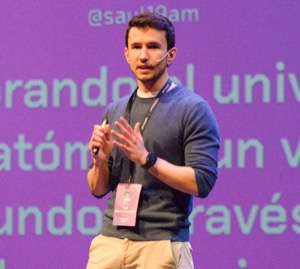
         

         

         <a href="https://samprd.ethz.ch">Saúl Alonso-Monsalve</a>
         

         

         <em> ETH Zurich </em>  
         

         

       

    

         
         

         

         <a href="https://scholar.google.com/citations?user=FNLypywAAAAJ&hl=en">Giorgi Butbaia</a>
         

         

         <em> Caltech </em>  
         

         

       

       
    

         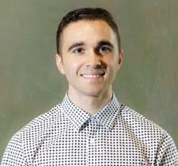
         

         

         <a href="https://www.maths.cam.ac.uk/person/mc2473">Miles Cranmer</a>
         

         

         <em> University of Cambridge </em>  
         

         

       

       
    

         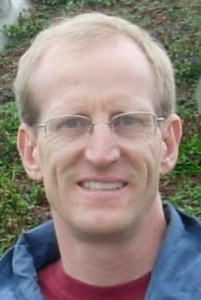
         

         

         <a href="https://faculty.slac.stanford.edu/person/lance-dixon">Lance Dixon</a>
         

         

         <em> SLAC </em>  
         

         

       

    

         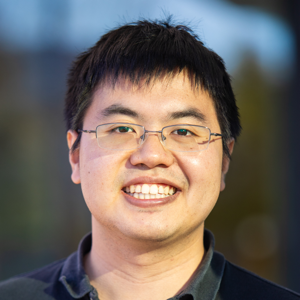
         

         

         <a href="https://yilundu.github.io">Yilun Du</a>
         

         

         <em> Harvard Kempner Institute </em>  
         

         

       

       
    

         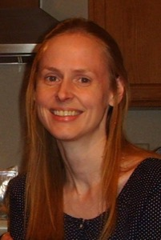
         

         

         <a href="https://www.physics.wisc.edu/directory/everett-lisa-l/">Lisa Everett</a>
         

         

         <em> University of Wisconsin-Madison </em>  
         

         

       

    

         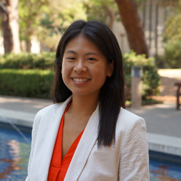
         

         

         <a href="https://www.berthyfeng.com">Berthy Feng</a>
         

         

         <em> IAIFI Fellow & Incoming NYU Assistant Professor starting September 2027 </em>  
         

         

       

     

         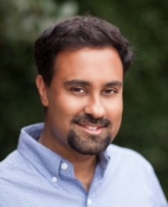
         

         

         <a href="https://ganguli-gang.stanford.edu/surya.html">Surya Ganguli</a>
         

         

         <em> Standford University </em>  
         

         

       

        

         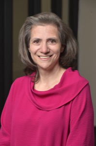
         

         

         <a href="https://physics.northwestern.edu/people/faculty/core-faculty/vicky-kalogera.html">Vicky Kalogera</a>
         

         

         <em> Northwestern University</em>  
         

         

       

       
       

         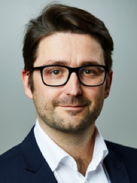
         

         

         <a href="https://www.physik.uni-hamburg.de/en/iexp/gruppe-kasieczka/personen/kasieczka-gregor.html">Gregor Kasieczka</a>
         

         

         <em> Universitat Hamburg </em>  
         

         

       

      

         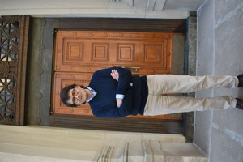
         

         

         <a href="https://www.mit.edu/~kats/">Erik Katsavounidis</a>
         

         

         <em> MIT </em>  
         

         

       

       
      

         
         

         

         <a href="https://blogs.umb.edu/rahulkulkarni/">Rahul Kulkarni</a>
         

         

         <em> UMass Boston </em>  
         

         

       

       
       

         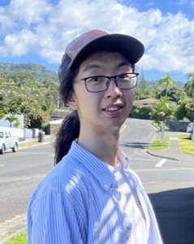
         

         

         <a href="https://zongyi-li.github.io">Zongyi Li</a>
         

         

         <em> MIT </em>  
         

         

       

      

         
         

         

         <a href="https://inspirehep.net/authors/1309390">Sung Hak Lim</a>
         

         

         <em> IBS, Daejeon, CTPU. hep-ex and hep-ph and astro-ph </em>  
         

         

       

       

         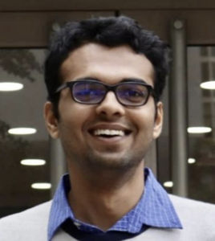
         

         

         <a href="https://astro.arizona.edu/person/shivam-pandey">Shivam Pandey</a>
         

         

         <em> The University of Arizona </em>  
         

         

       

    

         
         

         

         <a href="https://inspirehep.net/authors/993181">Tilman Plehn</a>
         

         

         <em> Heidelberg University </em>  
         

         

       

    

         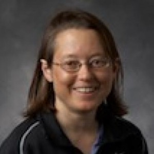
         

         

         <a href="https://sitp.stanford.edu/people/eva-silverstein">Eva Silverstein</a>
         

         

         <em> Stanford University </em>  
         

         

       

    

     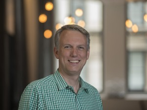
     

     

     <a href="https://benwandelt.org/">Ben Wandelt</a>
     

     

     <em> Johns Hopkins University </em>  
     

     

   

    

     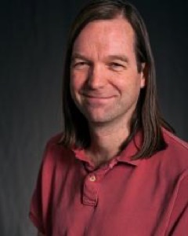
     

     

     <a href="https://phys.washington.edu/people/gordon-watts">Gordon Watts</a>
     

     

     <em> University of Washington </em>  
     

     

   

   
   

        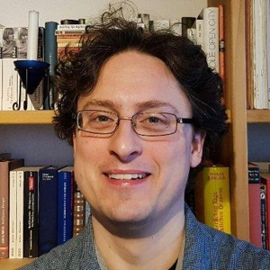
        

        

        <a href="https://www.christophweniger.com/">Christoph Weniger</a>
        

        

        <em> University of Amsterdam </em>  
        

        

     

     
     

        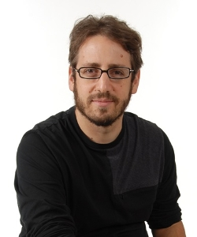
        

        

        <a href="https://sites.uci.edu/daniel/">Daniel Whiteson</a>
        

        

        <em> UC Irvine </em>  
        

        

     

     
        

         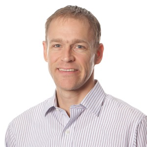
         

         

         <a href="https://seas.harvard.edu/person/todd-zickler">Todd Zickler</a>
         

         

         <em> Harvard University </em>  
         

         

       

       

 

## Accommodations

Recommended hotels in the area include: 

- <b>Le Meridien</b>, 20 Sydney St, Cambridge, MA 02139. 

- <b>Boston Marriott Cambridge<b>, 50 Broadway, Cambridge, MA 02142.

- <b>Residence Inn by Marriott<b>, 120 Broadway, Cambridge, MA 02142.

<!--
* <b>Hyatt Regency<b>, 575 Memorial Drrive, Cambridge, Massachusetts, 02139-4896.
    
    $219 nightly rate
    
    Deadline to book; Friday, July 10, 2026

  [Book online](https://www.hyatt.com/events/en-US/group-booking/BOSRC/G-IAIF)

-->

## FAQ 
* *Who can attend the Summer Workshop?* Any researcher working at or interested in the intersection of physics and AI is encouraged to attend the Summer Workshop. 
* *What is the cost to attend the Summer Worskhop?* The registration fee for the Summer Workshop is 200 USD and includes a welcome dinner, as well as coffee breaks and snacks.
* *If I come to the Summer School, can I also attend the Workshop?* Yes! We encourage you to stay for the Workshop and you can stay in the dorms for both events if you choose (at your expense). 
* *Will the recordings of the talks be available?* We plan to share the talks on our [YouTube channel](https://www.youtube.com/channel/UCueoFcGm_15kSB-wDd4CBZA).

[Submit a question or comment](https://app.smartsheet.com/b/form/76c1d070d19d4688b65962c4ed190478){:.button.button--outline-primary.button--pill.button--sm}

## 2026 Organizing Committee 
* Will Detmold, Co-Chair (MIT)
* Bill Freeman, Co-Chair (MIT) 
* Akshunna Dogra (IAIFI Fellow)
* Berthy Feng (IAIFI Fellow)
* Mathis Gerdes (IAIFI Fellow)
* Juvenal Bassa (UPRM)
* Yize Dong (Harvard)
* Franc O (Northeastern)
* Sneh Pandya (Northeastern)
* Shelley Tong (MIT)
* Lana Xu (MIT)
* Xiaoyuan Zhang (MIT)
* Marisa LaFleur (IAIFI Managing Director)
* Thomas Bradford (IAIFI Project Coordinator)
