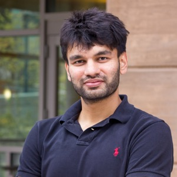

 

The IAIFI Summer Workshop brings together researchers from across Physics and AI for plenary talks, poster sessions, and networking to promote research at the intersection of Physics and AI.

**Registration is now open.  The registration fee is $200 and includes a Workshop dinner.**
{:.info} 

**Interested in submitting a contributed talk or poster? [Submit here](https://app.smartsheet.com/b/form/d5398d0a865a457794ead604c4d61e84) by Monday, June 24, 2024 to be considered. Submissions will be reviewed on a rolling basis.**
{:.info} 

[Register for the Summer Workshop](https://buy.stripe.com/8wMdSy0Nh5iv9OMbIU){:.button.button--outline-primary.button--pill.button--lg}  

* **The 2024 Summer Workshop will be held August 12–16, 2024**
* **Location: MIT Media Lab**
* **Registration deadline: July 31, 2024** 

Here's what attendees at previous IAIFI Summer Workshops had to say about the experience: 

<iframe width="560" height="315" src="https://www.youtube.com/embed/QRfdc-3o01g?si=oHLv6eRpGUnpe__2" title="YouTube video player" frameborder="0" allow="accelerometer; autoplay; clipboard-write; encrypted-media; gyroscope; picture-in-picture; web-share" allowfullscreen></iframe>

Videos of the plenary talks from the 2023 IAIFI Summer Workshop are [now available on YouTube](https://www.youtube.com/playlist?list=PLBY0ED2StbGalYxIbUNEK6ADuEv35W6ig).
{:.success}

<!--
We have extended the deadline to [submit a poster](https://t.co/AmNkXRoWeg).  Submit by July 17, 2023 for full consideration!
{:.success}
-->

[Agenda](#agenda){:.button.button--outline-primary.button--pill.button--lg} [Speakers](#speakers){:.button.button--outline-primary.button--pill.button--lg} [FAQ](#faq){:.button.button--outline-primary.button--pill.button--lg}  [Past Workshops](/past-workshops.html){:.button.button--outline-primary.button--pill.button--lg} [Accommodations](#accommodations){:.button.button--outline-primary.button--pill.button--lg}

## About
The Institute for Artificial Intelligence and Fundamental Interactions (IAIFI) is enabling physics discoveries and advancing foundational AI through the development of novel AI approaches that incorporate first principles, best practices, and domain knowledge from fundamental physics. The goal of the Workshop is to serve as a meeting place to facilitate advances and connections across this growing interdisciplinary field.

## Agenda

### Monday, August 12, 2024
**9:15-9:30 am ET**

Welcome

**9:30–10:15 am ET**

*10,000 Einsteins: AI and the future of theoretical physics*

Matt Schwartz, Harvard/IAIFI

Abstract

<em>AI has already proved revolutionary in many areas of physics, particularly those focused on data analysis. However, machines are also advancing rapidly in symbolic tasks. As much of what is done in theoretical physics is symbolic, there is tremendous potential for machines to transition from data analysis to formal theoretical work. This talk will discuss some initial progress in this direction and a vision for how machines and humans might collaborate in the future to solve some of the most challenging problems in fundamental physics.</em>

**10:15–11:00 am ET**

*Dynamic Models from Data*

Nathan Kutz, University of Washington

Abstract

<em>Physics based models and governing equations dominate science and engineering practice.  The advent of scientific computing has transformed every discipline as complex, high-dimensional and nonlinear systems could be easily simulated using numerical integration schemes whose accuracy and stability could be controlled.  With the advent of machine learning, a new paradigm has emerged in computing whereby we can build models directly from data.  In this work, integration strategies for leveraging the advantages of both traditional scientific computing and emerging machine learning techniques are discussed.  Using domain knowledge and physics-informed principles, new paradigms are available to aid in engineering understanding, design and control.</em>

**11:00-11:30 am ET**

Break

**11:30 am–12:00 pm ET**

*Accurate, efficient, and reliable learning of deep neural operators for multiphysics and multiscale problems*

Lu Lu, Yale University

Abstract

<em>It is widely known that neural networks (NNs) are universal approximators of functions. However, a less known but powerful result is that a NN can accurately approximate any nonlinear operator. This universal approximation theorem of operators is suggestive of the potential of deep neural networks (DNNs) in learning operators of complex systems. In this talk, I will present the deep operator network (DeepONet) to learn various operators that represent deterministic and stochastic differential equations. I will also present several extensions of DeepONet, such as DeepM&Mnet for multiphysics problems, DeepONet with proper orthogonal decomposition or Fourier decoder layers, MIONet for multiple-input operators, and multifidelity DeepONet. I will demonstrate the effectiveness of DeepONet and its extensions to diverse multiphysics and multiscale problems, such as bubble growth dynamics, high-speed boundary layers, electroconvection, hypersonics, geological carbon sequestration, and full waveform inversion. Deep learning models are usually limited to interpolation scenarios, and I will quantify the extrapolation complexity and develop a complete workflow to address the challenge of extrapolation for deep neural operators.</em>

**12:15–1:30 pm ET**

Lunch

**1:30–3:00 pm ET**

**Contributed Talks - Session A**

**Representation/Manifold Learning**

Symmetries and neural tangent kernels: using physical principles to understand deep learning, Jan Gerken (Chalmers University of Technology)

<em>Despite its extraordinary success in applications, a thorough theoretical understanding of deep learning is still lacking, making progress depend largely on costly trial-and-error procedures. At the same time, theoretical physics has a long history of developing deep mathematical understanding of complex systems. In this talk, I will present some recent work on how techniques from theoretical physics can be used to deepen our understanding of deep learning and lead to practically relevant insights. In particular, symmetries, which are an established cornerstone of theoretical physics, have reached widespread popularity as a guiding principle in deep learning as well. In machine learning, symmetries feature most importantly in the form of data augmentation and equivariant neural networks. At the same time, neural tangent kernels, which are closely related to statistical field theory, have emerged as a powerful tool to understand neural networks both at initialization and during training. Combining these paradigms leads to practically relevant statements in deep learning. Furthermore, it opens the door towards further deepening the connecting between theoretical physics and our understanding of neural networks.</em>

 Approximately-symmetric neural networks for quantum spin liquids, Dominik Kufel (Harvard University)

<em>We propose and analyze a family of approximately-symmetric neural networks for quantum spin liquid problems. These tailored architectures are parameter-efficient, scalable, and significantly out-perform existing symmetry-unaware neural network architectures. Utilizing the mixed-field toric code model, we demonstrate that our approach is competitive with the state-of-the-art tensor network and quantum Monte Carlo methods. Moreover, at the largest system sizes (N=480), our method allows us to explore Hamiltonians with sign problems beyond the reach of both quantum Monte Carlo and finite-size matrix-product states. The network comprises an exactly symmetric block following a non-symmetric block, which we argue learns a transformation of the ground state analogous to quasiadiabatic continuation. Our work paves the way toward investigating quantum spin liquid problems within interpretable neural network architectures.</em>

Interpretable representation learning from Chandra X-ray data, Shivam Raval (Harvard University)

<em>We build novel, high-quality data representation vectors (also called embeddings) for X-ray spectral data obtained from the Chandra X-ray observatory, as a means to extract meaningful patterns. We show that these embeddings are interpretable and can be further processed for downstream machine-learning tasks. The data representations are generated using specialized state-of-the-art transformer architectures and state-space models that incorporate the symmetries and correlations in spectra data through a self-supervised or mask-modeling training scheme. The learned representations are powerful and be utilized for classification and regression tasks to predict various properties of the recorded observation such as the spectral parameters of the physical models that are more likely to describe the observations. This is a step towards generating representations of X-ray data that can be used for the classification of serendipitous X-ray sources, most of which remain unclassified, identification of spectral anomalies in high energy datasets, and also as the raw material for future foundation models in astrophysics. This is one of the earliest attempts to construct transformer-based representations in X-ray datasets, and a stepping stone to create learned representations in an energy regime poorly explored so far with machine learning algorithms.</em>

 A Neural Net Model for Distillation with Weights Explained, Berfin Simsek (NYU/Flatiron Institute)

<em>It is important to understand how large models represent knowledge to make them efficient and safe. We study a toy model of neural nets that exhibits non-linear dynamics and phase transition. Although the model is complex, it allows finding a family of the so-called "copy-average" critical points of the loss. The gradient flow initialized with random weights consistently converges to one such critical point for networks up to a certain width, which we proved to be optimal among all copy-average points. Moreover, we can explain every neuron of a trained neural network of any width. As the width grows, the network changes the compression strategy and exhibits a phase transition. We close by listing open questions calling for further mathematical analysis and extensions of the model considered here.</em>

Beyond Closure Models: Estimating Long-term Statistics of Chaotic-Systems via Physics-Informed Neural Operators, Chuwei Wang (Caltech)

<em>Accurately predicting the long-term behavior of chaotic systems is important in many applications. This requires iterative computations on a dense spatiotemporal grid to account for the unstable nature of chaotic systems, which is expensive and impractical in many real-world scenarios. The alternative approach to such a full-resolved simulation is using a coarse grid and then correcting its errors through a 'closure model', which approximates the overall information from fine scales not captured in the coarse-grid simulation. Recently, ML approaches have been used for closure modeling, but they typically require a large number of training samples from expensive fully-resolved simulations (FRS). In this work, through the lens of Liouville flow in function spaces, we prove an even more fundamental limitation, viz., the standard approach to learning closure models suffers from a large approximation error for generic problems, no matter how large the model is, and it stems from the non-uniqueness of the mapping. We propose an alternative end-to-end learning approach using a physics-informed neural operator (PINO) that overcomes this limitation by not using a closure model or a coarse-grid solver.   We first train the PINO model on data from a coarse-grid solver and then fine-tune it with (a small amount of) FRS and physics-based losses on a fine grid. The discretization-free nature of neural operators means that they do not suffer from the restriction of a coarse grid that closure models face, and they can provably approximate the long-term statistics of chaotic systems. In our experiments on fluid dynamics, our PINO model achieves a 120x speedup compared to FRS with a relative error ~5%. In contrast, the closure model coupled with a coarse-grid solver is 58x slower than PINO while having a much higher error 205% when the closure model is trained on the same FRS dataset.</em>

Determining Heterogeneous Elastic Properties of Soft Materials using Physics-Informed Neural Networks, Wensi Wu (Children's Hospital of Philadelphia)

<em>The heterogeneous mechanical properties found in biological materials have profound implications for both engineering and medical applications. Within the engineering community, these properties are frequently studied to guide the design of mechanical devices such as artificial organs and soft robots. Concurrently, in the medical field, the mechanical properties of tissues play a crucial role in providing diagnostic information about various diseases and conditions. The significance of material mechanical properties across these diverse domains has driven a need to better understand the underlying mechanisms governing the microscopic properties of biological tissues and their associated functions, whether for improving material designs or disease diagnosis. In traditional engineering, identifying unknown material parameters requires iterative inverse finite element analyses and optimization of the constitutive parameters until the finite element model achieves an acceptable level of mechanical response, aligning with experimental data. While this method is efficient with homogeneous materials, optimizing the elasticity map of heterogeneous materials is challenging. In this work, we propose using physics-informed neural networks (PINNs) to identify the full-field elastic properties of highly nonlinear, hyperelastic materials. We applied our improved PINNs to six structurally complex materials and three constitutive material models (Neo-Hookean, Mooney-Rivlin, and Gent) to evaluate the accuracy of full-field elasticity maps estimated by PINNs. Our PINN model consistently produced highly accurate estimates of the full-field elastic properties, even when there was up to 10% noise present in the training data.</em>

**Contributed Talks - Session B**

**Generative Models**

Machine learning phase transitions: A probabilistic perspective, Julian Arnold (University of Basel)

<em>The identification of phase transitions and the classification of different phases of matter from data are among the most popular applications of machine learning in physics. Neural network (NN)-based approaches have proven to be particularly powerful due to the ability of NNs to learn arbitrary functions. Many such approaches work by computing indicators of phase transitions from the output of NNs trained to solve specific classification problems. In this talk, I will derive the optimal solutions to these classification problems given by Bayes classifiers that take into account the probability distributions underlying the physical system under consideration [1]. This probabilistic viewpoint allows us to gain a deeper understanding of previous NN-based studies, highlighting the strengths and weaknesses of individual methods [1], enables us to root the methods in information theory [2], yields more efficient numerical routines based on the incorporation of readily available generative models [3], and widens the application domain of these methods to systems outside physics (such as diffusion models or transformers) [4,5]. 
[1] J. Arnold and F. Schäfer, PRX 12, 031044 (2022) [2] J. Arnold et al., arXiv:2311.10710 (2023) [3] J. Arnold et al., PRL 132, 207301 (2024) [4] J. Arnold et al., arXiv:2311.09128 (2023) [5] J. Arnold et al., arXiv:2405.17088 (2024)</em>

Accelerating Molecular Discovery with Machine Learning, Yuanqi Du (Cornell University)

<em>Recent advancements in machine learning have paved the way for groundbreaking opportunities in the realm of molecular discovery. At the forefront of this evolution are improved computational tools with proper inductive biases and efficient optimization. In this talk, I will delve into our efforts around these themes from a geometry, sampling and optimization perspective. I will first introduce how to encode symmetries in the design of neural networks and the balance of expressiveness and computational efficiency. Next, I will discuss how generative models enable a wide range of design and optimization tasks in molecular discovery. In the third part, I will talk about how the advancements in stochastic optimal control, sampling and optimal transport can be applied to find transition states in chemical reactions.</em>

Understanding Diffusion Models by Feynman's Path Integral, Yuji Hirono (Osaka University)

<em>Score-based diffusion models have proven effective in image generation and have gained widespread usage. We introduce a novel formulation of diffusion models using Feynman's path integral [1]. We find this formulation providing comprehensive descriptions of score-based generative models, and demonstrate the derivation of backward stochastic differential equations and loss functions.The formulation accommodates an interpolating parameter connecting stochastic and deterministic sampling schemes, and we identify this parameter as a counterpart of Planck's constant in quantum physics. This analogy enables us to apply the Wentzel-Kramers-Brillouin (WKB) expansion, a well-established technique in quantum physics, for evaluating the negative log-likelihood to assess the performance disparity between stochastic and deterministic sampling schemes.
Reference: [1] Yuji Hirono, Akinori Tanaka, Kenji Fukushima, accepted in ICML2024 [arXiv:2403.11262].</em>

A fast diffusion density estimator, Akhil Premkumar (University of Chicago)

<em>Diffusion models can be used as neural density estimators. The present approach to doing this involves casting the diffusion model as a normalizing flow, and solving the flow to compute the likelihood. This is slow calculation, and prone to noise. We present a highly parallelizable approach which computes the likelihoods at a fraction of the time. Our method also opens the possibility of using diffusion models as fast classifiers.</em>

GANSky: fast full sky weak lensing simulations using physics-informed GANs, Supranta Sarma Boruah (University of Pennsylvania)

<em>Producing accurate weak lensing simulations for future cosmological surveys will be a severe computational bottleneck. We present a method that uses generative adversarial networks (GANs) to produce accurate weak lensing simulations from fast lognormal simulations. This enables us to produce full-sky weak lensing simulations in seconds. Our method: 1. Is physics-informed and explainable, where large-scales are described by an analytic lognormal model and the GAN only learns local redistribution of matter in these approximate maps. 2. Works on full-sky, as required for future wide-field surveys, 3. Requires fewer simulations to train, 4. Accurately reproduces non-Gaussianities of the weak lensing convergence field. This breakthrough enables fast simulation-based or field-based inference with weak lensing data.</em>

Predicting Missing Regions in Charged Particle Tracks Using a Sparse 3D Convolutional Neural Network, Hilary Utaegbulam (University of Rochester)

<em>The 2x2 Demonstrator is a prototype detector for the Deep Underground Neutrino Experiment (DUNE)'s Near Detector. Both the 2x2 Demonstrator and the Near Detector itself will have inactive regions wherein there is reduced or no sensitivity to charge deposition and light signals that arise from charged particle interactions with liquid argon. In the 2x2, these inactive regions are positioned in-between the active detector modules, which introduces the challenge of inferring what charge signals ought to look like in these regions. This study explores the use of a Sparse 3D Convolutional Neural Network (ConvNet) to infer missing regions in charged particle tracks. Hits corresponding to energy depositions are voxelized into a three-dimensional (3D) grid for each track. Inactive regions within the tracks are replaced with a dense, rectangular 3D grid of voxels, ensuring consistent step sizes in X, Y, and Z directions. Voxels in these dense regions are initialized with an energy value of -1, indicating nonphysical energy or charge. The model is trained to predict which voxels should activate as part of the track and which should not, with the goal of eventually inferring the missing charge or energy values in these voxels. Results indicate that the model accurately predicts track voxels within ±3 unit in X, Y, or Z directions and effectively identifies non-track voxels, despite some overprediction. The approach shows promise in prediction of missing track regions with some accuracy.</em>

**3:00–3:30 pm ET**

Break

**3:30–4:15 pm ET**

*What Do Language Models Have To Say About Fundamental Physics?* 

Mariel Pettee, LBNL/Flatiron

Abstract

<em>The launch of ChatGPT in November 2022 ignited an ongoing worldwide conversation about the possible impacts of Large Language Models (LLMs) on the way we work. As scientists, however, the changes in our workflows since the advent of this technology have been relatively minor. Will this still be the case in 10 years? Could an analogous paradigm shift arise from a foundation model trained on a large amount of scientific data, transforming the way we conduct our research? If so, what can we learn from the development of other foundation models, particularly LLMs, in their evolution from specialists to (quasi-)generalists? In this talk, I will present some recent work exploring how language models could help form a foundation model of fundamental physics. I'll also share my perspective on how we should strive to shape such models to reflect our highest priorities as scientists.</em>

**4:15-5:00 pm ET**

*Solving the nuclear many-body problem with neural quantum state*

Alessandro Lovato, Argonne National Laboratory

Abstract

<em>Artificial neural networks can be employed to accurately and compactly represent quantum many-body states relevant to many applications, including nuclear physics, quantum chemistry, and condensed matter problems. I will argue that a variational Monte Carlo algorithm based on neural-network quantum states provides a systematically improvable solution to the nuclear Schrödinger equation with a polynomial cost in the number of nucleons. After presenting recent progress in describing atomic nuclei, neutron-star matter, and hypernuclei, I will illustrate an application to condensed-matter systems, specifically ultra-cold Fermi gases near the unitary limit. Detailed benchmarks with continuum Quantum Monte Carlo methods will be presented.</em>

**5:00–7:00 pm ET**

Poster Session

Details

<em>Details to come.</em>

**6:00–8:00 pm ET**

Welcome Reception

### Tuesday, August 13, 2024

**9:30–10:15 am ET**

*Trends in AI for particle accelerators*

Verena Kain, CERN

Abstract

<em>AI is without doubt radically transforming science with many successful applications in molecular biology, astrophysics, nuclear physics and particle physics. It has enabled significant technological advances for robotics that can particularly enhance a system’s perception, navigational and manipulation abilities and interaction. For control, it enables novel and faster learning/teaching of tasks, replacing or augmenting classical control techniques for hard problems such as real-time control of the non-linear dynamics of the plasma in a tokamak of a fusion reactor, or navigating drones with super-human performance. Given the success and types of use cases that can be solved with AI algorithms, accelerator physics and associated technologies have also picked up on AI in the last 5 to 10 years with the number of ML applications steadily rising  - and subsequently the number of ML related papers at the big particle accelerator conferences. This contribution will give a brief overview of the typical use cases for AI for particle accelerators, show recent trends and describe the potential and vision of AI for particle accelerators with the emphasis on control and optimisation of particle accelerators.</em>

**10:15–11:00 am ET**

*Machine Learning for LHC Theory or Something Like That*

Tilman Plehn, Heidelberg

Abstract

<em>Details to come</em>

**11:00-11:30 am ET**

Break

**11:30 am–12:00 pm ET**

*Details to come*

Rose Yu, UCSD

Abstract

<em>Details to come</em>

**12:15–1:30 pm ET**

Lunch

**1:30–3:00 pm ET**

**Contributed Talks - Session A**

**Foundational ML**

Input Space Mode Connectivity in Deep Neural Networks, Jakub Vrabel (CEITEC, Brno University of Technology)

<em>We extend the concept of loss landscape mode connectivity to the input space of deep neural networks. Mode connectivity was originally studied within parameter space, where it describes the existence of low-loss paths between different solutions (loss minimizers) obtained through gradient descent. We present theoretical and empirical evidence of its presence in the input space of deep networks, thereby highlighting the broader nature of the phenomenon. We observe that different input images with similar predictions are generally connected, and for trained models, the path tends to be simple, with only a small deviation from being a linear path. Our methodology utilizes real, interpolated, and synthetic inputs created using the input optimization technique for feature visualization. To prove the existence of general mode connectivity in high-dimensional input spaces, we employ percolation theory. We argue that the approximate linear mode connectivity post-training is a manifestation of some implicit bias. We exploit mode connectivity to obtain new insights about adversarial examples and demonstrate its potential for adversarial detection. Additionally, we discuss applications for the interpretability of deep networks.</em>

Neural scaling laws from large-N field theory, Zhengkang Zhang (University of Utah)

<em>Many machine learning models based on neural networks exhibit scaling laws: their performance scales as power laws with respect to the sizes of the model and training data set. We use large-N field theory methods to solve a model recently proposed by Maloney, Roberts and Sully which provides a simplified setting to study neural scaling laws. Our solution extends the result in this latter paper to general nonzero values of the ridge parameter, which are essential to regularize the behavior of the model. In addition to obtaining new and more precise scaling laws, we also uncover a duality transformation at the diagrams level which explains the symmetry between model and training data set sizes. The same duality underlies recent efforts to design neural networks to simulate quantum field theories.</em>

RG flow of the NTK dynamics at finite-width from Feynman diagrams, Max Guillen (Chalmers University of Technology)

<em>Deep Learning is nowadays a well-stablished method for different applications in science and technology. However, it has been unclear for a long time how the "learning process" actually occurs in different architectures, and how this knowledge could be used to optimize performance and efficiency. Recently, high-energy-physics-based ideas have been applied to the modelling of Deep Learning, thus translating the learning problem to an RG flow analysis in Quantum Field Theory (QFT). In this talk, I will explain how these quite complicated formulae describing such RG flows for different observables in neural networks at initialization, can be easily obtained from a few rules resembling Feynman rules in QFT. I will also comment on some work in progress which implements such rules for computing higher-order corrections to the frozen (infinite-width) NTK for particular activation functions, and how they evolve after a few steps of SGD.</em>

Diversity with Similarity as a Measure of Dataset Quality, Josiah Couch (Beth Israel Deaconess Medical Center)

<em>Dataset size and class balance are important measures in deep learning. Maximizing them is seen as a way to ensure that datasets contain diverse images, which models are thought to need in order to generalize well. Yet neither size nor class balance measure image diversity directly, raising the possibility that better measures of dataset quality might exist. To test this hypothesis, we turned to a comprehensive framework of diversity measures that generalizes familiar quantities like Shannon entropy by accounting for the similarities and differences among images. (Size and class balance emerge from this framework as special cases.) We created several thousand diverse datasets by subsampling a variety of large medical-image datasets representing a range of imaging modalities, trained classifiers on these subsets, and calculated the correlation between subset diversity and model accuracy using diversity measures from the framework.</em>

Fourier-enhanced deep operator network for geophysics with improved accuracy, efficiency, and generalizability, Min Zhu (Yale University)

<em>Full waveform inversion (FWI) and geologic carbon sequestration (GCS) are two significant topics in geophysics. FWI infers subsurface structure information from seismic waveform data by solving a non-convex optimization problem. On the other hand, solving multiphase flow in porous media is essential for CO2 migration and pressure fields in the subsurface associated with GCS. However, numerical simulations for both FWI and GCS are computationally challenging and expensive due to the highly nonlinear governing partial differential equations (PDEs). Here, we develop a Fourier-enhanced deep operator network (Fourier-DeepONet) to address this issue. For FWI, compared with existing data-driven FWI methods, Fourier-DeepONet achieves more accurate predictions of subsurface structures across a wide range of source parameters. Additionally, Fourier-DeepONet demonstrates superior robustness when handling data with Gaussian noise or missing traces. For GCS, compared to the state-of-the-art Fourier neural operator (FNO), Fourier-DeepONet offers superior computational efficiency, with 90% fewer unknown parameters, significantly reduced training time (approximately 3.5 times faster), and much lower GPU memory requirements (less than 35%). Furthermore, Fourier-DeepONet maintains good accuracy when predicting out-of-distribution (OOD) data. This excellent generalizability is enabled by its adherence to the physical principle that the solution to a PDE is continuous over time.</em>

Details to come, Anindita Maiti (Perimeter Institute)

<em>Details to come</em>

**3:00–3:30 pm ET**

Break

**3:30–4:15 pm ET**

*KAN: Kolmogorov-Arnold Networks*

Ziming Liu, MIT/IAIFI

Abstract

<em>Inspired by the Kolmogorov-Arnold representation theorem, we propose Kolmogorov-Arnold Networks (KANs) as promising alternatives to Multi-Layer Perceptrons (MLPs). While MLPs have fixed activation functions on nodes ("neurons"), KANs have learnable activation functions on edges ("weights"). KANs have no linear weights at all -- every weight parameter is replaced by a univariate function parametrized as a spline. We show that this seemingly simple change makes KANs outperform MLPs in terms of accuracy and interpretability. For accuracy, much smaller KANs can achieve comparable or better accuracy than much larger MLPs in data fitting and PDE solving. Theoretically and empirically, KANs possess faster neural scaling laws than MLPs. For interpretability, KANs can be intuitively visualized and can easily interact with human users. Through two examples in mathematics and physics, KANs are shown to be useful collaborators helping scientists (re)discover mathematical and physical laws. In summary, KANs are promising alternatives for MLPs, opening opportunities for further improving today's deep learning models which rely heavily on MLPs.</em>

**4:15-5:00 pm ET**

*Details to come*

Pulkit Agrawal, MIT/IAIFI

Abstract

<em>Details to come</em>

### Wednesday, August 14, 2024

**9:30–10:15 am ET**

*Navigating Complex Models: Neural Networks for High-Dimensional Statistical Inference*

Christoph Weniger, University of Amsterdam

Abstract

<em>Details to come</em>

**10:15–11:00 am ET**

*Data-Driven High-Dimensional Inverse Problems: A Journey Through Strong Lensing Data Analysis*

Laurence Levasseur, University of Montreal

Abstract

<em>Details to come</em>

**11:00-11:30 am ET**

Break

**11:30 am–12:00 pm ET**

*Machine Learning and Physics: The Alliance of the Titans*

Ayan Paul, Northeastern

Abstract

<em>Leaps in our understanding of Physics have been concomitant with the adoption of new and increasingly powerful mathematical structures that shift our perspective of how we probe the dynamics of the universe and allow us to unravel complex concepts that were hitherto inaccessible to us. In the realm of data-driven science, where physics is firmly planted, machine learning is proving to be a long-awaited and much-needed mathematical structure that has showcased its worth in aiding landmark discoveries, understanding the underlying symmetries of theories that we propose, and connecting signals to kinematics interpretably, to mention a few. In this parable on the charm of machine learning in physics, we will discuss the nuances of some of these achievements and lay out what we can expect from the future.</em>

**12:15–1:30 pm ET**

Lunch

**1:30–3:00 pm ET**

**Industry-Academia Collaboration Panel**

**3:00–3:30 pm ET**

Break

**3:30–4:15 pm ET**

*Details to come*

Earl Bellinger, Yale University

Abstract

<em>Details to come</em>

**4:15-5:00 pm ET**

*Big data cosmology meets AI*

Carol Cuesta-Lazaro, IAIFI Fellow

Abstract

<em>The upcoming era of cosmological surveys promises an unprecedented wealth of observational data that will transform our understanding of the universe. Surveys such as DESI, Euclid, and the Vera C. Rubin Observatory will provide extremely detailed maps of billions of galaxies out to high redshifts. Analyzing these massive datasets poses exciting challenges that machine learning is uniquely poised to help overcome. In this talk, I will highlight recent examples from my work on probabilistic machine learning for cosmology. First, I will explain how a point cloud diffusion model can be used both as a generative model for 3D maps of galaxy clustering and as a likelihood model for such datasets. Moreover, I will present a generative model developed to reconstruct the initial conditions of the Universe from spectroscopic survey observations. When combined with the wealth of data from upcoming surveys, these machine learning techniques have the potential to provide new insights into fundamental questions about the nature of the universe.</em>

### Thursday, August 15, 2024

**9:30–10:15 am ET**

*Uncertainty Quantification from Neural Network Correlation Functions*

Yonatan Kahn, University of Illinois Urbana-Champaign

Abstract

<em>Details to come</em>

**10:15–11:00 am ET**

*Transformers to transform Scattering Amplitudes Calculation*

Tianji Cai, SLAC

Abstract

<em>AI for fundamental physics is now a burgeoning field, with numerous efforts pushing the boundaries of experimental and theoretical physics. In this talk, I will introduce a recent innovative application of Natural Language Processing to state-of-the-art calculations for scattering amplitudes. Specifically, we use Transformers to predict the symbols at high loop orders of the three-gluon form factors in planar N=4 Super Yang-Mills theory. Our results have demonstrated great promises of Transformers for amplitude calculations, opening the door for an exciting new scientific paradigm where discoveries and human insights are inspired and aided by AI.</em>

**11:00-11:30 am ET**

Break

**11:30 am–12:00 pm ET**

*Neural ansatze for physical systems*

Nima Dehmamy, IBM Research MIT-IBM Lab 

Abstract

<em>Details to come</em>

**12:15–1:30 pm ET**

Lunch

**1:30–3:00 pm ET**

**Contributed Talks: Details to come**

**3:00–3:30 pm ET**

Break

**3:30–4:15 pm ET**

*Applications of Neural Networks to Mitigate Unique Challenges in Neutrino Experiments*

Jessie Micallef, IAIFI Fellow

Abstract

<em>Details to come</em>

**4:15-5:00 pm ET**

*Equivariant Convolutional Networks & Group Steerable Kernels*

Maurice Weiler, MIT

Abstract

<em>Equivariance imposes symmetry constraints on the connectivity of neural networks. This talk investigates the case of equivariant networks for feature vector fields or point clouds, which generally requires 1) spatial (convolutional) weight sharing, and 2) G-steerability constraints on the shared weights themselves. It gives an intuition for steerable convolution kernels, discusses how they can be implemented directly via harmonic bases or implicitly via equivariant MLPs, and clarifies the relation to typical message passing operations in equivariant MPNNs. A gauge theoretic formulation of equivariant CNNs and MPNNs shows that these models are not only equivariant under global transformations, but under more general local gauge transformations as well.</em>

**5:00-5:30 pm ET**

Break

**5:30-7:30 pm ET**

Workshop Dinner

### Friday, August 16, 2024

**9:30–10:15 am ET**

*Neural Networks and Conformal Field Theory*

Jim Halverson, Northeastern/IAIFI

Abstract

<em>I'll present an essential result in ML theory, explain how it motivates a new approach to field theory, and present some key findings. Next, I'll discuss new work, explaining a result of Dirac on the relationship between Lorentz invariance and conformal invariance, and how this can be applied in neural networks for constructing new conformal field theories.</em>

**10:15–11:00 am ET**

*Solving inverse problems with adaptive MCMC*

Kaze Wong, Flatiron

Abstract

<em>Solving inverse problems is one of the most common tasks in natural science, which involves estimating the probability distribution of some parameters of interest given some data. MCMC has been the main workhorse in solving inverse problems for decades now. However, the relative inefficiency of MCMC compared to other methods such as simulation-based inference makes them not suitable for many modern datasets. In this talk, I will talk about adaptive MCMC, which combines MCMC and neural networks to improve the efficiency of MCMC while maintaining their guarantee.</em>

**11:00-11:30 am ET**

Break

**11:30 am–12:00 pm ET**

*Details to come*

David Kaiser, MIT

Abstract

<em>Details to come</em>

**12:15–1:30 pm ET**

Lunch

**1:30–2:15 pm ET**

*Details to come*

Dirk Englund, MIT

Abstract

<em>Details to come</em>

**2:15–3:00 pm ET**

*Details to come*

Auralee Edelen, SLAC

Abstract

<em>Details to come</em>

**3:00–3:30 pm ET**

Closing

## Speakers
Speakers will be announced as they are confirmed. 

  <!--
-->
    
    

         
         

         

         <a href="https://people.csail.mit.edu/pulkitag/">Pulkit Agrawal</a>
         

         

         <em> Assistant Professor, EECS, MIT </em>  
         

         

       

    

         
         

         

         <a href="https://earlbellinger.com/">Earl Bellinger</a>
         

         

         <em> Assistant Professor, Department of Astronomy, Yale University </em>  
         

         

       

    

         
         

         

         <a href="https://profiles.stanford.edu/tianji-cai">Tianji Cai</a>
         

         

         <em> Research Associate, SLAC National Accelerator Laboratory </em>  
         

         

       

       
    

         
         

         

         <a href="https://iaifi.org/current-fellows.html#carolina-cuesta">Carolina Cuesta-Lazaro</a>
         

         

         <em> IAIFI Fellow, IAIFI </em>  
         

         

       

    

         
         

         

         <a href="http://nimadehmamy.com/">Nima Dehmamy</a>
         

         

         <em> Research Staff Member, IBM Research </em>  
         

         

       

   
    

         
         

         

         <a href="https://scholar.google.com/citations?user=dFg7SC0AAAAJ&hl=en">Auralee Edelen</a>
         

         

         <em> Associate Scientist, SLAC National Accelerator Laboratory </em>  
         

         

       

    

         
         

         

         <a href="https://www.eecs.mit.edu/people/dirk-r-englund/">Dirk Englund</a>
         

         

         <em> Associate Professor, MIT </em>  
         

         

       

    

         
         

         

         <a href="http://www.jimhalverson.com/">Jim Halverson</a>
         

         

         <em> Associate Professor, Physics, Northeastern </em>  
         

         

       

        

         
         

         

         <a href="https://yfkahn.web.illinois.edu/">Yonatan Kahn</a>
         

         

         <em> Assistant Professor, Theoretical Physicist, UIUC </em>  
         

         

       

    
    

         
         

         

         <a href="https://sparks.cern/index.php/kain-verena/">Verena Kain</a>
         

         

         <em> Scientist, CERN </em>  
         

         

       

       
    

         
         

         

         <a href="https://web.mit.edu/dikaiser/www/">David Kaiser</a>
         

         

         <em> Professor, History of Science/Physics, MIT </em>  
         

         

       

    

         
         

         

         <a href="https://amath.washington.edu/people/j-nathan-kutz">J. Nathan Kutz</a>
         

         

         <em> Professor, University of Washington </em>  
         

         

       

    

         
         

         

         <a href="https://mila.quebec/en/person/laurence-perreault-levasseur/">Laurence Levasseur</a>
         

         

         <em> Assistant Professor, University of Montreal </em>  
         

         

       

       
           

         
         

         

         <a href="https://kindxiaoming.github.io/">Ziming Liu</a>
         

         

         <em> Grad Student, MIT </em>  
         

         

       

    

         
         

         

         <a href="https://www.anl.gov/profile/alessandro-lovato">Alessandro Lovato</a>
         

         

         <em> Physicist, Argonne National Laboratory </em>  
         

         

       

    

         
         

         

         <a href="https://lugroup.yale.edu/">Lu Lu</a>
         

         

         <em> Assistant Professor, Yale University </em>  
         

         

       

    

         
         

         

         <a href="https://github.com/jessimic">Jessie Micallef</a>
         

         

         <em> IAIFI Fellow, IAIFI </em>  
         

         

       

        
    

         
         

         

         <a href="https://ai.northeastern.edu/our-people/ayan-paul">Ayan Paul</a>
         

         

         <em> Research Scientist, The Institute for Experiential AI - Northeastern University </em>  
         

         

       

       
    

         
         

         

         <a href="https://marielpettee.com//">Mariel Pettee</a>
         

         

         <em> Chamberlain Postdoctoral Research Fellow, Lawrence Berkeley National Lab </em>  
         

         

       

       
    

         
         

         

         <a href="https://www.thphys.uni-heidelberg.de/~plehn/">Tilman Plehn</a>
         

         

         <em> Professor, ITP - Heidelberg University </em>  
         

         

       

    

         
         

         

         <a href="https://scholar.harvard.edu/schwartz">Matt Schwartz</a>
         

         

         <em> Professor, Harvard </em>  
         

         

       

       
    

         
         

         

         <a href="https://maurice-weiler.gitlab.io/">Maurice Weiler</a>
         

         

         <em> Deep Learning Researcher, University of Amsterdam </em>  
         

         

       

    

         
         

         

         <a href="https://www.christophweniger.com">Christoph Weniger</a>
         

         

         <em> Associate Professor, University of Amsterdam </em>  
         

         

       

    

         
         

         

         <a href="https://www.simonsfoundation.org/people/kaze-wong/">Kaze Wong</a>
         

         

         <em> Research Fellow, Flatiron Institute/CCA </em>  
         

         

       

       
    

         
         

         

         <a href="https://roseyu.com//">Rose Yu</a>
         

         

         <em> Assistant Professor, UC San Diego department of Computer Science and Engineering. </em>  
         

         

       

       
    <!--
    

  -->

 

## Accommodations
We have secured discounted rates at the following hotels:
* <b>Royal Sonesta Boston</b>, 40 Edwin H Land Blvd, Cambridge, MA 02142. 
    
    $224 nightly rate (1-2 people per room) 

    [Book now](https://book.passkey.com/go/MITAugust2024)

Workshop attendees are also welcome to book dorms for a discounted rate at Boston University: 
* <b>10 Buick Street, Boston</b>

    $97.50 nightly rate (1 person per room, shared bathroom with 1 other person) 

    [Book now](https://mit-iaifi-housing-2024.eventbrite.com/)

## FAQ 
* *Who can attend the Summer Workshop?* Any researcher working at or interested in the intersection of physics and AI is encouraged to attend the Summer Workshop. 
* *What is the cost to attend the Summer Worskhop?* The registration fee for the Summer Workshop is 200 USD and includes a welcome dinner, as well as coffee breaks and snacks.
* *If I come to the Summer School, can I also attend the Workshop?* Yes! We encourage you to stay for the Workshop and you can stay in the dorms for both events if you choose (at your expense). 
* *Will the recordings of the talks be available?* We plan to share the talks on our [YouTube channel](https://www.youtube.com/channel/UCueoFcGm_15kSB-wDd4CBZA).

[Submit a question or comment](https://app.smartsheet.com/b/form/76c1d070d19d4688b65962c4ed190478){:.button.button--outline-primary.button--pill.button--sm}

## 2024 Organizing Committee 
* Fabian Ruehle, Chair (Northeastern University)
* Demba Ba (Harvard)
* Alex Gagliano (IAIFI Fellow)
* Di Luo (IAIFI Fellow)
* Polina Abratenko (Tufts)
* Owen Dugan (MIT)
* Sneh Pandya (Northeastern)
* Yidi Qi (Northeastern)
* Manos Theodosis (Harvard)
* Sokratis Trifinopoulos (MIT)
