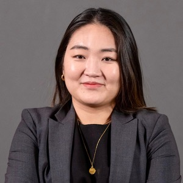

 

The IAIFI Summer Workshop brings together researchers from across Physics and AI for plenary talks, poster sessions, and networking to promote research at the intersection of Physics and AI. We are also accepting submissions for contributed talks and/or posters.

* **The 2025 Summer Workshop will be held August 11–15, 2025**
* **Location: Harvard University Northwest Building (52 Oxford St, Cambridge, MA 02138)**
* **[Registration is now open](https://buy.stripe.com/fZe9Ci53xfX90eceVb) for the 2025 IAIFI Summer Workshop; Register by July 31, 2025 ($200 registration fee).** 

[Register for the 2025 IAIFI Summer Workshop](https://buy.stripe.com/fZe9Ci53xfX90eceVb){:.button.button--outline-primary.button--pill.button--lg} <!--[Submit a Talk/Poster by June 1, 2025](https://app.smartsheet.com/b/form/dcec880db8f149ef84792b4d34b7fd7d){:.button.button--outline-primary.button--pill.button--lg}-->

Here's what attendees at previous IAIFI Summer Workshops had to say about the experience: 

<iframe width="560" height="315" src="https://www.youtube.com/embed/QRfdc-3o01g?si=oHLv6eRpGUnpe__2" title="YouTube video player" frameborder="0" allow="accelerometer; autoplay; clipboard-write; encrypted-media; gyroscope; picture-in-picture; web-share" allowfullscreen></iframe>

[Agenda](#agenda){:.button.button--outline-primary.button--pill.button--lg} [Speakers](#speakers){:.button.button--outline-primary.button--pill.button--lg} [FAQ](#faq){:.button.button--outline-primary.button--pill.button--lg}   [Accommodations](#accommodations){:.button.button--outline-primary.button--pill.button--lg} [Past Workshops](/past-workshops.html){:.button.button--outline-primary.button--pill.button--lg}

## About
The Institute for Artificial Intelligence and Fundamental Interactions (IAIFI) is enabling physics discoveries and advancing foundational AI through the development of novel AI approaches that incorporate first principles, best practices, and domain knowledge from fundamental physics. The goal of the Workshop is to serve as a meeting place to facilitate advances and connections across this growing interdisciplinary field.
<!--
[View recommendations for meals and activities around MIT](https://docs.google.com/document/d/1Z2qX9Owxi7IV3D2q3xBIXns5y4r3rAps/edit#heading=h.gjdgxs)
-->

## Agenda

*The agenda is subject to change.* 

### Monday, August 11, 2025
**9:00-9:15 am ET**

Welcome

**9:15–10:00 am ET**

*AI in Astrophysics: Tackling Domain Shift, Model Robustness and Uncertainty*

Aleksandra Ciprijanovic, Fermilab

Abstract

<em>Artificial Intelligence is transforming astrophysics, from studying stars and galaxies to analyzing cosmic large-scale structures. However, a critical challenge arises when AI models trained on simulations or past observational data are applied to new observation— leading to domain shifts, reduced robustness, and increased uncertainty of model predictions. This talk will explore these issues, highlighting examples such as galaxy morphology classification and cosmological parameter inference, where AI struggles to adapt across different datasets. We will discuss domain adaptation as a strategy to improve model generalization and mitigate biases—essential for making AI-driven discoveries reliable. Notably, these challenges extend beyond astrophysics, affecting AI applications across physics and other scientific domains. Addressing them is essential for maximizing AI’s impact in advancing scientific research.</em>

**10:00–10:45 am ET**

*Theoretical foundations for language model self-improvement*

Dylan Foster, Microsoft Research

Abstract

<em>Language model post-training techniques based on reinforcement learning have led to breakthroughs in reasoning, but may fail to learn behaviors that are not already present in the pre-trained base model. Can we equip models with the ability to explore novel behaviors on their own, so that they can truly self-improve and solve open-ended problems? 

This talk will offer a theoretical perspective on this question. We will introduce a new framework for reinforcement learning with pre-trained language models, and show that (1) for a large class of existing algorithms, efficient exploration with language models is impossible (perhaps surprisingly, this is for computational reasons rather than statistical reasons); but (2) this can be sidestepped through new algorithmic interventions that combine multi-turn reinforcement learning with deliberate use of test-time compute, allowing efficient discovery of new behaviors beyond the base model.</em>

**10:45-11:15 am ET**

Break

**11:15 am–12:00 pm ET**

*Self-supervised Reinforcement Learning and Generative Models*

Amy Zhang, UT Austin

Abstract

<em>We explore the intersection of generative AI and reinforcement learning, demonstrating how generative models can be understood as RL agents and environments, and conversely, how RL can be viewed as generative modeling. We show how this perspective leads to new forms of self-supervised reinforcement learning algorithms that form new objectives for training generative models. We will discuss future directions and open problems, focusing on how RL can shape the future of foundation model training.</em>

**12:00–1:30 pm ET**

Lunch Break

**1:30–2:15 pm ET**

*Machine Learning for Time-Domain Astrophysics*

Alex Gagliano, IAIFI Fellow

Abstract

<em>Large-scale imaging surveys of the night sky have driven a boom in the discovery and analysis of supernovae: the explosions of massive stars. Though our sample sizes continue to grow, the data volumes pose major challenges for traditional analyses. In this talk, I will introduce a series of machine learning approaches developed for time-domain astrophysics, with a focus on the physics and progenitors of core-collapse supernovae. I will discuss how contrastive learning, hierarchical classification, and generative modeling can help astronomers uncover structure in multimodal data, enable early classification, and facilitate physical inference in the face of measurement uncertainty. Drawing on lessons from my own work, I will forecast the future of supernova science in the era of large-scale surveys like the Vera C. Rubin Observatory's Legacy Survey of Space and Time.</em>

**2:15–3:00 pm ET**

*Emulating Dark Matter Halo Merger Trees with Generative Models*

Tri Nguyen, CIERA, Northwestern University

Abstract

<em>Merger trees track the hierarchical assembly of dark matter halos and are crucial for semi-analytic galaxy formation models. However, traditional methods rely on ad-hoc assumptions and struggle to incorporate environmental information. I present FLORAH-Tree, a generative model for merger trees by representing them as graph structures that capture the full branching hierarchy. I trained FLORAH-Tree on merger trees from the Very Small MultiDark Planck N-body simulation and validated it against simulation data and Extended Press-Schechter analytical trees. FLORAH-Tree accurately reproduces key merger tree statistics across mass and redshift ranges, outperforming analytical approaches. Applying the Santa Cruz semi-analytic model to generated trees shows that galaxy-halo scaling relations match expectations. FLORAH-Tree provides a computationally efficient method for generating merger trees while maintaining N-body simulation fidelity.</em>

**3:00–3:30 pm ET**

Break

**3:30–4:15 pm ET**

*Multimodal Foundation Models for Scientific Data* 

Francois Lanusse, CNRS

Abstract

<em>Deep Learning has seen a recent shift in paradigm, from training specialized models on dedicated datasets, so-called Foundation Models, trained in a self-supervised manner on vast amounts of data and then adapted to solve specific tasks with state-of-the-art performance. This new paradigm has been exceptionally successful not only for large language models (LLMs) but in other domains such as vision models. In this talk I will discuss several methodologies that can be deployed in our scientific domains, in particular weakly-supervised cross-modal contrastive learning and multimodal self-supervised generative pretraining. I will show how these approaches can be used to build models flexible to very diverse and inhomogeneous observations (e.g. different types of measurements such as spectra, time-series, or images, but also different instruments, etc...) and how they can then be leveraged by the end-user for a variety of downstream applications (e.g. redshift estimation, morphology classification, physical parameter inference, searching for rare objects) with very simple machine learning methods and still reach near-optimal performance.</em>

**4:15-5:00 pm ET**

*Structured Learning for Astrophysical Data*

Peter Melchior, Princeton University

Abstract

<em>Astronomy and astrophysics are currently undergoing profound changes as the results of two developments: 1) the availability of vast quantities of data from surveys and simulations, and 2) the rapid progress in machine learning and AI. But how should we bridge the gap between data-driven and theoretical descriptions of the Universe? How do we actually learn new aspects of physical systems from data? I will show that introducing structure, usual reflecting causal relations, into deep learning architectures creates efficient, robust, useful, and highly interpretable models that respect known physics and reveal unknown phenomena. I will present results from my group on exoplanets, galaxy evolution, and cosmology to demonstrate what we can achieve already and discuss how this approach leads to future astrophysics and AI research.</em>

**5:30–8:00 pm ET**

Poster Session and Reception

Details

<ul> <li> Differentiable Water Cherenkov Detector Simulation, Omar Alterkait (Tufts University / IAIFI) </li>
<li> End-to-end Optimization of Generative AI for Robust Background Estimation, Giada Badaracco (ETH Zurich) </li>
<li> Masked Autoencoder for Pretraining in Cosmic Ray Background Classification task, Vinicius Da Silva (Tufts University) </li>
<li> Mantis Shrimp: Exploring Photometric Band Utilization in Computer Vision Networks for Photometric Redshift Estimation, Andrew Engel (The Ohio State University) </li>
<li> Stress testing a Simulation Based Inference approach to Weak Lensing Galaxy Cluster Mass Inference, Akum Gill (Harvard University) </li>
<li> Task complexity shapes internal representations and robustness in neural networks, Robert Jankowski (University of Barcelona) </li>
<li> Generalization and robustness of neural ordinary differential equations for dynamical systems on graphs, Moritz Laber (Northeastern University) </li>
<li> Solvable Model of Pretrain-Test Task Alignment in In-Context Learning, Mary Letey (Harvard University) </li>
<li> Fast density functional theory for training machine learning interatomic potentials via large-scale atomistic sampling, Emmanuel Lujan (Massachusetts Institute of Technology) </li>
<li> Symbolic regression for precision LHC physics, Manuel Morales-Alvarado (INFN, Sezione di Trieste) </li>
<li> Generalized Parton Distributions from Symbolic Regression, Zaki Panjsheeri (University of Virginia) </li>
<li> A Breadth First Search Algorithm for Data Clustering based on Space-time Curvature, Ailun Shen (Interlake) </li>
<li> Analytical Theory of Spectral Effects in Sampling and Learning of Diffusion Model, Binxu Wang (Harvard University, Kempner Institute) </li>
<li> Investigating the Morphological Footprints of Cosmology in the Cosmic Web, Pragyan Yadav (University of Connecticut) </li></ul>
<li> LLM-based AI Agent and Multi-agent System with Reinforcement Learning, Jieliang Yin (Hong Kong University of Science and Technology) </li>
<li> Learning Dynamic Manifolds with Grassmann Geometry, Jacob Hume (University of Cambridge) </li>
<li> Real-Time Compression of CMS Detector Data Using Conditional Autoencoders, Zachary Baldwin (Carnegie Mellon University) </li>

### Tuesday, August 12, 2025

**9:00–9:45 am ET**

*(Machine) Learning of Dark Matter*

Lina Necib, MIT

Abstract

<em>In this talk, I explore the impact of stellar kinematics on understanding the particle nature of Dark Matter, overviewing the correlations between stellar and Dark Matter phase space distributions in three separate locations: the solar neighborhood, the Galactic center, and dwarf galaxies. I will focus on the use of machine learning techniques applied to data from the Gaia mission to disentangle the local kinematics substructures, and the use of simulations to study the correlations between stars and Dark Matter. I will end by relating these empirical measurements to Dark Matter detection experiments.</em>

**9:45–10:30 am ET**

*Learning the Universe: Building a Scalable, Verifiable Emulation Pipeline for Astronomical Survey Science*

Matthew Ho, Columbia University

Abstract

<em>Learning the Universe is developing a large-scale, ML-accelerated pipeline for simulation-based inference in cosmology and astrophysics. By combining high-resolution physical models with fast emulators, we generate realistic training sets at the scale required for field-level inference from galaxy survey data. This enables us to constrain models of galaxy formation and cosmology from observations with unprecedented scale and precision. In designing this pipeline, we have also developed validation methodologies to assess emulator accuracy, identify sources of systematic error, and support blinded survey analysis. I will present results from its application to the SDSS BOSS CMASS spectroscopic galaxy sample and discuss how this approach is scaling to upcoming cosmological surveys.</em>

**10:30-11:00 am ET**

Break

**11:00–11:45 am ET**

*High-dimensional Bayesian Inference with Diffusion Models and Generative Flow Networks*

Alexandre Adam, Université de Montréal

Abstract

<em>The nature of dark matter is one of the greatest mystery in modern cosmology. Little is known about dark matter, other than it has a mass, thus gravitate, and interact with the electromagnetic field weakly, if none at all. Gravitational lensing is a natural phenomena which involves the trajectory of photons from distant galaxies bending by the gravity of massive object in our line of sight. As such, it is one of the most promising probe to study the nature of dark matter. This talk will discuss the problem of inferring the mass of the hypothetic dark matter particle from strong gravitational lens measurement, the challenges involved in such an inference from a Bayesien perspective and the potential solutions offered by modern deep learning framework such as diffusion models and generative flow networks.</em>

**11:45 am–12:30 pm ET**

*Bridging Legacy and Modern Inference: Practical SBI for Astrophysics*

Noemi Anau Montel, Max Planck Institute for Astrophysics

Abstract

<em>Simulation-based inference (SBI) has emerged as a transformative tool for astrophysical analysis, yet its widespread adoption still faces significant obstacles, including the integration with existing pipelines and establishing scientific trust. This talk addresses these challenges through three practical approaches demonstrated across different applications. In particular, I will discuss how to build effective simulators from explicit likelihood codes, allowing us to integrate legacy cosmological likelihoods, like the Planck CMB likelihood, with SBI frameworks. Second, I will present a robust SBI pipeline for complex Fermi-LAT gamma-ray observations that, while modeling background emission with greater realism, confirms source-count distributions consistent with traditional results and achieves $>98\%$ completeness relative to the standard catalog. Finally, I will introduce systematic tests for model misspecification by extending traditional goodness-of-fit concepts to simulation-based frameworks, showing an example of such tests on the GW150914 gravitational wave event.</em>

**12:30–2:00 pm ET**

Lunch

**2:00–3:30 pm ET**

**Contributed Talks Session A: Generative Models**

*Room B101*

Conditional Generation of LArTPC Images Using Latent Diffusion, Zev Imani (Tufts University)

<em>Modern neutrino physics experiments utilize Liquid Argon Time Projection Chamber (LArTPC) technology to capture visual representations of particle interactions. Inspired by the success of denoising diffusion probabilistic models (DDPMs) in generating natural images, we have developed a method of conditionally generating 2D LArTPC images. By utilizing a modified latent diffusion model we have demonstrated the ability to generate single-particle events of a specified momentum with quality comparable to traditional simulation approaches.</em>

Leveraging LLM Agents for Optical Simulation and Design, Nikhil Mukund (MIT)

<em>High-fidelity simulations are integral to the design and debugging of sensitive optical experiments, ranging from tabletop setups to kilometer-scale interferometric systems, such as the Advanced LIGO detector. While several tools exist to model Gaussian beam propagation through complex optical layouts, generating executable code for these tools often demands substantial manual expertise and is prone to errors. In this work, we investigate the potential of utilizing large language model (LLM)-based agents to aid in optical system design and simulation. We highlight the challenges that arise when using off-the-shelf large language models (LLMs) with domain-specific software and investigate how augmenting these models with retrieval and feedback mechanisms can mitigate common failure modes. Through case studies involving widely used interferometer simulation tools, we illustrate the promise of this approach in reducing development time and enhancing reliability. Our findings suggest that this framework can be broadly extended to other simulation-based workflows, offering a general strategy for accelerating system modeling and analysis.</em>

MEMFlow - Computing matrix element method using neural importance sampling, Adrian-Antonio Petre (ETH Zurich / CMS Collaboration (CERN))

<em>The Matrix Element Method (MEM) is a well motivated multivariate technique to access the likelihood of an observed event given a hypothesis. It offers optimal statistical power for hypothesis testing in particle physics, but it is limited by the computation of the intensive multi-dimensional integrals required to model detector and theory effects. We present a novel approach that addresses this challenge by employing Transformers and generative machine learning (ML) models. Specifically, we utilize ML surrogates to efficiently sample the phasespace for different physics processes and to accurately encode the complex transfer functions describing detector reconstruction. Our goal is to efficiently use these sampled points in the context of neural importance sampling. We demonstrate this technique on the challenging ttH(bb) process in the semileptonic channel using the full CMS detector simulation. This advancement enables fully unbinned likelihood estimates of the Standard Model Effective Field Theory (EFT) couplings by using directly the experimental data, with the potential of significantly enhancing sensitivity to new physics.</em>

The Liquid Argon Dead Region Inference Project: ML Track Inference Between DUNE's Near Detector Prototype Modules, Hilary Utaegbulam (University of Rochester)

<em>The 2x2 Demonstrator is a prototype of ND-LAr, the liquid argon time-projection chamber of the Deep Underground Neutrino Experiment's Near Detector complex. Both the 2x2 Demonstrator and ND-LAr are modular detectors that will have pixelated charge readouts and inactive regions wherein there is no sensitivity to energy depositions in the liquid argon. In the 2x2, these inactive regions are located in between the active detector modules, which introduces the challenge of inferring what charge signals ought to look like in these regions. This study explores the use of a dual decoder sparse three-dimensional convolutional neural network to infer missing regions in charged particle tracks. Results indicate that this approach shows promise in predicting missing energy depositions in dead regions with good accuracy.</em>

Generative Mental World Explorer, Jieneng Chen (Johns Hopkins University)

<em>Understanding, navigating, and exploring the physical real world has long been a central challenge in the development of artificial intelligence. In this talk, I take a step toward this goal by introducing GenEx, a system capable of planning complex embodied world exploration, guided by its generative imagination that forms priors (expectations) about the surrounding environments. GenEx generates an entire 3D-consistent imaginative environment from as little as a single RGB image, bringing it to life through panoramic video streams. Powered by the generative imagination of the world, GPT-assisted agents are equipped to perform complex embodied tasks. These agents utilize predictive expectations regarding unseen parts of the physical world to refine their beliefs, simulate different outcomes based on potential decisions, and make more informed choices.</em>

Discovering group dynamics in coordinated time series via hierarchical recurrent switching-state models, Kaitlin Gili (Tufts University)

<em>Recent models that learn spatiotemporal patterns across individuals fail to incorporate explicit system-level collective behavior that can influence the trajectories of individual entities. To address this gap in the literature, we present a new hierarchical switching-state probabilistic generative model that can be trained in an unsupervised fashion to simultaneously learn both system-level and individual-level dynamics. We employ a latent system-level discrete state Markov chain that provides top-down influence on latent entity-level chains which in turn govern the emission of each observed time series. Recurrent feedback from the observations to the latent chains at both entity and system levels allows recent situational context to inform how dynamics unfold at all levels in bottom-up fashion. Our hierarchical switching recurrent dynamical model can be learned via closed-form variational coordinate ascent updates to all latent chains that scale linearly in the number of entities. This is asymptotically no more costly than fitting a separate model for each entity. Analysis of both synthetic data and real basketball team movements suggests our lean parametric model can achieve competitive forecasts compared to larger neural network models that require far more computational resources. Further experiments on soldier data as well as a synthetic marching band task with 64 cooperating entities show how our approach can yield interpretable insights about group dynamics over time.</em>

Analytical Theory of Spectral Effects in Sampling and Learning of Diffusion Model, Binxu Wang (Harvard University, Kempner Institute)

<em>Diffusion models generate complex data by estimating the score—the gradient of the log-density—across varying noise scales, but the relationship between the learned neural score and the true data score has remained unclear. Inspired by the “far-field” approximation in physics, we show that for moderate-to-high noise levels, the learned score is dominated by its linear (Gaussian) component, enabling a closed-form integration of the probability-flow ODE. This analytical solution predicts key sampling phenomena—namely, the early specification of coarse structures (e.g., scene layouts), the low dimensionality of sampling trajectories, and their sensitivity to perturbations—given the 1/f power spectrum of natural images. Practically, it permits an “analytical teleportation” that skips the first 15–30% of sampling steps, accelerating modern solvers (e.g., DPM-Solver-v3, UniPC) without degrading image quality (FID 1.93 on CIFAR-10).

Extending this perspective to learning, we derive exact solutions to the nested probability-flow and gradient-flow ODEs for linear denoisers in fully linear, deep linear, and convolutional networks. Our analysis reveals a universal inverse-variance spectral law (τ ∝ λ⁻¹): high-variance (coarse) modes converge much faster than low-variance (fine) modes. Weight sharing in convolutional architectures uniformly amplifies these rates, whereas local convolution dramatically reshapes mode-emergence dynamics by coupling Fourier modes. Empirical studies with MLP-based and U-Net diffusion models on Gaussian and natural-image datasets confirm these theoretical predictions. 

Together, our theory highlights the importance of spectral structure of data in determining sampling and training dynamics of diffusion models.</em>

**Contributed Talks Session B: Physics-Motivated Optimization**

*Room B103*

Feature Learning and Generalization in Deep Networks with Orthogonal Weights, Hannah Day (University of Illinois Urbana-Champaign)

<em>Signals propagating through a neural network can be thought of as a renormalization group flow where the marginal couplings are hyperparameters of the network tuned to criticality to prevent exponential growth or decay of signals. Using this formalism, we study the effect of initializing a network with weights sampled from an orthogonal matrix distribution and find several key features which indicate that networks with orthogonal initialization might perform better than those with Gaussian initialization throughout training.</em>

Self-supervised mapping of space-charge distortions in Liquid Argon TPCs, Jack Cleeve (Columbia University)

<em>We introduce an end-to-end, self-supervised neural workflow that learns the three-dimensional electric-field distortion in a Liquid Argon TPC directly from through-going cosmic muon tracks. The network uses geometric straightness and boundary conditions to generate its own target undistorted paths and iteratively refine them. In this talk, I will present the architecture of the model, detail the self-supervised training process and analyze its performance on SBND-scale simulations.</em>

Machine Learning Neutrino-Nucleus Cross Sections, Karla Tame-Narvaez (Fermilab)

<em>Neutrino-nucleus scattering cross sections are critical theoretical inputs for long-baseline neutrino oscillation experiments. However, robust modeling of these cross sections remains challenging. For a simple but physically motivated toy model of the DUNE experiment, we demonstrate that an accurate neural-network model of the cross section—leveraging Standard Model symmetries—can be learned from near-detector data. We then perform a neutrino oscillation analysis with simulated
far-detector events, finding that the modeled cross section achieves results consistent with what could be obtained if the true cross section were known exactly. This proof-of-principle study highlights the potential of future neutrino near-detector datasets and data-driven cross-section models.</em>

Data-Driven Methods for Quantum Many-Body Systems, Patrick Ledwith (Harvard)

<em>In this talk, we will discuss a general, modular scalar function that characterizes quantum phases with a ground-state degeneracy, given the spectrum of a many-body Hamiltonian. First, by interpreting it as a loss function, we show that it encodes the spectral distance to the target phase, thereby recasting quantum phase identification as a tractable optimization problem in Hamiltonian parameter space.  Applying this approach to the problem of fractional Chern insulators (FCIs), we uncover novel types of FCIs lying well beyond the Landau-level mimicry paradigm. Second, by instead interpreting the scalar function as the quality of a degenerate quantum phase, we apply Kolmogorov–Arnold Networks (KANs) to quantify to what extent the single-particle quantum geometry of a system is sufficient to predict the presence of a FCI ground state. Our work leverages gradient-based optimization and recent developments in symbolic regression for the targeted search and data-driven understanding of novel many-body phases.</em>

Using xLSTM in jet classification with the JetClass dataset, Daniel Eduardo Conde Villatoro (Universidad de Valencia)

<em>This work aims to use the novel xLSTM (extended Long Short-Term Memory) deep learning architecture for the jet classification task in the JetClass dataset. xLSTM is a recursive neural network that is an evolution of LSTM (Long Short-Term Memory), and it is meant to be competitive with other state-of-the-art architectures like transformers and attention. Previous works on jet classification had used LSTM to explore the relevance of constituent ordering for optimization during training, but classification on the JetClass dataset has mostly left LSTM behind in favour of the aforementioned tools. Our work revisits and builds upon the original motivation for using recursive architectures, using the xLSTM's ability to process ordered data effectively. We systematically compare the performance of different constituent ordering schemes during training.</em>

Transformers with Gauge Covariant Attention in Lattice QCD, Akio Tomiya (TWCU)

<em>We previously developed a Transformer neural network architecture for SU(2) lattice gauge theory and now present its straightforward extension to SU(3) lattice QCD. The model is gauge covariant and equivariant, respecting SU(3) gauge symmetry along with lattice rotations and translations. Its attention matrix is built from Frobenius inner products between link variables and covariantly transported staples, ensuring invariance under gauge transformations. Incorporated into a self learning HMC workflow, the SU(3) version shows better performance than existing gauge covariant networks, highlighting its potential to accelerate lattice QCD calculations.</em>

**3:30–4:00 pm ET**

Break

**4:00–4:45 pm ET**

*Title to come*

Hidenori Tanaka, Harvard University/NTT Research, Inc.

Abstract

<em>Abstract to come.</em>

**4:45-5:30 pm ET**

*Computing with Neural Manifolds in Biological and Artificial Neural Networks*

SueYeon Chung, Harvard University (starting Fall 2025), Flatiron Institute

Abstract

<em>Abstract to come</em>

### Wednesday, August 13, 2025

**9:00–9:45 am ET**

*From Neurons to Neutrons: An Intepretable AI model for Nuclear Physics*

Sokratis Trifinopoulos, MIT/CERN

Abstract

<em>Obtaining high-precision predictions of nuclear observables, such as nuclear binding energies $E_b$, charge radii etc., remains an important goal in nuclear-physics research. Recently, many AI-based tools have shown promising results on such tasks, some achieving a precision that surpasses the best physics models. However, the utility of these AI models remains in question given that predictions are only useful where measurements do not exist, which inherently requires extrapolation away from the training (and testing) samples. Since AI models are largely \textit{black boxes}, the reliability of such an extrapolation is difficult to assess. In this talk, I will present an AI model that not only achieves cutting-edge precision for nuclear observables, but does so in an interpretable manner. Focusing on the case of $E_b$, we find that the most important dimensions of its internal representation form a double helix, where the analog of the hydrogen bonds in DNA here link the number of protons and neutrons found in the most stable nucleus of each isotopic chain. Furthermore, I will show that the AI prediction of $E_b$ can be factorized and ordered hierarchically, with the most important terms corresponding to well-known symbolic models (such as the famous liquid drop). Remarkably, the improvement of the AI model over symbolic ones can almost entirely be attributed to an observation made by Jaffe in 1969. The end result is a data-driven model of nuclear masses that is fully interpretable.</em>

**9:45–10:30 am ET**

*Investigating Proton Spatial and Spin Structure with Interpretable AI*

Simonetta Liuti, University of Virginia

Abstract

<em>Abstract to come.</em>

**10:30-11:00 am ET**

Break

**11:00–11:45 am ET**

*Title to come*

Lukas Heinrich, Technical University Munich

Abstract

<em>Abstract to come.</em>

**11:45 am–12:30 pm ET**

*AI on the Edge: Decoding Particles, Brains, and Cosmic Collisions in Real Time*

Shih-Chieh Hsu, University of Washington

Abstract

<em>Artificial Intelligence is transforming scientific discovery at every scale-from the subatomic to the cosmic-by enabling real-time data analysis with unprecedented speed and precision. The A3D3 Institute leads this revolution, leveraging advanced hardware like FPGAs and GPUs, cutting-edge model compression, and specialized inference frameworks to accelerate breakthroughs in particle physics, neuroscience, and multi-messenger astrophysics. This talk highlights how A3D3’s innovations are powering instant detection of rare events, live decoding of brain signals, and rapid response to cosmic phenomena, ushering in a new era where AI turns massive data streams into actionable insights as they happen.</em>

**12:30–2:00 pm ET**

Lunch

**2:00–3:30 pm ET**

**Contributed Talks Session A: Representation/Manifold Learning and Generative AI**

*Room B101*

Collapse-Proof Non-Contrastive Self-Supervised Learning, Emanuele Sansone (MIT)

<em>Self-supervised learning (SSL) has unlocked the potential of learning general-purpose representations from large amounts of unlabeled data. Despite its successes, important challenges remain, hindering the  
applicability and democratisation of SSL. One such challenge is the presence of failure modes occurring during the training of SSL models. In this talk, we aim to distill the essential principles to guarantee the avoidance of known collapses. We present a principled and simplified design of the projector and loss function for non-contrastive SSL based on hyperdimensional computing. We theoretically demonstrate that this design introduces an inductive bias that encourages representations to be simultaneously decorrelated and clustered, without explicitly enforcing these properties. This bias provably enhances generalization and suffices to avoid known training failure modes, such as representation, dimensional, cluster, and intracluster collapses. We validate our theoretical findings on image datasets, including SVHN, CIFAR-10, CIFAR-100, and ImageNet-100. Our approach effectively combines the strengths of feature decorrelation and cluster-based SSL methods, overcoming training failure modes while achieving strong generalization in clustering and linear classification tasks.</em>

Entropic Forces and Spontaneous Symmetry Breaking in Deep Learning, Liu Ziyin (MIT)

<em>Building on prior works on modified loss and parameter symmetry, we develop the theory of an effective landscape for understanding the stochastic and discrete-time learning behavior of neural networks. We show that together with symmetries in neural networks, these entropic forces lead to symmetry-breaking and phase-transition-like behaviors in the training of neural networks. We also show how elements of thermodynamics, such as the equipartition theorem, can emerge as a consequence of these entropic forces in the non-equilibrium learning dynamics.</em>

Using machine learning to emulate the atomic nucleus, Antoine Belley (MIT)

<em>Computing nuclear observables starting from the fundamental forces between the protons and neutrons in an atomic nucleus is an extremely computationally expensive task, due both to the poor scaling of the quantum many-body problem and the complicated nature of the strong force. This becomes especially prohibitive when one wants to assess the uncertainty of such a calculation coming from its many parameters. In this talk, I will present a novel emulator that allows to quickly predict results of costly calculations. By combining a transformer architecture, bayesian neural networks and a multi-fidelity approach in which coarser approximation can be used to train the model on top of the expensive high-precision calculations, state-of-the art emulation of nuclear properties can be achieve for multiple nuclei simultaneously, with a factor of 10^5 speed up. Moreover, the emulator is able to extrapolate to nuclei removed for the training data, allowing one to explore regions of the nuclear chart that are challenging to predict with conventional methods.</em>

Electron-nucleus cross sections from transfer learning, Krzysztof Graczyk (Institute of Theoretical Physics, University of Wroclaw, Poland)

<em>We present a deep learning approach to modeling inclusive electron–nucleus scattering cross sections using transfer learning, demonstrating how neural networks can effectively learn nuclear physical properties from limited experimental data. Initially trained on high-statistics electron–carbon scattering data, our model captures latent features that are transferable to other nuclei, such as lithium, oxygen, aluminum, calcium, and iron. This approach enables accurate predictions even in data-sparse regimes, revealing a robust internal representation of nuclear responses across different targets. Our results highlight the potential of representation learning to extract universal physical patterns and support data-driven modeling in nuclear and particle physics. The study illustrates how abstract, learned features can encapsulate domain knowledge, enabling generalization beyond the training distribution and reducing reliance on traditional theoretical models. To probe the method’s limitations, we applied it to the helium-3 target. The approach remained effective, although it required more extensive re-optimization. Finally, I will discuss the implications of this method for modeling neutrino-nucleus interactions. This talk is based mainly on the paper arXiv:2408.09936.</em>

A data-driven search for ancient asteroid families, Saverio Cambioni (Massachusetts Institute of Technology)

<em>A central goal of astrophysics is to understand how small bodies that coagulate from protoplanetary disks (planetesimals) assemble to form planets. In the solar system, some planetesimals escaped planet formation and populated the main-asteroid belt between the orbits of Mars and Jupiter, where we can observe them today. However, most of the planetesimals collided pairwise over time and formed families of asteroids. How can we distinguish the former from the latter? In this talk, I will present how collisional families can be identified by looking for clusters in the orbital properties of asteroids with unsupervised machine learning techniques. I will also show that dynamical effects lead to diffusion and destruction of clusters as families age. This process has prevented the identification of ancient families that formed at the dawn of the solar system. We seek collaborations with artificial-intelligence experts to determine alternative approaches for identifying ancient families. Once all families are found, the remainder are the primordial planetesimals whose size and composition will reveal the initial conditions of planet formation.</em>

Data-driven classification of metal-poor stars using machine learning based on nucleosynthesis calculations, Yilin Wang (TRIUMF / University of British Columbia)

<em>We present a first-time application of machine learning to classify metal-poor stars by the astrophysical processes that are responsible for enriching their stellar environments. The existing method categorizes stellar sites as having been enriched by the the rapid (r-), intermediate (i-), or slow (s-) neutron capture processes based on simple threshold values of abundance ratios from a very small and potentially restrictive set of elements. In this work, we develop data-driven classifiers trained on nucleosynthesis calculations from simulations of r- and s-process sites. We present the ML classification results, compare them to their conventional categorization using the existing method, and discuss the additional insights, and some challenges, revealed by this novel approach.</em>

Enforcing Hard Constraints in Generative Models for Mixed-Type tabular Data, Jose Munoz (Visa)

<em>While diffusion models are highly effective at generating high-fidelity synthetic data, their unconstrained nature often leads to outputs that violate fundamental principles or rules, making them unsuitable for scientific applications. We present a general, training-free framework that enforces hard constraints directly within the generative process of any pre-trained diffusion model. Our method works by applying a feasibility operator at each step of the reverse-diffusion chain, ensuring that generated samples remain on a valid manifold defined by known constraints. A novel aspect of our framework is its unified handling of constraints across mixed-type tabular data, simultaneously managing continuous and discrete variables within a single process. This approach guarantees 100% constraint compliance without requiring model retraining or inefficient post-hoc filtering. The primary benefit of generating strictly valid synthetic data is the significant improvement of downstream modeling tasks. By enabling the augmentation of scarce datasets with rule-compliant samples, our framework enhances the robustness, accuracy, and generalizability of predictive models. This method unlocks reliable data augmentation and scenario analysis in complex, rule-governed environments, establishing a foundation for more trustworthy AI systems.</em>

**Contributed Talks Session B: Uncertainty Quantification/Robust AI**

*Room B103*

SIDDA: SInkhorn Dynamic Domain Adaptation, Sneh Pandya (Northeastern)

<em>Modern neural networks (NNs) often do not generalize well in the presence of a "covariate shift"; that is, in situations where the training and test data distributions differ, but the conditional distribution of classification labels remains unchanged. In such cases, NN generalization can be reduced to a problem of learning more domain-invariant features. Domain adaptation (DA) methods include a range of techniques aimed at achieving this; however, these methods have struggled with the need for extensive hyperparameter tuning, which then incurs significant computational costs. In this work, we introduce SIDDA, an out-of-the-box DA training algorithm built upon the Sinkhorn divergence, that can achieve effective domain alignment with minimal hyperparameter tuning and computational overhead. We demonstrate the efficacy of our method on multiple simulated and real datasets of varying complexity, including simple shapes, handwritten digits, and real astronomical observations. SIDDA is compatible with a variety of NN architectures, and it works particularly well in improving classification accuracy and model calibration when paired with equivariant neural networks (ENNs). We find that SIDDA enhances the generalization capabilities of NNs, achieving up to a ≈40% improvement in classification accuracy on unlabeled target data.</em>

Frequentist Uncertainties on Neural Density Ratios with wifi Ensembles, Sean Benevedes (Massachusetts Institute of Technology)

<em>We propose wifi ensembles, a novel framework to obtain asymptotic frequentist uncertainties on density ratios in the context of neural ratio estimation. In the case where the density ratio of interest is a likelihood ratio conditioned on parameters, for example a likelihood ratio of collider events conditioned on parameters of nature, it can be used to perform simulation-based inference on those parameters. We show how uncertainties on a density ratio can be estimated with ensembles and propagated to determine the resultant uncertainty on the estimated parameters. We then turn to an application in quantum chromodynamics (QCD), using ensembles to estimate the likelihood ratio between generated quark and gluon jets. We use this learned likelihood ratio to estimate the quark fraction in a mixed quark/gluon sample, showing that the resultant uncertainties empirically satisfy the desired coverage properties.</em>

Uncertainty-Aware Discrimination of SMEFT Signatures in Embedding Spaces, Brandon Kriesten (Argonne National Laboratory)

<em>Representing hadronic parton distribution functions (PDFs) through flexible, high-fidelity parameterizations remains a long-standing goal of particle physics phenomenology. One crucial goal is to quantitatively connect experiments’ sensitivity to underlying theory assumptions, including a broad array of BSM and SMEFT scenarios, to the properties of the PDFs’ flavor and x-dependence. We explore this problem by encoding many SMEFT scenarios in contrastive embedding spaces generated from simulated QCD events. Within this space we apply evidence-based uncertainty quantification techniques to disentangle data (aleatoric) and knowledge (epistemic) uncertainty while identifying out of distribution samples. Equivalently important is the ability to exclude particular classes of theories, such as standard model-only physics scenarios, which we do through the identification of theory “superclasses.” I will present the latest progress in building these embedding spaces unifying dozens of SMEFT variants, demonstrating how model discrimination and anomaly detection naturally emerge alongside generation and classification tasks with uncertainty quantification.</em>

Detecting Model Misspecification in Cosmology with Scale-Dependent Normalizing Flows, Aizhan Akhmetzhanova (Harvard University)

<em>Current and upcoming cosmological experiments will provide massive amounts of high-dimensional data which require complex high-fidelity forward simulations to accurately model both physical processes and systematic effects which describe the data generation process. Assessing goodness-of-fit of these models on the observed datasets and identifying the degree of model misspecification present in the simulations in the high-dimensional data spaces is a challenging task. An additional challenge comes from choosing the appropriate representations of the data which, while reducing the dimensionality of the original dataset, retain all the relevant cosmological information and enable detection of model misspecification. 

Bayesian evidence provides one promising avenue to assess and quantify differences between simulated and observed datasets. In this work we develop a machine learning framework using normalizing flows to estimate the Bayesian evidence at the level of traditional and neural summary statistics of the data for a variety of astrophysical fields from the CAMELS simulations. A key focus of our work is training our models as a function of a smoothing scale applied to the data products from the simulations, which allows us to identify which scales are most affected by the differences in sub-grid physics models. By comparing Bayesian evidence between different suites of CAMELS simulations across a range of smoothing scales, we aim to provide a systematic way of detecting and evaluating the discrepancies between the different galaxy formation models, which could eventually help bridge the gap between the simulations and the observed data.</em>

Best of both worlds: integrating principled matched-filtering searches with AI/ML tools, Digvijay (Jay) Wadekar (Johns Hopkins University)

<em>In the infinite data and compute limit, machine learning (ML) methods can be optimal, however this idealistic situation is not often realized in practice. On the other hand, principled data-analysis methods are robust, but they make simplistic assumptions (e.g., the noise is roughly Gaussian). I will present how ML algorithms can enhance matched-filtering pipelines by: generating optimally compressed template banks and mitigating non-Gaussian noise. Incorporating these advancements in the IAS search pipeline, I will present detections of new heavy black holes in astrophysically significant regions of parameter space. I will also showcase how large language models (LLMs) can lower the entry barrier for non-specialists working with complex gravitational wave analysis frameworks.</em>

Robust Perception in AI: Temporal Uncertainty Quantification to Counter Hallucination in Multi-Object Tracking, Mohamed Nagy Mostafa (Khalifa University)

<em>AI perception systems often suffer from perception hallucinations, providing false perception information that can degrade decision-making. Nevertheless, identifying false perception information from correct information is challenging, particularly for problems that do not involve direct interaction with humans (such as automated systems). This talk will cover our recent research on introducing an automated mechanism based on temporal uncertainty, in which AI systems self-assess perceptual certainty using temporal uncertainty, filtering out hallucinated data while retaining valid environmental information that enhances multi-object tracking in self-driving cars.</em>

Generalization and robustness of neural ordinary differential equations for dynamical systems on graphs, Moritz Laber (Northeastern University)

<em>Complex systems from many domains, such as epidemiology, neuroscience, or population dynamics, can be modeled as a graph with node states evolving according to a system of ordinary differential equations (ODEs). Traditionally, these models are hand-crafted by domain experts based on prior knowledge about the system. More recently machine learning methods have been used to forecast complex dynamical systems based on observational data, potentially trading interpretability for predictive performance. Neural ODEs, machine learning models that extract an ODE's vector field from data, promise to combine the best of both worlds, as they allow incorporating prior knowledge into the architecture while learning details of a given system from empirical time series. While neural ODEs have become an important tool for data-driven modeling, questions of robustness, out-of-distribution generalization, and sample efficiency have only recently moved into the spotlight. Here, we study how incorporating prior knowledge about network dynamical systems into neural ODEs influences generalization to graphs of different sizes and different structural characteristics, as well as their robustness to noise and missing data. We focus on five dynamical systems from different domains and use random hyperbolic graphs as a flexible generative model of graphs with distinct structural characteristics. In this setup, we show empirically that generalization to larger graphs is possible in the case of low degree heterogeneity and exhibits low dependence on the graph's clustering coefficient. We also show that generalization is possible even for large degree heterogeneity for a limited class of dynamical systems. In addition, we show that generalization performance is mostly robust under noisy training data but degrades quickly when nodes in the graph are unobserved at inference time. While our results on size generalization may pave a route towards efficiency gains by training on smaller graphs, the brittleness to node-missingness serves as a reminder of the limitations of data-driven methods.</em>

**3:30–4:00 pm ET**

Break

**4:00–5:00 pm ET**

*Panel: Navigating Scientific Research with LLM Assistants*

* Alex Gagliano, IAIFI Fellow
* Mark Hamilton, Senior Engineering Manager, Microsoft
* Tamar Rott Shaham, Postdoc, MIT / Incoming Assistant Professor, Weizmann Institute of Science
* Moderator: Fabian Ruehle, Assistant Professor, Northeastern

**6:00–8:00 pm ET**

*Workshop Dinner*

Museum of Science

### Thursday, August 14, 2025

**9:00–9:45 am ET**

*Machine Learning inroads into the Bootstrap programme*

Costis Papageorgakis, Queen Mary University of London

Abstract

<em>I will survey recent advances in applying machine learning to the bootstrap programme in theoretical physics. I will discuss the use of reinforcement learning in high-dimensional searches for Conformal Field Theory (CFT) data, neural operators for finding scattering-matrix phases and neural network applications for bootsrapping CFTs at finite temperature. I will also touch upon investigations using large language models for analysing high-energy theory abstracts.</em>

**9:45–10:30 am ET**

*Towards Complete Automation in Particle Image Inference*

Francois Drielsma, SLAC

Abstract

<em>Particle imaging detectors have had a ubiquitous role in particle physics for over a century. The unrivaled level of detail they deliver has led to many discoveries and continues to make them an attractive choice in modern experiments. The liquid argon time projection chamber (LArTPC) technology – a dense, scalable realization of this detection paradigm – is the cornerstone of the US-based accelerator neutrino program. While the human brain can reliably recognize patterns in particle interaction images, automating this reconstruction process has been an ongoing challenge which could jeopardize the success of LArTPC experiments. Recent leaps in computer vision, made possible by machine learning (ML), have led to a remedy. We introduce an ML-based data reconstruction chain for particle imaging detectors: a multi-task network cascade which combines voxel-level feature extraction using Sparse Convolutional Neural Networks and particle superstructure formation using Graph Neural Networks. It provides a detailed description of an image and is currently used for state-of-the-art physics inference in three LArTPC experiments. Building on this success, we briefly inrtoduce the potential of leveraging self-supervised learning – the core concept of cutting-edge large language models – to learn the fundamental structure of detector data directly from a large corpus of raw, unlabeled data. This novel approach could address current shortcomings in signal processing and reduce the impact of data/simulation disagreements.</em>

**10:30-11:00 am ET**

Break

**11:00–11:45 am ET**

*Foundation Models for Detector Data: progress, potential, and challenges*

Michelle Kuchera, Davidson College

Abstract

<em>Building on recent successes in broader machine learning domains, physicists are now adapting large, pre-trained models to structured detector data. In this talk, I will survey the growing landscape of foundation model applications in nuclear and particle physics, with a focus on models designed for sparse or geometric data representations. I will discuss what we can learn from foundation model work in non-science machine learning research, how these ideas translate into physics contexts, and where domain-specific needs introduce new challenges. In addition to technical advances, I will also discuss the impact of culture in scientific disciplines which may affect logistics of deploying foundation models considering topics such as data ownership, reproducibility, and authorship.</em>

**11:45 am–12:30 pm ET**

*Deep(er) Reconstruction of Imaging Cherenkov Detectors: From Generative Towards Foundation Models*

Cristiano Fanelli, William & Mary

Abstract

<em>Imaging Cherenkov detectors are essential for charged particle identification (PID) in nuclear and particle physics experiments. This talk focuses on DIRC detectors, a particularly challenging class of imaging Cherenkov detectors that combine spatial and temporal information at the readout level. Their hit patterns are both sparse and topologically complex, making reconstruction especially demanding.  
Simulations present a major bottleneck. Traditional frameworks such as Geant4 are computationally expensive for Cherenkov detectors, where simulating optical photon transport through intricate geometries is essential for accurate reconstruction, calibration, and alignment. Thus, fast and high-fidelity simulations are critical. Flow-based generative models address this challenge by enabling high-fidelity fast simulation, reproducing Geant4-based photon hit distributions at only a fraction of the generation time.
 A second challenge lies in achieving PID that is not only fast but also highly accurate and valid across the full detector phase space and the kinematics of charged particles. Here, transformer-based architectures deliver enhanced PID with, effectively, orders-of-magnitude faster inference across the full phase space.  
Finally, we introduce a unified foundation model that integrates simulation, reconstruction, and other downstream tasks within a single framework.
An important byproduct of these approaches is the potential to open a new paradigm: learning detector responses directly from real data.  These developments mark a pathway toward next-generation, data-driven algorithms that support both reconstruction and simulation of Cherenkov detectors.</em>

**12:30–2:00 pm ET**

Lunch

**2:00–3:30 pm ET**

**Contributed Talks Session A**

*Room B101*

Generative Models

Signal-Preserving Machine Learning for Polarized CMB Foreground Reconstruction, Helen Shao (University of Cambridge)

<em>Accurate measurement of Cosmic Microwave Background (CMB) B-mode polarization, a key probe of inflationary physics, is hindered by complex astrophysical foreground contamination. Standard foreground reconstruction techniques like the Internal Linear Combination (ILC) method can mitigate this problem while preserving the CMB signal. However, they are limited to second-order statistics, neglecting non-Gaussian information that dominates the foregrounds. This work presents a novel, signal-preserving machine learning framework for foreground reconstruction, designed to overcome these limitations using only single-frequency data. To achieve this, we leverage the statistical independence of primary CMB modes across angular scales, contrasted with the significant inter-scale correlations present in Galactic foregrounds. We train convolutional neural networks and conditional diffusion models to predict and subtract large-scale foreground features ($\ell < 200$) using only small-scale map information ($\ell > 200$) as a signal-free input. This approach preserves the cosmological signal by construction. We demonstrate the method's effectiveness using PySM3 simulations of Galactic dust emission, showing improved foreground removal compared to baseline methods. We validate the performance of the neural networks using correlation metrics in both pixel and harmonic space. We present this framework as a pathway towards simplified component separation for next-generation CMB experiments, with ongoing work to assess generalization across different foreground models and sky regions.</em>

Applying diffusion models to flavor physics: An example using S4′ modular flavor symmetry, Satsuki Nishimura (Kyushu University)

<em>We propose a numerical method for searching parameters in generic flavor models using a diffusion model, a type of generative artificial intelligence (generative AI). As a specific example, we consider the S4′ modular flavor model and construct a neural network that reproduces quark masses, the CKM matrix, and the Jarlskog invariant by treating the model’s free parameters as generation targets. By generating new parameters with the trained network, we find phenomenologically interesting regions of parameter space that are difficult to explore analytically. Furthermore, we confirm that spontaneous CP violation occurs in the S4′ model. The diffusion model enables an inverse-problem approach, allowing the machine to generate plausible sets of parameters from given experimental constraints. In addition, it can serve as a versatile analytical tool for extracting new physical predictions from flavor models. References are arXiv:2503.21432 [hep-ph] and arXiv:2504.00944 [hep-ph].</em>

AI-driven robotics for physics, Sachin Vaidya (Massachusetts Institute of Technology)

<em>AI-driven scientific discovery faces a key challenge: automating experiments to accelerate progress in laboratory settings. In this talk, I will discuss our work on automating optical experiments, a longstanding bottleneck in both research and industry. Tabletop optical setups are essential across disciplines—from photonics and materials science to biomedical imaging and semiconductor technology—yet they remain highly dependent on manual assembly and alignment. I will present our AI-driven robotic platform, which integrates LLM-based agents for optical design and code generation, a robotic arm, and computer vision for the assembly and fine alignment of optical setups.</em>

Interpretable AI / Deep Learning

Data-driven classification of structural nonlinearities using interpretable deep learning on time series, Bayan Abusalameh (National University of Singapore)

<em>This talk presents a novel time-domain approach for detecting and characterizing structural nonlinearities using deep learning and interpretable time-series analysis. We first generate a comprehensive synthetic dataset by solving single-degree-of-freedom system equations under various nonlinear conditions—including cubic stiffness (hardening and softening), clearance, Coulomb friction, and quadratic damping. This dataset serves as the foundation for training a deep learning model capable of classifying these nonlinear behaviors. Crucially, we integrate a post-hoc interpretability framework that highlights the specific regions of the input time series that influence the model's predictions. This transparency enables validation of the model’s reasoning against domain expert knowledge, addressing concerns surrounding the use of black-box methods in safety-critical domains such as aerospace and medicine. By removing the need for complex data preprocessing, our method offers a streamlined and scalable pipeline for structural diagnostics. The curated dataset also serves as a valuable benchmark for future research in nonlinear system identification.</em>

Symbolic regression for precision LHC physics, Manuel Morales-Alvarado (INFN, Sezione di Trieste)

<em>We study the potential of symbolic regression (SR) to derive compact and precise analytic expressions that can improve the accuracy and simplicity of phenomenological analyses at the Large Hadron Collider (LHC). 

As a benchmark, we apply SR to equation recovery in quantum electrodynamics (QED), where established analytical results from quantum field theory provide a reliable framework for evaluation. This benchmark serves to validate the performance and reliability of SR before extending its application to structure functions in the Drell-Yan process mediated by virtual photons, which lack analytic representations from first principles. Furthermore, we provide the first set of closed form equations for multidifferential angular coefficients in electroweak boson production. 

By combining the simplicity of analytic expressions with the predictive power of machine learning techniques, SR offers a useful tool for facilitating phenomenological analyses in high energy physics.</em>

Uncertainty Quantification/Robust AI

Debiasing Ultrafast Anomaly Detection with Posterior Agreement, Patrick Odagiu (ETH Zurich)

<em>The Level-1 Trigger system of the CMS experiment at CERN makes the final decision on which LHC collision data are stored to disk for later analysis. One algorithm used with this scope is an anomaly detection model based on an autoencoder architecture. This model is trained self-supervised on measured data, but its performance is typically evaluated on simulated datasets of potential anomalies. Since the true nature of anomalies in the real collision data is unknown, such a validation strategy inherently biases the model towards the characteristics of the simulated cases. We propose an alternative validation criterion: maximizing the mutual information between latent spaces produced by models that are obtained using different data sources. Thus, we explicitly quantify the bias introduced through the current model selection procedure by computing the mutual information between latent spaces of autoencoders in a cross-validation setting with different subsets of 25 simulated potential anomaly datasets. Additionally, we investigate how our metric can be used as a model selection criterion at training time, circumventing the reliance on simulated anomaly datasets. Therefore, using our method not only exposes the existing validation bias in the current level-1 anomaly detector, but also yields new models whose anomaly definitions are both robust and broadly informative, ensuring that the trigger remains sensitive to genuinely unexpected novel physics in LHC collisions.</em>

Machine Learning-Enhanced Planetary Atmospheric Simulations: Runtime-Integrated Surrogate Models for Global Circulation Models, Tara Tahseen (University College London)

<em>Atmospheric modeling across planetary science faces a fundamental computational challenge: a persistent trade-off between simulation resolution, physical complexity, and computational feasibility. This bottleneck limits scientific inference capabilities in Earth climate studies, climate studies of solar system bodies, and exoplanet atmospheric characterization. Our work addresses this challenge by integrating machine-learned surrogate models into global circulation models (GCMs), specifically within the OASIS GCM framework.

We present a novel approach that leverages Extreme Learning Machine algorithm to create adaptive radiative transfer surrogate models generated during simulation runtime. This methodology enables superior generalizability across diverse atmospheric conditions while dramatically reducing computational demands. Our implementation demonstrates remarkable efficacy, achieving >99% accuracy when modeling Venus's atmosphere while significantly accelerating simulation times, by a factor >5,000 for the Venus atmosphere.

This research exemplifies how physics-informed AI can transform computational planetary science by preserving physical first principles while overcoming traditional computational constraints. The approach opens new possibilities for high-resolution, physically sophisticated atmospheric simulations across the spectrum of planetary bodies, from Earth to distant exoplanets.</em>

**Contributed Talks Session B**

*Room B103*

Reinforcement Learning

Deep Reinforcement Learning Without Discounting, Jacob Adamczyk (University of Massachusetts Boston)

<em>Average-reward reinforcement learning (RL) offers a compelling approach to solving control problems by maximizing long-term average performance without discounting. This presentation will provide an overview and history of average-reward RL, contrasting it with the widely used discounted objective. The effectiveness of modern average-reward algorithms will be highlighted, featuring our group's latest work in this domain, which is based on connections to nonequilibrium statistical mechanics. Finally, open problems in the field, both theoretical and experimental, will be discussed.</em>

Learning Causal Representations for Efficient and Adaptive Decision-Making Agents in the Physical World, Fan Feng (University of California San Diego)

<em>Understanding the causality of the physical world, beyond raw perception, is essential for human cognition and reasoning. However, most decision-making agents, such as those trained with reinforcement learning, do not learn or reason in a causal manner. This lack of causal structure makes it difficult for agents to generalize effectively across tasks and environments. In this talk, we will explore how to equip agents with causal representations and reasoning capabilities by learning causal world models—latent structured models that uncover the hidden mechanisms of physical environments. These models not only capture latent causal factors but also enable agents to perform purposeful interventions and counterfactual reasoning, thereby supporting more robust and generalizable decision-making.

This talk will cover how to learn such models from observational and interactive data, how to use them to plan and act efficiently in complex physical environments, and how these representations and behaviors can be further used to refine causal understanding in new domains. Together, these ideas point toward the development of open-ended, generalist agents grounded in a causal understanding of the world. We will cover theoretical foundations, algorithmic design, and empirical applications in physical decision-making domains, such as robotic control and manipulation, and other long-horizon physical planning tasks, where understanding the underlying causal representation of the physical world is crucial.</em>

Autonomous Model Building with Reinforcement Learning: An Application with Lepton Flavor Symmetries, Jake Rudolph (UC Irvine)

<em>To build models of Beyond the Standard Model physics, a theorist has many choices to make in regards to new fields, internal symmetries, and charge assignments, collectively creating an enormous space of possible models. We describe the development and findings of an Autonomous Model Builder (AMBer), which uses Reinforcement Learning (RL) to efficiently find models satisfying specified discrete flavor symmetries and particle content. Aside from valiant efforts by theorists following their intuition, these theory spaces are not deeply explored due to the vast number of possibilities and the time-consuming nature of building and fitting a model for a given symmetry group and particle assignment. The lack of any guarantee of continuity or differentiability prevents the application of typical machine learning approaches. We describe an RL software pipeline that interfaces with newly optimized versions of physics software, and apply it to the task of neutrino model building. Our agent learns to find fruitful regions of theory space, uncovering new models in commonly analyzed symmetry groups, and exploring for the first time previously unexamined symmetries.</em>

Representation/Manifold Learning

Cell Reweighting Algorithms for Pathological Weight Mitigation Using Optimal Transport, Rishabh Jain (Brown University)

<em>As the accuracy of experimental results increase in high energy physics, so too must the precision of Monte Carlo simulations. Currently, event generation at next to leading order (NLO) accuracy and beyond results in a number of negative weighted events. Not only are these unphysical, but they also drive up the computational load and can be pathological when used in machine learning analyses. We develop a post hoc ‘cell reweighting’ scheme by imposing a metric in the multidimensional space of events so that nearby events on this manifold are reweighted together. We compare the performance of the algorithm with different choices of metric. We explicitly demonstrate the performance of the algorithm by implementing the reweighting scheme on simulated data of a Z boson and two jets produced at NLO accuracy.</em>

Lorentz Local Canonicalization: How to Make Any Network Lorentz-Equivariant, Jonas Spinner (Heidelberg University)

<em>Lorentz-equivariant neural networks are becoming the leading architectures for high-energy physics. Current implementations rely on specialized layers, limiting architectural choices. We introduce Lorentz Local Canonicalization (LLoCa), a general framework that renders any backbone network exactly Lorentz-equivariant. Using equivariantly predicted local reference frames, we construct LLoCa-transformers and graph networks. We adapt a recent approach to geometric message passing to the non-compact Lorentz group, allowing propagation of space-time tensorial features. Data augmentation emerges from LLoCa as a special choice of reference frame. Our models surpass state-of-the-art accuracy on relevant particle physics tasks, while being 4× faster and using 5-100× fewer FLOPs.</em>

Neural Networks and Quantum Mechanics, Christian Ferko (Northeastern University and IAIFI)

<em>Recent developments have suggested an emerging connection between neural networks and quantum field theories. In this talk, I will describe aspects of this relationship in the simplified setting of 1d QFTs, or models of quantum mechanics, where one has greater theoretical control. For instance, under mild assumptions, one can prove that any model of a quantum particle admits a representation as a neural network. Cherished features of quantum mechanics, such as uncertainty relations, emerge from specific architectural choices that are made to satisfy the axioms of quantum theory. Based on 2504.05462 with Jim Halverson.</em>

Title TBD, Trevor McCourt (Extropic)

<em>Abstract to come.</em>

**3:30–4:00 pm ET**

Break

**4:00–4:45 pm ET**

*Theorem proving, AI and physics*

Michael Douglas, Harvard University

Abstract

<em>Interactive theorem proving (ITP) is a technology with which mathematical proofs can be expresssed in a formal language and automatically verified.  While effective, up to now formalization has been too laborious for regular use.  But thanks to advances in AI, especially language model coding assistants.and autoformalization, ITP could become easy to use within 1-3 years, facilitating large AI-human collaborations.  We will give an introduction and survey.of these developments.</em>

**4:45–5:30 pm ET**

*AI to tackle quantum gravity*

Sven Krippendorf, University of Cambridge

Abstract

<em>In this talk I report how modern numerical methods allow us to gain unprecedented insights into theories of quantum gravity. Focusing on the case of string theory, I report on which inverse problems are faced and how we can solve them using generative AI methods. I give an overview of how dedicated numerical pipelines had to be developed to enable numerical work on the model space of quantum gravity. These examples are then put into perspective to recent developments on automated scientific discoveries using agentic systems of LLMs and numerical tools.</em>

### Friday, August 15, 2025

**9:00–9:45 am ET**

*Generative quantum advantage for classical and quantum problems*

Hsin-Yuan (Robert) Huang, Caltech, Google

Abstract

<em>Recent breakthroughs in generative machine learning, powered by massive computational resources, have demonstrated unprecedented human-like capabilities. While beyond-classical quantum experiments have generated samples from classically intractable distributions, their complexity has, to-date, thwarted all efforts in efficient learning. This challenge has hindered demonstrations of generative quantum advantage: the ability for quantum computers to both learn and generate desired outputs substantially better than classical computers. We resolve this challenge by introducing a class of shallow quantum models that sample from universal classes of deep circuits. These models are hard to simulate classically, are efficiently trainable, have no barren plateaus or proliferating local minima, and can learn distributions that are provably out of reach for classical models. Using a 68 qubit superconducting quantum processor, we apply these models to two scenarios: learning classically intractable probability distributions and learning quantum circuits for accelerated physical simulation. Our results demonstrate that both learning and sampling are efficient in the current beyond-classical regime, opening new possibilities for quantum-enhanced generative models with provable classical hardness.</em>

**9:45–10:30 am ET**

*Artificial intelligence for quantum matter*

Liang Fu, MIT

Abstract

<em>Abstract to come.</em>

**10:30-11:00 am ET**

Break

**11:00–11:45 am ET**

*Understanding inference-time compute: Self-improvement and scaling*

Akshay Krishnamurthy, Microsoft Research

Abstract

<em>Inference-time compute has emerged as a new axis for scaling large language models, leading to breakthroughs in AI reasoning. Broadly speaking, inference-time compute methods involve allowing the language model to interact with a verifier to search for desirable, high-quality, or correct responses. While recent breakthroughs involve using a ground-truth verifier of correctness, it is also possible to invoke the language model itself or an otherwise learned model as verifiers. These latter protocols raise the possibility of self-improvement, whereby the AI system evaluates and refines its own generations to achieve higher performance.  This talk presents new understanding of and new algorithms for language model self-improvement. The first part of the talk focuses on a new perspective on self-improvement that we refer to as sharpening, whereby we "sharpen" the model toward one placing large probability mass on high-quality sequence, as measured by the language model itself. We show how the sharpening process can be done purely at inference time or amortized into the model via post-training, thereby avoiding expensive inference-time computation. In the second part of the talk, we consider the more general setting of a learned reward model, show that the performance of naive-but-widely-used inference-time compute strategies does not improve monotonically with compute, and develop a new compute-monotone algorithm with optimal statistical performance.  Based on joint works with Audrey Huang, Dhruv Rohatgi, Adam Block, Qinghua Liu, Jordan T. Ash, Cyril Zhang, Max Simchowitz, Dylan J. Foster and Nan Jiang.</em>

**11:45 am–12:30 pm ET**

*A Physics-informed Approach To Sensing*

Petros Boufounos, Mitsubishi Electric Research Laboratories

Abstract

<em>Physics-based models are experiencing a resurgence in signal processing applications. Thanks to developments in theory and computation it is now practical to incorporate models of dynamical systems within signal processing pipelines, learning algorithms and optimization loops. Advances in learning theory, such as Physics-Informed Neural Networks (PINNs) also allow for flexible and adaptive modeling of systems, even if the exact system model is not available at the algorithm design stage. In this talk we will explore how these new capabilities improve sensing systems and enable new capabilities is a variety of applications and modalities. We will discuss applications in underground imaging, fluid modeling and sensing, and airflow imaging, among others, and investigate different approaches to developing and using these models, their advantages and pitfalls.</em>

**12:30–2:00 pm ET**

Lunch

**2:00–2:45 pm ET**

*State of AI Reasoning for Theoretical Physics - Insights from the TPBench Project*

Moritz Münchmeyer, University of Wisconsin-Madison

Abstract

<em>Large-language reasoning models are now powerful enough to perform mathematical reasoning in theoretical physics at graduate or even research level. In the mathematics community, data sets such as FrontierMath are being used to drive progress and evaluate models, but theoretical physics has so far received less attention. In this talk I will first present our dataset TPBench (arxiv:2502.15815, tpbench.org), which was constructed to benchmark and improve AI models specifically for theoretical physics. I will analyze both the strengths and remaining weaknesses of LLMs in theoretical physics reasoning, and discuss strategies to improve their performance. I will then show our new results (arxiv:2506.20729) comparing different test-time scaling techniques on TPBench, including sequential and parallel reasoning methods combined with symbolic verification to boost performance.</em>

**2:45–3:30 pm ET**

*Low latency machine learning at the LHCb experiment*

Eluned Smith, MIT

Abstract

<em>With an anticipated input rate of 200 Tb/s, the LHCb experiment demands real-time data reduction at the detector level to prevent irreversible loss of valuable physics information. This talk presents an overview of efforts to deploy machine learning inference directly on compact, radiation-tolerant FPGAs located near the detector readout—an environment that imposes stringent constraints on latency and resource utilization. As a concrete example, I highlight the use of Variational Autoencoders (VAEs) that can simultaneously compress waveforms and extract precise timestamps within the required latency budget. I also discuss other potential and ongoing machine learning applications within LHCb's front-end systems.</em>

**3:30–4:00 pm ET**

Closing

## Speakers
 

  <!--
-->
    
    

         
         

         

         <a href="https://github.com/AlexandreAdam">Alexandre Adam</a>
         

         

         <em> University of Montreal </em>  
         

         

       

       
    

         
         

         

         <a href="https://noemiam.github.io/">Noemi Anau Montel</a>
         

         

         <em> Max-Planck Institute for Astrophysics </em>  
         

         

       

    

         
         

         

         <a href="https://boufounos.com/">Petros Boufounos</a>
         

         

         <em> MERL </em>  
         

         

       

    

         
         

         

         <a href="https://sites.google.com/site/sueyeonchung/">SueYeon Chung</a>
         

         

         <em> Harvard University </em>  
         

         

       

    

         
         

         

         <a href="https://www.alexciprijanovic.com/">Aleksandra Ciprijanovic</a>
         

         

         <em> FNAL </em>  
         

         

       

    

         
         

         

         <a href="http://scgp.stonybrook.edu/people/faculty/bios/michael-r-douglas">Michael Douglas</a>
         

         

         <em> Harvard University </em>  
         

         

       

    

         
         

         

         <a href="https://profiles.stanford.edu/francois-drielsma">Francois Drielsma</a>
         

         

         <em> SLAC National Accelerator Laboratory </em>  
         

         

       

    

         
         

         

         <a href="https://cristianofanelli.com/">Cristiano Fanelli</a>
         

         

         <em> William & Mary </em>  
         

         

       

    

         
         

         

         <a href="https://dylanfoster.net/">Dylan Foster</a>
         

         

         <em> Microsoft </em>  
         

         

       

    

         
         

         

         <a href="https://physics.mit.edu/faculty/liang-fu/">Liang Fu</a>
         

         

         <em> MIT and IAIFI </em>  
         

         

       

    

         
         

         

         <a href="https://alexandergagliano.github.io/">Alexander Gagliano</a>
         

         

         <em> IAIFI </em>  
         

         

       

    

         
         

         

         <a href="https://www.lukasheinrich.com/">Lukas Heinrich</a>
         

         

         <em> Technical University Munich </em>  
         

         

       

    

         
         

         

         <a href="https://maho3.github.io/">Matthew Ho</a>
         

         

         <em> Columbia University </em>  
         

         

       

    

         
         

         

         <a href="https://faculty.washington.edu/schsu/">Shih-Chieh Hsu</a>
         

         

         <em> University of Washington </em>  
         

         

       

    

         
         

         

         <a href="https://hsinyuan-huang.github.io/">Hsin-Yuan (Robert) Huang</a>
         

         

         <em> Caltech and Google </em>  
         

         

       

    

         
         

         

         <a href="https://krippendorflab.github.io/">Sven Krippendorf</a>
         

         

         <em> University of Cambridge </em>  
         

         

       

    

         
         

         

         <a href="https://people.cs.umass.edu/~akshay/">Akshay Krishnamurthy</a>
         

         

         <em> Microsoft </em>  
         

         

       

    

         
         

         

         <a href="https://alpha-davidson.github.io/">Michelle Kuchera</a>
         

         

         <em> Davidson College </em>  
         

         

       

    

         
         

         

         <a href="https://flanusse.net/">Francois Lanusse</a>
         

         

         <em> CNRS </em>  
         

         

       

    

         
         

         

         <a href="https://uva.theopenscholar.com/simonetta-liuti/">Simonetta Liuti</a>
         

         

         <em> University of Virginia </em>  
         

         

       

    

         
         

         

         <a href="https://pmelchior.net/">Peter Melchior</a>
         

         

         <em> Princeton University </em>  
         

         

       

    

         
         

         

         <a href="https://www.moritzmunchmeyer.com/">Moritz Münchmeyer</a>
         

         

         <em> University of Wisconsin-Madison </em>  
         

         

       

    

         
         

         

         <a href="https://lnecib.com/">Lina Necib</a>
         

         

         <em> MIT and IAIFI </em>  
         

         

       

    

         
         

         

         <a href="https://trivnguyen.github.io/">Tri Nguyen</a>
         

         

         <em> Northwestern University and SkAI </em>  
         

         

       

    

         
         

         

         <a href="https://www.qmul.ac.uk/spcs/staff/academics/profiles/cpapageorgakis.html">Costis Papageorgakis</a>
         

         

         <em> Queen Mary University of London </em>  
         

         

       

    

         
         

         

         <a href="https://physics.mit.edu/faculty/eluned-smith/">Eluned Smith</a>
         

         

         <em> MIT and IAIFI </em>  
         

         

       

    

         
         

         

         <a href="https://sites.google.com/view/htanaka/home">Hidenori Tanaka</a>
         

         

         <em> Harvard University and IAIFI </em>  
         

         

       

    

         
         

         

         <a href="https://strifinopoulos.github.io/">Sokratis Trifinopoulos</a>
         

         

         <em> MIT and IAIFI </em>  
         

         

       

    

         
         

         

         <a href="https://amyzhang.github.io/">Amy Zhang</a>
         

         

         <em> UT Austin </em>  
         

         

       

 

## Accommodations
We have established discounted rates for August 10–August 16, 2025 at the following hotels:

* <b>Porter Square Hotel</b>, 1924 Massachusetts Avenue, Cambridge, MA 02142. 
    
    $235-275 nightly rate (1-2 people per room)
    
    Deadline to book: First come, first served

    To book, call 617-499-3399 and reference code 141315.
    
* <b>Hotel 1868</b>, 1868 Massachusetts Avenue, Cambridge, MA 02142. 
    
    $225-265 nightly rate (1-2 people per room)
    
    Deadline to book: First come, first served

    To book, call 617-499-3399 and reference code 141315.
    
Other area hotels include: 
* <b>[Charles Hotel](https://www.charleshotel.com)</b>
* <b>[Harvard Square Hotel](https://www.harvardsquarehotel.com)</b>
* <b>[Irving House at Harvard](https://www.irvinghouse.com)</b>
* <b>[Prentiss House](https://prentisshouse.com)</b>
    
Workshop attendees are also welcome to book dorms for a discounted rate at Harvard University: 
* <b>Harvard University Dorms, 36 Oxford Street, Cambridge, MA 02138</b>

    $110 nightly rate (1 person per room only) 

    **Note: Dorm booking is now closed.**

## FAQ 
* *Who can attend the Summer Workshop?* Any researcher working at or interested in the intersection of physics and AI is encouraged to attend the Summer Workshop. 
* *What is the cost to attend the Summer Worskhop?* The registration fee for the Summer Workshop is 200 USD and includes a welcome dinner, as well as coffee breaks and snacks.
* *If I come to the Summer School, can I also attend the Workshop?* Yes! We encourage you to stay for the Workshop and you can stay in the dorms for both events if you choose (at your expense). 
* *Will the recordings of the talks be available?* We plan to share the talks on our [YouTube channel](https://www.youtube.com/channel/UCueoFcGm_15kSB-wDd4CBZA).

[Submit a question or comment](https://app.smartsheet.com/b/form/76c1d070d19d4688b65962c4ed190478){:.button.button--outline-primary.button--pill.button--sm}

## 2025 Organizing Committee 
* Fabian Ruehle, Chair (Northeastern University)
* Bill Freeman (MIT) 
* Cora Dvorkin (Harvard)
* Thomas Harvey (IAIFI Fellow)
* Sam Bright-Thonney (IAIFI Fellow)
* Sneh Pandya (Northeastern)
* Yidi Qi (Northeastern)
* Manos Theodosis (Harvard)
* Marshall Taylor (MIT)
* Marisa LaFleur (IAIFI Project Manager)
* Thomas Bradford (IAIFI Project Coordinator)
